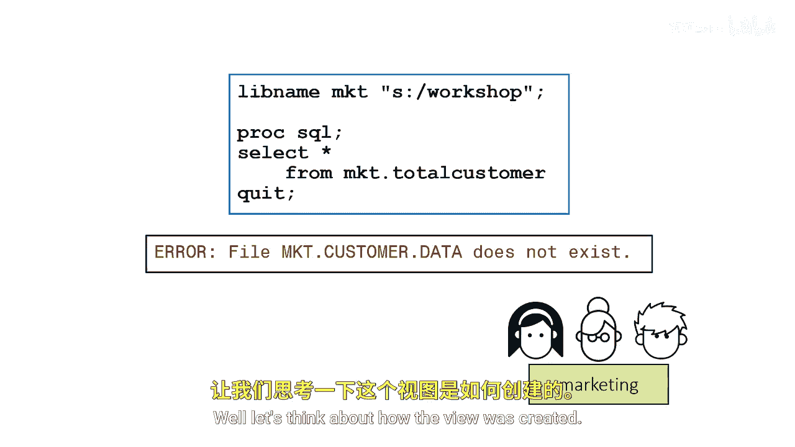
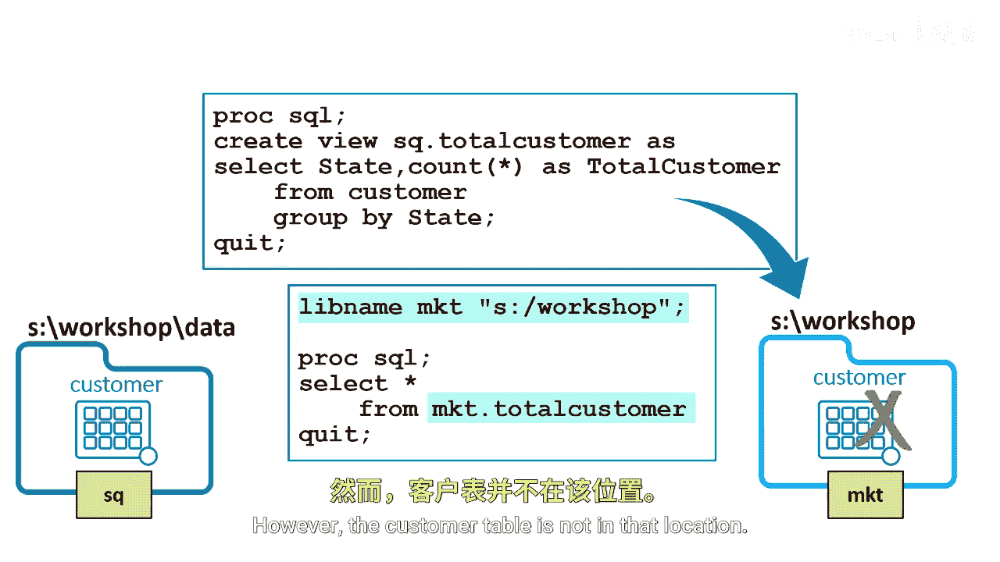

# SAS【中英⚡SAS高级程序员 专项课程｜SAS Advanced Programmer Professional Certificate】 p74 P74 05_使视图可移植 -BV1Cfe3z3EoA_p74-

According to ANsI standards， a view must reside in the same physical location as a contributing table or tables。

So the implicit Libraryre for the table in the F Cla is the Libre of the library that contains the view or the SQ library and the S Work data folder。

By ANSI standards， because the view and the data source are in the same location。

 you specify a one level name for the table and the front clause。

The one level name does not designate temporary tables in the SASWork Library。Instead。

 the one level name indicates that the view and its source tables are stored in the same location。

Suppose a marketing team moves a view to their S workshopshop folder and defines the MKT library there。

Then they execute a query using the view but receive an error that the customer table doesn't exist Why Well let's think about how the view was created。

The stored query uses the one level naming convention。

 so ProC SQL assumes a customer table is in the SQ library。

This violates the one level anNsI Naming convention。

When marketing moved the view and ran a query using the view。

 the stored query assumes the customer table is now in the MKT library in S Workshop。However。

 the customer table is not in that location。

By using A enhancement， you can create a view that's stored in a different physical location than its source tables。

In other words， you can make the view portable。When you create a permanent view with permanent tables in the from clauses。

 add the using clauses to specify the location of the libraries to make your view portable。

The usinging clauseuse is an embedded live name statement that enables you to assign a livere that's used for the source tables。

This using clause specifies the location of the customer table， S workshop data。

 while the view is located in S Workshop。This is called a live name clause because it appears within another clause。

In general， when you create a permanent Pro SQL view based on permanent tables。

 it's good practice to use the using clause。The using clause must be the last clause in the Cate View statement。

