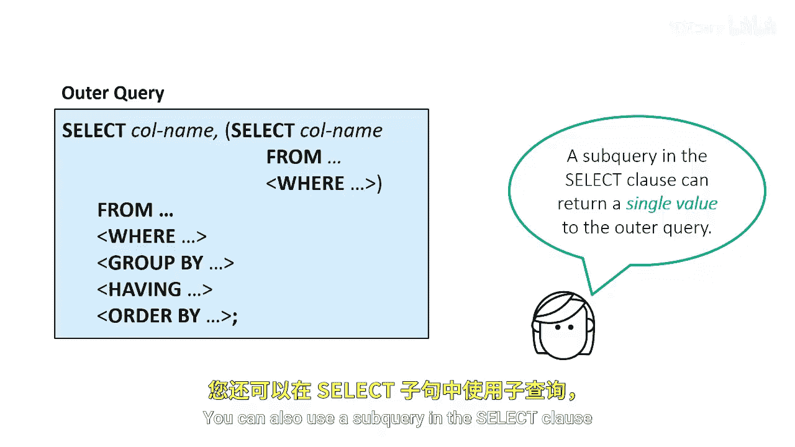
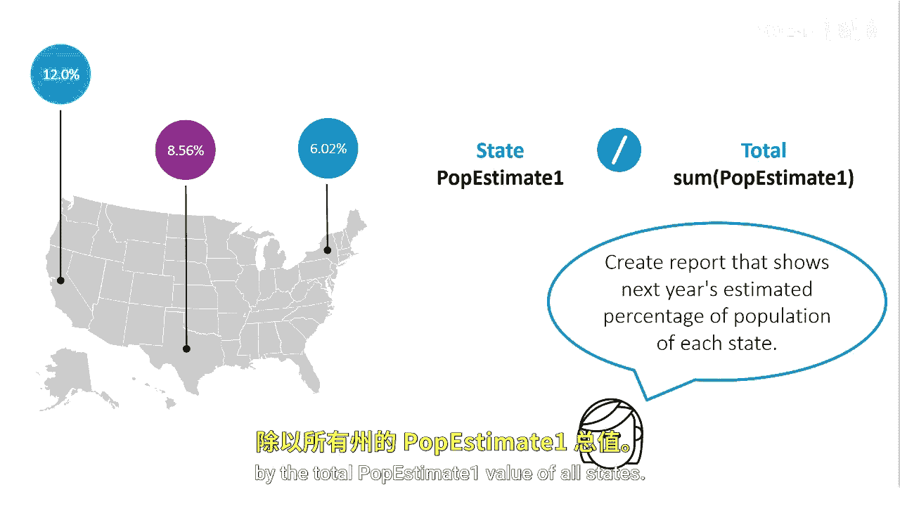
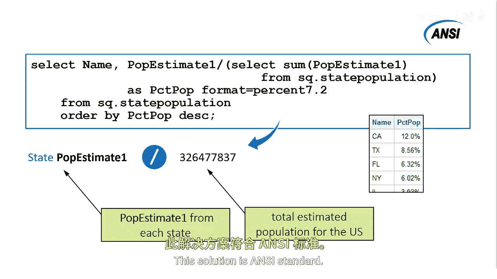

# SAS【中英⚡SAS高级程序员 专项课程｜SAS Advanced Programmer Professional Certificate】 p75 P75 01_在SELECT子句中使用子查询 -BV1Cfe3z3EoA_p75-

You can also use a subquery in the select clause to return a single value to the outer query。

For example， suppose we want a report that shows next year's estimated percentage of population for each state based on the total estimated population。

So we need to divide each state's P estimate1 value by the total P estimate one value of all states。

We can use a subquery in the select clause for this task。

This subquery uses a sum function to sum the P estimate1 value from the state population table and returns the total estimated population for next year。

After the subqueer resolves， this value is used as a denominator to calculate the percentage for each state。

This solution is anNsy standard。

