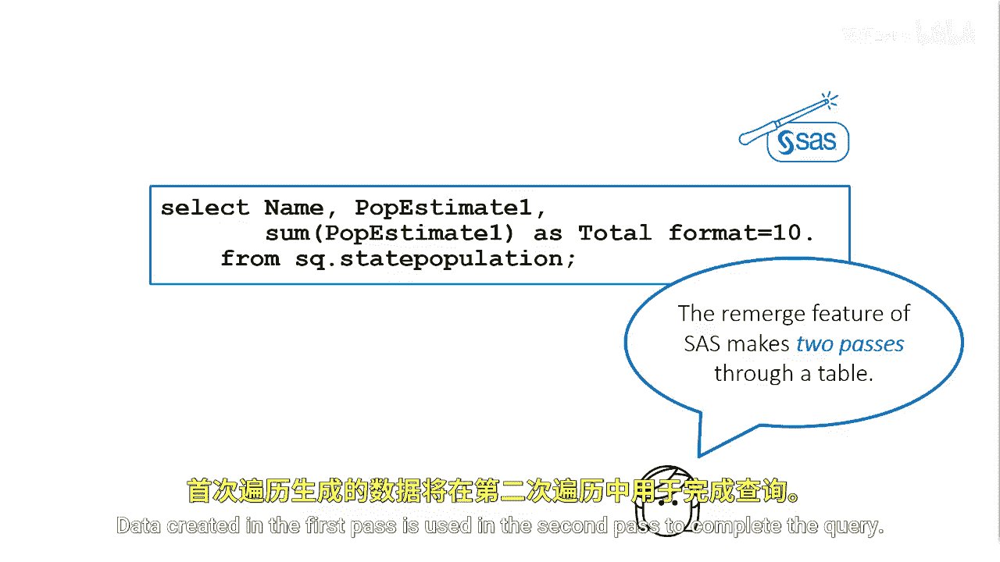
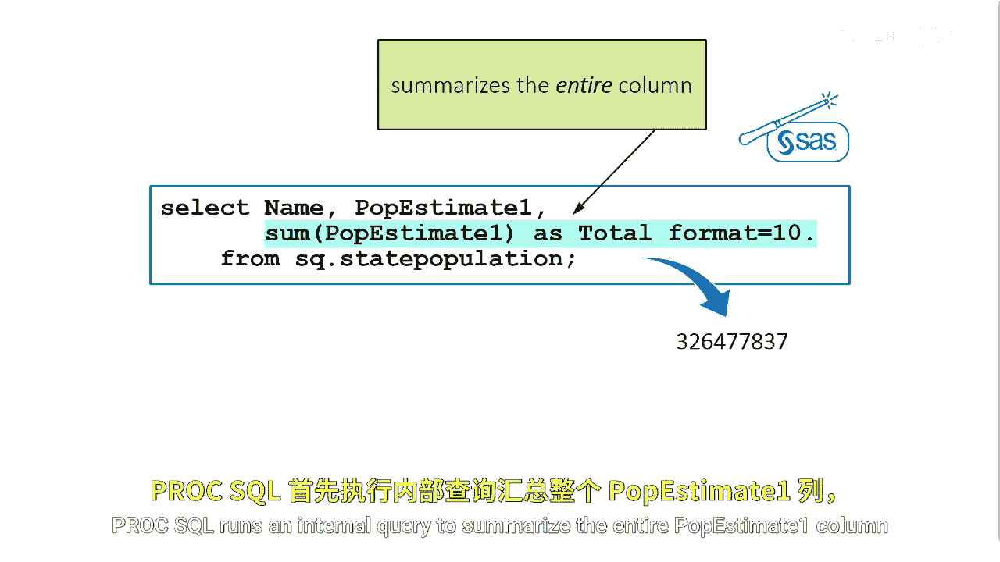
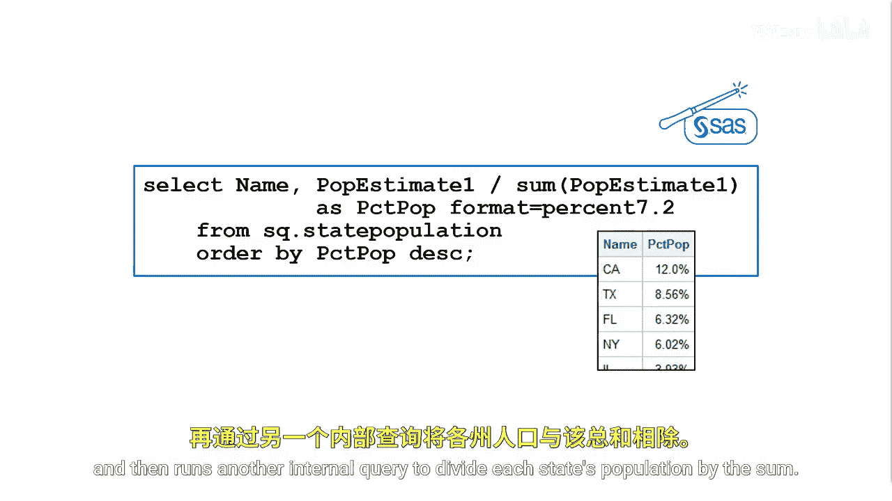

# SAS【中英⚡SAS高级程序员 专项课程｜SAS Advanced Programmer Professional Certificate】 p76 P76 02_在PROC SQL中重新合并汇总统计量 -BV1Cfe3z3EoA_p76-

If we want to use the SAS enhancement to create the same report， we can。

A great SAS enhancement to the SQL language is the ability to use a summary function to cause the same calculation to repeat for every row。

This occurs whenever ProC SQL remerges data。Remerging occurs when a select clause contains a column created by a summary function。

 other columns that are not summarized， and there's no group by clause。

The remerged feature of Pro SQL makes two passes through a table。

Data created in the first past is used in the second past to complete the query。

ProCSQL runs an internal query to summarize the entire P estimateimate1 column and then runs another internal query to select each name and P estimateimate one value from each row。

The calculated value of P estimate1， which is total， repeats for every row。

When a query remerges data， ProCSQL displays a note in the log to indicate that data remerging has occurred。

Remerging only allows you to remerge data that's in a table in the outer query。

To find the percentage of the total USS estimated population that resides in each state。

 you construct a single query that performs the following tasks。

 the sum function summarizes the P estimateimate1 column to obtain the total estimated population for next year。

And each state's population is divided by the summarize P estimate1 value。

ProSGll runs an internal query to find the sum and then runs another internal query to divide each state's population by the sum。

