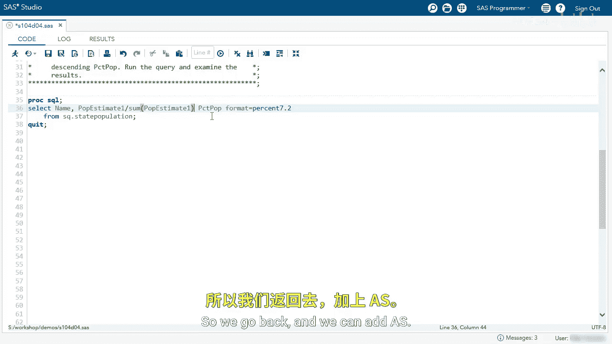

# SAS【中英⚡SAS高级程序员 专项课程｜SAS Advanced Programmer Professional Certificate】 p77 P77 03_演示：重新合并汇总统计量 -BV1Cfe3z3EoA_p77-

Let's reemge summary statistics in this query I'm selecting the name and the P estimateimate1 from state population。

 and then I'm also using a sum function with one argument， P estimateimate 1。

 I'm going to format that using comma 12， let's run this query。

Here we can see we have every row for name and P estimate1。

 and then we can see the summary statistics have been remerged。

 we have one value all the way down each row。😊，Let's go to our log。And we can also see our note。

 the query remerges summary statistics back with the original data。

So this isn't exactly what we want， but we can use this to solve our problem。

I'm going to divide P estimateimate1 by the sum of P estimatet1。I'm going to name this PCT popop。

P percent population。And then I'm going to format this using the percent format。And then we'll say 7。

2。Now let's run this query， each row for P estimateimate1 will be divided by that single value of P estimateimate。

What did I forget here， we forgot the as to name our column so we can go back and we can add as。

And now let's rerun our query。

And now we can see these are the results we were looking for。

 we want to see the percentage of population in each state from the total population。

But I'm not done， I actually want to order this value， so let's go back。Let's add an order by clause。

We want to order by PCT Pop and descending order。Here we can see California has the highest estimated population for next year at 12%。

 followed by Texas， Florida， and so on， and if we go to the bottom。

We can see Wyoming and Vermont with 0。19 and 。18。We can also check the log and see we remerge summary statistics。

And this was what we wanted， we wanted these values。

 and we wanted to use SASA's enhancement of remerging these summary statistics。

