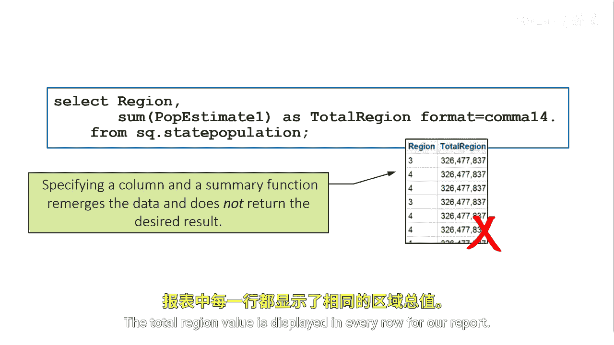

# SAS【中英⚡SAS高级程序员 专项课程｜SAS Advanced Programmer Professional Certificate】 p78 P78 04_控制重新合并 -BV1Cfe3z3EoA_p78-

Remerging can be a powerful tool， however， it doesn't always provide the desired result the most common example is when you forget the group by clause in a query。

In this code， we want to find the total estimated population for next year for each region。

We write our code and select regionion and the sum of P estimate1 from the table because we didn't include the group I statement。

 we accidentally remerged the data and get an answer we don't expect。

The total region value is displayed in every row for our report。

You can disable the remering of data when using summary functions when you use a summary function in a select clause or in a having clause。

 ProcSQL might remerge the data。If you set the PRC SQL No remerge option or the No SQL remerge system option。

 ProC SQL will not process the remerrgging of data。

Submitting the query with the no remerge option produces no output and results in an error message in the log。

The query requires remerging summary statistics back with the original data；

 this is disallowed due to the no remerge ProC option or no SQL remerge system option。

