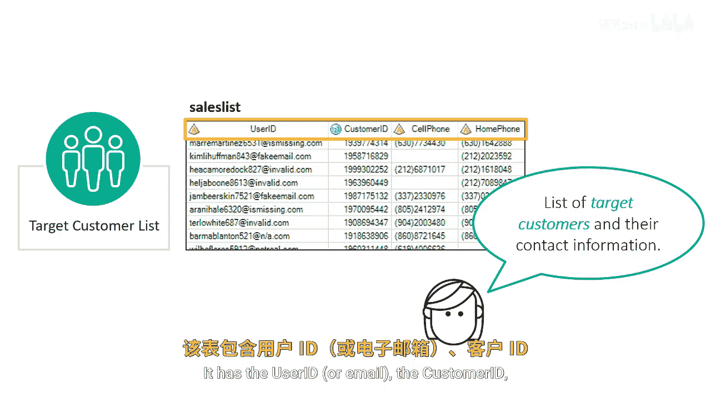
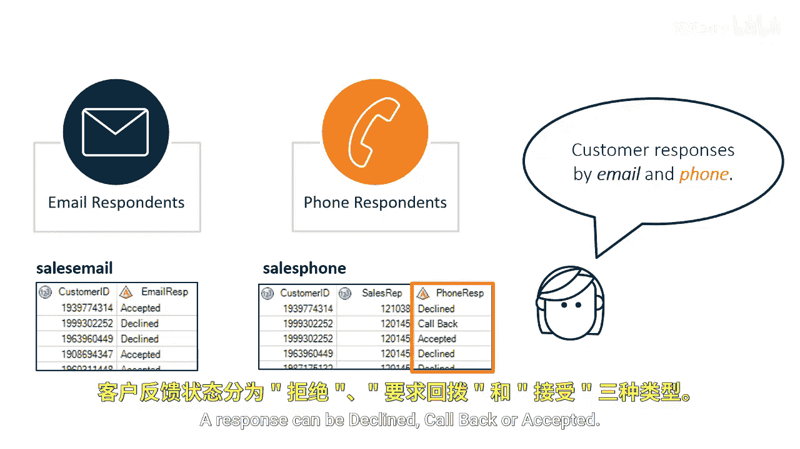
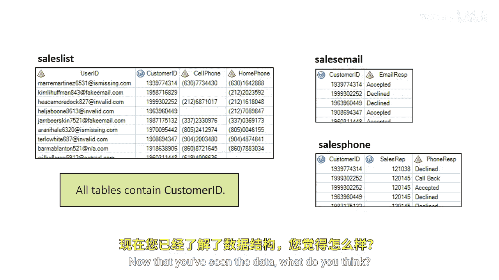
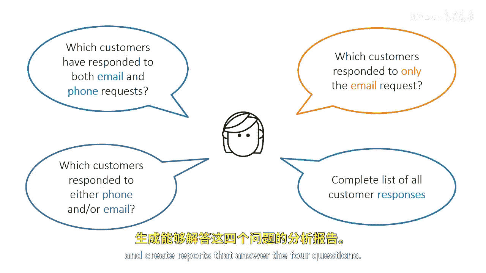

# SAS【中英⚡SAS高级程序员 专项课程｜SAS Advanced Programmer Professional Certificate】 p81 P81 01_使用集合运算符合并数据 -BV1Cfe3z3EoA_p81-

Suppose your manager has requested four reports regarding all target sales contacts by phone or email。

The company wants to contact each of the target customers and determine which customers need to be contacted again to retrieve a response。

Our goal is to analyze our contact with our customers。The report should answer four questions。

Which customers responded to both email and phone requests？

Which customers responded to either phone and or email。

 which customers responded to only the email request。

 and is there a complete list of all customer responses？

If we had a single table that contained all the information about our customers and contact methods。

 our programming task would be straightforward。

However， the data required to answer these questions is stored in three tables， sales list。

 sales email and sales phone。

The sales list table contains contact information for customers we want to target in our campaign。

It has a user ID or email， but customer ID and phone numbers where the customer can be reached。

The sales email table contains responses from customers who have either accepted or declined our offer via email。

 and the sales phone table contains responses from phone sales。

If the customer isn't listed in these tables， that means the customer hasn't responded to us at this time。

Customers can be listed in the sales phone table twice if a callback was requested by the customer。

Let's now compare how the data is organized。Both tables contain a custom ID column and a response column。

 but the response column is named differently。These two tables also store responses differently。

Sales email has one response per email and the response can be either accepted or declined in sales phone。

 the sales rep column indicates a sales rep who made the call and the phone response column indicates a response。

A response can be declined， callback， or accepted。

All three tables contain a customer ID column， but the columns are not in the same position。

Now that you've seen the data， what do you think？

Can you answer any of the manager's four questions by querying only one table？

All of these questions require you to query multiple tables。

You can use set operators to vertically combine queries and create reports that answer the four questions。

