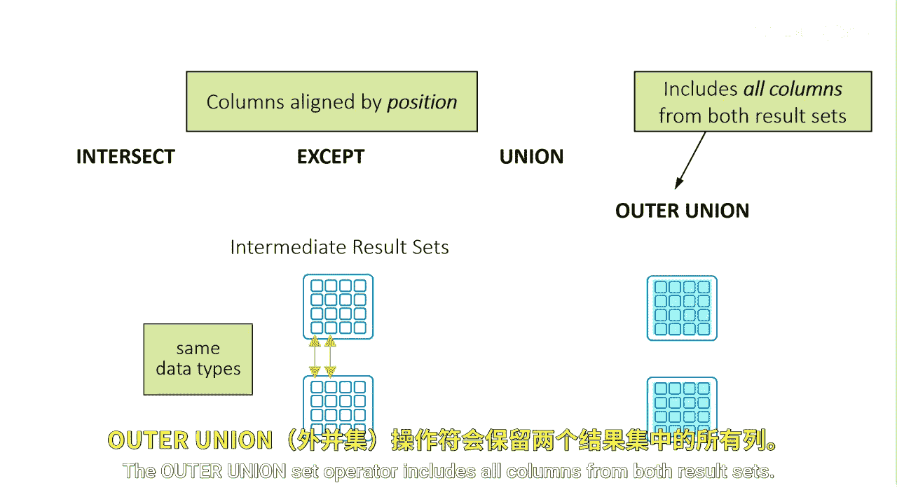

# SAS【中英⚡SAS高级程序员 专项课程｜SAS Advanced Programmer Professional Certificate】 p82 P82 02_什么是集合运算符 -BV1Cfe3z3EoA_p82-

How does a set operator work？A set operator vertically combines the intermediate result sets from two queries to produce a final result set。

Their intermediate result sets have rows and columns and a set operator acts on the intermediate result sets。

 not directly on the input tables。To vertically combine the results of two queries。

 you can use one of four set operators， intersect， accept union and outer union。The intersect。

 Ac and union operators are specified in the ANSI standard for SQL。

The outer union operator is assassin enhancement。To explain the results of each method will represent two tables as circles in the simplified Venn diagram。

The intersect operator returns rows from the first query that also occur in the second。

 in other words， unique rows that are common in both queries。

This is the overlapping area of the Venn diagram。The Ac operator returns rows that result from the first query。

 but not from the second query， in other words， unique rows in the first query only。

This is the top circle in the Venn diagram。The union operator combines two query results。

It produces all the unique rows that result from both queries。That is。

 it returns a row if it occurs in the first table， the second or both。

This is the top and bottom circles of the Venn diagram。Union does not return duplicate rows。

 if a row occurs more than once， then only one occurrence is returned。

The outer Union operator combines the results of both queries。

It includes all rows and columns and nothing overlaps。Therefore。

 the diagram shows two separated circles。

The default behavior of columns is slightly different between the set operators。

The intersect except and union set operators align columns by position in both result sets。

For example， set operators combine columns from two queries based on their position in the reference tables without regard to the individual column names。

Columns in the same relative position in the two queries must have the same data types。

The column names of the tables in the first query become the column names of the output table。

The outer Union set operator includes all columns from both result sets。

