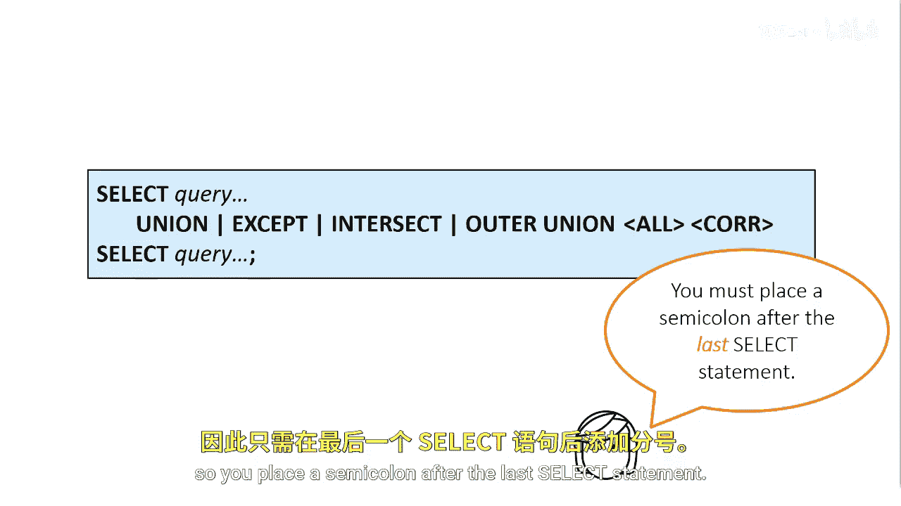
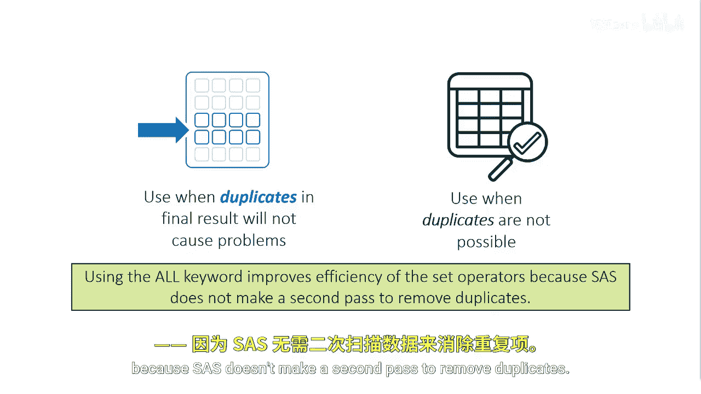
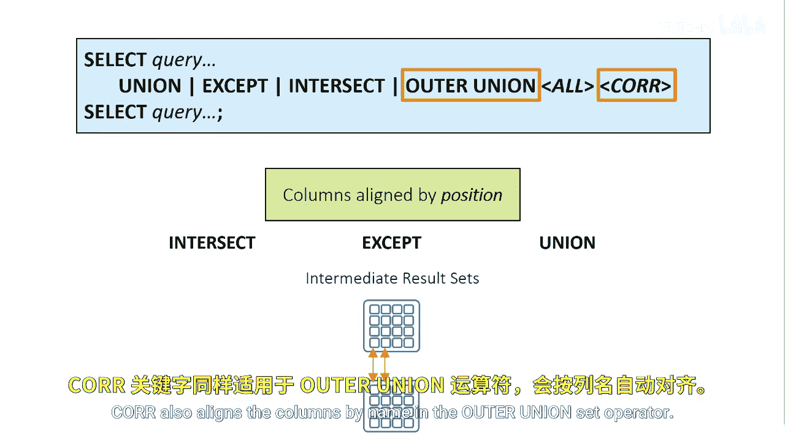

# SAS【中英⚡SAS高级程序员 专项课程｜SAS Advanced Programmer Professional Certificate】 p83 P83 03_使用集合运算符 -BV1Cfe3z3EoA_p83-

A set operation consists of two sets of query clauses that are combined by one of the four set operators。

The entire set operation is a single select statement。

 so you place a semicolon after the last select statement。

When you work with set operators， you're not limited to their default behaviors。

Remember that the intersect except and Union set operators produce only the unique rows by default。

Proc SQL must make a second pass through the data to eliminate the duplicate rows。

To change the default behavior for rows， you can add the all keyword to the code and SAS won't remove the duplicate rows。

You should consider using the all keyword when either of the following conditions occurs。

The presence of duplicates in the final results set will not cause problems。

 and when duplicates are not possible， for example。

 if there's a unique or primary key constraint on the column，Again。

 using the all keyword improves efficiency of the set operators because SAS doesn't make a second pass to remove duplicates。

You can use a core keyword to modify the default behavior for columns。Remember that the intersect。

 except in union set operators align columns by their position in their intermediate result sets。

The core keyword aligns columns that have the same name in both intermediate result sets。

Core also aligns the columns by name in the Outer Union set operator。

