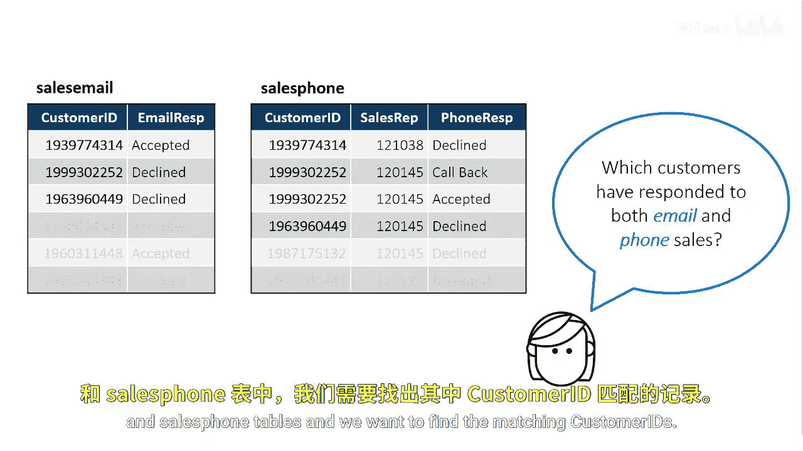
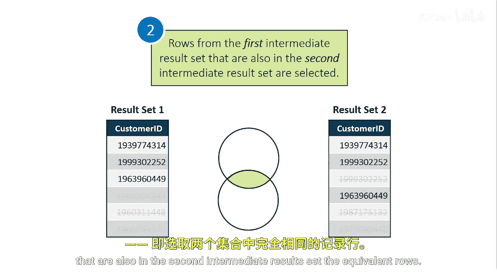

# SAS【中英⚡SAS高级程序员 专项课程｜SAS Advanced Programmer Professional Certificate】 p84 P84 01_使用 INTERSECT 运算符 -BV1Cfe3z3EoA_p84-

We want to start by finding customers who responded to both our email and phone call attempts。

 no matter if they accepted or declined our offer。We're looking for our highly responsive customers。

This list of customers who responded to email or phone are in the sales。

 email and sales phone tables， and we want to find the matching customer IDs。

To find the customer IDs that intersect the two queries。

 we're going to use the intersect set operator。In this example。

 we're referencing the customer ID column only。The first query returns all customer IDs from the sales email table。

We then want to intersect those results with the results set two。

 the list of customer IDs from the sales phone table。

The intersect operator has two steps。The first step is to remove any duplicates in each of their intermediate result sets。

In this case， there are no duplicate rows in results set one。

 but there is a duplicate row in result set two， so it's removed。Next。

 the intersect operator selects rows from the first intermediate result set that are also in the second intermediate result set。

 the equivalent rows。

The results of the Intersex Se operator lists customer IDs that are extremely responsive to our sales attempts。

