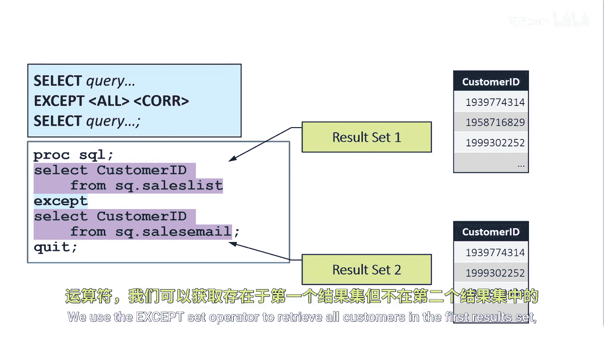
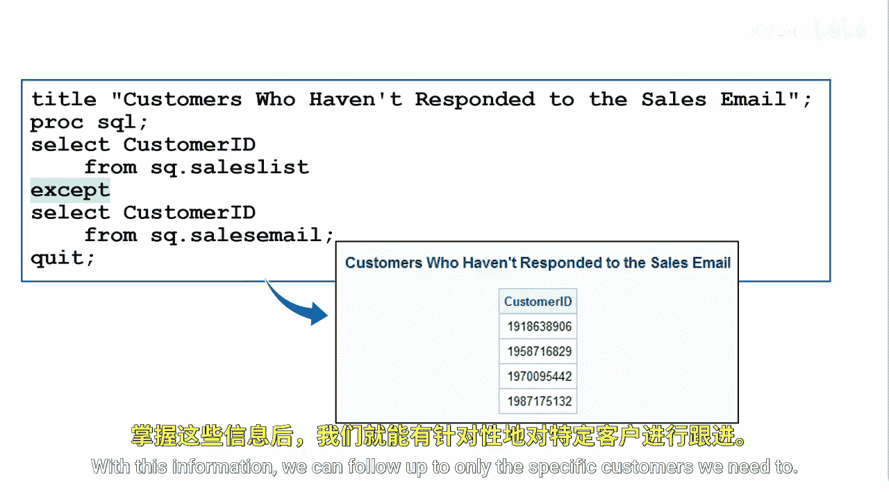

# SAS【中英⚡SAS高级程序员 专项课程｜SAS Advanced Programmer Professional Certificate】 p85 P85 03_使用 EXCEPT 运算符 -BV1Cfe3z3EoA_p85-

In this scenario， we sent only email offers to our target customers from the sales list table。

We haven't had a chance to call them yet， but we only want to spend time calling customers who haven't responded to our initial email one method to create a list of these customers is to use the Ac set operator we'll select all target customer IDs from the sales list table as our first results set。

And then select customer IDs from the sales email table for a second results set。

We use the Ac set operator to retrieve all customers in the first result set， but not the second。

The Ac set operator follows the same steps as the intersect operator it first searches for duplicate rows in each of their intermediate result sets and removes them。

In this case， there are no duplicate rows in either results set because we have currently only sent one email to each customer in our sales list。

Next， rows from the first intermediate results set that are not in the second intermediate results set are selected。

Our results are a list of customers who have not responded to our email。With this information。

 we can follow up to only specific customers we need to。

