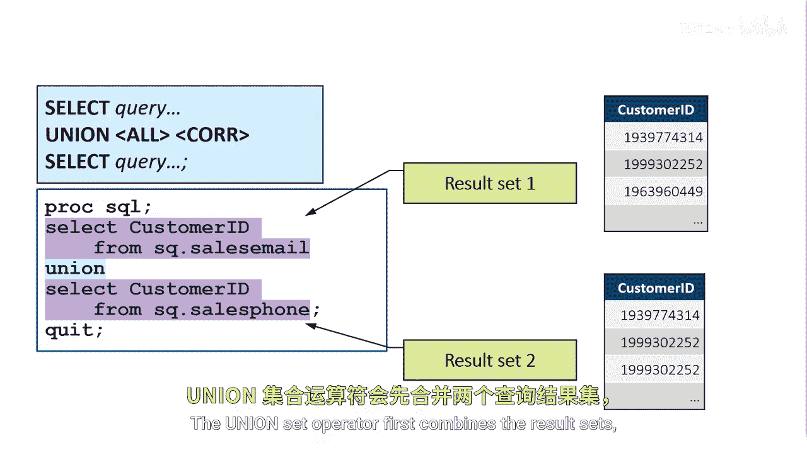
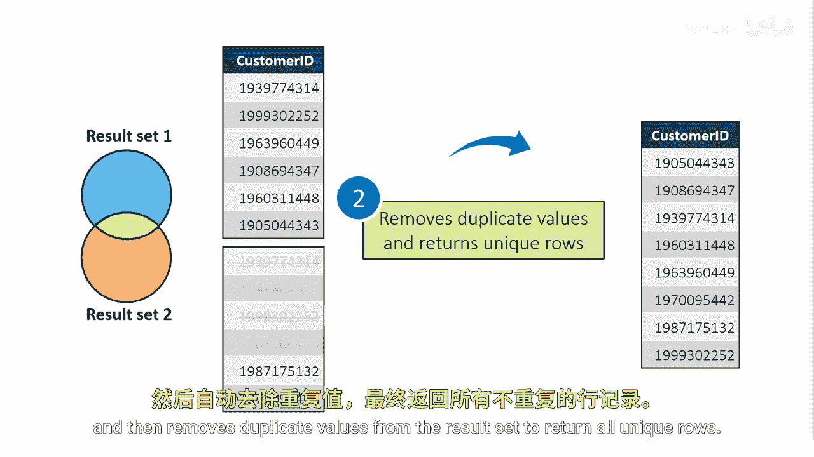

# SAS【中英⚡SAS高级程序员 专项课程｜SAS Advanced Programmer Professional Certificate】 p86 P86 05_使用 UNION 运算符 -BV1Cfe3z3EoA_p86-

We want to find customers who responded to either our email or phone call attempts。

 no matter if they accepted or declined our offer。Then we want to use this information to find the total number of unique customers who responded to either phone or email。

We want to select the customer IDs from the sales email table and use the results of the query to combine with a query of customer IDs from the sales phone table。

The union set operator first combines the result sets。

And then remove duplicate values from the results set to return all unique rows。

