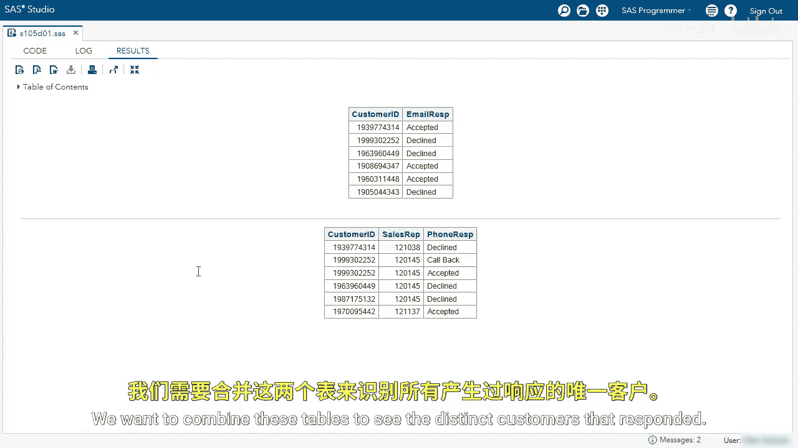
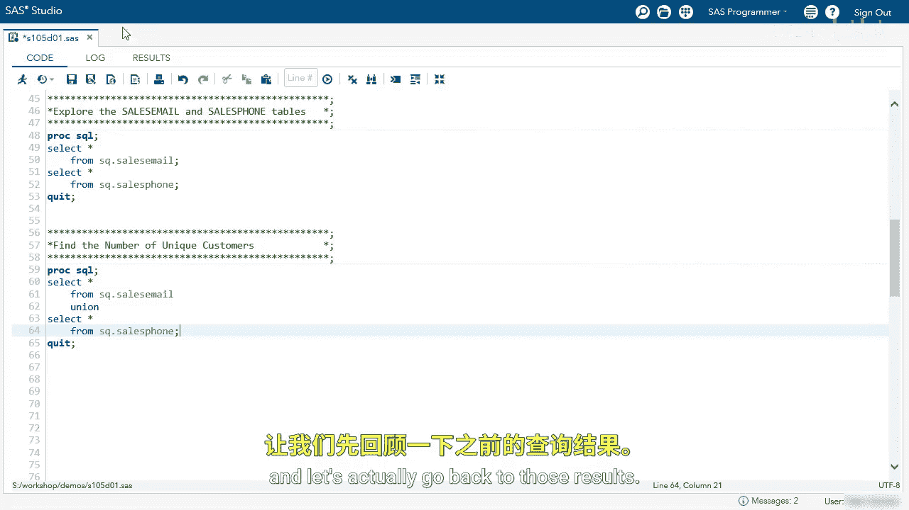
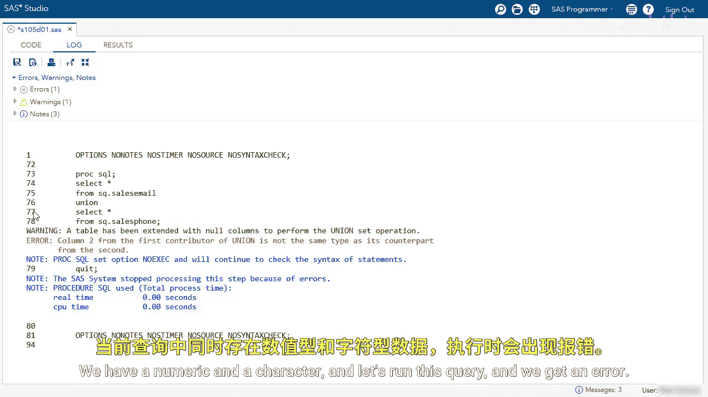
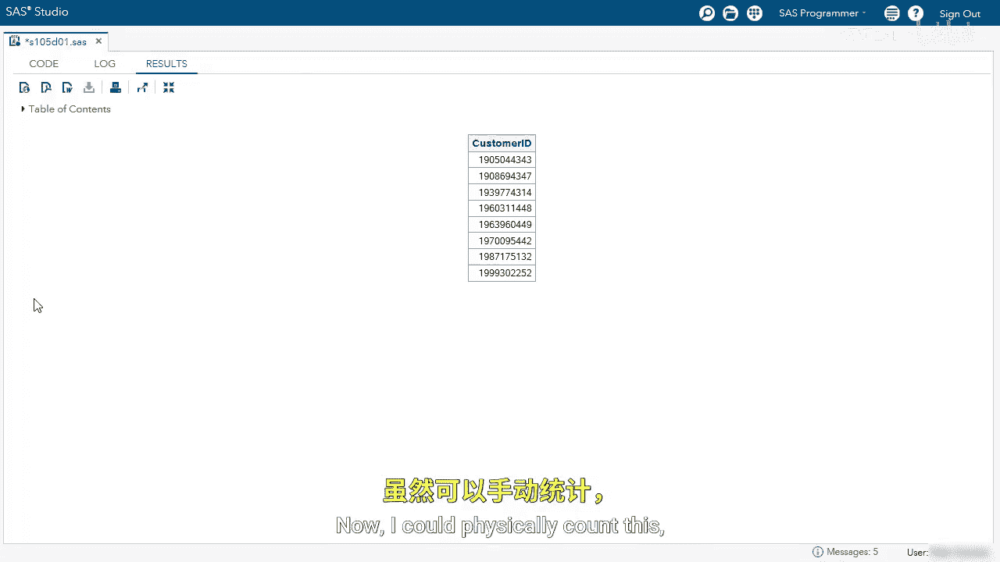
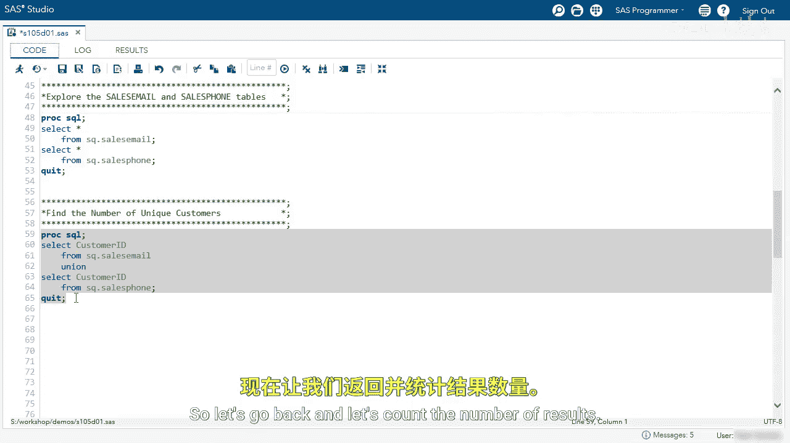
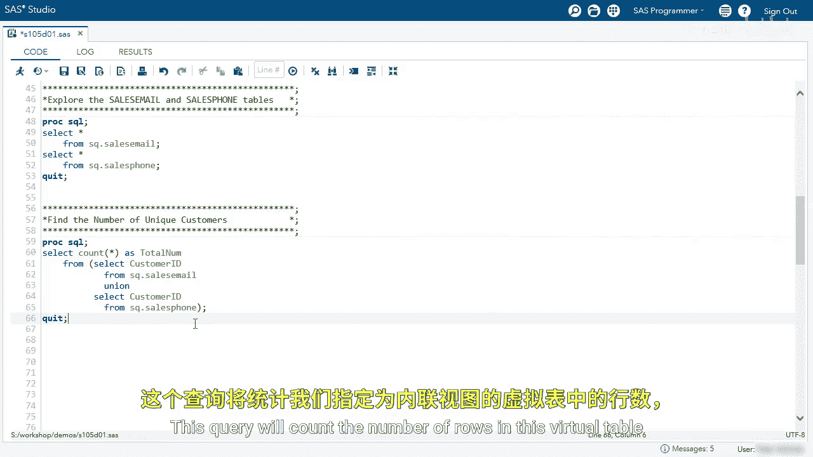
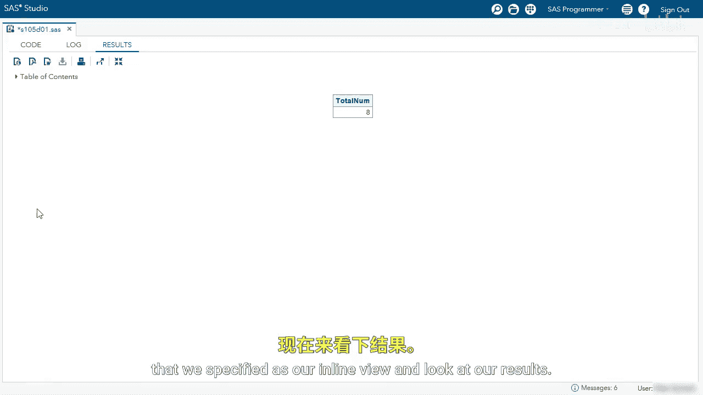

# SAS【中英⚡SAS高级程序员 专项课程｜SAS Advanced Programmer Professional Certificate】 p87 P87 06_使用 UNION 运算符查找所有唯一行 -BV1Cfe3z3EoA_p87-

We're going to use a union set operator to count the number of unique customers who responded to an email or phone sales attempt。

 The first thing I'm going to do is explore the sales email and sales phone table that we've seen previously。

We can see both tables。 The first table has customer ID and email response。 again。

 we can see accepted or declined， and then our second table is the phone table。 We have customer ID。

 the sales rep who called， and then the response。We want to combine these tables to see the distinct customers that responded。

I'm going to start by first selecting all from Sq。sales email。Next。

 I'm going to use a Union set operator。😊，And then select all from Sq。 sales phone。Before I run this。

 I want you to think what's going to happen。 we had the two columns in the first table。

 the three and the second， and let's actually go back to those results。

I want you to focus on that second column there we have email response in the first table and then sales rep in the second。

 we have a numeric and a character。

And let's run this query。And we get an error。 We can see column2 from the first contributor is not the same type as its second。

So let's go back to our code。😊，From what I recall custom IDs in both tables。

 so instead I'm going to add the core keyword。The core keyword will match on column names。

 customer ID。 Let's rerun the query and see our unique list of customers。

And now we have it。I'm going to go back。I like to be specific when I code。

 So instead of using the core modifier， I'm just going to specify the customer ID column。

 I'm going to remove the core modifier。And then specify the custom ID column in both results set。

I'm going to run the query。And we now have the same results， again， I just like to be more specific。

Our final goal is to count the number of unique customers Now I could physically count this。

 but typically you're going to be working with bigger tables。 so let's go back。

And let's count the number of results。What I'm going to do is I'm going to use another select statement。

And I'm going to specify the count function。And I'm going to use the asterisk count all rows。

 I'm going to name this total nu。Next， I'm going to use the queries that we use in the Union set operator as an inline view。

Specify the from clauses。Next I'm going to place this query in parentheses。

I'm going to clean up my code。This query will count the number of rows in this virtual table that we specified as our inline view。

And look at our results， we had eight distinct customers who have responded。

