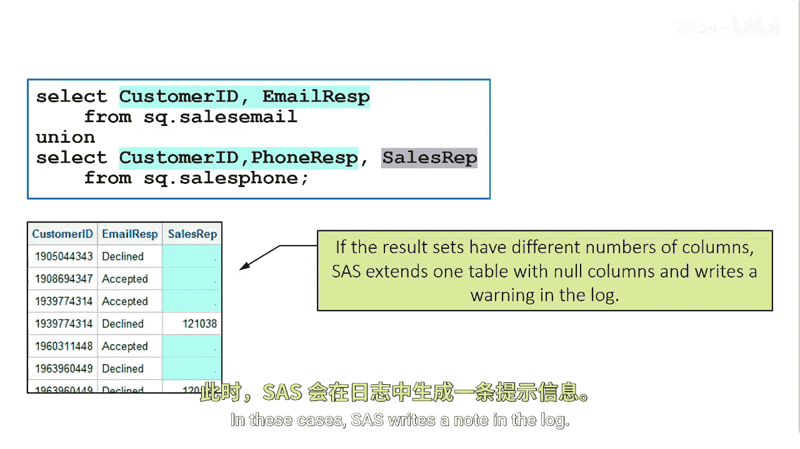

# SAS【中英⚡SAS高级程序员 专项课程｜SAS Advanced Programmer Professional Certificate】 p88 P88 07_UNION 运算符的默认行为 -BV1Cfe3z3EoA_p88-

The Union set operator works in a different order than the intersect and accept operators。

The Union set operator first combines results sets， then removes duplicate rows。

Interssect and accept remove duplicate rows， then combine results sets。

If the two intermediate result sets have a different number of columns。

 then SAS extends one table with null columns so that the two intermediate result sets will have the same number of columns。

If results at one is extended with null columns， then the name of the column and results that two will be used in the final results。

In these cases， SAS writes a note to the log。

