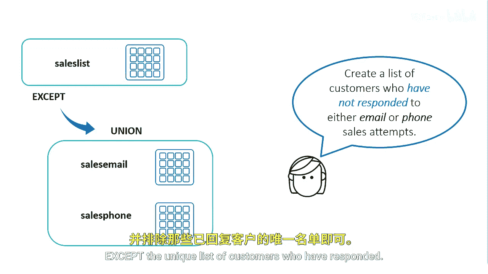
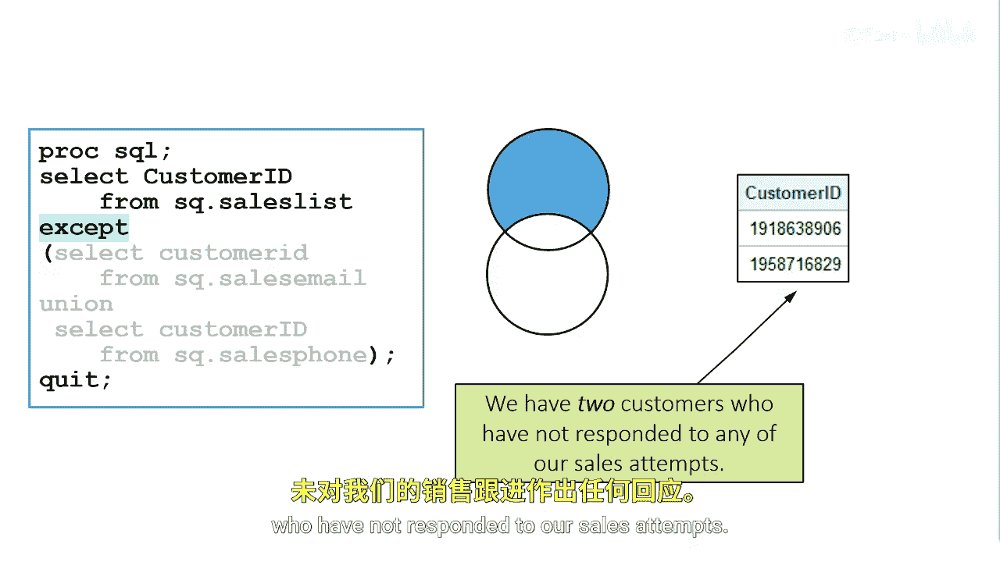

# SAS【中英⚡SAS高级程序员 专项课程｜SAS Advanced Programmer Professional Certificate】 p89 P89 08_组合集合运算符 -BV1Cfe3z3EoA_p89-

What if you want a list of customers who haven't responded to either email or phone sales attempts？

You can combine the sales email and sales phone tables using the Union set operator to find a unique list of customers。

Then you specify that you like everyone in the sales list table except the unique list of customers who have responded。

In the code， the second query returns a unique list of customers who have responded to your sales call or email。

Then we select all customers in the sales list table except the results of the union。

The returning results leave us with two customers who have not responded to our sales attempt。

