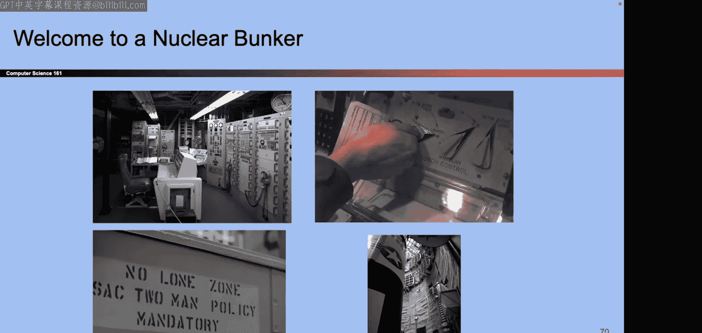
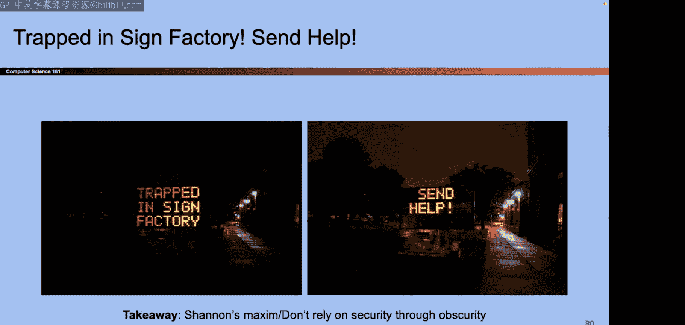
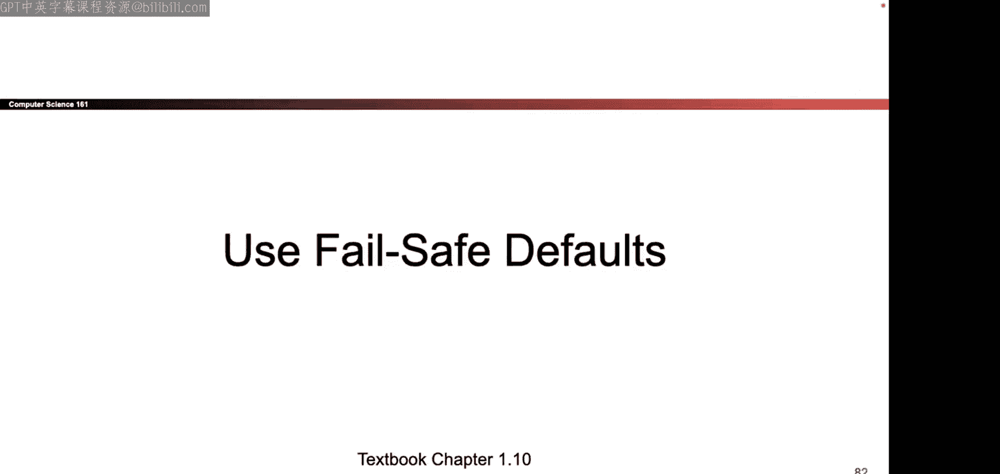
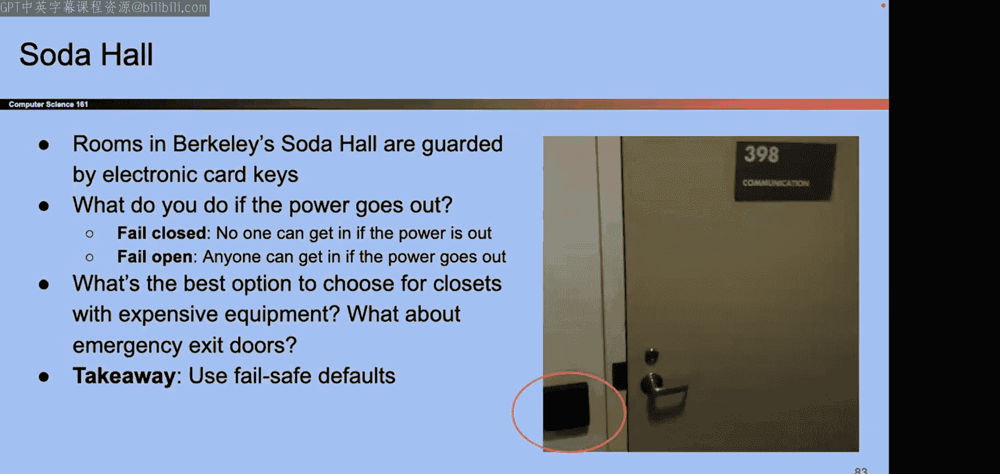

# UCB《计算机安全｜CS 161 Fall 2023 ｜ Computer Security at UC Berkeley》Calude-3.5翻译 p01 -01--CS161 FA23- Lecture 1 - Introduction and Security Principles.zh_en -BV1YGbceREDs_p1-

ok。Okay。I'm going to start reading out answers to the midterm solutions。

 so the sooner you quiet it down the more you're going to care so the first answer is true second answer is E and C third answer is f。

Fourth answer is。Yeah， those aren't actually the solutions， but that worked。Hello everyone。

 you' all here for CS1621， right？ok。Let's get started。So today's kind of two part lecture。

 the first part， I will speed around a bunch of logistics and then for the second part。

 we'll talk a bit about some security principles。Okay if you're just coming in you have to actually sit in a chair or the fire marshal is gonna get mad at us no standing。

 no sitting on top of each other nothing funny okay great so this is me come say hi sometime in the interest of time I will let you read that on your own time we have a bunch of Ts in this class like join something of them but they haven't sent me their photos yet so if you want to see what they look like you're gonna have to come back on Friday but I promise you we have Ts and they're gonna interact with you and they're very talented but I don't know what they look like yet so come back Friday。

Okay， let's talk about what you'll learn。You stay in this class all the way so this is a security class and so what we mean by that is we're going teach you kind of a different philosophy about how to think about how you're writing your programs so instead of thinking about random things that go wrong like bugs or mistakes we want you to think adversarally want you to think what would happen if somebody was trying to mess with your coat on purpose not necessarily by accident。

 we'll talk about if someone has a threat， how do you assess for its significance something pretty cool is we'll talk about realworld tools and real worldd protocols so this is just theoretical stuff。

 we'll show you tools that you can encounter in the real world etc cea so pretty cool class and we'll show you a lot of mistakes and hopefully you won't make them so that's good。

Okay。So here's the way that we organize this class。

 so different classes have different ways that they're organized and the way that we organize our class is we have basically four major units so we have like a mini unit on the interaction that's today and it'll be over with and then we have a unit of like three weeks on memory safety where we'll talk about attacks on code and why you should never write code and C and stuff like that and then we'll have a unit on cryptography for around two or three weeks talk about how do you securely send information from point A to point B if an attacker is trying to spy in your communications trying to modify your communications。

Then we'll spend around two to three weeks on web， talk about attacks on the web and then we'll spend where we on network security talk about attacks on the internet and also what the difference is between the web and the internet I don't know if that actually added up to 14 weeks but let's pretend that it did and if we have leftover time we'll try to give you some miscellaneous topics that are interesting sometimes we beg some random famous people we like yout want to come give yes lecture sometimes they say yes and they say no so I don't know maybe in December you'll get it like a really famous guest lecture from like a tutoruring award winner or you'll just get me like ship hosting about some topic so we know stick around and we'll see okay。

One of the really cool thing about this class that I liked a lot is there's a lot of tools that aren't necessarily security related。

 but they're tools that you pick up as you go with really cool and even if you never touch security again or you proing something completely unrelated these are all tools that you can take with you that I think are valuable so in the first unit we're going to show you a lot about X86 assembly so if you're coming from 601C which I think is a lot of you you might have seen risk5 which is the assembly language that they use but in real life most people use X86 which is a different assembly language so we're going to show that to you and you're gonna to have some experience with that which is great also really good is in the first unit you're gonna to be using GDP the debugger a lot so at least for me that first unit got me really good at debugging when I used to not be so comfortable in it so I think that's pretty good even if you never touch security program again being able to debug I think is pretty useful。

In the crypto unit， something pretty cool is even if you're never going to become like a person writing cryptographic software。

 we're also going to show you how you can analyze tools so if some company walks up to you and is selling you something we can figure out do they know what they're talking about are they just selling you something in full of B so just knowing how to speak。

The cryptographic language I think is useful just to know what you're buying or what software you're using or what tools you're using in the Web security unit if anybody cannot get into CS169 you're in the right place because we're going to give you a little bit of that in the Web security section and if anyone can't get into CS168 has that even been offered in the last like century It know okay but if you can't get into CS168 well then you're also in the right place because we're going to give you a bit of overview on the networking during the networking unit so before we can tell you how to break all the networking protocols we have to show you so it's not like a comprehensive replacement for CS168 but I guess it's better than nothing。

Well so if you're here， hopefully you've gotten some prerequisites down。

 there's a quick summary of them if you're not too confident on them。

 so we ask for CS62MB and the reason why we ask is because in Project two in particular you're writing a pretty large code base mostly from scratch and62Mmb is the class that teaches you how to write large code basis how to work with them and still organized so if you don't have 60MB that's okay。

 but do be prepared to write and design a large program by yourself or hopefully you have some skill from some other class they will prepare you for that but that's why that prerequisite is there we don't enforce it but that's why it's there。

AndThen there's a CS70 prerequisite so the reason why that one is there I know it's kind of scary but it's because in the cryptography unit we have a lot of mathematics in that unit it's a very mathbased and theorybased unit so we do need you to be able to say follow like approve or if we write a notation like you know for all for each or something we need you to kind of be able to pick up that language or speak it with us so that's really all we need from 70 we don't need you to remember really specific things so I'm not going to walk up to you and I't be like Chinese remainder theorem and you have to know what it is but like you know hopefully being able to kind of speak that language of mathematics is mainly what we need and we'll do our best in review as we go so hopefully that's right。

I'd say the most important prerequisite and the one that we actually say don't take this class if you don't have this prerequisite is 61C and the reason for that one is because all of Project1 is about breaking C programs exploiting C programs in order to do that you have to have a pretty good understanding you how C programs work you have to understand how the C memory layout works you have to have seen assembly code in some form before and those are things that we just don't have time to teach you even though we'll have like one picture of prep you want it which is next Monday I guess but yeah we'll have one lecture if that lecture doesn't seem very clear to you or you go through that lecture and you're like all of this is total nonsense to me that might be a sign that this might not be big class for you maybe you have to go back and take 61C or prep that ahead of time if you really want to take this class without 61C you can but this is like an official warning that。

That class is a prerequisite， they don't enforce it。

 but we strongly recommend it for an actual reason。

Okay and if you are not sure we have some diagnostics as I said one thing you can do is just come to lecture on Monday next lecture is Monday right so come to lecture on Monday see how you feel about the content and that's when we check our 60 andC preparedness。

And then one for is that that's not official class。

 but it's just a general ability to pick up new programming languages so for reasons that are still kind of unknown to me。

 Project two isn't going and it's not a super common language as anyone actually programmed in going before fool people so yeah I don't know but if you haven't programming going before then that's something that you have to pick up as you go So being able to learn your languages is nice general skill to have as well and heroes you can put going on your resume after you're done question I saw on the course website there is some mention of they're gonna be someone said the course website mentions rust iss there rust coding that is news to me I didn't know there was rust in the course website so probably not unless the Ts have like rebel and added rest I don't think so。

O。Are there questions？All right let's keep going someone said what happens if you took6 UNC but forgot everything like I said come come on Monday and see if it sounds familiar at all and then go from there I guess but it's okay you don't have to talk perfect6 UNC knowledge you can always review as ego okay。

Great let's start talking about some more logistic stuff here's the question you've all been asking it's the enrollment so I think the class expanded sometime this morning。

 I not too sure， but basically we don't have control over that so the department of controls that not us you can have begging us for enrollment code I simply don't have any I can make up some letters for you but it's not an actual enrollment code so we don't really have any way to circumvent that if you're not a CS major。

 there's just nothing I could do I just can't add you so sorry you know I'm just here to enforce the policies I guess although there's one kind of slight note is that if you are say like you finish CS7 over summer and you're waiting to get declared there's a form you can fill out to get access while you wait to get declared but as soon as you get declared you might be able to enroll but again that's kind of no promises so。

That's the enrollment section so yeah we're trying our best to get as many people into the class as we can。

 but again we can't promise so if you're on the wait list our recommendation is to have a backup you know if you're on the wait list and you don't get off the wait list you can't come telling oh but he said you know like so you've been warned having a backup as our official recommendation but like you said we'll try to get as many people as we can。

诶。😊，And if you're a student from another university concur enrollment exchange student。

 then again the department has to approve those not us， so we have to wait。

 but as you're waiting we'll try to get it done by the end of the week and if by the end of the week you're still not approved and we'll just manually add you to stuff。

 hopefully they'll approve you first so we don't have to manually add you。

 save everyone a bit of trouble。Takeick questions about enrollment。Okay。

 is anyone actually on the waitlist？Okay， so most people are in， that's good。诶。

So let's talk about things that you can attend so there's one thing you can attend's called lecture if you're here I'm assuming you found it it's Monday Wednesday evenings because I'm not waking up early for this stuff we don't take attendance but know stuff by keep me a company otherwise I'll get lonely at the end so you can come in person you're sick or whatever you can come online there's 133 people online believe it or not and if you don't want to do that you can just watch a recording of me talking some other day and I won't be a so it's cool too so whatever makes you learn best it' fun by us。

There are discussions， those are taught by Ts， those start next week。

 we don't take attendance pick your favorite section and again there are some person sections are we having all my sections I think so but I have to double check with the Ts that might be a bit outdated but it'll be on the website and we'll try to post recordings if someone solving the worksheet but can't promise it。

That's kind of how discussions work。诶。😊，Those office hours if you have questions you can come talk to us I think the main disclaimer here is we've gone through COVID we've seen the in personson ticket between the online ticket we try to take both so our experience is that it is just faster to take tickets when you're in person so can help it's much easier to help you in person than it is online so our policy and we're not trying to be mean here but we're trying to get through as many of you as we can is when there's a lot of people waiting for help we're going to prioritize the people who are in person in the same room as us and then if we have time afterwards then we'll take the ones that are online so if you need help the fastest way to get help for you and the fastest way for us to help everybody needs help is to come in person if you like absolutely have to you've like contracted 20 different diseases in the same day like okay we can take an online ticket but just know that you might have to wait a bit longer we're gonna get to those if we have a chance which we might not so。

Just putting it out there， it's not to be mean， it's just because we want to get through as many people as we can。

Okay there。Okay。What's next on so in our experience they're more efficient that's why we're asking you to come in person'm not trying to be mean I hope okay theres two exams so try and save the dates I are those right I think they're right they seem like a fall date Okay so again if you can't make the exam we have a couple things we can offer but the way that I think about these is like it's not like pick your favorite time or pick your favorite way to take the exam it's more like。

If you can try to come in person at these times it's easiest for everybody but if you really。

 really have to like we understand that things happen so if you need to take it online not like well I feel like taking it or like oh I don'tna stay in bed but like if you need to take it online we understand but just know ahead of time that that's something you're opting into so there's a proctoring policy you need to opt into you know there's a misconduct case or something we reserve the right to take that away so like that's a privilege。

 not a right， you know what I mean but it's there if you need it okay so like you need it is cool but generally our expectation is that most people will be able to come in person because that's kind of the most efficient way to take care of exams Sam with the alternate exam right this is not for like oh 7 pm is too late I need to sleep in but more like if I really have a conflict then we understand you can take the exam right after so midterm alternate that starts at9 doesn't start tomorrow or like at 10 or whatever starts at9 and then final exam the alternate starts at six not。

not the day after not Saturday not the morning at okay so you've been warned we've had people email us like the date for the exam like I can't make it can I take it on Saturday and we're just like there was a slide right here so like tough like okay so you've been warned we're covering our bases here okay。

Questions on exams， discussions， whatever。Okay， sorry there's lot of these they might have to like jump up and down if you need me to answer your question Okay。

 what's next？Okay that's things you can attend or in the case of exams hopefully you will attend so here's some things you can use to help you out the throughout the class so there's a textbook it's free you don't have to pay for it。

Okay that's nice they're optional but this book is like written to supplement the lectures so you know hopefully they're useful but up to you whatever helps you learn best there's a website everything that we publish in terms of resources we'll put on the website so you know deep in your bookmarks pretty simple link okay someone asked about time conflict with the final I guess I missed it in Zoom chat but yeah again alternate there's one alternate time if you can make the alternate time great if you can't make the normal time and you can't make the alternate time then there's kind of how much we can do。

Okay， but those are the resources。Two main ones okay。

 here's stuff that we're going to add you to as you enroll or if you're already enrolled so Ed is the form if you have questions for us。

usual to be respectfultacle on there and all that kind of stuff。

 there's a private post teacher so if you want to just talk to instructors you can do that don't post spoilers or else we will redact them and you'll see posts getting rejectedact on them。

And then for our assignments， the all on grade scopepe for not familiar， we can show you the ropes。

 but hopefully most of you are familiar since a lot of other Berkeley classes use it。

 there's an email for private matters if you need it。

 but generally it's faster to get answers on them。诶。😊。

Co let's talk about how things are graded so there's a bunch of homeworks。

 you kind of solve them on your own you can try them and see you get them right they don't take too much time relative to the other assignments but they' there' to help you stay on track of the material I'd say the main workload for this project is the three projects and sorry main workload for this class is the three projects I'd say ranked an order of kind of how long they take Project three is generally the shortest then project one and project two is the longest that's well you'll be writing a lot of code from scratch and designing your own system so that one takes a little bit of time especially if you're trying to organize larger system you can do them by yourselves in groups of two so yeah those was the projects I willt note one and think about the projects I guess this we here since people sometimes ask about this so projects one and three they're kind of like the other breakkeley projects where if you finish this questions and they all work and you get the points and those people attempt to you get 100% close to 100% on project1。

Three fair warning that is not the case for Project two and we have an actual reason for it so in Project two。

 the way that it works is we're going to ask you to design a secure system so design a system that's secure against attackers and then we are the attackers and we're going to try to attack your system and see how many defenses or how many attacks you defend against but if you think about real life I realize we're at the start of the class so this might be advanced knowledge but like in real life attackers don't walk up to you and like tell you the attacks ahead of time so in the same way when we do project two we're not going to tell you what the attacks are ahead of time you're going to design it yourself and then we're going to run the attacks after everyone is submitted so what that means is project two the distribution kind of is like a take home exam more than an actual project most people score in like 6070% range is not 100% but that's okay we account for a while grading might sound a little bit scary but the reason why it's like that because in real life people don't tell you about attacks ahead of time so so do。

We don't tell you what the effects are ahead of time so just so you know it's okay not to get 100% on project two it's expected when we grade we grade with the knowledge that project two is not a project at everyone's first full points on that's okay they we're in this together okay。

She just wanted to get that out there because sometimes people come to us and they're like， what。

 I thought I got 100%。So then there's im discipline。诶 reading。Your questions。Okay。

 so I'm going to go take a break and while I take a break one of our T is Jordanden who's going handle a lot of the extension stuff this semester so she's going to talk you through the next couple of slides while I'll get something to drink or pe or something okay everyone's ahead in burden while I switch mics hi okay。

Hi some of you might recognize me i've been teaching 6 Q1A for a while anyway yeah hello I am one of the head TAs for one since you1 this semester and I'm going to talk through a little bit about extensions and DSP policies so just starting off with our extension policy。

😊，While my computer oh there it goes Okay cool so in this course we do not have slip days or assignment drops rather we have a pretty lenient extension policy so you can request an extension on any assignment for any reason。

The extensions form is currently linked at the top of the website。

 I believe it's live if it's not it will be probably by the end of today。

 but you don't have any assignments due until next week so no rush on filling that out。

Extensions for less than three days， less than or equal to three days will be automatically approved as long as they're submitted before the deadline。

 extensions longer than three days may be approved。

 but we'll have to check in first to make sure you're on pace to finish the class。

And then also if you request an extension after the original deadline。

 we have to process those manually， so they do take us longer。

 so try to request your extensions before the original deadline of the assignment。

It's okay to request an extension if things come up， we're here to support you。

Life happens we get it we've been there so you can always request an extension for any reason。

 including stress， other classes， illness， whatever the case may be。

 whatever is going on in your life， we encourage you to just request an extension。

We want to keep deadlines to make sure you're on track to finish while reducing the associated stress so I always like to say communication is key it's always better to just request the extension even if you may or may not need it and then if you use it great you have it and if you don't need it then oh well your requested extension no going off our back doesn't really matter。

Any questions on extensions？it's a very it's a little bit different than a lot of other courses you might have at Berkeley。

 but it's a pretty open lineient policy of extensions。Oh。

And then also want to talk about DSP a little bit， so DSP is the disabled students program at Berkeley。

There's a variety of accommodations that UC Berkeley can help us set up for you in this class so DSP is a third party organization at Berkeley that advocates for students with disabilities their website is here I highly encourage you whether you think you may or may not qualify to just poke around a bit a lot more students qualify than they realize。

These could be because you're facing barriers in school due to a disability。

Disabilities range from physical to psychological to much more than I ever realized myself until I started learning more about DSP so I really encourage you to just poke around a little bit if you're facing any barriers in school due to disability just apply to DSP in this course we maintain proper access controls on this information so only the staff members with the DSP data tag on the website can access any DSP related info specifically it's just going to be payren and I if that changes will be updating the website and I will probably reach out to DSP students to give them a heads up in addition to Per and I will also be giving access to an ES course manager to help us book rooms for DSP students but they won't be handling or reaching out to you will mainly just be parent and I。

So our goal is to teach you the material in our course and the more accessible we can make it the better so if you're registered to registering with DSP please make sure you send us your letter of accommodations through AIM please do it now if you haven't done it yet please do it right now or after lecture i'm going to be sending out onboarding materials to all DSP students who have sent us their letter of accommodations probably sometimes this weekend so if you haven't heard from us before Sunday don't worry i'll be reaching out to you but you need to send us your letter of accommodations and the sooner the better。

Any questions on DSB？Or extensions。if you have any other further questions feel free to email me as well my email is also on the website。

AmAm I taking it over amm I taking it over Oh yeah okay。Okay。

 see Jordan't talk all the nice stuff about ss and how we're leaning about that。

 I get to talk about cheating okay， so let's talk about that。

Okay so we have policy on cheating which is don't we have a very detailed policy on the website which shows you what isn't isn't cheating and in particular if you don't know ask first we like the other week I was in a misconduct meeting with someone they were like well I didn't know that was cheating like if you were at the policy speech so if it's there if you're not sure just ask but generally I'd say you know it's fairly self-explanatory for most cases so you should never be in possession of someone else's solutions like cannot be a file on your computer your eyeballs cannot like know witness someone else's solutions at any time whether that's current semesters or past semesters no discussion no discussing solutions or no looking at or possessing solutions from past semesters hopefully that's self-explanatory but you know I don't know。

problem in the class before I guess so that's kind of the root version of it the flip side of it is like sometimes you know I get it like it really feels like things are collapsing down and it's like this massive project is due tomorrow through whatever reason I just haven't been able to start and I'm just starting to get tempted to like do this thing that I might regret later so if that's you like come talk to us it is okay we're here to support you we're here to help so if you're really tempted to go to the dark side like come talk to us and we'll do our best to help you but if you like give into that temptation then there's kind of nothing we can do at that point so these are the policies okay've been decided for years and years and I can't change them so you've been warned if I really hope not but if this ends up applying to anyone like you've been warned these are the policies then we don't change them so you get negative points in the assignment which means you would have been better off just not doing it at all and we for every case that is under of student conduct。

Now you know， I don't like being the bad guy here， but。You've been worn and again。

 a nice version of this is like really we're here to help if you really feel like you you're on the edge and you feel tempted to make this decision that you're going to regret later。

 come talk to us， we can talk you through it， okay。

This is a slide that Nick Weaver who used to teach this class a bunch used to like to show people I I don't know how useful it is。

 but you have this like mathematic proof that cheating is bad so if that's necessary for you。

 this is the mathematic QED to not cheat but for me really it is just like know we know it can be tempting sometimes I come talk to us and we can help you through it if you decide to do something on your own that's kind of not something we can help with them but if you need the proof it's there we won't test you great so one last note and this is I like the slide because this is a slide that no other class will ever have to have which is that we're gonna talk about attacks a lot and so what we need you to know is that we're gonna talk to you about how the attacks work how to defend against them some of the attacks or real attacks that have happened before and so for us we need to let you know that if you're breaking into your own systems that's okay and in fact we'll talk about how that's a good way to evaluate your own systems is to try out。

taxing your own systems and see which ones work and if they work if you better fix your system but or I guess not before the but it's also okay to break into someone else's systems if they give you permission again sometimes people will ask you to test out their system by executing some of attacks and seeing if they work however if it is not your system and you don't have permission then not only this is not like a class policy this is like a state of California law but you cannot break into other people's code without the permission so I'm assuming you know CS17 doesn't need to talk about this but we do so again you've been warned this is not me this is US federal law okay questions on ethics it's not like a federal law class butm try to answer any questions okay。

Great I think we talked about this earlier as well。

 but you know quick note on talked about extensions and how we'll try to work with you if we can。

 but in general， you know like we understand in our philosophy is that your own health。

 your own well-being is more important than this class so if you're ever feeling like you know well time to pull a couple all nighters to finish the project like you can come talk to us we can talk you through it our goal is not to our goal is to help you learn the material but in a way that prioritizes your own health family your own well-being first in terms of workload fair wording that again。

 project2 is the large project in this class it requires designing something from scratch and writing a lot of code so know our goal for you what we'll try to get you through is how we're going to try to get you through it is we'll try to pace you through the semester and give you check onces to finish so that you're not doing it all at once but inevitably a couple people are going to leave it till the last minute at that point again you can come talk to us we'll try our best to work with you but that's kind of estimated work into the class and。

As a student at UC Berkeley you also have access to resources that are not within on our own class。

 so we have it calledBuild Link Ti， there's free psychological counseling services and other resources that you can reach out to that are not us so if those would help at all feel free to check them up。

Okay any other questions no no questions so far okay here's another slide that you know hopefully is mostly self-explanatory but I don't know sometimes it comes up so you know we're all here together we're trying to learn together so let's try to be respectful and respect people's pronouns you're oned please post appropriately nothing like not PG13 or is like you know actively being disrespectful to specific people again most of this I hope is selfexplanatory but you know if someone is truly being root we do have a form so you can come fill it out and let us know and we'll do our best to make sure everyone's happy and respectful putting it out there。

Okay one more 161 specific thing which is that sometimes we have slides that kind of tell a little story about something that happened in the past or an attack that happens in the real world and sometimes those are useful for us because they illustrate realworld security philosophy or examples of things that we're teaching you so in those cases the stories themselves like we're not gonna ask you on an exam something like so what year did the meltdown attack happen whatever right like that's not interesting to us but maybe the takeaway itself is important so the way that we're going indicate that for you on these slides is we'll just like all of the background blue I realize the color is a little bit too dark but maybe we'll fix it someday but yeah all the slides blue so that way you know that it's not that you don't have to know what's on the slide but it's more like what's on the slide is kind of a story or something that's not fully in scope so there might be like a takeaway about the idea that you need to get away from takeaway from this slide but we're not going to test you on a really specific trick。

so if you see the blue that's what that means and we'll actually have a couple today so。

You'll start to get used to the color， okay。I think we've made it to the end of the logistics section。

 so if you have any questions about like how the class runs stuff that's not class content。

 is your last chance？We're asked later， your last chance for know？Hey， not a lot of Christian。

makess my job easy All right it's like about security and what that is so here's kind of the dictionary definition of security and specifically the thing that makes this class different from say 60 B6 C170 whatever other class what makes this class special is that in this class you're not just writing programs but you're writing programs in the presence of someone else who's actively trying to do damage to your program and that could involve things like trying to look at data that they're not supposed to violated privacy trying to change messages without being detected and so on so that's kind of a different way of thinking that we have to get used to。

And why is this important if you're not convinced that this is a class worth taking or that security is a concept that's important no matter where you go。

 no there's reasons why you might care so do I have time sure I have some time so since you've all been so quiet I'm going to make to talk of it so tell me why do you think security might be an important thing even if you're not going to be like a security researcher。

Yeah， for a private company， security risks could be a large and like monetary risk。Yeah。

 so monetary risk， you're working at a company， data is valuable or something， lose a lot of money。

 anything else。Silence。Yes， sorry。Yeah， sure， you can endanger people， yeah。

 absolutely anything else。So people's personal safety。Silence okay。3。

Data bridge yeah for sure right there's a lot of data out there and a lot of it needs to be private so important yes okay people are like holding their cell phones I appreciate it okay yeah what's up trust yeah sure you know companies that get reached all the time are not going be trusted companies anymore。

Yeah yeah leak data and person people is a big one right so yeah。

 those are all great answers and they're all things that I think we have as well So someone mentioned safety。

 physical wellbeing we've mentioned privacy a lot know even just making sure that your websites function correctly protecting things that are valuable to us whether it's mining or otherwise keeping your company alive and running so yeah lots of different reasons I think you hit a lot of them so nice good teamwork so here's some news articles if you're still not convinced that security is important well root some news articles together to see why it if you can see I have an update slides in a while。

 but these are still relevant So here's one FBI probe of alleged play and hack sparks worries over flight safety so most modern planes have computers on board and those could be hacked and if I was on a plane I hope my plane computer doesn't get hacked so physical safety。

Pacemaker hack can kill via laptops so pacemakers are something that you have in your body again。

 run by a computer， if that code is hackable， then that might not be such a good thing， right？

Here are some other articles we talk about data breaches so healthcare organizations you don't want the health data being breached there's this like huge list of major companies that have impacted so lots of breaches lots of individuals being affected maybe you've been affected I don't know but。

Privacy we talked about that one that's a big one here's one national security America's electric grid has a vulnerable back door so even something like keeping the electricity up and running is something that。

Computer security is involved in so really is something that's everywhere。

 even if you don't go on to be you know a professional security researcher which you don't have to be this is the that's important to our everyday lives so I think that's cool。

What's aable you know basically everything so I think you know that's something that we're going to talk about later as we talk about principles as well so like。

Fish tanks are hackable and even with computers that are like code that's running is generally hackable。

 hackers have used a refrigerator to attack businesses so again's something that's really kind of everywhere in our lives。

Okay so hopefully that convinces you that security is not or security is not something to be taken lightly so with everyone convinced and we're all on the same page let's talk about some security principles so what is this this is this isn't super technical so we're not going to talk about anything too technical today but what we're going to do in this section is give you some general guiding philosophies about how to think about systems with security and mind so that's the goal it's not super technical you can sit back and enjoy the stories but we're going to go through kind of 1011 different principles and you actually see these principles come up again over and over in class as well so that's why we're showing them to you now and who knows in the real world these are also pretty useful。

Okay let's go through them one by one so the first one is called know your threat model so I'm going to tell you a story about this and then we'll talk about the takeaway so why is this blue because I'm not going to ask you to remember what kind of bear this was but the takeaway might be important so here's the story so we have two hikers in the woods you know going for a walk and suddenly this bear shows up behind them and it's like bear so。

So I did this last semester and then all of my T started getting trackboard and like made the bear noise at me so Ill say okay I'll do a little get involved so there you go you guys okay so yes bear so now we have these two hikers and they're like you know terrified and so one of them is like trying to put the shoes on as fast as possible like what do I grab let me get out of here but then the other hiker is just kind of like you know I'll trick my phone no hurry at all stretching their legs and the first hiker is like there's a bear like what are you doing the bears gonna come to get you and so the hiker that's kind of chilling is like well but I don't have to outrun the bear I just have to outrun you。

So what does this story mean to us well， what this story means to us is that。

From an attackers standpoint， maybe you don't have to have the perfect defense。

 so if the bear is the attacker， you don't have to have the perfect defense against the bear。

 maybe you just have to do enough to make the bear look somewhere else and then you're all set。😡。

So what do we learn from this story let's reflect so what we learned is that when you're thinking about attacks。

 we want to formulate something called a threat model， this isn't like a technical term。

 but it's kind of philosophical and by threat model we mean want you to think about who is the attacker what are they able to do what are they not able to do and before you can even think about attacks you have to think about who are the attackers so for example you can imagine a world where there's no attackers。

 utopia， everyone's nice to you there's no attacks well that's great。

 then there's no problem at all and we wouldn't even have to have this cost but because there are different situations where different type of attackers exist we have to formulate a threat model to know how to think about the attacks that might that you might encounter when we're building our systems。

So again， one way to stop an attacker is to figure out what reasons they have for attacking us and try to make them look somewhere else or try to have them change their mind et cetera。

 so you know we think about well why do people attack systems so audience participation tell me why people might want to attack systems。

Yes， full data sure hostage ransom， any money else this gets leak， anything else。

 you get to delete it or something yeah。12。Yeah for leaking information， leaking privacy in the back。

 yeah， politics， sure， anything else。Yeah some people might live on their own systems to find yeah sure break into your own systems to find fl right there's different threat models and even yourself can be a threat model yeah one more vengeance revenge Sure yeah absolutely right there's money politics someone mentioned that one revenge is actually on our slide or just for fun who knows right people have different motives so there's different types of threat models and before you can even think about how to defend against attacks need to think about who are the attackers what can they do and what can they not do both people in zoom talking to identity theft spying on governments yeah sure。

So for example， know you can think about like you why might someone want to attack you specifically right well I don't know maybe you're filthy rich and they want to come after you for money right maybe you're like a pro gamer and people really you know are mad as you're beating them or something right and again this is a case where threat model matters because you could think about well am I a person that has like topser political secrets and national security secrets to the point where other governments are going to spy on me I don't know about you but I don't really have any national secrets on me so that might be a case where this is an attacker that I don't have to think about but somebody else out there does have national secrets on them maybe they have to think more about this particular threat model so depending on who you are and what attackers you think are going to come after you you have to adjust and think about your defenses accordingly。

对。And there's also one which is， you know if you recently broke up。

 you might have a next that's not really happy with you， that's the threat model too。

 and so you have to think about who's out there， what are their motives。

 and that's how you start formulating a plan of defense okay。Wait。

 there is one agency that we're going talk about now and then so just for the folks who maybe are not in the US or whatever we'll give you a quick intro to National Security Agency or NSA they come up book couple times on our slides such as a quick intro to them they're founded like right after World War Ii or so and the purpose like on their website or wherever I pop from says their goal is to collect information to protect US national security so sometimes that means if we're in war or something they're going to decode secret enemy communications they spied on people。

 sometimes it's people in the U sometimes's people outside sometimes it's legal。

 sometimes it's not legal， sometimes it's ethicals lenss it's not NSA is a really active participant in security research so when you think about security papers that are being published or cutting edge technology and security the NSA is often there to help because they are a government organizationization they're very large and they participate in most sorts of computer security research and they help with things like developing standards they've also developed techniques that we。

They neverever know about things like surveillance spying on us， spying on other countries。

 spying on other citizens and also even coming up with a text that we may never know about it so that's the NSA and how do you feel about this well you there's no right answer and as we go through the class we can try to unpack how we feel up at the NSA right I wouldn't say they're necessarily good or bad but they're there and they're all over with the security community so we'll encounter them now in then so if you see the NSA in the slides now you know who they are okay。

So again as we go back to you know talking about the threat model and again the NSA is one factor of threat models。

 we can think about well and what is an attacker able to do what are they not able to do。

 so here's an example checklist that maybe something that an attacker might be able to do or might not be able to do so we could say something like and again you can change these depending on rural threat model but generally we like to assume that the attacker can interact with systems without being detected and if you don't think they can。

 you can change your threat model but for us we generally assume that they can at least interact with systems and it's our job to notice that they're there we generally assume that they know about things like what operating systems you're using or if you're using some code what are the common vulnerabilities so we generally assume they have some knowledge about things that。

or common knowledge are kind of already out there one interesting one is that we assume a attackgers can be lucky so if you have something that's like well this attack only works one a million times so the attacker can't be that lucky right but in our current model we we can assume something like put the attacker to try a million times and maybe they do get lucky。

Just by trying a bunch of times and if you don't think they can try a bunch of times。

 then you can change your threat model it's up to you。哎。

So up to you how you want to decide what an attacker is and isn't able to do and finding the right to my model can sometimes be tricky。

Okay。不。s我的不位置O。That's the threat model So one other kind of technical is term that we want to introduce to you in this area is the trusted computing base So when we're thinking about threat models it also helps to think about which parts of your system are security sensitive and an attacker might want to get their hands on and we call that the trusted computing base so you can have this gigantic system with tons and tons of code like I don't know maybe you're designing a website and you can have tons of code on this website for all sorts of different fancy features but maybe your trusted computing base is something specific like the code for logging users or the code for handling passwords that might be the part of your code on which all the security reliesing on so your goal here is that everything that that is security sensitive is inside the computing base so you have everything in there everything in there is hopefully correct in the sense that there are no bugs or things that people can exploit and hopefully that's the only way that people can get into your system is because only there's two different ways so sometimes it helps to think about what the trusted computing bases which parts of my。

st security sensitive， which parts you not， and that also might help you formulate a model for how the attackers are going to come after you。

And in general， we like to keep this thing small and can imagine having a small piece of code that you have to make sure you're secure is easier than trying to secure millions and millions of lines of code。

Okay， thiss current model。Questions about the security principle before I move on to the next one。

Sure question， so how practical is it in the other strategies to light in？Separate thinks's not Yeah。

 that's good question which is how do you separate what's in your trusted computing base and what's not and it can be tricky sometimes so this is a pretty abstract idea。

 It's not like people actually go around and say like TC not TC TC but generally this is kind of a philosophy I think that people like to have which is like to try to figure out what security sensitive what's not but you're totally right that it can be tricky and sometimes something is not on your TC might end up being a security of vulnerability So definitely can be tricky or reason I realize that's not like a super accurate answer like a precise answer。

 but sometimes these things get philosophical。O。More security principles。

 this one's consider human factors， so again， I'll tell you a story and then we'll reflect on it after we're done。

So this story comes in the form of these Google Wims XP dialg boxeses。

 while I'll read this one to you， when you send information to the internet。

 it might be possible for others to see that information do you want to continue。Okay， CS161 users。

Who wants to click yes and continue？ many people who wants to click no and stop browsing the internet。

Okay， so most of you said yes right and let's also go ahead and check the in the future do not show this message so I'm not bothered again right？

So that's like we all kind of said yes so why do we say yes。

 maybe it's because we read it like this when you see a dialog box click yes to make you go away and click the check box if it is emboing again。

 that's kind of what we thought right even if it wasn't what you said out then okay here's another one that let's read together and decide what to do。

😡，Unable to verify the identity， possible reasons， blah bh， bla， blah， blah。

 please not the webmaster， you can examine the certificate。

 you can accept the certificate you can accept it temporarily。

 you can do not accept okay cancel what do we click。Once if do have cancel， sure anything else。Okay。

 accept。I don't know how do I get how do I make it go away right so really what this is is just like incomphensible gespe like I don't know this button does like wishing these ones makes to go away like you know I gotta view my like cat video make this go away right so。

What we learned here is like。You know， for even for us， like know a lot of us are see as majors。

 right， even for us， something like this when it shows up in our everyday lives is just not something that we're really going to care about or take very seriously。

So what we learned from this is that again security comes down to people and in this case people are not the attackers。

 but the users and so as users， sometimes we just want to be able to use our programs like I just have to go to the CA website and look at my videos or whatever right so if a security system is really hard to use or it bothers users then users are just not going to use it。

We don't want to use things that are hard to use or annoying to use or causes a bunch of trouble and in fact you just saw just now someone built a system to try and warn you about a security risk and what do we all do we all clicked yes to make it go away so not only did we not use the security warning that someone built we intentionally did the wrong thing and chose the insecure option because we wanted to make our lives easier and make the message go away so as humans right this is not like I'm not saying it's anyone's fault necessarily but you know it comes down to what is usable what makes。

What makes these convenience？It also comes down to programmers。

 so like as programmers when you're designing these systems right you also need to figure out how do you design them so that users are going to be able to use them and even people who are not totally secure security aware know how to interpret these error messages。

Also comes down to programmers so it comes down to you as a programmer like we're not perfect we're all going to make mistakes now and then and so what tools do we use to allow us to that allow us to make fewer mistakes right so for example C is a language that's very pronesome mistakes that can be exploited as we'll talk about so that could be a case where we don't want to let or we don't want to use that tool because it allows us to make a lot of mistakes right。

So in general again， it comes out people there's also all sorts of social engineering attacks where we're not exploiting code necessarily but we're exploiting your trust trying and gain access to something that we shouldn't so what's important here overall is that we want to consider the tools that make them foolproof so again you saw the example of the story from earlier here's another example this one's more of a success story so this is a physical security key right so what this is is like it's got some cryptographic information on it and what you do to verify yourself to state plug this key into a system or something and that's how the system knows it you now this thing could have been shaped like anything in the world could have been shaped like flash drive could have been shaped like I don't know it could have been I don't know like bigger or something but you'll notice that the shape looks a lot like a key so why on earth would they choose to make this thing shaped like a key。

I also realized I messed up the animation， so the expression might be easier than。It seems。

 so why might they make this thing look like a key？Any thoughts？Yeah。

 this is not a hard question' right。Any want into that， human psychology， human psychology， exactly。

Genius right the reason why is because if it looks like a key our human brains are crane to keep key safe so while this thing could have been shaped like anything in the world it would shape like a key because as humans we see something key shaped and we're like we haven't keep the safe so there's an example where person design was kept humans in mind and try to make something usable and like appeal to our sense usability as opposed to say making a message that's totally incomprehensible that does not appeal to our sense of usability or security。

Cool， that's considering human factors humans are at the center of all security。

 so we want to make sure we make things usable for for us because that's what's using assistance。

Okay more principles so this one is security is economics so for this one i'm going to take you on a trip CS161 field trip to the safe store so we want to stop our safes or we want our safes to stop people from breaking in so I want to store something secure in there like money or valuables so let's go to the safe store and buy some safes and see how safes are rated so well start with this one that I offer you the TL15 or $3000 and what this promise is is that an attacker with the common tools like shoed driverss or whatever they would take 15 minutes to break into。

Are you satisfied with that？Or do we keep shopping more safe？Who's satisfied？

Who wants to go shopping for more， all right， some hands。So。I can offer you the TL 30 for $4。

500 again。😡，Using common tools， it would take 30 minutes now for an attacker to break in。

 so you know that if an attacker shows up， you have at least 30 minutes to respond。

ho was happy with their purchase。Okay， some people， who wants to keep shopping for more。

Okay some people let's keep shopping so I can offer you the TtL 30 for $10000 this one again gives you 30 minutes of protection if an attacker shows up with common tools and a cutting torch to go through the metal satisfied with your purchase and keep buying more okay have one more this is the TxTL 60 for 50。

000 this one gives you one hour of protection against an attacker with tools a cutting torch and explosives so there's a trend here that you might have noticed。

 which is that as we kept looking at more and more secure safe。

That dollar number kept going up so what does that tell us Well that tells us that almost every security problem ends up being a cost benefit analysis so security is not something that comes for free。

 sometimes that comes with a cost and being able to analyze how much something costs and how much benefit it gives you is a really key part of security so in general the more security you want the more it's going to cost you and whether that cost is worth it it really depends on your system。

So this is not a class that's going to be like。If it's security paid for it， pay for it， pay for it。

 it really depends on your system and your threat model， like who's attacking you。So for example。

 it's kind of a silly example， but like you know if I have like a $1 item like a rock。

 I'm not going to put a $10 lock on it because if someone steals it like I'm out of dollar no point put no point putting a $1 lock on it unless I don't know the $1 item can be used to unlock something even more valuable so these kind of cost benefit analysis you know the show all over the place even outside of computer science。

 but in terms of computer security a lot of things are cost benefit analysis and that's something that we have to deal with。

So for example， there's something called zero day insecurity and what that means iss an attack that nobody knows about so it's kind of sold in the black market and you someone revealing a secret to you so what's rate about zero days is that it works on anybody because no one has discovered to it and no one has fixed it so you have this like magic attack button and you can use it on one person and as soon as you use it not everyone knows about it and they're going to start fixing it and you probably can't use it a second thing so who are you going to use your like super valuable zero day newCon are you going to use it on like some person on the street or like the US president or something right so again it in a case where something this expensive right？

Maybe it's not something that we're going to use on a random civilian and this almost ties into like a threat model from before you know if I'm just going around I don't think someone's going to come at me for a $1 million zero day probably because I'm not working。

Okay， so yes， these things can really go for a lot of money just to buy a secret attack that no one else knows about。

 but depending on who you are， maybe you don't have to worry about it。Butus security is economics。

 cost benefit analysis。Okay， I will keep going。There's another story so the story is about burglar laws so in general you know security companies are supposed to detect the break ins so maybe you have like a security system installed something breaks in it starts beeping and it calls security or something right but there's a problem which is that there's a lot of false alarms so sometimes the security company is like that's a false alarm and they don't answer it。

And so one thing you can do， you know， if you're trying to skimp on costs is you can just go grab one these signs as says's secured by security company and just place them in your yard and who knows maybe if you don't need the actual security system。

 people will just see the sign and be like， yeah， they've probably got a security system and you all sit。

Okay， so kind of a funny story， what's the takeaway takeaways is there's kind of a difference here between detecting attacks like the alarm actually goes off and preventing a attacks。

 which is putting the sign in front of your yard so that nobody comes into your yard。

 even though you might not actually have the burg alarm set up。

So there's a couple different terms in terms of how attacks can be responded to so there's deterrence which is stop the attack before it happens so implement the defense ahead of time now even this someone wants you do the attack they just can't there's also prevention which is the attack is happening and you stop it successfully there's detection which is the attack is already happening but at least you learn that there was an attack and then there's response which is after the attack happens how do you recover from it and keep moving forward so a lot of these are kind of related sometimes you can't have one for whatever reason maybe you just can't prevent the attack from happening as we'll see sometimes it's just not possible but even if you can't prevent maybe it's at least good to detect that the attack happening so there are all these different concepts when in general the one I want you to take away is that you are not able to prevent the attack from happening or deter from happening in the first place at least be able to detect it and respond to it appropriately。

So here's another example of detecting and preventing which is you know like earthquakes or disasters so there was an earthquake in Southern California right was anyone there for that？

No okay I wasn't there either but I got a text about it so for example say there's an earthquake well earthquakes is not something you can prevent right as far as I know no way to prevent these things so even though you can't prevent earthquakes you can still detect that they happen and recover from them so for example maybe you want to have this like gigantic food supply tub or something so you know in case something goes wrong at least to have a response。

Or a way to recover from it okay this appears to be someone really paranoid who gave you life advice in case of disaster so if that's useful to you right another computer example is ransomware so if someone like steals all your data and says like give me money or else I'm going to delete this data or release to the world one thing you can do is you can keep backups so that you can recover from this problem。

喂可以。So other examples of detection and response I'm not going to go through these in too much detail。

 but we'll talk about Bitcoin if bit later in the class。

 but basically one idea in Bitcoin is that if someone steals your coins。

 you just can't get them back there's no centralized authority to give you your money back so what happened is well someone steals your money you can detect that all you want but there's no recovery because as soon as your money is gone you know that it's gone you detected it but there's nobody to get it back from you can't like call the CEO of Bitcoin and say give them the money back because there's no CEO of Bitcoin so prevention is great but there're also has to be response so these。

Concepts will sometimes interact with each other okay， that is detection on prevention and response。

Very closely related concepts， but philosophically there are seeing differences。

Okay let's keep going making good progress I told you doesnt much easier so let's talk about defense and depth again i'll give you a story and again remember the blue just means I don't need you i'm not going to quiz you like spell a Constantinople but you know the Navy will ask you about the takeaways from the story so。

Constantinople was this really old city， they renamed it at some point。

 but they had a wall to stop attackers so if you were trying to invade you have to get past the wall and if you got past the wall guess what was hitting for you another wall right or and then a moat and then another wall and then like a little pit that you have to dig through and then know more walls and alligators right so and towers I don't know so。

What we're seeing here is something called defense and depth and the idea here is that well。

 one wall would have worked just fine， but the second wall gave us additional protection that the first wall didn't have and then the mo gave us more protection that the first wall didn't have so we're adding multiple defenses against the same attack which I guess is people from the outside。

So the idea here is that if you have one thing you want to protect。

 you could actually defend it in multiple different ways like have a wall and the moat and then another wall。

 and then the alligators， whatever right。Then what would have to happen is now an attacker wants to get into the city。

 they don't just have to defeat the first wall they have to defeat the first wall and the moat and the second wall and the alligators and all the other things that come after it right but here's the case where the security principles start to interact is well these walls don't come for free I think so the more walls you want。

 the more defense you want it might be more secure but it may also cost you more and whether it's worth it is maybe a question that depends on your threat model and how you feel so。

One particular interesting idea here is that the defenses are often less than some other parts and what do I mean by that well consider a city that has 100 walls。

Are you going pay for the  hundred and1s wall I don't know Maybe the 1 hundred and1 wall doesn't provide that much extra security compared to the  hundred0th wall。

 but maybe if you have one wall you're trying to build a second one。

 the second one might be more valuable So as you build more walls maybe the returns may become diminishing I don't know if you'd have to evaluate that or maybe you want to city with 1001 walls that'd be fun to get in out of cool that's secure that's defense and depth So one system multiple defenses against the same thing and we hope they stack on together sometimes they work together and make。

Depens that are more than the sum of their parts， but sometimes they're less than the sum of their parts。

 it really depends。Okay。Les privilege I guys say here's another story so after you're done i'm sure it's been a long day for you two it's long day for me we're going to go home and know like relax a bit so i'm going to go on my favorite streaming website called Utor and you know streams andbil so the streams and movies so we're going to stream we're going to open up the。

Interface now we're going to stream attack of the giant leees sounds wonderful so let's try to stream it or know download it and so what we want to think about is like okay we downloaded it and we watched it and well what was this program able to do on our computer so this program was probably able to download files they had to have access to your file system to download attack of the giant leees。

But that also means that this program might have been able to overwrite other files or delete files or leak your files。

 right？Because it had access to your file system this program also probably had access to the internet because it's trying to download a file so maybe the program could also use the internet to send span emails or I don't know verse 8 you or something right and this program is also running on your computer so depending on what permissions you give it maybe you can even run things that are malicious right now that's not going to happen right because you to is you know my favorite trustworth the streaming website but you never know so。

That's what the program was able to do， but you can also think about what should this program have been able to do if I was really trying to be careful and cautious。

 then maybe all I should have allowed this program to do is don't allow this program to download files anywhere in the computer only allow it to download files in this really specific folder and don't let it touch other files that you might not want it to touch right or maybe instead of saying this program can access any internet connection in the world only let it access internet connections related to giant pagess or something right so we can limit the scope of what this program is able to do and maybe that'll reduce the risk of using the software。

So the takeaway from the story， something called least privilege and the idea is when we are working with programs or other software or systems。

 we sometimes have to give that system permissions so for example。

 when I hire T is I have to give them access to things like the project solutions or the exam so they can check that ahead of time or access to the roster like your information or access to DSP information right and it's like。

 well one thing I could do is I can just give everyone permission to everything or what I can do is I can consider well this T needs access to this and this TA needs access to this and what I'm doing is I'm kind of restricting what everyone has access to just to make sure that things that I care about keeping secure like exam solutions are hopefully less likely to be leaked because I'm only giving it to the people who really need it and maybe some other people who are working on other non-ex things they don't need access to the exam until it's released。

 something like that。So if you grant permissions that aren't necessary sure。

 but that creates an extra risk that you didn't have to take。

 so I didn't have to give this person who's working on， I don't know。

 the project's a copy of my exam， but if I do I'm introducing extra risk。

Or if I give this application access to all my files when I really didn't have to introduces extra risk and now if that program is malicious。

 they can use that against me。😡，So that's Lees privilege。

 think about what permission something needs and try to only give what's necessary。

 don't give more than you need to give。

O。This one's kind of related but we'll see it's a little bit different so in this one the story is a nuclear bunker so the pictures aren't super clear because I guess you're kind of bold but basically the idea is like in a nuclearar bunkers and you'll have this big control panel and what's going to happen is like there's a key to turn that like launches all the nukes and so what will happen is there's gonna to be a knob on this side of the desk all the way on the right so what I'm gesturing and there's going to be another knob all the way like10 feet away on the other side of the desk so why did they put these two so far away like why couldn't they just be next to each other like what was the idea of putting the two knobs really far away and the idea here being that you have to turn both to like watch the bombs my way they so far away。

嗯是。Because you need two people to access them one person can't reach that part right so the idea here is that if you have something that's really sensitive like nukes or I don't know some other system that's sensitive。

 one thing you could do is you could say it's not just that one person is able to use this privilege or use this power you need more people to agree to use it so like in the case of nukes two people have to sit at the desk and turn the knobs together。

 one person just can't reach that part or if you have some system that's sensitive you might want to have it so that two people have to both agree in order for the system to run instead of deciding one person So now it's a little bit harder for someone who's malicious because there has to be multiple malicious people working together to exploit your system as opposed to just a single person being malicious and exploiting your system so I'd much rather rely on two people going road or I'd rather rely on hoping that two people don't go rope together to exploit this thing rather than relying on hoping that one person。

そ个そ的。Sorry， I didn't phrase that too well， but that's the idea we want to make sure that at least two people are needed to do something that's privileged or dangerous。

哎。

Wol we're making great progress almost done so this story is a picture so here's the picture it's Scott blurrry but basically there's little gate and this little gates that opened close so does it look like the gate was doing its job of like keeping people off the road or no。

Yeah， probably not right so it seems like what's happening was people were you know driving all the way around and so what's happening here is that there was an access point。

 it's not like we forgot to add the defense but there were ways around it like you can just drive on the grass and get around the access point so the idea here is that if you have a system that sensitive you want to make sure that everybody who's entering and exiting that system is check at same point so for example would this road be somewhere secret or secure you want to make sure that everyone goes through the proper check and they can't like drive around it or enter some other way sometimes people use the term reference monitor to say like this is the point which everyone has to check in and like access the program so the idea here mean that there should just be one reference monitor and there shouldn't be like lotss of different ways to get in and some of them are secure and some of them are less secure so ideally you want it so that there's one way for everyone to get in and that one way to secure and maybe that one way to get in is part of your trust to computing piece。

So there are a bunch of examples of this， for example。

 in networks we talk about fire laws having immigration monitor a single point of access。

 another real example is like airport security right everybody no matter what airplane you're getting on everyone has to go through the same TSA and they have to like scam you and like you have to take off your shoes whatever but everyone goes through the same point and everyone goes through the same check there's no way to like go around the TSA or like go into the airplane in the back or something or even something like I don't know your dorms because someone freshman here living in dorms I don't know but even in dorm like there's single way to enter and you have to present your key card and that's the only way and we have to make sure that everybody accessing our system goes through the same point there's no like all their ways around that are less secure。

Okay， so what do we want from a responder again kind of the same things that we wanted from the TCB so whatever is doing the check。

 whether it's like the scanner that checks your ID card or the firewall or the like security people at the airport we want to make sure that they're。

Processing inputs correctly， you want to make sure that you can't hack those systems I want to make sure that all the aes go through the same point。

 we don't want aes going through all sorts of different places。That's ensuring complete mediation。

Okay， questions。Coms。对。Here's like the one little piece of code that I need to look at today I mean there's no more code promise so here's an example of mediation that is not like spatial thats like people driving around a gate or something so this is a case again of complete mediation although it may not seem like it at first so here's the story okay pseudocode so it's not that scary so you want to withdraw money from the bank so here's some code that might do it so what we're gonna to do is know you walk into the ATM and you're like I need to withdraw $10 so here's what we'll do we'll contact this central bank server to say how much money does this person have B equals balance free and then we'll check。

YouCan this person even withdraw the money if it's the case that I have $10 in the bank and I want to withdraw $20 I need to stop and say you can't do that that's step two otherwise if the amount of money you want to withdraw is you know you have enough moneyies and withdraw then what you're going to do is contact the server and say they used to have 10 they want to withdraw five so 10 minus five is five let's set the balance and then after setting the balance I'm going to give the $5 to the user。

Seems reasonable， check the balance， if the user wants to withdraw too much money， you stop them。

 otherwise you update the balance and then get up them。Great， so here's the attack。

I'm going to open or walk up to two machines at the same time。😡。

And I'm going to hit the withdraw button at a really specific time to cause this sequence of it to happen。

So the machine on the left is's going to run step one。

 it's going to check my bank and say I have let's check what the setting is I forgot the money okay。

 so I have five in my account I'm brewing， but I want more than five so here's what I'm going to do。

I'm going to go to the bank and say， I want$5。And so the left machine is going to check my balance going to be5。

The balance is five and I want five， that's okay so step two passes。

And then as soon as step two passes I go to the other machine on the right and I hit the button to withdrawaw 5 and the same coach for us to run and it checks the balance。

 which is still five because the lead machine hasn't finished learning yet。

 so it checks the balance is five is am I allowed to loseaw five。

 yes I am because I have five in the balance。So step two runs right so both of the checks already passed and then the machine on the right now sets the balance to zero and then spits out $5 and then the machine on the left sets the balance and spits out $5 so I only had $5 but if I pressed the mission withdraw buttons at a really specific time I just allowed the mission to give me $10。

So this is actually a case of complete mediation， if you squint at it a bit。

 and this is a case of not complete mediation in space like someone driving around a gate。

 but this is complete mediation in time like the time dimension。

Because you want to make sure that if someone's using your system right the checks don't fall under these race conditions where it's like。

 well the check on the left work， but then the check on the right happened at the same time so they both passed number one of them should and this is a really tricky problem parallelism can be hard we're not the parallelism class but do know that these kinds of things exist and they kind of fall under ensuring complete mediation not from like a space perspective but from a time perspective。

Any questions on like how this attack works or anything？

Question what the prevention you have to be really careful about writing parallel code so you know take like a code take a class on like you know parallelism and they'll talk about making sure that operations are atomic and stuff like that。

 but yeah difficult problems to solve。对。Useful slide for Project one that's all I'm to say okay a couple more before we let you go so don't rely on security through obssecurity This is an interesting one so anyone ever see these signs on the highwaysll tell you about like accidents and notices right so I don't know if anyone's ever actually check one out but if you check one outs notice is that there's like a little computer inside showing you the messages right and turns out there's like a little panel to change what the message says but there's a password on it but the good news is that the password is basically always the default and I know the default because I looked it up in the manual and it's doTS I guess the Department of transportation or something true the password could be anything but for most mission pages that is the default because why not right like who's going to do this stuff but turns out people do do this stuff is not great。

So no。II guess。Earthquakes not looking so bad anymore。

 but yeah so don't do this I've gotten emails about this and I prefer not to get more emails about this so。

Yeah okay， so perks of being an instructor here， I guess learn something new every day， okay， great。

 so you' can work， but yes。Send help okay so what do we learn from this story well one thing we learn is that you should not actually stop on the road and do this or if you do say that it was 162 or something and then we'll be all good okay but the other takeaway from this is that the problem here was that the systems relied on something called security through obscurity and so what this means is whoever it was programming this stuff they were just like well like who's going to pull over and open up the panel or like who's going to look in the manual and find the default password and stuff like that。

But turns out you can do it right I mean shouldn't I don't want to get emails but you it's doable and so there's a principle in security that people like to say called to Shannons backim and it says you should assume that the enemy knows the system so。

Things that are public knowledge like reference manuals or like how something works those are all things that tend to be public and so you should not rely on security through obscurity as part of your security system so don't assume something like and the attacker probably doesn't know that or they're not gonna to look that up right and I'm probably going to be okay but the attacker could look it up it's public information so you can't rely on that as part of your security So for example you can't rely on something like well the attacker doesn't know what operating system I'm using so how can they attack me but they could look it up or they could guess or you can be like I don't know the attacker probably doesn't know my source code so if I just do this good thing in my sourceco and I'm okay right but maybe they do know interest code so it depends on your threat model but in general we try to say。

Don't rely on security through obscurity We'll see this concept again in the context of cryptography as well we'll talk about why this is so important。

 but in general' just know that security through obscurity and not great there's one you know less there's another example of this that's more common。

 which is。like your house keys so one thing that people love to do。

 I don't know if it's still true these days， but they'll like slip their house keys under the doormat so that they can get in at night and so that's a case of security through obscurity because what are you hoping for you're not actually keeping the keys secure from the attackers in any real sense you're just hoping like and the attacker probably doesn't know that the keys under my doormat but what if they do but what if they know that it's a common thing or they look underneath and they find your key so that's a case of security through obscurity because you're not keeping the key secure through like actual security mechanisms like keeping the key on you or something or using the pas what you're actually doing is you're just like slipping on the doormat and hoping like they don't know it's under the doormat or like in the potted black or something that's a case of security can obscure you。

Okay， stay with me I have two more and they're pretty quick and then you can all go okay so failsafe default false what is this one this is a door in Soda hall maybe you've been there so imagine if the power goes out these are electronically controlled so you can imagine what happens if the power goes out there's two choices one choice is that when the power goes out all these lock and well what's the downside downside is nobody can get in and out that's not great another option is if the power goes out all the doors open well now people can get in and access sensitive equipment so which would you prefer would you prefer that the doors in Soda hall all go shut if the power is out and lock themselves or would you prefer that all the doors open if the power goes out。

I don't know it's kind of a judgment call and it really depends on your systems。

 maybe there's there's not a case where some can close and some can open。

 maybe they all have to close and open， it depends on your system。

But what we learned from the story is that when things go wrong it's kind of hard to figure out what' to default you do you default to allowing everything and like opening all the doors or do you default to denying everything and like locking all the doors and there's a tradeoff between security and safety and usability that we have to think about and sometimes there's not an obvious answer like in this case should this soda 398 door being shut or should it be open the power goes up I don't know there could be sensitive information in there but someone could be trapped inside I don't know right it's a tricky question that we sometimes have to think about one more thing last one last one so this one basically says when you're designing a system it is much easier to design in security as you go and think about it from the start。

And it is much more annoying if you don't think about it from the start you build your gigantic system and it works and then people start attack it later and now you have to go back and fix it and make it secure that is much more annoying so try to design everything with security from the start and that's gonna save you a lot of headaches as you start rewriting code and we'll see an example of this when we talk about what everyone's doing super antsy so I guess go home and I'll see you on Monday but。

😡。

