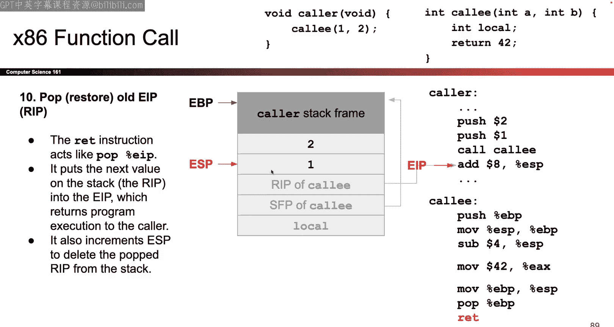

# UCB《计算机安全｜CS 161 Fall 2023 ｜ Computer Security at UC Berkeley》Calude-3.5翻译 p02 -02--CS161 SP23- Lecture 2 - x86 Assembly and Call Stack.zh_en -BV1YGbceREDs_p2-

Okay， hello， welcome back， Good to see you again。😊，Okay。

 I will start talking and hopefully your conversations will finish eventually so last time we talked about security principles we talked about why it was important。

 gave you a quick rundown policies。hel。Okay， that was what happened last time。

Here's what we're doing today， eventually find a sorta your conversation just a minute。我。😊，我知道。Okay。

I think people are settling and speaking。It's okay， I had a bit of spare time today so。

Not like a super pack lecture。对谢谢。Okay I'm gonna start talking for real now so time to finish your conversation so the first half of today is gonna to be some CS62 andC review so if your prerequisites are kind of shaky this is the problem you can try and figure out whether your prerequis are solid whether you're ready to take this class if all of today is complete nonsense to you that might be a good sign that this is not the class for you right now you might want to take CS62 andC first or review that content before taking this class so that's our first half but today isn't all review so even if you're like 6 andC expert we still want you here today because some of today is new content so for example we'll be talking about x86 assembly which is a different assembly language from the one you saw in6 andC which was risk5 so that's generally the plan for today a lot of it will seem familiar some of it will seem new and overall how comfortable you feel today we'll probably be a good sign of how much you're going to struggle with this Q andC for your requisite。

Okay。Great。😊，So we'll start with some 60ncC stuff， it's like about how you represent the numbers in your computer。

So your computer， if you go all the way down to the lowest level of abstraction， everything is bits。

 it's all a bunch of ones and zeros and。😡，That's bit1 or zero and if you have a bunch of bits together they have names like units of measurement so it's like how if I have 100 meters they call that a kilometer if I have 5000 something something feet they call it a mile right so just like how we have different names for different units of measurement we have the same thing for bits if you have eight bits that's called a byte and if you have four bits it's called a nibble so you might see that sometimes in our lecture today so for example I have the sequence here of 16 bits but equivalent we could also say it's four nibble or two bys so that's just how we measure number of ones and zeros in our memory。

Okay but you can imagine writing out lots of ones and zeros gets really tiring really quickly。

 so one shorthand that we like to use is we like to use hexadecimal so what we can do is we can take four bits four ones and zeros and we can write them as a single base 16 hexadecimal digit according to this translation table so if I ever have the bit sequence 1010 instead of writing that I can write the hexadecimal digit a and it means the same thing so as an example。

 here's the sequence that's kind of hard to read of ones and zeros but I can take the first four bits or the first nibble I can look it up in my table see it represents the hex digit C or it's represented by the hex digit C then I can take the next four in blue look it up in my table see that it represented is represented by the hex digit6 and I can write this as C6 but know that if I write something like C6 I'm not writing like a number or I'm not writing string I'm really just writing bits。

But in a way that's easier for you and I to read as humans。

 but really it's a sequence of ones and zeros， I'm just writing it in like short。So that's headeimal。

And if you're not sure when something is binary like ones and zeros versus heescial。

 well we have these helpful zero b and zero x。Frefixes。

 so if you're not sure we put zero B when it's a bit sequence and we put zero x when it's a he sequence。

 so that's how you can tell。And that's also what's6 season。Okay that's how we represent bits。

 this is just shorthand it's not anything special it's just for us to read the bits a bit easier。

Okay that's it for bits and representing numbers All right stop me if you have questions like w through jumping checks okay let's talk a bit about how you run C programs。

 this is also C6 and C So the way that we run C programs is this fourstep process so the first thing we do is we compile our code what that does is it translates the code from the C code to the assembly code which is lower level it's easier for machines to understand so it's kind of like prechoing your food a little bit computers have a really hard time reading the C code on the left but they have an easier time reading the assembly code in the middle so the compiler takes that first step of translating our code into something that machines are better at reading then the next step is to chew the food even more so the assemblymbr takes the assembly code and assembles it into raw ones in zero so raw machine bits that are now really easy for machines to execute but basically impossible for you I to read。

So if you remember in 601C you had that like reference sheet and you translated instructions into ones and zeros that's what the asmbler is doing sorry if I'm bringing up bad memories but you'll have to remember some of this for this class okay so that's the compiler that's the assemblyr it helps us translate C code into assembly code and then assembly code into a bunch of ones and zeros for our circuits for machines to execute。

Okay， great。Next slide。That's the compiler that's the asmbler there were two other steps that we talked about in6ency that we're not going to talk about too much here so there was a linker which dealt with if you have a bunch of different files that need to interact with each other or you're importing libraries the linker dealt with that for this class we're not going to worry about it too much but know that it exists and then finally onces you have the ones and zeros of machine code that you can run the loader is going to be the program that sets up memory space and runs those ones and zeros as machine code。

So let's dig a little bit more into what that loader is going to do the loader is going to give us a big chunk of memory and then run the program using that memory that it's given us so what does that memory look like well it's not going to look really complicated it's just a big sequence of ones and zeros so。

How many ones and zeros do you get that depends on your system if you're on a 32 bit system then your memory has 32 bit addresses。

 if you're on a 64 bit system， your memory has 64 bit addresses。

 we'll see a bit of both in this class but mostly 32 bit systems。

 so that's what we'll stick to today。And each address refers to one byte， so if you do the math。

 how many different 32 bit addresses can I have， I can have two to the 32 different 32 bit addresses and each one is representing a separate byte。

 so in total I've got two to the 32 bytes of memory assuming I'm on a 32 bit system。Okay。

 so every byte and memory gets its own address， I have 32 bits to write the address。

 each of the bits could be a one or a0， so in total I've got two to the 32 different addresses。

 which means I've got two to the 32 different bytes of memory in my memory space。可以。

And what does it look like， you can almost think of it like a gigantic array starting at address 0000000 and going all the way up to FFFF FFF and why are we using F because in text that's all ones binary so it's this really big array of bytes。

Each element of the array is one byte has its own address， can almost think of it like the index。

 so there's a bunch of addresses or a bunch of bytes。

 each byte has its own address goes from zero all the way up to FFF and in total there's two to the 32 of them。

All right， but this is kind of hard for humans to read so I'm not going to draw you pictures where we have this really big diagram going from left to right So instead a nicer way to draw the diagram just for us humans but not for computers is to draw like a grid like this So the way I'm going to draw it is I'm gonna to put four bytes on every row so each row has four bytes of data I'm going to say the lower addresses are at the bottom and the higher addresses are at the top so I can read this left to right bottom to top but this is just for us because we like looking at this rectangle more than we like looking at this really long one dimensionmenal grid but the computer it has no sense of the two dimensional grid that are're showing you here from the computer's perspective it really is just one long array of bytes and every byte has its own address all the way from zero to FffFF but。

For ease of viewing， we're going to draw it like a grid because goes it's nicer for us。All right。

Here's a quick detour on in in this so again 601C topic but maybe it's buried in your mind somewhere so i'll try to drag it back out for you so again here's the grid from before you can see that what we can do is we can put four bytes on every row I could also draw this in like1 v form so I could just have11223344 D8 like in a single row but drawing it in a grid is kind of nice for us and lets us organize our thoughts a bit better but do know that the computer has no sense of。

Bites being on different rows or like grids， the computer doesn't know this， it's just for us。ok。

And why is it that 11 is a byte because that's two hex digits， each hex digit is four bits。

 so in total that's eight bits， eight bits is a byte so。Measurement conversions， all right。

Great so we can see if I click around I can see that well this is the thing at address zero。

 this is the thing at address one that's the thing at address4 so depending on where I am in the grid each of these bytes has its own unique address there's a lot of bytes and i'm just showing you the first eight here。

Okay。Great。Now one thing we can do is well maybe one byte isn't enough to say something interesting。

 so maybe I want to represent a value that's more interesting or too interesting to fit in just one byte of data so what I could do is I could take four bytes and I can combine them to form what's called a word so word is another unit of measurement in a 32 bit system words are 32 bits in a 64 bit system words are 64 bits so depends on what system you're in but for today since we're dealing with 32 B systems we're going say that a word is 32 bits or four bytes you remember your unit conversion so we can take four bytes we can mash them together and get something called a word which is more interesting than an individual byte。

But there's a question which is， well， if I take these fourbytes and put them together into a word。

 like what does that word mean or how do I read that word， so to answer that question。

 I need to take you on a quick detour and talk about dates。Any fans of dates in here， I don't know。

 calendar fans， but let's talk a quickly bit about dates。So here's your puzzle for the day， which is。

You want to tell your friend about some really important dates。

 you want to tell them about the lecture today， so that's August 28， 2023。

 you want to tell your friend when the midsterm is。

 which is that date and you got to tell your friend when to final this。Okay， but your challenge is。

 you can only tell your friend by writing down nine numbers， so you can't put slashes。

 you can't put dashes， you can't write words， you can only write nine numbers to give these three dates to your friend。

So how might you do this well one way you could do it is you could try writing your month day so I could send my friend this sequence of nine numbers and then my friend could receive it and say okay。

 now I know the date of the lecture and the date of the midterm and the date of the final exam。

But that's not the only way you could tell your friend these dates you could also say day month year so you could put the 28 firsts because that's the day and then the8 that's the month and then the 23 is the year and then the 06 is the second date and so on you could do that too so which is better well that's up to you so does it really matter which one you use well not really the important thing is that you both agree so as long as you and your friend both know what you're using it doesn't really matter which one you're using you could pick your favorite everyone just has to agree on one of these two。

So that's the answer to the town member puzzle and how we communicate data to our friends。Okay。

I hope these dates are right， or else I've just made a horrible mistake， but I think they are right。

So what we've really done here is we've basically said there are two different ways to represent dates there's the year month day version which we're going to call big Indian why is it called big Indian because the biggest unit comes first the year is the most general biggest unit it comes first so we call a big Indian the other version the day monthy version that's the little Indian version because we start with the smallest unit first so this is just some vocabulary for how you might name these two systems but again in both cases the data that we're communicating is the same the only difference is the order in which we're giving that data to our friend and the order in which our friend is reading that data。

So that is our date de。So what was the point of this Well if we go back to our puzzle from before when we were trying to take four bytes and read them as a word。

 it turns out that the exact same puzzle our friend has given to us these four numbers these four bytes112233 and 44 and our challenge is to figure out what word what 32 bit sequence was my friend trying to talk to me about was my friend trying to give me the sequence11。

223344 as a 32 bit sequence or was my friend trying to give me44332211 as a 32 bit sequence and that depends on your Indianness so you could say well let's all agree on a big Indian system and let's say that if your friend gives you these four bytes by putting them in memory they're trying to tell you the number 11223344 but X 86 turns out to be a little Indian system which means that it's the other way around so when you have11。

223344。What your friend is really trying to tell you is the number 44332211。え？我想。

So on a 64 bit system are the words are like eight bytes long。

 so does that any in this like apply across all the Yeah the question great question。

 which is what happens if the system is 64 bits， you'd have eight bytes instead of four because words are now eight bytes long and you again。

 do the same thing where you read the eight bytes left to right or right to left。Good question。

Another good question yeah X86 is the assembly language that we're about to use。

 I think I like briefly mentioned it， but we'll see it a lot more really soon。

Thanks for the reminder though Okay great so this is just like the calendar problem from before someone gives you a bunch of numbers and the only difference is what order you read them to get data that's more rich like a date or a word。

All right。系以。Quick detour back to the dates which is if I give you the sequence of numbers and I ask you what was the first date that was communicated to you well you'd look at the three numbers in red and you'd like decode them and you'd say oh I was talking about August 28 2023 but someone could also ask you a question like hey。

 what was the first number that was in the sequence well now they're not asking you to decode the sequence or like construct more meaningful words out of the sequence or dates they were just asking you okay what was the first number and that's the question you can answer to you would just say look at the numbers first number is 28 so I could just say well the first number is 28 these are both questions that I could answer？

And just like we can answer these in the calendar puzzle， I could also ask you the same questions in。

The memory buzz so I could say well， what's the first bite that someone gave to you well I would just look at the memory addresses and see well the thing at the lowest memory address is the one one。

 so the lowest memory address。Has the byte 11 someone could also ask you hey what's the word of that memory address now they're asking you to take multiple bytes and construct them together into a more interesting thing so you'd have to take these four bytes what order you read them depends on whether you're big Indian or little Indian if you're little Indian and you're going to read from the highest address to the lowest address so you'd say44332211 that's like the date that you're piecing back together from a lot of different bys。

Okay so this is going to show up a couple times in your project one。

 which is why I wanted to get it out of the way， but kind of a tangential topic called today question Yeah there was a question of what happens if I asked for the word at address one so you'd be building a word out of223344 and D you could most systems tend to be aligned so they only ask you about addresses and a multiple of four but you could do unline ones if you wanted to it would just be very weird。

对不行了。好嗯。That's Indianist， so if you' ever get confused about in your project。

 why am I reading stuff backwards， this is why？Okay。Great， kind of a tricky topic。

 so feel free to come back and reference later if you need to， but just wanted to give it to you。ok。

Great， so let's go back to Run see programs and memory and what's in memory。

Here's another slide straight out of the 61c slidehows so hopefully it looks familiar hopefully it triggers some more flashbacks for you so here's four sections of memory the bottom section is code what do I put in code I put the ones in zeros that were spit out of the asmbler remember how we said your C code goes through the compiler goes through the asmbler eventually a bunch of ones and zeros get spit out while those ones in zeros we have to put them somewhere so that we know what program we're trying to execute and the place that we put those ones in zeros that are actually being executed by our program that's the code section it lives at the very bottom。

Then there's the data section this is where we put static variables so these are things that are allocated immediately when the program starts we don't use them too much in this class but know that it's there and then there's two sections that can grow in size so the data section and the code section they tend to have the same size as soon as you start the program and they never change but there are two sections that can grow depending on what your program does so one of them grows up that's the he so the more data you allocate on the he using the malaf function the larger the he grows。

And then you have the stack， this is where your function frames goes so for example。

 if you're calling a bunch of functions and you do a really deep recursion then the stack is going to have a lot of stack frames and grow downs so if you have local variables specific to functions or you have data as telling you about how to call a function or where the function returns all of that stuff goes into stack and the more functions you call the larger the stack grow。

Okay。And these two things can grow。As large as they need to as your program gets more and more complicated and if they have a cross。

 you get a stack overflow， which they need the website after any questions about memory layout。Okay。

 great。Now question for you， which is you might remember something from 60ncC called a register。

Where are the registers on here？That's a question for you， or maybe it's not。

Do you see the registers on this diagram anywhere？No no answer so the registers are not on this diagram and that's the kind of tricky thing that I thought I had a question for but I guess not so the registers are not on this diagram and the reason why is because the registers are a separate bank of memory。

So here on this picture， I've shown you the memory that we were talking about where every Bte has its own address。

And there's two to the 32 different addresses and two to the 32 different bytes that is this picture right here the registers is a completely different place to store information it has nothing to do with the memory it's in a completely different part of the hardware in fact it's directly on the CPU So if you look at this diagram no matter how you zoom in or try to find the registers you're not going to find it because it's a different part of memory or it's a different storage location and the difference between the two is that in memory if I want to know where something is located I use a number to refer to it so I'm like what's at address 25。

Some byte is there what's that address 150 there's some by there registers are different because registers are not referred to by numbers they're referred to by name so like in risk five the assembly language from 6 and C you would ask a question like。

What's the value in register A0 and you get an end0？

But in memory you'd have to say something like what's the value at address 150 and you'd get an answer so the way that we refer to locations in registers in a memory are actually different in the register world we use names so we're like what's in register RA and we get an answer in the memory world we use numbers and we say what's that address 220 and we get an answer。

So that's registers it's a completely different location where we can information so it's really easy to get it confused with memory but they're different question The question was does the stack started the highest possible address all the time so technically we're simplifying things a little bit and if you take a class about operating systems or think about virtual memory from 60 andC that's not entirely true there's some operating system stuff up there but for the purposes of this class you can just assume the stack starts at a really high address and then grows downwards as we make deeper function calls but yeah that's a good question you caught me on one of the simplifications we made。

All right。That's registers。So now that we have started to orient ourselves in memory and we understand how is memory organized what we do with it。

 what are registers， we can start to dig into X86 think about what makes it different from other assembly languages you might have seen before so one question you might ask is like well what's the point why not just use risk56 and see it' taught me all about risk5 I could just use that So the reason why we teach you X86 is because it's really common if you have a Mac before they switched to arm architectures or if you have Windows machine or a Linux machine you're almost certainly using X86 for the longest time every computer in the world was basically X86 nowadays not fully true buts still very。

 very common in the real world so that's one of the reasons why we show it to you the other reason is because we're going to show you some real world attacks and to show you real worldor attacks we want to show it to you using the language in which those attacks actually exist so that's X86。

It's another programming language assembly language like Rik5。

 but it happens to be the one that is used a lot in real life so we don't need you to be an expert in this the X86 manual is actually massive I think it's like a couple of thousand pages you're not reading that I'm not reading that so we only need you to know the basics and be able to read X86 code and generally understand what's going on feel sure to always look things up if you see an X86 instruction that looks confusing there's definitely a lot of weird features that we're not going to cover but for the most part we just need you to be able to feel comfortable in it and you don't have to be an expert in X86 so that's our goal for the next 20 minutes is to get you cur X86 there are some random facts about it that might serve you well as you go through the project so it's little Indian we already talked about Indian this and you read multibyte sequences you need to start reading at the highest address and then work your way down Rik5 was also a little Indian so hopefully familiar。

This is different from risk five， which is that X86 instructions are variable length。

 so if you remember in risk five every instruction was exactly 32 bits long in X86 that's not the case。

 some instructions are really short， some instructions are really long depends on your particular instruction so something you might encounter。

Okay， so in case you need them， that's your fact sheet。

Let's talk a bit about registers so in risk five there were registers they all had a bunch of special names like RA or T0 or S0 in X86 registers also have names but the names look a little bit different so instead of saying S5 that's our register name in X86 the names look like this like three letters long they all start with E the ones that we really care about are ESP which we're going to talk about in a lot of depth soon EBP which we're going to talk about in a lot of depth soon and EIP which we're going to talk about and a lot of depth soon and。

They might look familiar with other registers that you've seen in risk five so if you remember the stack point in risk five that's going to show up again today。

 remember the program counter in risk five that's going to show up again today as well。

 but know that these are the names for registers if you see them。

You don'll know theyre registers now。Okay。Syntax again we don't need you to be an expert in x 86 syntax。

 but if you see things like you know$ dollar 161 we are not giving you $161 we're talking about it immediate so that's a hard coded inta value161 or if you see percent ESP like what the heck is that that's just x 86 syntax for denoting。

The register of itself。Okay and if you ever see parentheses。

 I think this is the same as risk5 that's us asking for the address in ESP so if ESB is a register and it holds an address and I put parentheses around it i'm asking for the value in that address and we'll see that a bit more later too so don't worry if it didn't make sense right away。

Okay。Great so again we're mostly speed running x 86 stuff here so don't worry too much about memorizing any of this this is just to make sure you're comfortable with the stuff that we're about to show you so the way that you write x86 instruction is again pretty similar to risk five you start by saying what the instruction is for example add and then you say what's the source register or memory address and then you say what's the destination register or memory address。

So。Well sorry so what would happen here is I would add eight to the EBX register okay again you don't have to be an expert in this。

 but if you see instructions like this， that's how you read them。对。More words for you。不给。

Here's another instruction I hope okay so this instruction again we don't need you to be an expert in in knowing how to read this。

 but in case you see something like this， this is an Xor instructions so I'm doing some sort of x on the bits and what am my Xoring while I'm taking the bits in EAX and I'm taking the bits wherever ESI is so ESI is an address I'm going to go to that address and grab some bits and I'm going to x them together and then put the results in the EAX register。

Again， it's okay， if you don't know how to read this。

 sometimes I don't know how to read this and I have to look it up。

 but it's just here in case you data a reference。Okay。

So that's our quick whirlwind for X86 so that when we start throwing some X86 instructions at you。

 hopefully they look more readable than they did 10 minutes ago。

Anything else you want to know about XCD6 before I get into like the meat of the topic today。

 which is calling functions？The commas， I that's a good question， I don't think they are。

 but who knows we can go experiment after lecture if you want。Okay。被开始呢。

All right so that's again mostly like trivia but there if you need it so here's kind of the meat of today's topic which is how do we call functions so before we can attack x86 and talk about exploits we need to first get a really good understanding of how this works so that we can attack it。

So let's talk a bit about stack frames so I already dug up a bunch 601c memories for you today。

 so I need to dig up a bit of 61 any memories for you apologies so maybe in 6018 you remember drawing like those little environment diagrams where you'd like say well this function calls this function so I'm going to draw a little box where I put the information for this function and I'll draw another box where I have the information from another function right so that idea actually shows up in X86 as well and so the idea is when you call a function you make space on the stack for that function that could include things like what are the local variables specific to that function I have to make space for it so I'm gonna put it on the stack or it could be information like when I finish this function where do I go next that's also information that can go in the stack frame so every single time we call a function we make a stack frame and when the function returns we erase the stack frame because we're done calling that function and the idea is the more functions you call the deeper。

Nestier recursion or the deeper you make function calls like a function calls another function calls another function calls another function。

 the stack grows larger and larger because I have to keep track of all these different stack rings at once and any time the function returns the stack one goes away。

诶。So that's the stack frame we'll show it to you in a picture Now the question is remember how we set that x86 is just x86 or C or memory all that it sees is just a giant pile of ones and zeros so how is it going to keep track of where the stack frames begin and end or what the current stack frame is so on our nice little picture here I wrote the words current stack frame and I colored it red but you can't do that in real memory where it's just a bunch of ones and zeros you can't be like well look at the stuff that I color red there's no color in red so instead the way that X86 keeps track of what the current stack frame is of what function you're currently calling where to find the local variables is it uses two special registers to keep track of where the stack frame is one of them is called EBP you don't have to know what it stands for but that one's going to tell us where the top of the current stack frame is so the EBp register it's a place where I can store information what information do I store I can store whatever I want store my favorite。

Or today's date， but in the EBP register I am specifically going to store an address memory address and what memory address am I going to store i'm going to store the memory address of this so this value here this must be like the I don't know the 20th item of memory or the 50。

000 item memory so whatever address this is that's the value that I put in EBP and that's why i'm drawing the EVP say reference to whatever address is here。

And ESP it's basically the same thing， but instead of pointing at the top it points at the bottom so ESP again it's a register I can put whatever value I want in there。

 I could put my birthday， I could put random number。

 but instead I'm going to put an address in this register and what address am I going to put I'm going to put the address of wherever the bottom of my current stack is。

So these are the two registers that are going to help me keep track of what function should I really be focusing on working on right this instant？

And as the functions change， like if I return from a function or I call a new function。

 I need to move ESP and EVP so that they point at different places。

 or I have to take the values in them and change into different values so that they're referencing different parts of memory。

O。可以。Now quick detour here which is you're going to see me draw a lot of arrows in here and so if you don't feel comfortable with pointers I just want to remind you that I'm not actually drawing arrows in memory when I'm really doing if I like uncover the secret or。

peeel away the magic。 What I'm really doing is something like this。 EVP is a register。

 It can fit any sequence of ones and zeros that I want。

 but specifically I'm going to put this sequence of ones and zeros。

 Why do I put the sequence of ones and zeros because the top of the stack frame happens to be the BFFF320 at the byte of memory and why is it that I happen to put this number in ESP because this number is the address of wherever the bottom of the current stack frame is but you can imagine that writing this out over and over and over again。

 It's going to get very exhausting you have to like match up what numbers correspond to which ones So instead of drawing this which is kind of hard to look at what we're gonna draw for the rest of the lecture and the rest of the class is something like this but just know that when you see the arrow what we're really saying is that EVP has a value that value is an address and it's the address of something in that。

But I don't like looking at this， so I drive this。Okay， we do with arrows。All right。可以。

So what if I want to add more things to the stack frame so I have the stack frame。

 maybe I decide that I want to put something extra on the stack。

I can do that and the way that i'm going to do that is i'll use a command called pushush so this is an x86 instruction if I execute the x86 instruction it has to do two different things first has to change ESP why does it have to change ESP because ESP tells me where the bottom of the stack is so anything that's below ESP is below the bottom of the stack it's not even part of the stack it's like undefined it's like the void so don't go there。

So if I want to add something on the stack， I first need to take ESP。

 which in it's an arrow but really it contains a value and I need to change that value so that now it's referencing something a bit lower on the stack。

 that's my way of creating more space in the stack。😡。

And then only after I've made more space on the stack can I now write the value into memory at the new space that I just created so this is me pushing something onto the stack I had to take the value in ESP reduce that value so that now it's pointing at a lower address and then only when I make new space can I put the value on the stack in memory if I didn't do that then the value would have been like in the void and I would have never been able to plant it again question something below ES。

嗯诶手到。So what happens if you access something below the ESP I think it's could you access something on the heat so again the operating system might have defenses against that or it might have something to say about that so for the purposes of this class I'd say it's undefined behavior we don't specify what it does mysterious things happen in reality the operating system would probably have something to say about it。

Okay， good question。So that's pushing Now what if I want to take something off the stack I have much of stuff on this deck and I like to take something off I can do the opposite which is pop pop is another instruction in X86 if you run the pop instruction it also has a couple of things to do so first it's got to take that value and remove it from the stack and the pop instruction lets you put it in a register so it's like it's like a transfer I take the value out of memory and then put it into a register so that's the first thing that pop does。

And then P has to do a second thing， which is if you don't want that value anymore。

 you have to take ESP and move it up because you don't need that memory anymore。

 so the value in ESP increases now it points at a higher address and that value is gones in the void and we'll never see it again。

So that's popping popping lets us transfer values from memory into registers。

 those are two different banks of storage and then the push instruction I should have mentioned it goes the other direction。

 take something in a register and then transfers it into memory on the stack and both times I have to adjust the bottom of the stack。

Either to make space or to get rid of space that I don't need anymore so that's pushing and popping I'm going to be using it。

Here is it。Okay。More X 86 for you so X 86 is kind of a mysterious language in the sense that the compiler has a lot of freedom to do what it wants to do and so you'll see this in project1 sometimes the compiler will add something mysterious on the stack and you'll ask us hey what's that thing on the stack and our answer is gonna to be I don't know your compiler just felt like adding it I guess so again X86 is a complicated language it's a complicated compiler it can do all sorts of things that we're not going to cover in this class so in order to have something that is consistent for all of us so that we can at least talk about this language together and reason three things conceptually we're going to impose some rules know that these are not like。

know hard and fast golden X86 rules that can never change the compiler could do things differently if it wanted to and sometimes does。

 but in this class we're going to have some assumptions just so that when we talk about the stack together or when we talk about C programs or when I give you a C program on your exam。

 at least we can think about them in the same way。But just know that these are not like。

Hard and fast rules that are always always true so at least in this class all we're going to do is we're going to put local variables on the stack so anytime there's a local variable no matter what it is we're going to make space for it on the stack and that's where it's going to be stored。

And then what order do they go on the stack， well we're going to put the first variable of the highest address。

 and then every single time there's another local variable declared。

 we added to progressively lower and lower addresses。And then if we have a struct。

 well thestruct has multiple members， the first member goes to the lowest address。

 this will probably make more sense I show you a quick example。

So here's the example I know it was supposed to be a quiz that I gave away the answer so you can see here if I have a function like void to funk void well the first variable that gets declared as a so I'm going to put it at the highest address。

 the next variable that gets declared as B so I'll put it at lower addresses and then the final variable that gets declared as C so I'll put it at the lowest address does the compiler have to do this well not really it could do something different but just so you and I are on the same page。

 this class let's assume this is what the compiler does。And then within astruct。

 well this Bstruct has multiple fields that we care about Scott F1 f2 and F3， so again。

 for the purposes of this class we'll assume that F1 shows up with the lowest address because it appears first。

 followed by F2， followed by F3。Doesn't have to be this way， but just for consistency。

That's how we'll do things。Okay。😊，Also， you don't have to memorize this， here for your reference。

But it on your cheat sheet for your exam。Nothing about price， okay。

Let's talk about like the main main topic for today which is how do you call a function in X86 and you might be like well why am I about to spend 45 minutes telling you about calling functions well it's because this is where one of the biggest C memory of vulnerabilities is and so in order to know what the vulnerabability is and understand it we really have to have a solid understanding of how functions get called in C。

So let me start with a high levell picture and then we're going to dig into this in like disgusting gory detail so the general way that functions get called and hopefully looks familiar is we've got a function and it calls we've got function mainine and it calls F so what do we do we call fo so we're going to switch over to fo execute the stuff in fo and then what does the function end with it ends with return so what does return do it sends you right back to Maine and as soon as you go back to Maine you pick up where you left up。

Hopefully it looks familiar。Another little piece of vocabulary that we might use now and then is in this example made is the caller because it's the one calling the function and then who is the call lead because it was the function that got called。

Sometimes you might see those words appear， that's what they mean。Hey hopefully this looks familiar。

 a call a function， it executes， it returns， and then when it returns。

 I got to go back to where I came from and continue executing code wherever I left off。Right。

Let's start digging into how we have to do this so the way that we're going to do this is we need to set up some rules for when I call a function what's going to happen and how is the program going to set up stack frames and change the registers so that we know what function is being called this could have been done in a bunch of different ways the way that we're about to show you is just what the X86 people happen to decide on I don't know who the X86 people or I guess the people who designed it but whoever designed it they decided that these are the rules but these did not have to be the rules you can design your as language somewhere else but everyone had to agree on something so this is what we're going to agree on and I'm going to break this down in a couples slides。

Okay。So here's how we're going to call it well generally what has to happen is we need to make a new stack frame because I'm calling a new function。

 I need to have a new stack frame where I can keep track of my new local variables and I have a new space to work with。

So how am I going to create a new stack frame well I remember that ESP and EBP these were the two registers that left me a reminder of where my current stack frame is。

 so I'm going to have to take ESP and EBP and move them or change where they point so change their values so that they point somewhere else and now this new place it's my new stack frame and now I can execute stuff using my new stack frame。

And there's one more thing which has to change， which is the program counter。

 what does the program counter do， it tells me which instruction I'm currently executing that needs to switch so that I'm pointing at the new code that I'm executing。

And then when I'm done when I call return， everything had better go back。

 so if I want to keep executing where I left off， I need to take all this stuff and I got to put it back so that the function that called me can continue executing。

So what does this look like in pictures something like this so before I call the function there's two parts of memory that we care about for the rest of this lecture it's the stack section that's where all my stack frames go and the function stack frames are and the code section which is where my instructions are so before I call the function I'm in the callers so EVP and ESP are helpfully telling me where the call stack frame begins and ends and the EIP is's another register which holds an address and it tells me what instruction am I currently focusing on and executing it's probably something in the callers。

Instructions or code section then when I call the function I need to change these don't change where they're pointing at so the EBP and ESP they got to like drop down and now they need to point into a new stack frame so I need to change the value in EBP so it point somewhere new I got to change the value in ESP so it point somewhere new and notice that I got to change the value on EIP so that I points somewhere in the call function。

Because I'm executing stuff in the col。And then what happens when I'm done when I return。

 I need everything to go back the way that it was before。

 so I that the original function can keep going。So this is what we have to design， how do we do it。

 well here's what the X86 designers cited on。Any questions before I show you what they decided on？No。

 okay， anything on Zoom？Doesn't seem like it all right。So here's how it was designed。

 so let's take a look at。The landscape here of what we're about to show you so remember there's two places where you can store things there's registers they're referred to by name there's a lot of them but today we only care about three so there they are they're sitting there I can put values in them i'm basically always going to put addresses in them so i'll draw those as arrows as you've already seen and then on the right side you've got all the memory。

There's a stack section， there's a heap section， there's a static section。

 there's a code section for today we just care about stack and code but do know that there were other sections too and we know that the stack grows down and I should also really quickly mention that when I say the stack grows down sometimes people take that and really around with it and think that the stack grows down must mean that the stack is upside down world I re backwards and I read numbers backwards and everything is upside down so the only thing that's relevant when I say that the stack grows down all that I mean is that when you need more space look to lower addressess。

So when I say that the stack grows down， I'm not saying that the stack is upside down world and strings are backwards and I'm going to like stand on my I'm going to do a handstand when I'm talking about stack that's not what stacks are the only thing that is relevant when I say that the stack grows down the only thing that I am really saying is that when I need more space say I run out of space or I want to I want to create a new stack frame all that I'm saying is that when I need the new stack frame give me more memory at lower addresses that's it okay so don't go out to the exam and like turn the exam upside down because it's the stack question like that's not what the stack is the only thing that's relevant is that。

New memory appears at lower addresses okay I just wanted to get that out there because sometimes people take the grosss down idea and just like。

Extrapolates it to extreme degrees， okay。And just like we said before， lower addresses at the bottom。

 higher addresses up top， so hopefully you're oriented in this diagram because we're about to use it a lot。

So again， kind of review， we already saw that when you have a stack frame。

 we use EBP and ESP to tell me where the top and bottom are。

I realize they're kind of approximate will make them exact where we and then you also remember that the EIP sorry I guess not the EIP yet the ESP has a second purpose。

 which is it also tells us where the bottom of the entire stack is so whatever the current stack frame is it's also going to be the lowest thing on the stack right now。

And you can think about that afterwards， it takes a bit to wrap your head around。

 but whatever is the current stack frame is also going to be the lowest thing on the stack it has to be。

 and so that also means that the ESP has a double purpose。

 which is not only does it tell me where the bottom of the current stack frame is it also tells me where the bottom of the whole stags so anything on the stack below ESP it's the void the abyss there's nothing there it's undefined and you should never be accessing it and so we also talked about how if you want to push something you need to adjust ESP so that you make more space on the stack otherwise you're just sending values into the abyss which is not what we want to do。

Okay， so ESB has got a double purpose， not only is the bottom of the stack frame。

 also the bottom of the rules stack。All right。Final register EIP we briefly talked about this one this is the program counter so this one tells me what instruction am I currently executing it's like a little book that tells me well I just executed this ad instruction which is written in memory as a bunch of ones and zeros that I'm going to execute this multiply instruction which is a bunch of ones and zeros that I'm going to execute this XO instruction which is a bunch of ones and zeros in memory so it's just the address of whatever I'm currently executing or whatever I'm about to execute。

That's on。All right。Great。So we already saw this as well， so we saw that well。

 when I'm going to call a function， I need to adjust EVP and ESP to create a brand new stack frame。

So I'm going to have to create a brand new stack frame。

 so both of them have to drop down and I also have to tweak the instruction pointer so that instead of bookmarking instructions in Maine。

 it starts bookmarking instructions in food because I'm executing instructions in food we're assuming here that Maine calls who for the rest of the day。

And then remember we said this before as well， which is when you're done。

 you can't just leave the stack all messed up like this。

 you need to put everything back where you left it so that the main function could continue doing whatever it was it was doing before it called food。

So that's our goal， I can switch between these like before after before after。

 so this is the process that I need。And somehow we have the design。All right。Great so this is Acrom。

So the main theme， if you stop listening to me right now， which I don't recommend。

 but if you stop listening to me right now， the one thing that you should take away for the rest of today is the way that we're gonna to design this。

 the philosophy really comes down to always have to save our work as we go so when we're gonna to change something we should always write down what used to be there so that we can put it back the whole goal of this design is when I change all the registers and I want to call a new function when I'm done I have to put everything back and the way that I'm going to put things back is I'm going to save my work as I go so when you change something always write down what you change and what used to be there so that if you ever want to change back like when the function returns you can restore the values that used to be there so everything that we're about to do is in service of saving your work as you go so that when we're done we can clean up and make everything look nice and the main function can keep doing whatever it was doing and it won't get mad at this。

Rightrry。So here comes the steps there's a lot of steps I'll walk through it a couple times if you want。

 but let's go through them one by one， so the first thing is you have to give the arguments to the function so if Fo collects a bunch of arguments or it needs a bunch of arguments。

 we need to give them to the food function。And there's a lot of different ways you can do this。

 like in risk five， you pass functions through the argument registers， but in next '86。

 they've decided that the argument registers go on the stack。

So the first thing that you're going to do is you're going to push all the arguments that you need onto the stack and what do we have to do when we push we can't just put them on the stack or else we've just sent them into the void the abyss。

 we also have to change ESP so that these things are on the stack so we had to adjust ESP because we know that ESP has a double purpose of pointing at the bottom of the stack so we had to change the values so that it points lower on the stack and only then could I put the arguments in the stack。

All right， great now we have the arguments in the set。

 so now we can start adjusting the registers to create a brand new stack frame。是哦不行냐。

The question was why do we have to put the ESP below the arguments if I had ESP above and the arguments would be below the ESP in the void。

关毕。啊，等要清等过咧。Will the base point change， yes， so stay tuned。A lot of more steps coming at you。

 so here's the next step， which is。Now it's time to start changing the registers one by one so the first register that I want to attempt to change is EIP it's pointing in the wrong place I wanted it to point at the code for food because I want to execute the instructions on food but it's pointing in main so it's pointing at the wrong place so I got to fix it how do I fix it。

😡，I can just change EIP right now so I could just say EIP you don't point at me anymore。

 you point at food but that would violate our rule of it we got to save our work as we go because we know that when we're done we have to remember where we were in Ma so before I change EIP I can't just go around willingly changing registries I need to remind myself what wasn't EIP before I change it so this is me saving my work。

How do I save my work what's a place where I can write down values so that I can remember them for later well I have this big chunk of memories stirring me in the face so i'm going to use memory to remember。

The values before I change them。So before I change EIP， it hasn't changed， look， no change。😡。

Before I change it， I'm going to first write down what the value was so notice that this value that I've just put on the stack。

😡，It's pointing at the same place that EIP is pointing EIP contains an address this thing that I put on the stack is that same address that's what I mean when I have two arrows pointing at the same place EIP had a value was an address RIP had a value or this thing that I'm putting on the stack it's a value the exact same address。

This way， when Im done at the end， I can put this value back in EIP and EP will be back to where it used to be and everybody will be happy。

All right。And just like before we always have to remind ourselves when we put something on the stack when we push something on the stack。

 the ESP has to go down， otherwise this value would have been in the void and bad question in the back push ESP and then push EIP after that so we're not pushing ESP yet because we haven't put the value of ESP on the stack we are just pushing the value of the EIP on the stack and in the process of pushing the ESP always gets adjusted every time we push we have to change ESP to make more memory in the stack question。

把にとしてあ。Instead of pushingI am I pushing EIP+ four technically， yes。

 I'm kind of abstracting that away because there's a lot to go over here。

 but technically I'm pushing the instruction after I return。这 question呢。温暖。喂。

Yeah there was a question of do I manually change ESP that depends on what you mean by manual i'd say the push instruction does it for you so if you write the assembly instruction push it's going to put something on the stack and adjust ESB but for the purposes of like when I made this slide yes I had to manually adjust it。

Okay， great， so this is me putting it on the stack。

 why did I put it there in the spirit of saving my work so that I can put things back at the end。

And only now only now that I've saved my work am I confident that I can change EIP why can I change EIP because I've saved my work I'm never gonna to lose EIP I wrote it down so only when I wrote down the value that used to be an EIP now I am authorized to change it so yes I got a special name I'll tell you more about it later but only after I changed it will I be able to sorry only after I push the stack will I be able to change it okay。

😡，Great。😊，No。There's more things I have to say， so for example。

 the next thing I want to change might be the EBP。😡。

So if I want to change the EBP same thing before I can change the value in EVP I have to save that too。

 so just like before EBP is a register， it has a value inside which happens to be an address and again if I want to change that value。

 I can't just go around changing values without remembering what used to be inside that register I have to write down what used to be there and leave myself a note of memory saying by the way when you're done。

 this is the value that used to be in the EBP and only after I do that what I be allowed to change the EVP。

So I've saved two values I've saved the value of the EIP， I saved the value of the EBP as well。

 and only after doing that would I be allowed to change both of these registers so all of this is a very long wind way of saying I'm saving my work before I change values okay。

Great， again， it gets a special name when it's on the stack， I'll tell you about it if I have time。

But only after I did all that stuff only after I save all the values can I now take the registers and change them to point somewhere lower I'll do that in more detail later so don't worry if it looked like a lot happened but all I really did was I took the EBP ESP which pointed at a higher stack frame and I dropped them down to point to a lower stack frame and then EIP also changed from pointing at main to pointing at food so everything dropped down and changed why was it okay to change everything because I saved my work as I went。

Someone's going to ask me what happened to ESP the answer is。

ESP is going to naturally pop back up to where it used to be thanks to its like double purpose as the bottom of the stack so yes technically I didn't save ESP but luckily thanks to the specific way this was designed it's going to move its way back up naturally to where it used to be and you'll see that in a question Why is ESP not the same position as EVP at this point because isn't the new stack yeah there was a question of how come ESP is pointing a bit further down I'll show this in a bit more detail which I think might answer your question this is still like a not fully like a more conceptual view now？

Okay， once you see it in instructions， it might make more sense。Okay， but the high level idea。

 which I want to really get across here is just that I saved my work as I went and only after I wrote down everything that I would need to restore the values was I allowed to make all these changes。

Right so here's again comparison of what happened EBP used to point higher now it drop down ESP used to point higher now it drop down how far it drops depends on how complicated your function is so the compiler can check。

Does your function have a lot of local variables， if so。

 I have to move ESP really far down to make a lot of space and then EIP also changed so use the point at Maine now it's bookmarking instructions in P for me。

Okay， so all the registers changed。And eventually I can execute my function so whatever it is my function is doing。

 I now have a brand new beautiful stack frame that I can use to execute my function。

 my instruction pointer is pointing inside Fo so I can keep track of all of my instructions in Fo and I can execute my function and do whatever it is that my function wants to do。

And when I'm done with my function。Again， I'll show this to you in more detail and I have to put everything back。

How am I able to put everything back because I wrote down the values on this stack？

So the theme is always put things on the stack before you change the values of registers so that when you're done。

 everything can go back where it used to be。I'll take one more question and then i'll do this in more detail and we might answer more questions do I have to erase the data afterwards technically no because everything below the ESP is。

Boy so Ibi， so no one's opening the limit it or ask for it begins。All right。Great and again。

 slightly weird that we didn't have to save ESP， but it turns out that thanks to the specific way that this was designed and the fact that ESP is like a double agent it's also the bottom of the stack entirely in addition to the bottom of the current stack frame。

 ESP will actually naturally pop back up to where it used to be。

 which is kind of a nice side effect of the way that this was designed。And this also， I think。

 answers the question which was we don't really have to delete these values。

 they're pointing below ESP， so no one's ever going to touch that stuff again。All right。

Let's do this in a little bit more detail so I gave this to you in like a six step kind the summary version where I just wanted to show you that before I changed EIP I had to save it before I changed EBP I had to save it and only then could I adjust make my brand new stack frame now i'm going to do it in more detail so now here it is in like complete disgusting gory detail all right so。

Youre ready let's do it I ran out a slide space that's how much slide space I needed so at the top i've got the C function or the see program or what we're about to see it's not that complicated it's got a function calls another function with arguments and that's。

Here's the X86。Assembly version of it so I took that code I compiled it into assembly and it looks something like this so okay if you don't understand how to read all of this。

 i'll walk you through it。Finally I can start drawing my memory diagrams so i'm going to use red to highlight the instruction that was most executed i'll use the IP to tell me where I am so don't worry about the off by ones too much this is just a reminder to myself of where I am and the function。

and then here's our trusty old memory diagram this is the stack remember that the way that we draw it every row has 32 bits in it you could draw it differently in C memory it's really just a long sequence of ones and zeros but we're going to draw it like a bunch of rows because it's nicer for us to read。

So here we are， we've seen this before， this is the color stack frame。

 it's got EDP point at the top and ESP point at the bottom that we've seen before。

So the first step is just like we saw the before this function takes an arguments。

 takes an int A and in B those arguments have to somehow be transferred or delivered to the function I'm about to call I' mean the caller right now I want to give the numbers one and two to the function I want to call there's a lot of different ways you could do this you could put it in a register you could you know pick up the phone and call the call and say hello one and two but the way that X 86 has designed this is say is that its going to put those values on the stack that's what X 86 decided so that's what we're going to do to it's going to take the arguments one and two and put them on the stack。

😡，Notice that one I called push。when I ran the push instruction。

 ESP drop down to make sure that I'm always putting things on the stack and keeping track of where the stack is。

 if I did not change ESP the two and the one would have just been sent up into nowhere。All right。

 so I just pushed two things on the stack now if the col wants to find the arguments it knows where to find them。

 they're on the stack。Great。Now here comes me switching up all the registers。

 but only switching up registers after saving their values， so first I'm going to change up EIP。

So EIP used to point in the call function and I want to change I want to change it so the the points in the call function。

 but I can't just change EIP because if I change it I'm going to forget where it used to be so before I change it。

I need to leave myself a reminder of where I used to be， that's this value right here。😡，This value。

 this is an address。😡，It's valuable on the stack， it could have been anything that have been my birthday。

 but it's an address and it happens to be the address of this instruction。

In the code section and that is a reminder to myself that when I am done with colee。

 this is where the EIP should point when I'm done so when I'm done take this value。

 which is the address of this thing and put that value back in EIP so I can go back into the call function and continue doing caller things。

 whatever that means。Okay， so I had to push this value and remember when I push。

 that's not what I wanted， when I push， the ESP also had to go down because I'm adding things to the stack。

Okay that's me saving my work only after I save my work could I take that EIP and move it somewhere else and have it point in the colleague if I did not do this then when I finished I would go callgue collea colleague colleague R return and then the EIP would be like where do I go what value should I point at next it wouldn't know but I'm writing down the value so that I do remember where the EIP goes when I'm done that's me saving my work as I go？

Okay。Really quick side note which is when I save my EIP on the stack， we give it a special name。

 which is R IP it does not stand for rest and piece it stands for return instruction pointer and so it's just a fancy way of saying when the function returns。

Go there so that's the instruction you could go to on the function records okay。

 but it's just a special name if you don't feel comfortable with that name feel free to call it the value that used to be an EIP that's the same thing okay。

So what did I do， I saved the value and only when I saved the value was I authorized to change the value when we register。

Okay， now I want to do the exact same thing， but with the EBP register。

 so what does that look like well？Again， I want to change the EBP right now， the EBP has a value。

 it's an address， the address of whatever this place is in memory。😡。

And I want to change the EBP to point somewhere lower so I can create my new beautiful stack frame。

 but the only way I can do that。Is by first saving my work or else when I'm done I would not know where EVP used to be so what do I have to do I need to go on the stack and write down the value that is currently an EVP which happens to be the address of this thing up here so I'm going to write down what values in the EVP put it on the stack and only after I do that will I be allowed to change EVP so on this slide I'm taking the value in EVP I'm writing it here so now you'll notice that EVP has a value。

 the value of this thing this value on the stack has a value。

 it's also that same value because I took those bits and I copy them onto the stack so that way when I'm done I can put those bits back into EVP。

And again， when I put it on the stack， we give it a special name SFP for save frame pointer。

 if you don't like that name， you could just call it the value that used to be an EBP before the function was called。

识唔明。Okay。Only after I did this now I'm very sure that if I change EBP。

 it's okay because I have a backup I know where to put it back later。

 so only after I wrote down what it used to look like am I ready to change EBP so now I can drop it down。

😡，So that's me dropping EVP down and I'm going to drop it as far down as where the current ESP is that's going to allow me to create a brand new stack frame where this is the top and the rest of it below。

Okay， so it used to be up here， I dropped it to where ESP is now I'm ready to create a new stack frame。

And why was allowed to do that because？I remember where it used to be see look at the arrow right there it tells me where EbB is like a hint it's like put it back there when you're done so。

That's a reminder to myself， same thing with EIP EIP's pointing here。

 but when I'm done with this function， like look right there it's an arrow that tells me exactly where EIP needs to go when I'm done so those are the reminders to myself。

O。😊，Great now I've changed EBP， I've changed EIP so now I'm ready to create my new stack frame so the way that I create my new stack frame is I move ESP down as far as it needs to go。

 the more complicated that my function is， the further down the compiler is going to drop it in this case it didn't drop super far but if this was a really complicated function with a lot of local variables who knows maybe ESP goes a lot further down。

 but if you look now this is my new stack frame EBP points to the top of it。

 ESP points to the bottom of it brand new stack frame glorious and what's great about it is when I'm done I'm going to be able to put everything back where I'm found it。

Okay only now when I've created my new stack room and'm able to execute the function so I can put local variables into stack I can do whatever it is I want in this case i'm just going to return 42。

You could do whatever you want in this function at this point。

 but this is just someone executing the function。Okay now time to go back and change all the registers back to what they used to be。

 so this is what I have to do when i'm done。There's some syntax here for you to read later but the important thing is let's start putting things back where we found them so first thing I'm going to do is i'm going to move ESB back up so I think the slider is slightly messed up but ESB and EVP are going to move back up so ESB right now is pointing pretty far down I need to move it so that it points back up to where the。

EBP points and are they point of the same place。I think the wrong thing is red here。

 sorry about that， but basically both of these now point have bit higher up so I've deleted the space that I made for my new stack frame。

Before the stack frame was all this stuff and by moving ESP back up， it's gone。

 all that stack space is gone， it's now below ESP， it's like in the abyss。

So now what well now I'm going to start putting values back in the registers so I'm going to start by moving EBP back to where I used to be but wait where was EBP before oh I don't know did I lose my work like where is EBP well lucky for me I had left myself a reminder of where EBP used to be so all I have to do is use the pop instruction to say take this value which is what used to be an EBP and put it back in EBP transfer it back in EBP and when I do that just like magic EBP goes back to where it used to be。

Great， and because I'm done using that save value， I move ESP back up so that save value is done I'm done using。

So what did I do and I was here and I was like I got to put EBP back where does it go well lucky for me the next value on the stack is a reminder for where it used to be so I take that value or which used to be an EBP I put it back in EBP that causes EBP to pop back up to where it used to be and since I'm done using that save value I wipe it off the stack。

And I do the exact same thing but with EIP this time so again i'm like I got to put EIP back like look it's at the return instruction it is nothing left to execute so we need to put EIP back to where it used to be but where where did EIP used to be I don't know or do I know well luckily for me I saved where EIP used to be on the stack so this value right here。

Coincidentally luckily it happens to be the value that used to be an EIP before I called the function。

 so all I have to do is take this value， put it back in the EIP register and as soon as I do that look at that EIP is back to where it used to be and since I'm done using this reminder for myself on the stack I can wipe it off the stack by implementingcr ESP its gone I'm done using it。

Okay last thing just to put everything back in harmony。

 well when I called the call or function or the call function， I put these arguments in the stack。

 I'm then using them so I'm just going to move ESP up so those arguments are gone I don't have to worry about them and like look at this is beautiful all the registers are back to where they used to be and the only reason why I know where they need to be is because I save my work as I went。

So that's the demo of the day like this， the better you understand this。

 the easier time you'll have on project one like to me this is the difference between spending like I don't know five hours and 50 hours on project one or whatever okay I don't think anyone when you can spend 50 hours I don't know。

 but this is the difference between like being really proficient in project one and really struggling is the amount。

Or the degree to which you're able to internalize this any questions。

 this is definitely a tricky demo to go through like one of the trickier of the whole semester。

 so ask me questions about it。YeahYeah， that's a great question which is say you're here and you're executing the function。

 how do you find the arguments so one thing you can do I'm not going to detail it in this lecture but I think we have videos on this。

😊，The EBP is like a anchorage tells you where everything is so if you started the EBP and you look you know like8 above you'll find an argument if you look like 12 above if find the next argument and so on Okay ask me more questions don't go yet this is also interesting where's the output of the call like the return value return values go in registers that's like x86 trivia not so important but good question Yeah can you repeat Yeah sorry okay I need everyone to stay for like。

Seven more minutes， okay？よし。Okay， so。Sorry I know we always leave like five minutes for Q&A at this lecture because it's a tricky topic and again because this is the difference between like spending five hours and 50 hours。

 I really want you to listen to some of these answers so one question was how do you access arguments on the stack while you're executing the function the answer was well the EBP is like an anchor that tells you where to find the arguments so if you start at this location and like move your way up you'll eventually hit the arguments the second question was where does the return value go the return value has a special register EAX where you can shove in the return value there were more questions so let's take some more。

Any more yeah there's a question about who calls Ma the operating system calls Ma if that's something an operating systems class we'll tell you in a lot more detail so for our purposes not too important we just care about like any arbitrary function calling another one if you're wondering about who calls mainine it's like an operating systems class question a good question though a second to last flow。

Second like in the front， second last， and then I'll do the one behind you。嗯，嗯。喺通车嘅。

I think I don't know。How do you know how far ESP goes。

 I'm assuming you mean like this step where ESP pop back up。

Oh like up here how do you know how to delete the arrogments off the stack so remember all of these instructions are spit up by the compiler all right so the compiler is the one generating these two instructions and the one generating this instruction so the compiler is the one that writes all these out so it knows I wrote two push instructions so i'd better add eight to get over to two argumentsrrogs that's a really good question though and then there was one like right in front of you。

on that。对啊，你等哦。一。好没有。Yeah。Another question which is when the program wants to execute or access arguments。

 how does it know how far off to look so again， all of this code including the code that access the arguments and the code that's like moving all these registers around all of this is code being generated by the compiler so the compiler itself has to be self-consist and know that like well I'm the one that generated code to push two arguments on the stack so I'm also going to generate code that looks in that same location so the compiler has to be consistent and in fact this is why we have something called colony convention if everybody agrees on the rules and the arguments are always going to be in the same place if everyone agrees on the rules and the registers will always move in the same place and this way we can make sure that all our code runss like consistently okay everyone is so ansy I guess it is 630 so almost 630 so I'll take one more question and then I'll take more like here。

Are there any others？Okay， so again。I really recommend like going through this， stepping through it。

 like explain it to a friend， like talk to your dog about it like make sure that you understand this because this is like MKia for we're going to talk about the next release Okay hie everyone。

😡，那我回去了。아事ご。Yeah， I not a security vulnerability with not delete off the yeah there was a question about is it a security of vulnerability to do stuff on the stack I think we'll talk about that next week a little bit。

So sometimes leaving things on the stack or leaving unventitialized things of memory is a vulnerability if you like the attacker access it。

 I think in this case the program just crashes if you try to access things below the ESP Yeah。

 I think the program itself will not let to access stuff below ESP but I have we'll see next week that there are cases where you' get access that that's unoffialized。

😡，Yeah， so again， this is not how all pilot we think， but for the purpose to this class。

 just to make sure that we're all drawing these diagrams together。Yeah， so both of these are。

So right， let me， okay， I'm going to stop the recording because it's kind of loud if you have questions。

 some talk to us on it or something to fight。

