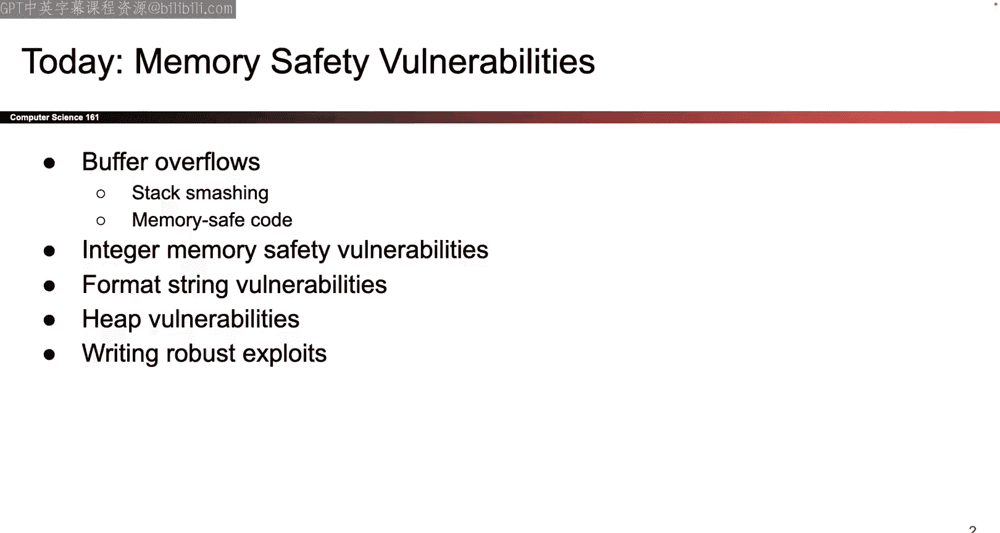
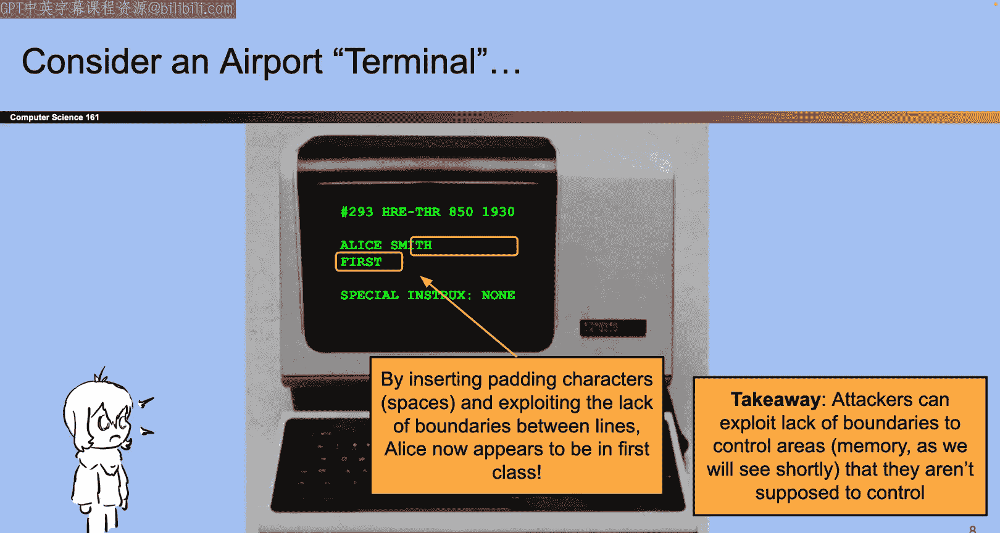

# UCB《计算机安全｜CS 161 Fall 2023 ｜ Computer Security at UC Berkeley》Calude-3.5翻译 p03 -03--CS161 SP23- Lecture 3 - Memory Safety Vulnerabilities.zh_en -BV1YGbceREDs_p3-

我放。没的O。Cool， welcome back， folks。So last time we gave you a quick summary of 61 see things you'll need for this class like a bit about。

Stag how you call functions in x86 so today we get to finally start talking about our first attacks so our attacks today will have to do with C programs how we attack them and what those attacks look like。

Okay。Great。I'll give you a quick analogy and again remember the background of the slide is blue so i'm not going to ask you about airport terminals on your exam。

 but here's kind of the story to set the stage for what we're talking about today so I don't know if you know this but airport terminals use like really old computers I think it's still true but it was true you made these slides so if you ever look behind an airport computer or like the check encounters they use these really really old computers and they look like this and so。

You can imagine that if someone is checking in for their flight then maybe they'll say something like my name is Alice Smith I'm flying E and I have no special instructions okay that's great so they take whatever you entered and you book the ticket and it displezes it on the terminal。

That's great now imagine if you I was the passenger and instead of writing that my name was Alice Smith I I don't know fells asleep on my keyboard or something and I wrote that my name was Alice Smith HhHHHHHH okay。

So that's me， I registered， I walk up to the terminal。

 the check encounter with the really old computers， and this is what the agency sees。

My name is Alice Smith， H HH HHHHH， some of the economy got wiped out。Okay。

 so that's what happens if Alice has an accident and types too many ages。

 but looking at this and more， start thinking like an attacker。

What can we do with this what should what should we write as our name we want to do something more evil yeah。

Alice first class that's it just Alice first class okay Alice Smith H H H HHH first class let's see what that looks like so yeah do you write something like Alice Smith then a bunch of space bars and then the work first suddenly it looks like well now you're flying first class maybe I'll put something like special instructions don't lose my luggage or something I don't know but the idea here was what do we do like instead of typing my name is Alice Smith I take my name is Alice Smith and I wrote extra characters that overflowed into the economy or first or class line on the computer so the key like vulnerability just to spell it out a bit if it didn't make sense just looking at these pictures the key vulnerability here is that there was no way of separating the nameline and the what class are you flying online。

There was no separator between them， so if your name was too long it started to overflow into the next line and this really old computer had no way of knowing when your name ended when the class started so that was vulnerability just to spell it out but hopefully it feels kind of intuitive that if you're Al Smith HH HHHHH first class then you can overwrite your economy。

Ticket and start flying for sauce， special instructions， champagne， I don't know okay。

Great so that's kind of the story that's going to frame what we're seeing today so it turns out that this exact problem where there's no boundaries between different pieces of information this actually appears in C as well so the most basic example that I can give to you is if you have an array four characters in C and you ask for the fifth element of BRA。

Well， guess what C does？It doesn't crash it doesn't yell at you turns out this is perfectly valid C syntax so C code does not care about bounds in the same way that our really old airport computers did not care about where your name ended and when your class started in that same logic。

C does not care about the fact that you're indexing out of bounds yes weird things will probably happen if you do this。

 but from the perspective of the C compiler it thinks this is perfectly valid code that's C thank you C okay。

😡，So C doesn't know anything about as so C is a very lowle language tries to give you access to the hardware so from C's perspective what it looks at as memory is just a huge sequence of fights and it doesn't really have any sense of where one thing ends and the next thing begins it doesn't have any sense of like well this is your name and this is the airline class that you're flying so they should be separated so in that same logic C looks at this and says you know what if you want the fit element of name that's fine there's still memory there and it gives it to you。

So this is bad in the sense that if you made a mistake， your code could act in weird ways。

 that since we're a security class， we're going to think about what an attacker can do to exploit this sea of vulnerability so like the rest of this week is just talking about this and how attackers can exploit it。

Okay， let's look at a more interesting one then accessing element five of name。

Here's another piece of code here we're gonna to use a C library function so they go into the C library it's got all these functions and one of them is called getS or getsS So what does this function do it collects input from the user so it says okay user type your input and it collects user input until it sees a new line what's the new line that's like the user hitting enter so until the user hits enter it collects the user input character by character by character and writes it into the argument past in So if I say getS name what's gonna happen is the getS function is going say okay time to start writing in memory wherever name is and every character that the user types the C program sends into the memory starting that name and it goes one by one by one by one and when does it stop it doesn't stop when you type 20 characters it stops when the user hits enter。

几。😊，So what can we do with that？We can start doing funny things。

 So here's another example where we have name and we have another。

Buffffer which is a funny name for a character right where we had the instructions for what the airline should do with you so here's just none so the airline is free to abuse you all at once but maybe we can do something interesting with the getdes function so let's draw a picture just like we did in all the previous ones for this entire unit drawing pictures of memory is going to be really helpful so let's draw the picture here's the picture。

The picture says we have the name character array down here。

 why does it take up five rows because each row is four bytes， I have 20 bytes of characters。

 same thing with the instructions array， it's got five rows。

 why is it five because I decided that every rows four bytes I have 20 characters great。

Now what does the getS function do the getS function says start writing at name so C says all right。

 whatever the user types， I'm going write it here and then here and then here and then here here here here and is going to write all the way up how far is it going to go it's not going to stop here just like the airline example。

 there's no way for C to know the difference of where name ends and where instruction starts it doesn't care is' is going to keep writing upwards and upwards and upwards and upwards and memory until the user hits enter types of new line that's when getdes returns and stops。

Okay， in case you're wondering why they're backwards or why they're in this order because we put them outside of a function。

 but that's not too important。So let's think about what can go wrong let's try the same attack from before where we wrote Alice Smith H HHHHHH don't lose my luggage so what would happen is well that input starts showing up here and if it's a really long input like it's longer than 20 characters it's going to overflow past name and see has no idea that there is a wall separating these two it's just going to keep writing up and up and up until your input ends right so I could write does this pencil work I guesss not okay so I could write something like you know。

Alice Smith H HhH HHh it fills up 20 characters of Hs and then once I get to the instructions section I can start writing things like。

feed me lunch on the plane， I don't know， something like that。ok。

Great here's another example it's basically the same example as before。

 but maybe like in a less airline context， so here the variable that we can overwrite is some sort of variable called authenticated and you can imagine that I don't know maybe you have a program where if this authenticated variable is zero we don't give the user access to special things but if the authenticated variable is one it's true maybe we give the user access to something special。

So if we have the same program and we ask the user hey。

typing whatever you want and I'll write it to name。

 we can do the same thing we could say Alice Smith H Hh Hh Hh HHHH a lot of Hs and when I get to the authenticative variable after I've written 20 characters I could put something like one and suddenly this authenticated variable that the user was not supposed to change it's not for the user to change suddenly maybe an attacker can change it make it say one instead of zero maybe now they have all sorts of privileges that they weren't supposed to so that would still be bad it's another setting of the same exploit。

Okay more interesting exploits these are all basically the same just showing you different ways in which the exploit might look so here again I have some sort of。

Character array now it's called lines that of named but it's basically the same thing and maybe somewhere in memory you have another character array that has some sort of command like this is a program that lets us list files so in order to list files I might have to have this string in memory Okay great。

And then just like before I might have some getas function that lets the attacker write as far as they want and they overwrite all the stuff in line with 512 characters。

 they write all the way through command and instead of command containing these words like just how the words economy got replaced with the word first instead of writing this command the attacker could replace it with some other command like remove all files or shut down the computer or send a spa email right so this command might change and maybe later in your code you have this C library function that says execute whatever command was there so instead of executing the list files command like it was supposed to maybe now it's gonna execute the attacker chosen command which could be like delete everything or leak files or send an email I don't。

Okay question so in this case。Could the thing we want to overwrite be longer than the current string guys it'll just writing into more memory' Yeah theres I guess wass the question what happens if you write so far that you exceed command as well So if that could happen right there's no limit to the getas function it takes as much input as the user supplies who knows maybe if you write even more you start overwriting stuff above command what does that do It depends on your program but on this slide we don't have any more details about this program so as far as we know we can overwride command but maybe you can overwride other stuff too Who knows。

그 맛있 수 있나？So this is the last one that we'll show you and again it's the same as the other three so maybe you're starting to get bored。

 but this one illustrates an interesting one because instead of overriding data like。

The command or the class airline airline class that you're flying this one is overriding this funky thing which is if you remember your 61 C trivia this is a function pointer what is that that's a value on the stack and is an address What is it the address of is the address of some piece of code that you can execute and that's the thing that people use in code sometimes sometimes we'll say there's this variable fNptR and this variable contains a value it's the value of it's an address and that address is the address of some piece of code living in the code section of memory that am I want to execute so one thing I can do is that I have this function pointer I can call it and what this line will do is it would go to that address and memory and execute some instructions。

It's a thing that people use sometimes it's a little bit contrived but imagine that an attacker could overwrite this now what can they do well you probably wouldn't put like first class or give me champagne in here what you could put here instead is you could put a different address right now this contains the address of some function could be a nice function that doesn't do anything harmful but maybe an attacker could overwrite this and make it。

Contain the address of some other function that's more evil and that could cause when I call the function pointer it would go to a different address and perhaps execute a more evil instructions Okay someone said the language to Korean okay I don't know I wasm speaking Korean any questions。

So in this case， we also have defined our own function right after Fn pointer and all that there was a question about can you define your own functions。

 stay tuned in like five slides， but yes okay。Good question。

 but here we're just assuming that there's some function pointer and it's the same as all the previous ones。

 except instead of overriding data like a command or your airline class， or're overriding an address。

 it used to be the address of a benevolent function that didn't do anything bad。

 but now we can replace it with the address of a function that does worse things。O。

So you're probably looking at this and you're like， okay。Function pointers I see your example。

 but this seems kind of controlledtri like you had to make up an example that was really specific and I had to have a name and a function pointer side by side and I don't believe you I think that most C programs don't look like this well okay but it turns out that a lot of C programs actually do look like this in fact every C programs looks like this。

😡，And。That brings us to this classic slide which I haven't updated in three years。

 but I'll do it someday， I promise this slide is a rundown of all the common software weaknesses according to some fancy organization and we're going to see a ton of these over the course of this class。

 but the first one that we're showing you is out of bounds right。

That's you writing out of bounds past the name into the function pointer or whatever like look at it it's number two all time in 2020 the most common software of vulnerability so I guess we're doing this first so that even if you drop you got the number two one out of the way and then if you want the number one you got to come back I think halfway through the semester but we'll go through a lot of these so steep tune this will come up over and over again okay。

Yeah it's really common and much more common than you think Okay so what do I mean when I say this function pointer example it shows up all the time in C code and the reason why it has to do with the previous lecture we talked about what it looks like when you call a function in C so let's think when you call a function in C a lot of things live on the stack remember how we like built a brand new stack frame and it had all sorts of values on it like local variables and other things so let's think back and think what were the things that we put in our stack we put local variables per function okay。

We also put function arguments， those one on the stack okay but remember there were also these two really funky things that we put on our stack。

 remember how we put that address on the stack it was like the value that used to be an EVP so that when I return from the function the top of the old stack frame gets restored that was the thing that I put on the stack it's an address。

And there was another thing that I put on the stack which is the return instruction pointer that was the address that used to be in the EIP register and when I returned from the function that address it's going to get put back in the EIP register so that my instruction pointer goes to a different location if you squint at it really hard and think really hard about it that return instruction pointer it's basically another version of the function pointer from earlier both of these things are values on the stack or in memory both of them are addresses and both of them have the property that at some point in your program you're gonna take that address go to that address and execute stuff at that address so just like how the function pointer was an address and we would go to that address execute a budget of instructions turns out that return instruction pointer the saved value of the EIP register it's got the same property which is when my function returns I take that value I shovedhove it back to the instruction pointer register。

And what that does is it effectively goes to that address， looks up whatever instructions live there。

 and then starts to execute all the instructions there， so it's just like the function pointer。

And notice that every single function has that return instruction pointer。

 so that function pointer example that you were like oh， it seems kind of silly you made it up。

 it turns out that same pattern appears in every single C function you'll ever call that's prettyy then。

It's so bad that it has a special name called stackm okay sounds really violent I don't know here's a quick reference slide i'm not going to even talk through it because it's just there for your project one so it's in your project one you're going to type some exploits in python so if you need it it's a python reference slide but not going to talk through it because it's not too interesting if we have time maybe I'll come back。

There it is， it's even got colors for you okay， great。

So let's go back and think about that stack smashing exploit from before so now instead of doing an exploit that involves function pointers or airline classes let's do one that involves the stack frame that we saw from last name so just like always i'm going to draw a picture I love pictures they're really helpful for this section。

Here's my function it's some function called vulnerable sounds really safe and I've got a buffer called name character array right and so what happens when I call this function you can remember all the steps from last time。

 but I'll quickly summarize and tell you that if you follow all the steps from last time to call this function。

What's going to happen is at some point you're going to push the arguments of which there are none okay then you're going to write the old value in the EIP you're going to put it on the stack and save it so that when you're done with the function you can jump back to that address that's sitting right there so this thing right here I hope this works。

This thing right here。That's the old value of the instruction pointer register when the function returns。

 this value sitting right there， it's going to get shoved back in the instruction pointer register。

 tells me what where I should go， what instructions I should execute， when the function returns。

 okay。And then after that what happens， again this is just from last time the next thing you shove on the stack to remind yourself and save your work as you go is the value of the EBP register so this is like the address of the top of the previous stack frame and I put it on the stack so that when I return from the function this value can go back in the EBP register that way I can safely change EBP without worrying about it but that's not like our main treasure for today main one that's super interesting today is the fact that this one goes back and the instruction register but just in you're wondering that's also on the stack and then after those two are push then I can add my local variables so here it's just name。

It's great then I call get us of name so what does get us of name do we saw this from before get us of name says I'm going to start writing here so whatever the user types into their console the first character they type I'll fill it up there then they're gonna type another character and I put it there then they'll type another character another character and every character that the user types will go into memory as far up as they want to go until the user hits enter and then when the user hits enter or inputs a new line then I stop。

Even if user enters more than 20 characters。Okay。So I'm going to frame this in a way that again feels kind of contrived and then I'll relax it and you'll notice that maybe it's more commonplace than I'm framing it down。

 but for now assume that the magic attacker fairy has descend it upon us and bless us with this address and the magic attacker fairy says if you execute instructions at this special location like look at it it's the spells of words it's so special if you execute instructions at this address。

 something evil will have as attackers we want something evil to happen so I haven't told you how to do that yet and I'll relax that constraint later but for now just assume that if somehow some way this program starts executing the instructions there something really bad's gonna happen and as attackers that excites us okay。

Great。How do we do that So remember right now the program is not executing instructions there It's executing instructions somewhere else in the code section。

 Its own instructions that were intended to be executed。

 but if I can trick the program into executing the instructions at this address something bad will happen that's my goal so well let's look at memory so I know that as an attacker I want to modify the values in memory if the values of memory stay the way that they are now nothing bad's gonna happen because I'm not changing what's in memory and the code as written doesn't do anything bad so as an attacker I need to go into memory and make something bad happen I need to change stuff so first before I even think about the getas function let me just think what value on this stack needs to change so if I just have know the magic wand and I could change any value on the stack。

Which value do you want to change do you want to change name。

 you want to change the SFP that's the value that goes in the EppP register top of the stack。

 or do you want to change the RIP instruction pointer I saw this in hand okay。

 so this is the value that I want to change。If somehow I could just magically go into memory and change whatever I wanted。

 I would like this value to change and what do I want to change it to it's kind of a silly question because there's only one value on the slide。

😡，Dead beef good answer so I want this value on the stack it says something that's probably not dead beef right now。

 but I would really love it if that value on the stack said deadbe why because when the function returns the program' is going to look at this location and memory and say whatever address is there go to that address and execute stuff。

So if somehow the attacker could go to that address in memory and put the value dead beef there。

 then when this function is ready to return， the programs going to go there and say， okay。

 I'm going to jump to this address， it says deadbe let's go there and then when it goes to that address。

 it's going to start executing the evil stuff。That you want to execute。That's great。

 but as an attacker we don't have a magic wand to just change values wherever we like。

 so instead we need to do this in the context of the getas function the getas function says you can't write wherever you want you need to start here and start writing up。

But that works we can start there and start writing up and eventually overwrite the RP this is just like the airline example。

 the airline example was not like。What do you want to overwrite in the airline class what you have to do is you have to start at the name and write your way up so we'll do the same thing so it's we know what we want to change we want to change dead beef in the RIP of vulnerable that's what we want to change but to make it happen we need to write something like this。

So we had to start writing at name so we're going to start writing a lot of characters that are just garbage these could have been be's or C's or D's or whatever。

 but I just had to fill up name with something because that's where the program lets me write so this is how this is like how I was writing Alice Smith with a bunch of Hs I'm just going to write a lot of garbage characters。

To overwrite the 20 bytes of name。😡，But wait， it says 24 the extra four comes from the fact that we also have to overwrite that saved EBP value。

 which we also don't care about so we'll overwrite those four with another fork garbage bites great。

And then now after I've written 24 things， the get us function is like you haven't pressed the En button yet。

 keep giving me things to write and I'll write them so the next thing that you're going to write is now finally you can write the address that you wanted and put it into the RIB。

😡，Why is it backwards because little Indians and if you're not sure？That's from last time。

But the important thing is we achieved our goal which is we took the value that we wanted to change。

 which was this one， why do we want to change it because that's the address that the program is going to go to when the function returns and we replaced it。

 it used to say something different， but we replaced it with debt be value。

And the way that we replaced it was we wrote a bunch of garbage bites to work our way up。

 just like the Alice Smith example with a lot of Hs， and then once we got there。

 we wrote the value that we cared about， that's our exp。

So when we run this function and the function says， hey， give me your input user。

 the user is going to type in this specific sequence of bys characters。

And that's going to cause this thing to show up on the stack now when the function returns it's going to look on this stack and say time to return。

 where should I go back to like who called me， what function should I go back to it's going to see this。

Whi was not what used to be there， but it's what we put there and when it jumps there。

 all of the evil stuff happens okay。Anything else on this slide 24 garbage bites and the address and the little onionness is why it's backwards question yeah。

 i'll stop there。Yeah， the backslash is just a way to indicate that we're writing bytes。

 so I don't want the character E the character F， I want the bitete EF in memory。

Good question and the Python reference lies will be helpful if you're not sure。

 but for now all we care about is that those。Punny characters represent the address that I wanted to read。

Good question。we also need to write the new line character so that getS terminates Yeah I think you're right so technically we could also write the new line character so getS terminates and with that actually write the new line character memory or getS so this is a little bit I mean it's a good question but it matters for Project one but it's a little bit too detailed for what I'm trying to illustrate here but what happens with getS is when it sees the new line it placess it with hemobyte shoves in memory so in case you're curious but for the purposes of this demo not the most important thing。

Does the fact that as little Indian make it so that we read this stack differently so the way that I built the stack is I said larger addresses to the right larger addresses up who could build the stack in different ways if you wanted to。

 but again not the like core of the stem the core of the demo is just that。

I overwrote that value with the address of the evil instructions okay， I'll say one more question。

I think size always more。Yeah， there was a question of how big how big are these two values on a 32 bit system。

 they're 32 bits or four bytes because they're addresses on a 32 bit system every address is 32 bits that's a good question。

我唔你。Okay that's our first demo so it worked， we got an attack running we executed our evil code but like okay you know it's kind of silly we said some magical theory came and gave us these evil instructions and like in most programs we probably should not assume that there are evil instructions lying around so let's relax that assumption and see if we can do better and do something more general okay there's the millbi question someone asked。

Okay， so it turns out that even if someone doesn't give you miiciaious instructions to execute。

 you can always write them yourself， so remember this is from last stem as well any C code that you write。

Any code that you want to execute anything that you want to do it eventually becomes a bunch of ones and zeros that your hardware is going to process so if you have some malicious code that you have in mind you can write it you can compile it。

 you can assemble it and out pops a bunch of ones and zeros。

This is always true when we talk about compiler asser linker loader。

 it's always the fact that always the case that when you have some C code that you want to run or something that you want your computers to do。

 there's some sequence of ones and zeros that's going make your computer do the thing that you want you want to delete all the files great there's a sequence of ones and zeros for that you want to send spam emails great there's a sequence of ones and zeros。

So what we can do is we as attackers， we can compute that ahead of time， we can say okay。

 I really want to delete the user's files， so I'm going to figure out what the sequence of ones and zeros is。

To cause the user's files to get deleted and I'm going to put that into memory myself there's no magic theory to put evil instructions into memory that's okay I'll do it myself and when you do that it has a funny name sometimes people call it shell code and the reason why they call it shell code is because one really common thing that your evil code does like yeah I could do whatever three files's in spanm but one really common thing it does is it spawns a terminal like a shell why is that powerful because then the attacker can type whatever they want in the shell and now they have full control over the program so it's called shell code because it often starts up a shell like a terminal then the attacker can type whatever they want and the program that's just been hijacked will execute that stuff。

But Shoku can do whatever so you know can like play music if you really want it to。

 but in general it starts with a shell and in fact in project one your Shoka will also spawn a shell。

Question。There was a question about do attackers find shellcut or do defenders oh yeah。

 we'll talk about antiviruss like much later， but yeah it's true that you can look for common shellcuts but that's like a December topic so come back in December okay。

So now we know that we can't rely on magic attacker theories to put code into memory or put malicious code into memory we have to do it ourselves so let's try it out This is generally your project one。

Lupprint so what are you going to do you're going to first look through the code and see where in the code is there vulnerability sometimes that's hard to spot and we'll practice a bit in next lecture and discussions about how would you even find the vulnerability but once you find it。

You can't rely on someone else putting the malicious code into memory so it's your job to do that you're going to have to find somewhere in memory to write that malicious shell code and what is that shell code is just ones and zeros the ones and zeros that correspond to whatever it is that you want to do you're going to put those into memory somewhere and hopefully you know where you put them because then you can overwrite that RIP that precious return instruction pointer with the address of your shell code that way when the function returns it goes to that address finds the shell code that you wrote and then executes it okay。

And what's going to happen eventually is the function that you messed up it's going to return and what do programs do when the function returns。

 it looks on the stack， it says here here is the value of the pointer。

 here is the value of the address of where I should go back when the function returns and it finds the address that you wrote。

 goes to the address that you wrote and at that address it's showka that you wrote。

So this is the overall blueprint， I'll show you an example， and then I'll take some more questions。O。

Let's try building one ourselves this is the same picture from last time it's the same vulnerable code as well。

 but this time I'm going to make you write the show code yourself there's no one else it's going write it for you and I added one more thing that might be helpful which is I wrote the addresses of each being in memory so along the side we see that I don't know the SFP lives at this particular address so if I go to that address and memory I'll find the old value of EBP or if I go to this address in memory I will find the start of the name character。

So that's just like a map tells me where different things are in memory All right so suppose that you've decided this is the malicious thing I want to do and you've figured out what those sequence of ones and zeros is that corresponds to your malicious attack and turns out to be 12 bytes long maybe it's longer。

 maybe it's shorter but let's say it's 12 so somehow you took all the things that you want to do。

 you assemble them into a bunch of ones and zeros and it turned out to be some 12 bytes sequence of instructions doesn't matter what the bytes are but let's say that it's some 12 byte sequence of instructions let's say that the memory looks like this and that's the address so just like before we can ask ourselves what needs to go in memory so forget about the get us forget about the vulnerability just say if I could change memory in any way that I want it to what's my goal like what's my ideal memory layout what do I want in memory what values do I want where do I want them kind of like a two-part question let's think。

What values do I want in memory well here are the values that might be useful so I'll make a table for you so I'll say。

What are the values that I want and then I also ask myself where do I want those values to live。

 let's thinkin well。There is one value that I really want in memory， which is the She code。

 it's not there， I had better put it in memory somewhere so。

I'll put the shell code and memory somewhere Okay great What other values do I want Well I probably want the address of shell code to appear This is based on the structure that we talked about earlier we say we want the address She code and memory to Okay great。

So I want the address of shell code， where does that go well address of shell code this is just like the attack from before or we weren't writing our own shell code。

 we knew that the address of shell code should go right here。Sounds familiar。

 that's the place where the program jumps when the program returnscurnce from function。

 so if I put the address of shell code there， then the program' is going to execute shell。

And where does She code go needs to go somewhere in memory so roughly speaking this is kind of a picture of what I need I can always break my exploit down into a question of like what values do I need to write and where do I need to write them so shell code it has to go like somewhere right I don't really know exactly where it goes yet but it's got to be somewhere in memory because no one's put it there for me so I got to write it myself。

And then also I need to put the address of She code so wherever I put it， it's got a location。

 it's got an address， and I'm going to have to write that address into here so that when the function returns。

 it goes to that address， finds my shell code and starts to run it。

So in an ideal world that's what I want and what's pretty tricky is once you figure out this sometimes going from this to writing your exploit can be pretty tricky because the exploit is not walking up to you and say hey。

 what do you want to change in memory the exploit is saying you start here you write memory from here going up that's all you can do you have no other choice there's no writing like backwards there's no skipping you have to start that name and write continuously that's what the getS function says if it was a different vulnerable function maybe you have different powers but the getS function says you start here and you write all the way up that's it。

Okay， so using only that getS， I need to change memory so that the shell code appears somewhere and the address of shell code appears in this magical place so that when the function returns。

 it jumps there okay。And figuring out what what sequence of bites goes into the getS can be tricky sometimes so here's one exploit that works and I'll walk you through why it works and this pattern is actually pretty common so。

Sometimes I will call this the classic book over because this is the first one that you've seen so we say we have to put shellcut somewhere so let's just start writing it。

I start writing here just like we said from before and the getS function lets you write starting at name and it lets you write as far up as you want。

 so the very first thing that I write is I'm going to write the 12 bytes of shell code why does it take up three rows。

 12 bytes four four four？After I write shell code can I just immediately write my address of She code no because the next thing that I write is's going to show up here I'm still in name I'm still writing over the bites of name so just like before I need to write some more garbage bites to skip over parts of name that I don't care about so i'm overr parts of name with just stuff that I don't care about I already finished writing my shell codes all right。

😡，Just like before， what comes after name， can I write my address now， no。

 because if I write my address。I overwrite the SFP that's not one I want it to overwrite。

 so I write four more garbage bites to skip over that。And now after I've written a total of 24 bytes。

 just like the 24 from before， the next bytes that I write。😡。

The next four bytes that I write will show up here the place that I really cared about that's the place where the program is going to jump and the function returns so what do I put there I put my address of shell code what's my address of shell code I look at my picture and I saw that I started writing show code here according to my map my picture and all of my addresses seems like the show code lives at this address so why did I pick this particular sequence of bytes because that's the address of my shell code。

So I had to line things up and sometimes lining things up can be really tricky。

 but that's what I have to do here so I wrote the shell code。

I wrote a bunch of garbage bys to skip over stuff that I don't care about overriding and then I wrote the address of where I place the Shein and that address had to be computed depending on where I put the Shen but if everything lines up perfectly and what's going to happen is when the function returns it's going to say。

😡，This is where you should return， go execute instructions there， and if I go there look what I find。

 I find She good。And I find she could because I line it up well。一。

Let me show you one alternate version so this version works perfectly fine you can do this here's another version that also works and so try and like place spot the difference see what's different about this one。

This one also works fine。What's the difference well， there's one difference。

 which is if you look really carefully in the previous one。

 the address that I wrote was B F F F C D40。If I go to the next slide， my alternative version。

 seems like the address that I wrote is BFFSCD orC。Why。Well。

 it's because I put the show code in a different place。So here I decided。

 you know what I'm going to write the garbage by first and then write the shell code and then write the address on my shell code。

 so I moved where the shell code was placed before I decided to put the shell code first。

 so it shows up at this location of memory so I had to choose an address ending in 40 because it' says though right there。

In this version I said no， I put the show code here。

 so when I write the address the shell code I need to use an address ending in 4 C。

 but both of these work fine， so sometimes there's actually different ways to line things up but the important thing and the challenging thing about these exploits is getting everything to line up perfectly so that when I return the function。

I go to this address and when I go to that address。

 it had better be the case that their shall come lived there。O。Question。

Yeah this one goes as basically every semester which is how does the attacker know the code this is one of the security principles from last time from last week so I'll defer to that and say usually the attacker knows the system and we assume that but you are right that sometimes the attacker can't see the system and that would change our assumptions but fourth simplicity will say the attacker knows the system yeah so are you able to run this top against any function that。

So is this possible on any function with an array in a getS because it depends on your assumptions we'll talk about like defenses you can enable and stuff before today if you have a C program like if you go to your computer tosable all your defenses and run the C program with this input you will get shell code executing so this is real it exists on all of our computers except maybe some modern X I don't know。

O。Great， I will take one more and make you Greg。Yeah。

 there's a great question about what happens if you ever at the SFP。

 stay tuned in like one slide and the demo show it。All right。

 okay I'm going to keep going you can always stop me later if you have more all right there's one small challenge which is like what if your show code is longer so now you want to do something more complicated your show code is 28 bytes long instead of 12。

Okay， so。Now we have a bit of a problem which is wait a minute I only have 24 bytes to put here so if my show code was 12 bytes that's fine I write some shell code I fill up whatever I don't need and then I overwrite the RIP but what if your show code is 28 bytes it doesn't fit there anymore so how do I solve this try to like ponder it think about it in your head and then I'll spoil the answer so what do I do 28 bytes it doesn't fit。

But what does the getS function say， the getS function says right until you're happy。

 the getS function doesn't stop the user at any point。

Until the user types the new line so how can I exploit that be creative right these exploits sometimes require a lot of creativity this is my creative answer which is forget putting the shell code down here where I have no space to put 28 bytes I'm a Bro the shell code up here。

And that's okay because the getas function never told me I had to stop writing anywhere。

 so in this version I write。44 a's to overwrite all the stuff that I don't care about so all of name gets filled with A's。

 all of the SFP gets filled with4 A's then I write the address and I write the show code after the address and just like before the address that I put here has to match the address where I put the show code so these two things always have to line up somehow so I look on my picture and I say okay the show code lives and an address ending in 5C so I better put the 5C in memory。

This way when the program returns goes to that address。

Coincidentally find shell code and stretch running good， so be creative， right？系。

Great 24 bytes of garbage show code the show code this time is after it's fine we can be creative we get us function didn't stop us from writing things over VIP so we'll we'll write stuff above VIP why not okay？

Cool so hopefully this answers a couple of questions earlier about like what happens with the SFP or whatever so i'm going to show you what it looks like running through the same sequence of function return statements in assembly like we did last time so this is the same demo from last time but with an overflow where we overwrite things。

On the stack Okay， so we're going to use this input， we've seen a bunch of different ones。

 This is the very first classic butt for overflow that we saw。

 So let's start writing So suppose right now we're in the call get as functions that means that control of the program has been passed over to get us and get us says all right。

 give me your input and I'll write it on the stack So getS is going to start writing It's going to write。

Show code four bytes it's going to write another four bytes of show code going to write another four bytes here we're assuming it's 12 bytes in total。

Then the user says no I have more to write so get us it's like all right。

 show me what you got and it writes four more a's then it writes another four A's then it writes another fouray's and here someone asked about this earlier which is wait the SFP is an address right in fact if you look at it like well it's an address I used an arrow to remind myself that it's an address and it's pointing somewhere but I'm about to overwrite it with AAA is A an address well it does convert into a sequence of ones and zeros so it is an address what's at that address。

I don't know， so i'll just point it over into the void mystery I don't know。

 but that's what happens when you overwrite the SFP the program still thinks there's an address living there so it still maybe keeps track okay well I can write on my picture at that address there's something but where does it point？

Only Evan embos， okay， great。So at this one we've written 12 As and the last thing that I'm going to write is those four bytes。

 so right now this value。It's got some value， it's got the correct value that the program intended。

 which is some instruction and memory， but I am about to overwrideite it and replace it。

With the instruction or with the address of something else， the address of what specifically Sheki。

 so we saw this earlier， I overwrite it。And suddenly， it goes from pointing into memory。

Into the code section and now it's pointing in memory at a different place。

 it's pointing out my shelf。So I changed where I pointed， right okay？

And why was that useful because this tells me where the program is going to go when the function returns。

 right okay？可以。Now let's try doing the return from a function let me try that again let's try to return from the function using the instructions that we saw last so this is just straight from the demo from last time so if it looks weird you can reference the demo from last time so what do we do we take that ESP which was pointing down here and we pop it back up wherever it needs to go so that's returning from getS don't worry too much about it now here comes the return from vulnerable okay so we're ready to return from vulnerable it's done all the things it needs to do it declare the local variable it called the getS function vulnerable is done it's ready to return and go back to whoever called it。

So how do you return from a function three steps the first step is I take ESP and I move it up to erase all the local variables if I move ESP up and all the local variables are below it then they're all in the void we'll never see them again so I'm going to take ESP and move it up so that all the local variables are gone look they're gone they're below ESP they're still there I didn't erase them but for the purposes of program we can pretend they don't exist but they're still sitting there like look the show code is there okay。

The next thing that I do is I take the value， the next value on the stack。😡。

This is the value that used to be in the EBP register I'm done with the function so I want to put it back in the EBP register。

 I can do that， I can take this value， I can put it back in the EBP register that's what the pop instruction does and now the EBP register holds the value A A AA。

Okay that's fine EBP is a register it can hold any value that you want it to and yeah true that it's supposed to be an address but it can hold other stuff it can hold that's an address what is it the address of I don't know so EBP flies off and now it's pointing somewhere in the void doesn't really matter it's just the register that holds the value now it just happens to hold this weird garbage value okay great and we move ESP up because we're done using the saved value so ESP goes up。

Okay， final thing that we need to do is we need to。Take the value that used to be in the EIP。

 the instruction pointer， and put it back。This is the value that used to be an EIP until we changed it in over it with something evil。

 but the program is still going to say this is probably the thing that needs to go back in the instruction pointer so I'm going to take this address。

 put it back in the instruction pointer register。😡。

And that's going to tell my instruction pointer where to execute instructions。So in effect。

 when I take this thing put it back in the instruction pointer register now what's going to happen is the instruction pointer is now going to start executing instructions at this address basically going to go to that address and start executing stuff so look the instruction pointer used to be pointing in my code。

But as soon as I call the return disruption。Now it's pointing at shock。

Now it's point at She code the instruction pointer says this is the next thing you should execute and that means that we've run our shell code so now we've gotten this beautiful giant shell。

So that's what it looks like when we actually walk through the return state。Questions。

Com there was a question about relative addressing I'd say come back on I don't even a old days anymore come back next week and I'll tell you more about relative address Yeah yeah there was a question about why would the shell be useful so imagine if this program was running on like a top secreter computer and you caused that program to open a shell now you have shell access to the top secreter computer and all of its secrets or if that program was running with higher permissions like in your project one now you can execute instructions with a higher permission like an admin permission so that's the setting here good question one more behind them。

Yeah that's a good question which is we've sort of abstracted away what it means to input these things right like some of these characters are not human readable characters like the byte Bf that doesn't correspond to a character you can't type it on your keyboard and in project one you'll like wrestle with this a little bit as well but ultimately the getas function just says take a stream of ones and zeros from the user like when you type in your keyboard it gets converted to ones and zeros and gets sent to the program so you're gonna to have to deal with it a little bit in project one it's a little bit messy but if you think about it at a low level the getas function is just taking a bunch of ones and zeros from the user writing them in memory and how you write that like sometimes it's not keyboard typeable and you have to deal with it but it's a good question what happens when ESP and EBP gets swap I'm not sure that they get swapped or in my listener's。

大谢持。Oh， I see。So the question was what happens if the code that you wrote like the shell code what if it calls returnturn again then yeah maybe ESP would like fly up into nothingness but chances are your shell code is not going to deal with returning or sending ESP to EVP your shell code is just gonna do what you want to do which is probably make a shell so you may not have to worry about EVP if you do want to worry about EVP then your shell code can deal with it too right like my shell code could have an instruction that says fix EVP put it back somewhere else you could do that too or I could write something else in ESFP that's a good question okay I'll take one more。

Yeah， so question was what is shell code it a couple slides ago it's the malicious code that you read so you decide what you want to do。

 you convert the thing you want to do into a bunch of ones and zeros。

 you put it into memory yourself and when it executes the evil thing that you want to do gets executed that's shell code。

OkayAnd we call it out because it often spawns a shell。

 but it could do other things as well if you feel like it， okay。I'm going to spam my way back， okay。

Great， also， I don't know how to get rid of this little arc in the corner， oh well， okay。

I guess you have to suffer through for a bit， sorry。

Okay let's talk a little bit more about like let's reflect on what what the implications of this are。

 let's think about ways that you can stop this and we'll talk a lot more about this in the coming weeks but this is basically the core of what we're going to spend the next couple of weeks on we're just going to look at more and more complicated and fancy and ridiculous variations of this but all of them come down to the same problem which is see this and check balance okay。

So here's another version where I changed the setting a little bit， so I say， you know what？

Name you're no longer a character array on the stack now you're a pointer which means you're an address on the stack。

 so on this stack I just write a four byte address， you're the address of something on the heap。

When we call Malec that gets based on the heap so do I have a picture of this I don't know。

 but the picture roughly would look like this， so I'd say something like。Be right。 I have。

Value name on the stack how big is it it's four bytes because it's a pointer charge start off pointer right and this contains the address of something in the heap section which is 20 bytes so there it is 20 bytes。

Then I call get us of name， so what does get us of name do。

 it says go to this address and start writing whatever the attacker wants as far up as they want to go。

This is also vulnerable now the difference is instead of writing things on the stack as far up as I want to go now I'm writing things on the heap as far up as I want to go。

 but the idea is still the same which is there could be other stuff on the heap that we want to overflow the guidance function is still not going stop until the attacker enters a new line or the user enters a new line so you can still overwrite other stuff on the heap who knows there could be all sorts of valuable malic stuff on the heap that could be overwritten and we'll see this again I think in a couple days so stay tuned。

Okay， so how do you fix this Well we'll talk about defenses more next week as well。

 but one possible way to fix it is to say you know what this getS function is pretty crummy it lets the attacker write as far as they want it doesn't check bounds I don't like it so one possible fix is to use a safer function so there's one function called F getS which now takes in size parameter and says you can only write 20 bytes。

Technically it lets you write 19 and adds a null byte， but that's not too important for today。

 but if that makes sense to you and great， if not that's okay too。

 but basically the idea is let's use a safer function like FGS so that now we don't have to worry about the attacker writing more。

 this FGS function will stop collecting input as soon as the name character rate gets filled up and it will not write over。

Okay， great。Now there is kind of and again we'll talk more about the philosophy of this I think next week。

 but like this works， but now we've like created more complexity for the programmer now the programmer has to remember like oh wait get us is not safe but F getS is safe and what if the。

Programmer forgets like what if they change this like 10 but they forget to change the 20 well now that's annoying maybe they have to use size of So while there are ways to stop this if you're really careful as a programmer like this is a mistake waiting to happen that's why it's number two on our list of software vulnerabilities So yes there are a ways to get around it for example use a safer input function and you collect input from the user but now it requires the programr to be really diligent and I don't know I make mistakes you make mistakes if we forget one thing like we change name to be 10 instead of 20 and we forget to change the 20 here now we're back in trouble or if I just forget once and I'm like oh let me just use get us how back can it be。

Now I'm in trouble， so yes， there are fixes technically that require you to be really diligent。

 but like this is just the fundamental problem in C so that's kind of what these slide are getting at。

O。And how do you know which functions are vulnerable and which ones aren't there really is no easy way you just have to look it up in the C library sometimes you're gonna forget like off the top of my head do I know which one's safe between stir copy and stir copy not really sometimes I have to look it up and again that kind of shows you why this is so common it's just really easy to make a mistake and forget that C has this fundamental flaw so philosophically that's what these lines are kind of getting。

And on an exam， I promise if we ever ask you about a C function we'll give you the definition so you don't have to memorize。

I don't memorize these when you're out in the real world， you probably won't memorize these。

 but it just reminds me that when you're programming C， you have to be really。

 really careful about this， okay？So that's one class of。

Stack smashing buffer overflow attacks where we write past the end of memory。

 we overwrite the RP which is this valuable thing on the stack where if I overwrite it it lets me jump to different locations in memory and execute codeD at different locations in memory but that's not the only type of way in which C lets you write out of bound remember C does no bounce check so yeah that allows you to do the RP attack from earlier but it also allows you to do other things that are dangerous so here's another example things that are dangerous。

So here's another function it says I'm going to create a character array of 64。

 I'm going to call it buffer or buff and we say if the length of the if the length of the user input is greater than 64 then。

Return do not let the attacker write more than 64 bytes otherwise let's use this mem copy function what does it do and you can look it up if you're not sure the mem copy function takes the data provided by the attacker writes it into buffer and it writesL number of bytes okay。

So what can an attacker do here the most common answer that I get here， by the way。

 is the attacker could lie about well I'm going to put data here that's really long and then or yeah really long and I'll say that the length is。

Longer or something。What's pretty common in C and I know it's kind of janky。

 but let's assume that the length of the data are consistent so whatever。

Data that the attacker chooses to input here， the length is consistent So no lying about the length okay and that's a pretty common pattern in C when you pass a pointer you also pass the length of the array kind of contried sorry but that's see for you Okay so we assume that the attacker can pass in any data that they want a pointer to any data the length that they pass in is going to be accurate。

 no lying about it So given that what can we even exploit here it doesn't immediately seem obvious because it seems like we programme this left in a check they were like well if the length is greater than 64 not going to let the attack and write things I don't know if these are answers or questions but I'm going to call and see what happens negative yeah there was a question about what happens if the length is so long that it gets interpreted as a negative number you're definitely on the right track So is this safe whenever we ask you a question like is this safe answers is almost certainly no。

So let's take a look at why so let's dig into this mem copy function and see what's going on so the mem copy function as we said from before says I copy things from the source to the destination and I copy any characters stare at this really closely like I stared at this and I didn't see it but stared it really closely and you'll see wait a minute this is like what you said earlier which is。

Integer signed。And it size T as an unsigned type。This is one of those things like when you're programming would you ever think of this I would never think of this。

 but it exists so what if as you said like length is so long that it ends up being negative one or what if the attacker passes a negative one well remember numbers are just ones and zeros right so like the number negative one is just。

This in chooses compliment I'm pretty sure and that's like a 60 and thing but that's the number negative one。

 So if I pass in length equals negative one， that's the number negative one right。

And then if I pass in those same bits， C is pass by value so the way that you call the mem copy function is you take that same sequence of ones and you pass it into the me copy function。

 but the mem copy function it was not expecting an integer so it sees these sequence of ones and it says let me read this as an unsigned number and it reads a really really really big number so。

Let's go through this one more time。The attacker passes in negative one is the length， okay。

 I guess I lied about the attacker lying about that so maybe they can pass a negative one as the length。

我个个得。So if the attacker passes the negative one is the。The bit representation of negative one is 11。

1，1111631 c topic big。Then we look at this check if length is greater than 64。

 so what do we do we take the integer negative one we take the integer negative one and check if it's greater than 64 is negative one。

 the integer greater than 64 well， no， it's not so we don't return okay negative one is not greater than 64 this if check does not pass。

What do I do next I call memcopy when I call mem copypy C is passed by value。

 so what does it do it takes the 1111111 sequence， passes it into memcoied and now memcopy takes this 11111 and runs its code。

Mmcopy takes in a size key so when it looks at all these ones it interprets the one as a unsigned number and if you take 1111111 and interpret it as an unsigned number it's a really big number so yet again now this mem copy function lets you write like billions and billions of bytes into buffer so we ended up overflowing anyway even though somebody tried to program in a check they like got most of the way there but they ended up fumbling because they forgot that mem copy takes in an unsigned number。

But their function took in a sine length of there。And again。

 like this is not something that I would expect anyone to see necessarily。

 I didn't see it when someone showed this to me many years ago。

 right but it's something that when you're programming in C。

 this is the stuff that you have to be careful about because C has no notion of length if you say mem copy a billion bytes from source into destination。

See， we'll do that for you okay。So yes， I hit the title from you is a little bit silly。

 but the title of this exploit isS unsigned vulnerability so I didn't want to spoil it there you go sign unsigned vulnerability Okay again how would you fix this we'll talk about defenses in a couple lectures but one fixes just to be really diligent and say okay mem copy takes in an unsigned number so I should also pass in an unsigned number but again like that's a really easy thing to forget so。

When when we say that it all comes down to humans， this is what we mean yes。

 technically there are ways to program safely in see but most people are just not going to do it it's too easy to make a mistake C has given us too much room to shoot ourselves in the foot but yes。

 technically there are safe ways to write these functions okay more integer vulnerabilities so here again we take in a length from the user and we add two to it so maybe we want to add some extra things to it like a new line or something great so we take in length from the user we add to and we mallic that and if not buff that's just if malic fails don't read too much about it and then we mem copypy into the buffer that we just created so we create a buffer that's too longer than what the user asked for and then we mem copypy the user input into the buffer okay is this safe。

You know the answer is not safe let's figure out why so again let's think about what happens if the length is one of those weird numbers where things are starting to wrap around so let's try FffFFF again remember that's just all ones if this were unsigned that would be negative one but here it's sorry if it was signed to be a negative one heres unsigned so FffFFF is largest possible insteure。

So what happens if you take the largest possible integer and you add two？Take all ones。

 it's unsigned， we add one。All the ones become zeros the carry big gets thrown away so fffffffF plus one is zero then I add one again with's zero plus one one so suddenly。

I thought I was mallacing too greater than what the user asked for if I'm always mallicing more than what the user asked for isnn't that safe。

 the user wants this I'm allocating even more memory than they asked for， isn't that safe。

 well not quite because if the user picks a number like this it wraps around the user wanted4 billion bytes of memory and I provided one byte of memory that's probably not enough。

😡，So now when I call memcopy， I'm copying billions and billions of bytes because that's what the L argument is into a buffer of size one。

B overflow again， this is an inte overflow vulnerability has to do with the effect that when I add to a really large integer。

 it can wrap around。So these are basically buffer overflows and disguise right like ultimately the problem is still that when I call me copypy I'm trying to copy a lot of data into a buffer of size one and C does not care sees like I don't care that it's a one byte character rate put as much as you want inside so that's still ultimately the problem but as you write more and more complex code turns out that。

Like causes of a buffer overflow control show up all over the place。

 it could come from signed unsigned， it could come from individualte overflow。

 there's all sorts of different ways that this could happen okay。

How do you fix this this fix is really gross so like you have to do something like this where you have to check that we're not like around the range where we're overflowing and like yeah it works but again。

Are people really going to do this and remember to do this every time， I don't know it's clunky。

 okay？So let's read some stories about how this has affected people in the wild because it has so let's see this one is pretty old but basically it's something about you know like a vote counting machine and it says well the software is not geared to count more than 32000 votes in your precinct so what happens when it gets to 32000 is it starts counting backwards that's what the mayor said now I don't know if this mayor' is like a Zs major or something but probably what they were getting at when I see the number 32000 in this news article like my guess is that they're talking about some power of two in that range like the maximum 16 bit integer so it sounds like when this mayor says my vote counting machine was counting backwards they probably means something about the fact that there was an integer overflow。

Okay so yeah industry overflows do appear sometimes they're in the context of buffer overflows。

 sometimes they're in the context of vote counting machines and I just want to point out this is in Jacksonville of course is Florida okay let's keep doing that yeah okay。

So yeah， you have to consider your data types really carefully。

 especially when you're programming in a dangerous language like C， okay？

There's more so this happens all the time like look at this one 2022 so this was an integer underflow vulnerability so this is one where you're either rolling backwards into the largest number or you're rolling so low and floating point numbers whatever but if you look at this vulnerability this was the GitHub commit like we pulled it straight from GiHub that caused the whole problem and like look at it this is exactly what we just talked about the whole lane plus two thing where L plus two might be overflowing like look at it it's right there it's the exact same thing as as what we showed you and this little fix that looks so innocent it's like wait the thing that I removed and the thing that I added like they looked like the same thing but no turns out that this little fix ended up creating this massive Linux kernel vulnerability that had to get patched in 2022。

Okay， so don't have to focus too much on why this is an overflow。

 but just know that the reason why this is an overflow is exactly the same as why this was an overflow like it's the same thing。

嘅。I think what happened is that this slide Wait it's about 630 yet I have 10 minutes okay so I think what happened is this slide was made in like 2019 or something this got introduced in 2022 so whatever make this commit did not take c161 okay but yeah there you go so yes you can bypass the length check and that was bad it let you write things in the operating system not good they had to patch it okay so I will quickly summarize and I guess we're ending early today so you're also like ansy but let me just summarize really quickly because today is like the core and we're gonna start building on this some more so what we saw today and the most important demo was the one in the middle where we were overr values and memory so what happened is the key vulnerability is in the C programming language C does not care about balance you can write out of balance and C it does not care if you use a function like get us that writes as far as the user wants see does not check if you're writing past the end。

Of one thing and into the start of another thing and that vulnerability is going to show up over and over and over again as we talk about different types of buffer overflows the most classic overflow that we saw from today it's called stack smashing that's the one where we overw the RIP on the stack that one's really vulnerable because the RP tells us where the function goes to execute instructions later so if you overwrite that you can cause the program to execute instructions wherever you want and specifically you can input instructions of your own choosing and then cause the program to jump to those instructions and execute them that was really bad the way to fix it is to use some clunky fixes or to be really careful about how you program so there are fixes but they tend to require you to be really careful that's not great and then we talked about another class of vulnerabilities where we show that not everything is stack smashing there are also variations of stackming that involve things like signed and signedign vulnerabilities or overflow vulnerability at the end of the day。

Stme vulnerability C does not know about running at events Okay。

 everyone wants to go home and I guess I do too so let's go home see you on Monday bye。

