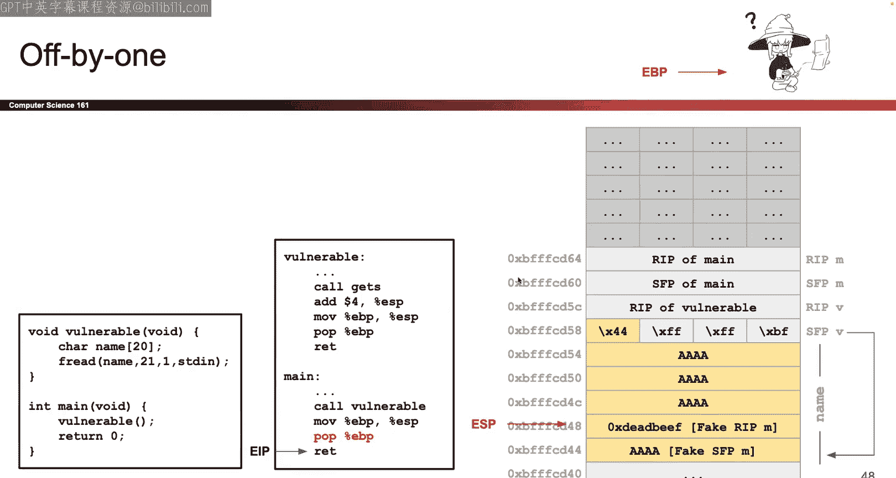

# UCB《计算机安全｜CS 161 Fall 2023 ｜ Computer Security at UC Berkeley》Calude-3.5翻译 p04 -04--CS161 FA23- Lecture 4 - More Memory Safety Vulnerabilities.zh_en -BV1YGbceREDs_p4-

A就。

Okay so today's lecture actually did not exist like a year ago and we added it because people are saying they wanted to see more complicated exploits than the ones we showed you last week so today all we're going to be doing it's looking at some pretty hard exploits some of them are going look really similar to the exploits you're doing for project one so think of today as like the project one guide to lecture's not really any new content today it's mostly just things that've already seen but harder and closer to what you'll see on Project one so that's the plan for today we're not doing any new content necessarily it's mostly stuff you've seen before maybe there's a little bit of new content but mostly is taking stuff we've seen before applying it in harder problems and hopefully giving you a better time on project so that's why this lecture exists we made it in spring hopefully there are no more bugs I think we caught a few in spring but we will cross our fingers okay that's the plan。

Okay。Okay， so the first half of today we' show you format stream vulnerabilities and this is one of the exploits that you'll be doing in project one。

 which is kind of why this exists。So this is a bit of a different flavor of memory safety vulnerability and it requires being really familiar with how the printf function works so one thing you might remember from62 and C or any program classes that the printf function it takes in a variable number of arguments you can pass in multiple arguments and printf will accept it so how does it know how many arguments it receives well somehow there has to be this mapping between the format string that you provide and the argument that you pass in so for example this is a printf call that you could do you could say1% S costs percent D and what you're doing is in that very first argument first argument is the format string you care about and in that format string you can add these special percent followed by character symbols。

And what this percent says is say go to the corresponding argument and in this case this is the first percent argument that I find so I match it up with the next argument which is fruit and then this percent D that's the second percent argument that I find so I match it up with the second argument which here is price okay。

So if you've seen printts before this is generally how they work。

 you can pass in a variable number of arguments and the hope is that the number of arguments that you pass in after that initial format string matches the number of percent format that you have and then what does printf do printf takes the variable fruit reads it as a string and then replaces the percent S with the value of fruit and then it takes the variable price。

 reads it as an integer that's what the D stands for and then takes that integer and substitutes the percent D with the integer and if you have a lot more percent format than it does one match。

Her present for matter。Okay but we're a security class so we're not here to do what's expected and give printf the right number of arguments to match the format string that we provide in the first argument we're here to do funny stuff so let's try to give printf functions that are mismatched so what does that look like Well here's an example of a nice version of printf where we pass in the right number of arguments how do I know that because I look at the first argument that I pass in that special one that's the percent formater and in the percent formater it's just a string but in that string you can have special percent formaters they get matched to future arguments so I just have one percent formater here it's the percent D so printf says percent D you pair up with the next argument123 so I'll take the1 two3 willll get into the D and that's what gets printed out。

Now what does that look like on the stack so just like in all the previous lectures we can draw our stack diagram and in our stack diagram here like the highlights so we declared the secret。

Local variables right there。And then we call print app so we're still calling function function hasn't return yet。

 so we're still going to leave the stack frame for function。

 but while we're calling function we're now going to go call print。😡。

So we're going to create a new stack frame for printf and what is that new stack frame contain well first when I call print app I pass in the arguments。

So I pass in the arguments in reverse order that's one of those C trivia rules that you just remember the first argument I pass in on the stack is the123 because I'm going in backwards order and I pass in the percent D and if you remember your string syntax and C remember that in C strings are really references to strings or references to character arrays so instead of passing in the actual characters percent D new line I'm passing in the address of wherever that string lives in in memory that's the argument that I pass in and then eventually now I'm ready to call printf so I create this big old stack frame for printf now we don't know what the code of printf is so we don't really care what's going on in there but do know that the frame for printf does exist while we're doing these vulnerabilities we just don't really care what's inside but we care about it's going be this stuff up here。

Okay so that's me drawing the stack frame for the function that you see on the left there are local variables then I called printf so I put some arguments on the stack and the only one that was kind of weird was the string argument where we had to remember that strings are really references to character ray in C so well what do we do well printf in this case the arguments are matched well so nothing malicious is going happen So what is printf do printf takes the first argument I'm going to start calling it the zeroth argument because it's the format string and then we'll say the first argument the one after it so I'm going to start zero indexing just because I think it looks nicer but this is not like common convention or anything so I'm going to start calling this one the zeroth argument because that's where the format string lives that's the special string that you provide where any of your percentees or percent S is will be replaced by one of the arguments。

So print app what does it do it reads this string that I passed in is arg0。

 the very first thing that I passed in and it starts scanning through and looking for percents and it sees oh there's a percent D right there so what do I do I go back on the stack and I find the next argument that hasn't been used up yet What is that one that's arg1 so now I know that arg1 is the argument that matches up with this percent D so I'll take that one23 on the stack read it as an integer plug it into the percent D and then go on my way printing the nullbyte and whatever else。

That's what print app does， printnt app it goes to the zeroth argument and memory where it issued by a string。

 it reads that string and prints it out character by character。

 and anytime it teas one of those special percent format like the percent D。

 it goes on the stack to find the matching argument and plugs it into the percent D。

That's what it looks like when things work well， so if things work well， we get the one， two three。

Now's try to be a security class and take away one of the arguments。

Now there's a mismatch Prif should if I were to call Prif correctly there really should be another argument after the zeroth one because in my zeroth argument。

 the format string I put a percent D so I should really have given printf another argument here to say here's what you should plug into the percent D but I've decided not to do that so what happens now。

😡，Well， the only difference on the stack diagram is that there's one fewer argument to push Se variables still there。

 The stack frames are still the same。 The only difference is I wiped out this argument。

 so this argument no longer gets pushed on the stack So it's gone the rest of the stack looks just the same and just like before we think about what is printf do。

 we can't see the code for printf， but we know what it's doing what it's doing is it goes to the zeroth argument that special format string on the stack that was passed in and it starts reading character by character and anytime it sees that special percent symbol it's like oh time to go substitute in something from the stack So what does it do looks at the percent D and it says all right that's a percent format that means that the user has passed in another of the argument that's going to match up with my percent D where's the argument gonna to be found on the stack So to the stack we go and where is printf going to look for the argument it's going to look directly above。

The format string argument a0。 So if we look at the previous example that percentee where did it look。

 it looked four bytes above a0。Yes。Cough， okay。And then what happens here。

 we look four bytes above a0 and what do we find we don't find the argument because the user didn't specify one。

 but instead we find the secret number that was in the code and now the secret number gets associated with the percent D so what will this print out it'll print out the 42 our secret has been leaked。

And that's because we passed in。The wrong number of arguments so this is like our hello world of printf vulnerabilities we mismatch the number of arguments。

 so when the printf function went to the stack to look for arguments instead of finding the argument that was pushed on the stack it found something else in this case some secret variable that got printed out when it shouldn't。

Okay， so that's unexpected behavior now let's try to use it to do something bad there's a piece of code that you might write I might write it looks more realistic than the one we had before so we've got some character array like we always do and we try to read it safely right so this is memory safe version of reading where we say don't read past 64 characters right inside bounds and I know that this is safe because I've looked up the f gets function when it's doing what I expect so it's not gonna let me write past the end of buff okay I'm happy with that then what do I do I call printf on whatever the user supplies。

Okay is that bad well that might be bad imagine if the user supply something malicious or the arguments are not matched so then we have a problem so these are called format stream vulnerabilities it's a big category of vulnerabilities and you get to suffer through one in project one so have fun with that okay。

What's the problem here， the problem is that we've called Pri up with just a single argument。

 the first one， that special zero argument or the zeroth argument， the format string。

 that argument is special， the zeroth argument， the very first one that you pass into printep。

 that argument is special because Prie uses that argument reads it and anytime it sees a percent。

 it goes on the stack to find an argument to pair up with the percent。😡。

And what have I just done in this code， I' have given the attacker total control of whatever they put in that printout。

😡，So I don't know， maybe when you're right see sometimes you're like I want to print something so I just call printep on that thing。

 but as we can see here， that could lead to really bad things if you're not careful with printep。

So what could the attacker specify well it's come up with some examples they use a bunch of percents so here's something that the attacker could specify if they specify some string that has the percent D inside what's printf going to do it's going to read the string zeroth argument in a special way it's going to go through character by character the one print the one the zero print the zero print the zero then it's use the percent D and it's like oh oh percent D I need to go on the stack take the next thing on the stack read it as an integer and print it out。

so it's going to print something on the stack that was not intended to be printed because there should have been another argument here。

 but there wasn't so instead of getting the argument that should have been there Priev goes in the stack grab who knows what print it as an in what about percent S kind of the same style we read the 100 printed out and we see the percent S and we're like time to go to the stack and get a string now what does the string look like and see remember and see strings are references to character arrays or pointers to character arrays so we go on the stack we take the next thing on the stack it's not a string it's a reference to a string or at least the percent S says so so what are we going do we're going go on the stack take the next thing what is print of expecting it's expecting that you put a string here。

But there's no actual string there so we go on the stack we take the next thing。

 we expect it to be a pointer to a string， but we don't find it， so who knows what we find。

 but whatever we find there we pretend like it's a pointer to a string。

 we go to that address and then print out whatever's there as a string。😡，And what's a string and see。

 it's a character array ending with a nullbte， so wherever we go in memory we start printing out characters until we see a null bitete。

So that's just the behavior of strings and seat。In a format screen context。So and C。

 just to read one more time because it's kind of confusing and see。

 you don't have the actual string stored on the sec。

 you have pointers to the string wherever it is in memory， and then you have to dereence that。

 go to that location and then print out characters until a null pops up。

Okay there was a question about the space so I guess this was just done to have like funny words or whatever the space I don't think we're going talk too much about it I don't know off the top of my head if the space in between those two stops the printf but I guess we can assume there's no spaces I think they just wanted to put funny words in this slide okay that's a good question。

From zoom okay and then here's another one where you say percent X percent X percent X percent X so if we do this what is printf expecting Pri expects that there were a lot more arguments placed in this printf function that were all pushed on the stack on top of the zeroth argument so what printf going to do for every percent X that it sees is going to go on the stack grab the next thing that hasn't been used yet treat it like an argument printed on in heodadecimal and is's going to print all sorts of stuff on the stack that probably were not intended to be printed。

So these are bad things that the attacker could do with the format stream vulnerability because we've given the attacker the option to pass in anything they want that special zero argument where the percents matter and so if the attacker puts in percent and we don't match them up with more arguments then now unintended things start to happen with values on the stack because Sprinte goes of the stack takes the next value thinks it's an argument but it's not actually an argument。

😡，可到。Let's try using this to do some bad things so there's another little piece of code starting to get a bit more complicated。

 but this one is kind of the same pattern as before so we have some character array down here and we're going to call print app on it so we're going to let the attacker put whatever they want here and they we're going to call print up on it okay。

Just like before the FGS is here to let the attacker right into above。

 that's safe so they can't use the FGS to write over。

 but maybe they can do bad things with the print De so。

And again strings are kind of weird they do take a bit of time to wrap your head around so for example notice here that what i'm declaring is not a character array i'm declaring a reference to character array so that's why the secret string is down here so in case you're wondering why the secret string is stored down here it's because I declared it as a char star a character array for a reference to a character array if I wanted the actual string pancake on the stack I would have had to say char bracket bracket to get the array but that's like C minutia so don't worry too much about it just know that this is the picture corresponding to this function in C。

Okay， so there it is again now let's pretend we're the attacker and we've inputed percent0 percent S so now we're calling printf。

Percent D percent S。 this is mismatched because that zeroth argument that critical argument where all the percents matter。

 it's got two percent format。 So Prie is expecting that you passed in two more arguments to match up but you didn't So now printf is gonna to take that first percent D well's start walking through So print is going say well where do I find the argument。

 So what I'm going to do in this lecture you don't have to do this is I'm gonna to start using this column over here。

 limited space that I have to start labeling what printf thinks the argument are located So for example。

 printf thinks and it might not be right if the arguments are mismatched。

 but Prif thinks that's our0 that's the place where I passed in a reference to the magical format stream with a percent that critical zero argument and then the thing above it that's where printf that's where the second argument would go。

 So if print have had percent D percent S comma something else that's something else would go here where argument is labeled And then if we printf percent D percent S comma。

Something comma， something else and R2 is where that something else would go So this is just me keeping track of where Princef thinks all the arguments are located。

 even if there are no actual arguments question。Yeah。

 there's a question of what if you spam so many percent signs you run out of space on the stack you'll probably run into some operating system there because what we don't show is that somewhere really high up into stack you start to enter like operating system space or kernel space so that's like an operating systems fast thing it'll probably crash in yell at you so I don't know maybe we try it someday okay great question。

ok。So this is just me writing out， okay， if Priep， if I'm Priep and I'm imagining where Prifp thinks the arguments are。

 Priep thinks that this is the argument after the percent format mattersters and then Priep thinks this is the argument after two after the percent formatters is it actually probably not because we have the mismatched arguments that that's what Priep is thinking so that's the note that I wrote to myself。

All right so here we go we're printf and off we go so we start with the percent D and we're like all right time to go on the stack take the next thing substitute it into the percent D so on the stack we go and we take the first thing on the stack which the printf thinks is the next argument and we sho it into the percent D and that thing on the stack that secret number its 42 so 42 shows up。

All right。Then we keep going Prif use the percent S。 and it's like that's another percent formater。

 I'm going to go on the stack， take the next argument that was pushed on the stack。 Now。

 nothing was actually pushed。 Prif thinks that something was pushed。 So if we go on the stack。

 take that next thing and now it's percent S。 So what does printf do when it sees percent S。

 It says this next thing。You probably supply a string because you ask for percent S and if it thinks you supplied a string。

 how does it print out a string remember strings are not character arrays they are references to character arrays so this is an address of where the actual string is so I'm going to have to go to that address find the string and then print out all the characters so we print out PA and CA K E and we see the nullbyte we stop printing。

So that's the output that we get， see the percenti， go on the stack， get something。

 read it as an integer， see the percentes， go on the stack， get the next thing， read it as a string。

 and to read something as a string， you go to that address and start printing characters until you see the Nollbte。

Which is just the byte zero zero， okay， so where do you do pancake is what you get if you print this if you pass into this simply。

All right。Coool， let's do another one。But I guess before we do another one。

 let's talk about there's a really obscure formatter for format strings so we know percent D is for integers。

 percent S is for strings now what the heck is percent n。😡。

This is one of those things that's like just really obscure see trivia unless you're security you're like a security person then this is you know the stuff of your nightmares so what the heck does percent end do percent end just like all the other printf formatters it goes on the stack and finds the next argument。

So percent D goes in the stack finds the next argument percent n also goes into the stack and finds the next argument now it's unlike percent D what does percent D do it goes in the stack finds the argument reads it like an integer。

 what does percent N do it goes into the stack finds the next thing and reads it like an address so it's going to go to that address and then what's it going to do it's going to write to that address。

HAnd what's going to write， it's going to write the number of bytes that print have has printed so far。

I promise you we will break this down more it's a really strange formatter as far as I can tell basically no one uses it anymore I think the reason why if I had to guess is so when you print it stuff out and see things with like output the spacing of output would look nice but just really weird really obscure format so here's an example。

Again， what does print up do it starts going character by character in that zeroth argument and it goes okay I I'll print that out T。

 I'll justprint those out as characters and then it sees that percent D so what does it do it goes on the stack finds the next argument since everything is matched up it will find that three sub to3 into the D printed it out and then it sees this percent n and it's like all right time to go on the stack and get another argument and what will it find it will find the address of the variable vow because that's what I put on the stack address of the variable vow and then what's percent D going to do with this this thing on the stack it's going to go to that address and if I go to this address what do I expect to find I find Val what do I find that the address of vow I better find Val and once I go to Val what do I write in Val because percent n does it right so go through that address doesn't print anything out it goes through that address and write the number of bytes I've printed so far how many bytes that I printed so let's count。

GEM space three colon， seven things in total， so I write the number seven in the variable value。

Mysterious let's do another one ITEM space those you printed out just like normal because there's no percent and nothing special happens and then printf sees the percente and it's like ah I got to go on the stack grab the next thing which happens to be the 987 if the stack is set up correctly substitutes it into D prints it out。

The colon prints it out percent N time to go on the stack。

 get the next thing that I haven't used yet， which is gonna be that address of Valal I'm going to read it like an address and go to that address if I go to that address what do I find Val if I go to the address of Val what do I expect to find Val and I write the number of bytes printeded so far so just like before I can count IT space987 colon nine things so I write the number nine into Valde stack。

So as far as I can tell， like I don't think this really matters， but as far as I can tell。

 this percent is used to somehow like align the spacing so that if you are trying to print this stuff。

 maybe you want to make it look all nice so the characters all line up that's my guess but honestly percent is so strange but I don't think I could tell you if there's a practical use for it anymore it's so weird but it's in there so if people can use it you can use it if you'd like okay。

Now what happens if you do present in with mismatch arguments that's where stuff gets interesting because now Prie is using all sorts of weird things on the stack that is not supposed to use and not only is it reading and printing out stuff and dereferencing stuff and it's writing stuff into memory2 so suddenly printe is not only reading stuff it's writing stuff that's really dangerous so what does this one do it's mismatched argument so we print out the000 just like always and then we see the percent n and we're like okay percent n time to go on the stack get the next thing on the stack and normally it should be some argument if the stack we set up correctly but it not it's who knows what's on the stack we'll grab something on the stack we'll treat it like an address we'll go to that address what are we gonna find I don't know depends on what's on the stack we'll go on the stack get that address go to that address I have no idea what's there and I'm just going shove the value three there so suddenly this printf called it's writing3 to somewhere in memory that we。

And expect。Strange。 so normally this would just be some trivia and some C class but since we're a security class。

 this is like， you know， it's like Christmas for us。

 we can use this and start going wild with all sorts of different vulnerabilities that use brain depth to write stuff in memory thanks to this percentage。

It is a really strange specifier， so stop me if you want to know anything about it， okay。

Sorry I'll try to do a better job checking zoom chat the reason why it's writing three is because they printed out the zero00 so in total three bytes of output showed up then the percent it hits so it went and wrote three somewhere。

Good question， right。Let's keep going now it's the same demo as before。

 but instead of writing percent T percent S， now I'm going to write percent D percent N。

So just like before the percent D， what does it do。

 what it goes on the stack finds the next unused argument。

 which happens to be this and then prints it out as in in and you have 42 same as before。

 that's what percent D normally does。Then we go to the percent N here's the interesting part we go on the stack take the next thing that has not been used yet and how do I know what that is well that's this because I already used ag1 so I'm just keeping track for myself what on'm the stack hasn't been used yet I already matched up a1 the secret number to the percent D so the next thing that I'm gonna match up to the percent n is the secret string R2 so what I've labeled it so what do I do with secret string I read it like an address percent n always says take the thing on the stack read it like an address go to that address okay percent N I will go through that address I follow the arrow and here I find the string pancake or the place in memory or the string pancake resides。

And what do I do I don't print this I don't read it I write something there so i'm going to write the number of bys printed so far how do I know what's been printed so far and I have this little output box that tells me I've printed the digit for and the digit2 so i've printed two things so far so i'm going to go to that address and memory i'm gonna shove the number two there so no more pancake now you're two。

😡，Ache and then a no。Okay。So the output is just 42。

But now I've taken parts of memory that I was not intending to change and suddenly that shrinkrimp pancake。

 somehow some of it got wiped out with the number two because of this percent。Okay。

Mysterious function， let's try to start using it for evil so。

To use it for evil i'm going to use this picture and the difference here is that I've decided to put the buffer on the stack instead of the heat or instead of static memory so just like always we can draw the stack diagram I promise you the more you do project one the more you'll come to love and you know appreciate stack diagrams okay and especially when they give you three points on exams you'll love them but anyway let's go to。

The stack diagram so I guess I'll draw it for you or I'll attempt to so usually when you call a function。

 the first thing that happens is we have to create that stack frame and I've done this so bunch times like I started to notice the pattern that every time I create a new stack frame。

Two things always start showing up which is the RIP that's the address of wherever the code's going to return to when it returns and then the SFP which is whatever value is going to go into that EBP register the top of the stack point or whenever i'm done so every function that I call those two things show up first this vulnerable function had no argument so I don't put them there now I can start writing the local variables so the first local variable is buff it's 16 so I'm going to use the rule that each row has four you don't have to use that but using my rule that each row contains four bytes Buff is going to take up 16 bytes。

All right， so that's both。Then I have another local variable and remember I put the first local variable at the higher address。

 the second one of lower address， that's just our convention in this class。

 that one is size 12 so it takes up three of these boxes okay。Now we're going to call FJS。

 so in theory， some FJS frame is going to appear down here。😡。

Okay and then FGS is going to do its thing the attacker is going write some stuff into buffer then FGS is going return and what happens when FGS returns that stack frame gone remember when you return from a function we always have to restore everything back to where we found it so when F getS is done it's like it left without a trace so our stack is clean again and there's no FGS function but do know that if I was drawing this entire stack diagram technically yeah the FGS stack frame appeared but then the function returned so it disappeared again。

Now it sends it called printf so I could have drawn the stack diagram halfway through fgS but I'm not concerned about FgS I'm concerned about that printf so I'm going to draw the stack diagram halfway through that printf call so what happens when I call printf arguments I push the arguments first So the first thing that I push this buffer how do I push buffer on the stack Well I'm not going to push the entire 16 bytes on the stack that's not how C works when C looks at a string or a character array it's actually pack C passing sorry the address of wherever those characters are that's just a little C syntactic quirk。

So that's the argument， that's the one and only argument， there's no more。

 so now I can write the RIP of printf。The SFP of printf， those don't matter too much for our exploit。

 but just know that they're there and then down here we have that printf stack frame。

And what's going on in that frame printer probably has some local variables。

 but I'm not concerned with them。 I just care about those arguments and how they're taken off the stack So this is good enough for my purposes All right。

 let's make it look nice， I think that matches what we just did。

So that's how I built the stack diagram。Okay， now， just like before， if I'm thinking like printf。

 we're in printf， so I'm going think like printf， what are the arguments that printf thinks is on the stack？

😡，How does Prif know where to look for arguments it looks starting here and starts looking up for all the arguments so as printf if i'm thinking like printf I can leave a little note to myself saying if I were printf and I was looking on the stacked upon arguments to make friends or match with my percent floor matters。

 here's where I'd find them。😡，Now this print app didn't actually pass in any arguments。

 but so none of these actually are arguments to printf except the zeroth argument。

 but if printf wanted to find an argument like it saw all a percent D and it wanted to go on the stack to find the buddy。

To match up with the percent， this is where I would find them okay。

There was a question about how does printf keep track of which arguments have been used up and which ones haven't I don't know I didn't write printntf so somehow printf is probably keeping track of which arguments match with which we don't know how because we don't care or know the source code of printf but as we're like reasoning through we can imagine that printf somehow knows okay there was a question about will arguments written on the stack always be pointers not necessarily if you go back to one of the earlier slides we pushed the number 42 I think as an argument and that wasnt another pointer that was just the value 42。

对。Those are all good questions though so here's me building the stack diagram here's me leaving a note for myself reminding myself that this is what Prif is thinking and this is where Prif thinks all the arguments are all right more zoom questions。

When would which be used so I'm not going to go into in too much detail right now。

 but for today integers are passed by value and then strings or character race we pass the address Okay great question no。

All right so this is just me labeling and it just tells me if I were printf and I had 7% format mattersers in that zeroth argument。

 this is where I'd find them， right。So here we go。Now I'm not gonna give you an exp and tell you what it does Now is your turn。

 Now you're the attacker and you have this strangely specific goal。

 but okay it's for our lecture so in this strangely specific challenge you want to get the number 100 written into the address deadadbe why I don't know maybe something bad happens if you do that but that's our setting you want to get the number 100 written to this particular address that's your goal all right now let's start designing the input so well this is not like those classic buffer overflows from last time where I can just be like okay I start writing a buffer and I can just you know go along my way overwrite some stuff and hope something bad happens because that's not really what's going on here In fact the fta stops me from writing outside of bufferuff so I'm actually limited to writing inside of buffer。

So I can't do my classic buffer overflow from last time where I start at buffer write my way up and overwrite something interesting I need to take advantage of the way that printf deals with arguments that don't match so here we go this is really tricky to me formating arguments or formating exploits and thing you'll be doing in Project one it's like juggling to me there's like three different things that have to be true at the same time and you have to somehow make them all through and sometimes when you change one to to make it satisfy or make it work the other one breaks and you're like oh I got to fix this one and you fix that one two more break and you have to fix those and somehow you have to make it so that all three work at the same time and it's like beautiful and everything has lined up in harmony but doing that is really tricky so let's try to juggle those three different things we saw printf out all these different things it was worrying about like where the arguments are or where it's writing to how many bytes have been printed all those things have to be juggled when you adjust one to make it right you might break two other ones so let's go through and think。

What those things you're juggling are and how you make it so that all of them line up together in some beautiful way to get this 100 to dead beef thing working。

 okay？So here are two things that you have to juggle one thing you have to juggle is where you're writing so we know that if we want to write something into memory a percent n has to appear that's the only strange percent format that causes printf to do some writing so at some point in this buffer input that I'm giving to the program it's got to be a percent n where is it yet I don't know that's part of my juggling but I know that when the percent n occurs what does print printf reads by by by character by character and eventually it's gonna to see that percent n and is's gonna say percent n time to write something at the moment that that happens both of these things have to be true not one not the other you need to juggle get them both right so two things have to be true first percent n how does it know where to write it goes on the stack takes the next thing goes through that address and writes there so whenever the percent n occurs printf is gonna go on the stack take the next thing go through that address and write something whatever address it finds。

Had better be this address because that's where I want to write stuff so I have to juggle and make sure that the thing or the location that i'm writing is what printf receives when the print when the percent n hits so when the percent n hits I call on the stack and the next thing that I haven't used it had better be De be so I can go to that address and write something。

The second thing that has to be true at the same time。

 which is what makes printf vulnerabilities so tricky is you also have to make sure that it writes the correct value how does Prif know what value to write it checks the number of bytes you've outputted so far so at the time the percent n has occurred the number of bytes you've printed so far it better be 100 because if it's100 that's going to cost printf to write the number 100 so you simultaneously have to make sure that the number of bytes printed out as 100 and when printf goes on the stack to find that next argument whether it's a4 or a5 or7 whichever one it takes off next for the percent N。

It better say that。So let's attempt to do some juggling。Okay。

Here's a nice split that might work so let's take a look at it and try to understand how it was juggling things so。

HThat's my input well the first question is when I write this input into memory what does it even look like so let's try writing it in memory this is what it looks like and right you start seeing these percents and these like deadbes addresses and it starts to get a little confusing so we have to remember what is this deadbe thing that's a fourbte address。

It's4 bytes it's the EF byte， the B E byte， the AD D byte。

 the D byte and those show up in memory right here four bytes long there they are right what comes next the percent character how long is the percent character it's one character and then the nine that's literal character9 Why is that the case remember what what does print have taken as that first argument。

 the zeroth argument string so I'm reading this all as a string the percent is one character9 is one character4 is one character and the C is also one character so there they go they're right there。

What comes next， a percent character， a C character， percent character。

 C character that's four characters in total fills up that row。

 then I have a percent and an n that's two characters fills up part of that row。

And all of this fits inside buffer it's less than 28 characters， so that's my input。

And that's what it looks like on the stack。几。😊，Anything on Zoom that people want to know。

 there was a question， does Prif always assume its arguments are four bytes for today， yes？

Sometimes maybe not question。Oh there's a question about F getts is takes 28 but buffer is only 16 how about we pretend that's a 16 for today and let's keep going I told you there might be some mistakes so at least for today we're not going to write outside a buffer I guess you technically could because I made a typo but in that case the buffer overflow will be the one we saw from last time but today I really want to do format screen vulnerabability so we're going try to get this done writing inside buffer okay you caught me all fix that later okay could you catch that。

Okay so this is one possible way to interpret this input is to count the number of bytes that it takes up in memory That's what I've done here and I've used the number of bytes that takes up in memory to fill up the stack。

 but that's not the only way that this could be read In fact there's somebody who reads this input differently print print reads this input differently how does printe read it printf goes character by character byte by byte and every time it sees a percent it's like okay time to go on the stack and grab another argument and read it so you can almost think of it as like print is it's like making friends it's like matching up buddies every time it sees a percent formater it goes on the stack and it chooses the next argument to be friends with a percent format that it sees So every percent format should have a friend it should be paired up with somebody on the stack So if I have4% formatters then I need to go pair up four arguments on the stack to be friends with those four% formatters they might not be actual arguments to print up if they're mismatched。

four things on the stack have to match， so let's go match them。

So Princef goes character by character。E， that's the byte， you're not a percent B。

 you're not a percent A D， not a percent D E， not a percent so for those first four no friends were made there were no percent so we didn't have to go on the stack and match the percent with an argument。

What comes next aha percent so what is the printele function do it goes on the stack takes the next thing that has not been paired up yet and it says all right。

 well the next thing we haven't paired up yet is this a1 so now you are friends with this percent format anytime I see this percent formater I go to its study on the stack read it somehow and then read or write something interesting。

What comes next percent C another percent well you haven't made a friend yet so let's go on the stack find the next thing that hasn't been used yet happens to be a2 now you're friends with that percent C anytime I see this percent C I go on the stack get a2 or whatever is at that a2 address and something interesting happens hopefully a reader or write。

Another percent C， you get the story， this one matches up with arc3， and then the percent n。

 that weird percent n that we care about， that matches up with arc4 right there。

So that last percent n sorry for all the crisscrossing lines。

 critical thing is that this percent n it matches up with the a4 thing on the stack and what a coincidence I've done a good job juggling because that percent N it just so happens to match with that dead beef if this input were even a little bit different that might not be true but I' really carefully configure this input so that when that percent n occurs the next thing on the stack it just so happens it's the addressers I want to write to so percent N makes buddies with that dead beef address which means when that percent n occurs。

 what's printf going to thing it's gonna say time to go on the stack get percent ends buddy go through that address and write something and it just so happens thanks to the way that I set up this problem that that percent N goes on the stack finds deadbe。

It's not immediately obvious how you would line these things up， but in this case。

 that's how they're line done。There was a question about percent C。

 I promise I'll get to that on like one slide， there was a question about how do I know the character length of elements in general you don't for a percent S。

 but we're using percent C。Okay。So I'll repeat that one more time the question was if you're doing like if you're doing percentas in a string how do you know how many characters get printed out of the string in general you don't but here we're using percent Cs so we don't have to worry about that and we'll talk about the percent Cs in one slide so don't you worry okay so that's one way that percent or the printf reads my input it looks for all the percents makes buddies with things in the stack anytime I see a percent I go to the matching thing on the stack and use it to read or write something interesting but that is actually not the only way that the printf function reads things remember there's one more way that printf reads or interprets the input and output there and that is the number of typess printed。

You thought juggling two things was hard。 Let's juggle three。

 This is the last thing that Prif thinks about which is how many bytes have been printed so far。

 So at the same time that printf is thinking about all those percents and the percents making friends with things in the stack it also has to keep track of how many things have I printed so far So if I ever see a percent and I know what to write So printf is keeping track of two different things at the same time which means that you the attacker on Project1。

 you're going to think of two things at the same time as well you're going to think of every single time I see the percent what am I matching with on the stack you are also going to think about whenever I'm using printf how many characters have been printed so far So let's go through and think about printf again and think about what Prif is thinking when it's looking through and thinking how many characters have been printed I said the word think out there sorry okay so here we go The byte E that gets printed prints one character another character。

 another character， another character in total four characters have been printed。What comes next？

This weird thing I haven't told you what this does yet。

 but now I'm going to tell you that percent C it prints out it it goes on the stack。

 takes the next thing and prints a character except I have shoved a strange number in between that strange number is weird again this is print at trivia but really useful for attacks。

That number in between tells me print out the character。

 but pad it using spaces until it's 94 long Okay so I'll go on the stack。

 get a character and I will pad it with spaces until it's 94 characters long So I'm probably going print 93 spaces followed by character Why does Prif do that I don't know Pri of trivia but in this case turns out to be pretty useful for my purposes because if I do that 94 characters get printed just by using this little input So this input did two things it went on the stack and used up one of the arguments so that future percent use arguments even higher up and it also cost 94 characters to spill out into whatever output print of is writing to or printing to okay。

There were questions about does this work if you do other things like 50c 25 c you certainly could so if you do 50c25c25c just add them all up or something maybe but then you'd have to juggle all the characters and make sure that everything matches so possible okay but let's keep going percent C what does the percent C do the percent C goes on the stack takes the next thing reads it like a character print it a character is one by long so that prints out one by but it did two things at once print up is doing two things at once it used up R two on the stack percent C you are friends with this thing on the stack whatever that is so I'm gonna go there use that thing read it treat it like a character print out characters are one by long so a single bike got printed same thing for this one I used up this argument on the stack and I print out one character okay。

Question。What happens if you go farther up， there are all sorts of ways that you can juggle this incorrectly and strange things happen。

 but let's focus on the correct grid to juggle and then I can try and take some questions okay。

And then here comes the most interesting part which is the percent n occurs so what happens now I go on the stack I take the next thing that hasn't been used and so far I've used up 3% format matters the 94c made friends with arg1 the two percent Cs made friends with a2 and R3 so who's the next thing on the stack that hasn't made a friend yet why it's a4 so what am I going to do I'm going to take that value go to that address because percent n expects an address I'm going to go to debt beef and I'm going to write the number of bys ss so far what's the number of bys printeds so far by some juggling coincidence is4 plus 94 plus1 plus one。

100 so this percent end is going to go to the jet beef address write the number 100 percent ends don't print anything that's why I put a zero there。

 but I have achieved my goal I've written the number 100。

All right let's start today questions this by the way is not at all obvious it's not obvious how I juggle this it's not obvious immediately how this all like plays together it takes a couple of like reads through it but this is on your project so that's why I'm trying to go through it in a lot of detail now and it's like a reference for you to come back to later okay questions。

The question about this 94 what is that Oh what is it writing yeah got it that's a good question I think the percent writes it as I think it writes it as uns sign well it writes it as ones and zeros right so I think it's uns sign but I guess I can check later question。

characters stackYeah that's a question and it's another one of those like C compilers do weird things and we have to make an assumption question so the question was characters are one byte so when I see this percent and I go on the stack how come I'm taking a  four byte value so at least in this class we're gonna assume that compilers when they push a character or argument the stack they push the character when they push three bytes of padding just so everything is lined up in multiples of four if your compiler work differently than who knows you might have different behavior for this class that's what we'll assume the question though anything else the 94 the 94 basically says you can think of it as whatever the heck this is is printing out 94 characters no matter what what it's actually doing is is printingprinting out a character and then adding spaces until the total length is 94。

But you can think of it as somehow it's just spi out 94 bytes what those bytes are are not important to us we just care that we've juggled the total number of bytes to equal to 100 There were questions about could I modify this to make it work well you know sure one thing you could do is someone suggested well hey。

 what if I put the number 50 here and then I put the number you know 25 here so this is percent 25 c right I guess I can do I don't know let's do percent 50 C okay and then I do percent what's 50 plus 44 is 94c something like that 45 I don't know。

You could certainly try to juggle this， but what you'll notice is that okay， you're like。

 am I going just change this and it's the same， but now the total number of characters you've used。

 this is still poor but that is now poor， so things are starting to go out of way。😡。

So that's the really tricky thing is even a small little change could break something else， okay。

If that didn't make too much sense， don't worry， it was like a specific question。

 but still interesting to notice how like all these things have to line up together， okay？

There was a question about if the argument is not a cha star， but a cha array。

 I believe it still gets passed by a reference like an address because that's how C strings work。

 they're always addresses of strings yeah。I'll go in the back and one more。

So you want me to put more things after the percent or before？Sure， we're can stick something here。

 oops， I will stick， what do you want to stick present C after here？

Sure so that's going to take up two more spaces on this stack it's going to show up right there what's it going to do it's going to consume another argument。

 so now it's going to consume arc5。All right。What's really weird here is that the print app is starting to consume its own input just kind of weird but don't worry about it too much it happens what does percent C do it prints out one byte so what's it going to do it's going to go to this address take a character here。

How the characters were organized or kind of beyond the scope of this particular lecture。

 but say it's the least significant bid or whatever the percent and it prints out the percent so if I did this。

It could an extra percent character afterwards。Yeah， pretty weird， don't worry about it too much。

You'll get practiced with it， this is definitely one of those things that comes with practice and even once you do have it getting all these things to line up perfectly is pretty tricky so。

Sorry for that one more question。Yeah， there's a question which is what happens if the number of characters changes so suppose I do and this is a good example of this is the stuff you'll be struggling with on Project1 it is tricky right because when you change something sometimes other stuff starts to change as well and that's what I mean by you have to get all the stuff right at the same time and that's what makes these questions so tricky you're like I just want to change that 94 plus1 to 45 plus 50 aren't those the same thing but remember these are bytes that I'm writing into memory before I wrote percent94 c percent C that was six characters in total now I'm writing percent45 c percent50 C now I'm writing8 bytes in total instead of4 so what that means is on the stack when I try to draw this out suddenly here instead of writing percent C I actually wrote percent50 C and then one of those percent C's got bumped up here right so does that change anything here I guess in this case you luck out and it didn't change anything。

But who knows the more you change these around things could change maybe you like run out of space in buffer or maybe that dead beef gets moved up or down so it's really tricky to get these in the right place。

 I guess in this case you luck out this might also work， but in general。And all bets are wrong， okay。

The question about the 28， the answer to the 28 is it is a typo， which is say 16 so。

That's just a way for us to exclude the classic buffer overflow where I just overwrite the RIP because we want to talk about printf vulnerabilities the FS is just a way to stop us from writing out of bounds except I did it wrong so I guess technically you could write out of bounds but in this question we're trying to not write out of bounds ourselves but let the print app write out of bounds for us。

There was a question about， is it 44 or 45， I think it's 45 because 94 plus1 is 95， 45 plus 50 is 95。

 so they add up to the same thing。Total number of fivepir Okay I'll take one more question and I'll show you another project when I exploit that's a little bit easier Okay yeah there was a question about why did I put string here I am not going to lie to you lining this up took me a long time last screen and those stream characters were the only way I could think of to make things line up and actually have things fit on the slide so。

😊，That's my honest answer why is the string there it's because I couldn't get things to line up without it you'll also get to experience this in your project ones but I promise in your project there is a way to line things up it's hard to find but it's there。

Okay， sorry， I don't want to scare you too much if you do a bit of G and draw out these diagrams the same way we have。

 you'll have an okay time on project one。Okay， there are more slides in here so one thing you could consider before you start project one just to make sure you've got this down is you could think about how would I modify this exploit if my challenge changed so suppose I wanted to write a different number of bytes or I wanted to change the address that I'm writing to which parts of this would I change it's like food for a thought after you go home if you want。

Okay now the way to stop this I will briefly mention how printf vulnerabilities gets stopped or how you would use Prif correctly。

 the key idea that made all of this terror possible is that you were giving the attacker control over the zeroth argument that was the key this is the only argument that printf looks at to read those special percent symbols all the other ones after the zeroth one those are just arguments that get plugged into the percentas。

The only one where the percent actually matters that zeroth argument。

 so what you have to make sure as a programmer is that zeroth argument never give the attacker control it's so tempting coming from other languages or just not thinking too hard it's so tempting to be like I want to print b print F buff but as soon as you do that you've given the attack or an input or a place to go into your code。

And make printf do all sorts of wild things， so you have to be really careful anytime you're using printf。

It's not just like a functionality thing or I don't want the compilers to yell at me。

 we really have to make sure for security that first argument。

That percent format matter it's something we specify now it's a hard code or percent S。

 if the attacker can't change our code， then they can't touch that percent S。Okay。

All right that's the end of format strings if you have other questions you know feel free to come talk afterwards this is definitely tricky I don't expect you to understand or to be like oh of course of course on your first run through of it as you do the project you'll get more practice with it again this is here because this without any prep on the project like terrified people so we tried to give you a taste of it before you attempt on your own projects okay。

All right， so I'm gonna to skip over a couple slides for the in the interest of time I'll come back later or're probably not going test you too heavily on them anyway。

 so don't worry too much about them， but they are here if you're interested。

 this is another way that you can overwrite things in the heap it involves fancy things like double pointers if you're interested。

 but we won't test you on them too hard I'll leave them here for context if you want them but I'm going to skip to I'm going to attempt to skip to。

The off by one exploit， another project one classic。

This is another one that's on project one sometimes people see it and they're kind of intimidated by how it even works again it's a pretty specific exploit so it's not something that you're going to see all the time in the real world。

 but because it's on project one because people always ask us questions about it。

 here is your lecture on how off by one exploits。Okay so you don't have to go out in the real world thinking like oh I really have to know exactly how this works。

 but for the purposes of project one you do at least for a little bit。

 so here's your introduction to it Okay this one I think is pretty cool because。

I'm going to narrow the attacker's power even further this might be the least power that the attacker has and still they're able to redirect execution a shell code so what do I mean by that well let's take a look at this code so this code。

Well I can draw the stack diagram like I always do so I write the main function Yes I'm technically kind of cheating by saying our IP of mainine because main is really caught by the operating system Someone always calls me out on that let's just pretend that main works like any other function and someone else is calling Ma like the operating system and the return value the SFP those or the return address the SFP those get pitch on the stack but yes technically you're right main is called by the operating system so things are a little weird out there Anyway we call main main has no local variable so we don't add any the stack frame is just those two things and then we call vulnerable what do we do when we call vulnerable well we create a new stack frame for it and just like always we put our IP vulnerable SFP vulnerable。

Kin of get used to it the more you do it that's what happens when we start a function void takes no argument so there we go and then void has a single local variable which is name and it's 20 bytes long so here it is that's name it's 20 bys long so I fill it up in five rooms you don't have to in your diagrams but that's what I've chosen to do okay。

You can also suppose that I've gone into G or my debugger。

 and I've learned somehow that these are the addresses。

Of each of the things on the stack and you can do that in your project once so you can go in G the debugger you can print out all the addresses of things on the stack and you too can draw a nice little stack diagram like this that tells you what values are on the stack and also where are they in memory So for example。

 well where is or what's at you know address Cd4 c in memory Well's some part of that name character right。

ok。Now let's look at the vulnerability， the vulnerability comes from this place。

 this Friid function where the attacker can read。Or we read the attacker's input and write it into memory。

Our name character rate 20 bytes long， How many characters are we letting the attacker write 21。

 that's what EE says， so don't worry about the syntax too much。

 but this Fied function lets the attacker write 21 things。

So what can the attacker overwrite a single bite and you're like。

 there's no way that an attacker riding a single bite can execute chocolate， right？

Yes they can so let's do it okay so first we figure out and this is another strategy that I use when i'm faced with one of these hardlook memory safety exploit problems the first thing I ask myself is if I'm the attacker what am I able to do because that might give me a hint of what's possible or where I should look for my exploit and just as importantly when I figure out what the attacker can do I am also figuring out what the attacker cannot do and if I can figure out what the attacker cannot do I can rule out a lot of stuff that might have been on my mind about possible exploits but once I rule it out I realize the attacker can change those values then I can rule out some exploits that I don't have to think about because I know they're not possible。

So the attacker starts at name， that's what Aed says and writes 21 bytes， so here's four bytes。

8 bytes， 12 bytes， 16 bytes， 20 bytes， they can write those， and then 21。

 they can write one of those four bytes。That's it they can't write anything else here it is in colors don't worry too much about the Indian is the left and right as the key of this exploit。

 the important thing is I can write 21 bytes and nothing else so anything in yellow the attacker can modify and crucially anything outside of that highlighted area the attacker cannot touch so say you want to do the good old classic buffer overflow from last time where I just overrite the RIP and the program jump somewhere funny can't do that I can't modify this value I can only modify one byte outside of the name character array。

So by highlighting this， I'd realized this is all I can modify the name character array。

 I can put whatever I want in there and I get one extra byte。What is that one extra by。

 that one extra bite is part of the SFD。What's the SFP， the SFP is the value？

Of the old stack frame pointer， which tells me what the top of the previous stack frame was， okay？

The question was what is limiting me to only the highlighted portion Well。

 that's because the code that was given to me only lets me write 21 bytes So whatever code I'm exploiting if I can only write 21 I've got to deal with it come up with the exploit So there it is that's the one only byte I can change because the program is the little Indiand the one and only byte I can change is the least significant bytes the lowest byte of that address So what goes in the SFP like what's the value of the SFP it's an address it could be a character could be a string or not a string but it could be like a number integer but it happens to be an address and the least significant byte of the address that happens to be something you can touch so you can change it。

And if you change that value， that 60， you're changing the address that the SFP is referencing。

All right so let's do it we can only change that one byte so let's go for it we changed it it used to be 66 using my exploit where I can write one by out of bounds I changed it to say 44 instead of 60 so what did that do well this 60 B FF F FF 60 that used to be I guess that should be a CDd another  typepo so someone tell me to fix that later okay。

That address that ends in 60 we'll say it's a reference to this thing up here even though I typed one of the characters sorry about it and that's what the arrow shows as well。

 it's a pointer or a character or a pointer or a reference or the address of that thing up there。

But I am about to change it， I change that 60 to a 44 memory and suddenly this is no longer a reminder to myself that there was something up here that I cared about suddenly now it's pointing down here it's the address of name。

喺屋企。😊，So what does that do well let's think about this SFP a little bit more so let's suppose we're back here in regular program execution nothing evil has happened yet the attackger hasn't touched anything in normal program execution where is the SFP referencing Well sometimes it's not totally obvious we might have to go back to lecture2 and remember but I'll tell you one useful trick which you can kind of see up here as well the value of the SFP it just so happens and if you don't believe me go back to the lecture2 where we talked about the stack frames and how functions get called but it turns out this a nice little shortcut which is where does the SFP point it basically always points at the SFP of the previous stack frame。

Nice little side effect of the way that we set up the stack so that value in the SFP if you go to that address you will find the SFP of the previous stack frame it's almost like a chain of SFP for every address that I follow I get the SFP of the previous stack frame the SFP of the previous stack frame that's just the way that the stack is set up and again you don't have to believe me to go back to lecture2 and try calling some functions you'll see that this is always the case assuming the attacker doesn't change the so if I were to walk up to this program halfway running and I was like hey C program can you answer a question for me real quick where's the SFP of the previous function the C program would probably look at you really confused because it's a program but you know if that C program could talk it would say oh okay well if you want the SFP of the previous function well I know that the current SFP is always a reference to where the previous SFP is so if I want to know where the previous SFP is I can just look at the current SFP。

It's a reference where the address up where the previous SFP is。Okay。

That was a long winded way to say this is what the C program thinks is here。

Now I have gone in as the attacker and Ive changed it the C program was not expecting this the C program thinks that in normal execution this thing should not change but we did it we changed it so now if I walk up to this broken C program where the stack is all messed up and I ask the same question which is hey where's the SFP of the previous stack frame like where should I go to find the SFP value of the previous stack frame what's it going to say it's going to say oh just look at the value here going go there that's the your SFP of the previous stack frame？

Well， no it it's not because we changed it， but now the C program thinks that the SFP of the previous stack frame lives down here。

 so that value that used to say SFP of mainine， if I'm now asked the program to go to find it。

 the program would look down here to find it。Because I changed that one byte。

So all of this is to say by changing that one bitete， suddenly now is looking down here。

For the SFP of Maine， okay？That was the answer to whatever that says， okay？

But there's something even more important which is like wait a minute the SFP that's not what I used to get show code to execute what I really care about is the RIP that's the good stuff that's what I used to get the show code to execute because that's how I get the program to jump to other places that I care about and start executing instructions so again I walk up to this normal looking see program it probably cannot talk but if it could talk and I asked it hey where is the RP of the previous stack frame。

So if I'm currently in the stack frame of vulnerable and my previous stack frame was main and I want to know。

 hey， if I want to know what the RP of the previous stack frame is。

 what address member should I go to like where should I go find it and if the C program could talk it would say well。

 this is the current SFP value， go follow this pointer follow this address and you will find the SFP of the previous stack frame。

And what's always about the SFP is the RIP， so if you go there and then go four bytes up。

 you're going to find the RIP， that's what this program would say if it could talk。

Which probably can。Then we come back here and we ask the program again the same question the program does not think anything changed because the program was not expecting an attacker to go in a modify memory so if I ask the program the question it's going answer the exact same thing which is okay well if you want to know the RIP of the previous stack frame。

 all I have to do is look at the SFP of the current stack frame that's an address if I follow that address I will find the SFP of the previous stack frame because that's what SFP is always point at they always find at the SFP of the previous stack frame and hey if you want the RP of the previous stack frame just look four bytes above so if you want the RP of the previous stack frame。

Just look right there， that's the RFP of your previous stack frame。We've confused the program。

 it's giving us this wrong answer instead of the writings。Okay。

 what can we do with that well suddenly as a result of changing this last bite。

 we have fooled the program into thinking that there's an RP living here。

Is there actually an RP there no that's part of the name character rate but because we've changed one bite of the program suddenly the C program gets really confused and it's starting to think that SFPs and RPs live down here when they really don't so that's kind of the key of this exploit by changing that one byte now the program thinks that the SFP is here and it thinks the RP is or above which is right there。

All right。So suddenly， because I've confused the C program a lot。

 now I know where to put my address of Shekis。Where should I put my address of shell code。

 I should put it where the program thinks the RIP is。

 so I've done two things I've confused the program。

By making the program think there's an RIP halfway through main or four bytes above the start of main and then where the program thinks the RIP is that's where I stick the shell code so I've done two things I fool the program into thinking the RIP is somewhere it's not and then I put the address of shell code where the program is now incorrectly looking。

Or the RIP？So that's the way that I got this exploit to work now let's actually see it in action。

So it like always i've taken the X 86 instructions and I've put them here and we'm going to step through them line by line to see if this does what we expect so here we go we're going to finish running that first function which is vulnerable so let's return from vulnerable all right here we go so the epilo does three things it always does the first thing it does is it takes that ESP at the bottom of the stack and it moves it up here ESP is a register holds an address point summary and memory i'm going to move it up there because I' moving it up there I've deleted the current stack frame so。

Moooot stack frame deleted okay next step is now i'm going to take EBP it's a register holds a value currently is holding the value of the top of the vulnerable stack frame I wanted to hold the top of the address or the address of the top of the previous stack frame top of the main stack frame so what do I do well I know that the previous EBP's value was saved on the stack that's what I did I saved my work so that I can always take the saved thing on the stack put it back in my register so that's what I'll do i'll take the saved value on my stack which happens to be this value。

I'll take the save value， put it back in my register。

 what happens if I put this back in my register EBP？😡，Well。

 now my EBP points down here because I took this value and I put it back in EBP so now EBP thinks the previous stack frame。

Top is here， Okay， kind of weird， but that's what happened。

So here EBP top of the vulnerable stack frame right and I'm ready to return so I want to get the top of the previous stack frame put in EBP how do I know the top of the previous stack frame I wrote it down on the stack when I was preparing to call this function so I can take the value that I wrote down to remember from before load it back in EBP and as soon as I put this value back in EBP。

Now that's the value in EBP， EBP now has that value ending in 44。

 which is equivalent to saying it's pointing at that address44。Thats is kind of strange。

 but let's keep going the final thing we do is EIP。

 the instruction pointer is ready to go back to what it used to be Currently the instruction pointer holds something in vul。

 it's pointing at some instruction vulnerable but I wanted it to go back to where it used to be how do I do that I take the next thing on the stack which I put on the stack earlier to remind myself what was an EIP and now I put it back in EIP and here's the important thing I did not change this value like look at it it's great I didn't change it at all So when I put this EIP back in or when I put this RP back in the EIP value She code's not going to execute nothing interesting is going happen I'm just gonna go back to the main function because this is not change at all so it's not like those classic buffer overflows where I changed this value and I jump somewhere where I have shell code this is unchanged so when I shove it back in the EIP I just go back to main like I always do as if nothing happened so look I'm back in Maine。

O。See that EIP， it went from vulnerable and it went back into Maine。ok。

So that was the vulnerable function of recurring and you're like， wait a minute。

 you're not executing shell code， like look at the instruction pointer， the instruction pointer。

 that's not shell code。😡，The She codes at Deadbe so oh my first function return actually did not get She code to execute。

 but that's okay because I have two functions， so that's the other key of the off by one exploit is that it does not just take one function return for things to happen。

 it takes two function returns for things to happen。

All right but after the first function return things are starting to look a little strange so if we look at the stack well remember the ESP points to the bottom of the stack so if I ask the program where's the bottom of the current stack frame well the bottom of the current stack frame is well it's right there that's where ESP is where's the top of the current stack frame that's wherever EBP is so where's the top of the current stack frame right there okay so somehow the bottom is up here top is down here I told you things are starting to get weird okay but the program can still continue all the registers have values we can continue on and try to return from the second function。

With only one difference， so the only difference is that this value down here。

 it should have been up here， it should have been pointing to the top of the main stackling。😡。

EBP should have been a here， why did it change because I changed its saved value and I changed one of those fights so when I put that saved value back in EVP now it's in the wrong place。

😡，So that's another way to think of the off by one exploit is to say all the way back here。

Sorry to keep rewinding all the way back here I only changed one thing which is I changed that 60 to a 44 that's the one thing that I changed and what does that value represent that value represents after the function returns what goes in EBP so if I changed only one value and that value is what goes in EBP than when I return from the function what's different the thing in EBP that's the one thing that I changed。

So as I expect when I return from the function， everything is normal I'm still in main。

 my stack frames are still set up the way they were。

 everything went back to the way it was except for one thing which was the thing that I changed I changed the old value of EBP so when I restore that old value of EBP now EBP's value is incorrect it's pointing down here。

That's not the top of the stack frame， but the program consider is。D， okay。

Now let's try to trigger the second function of return so time for the second function to return we follow the same three steps we always do all the functions end the same three steps so what do I do I want to first delete the stack space so I take that ESP and I move it up to the I move it up to the EBP。

😡，That's thought up as down that's because the stackg is all messed up right so normally in regular function execution the way that you clear stack space is you move this thing up。

 but because the EBP is all the way down here， I'm actually moving it up。In quotes， okay。

So now it's here， that's the first step of any function return what comes next well what comes next is I take the next value on the stack which is always going to be the SFP at this point and if you don't believe me lecture two will convince you。

😡，RightThe next thing on the stack is always the SFP that's the value that needs to go back in EBP when the function returns so I take that value I put it back in EBP what's that value it's sum a okay those are some bytes I can put those bytes in the EBP register and what's EBP going do it's going fly off into nothingless nothingness just like we saw from last time。

So that EBP register is still contains a value AA， what is that the address of， I don't know。

 it's seeing somewhere up there。All right SFP is gone so we used up the SFP we put it back in the EVP register for the main function and now the final step of main is to return so what happens when you return you take the next thing on the stack which is always going to be the RIP it's the RIP the fake RIP but still the RIP or the program thinks it's an RIP so we take that next thing on the stack we put that in EIP in other words we go to that address and start executing instructions so at law and last it took two function returns。

But I'm starting to execute sheltercare。Okay， there it goes， so that EIP it used to point here。

 I took that value on the stack， I put it inside the EIP register and now the EIP register is pointing at deadad beef where I put my glorious shelf。

Okay this is another exploit that you have to do on project one and it's another exploit that just by watching me talk through it you're probably not going to get all the intricate details that go into it and that's totally okay this lecture is not like you have to memorize all of the steps it's more like a way to get you familiar with these so that when you go into project one and you're coding up the off by one and question four and the vulnerable the vulnerability in question six you're hopefully not like totally terrified okay can I take some questions on this okay because i'm sure there are some yeah。

Yes， there's a really good question which is how would this even happen in real life So you're right we kind of came up with something a little bit convoluted here can everyone take some questions and then you can all go home okay so yeah here we kind of did a convoluted example where I just gave you 21 bys for no reason but you can imagine that in real life off by one nurse happen all the time sometimes people read the function wrong or they think that get us needs to be one more the argument get us has to be one more than it is so you can happen in real life the example here a little bit contrived the example in the project I think is a little bit more realistic but off by one nurse they can happen okay everyone is so impatient so here's what I'll do you can all go home but if you have questions I will stay here so I'll be here you go home and I'll see you on Monday okay by there was a question about why it doesn't go to deadbe on the first return from zoom So the question was how come it doesn't go to deadbe on the person。

On the first return there's a lot of ways to answer that to be honest with you and the more you walk through this。

 the more you'll see different ways to answer it， but to me the most obvious answer for why it doesn't returns a dead beef on the first return is because on the first return how does the function know the function vulnerable know where to go back to it looks at the RIP that value on the stack the IIP of vulnerable this this is where vulnerable is going to go execute instructions after your returns and we didn't modify it so because we didn't modify it when the vulnerable function returns we go back to where we were where vulnerable came from which was made so we did not overwrite the RIP of vulnerable to me that's the clearest explanation for why it doesnt return with dead beef on the first right but there's lots of other explanations you come up with。

Based on this next there's whole more zoom question then I'll take the real ones so or the real in of people how does ESP get moved up when we pop EVP remember the pop instruction this't straight from lecture2 the pop instruction what it says is take the next thing on the stack put in the EVP register and because I've used up that thing on the stack move ESPF4 so the reason why ESP goes up when I call pop EvP is because the pop instructions says take the next thing on the stack and I move the ESPfi4 because I just used up that thing on the stack so it's like lecture2 for okay those are all the zoom questions however I will keep the zoom open and I will start taking questions in person but I will stop the recording since it's around 630 so for people watching at home I'll see you on Monday。

