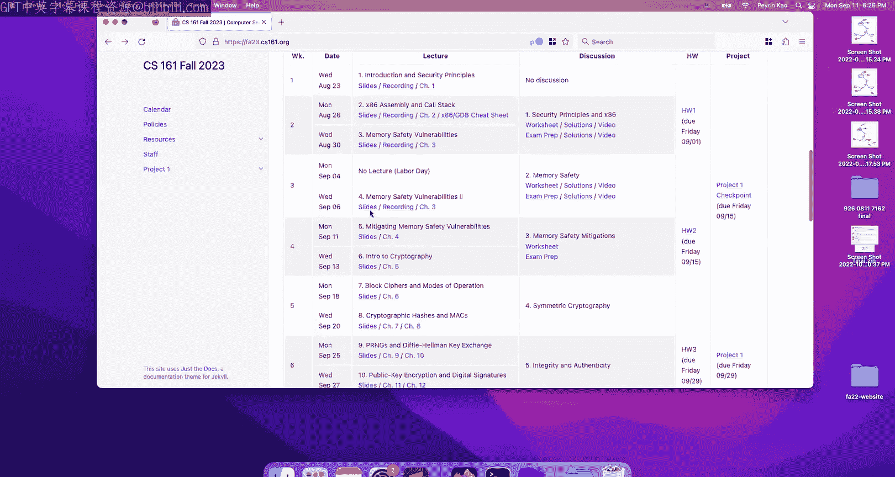
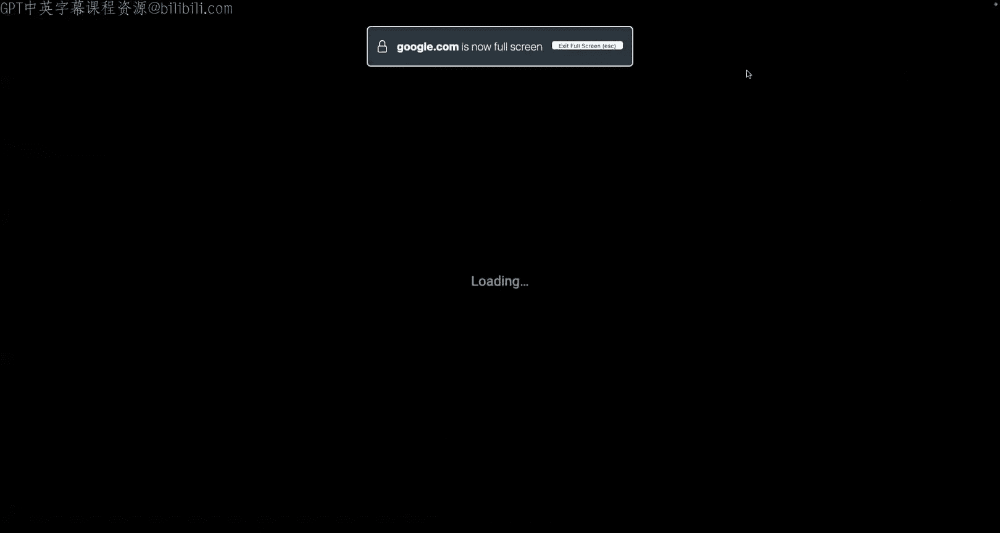
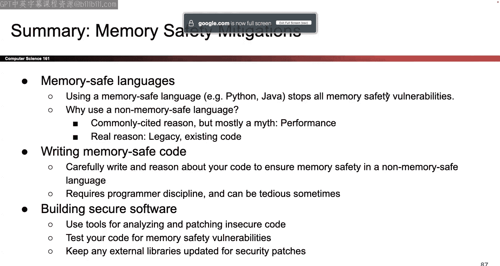

# UCB《计算机安全｜CS 161 Fall 2023 ｜ Computer Security at UC Berkeley》Calude-3.5翻译 p05 -05--CS161 FA23- Lecture 5 - Mitigating Memory Safety Vulnerabilities.zh_en -BV1YGbceREDs_p5-

Okay， I thought we got some random stuff before lecture so let's start with the actual content。😊。

For the so today's our last memory safety。Today's our last memory safety lecture。

 so for today we're going to talk about ways to defend against memory safety vulnerabilities and also ways that attackers can get around our differences and after today you'll have everything you need to finish all of project one so that's exciting okay。

So at the first like 10 minutes of today I'm going to speed around the first set of slides here where we're going to talk really philosophically and high level about what it means to stop memory say vulnerabilities and why these things even happen and then for the other like 80 minutes of today we'll get into the details of ways that we can stop it and ways that attackers can get around them okay so let's start really philosophically and talk about well here are some ways in which we can stop attackers from exploiting vulnerabilities in our code so we'll start with well use programming languages that don't have this fundamental wall so we already saw that all of the problems in see they come from the fact that in see we don't do bo checking。

In C if you were have like an array of size5 and you ask for the six items C does not stop you it doesn't have any notion of bounds so one thing you could do is pick literally any other language that checks bounds and turns out almost all modern languages do check bounds so if you try to pull the same trick of writing out of bounds and Java Python Ccharrk go rust any other language you can think of besides C you plus an objective C chances are that language checks bounds by design so if you ask for something out of bounds the program will crash and say note you can't do that as opposed to see which will happily let you index out of bounds and possibly let bad things happen so one thing you could do is just pick a language that by design checks bounds it turns out this is the one and only way to stop 100% of vulnerabilities you use a language that's like literally anything but C then that language will not allow you to write out of bounds that solves the fundamental problem that allows for all of these vulnerabilities that we've seen so。

You' one foolproof defense okay。So that usually raises the question of like， okay。

If it is the case that literally any language beside these three will check downs and there won't be no memory safety and vulnerabilities ever。

 then why do these things still happen and this gets into a bit of like opinion。

 you will always argue me about it， there's our opinion which doesn't have to be your opinion but usually when people ask what the point is of using C one commonly cited reason is that C is faster it's closer to hardware it gives you more control over what you want to do because you can directly access memory and manipulate memory in funny ways so sometimes people will say well there's a tradeoff which is yeah it's less secure。

 but it also runs fast so that's a possibility sometimes people will argue that in my opinion or like CS1601's opinion it's not like fact that our opinion is that。

In reality， this performance benefits of C for the most part didn't really matter like does it really matter if your program runs a couple milliseconds faster than if you use another language in most cases maybe not there are certainly cases like operating systems where the performance really does matter but for a lot of cases that performance just does not show up and in those cases maybe it's better to pick a language that's memory safe and another thing that again like we feel but you don't have to agree with us is that this straightoff between security and performance it used to exist but nowadays there are languages that give you both so for example rust is another language that gives you really low levell access to harbor and lets you manipulate hardware by yourself but rust is actually memory safe so rust will check bounds and it will make sure you don't go out of memory where you won't like write out of bounds and memory or read out of bounds but rust is memory safe and it also has I would argue comparable performance to C so it probably it depends。

Your use case but nowadays there are other options out there so you don't have to just go with C and say oh well C is the fast one it's insecure what can I do you can go and check for other options go rust there are other options that have similar performance benefits if not equal depending on your use case but they're also safer so that's our take on it doesn't have to be your take。

And another kind of point that we'll make is well all that time you spend writing code and C and like chasing down bugs and stopping attackers and worrying about security。

 maybe at that time it' just better in writing in a safer language and another thing we'll notice that there are also libraries out there that plug into faster code so for example。

 Python is a pretty slow language mostly but if you use a library like N NI actually plugs into C and runs Zco that we think is memory save or a lot of people have checked it hopefully it memory save。

 so that's another option is you can use other languages that plug into libraries that call programs like that call C programs like NI it's actually written in C but you can call it using Python。

Do nu pipe things using python sorry if microphone keeps cutting out I don't know if it's just me。

 but I don't know let me know if it sounds awkward and I'll try to fix it Okay so another reason that gets brought up is well。

 like why not just not use sea code ever if it's so insecure Well another reason it's just it's been like 50 years of seeing There's a lot of stuff out there that's just written in C and。

YouIf someone hands you a big code base and it's like a million lines of C code like well you've got two options you could say this code is so insecure and write a million lines of new code and rust or you could be like well this is what I got to do so I'll just keep writing the code in C so as another reason it's really hard to change something once a lot of us have started adapting it C is so widespread in like computer science that there's just stuff that exists in C and as much as we'd like to no one's ever going go through and like rewrite the entirety of whatever it's currently in C to be a Nazi so we're stuck with it okay。

So there are examples of this like iPhones used to use objective C。

 there's probably little objective C code out there。

 they're trying to fix it I'm moving to safer languages， but you know that's a legacy for you， okay。

So that was one way to stop memory safety language or memory safety vulnerabilities is to use a safer language another way to do it is something we mentioned last time which is to be really careful when you program and this is one of those things that like philosophically it's a nice thought but in reality this is something that's just either really difficult really tedious or maybe impossible depending on how you feel but you could be really careful with how you program always make sure that you add checks for things like if something is null you gotta check if something is out of bounds you have to check so be really careful and tedious about checking that your program is in bounds you have to be really careful about all these functions like we need to always know getS can write out of bounds but FS can't if you supply the right argument same thing with stir copy versus stir end copy all these other ones so we could be really careful as we write C code and go through and make sure that everything we do is inbounds and uses safe libraries。

could be really careful and we can check okay if the users if we're gonna to let the user input something maybe we shouldn't let them input anything like if I'm writing a program and I want the user to input their age。

 maybe I have to add a check that says you can only input digits zero through9 so if I ask for like what's your age the answer should not be8 times 20 plus orless junk no it should be digits between0 and9 if you want to be really rigorous about this there's a whole area of CS theory which is pretty cool but not something we'll have time for where we think about preconditions both conditionsitions and invariance and here what we're doing is we're trying to write mathematical proofs or logical proofs that our program executes correctly and safely so you could if you wanted to go out and start writing proofs that say like my program well if it takes these types of arguments or inputs and I run these things then it has to be the case that this is true therefore this is true therefore I'm not indextic that balance so you could actually write proofs to make sure that your program is safe now are we really going to go home。

Like start writing proofofs for every piece of code that we write probably not。

 but it is an idea that's out there okay if you're interested there are videos that we've done in the past semester in past semesters that talk about this but this semester we're not talking about it it's really tedious and in practice we're almost never going to be proving better codes correct。

 but hey it's an interesting topic so you're interested。Okay。

So those are the first two ideas using safer programming languages that's great。

 but in reality there's just a lot of legacy code it might not be possible trying to be really diligent about writing memory safe code in theory is possible but we're humans and humans make mistakes Another idea is there might be some automated tools out there that help so these do exist I'm not gonna to talk too much about them but there are sometimes checks out there that like monitor your program while it's running and check that plenty things aren't happening and if something funny happens maybe the tool will tell you and say hey something weird that that you might want to check it so maybe you've got some program and you know that your program never calls the C library function Ex V which executes anything else but suddenly you're like wait my program has switched and started to execute this exact V C function what the heck so maybe some tool can catch that for you and notice that something is weird might be too late by the time you detect it we'll talk about that a lot later in this class we talk about intrusion detection but these tools they do exist we won't talk too much。

But it's an idea。Okay and again we'll talk a lot more about this later in the class near the end。

 but there are some tools out there that are automated。

 they help you find philosophy of your software， they try to execute common attacks and see if they work you can also try to pay people and asked them to break into your system see if they can find things but these exist we wantt talk too much about them but they're also not so whether these work or not kind of depends on the tool depends on your software there's also exhaustively testing one pretty useful one is fuzz testing so the one on note here is like you could throw a bunch of random input at your program and see if any of them cause out of bound rights or crash your program that could be a way to find vulnerabilities you could also use tools like Valgri from6 to andC which detects when you're writing out of bounds that's an example of an automated tool that checks for out of bound rights also cio because someone told me about this like a couple months ago and it's not it's still in my head apparently this is not pronounced Valgr it's pronounced。

Valgri I don't know how do we feel about that okay I just want to get it out there that's not important Someone just told it to me and I was like really okay anyway I will call it vgri you can call it valgriin but that's a tool for detecting memory release or writing out of bounds so you could also use that but in general these are not foolproof okay。

And the other part of writing in C that's really tricky is that oftentimes you're not writing all the C code yourself so it could be the case that your C code is beautiful。

 you wrote a proof to make sure that your C code is not broken。

 you're very confident in it use all the right libraries you made all the right checks but you imported some code from somebody else and the code that you imported that could also be non-memory safe and this happens all the time。

 you know how your computer is always asking you about updates or when we're writing code the libraries that we're using are always being updated well that often happens because if securitys vulnerabil is being discovered and patched so it's really difficult to write a piece of C software and being confident that it's secure because not only does your own code have to be secure but you also have to make sure that any libraries that you import are also secure and if they're not then youd better update your code and if you update your code is it going to be backwards compatible I don't know so it's tricky not only does your code have to be secure but everyone else's code that you use。

Also has to be secure and if they patch their libraries， you better make sure to update them。

Can be tricky okay that's basically it for all the philosophy I wanted to get through it quickly because all the good stuff is in the second half of today。

 but if you have questions about those we can talk about them afterwards So that's the philosophy about why is it that these memory safety vulnerabilities occur what are some ways in which we could try to be more defensive when we program or there tools out there but in general sometimes you're just gonna be stuck so if someone hands you a big C program and says please write some new feature for me or please debug this and there's just nothing you can do I'm not going to rewrite this gigantic C code base into a different language and I use some tools I don't know if I'm going to find the problem So what am I going to do to make running this code a bit safer so that's the rest of today which is we're not going think about writing rewriting in another language if that's not plausible or feasible or I'm not going to think about writing a proof for this gigantic program that someone has handed to me so what can we do well we can turn on some or we can think of some ideas。

And we're going to call them mitigations and these are defenses that are general purpose。

 They can run on any C program。 And the idea is we're not going to try and stop exploits or detect every exploit when it happens because 100% accuracy on on unsafe language like C is just not going happen So instead we're just going try to make the attackers like part that's our goal for today So we already saw philosophically ways in which we might be able to stop all memory safety vulnerabilities or program defensively and stop them from happening in the first place But for today our main goal is to think about someone has handed us a giant piece of code we cannot rewriting it in another language we cannot stop all the vulnerabilities from happening So how can we at least run this program in a way that makes the attackers like partner that's our goal for today Okay so let's take a look and see what's going on and a lot of。

Mitigations from today the common theme will be that letting an attacker exploit our program is bad because that means that if they exploit our program。

 they can run anything they can show code they can use our executable to like delete files send emails that's bad I have no idea what the attacker is gonna do however if I can somehow make it so that I crash the program when something bad's about to happen that's probably better is crashing good not necessarily but crashing is at least better than letting the attacker do whatever they want so a lot of today will be relying on if something goes wrong let's just crash the program and yeah we did crash the program but at least we didn't let the attacker do whatever they wanted so that might be one way can make the attackers' life harder okay。

That's the goal for today， the outline。And so the way that we're going to make the attackers' life harder is when I go back and remember that a lot of memory safety attacks。

 they follow this process， which is we find the vulnerability。

 we have to write the shell code to memory ourselves because it's usually not there。

 we have to overwrite the RIP if we're doing the classic buffero the exploit with the address of the shell code that we wrote and then when the function returns we start executing the shell code so this is from two lectures ago。

OkayAnd so our goal for today is we're going to take some of these steps and try to make it harder for the attacker to do those steps and if the attacker has a harder time making this attack happen well then we've at least made their lives harder even if we haven't stopped all the attacks so that's our goal for today so we'll talk about three maybe four different mitigations and then we'll be done for the day okay。

First one is called non-exable pages so we're going focus on this step five right here so step five is once the attacker has written their shell code into memory and made the return instruction point or point out the shell code when the program returns the program starts executing shell code can we make this harder can we stop the attacker from doing this Well there is one thing we can do so here's the general idea it's a lot of words but basically the idea is that we can divide our memory into different sections。

 for example we did stack heap static and code and if you think about each of these sections it's not always the case that we have to write from them and read from them and execute instructions from them at the same time so we can set permission bits to say in this part of data or this part of memory we should only be able to do certain things but not other things so for example let's think about the stack。

Well should I be able to modify values on the stack。

 yeah probably maybe the user has some input and the input changes the value on the stack。

 so it should be the case that the stack should be right of whether or not we're going out of bound。

 maybe I just want the user to enter their age and then I change a number on the stack so it should be the case that values on the stack can change it's not read only。

What about the heat， same thing maybe I call mal to get some space on the heat and then Ill let the user write something into the he that's okay same thing with static so these should be said to be writeable but then think about like well do I need the executable permission on any of these sections of memory like is it ever the case in normal program execution that I would want someone to be able to go on the stack and execute instructions well not really right if you think about the way that we normally set up memory it's usually the case that all of the instructions that tell me what to do like the assembly instructions and risk five assemble down its zeros and ones all of that stuff is in the code section it's not of the stack or the heap or the static sections so maybe what I can do is I can set up permission that says stack heap and static if there are ones and zeros in stack heap or static memory you should not treat those as instructions and execute them？

Because that's not something we ever do with normal execution maybe there are some rare exceptions。

 but for like 99% of programs not something we have to do so let's set a permission bit that says stacky and static in those sections of memory we should not allow anybody to execute instructions and we can think about the code section the code section is the other way around so in the code section we do have ones in zeros that we want to execute that's the place where we put the ones and zeros that represent the instructions you want to execute so when we're trying to decide what permissions to set we better set executable and the code section to true otherwise the program will not run those instructions but then think about like writeable do we need to ever edit or modify the instructions after we've compiled the program and we're ready to run in I don't know in most cases probably not so if you feel like this code is once you compiled it and assembled it you're not going to touch it again you could set those sections of memory to be nonriable like read only memory。

That's one option， so that depends depends on if you're using some fancy compiler tricks。

But in general， that code section could be set to be executable， but not right。ok。

So you're like wait how am I going to do this is there like how do I tell this program that you can write to these sections but not for these sections and you can execute these sections。

 but not these sections well turns out the operating system has this really handy thing called virtual memory which we're not going talk about in too much detail。

 but virtual memory is an operating systems level thing and the operating system actually has these exact permission bits for us and it has a permission bit where you can set a section of memory to be writeriable or executable so in that section you can set a bit that says can I edit the data in this section you can also set a bit that says can I read the ones and zeros in this section as instructions and execute them and you can set those。

In a way that hopefully is secure So for example， the stack you should set that executable bit to off so that nobody can execute instructions there。

 That's great。 The operating system already doesn't so all I have to do is set those bits properly so that I make the attackers like partner this thing goes by so many different names I don't know why I think some of these are like Windows some of these are not I don't know but if you ever see these names down here they all mean the same thing so one name is write X or execute the idea being that every page has to be writeable or executable but not both that's the Xort that's one thing that people call it I guess Windows uses this funny name if you want to talk about the bits that you're setting the bit itself is called the no execute it which you can set you can say this page don't execute instructions on this page or this page do execute instructions goes by all these different names this class we usually call them nonexecutable pages but if you go to real worldorld sometimes you might see these。

O。That's the high level idea。Let's see how it stops or how it stops attackers Well I guess the first thing is you can think about the classic buffer overflow exploit in the classic buffer overflow exploit which is the one where you overrite the RiIP and you put shell code of memory it's the one from two lectures ago well where do we put She code the attacker put She code on the stack because that's where they could write but if we turn on this defense if I put the shell code on the stack that means that I wrote it in memory myself and if I wrote something in memory myself then that must have been a section of memory that's writeable so if I put something in memory in a writeriable section then this defense says that I cannot also execute at the same time that's what this defense says that's great okay。

So that's how you would stop it or that's how you stop attackers now the attacker can't use instructions that they write into memory themselves if they have their own shell code a bunch of ones and zeros and they have to write that choke into memory themselves。

 that means that they must have put that stuff in ariable section and if you put something in a writeriable section then it must be a nonexecutable section so we can't actually interpret those ones and zeros as instructions so the attackers actually would be stopped。

That's great so how do attackers get around this well now attackers can no longer take their own code。

 put it into memory and run it so they have to use your code or whatever code is already there if some code's already there and it was meant to be executed and it have the executable sp set to one so the attacker now has to use code that's already there。

What does that even mean let's take a look， okay？So。For example。

 here's a piece of code that might live in memory the system function what does the system function do the system function takes in a string and then executes that string from the shell return it so if you give the system function an argument like delete all files that's what this does and I pass that string into the system function then the system function will open up a brand new terminal run this delete all files command and bad things will probably have。

So this system function， well where does it live It lives in memory and if you imported a library that includes the system function and guess what the attacker doesn't have to write the instructions of the system function into memory themselves because it's already there someone already imported so as an attacker all I have to do instead of writing my own shell code is I just have to make the program redirect execution to that system function give it this funny argument and then now bad things happen even though the defense is on the defense doesn't stop me from using code that's already there so let's be able to try So here's our good old stack it's pretty similar to what we've seen in the past's there's the SFP there's the RIP that's my stack frame know we've got this name character array and the getS function let's write as far up as I can but I can't do the usual what's the usual the usual would be like I'll write a shell code here。

Great， and then I'll make this all right people when I show code that's not going to work because if I wrote something into memory。

 I cannot execute it at the same time， so we need to try something smarter。That's something smarter。

 it's kind of complicated let's go through and see what it looks like。

So theres the exploit I'm gonna shove it onto the stack So there it goes okay so some of this looks familiar to us。

 some of it looks brand and break it down So hopefully these 24s。

 they're pretty similar to what we did last time that's us overr the stuff that we don't need just like we didn't get us but now let's look at this next part So the next part this is where we're going to overwrite the RP This is going to tell us where the program goes to execute instructions when it returns and this is interesting now instead of writing the address of some code that we wrote ourselves。

 that's not going to work we can't write ourselves and execute it we actually need to give it the address of something that's already in memory in this case much chose the system function but you can use any function you want and going into go into memory find some。

I thismic on I don't know Lou， I don't know， Okay， complain on me if you can't hear me I guess the battery is dying all right。

 so what you could do is you could go into memory sorrym I'm going to fix this because。

I want you to be able to me okay it's back yeah， but the battery is like almost dead i'm just going to plan find a new one Okay。

 imagine if this one's battery is also dead turned out。Is it actually also dead Wow。

 okay okay worst case you can all just like come huddle around and we'll talk together nearby Okay。

 that's fine so where was that So when we were overwriting the address of the RIP instead of writing the address of some shell code that we wrote ourselves that's not going to work anymore we write the address of some code that already exists in memory that code well the user could have called the two so that code has to be executable so。

Our defense is not going to stop us from executing that code。

 Okay so let's see what happens and then I'll walk you through the rest this exploit。

 which is kind of funny。 So first let's see what happens when we return from the function。

 This is our usual function epi so here we go。 we take the ESP and we move it up This is us collapsing the new stack from that we just made there we go the next thing on the stack。

 that's the saved EBP or the SF so we're gonna to take that value put it back in the EBp register this is all from lecture here two So we do that EBP now flies off into nothingness because we overrote it with the address A who knows what's at that address。

 So now it's pointing into nothingness and now here comes the interesting part。

 the last thing we do is we return from the function What is the return function do the return function says go on the stack take the next thing and go to that address and start executing instructions。

 that's what the return function says So what do I do I go on the stack。 I take the next。

I treat it like an address and I go through that address and I start eximating things here we go。😡。

I go to that address， so the instruction pointer used to be there now it's there。

 so I went to the address of system and now I'm executing instructions in system。Okay that's great。

 So we finished our first job because we want things in system to execute okay now here comes the thing that people ask me about every semester and I cannot think of a clean explanation so I will attempt。

 but if it doesn't totally make sense it's not the key of this exploit so don't worry too much about it So the thing that really matters here is that we successfully started executing instructions in system we instead of executing code that we wrote ourselves we went into code that's already there and started executing it but remember we're not totally done so the last little piece of bookkeeping that we have to do and it's not the core of this exploit but we have to do it anyway is we don't want to just call system with no arguments we want to call system with that argument that funny argument that makes all the files on the computer go away in this case so how are we going to pass this argument to system Well we have to put the argument on into memory on the stack wherever the system function expects to find arguments。

So let's think about the system function if I'm somewhere in the system function say like I'm at the very beginning well when the system function first starts right and this is like it's like lecture2 trivia when the system function first starts what is just happened somebody else is probably called system and when they call system they probably push the RFP onto the stack so they put something on the stack called system right that's usually have function calls for it so what do they do they push the arguments on the stack I guess it's the first thing then they push the RFP on the stack then they jump into system and now we are in system okay。

So if we are in system， we have now we are now expecting like from our perspective we're a system。

 we expect it that somebody else push arguments onto the stack。

 somebody else push the RIP onto the stack and then they transfer control to us and so now we expect that the stack should have an RIP somewhere probably right there and then should have some argument somewhere further up that's what we expect。

😡，RightNow that's not actually what happened， someone didn't really call system。

 we just happened to use this red instruction to jump right into system for no reason。

 so the stag is totally messed up at the。So we should have expected someone to you know honestly if this program were being run honestly and there was no malicious action。

 what should have really happened is someone should have pushed the arguments and then pushed the RIP and then transfer control the system。

 but that's not what actually happened the stack got messed up so even though the stack got messed up system doesn't know that system still expects the RIP to show up here and it still expects the argument to show up directly above it。

So as an attacker what we need to do is we need to set up the stack in the way that system expects to receive it system is expecting to receive a stack with the RIP pushed and the arguments pushed above it so we are also going to give system a stack with something doesn't matter that the RIP we're not going to use it followed by the argument so how did I figure out that the argument goes there with this weird offset up for it that's just because that's where system expects to find arguments if the last like 90 seconds made no sense whatsoever。

 don't worry too much about it it's more like just making sure everything lines up than the core of why this exploit works but every semester people are always mystified maybe rightfully so because it is strange that I have to sho in these four bs here the reason why those exists because I need the stack to line up in the same way that system expects。

Okay I'll take a couple questions， but again， don't worry if this was confusing。

 I'll give you more confusing stuff later that's more important and we can talk about this after lecture。

Yeah yeah， there was a question about what if this was an actual address。

 the next fact we'll do this like that。I'll take one more arguments。Yeah。

 there was a question which is if we assume and we're not totally clear on this is a little bit compiler dependent。

 if we assume that arguments are addressed using the EVP then you might also have to pledge the EVP so that it lines up in the right place here I get put whatever I wanted so that the EVP value took on like4 a's but if you wanted to you could also set up the EVP in a way that makes the system argument find the function or find the arguments to the function questions about what prevents the attacker from flipping the execute bit。

 that's an operating system level thing so it depends on how much control the attacker has over the operating system but in general we assume that the operating system is secured somehow so beyond the scope of this class what happens to the SFP of system well the first thing that the system function would do is to push his own SFP so functions are responsible for pushing their own SFP whether it happens here or not doesn't really matter to us the important thing is that we pass the argument to the right place。

Qu about where the ESP goes after you jump to system。

 well remember the red instruction does two things， it takes the next thing on the stack。

 it starts executing instructions at that address， and then because we finished using this team we move ESB up by four。

So as soon as we execute that red instruction ESP also goes up by four okay those were the zoom questions okay I was like one more and we'll keep going。

Yes， no okay don't worry there's plenty more confusing coming Okay but that was this one the key here right there definitely is a lot to make this lineup and work。

 but the key idea here was that instead of writing shell code ourselves and executing it we just redirected execution to some code that already existed that's the key point everything else was just bookkeeping to make the exploit work out okay it's pretty interesting to exploit so check out out later if you want to puzzle through this and work。

Okay， that worked great， but you can imagine we not want to do more complicated things than just system maybe we have more complex code that we want to run So here is like non niceunable pages subvert but like you know on steroids this is like the the ultimate you know。

High powered version power of version I don't know So here's the idea。

 which is that we already know that the library itself has all these different functions like it's probably got the source code for system and the source code for fS and the source code for print and in that section which is all executable it's got all these different little instructions that I can use So what I can actually do is I can go into the executable and I can just pick and choose all the little pieces of code that I want to run I'm like oh this instruction I want to run that one and I also want to run that one and I want to run that one and what I can do is I can。

I can continually jump into the code section and run all those little pieces of code that I want to。

 and if I do this over and over enough， I might be able to run more complicated Sho。😡。

Okay this is really like blows my mind that this is even possible and we'll have an example see but the idea again is that every single time we return or we run that red instruction we what do we do we go on the stack we take the next thing and we jump to that address so what we could do is instead of jumping to the start of system we could jump into the middle of some other function run an instruction or instructions that we like。

And then maybe that function ends in a red instruction and what does the red instruction do goes into the stack takes the next thing jumps to that address。

 so the next address we write we will go back into memory。

 find another piece of code that we want to run that piece of code might end in a red instruction go on the stack。

 take the next address jump to that address and if we do this over and over again we can take a lot of little pieces of code and chain them together to do stuff that we want。

Okay so a bit of terminology， that little piece of code we usually call it a gadget and at least for the purposes of this class we'll assume that they end in a red instruction just to make things easier。

 if you have gadgets that don't end in red you might have to do more complicated steps to get this to work but for our purposes well say a gadget is some sequence of instructions you want to execute ending in a red and that red's great because it's going let me go back on the stack and take another address and jump to that address and execute more stuff another key is here is that the gadget does not have to be a full function。

 it doesn't have a prolo doesn't necessarily even have to have an epilo it just has to be some sequence of instructions I want to execute followed by a red So I'm not always going jump into the beginning of a function I'm just going to jump wherever I want。

 execute some code， hit a red instruction， execute some over and over and again so that's the highle idea and the important thing is gadgets are not function So as we do this the stack is going be totally messed up So there's no more stack frame。

No more clean RPSFP structure， we're just going to mess up the stack and try to get all these wacky instructions to execute okay。

So here we go。So let's say for whatever reason that's your shell you really want to execute those two instructions we know that the classic idea which is just to put these two instructions on the stack and then jump to that address it's not going to work because we can't execute stuff on the stack so instead we need to go digging through the code section to find these two instructions that we really care about so suppose I go through the code and I dig and I dig and for some reason I don't know why I find these pieces of assembly instructions so somehow maybe the user input or the library or something these instructions exist in memory they're in the code section so we know they're executable that's screen。

So I look through these and i'm like do any of these look particularly useful well I kind of like those I like this one because this is the first instruction I have to execute and I like this one because that's the second instruction I want to execute so somehow if I can get the program to jump here and then also make the program jump here I will have executed my shell code without ever writing it myself so how can I make that happen let's give it a try so here here's the code again。

We know that we want to execute this blue instruction followed by this I don't know what color that is purple ish instruction so here's an exploit that might work again I've proven to you that this mix has shown you how to design it。

 but if I put it on the stack。Here's roughly what it looks like so just like before the A's overwrite the stuff that I don't care about then when I get to the first RIP this thing used to be the RIP I replaced it with the address of the first instruction and I want to execute that's this blue instruction right here so let's give that a shot first that's the first part it's just like the regular return to LiC where instead of jumping into system I jump to this blue instruction。

That's it for this first part。Okay so we'll talk about the other parts later， but for the first part。

 it's just like the return to Liy from before， but instead of jumping into the system function I'm going to jump to that blue instruction that I care so much about So just like before I do the normal function at the log stuff so I collapse the stack frame great I take the next thing off the stack that's the save value in the EBP great EBP goes off the miller as usual then I do the red instruction and the thing that makes this whole engine run you're like this is complete gibbs I mean that's totally equal it takes a couple of tries and runs through it to。

Wrap your head around it， but the key engine， the piece that makes all this work is that red instruction super useful instruction your project ones youll get to explore it some more what does the red instruction do it takes the next thing on the stack。

Trees it like an address goes through that address and executes the code and then it moves ESP up by four because I finished using the next thing on the stack Okay so on project one the last question。

 if you get stuck the red instruction， that's really what makes things work go on the stack take the next thing on the stack treat it like an address go to that address and execute code and then move the ESP up4 because you're done with that thing on the stack let's do it go on the stack take the next thing on the stack there's the next thing on the stack read it like an address go to that address well there's the thing at that address and execute that code great let's do it so by doing that I'm now executing that blue instruction and because I finished using that thing on the stack the address of this blue instruction ESP moves up by four just like it always does when I finish using something on the stack。

Okay， so that was just like red and Li see， but instead of jumping into system。

 I jumped to the blue instruction。What happens next Well， just like any other function。

 you execute instructions one at a time in sequence， so what's the next instruction I execute。

Another wreck， what does the red do？Go on the stack take the next thing we haven't used on the stack there it is read it like an address go to that address there's the thing at that address and start executing instructions there so what do we do we start executing instructions there and we hit that purple ish instruction Okay great。

Then what happens next Well this is just like any other function so we execute the next instruction and it's another RE so what do we do we go on the stack we take the next thing we haven't used on the stack treat it like an address。

 go to that address start executing code and this can go on and on and on for as many gadgets as you want so instead of writing actual shell code you write all of these addresses and what ends up happening if all these addresses have code that ends in a RE the RE's always going come back to the stack take something off the stack use it like an address jump to that address start executing code if I do this over and over and over again and I can chain together really complicated gadgets and get complicated shell code to execute okay。

Questions。哎 yes。一是二。Oh， good question， which is does return move ESP back to EVP。

 remember returnturn only does what we just said， which is take the next thing on the stack。

 read it like an address， go through that address， start executing code。

 and then move ESP up by four because I finished using what I already used。

The instruction that causes the sta to collapse the ESP to go back up is this move instruction。

Whi is in some program methodology， but for the red instruction by itself。

 all that it does ESP goes up back floor and I jump to some address that's good question yeah。

gotta learn how code controlYeah there's a question about can you we learn about how to write shell code not necessarily in this class because there requires a3 deep knowledge of X86 but also in reality there's a lot of shell code that's available online that you can look up that's an option Project one will just give it to you but if you're curious there's definitely like X86 reference code out there you can write your own shell code a question trying exploit instructions usually that functionlo Yeah yeah that's a good question which is well isn't it the case that most red instructions will appear in this sequence of three because a lot of epilos every function gets an epilo at the end that's true and again it depends on the code that you're looking at so I'd say if it is the case that there's more stuff like that you could just try and make sure that that code doesn't mess up your exploit。

can set up the stacks somehow or chain together different instructions to make us that those instructions don't break your exploit but in general making these exploits is kind of more of an art than a science so sometimes it takes a bit of experimenting or like an extra instruction you have to work around it so these things can be really fragile sometimes when making everything line up can be tricky it is a good point okay anything else argument。

Can we pass an argument in well I'd say whats the question i'd say at least not in this way that we're framing things because thecole here to have nothing but a sequence of gadgets if you wanted to fast an argument in is probably possible but you have to change the stack in even stranger ways okay there was a question about how do we insert this initial input into the stack the initial input showed up on the stack thanks to the getS call so same as usual。

Okay， this is cool， this is probably also the hardest exp you have to stare at today。

 so hopefully downhill from here， but it is really cool the fact that somehow even though I don't have the show code I can build it myself using stuff that's already there。

그離 cool okay。Cool so we've seen that before we can keep chain these together as long as we feel like and we can make complicated stuff and you're like there's no way someone's doing this in real life right but this is the kind of thing that stretches a research paper people learn about it and have started to automate so there are even tools out there you can just give it the program say here's my show code and it can give you the sequence of instructions to change okay so that's one possibility now we can see that the attacker's life is harder the attacker went from being able to do the simple buffer overflow just write the show code and make the RFP point at shell code and you're done now the attacker has to come up with this complicated stuff。

So the attacker's life is harder， not impossible， we've seen it possible we've seen there tools to do it。

 but the attacker's life is harder so that's a win for us that't cost us anything。

 the operating system already has that feature and as long as we use it we made the attacker's life a little bit harder so good for us all right。

 well let's keep going that was the first one and I have two more after this okay。

So we already saw we can make step five harder now let's try to make step three harder we know that a lot of exploits。

 not all of them， but a lot of them involve starting somewhere and then writing upwards continuously until I write past the end of some character ray and then start writing over the riP that's the classic buffer overflow we saw a lot of variants follow the same pattern so let's try to make that hard so here's how we're gonna to do it I'll tell you a story and we'll see how it appears in code it's kind of a depressing story I've tried to think of like happier versions of this。

 but unfortunately this is what they called the defense so I got to go with the depressing version so the depressing version is that well back in the day people would go into mines and it's really dangerous because mind said enclosed caves and there could be toxic gas building up and that's dangerous you need to know when there's gas building up so you can get out of there before people get hurt so the way that people did this in the old days is they would take a bird canary canary is a really loud bird so makes。

Loud noises and we would take the canary into the mine and if it ever was the case that the gas started to build up。

 the canary would be the first one to like fall over and be like oh so what would happen is the miners would be working on whatever mining stuff they're doing and then the canary which just suddenly like makes some noises and fall over and then all the miners would be like oh time to get out of here so even though this poor canary had to know like sacrifice itself。

 all the miners got saved as a result so that's the analogy I told you it was depressing but the idea is that this canary and again you know this sounds sad but we don't actually care whether it like lives and survives this ordeal right the important thing is not the canary itself but that the canary itself is like a sacrificial thing its value is just that it tells us that something is wrong so we can protect the miners。

Well， I guess's the important thing here，Sorry， I'll think of a happier story next all right。

 bringing this back to stacks， the same idea appears in the stack， which is。

Let's add a canary value This value has no actual purpose we're not using it to compute things。

 we don't want to print out its value， we just want to use it as a canary it's a sign because what's going to happen is we're going to take this value we're not going to use it for anything we're going to put it on the stack and well we're not using it the user's not using it because we made it up so it should be the case that this value should never change I'm not using it the user's not using it it's just a value that's sitting there around the stack and it should never change so what happens if it changes。

😡，If this value that nobody should be touching suddenly changes。

 that's like the canary falling over dead it's like oh somebody is trying to mess with their program or something has gone horribly wrong because this value that nobody was supposed to touch has suddenly been changed and if that happens that's a sign for us to crash the program because something has gone wrong so we crashed the program we tell the user something that may have happened so Ive crashed the program and now instead of allowing the attacker to exploit their program we've at least crash the probe。

So that's the goal this poor value it has no purpose except to stay there and if it ever gets changed we notice and we crash the program that's the stanary Okay so here's like a cheat sheet of things that are true about the stanary so usually what happens is the stanary is changed every time the program runs that's good because we don't want the attacker to be able to。

You know debug the program like you do in project one write down the value of the stack canary and now they know it forever that's not great so we're gonna to change up the value。

 it's gonna to be a different random value every single time the program runs it's usually the case that all the functions have the same stack canary value because it's cheaper to do it that way you probably could make them different but in practice it's often the case and in this class that will be the case that all the functions have the same stack canary but we'll put one on the stack per function as we'll see and one more thing I will note is that stack canaries usually also include a nullbyte and the nice thing about the nullbyte is it stops string exploits so we know that strings what are strings they're a bunch of characters end it with a nullbyte so somehow if I have some exploit that involves like I don't know trying to print a bunch of stuff on the stack and it starts somewhere on the stack and it just starts printing and still' see as a null byte well this canary if I stick a nullbte as one of its bytes and it has a second purpose which is it can stop those percent exploits。

From writing until it or writing or reading until it sees a mill bitete because now there's some mill bitete on the stack guaranteed I will stop it so's like a secondary purpose it's not exactly what canaries before but by adding a millbte sometimes it also stops streambased text but kind of a secondary thing the main idea again is still that we have a canary it's a random value has no purpose and if someone changes it something has gone horribly wrong so we should crash okay this is what it looks like on the stack so。

We could have put the canary in all sorts of different places。

 but we chose to put it in this special place right here right below the RP and SP and above all the local variables we could have put it somewhere else。

 but this is where we chose to put it and this is great because like we said from before a really common pattern this is not all exploits but a common pattern is that you start at some local variable like name and you start writing from lower addresses to higher addresses continuously with no gaps like if you look at getS and it documentation The idea is we take bytes from the user and we write them into memory one by one we don't leave gaps。

 we don't skip over bytes we just write from lower addresses to higher addresses line by line so upwards we go and upwards we go and you can imagine if an attacker is trying to do the usual buffer overflow where they write past the end of name and try to get to these two valuable pointers where changing them does bad things what's going to happen first they're going to make this canary follow。

De and change its value so by the time they do this。

The stack is all messed up that canary that value that should never have changed the attacker hasn't touched it and changed it and now when I go to return the function I will check to see if the value hasn't changed and I'll be like wait a minute somebody has changed the value of my canary or something that must have gone forward wrong I'm going to crash the program and not let this program continue okay。

So that's the idea we could have put it somewhere else。

 but by putting it in between the local variables of the RP， we've made it so that any。

Miicious program or any malicious attack that involves starting in a local variable and writing continuously with no gaps all the way up the stack will inevitably have to go past this canary before it reaches valuable pointers like the RIB that's the idea。

There was a question about where the nobite appears。

 I think it appears at the lowest address so you stop before any higher addresses get printed out。

 so nollbe usually have the lowest bite of the can。Okay， other questions yeah is。

The can you visualized。Who initial is the Yeah the question is who chooses the canary and who checks that it's correct that's something that happens on the operating system side so they choose the canary they write it on the stack or the compiler adds an instruction that writes it on the stack and then we can check it against the operating systems canary to see if it's unchanged。

Do a question padding on this slide or like in general gotcha so the question was about padding I don't think it has anything to do with this slide which is fine right but the idea behind padding is just that sometimes the compiler will add some extra stuff that we don't talk about and know about we call it padding really it's just the compiler adding some extra stuff so that's going we seeing a branch one Okay' talk more about it later if you want。

Okay but back to stack cans okay so well one question is like seems like stack canaries involves doing extra work so is there a trade off here well kind of so technically I need to run a couple extra instructions like look I have to check the canary and put the canary on the stack so technically I do have to do a little bit more work for this canary's defense if I'm enabling it like are you ever going to notice if there's two extra assembly instructions per function probably especially in modern computers so our opinion is that these things are just almost free you're never gonna notice when they're enabled in fact they're enabled by default on a lot of systems now and you hardly ever notice like I don't think anyone's ever been like stack canaries or're slowing down my program it's like two instructions per functions really quick so there's not really any cost of enabling them at least in terms of runtime and they stop a lot of common attacks like the ones where be write continuously up with no gaps so we like it it's cheap it's effective doesn't stop all attacks but。

Stops a lot of it so what doesn't it stop well here are a couple of ways to get around it and they fall into these three general themes though there might be others so one idea is let's figure out what the value is so somehow if I could learn the value of a stanary and this has to be on the same run of the program remember every time I rerun the program the staary gets randomly generated again so I need to make it so that on a single run of the program without restarting it I learn the value。

Maybe using like a printhead vulnerability or somehow figuring out what the value is and as soon as I learned the value of the canary I can just write it back so for example I go back on the stack。

When I'm writing from bottom up with no gaps I could just write garbage garbage garbage garbage garbage and if I know that the value of the canary is some number when I'm writing here I can just write that same number and it looks as if it wasn't changed so it's like me putting the canary back so that when the canary gets checked it looks like it wasn't changed so that's leaking the canary and writing it back that's a trick that we could use there are other tricks which is well not all vulnerabilities involve writing from lower addresses to higher addresses with no gaps that actually our vulnerabilities that don't do this for example we saw formats bring vulnerabilities where you can write wherever you want like I wrote100 to dead beef that that involve writing out of bounds so there are also categories of attacks out there that writing memory and other ways that are not from lower addresses to higher addresses with no gaps and in general canaries have a harder time stopping these they do a really great job with the attacks they have to write increasing consecutive no gaps but。

For attacks they'll let me write wherever I want， that might not be the case that the canary stops me。

 I could just write around it， if that's an option， okay。And the final option is kind of silly。

 but there are only so many canary values so you could simply rerun the program with a bunch of different values and hope that one of them hits that's an option depends on your system so you know i'm not going to read all of this out loud but。

Whether it's even possible to guess the canary depends on things like how often can you rerun the program。

 you know if you're rerunning this program over and over。

 is someone going to notice that you're doing that and stop you is the program going to like make you wait after running at a after running at a certain number of times like impose a timeout on you so depends on your threat level depends on the system that you're trying to attack how does it stop brute first attacks if it even does how many things can you try per second that could mean the difference between guessing the canary in like an hour versus guessing it in like years or never。

But that's an option on project one， I don't recommend this unless you want to run your program for like couple years。

 not recommend it， okay。So that's staaries I will quickly mention that there's actually just like how we had like the steroids version of a return to Lise there's also like a steroids version of stainaries this was pretty new it pretty modern I think we added this a couple semesters ago so for the one and only time in this whole unit we're going to have to move to 64 bit systems and the reason why is because in a 64 bit system。

Addresses are 64 bits long， which means that I can address two to the 64 byson program。

How big is two to the 64 bytes 18 billion gigabytes， I don't know about you。

 I don't have 18 gigabytes lying around for my programs， so in practice。

Right and I apparently nobody does at least as of the writing of this slide I think it's still true so it turns out that those 64 bits the top bits are almost always going to be some zeros I just don't have them any bits to use so even if I give a unique address to all of my bits and I have like 4000 gigabytes of memory it's still going to be the case that my top 20 bits are all zeros all the time that's just how it goes。

Now on 32 bit systems that's not always true， there going be programs that use all4 gigabytes of memory and use all the address space。

 but on 64 bit systems it's usually the case that those top bits are always zeros how many bits or zeros depends on your system。

 but usually the top 20 something bits are zeros okay here we say 22 in your programs it could be different。

Okay， so here's the idea which is well in staaries we have that secret sacrificial value which is sat on the stack and if someone changed it。

 we alert it pointer authentication says you know those zero bits that no one's ever using that's a pretty good place to put a secret sacrificial value so that's what we're gonna do anytime I put an address and memory on the stack I'm going to take those zero bits so the operating system or someone will take those zero bits swap it out for a secret code just like the stanary a sacrificial value we don't care about and then put that value on the stack so if I have an address with some zero bits at the top and they're always zero so I'm not going lose any information by getting rid of those zeros I'll take those zeros swap them out for a secret code and then put the address with that secret code on the stack。

And then whenever it's time to use that address like I want to jump to that address with de reference it。

 I will take that address， check that the secret code is still valid somehow and if it's valid then I'll go to that address right and I'll take those secret code bits。

 replace them with zeros so it's a regular address again。

 go to that address but if I look at those bits and they've been messed up I'll be like just like the stack andary something bad has happened so I'll crash the program。

So that's the idea so for every address I put on the stack RP SfP。

 any pointers that I define all the addresses on the stack。

Every single time we push an address and the stack we take those zero bits。

 swap them out for some custom secret code and then whenever I want to use that address I'll check that the code is correct and if it is then I'll put the zeros back go through that address if that code is raw then I'll crash that program。

Okay， pretty fancy， we're not going to talk about specifically how it works。

 but that's the high level okay go 324 not why not do like a 50 bit system instead a 64 bit I mean I don't know if power of you are kind of nice I imagine there's something in there that makes the powers of too nice in that it lines up with instruction links or something but I don't know。

Go and into a 50 bit system and let me know how it goes Okay great so right this pointer authentication code。

 we're not going to be able to fully wrap our heads around it until we talk about max in the cryptography unit or message authentication codes but they're really fancy in the case that or in the sense that it's not like stack canaries where it has to be a single value every time we can actually generate different secret codes for different addresses and I'm not going to talk too much about it until we get to the max unit。

 but the idea is that if I have two different addresses that I want to put on the stack the secret code that I put there can actually be different per address so it's not like stack canaries where I have one secret and I just swap。

😊，The zeros for that same secret over and over， I can actually create different secrets for different rendernderes and I can check that that secret it's correct for different addresses。

😊，This slide I promise will make more sense once we talk about Max。

 but for now that's why you have to that's secret it's even more powerful I can use different values。

 I can always check that they're correct as well that's great。O。

If you're really curious how they work， we have more slides on it but I'm not going to talk to them in too much detail。

 but the idea is this is really powerful even those leaking attacks from before they might not work because we know that the secret is different for everybody audience。

 that's great。Okay so i'm not going to talk too much about this。

 I will briefly mention that this is actually not something you can do on all machines so X86 does not have owner authentication yet。

 I think so this thing was developed for arm which is the more modern。

Was it called the more modern instruction set architecture or like assembly language that's been developed for like the latest apple chips and stuff so it's a pretty new defense I don't know if X86 is caught up since we made this slide but there's no that it's pretty new it's not something like stack can that all instruction set architectures tend to have is pretty new but it's pretty cool it's pretty fancy it like the state of the arts and that's what we have it hear。

六你。Questions Yeah， there's a question of can the attacker use GDP to look at the address Well that kind of depends on your threat model and what you're able to do as an attacker it's like in project one you can use GDP all you want but when it's time to run the program or exploit it you have to send an input without using GDP so on the project you can use GDP all you like but when it send to exploit by the program you're not able to use GDP so you can't like use GDP find a canary and then run the program because by the time you run it the canary will change that's our threat model in real life you could have different threat models but that's the one we're seeing。

Good question， I take one more。Its beenHas this been exploited and it's a question I'm sure there are papers all over about it and we did mention a couple ways to get around it。

 but in general this is quite difficult to explain because of the fact that there are different secrets all the time。

Ex of leaking the canary， I think there's one in homework too。

 so that's a place you can find an example of leaking the canary okay。

But unfortunately I don't have one on the slides and I don't think I can make one on all right so we hit two defenses and I have some time to hit a third one which is great last time I did this lecture I did this one in two minutes and people were like their brains exploded so this time I have some more time。

😊，So I'm gonna go through it in hopefully a bit more detail okay and if I have time left over what you can go over anything else that you're confused about so here we go this is the last defense and now our goal is to stop step two so we found a way to make step five harder we found two ways to make step three harder now we're going to make step two harder what was step two step two was you wrote your shell code somewhere and then I change or I changed the RP to point to the address of my shelf So now my goal is if the attacker doesn't know where the shell code is they cannot overrite RP with that address that's my goal so let's see how that works。

So we've shown you this picture before 60 we see has shown it to you we've shown it to you。

 this is our cartoon diagram of what memory looks like。

 but this is not how memory looks like in real life in general。

 so like we'd like to what really memory looks like is something like that because in general programs don't use all of the memory space even like a 32 bit program a lot of programs just don't use all four gigabytes of memory that it can technically use so in reality what happens is like a lot of space is just not used。

Now we still have the stack section and the heapAP section and the data section and the code section。

 but this is these big chunks of unused memory between them and it's really rare that all the memory gets used up this is just what most programs look like。

Okay。So the key realization is like， okay， well， if all of these sections are unused， well。

 like what's stopping me from putting the stack you know like。But fear instead， you know， like。

 what's stopping you from taking this stack and like making it？

Up there instead or what's stopping me from taking this heap section and like moving it down here well nothing really right the program will execute the same but if I move the stack of the heap to different addresses those addresses change and if the addresses change the attacker now has a harder time of knowing where their addresses were or if they write something in memory they might not know where the addresses is that's pretty cool。

So this is what it looks like instead of always putting stack heap static code in that order cap the bottom and in predictable places we can actually just we know that the memory is mostly going to be unused so let's just put them wherever you want heap you're this section and you know data you're over here whatever and the next time I'm in the program I can play the same trick which is put the stack heap data code sections I know wherever I want and it doesn't really change how the program works the stack if we need more space is still going to grow down in this area that's great the code section is still got the instructions that I care about it's just in a different place。

So that's all I've changed。I swap these around to be in different places Okay what does that do to the attacker Well。

 now the attacker has a hard time knowing where anything is because if the attacker takes their shell code and tries to pull the same classic buffer overflow trick that we've talked about over and over again they take that buffer over or they take that shell code。

 they put it into memory at some known location like at the name character array well now if the attacker wants to overwrite the RiIP with the address of the name character array they're gonna to look at this picture and they're gonna to be like the name character array Well the name character array is here right on the stack but the next time I in the program it's here and the next time I run it。

 it could be somewhere else So where is the name character array like what address do I put in the RP so that the program jumps to the address of where I place shell code if I randomize every time it's no longer clear So now the attacker has a harder time figuring out what the address is。

where they place things。 That's what this slide says。 Every time I run the program。

 I shuffle those four segments of memory into different places。

 now the attacker has a harder time figuring out when I want to overwrite the riP with the address of shell code what is the address of shell I put it in memory somewhere but everything is all screwed up。

 It's all randomized。 I have no idea where I put it that's what the that's what this slide says Okay now one thing I will caution is that at this point。

 it's pretty tempting to be like， oh， you're randomizing everything right like it's opposite world are you crazy where like everything is just all over the place in like random places Well don't get too random happy right because within a segment。

 it still needs to obey the rules of say stack frames or within the code segment things still need to be organized in some so you can't just go completely wild to be like oh we just put things wherever I want know today I'll put the SFP on top in the RP on bottom like that's not how Today I will shuffle。

of the screen right don't go too wild within one segment of memory things are still organized the same way。

 So like if I zoom into the stack and I say hey， what does the stack look like you're still gonna get things that are sorry I'll afraid to skip okay you'll still get things like the stack diagrams that we saw from earlier So for example I don't know let's go find a stack diagram like this one right？

If I go into stack and I want to see what the stack looks like it's still going to look something like this there's still going be you know RPs above SFPs the stack frame is still going to look mostly like what you'd expect you know some character array the zero item will still be down here the last item will still be up here so like the direction of things is still mostly the same within a segment of memory the only difference is that this overall stack segment could move to different addresses so for example the first time I run this I could say hey what's the address of this name thing and I don't know it could be something like one234。

And then the next time I run this program， I could say， all， well。

 where's the address of named and this whole section， the whole section could shift up or shift down。

 so maybe now when I run this program and I say what's this address， I don't know。

 maybe now it's like 2500。I don't know。Okay so that's the idea but within one of these sections the relative addresses are still the same so whatever address this is the SFB is still going to be 20 above that relative addressing doesn't change。

 but you can think of it as this full section is shifting up and down so if i'm looking for the absolute address of Sheko which is what I need to overite the RAP with as an attacker going to have a really hard time finding。

Okay， that's the mitigation， there it is in words， questions。

Yeah question was is it slow great question you've just taken me into this next slide which will tell us about how fast this is so turns out this is another thing that has to be done by the operating system and virtual memory and so the reason why it' a little bit out of scope for this class but the idea is that usually when you compile and run a program you need to also dynamically link in a bunch of libraries so it's already the case that you have to figure out where to put this stuff these segments as you're setting up the program and so it doesn't take that much extra space or extra time it'm not going like prove it to you without an operating systems class but generally because we have to link in libraries it's like a really rough explanation turns out that we're already going through the trouble of making code or taking these segments and putting them in different places and updating the codes that it knows where to find things so generally there is overhead but again just like stanaries it's not something you're really notice especially because the operating。

This thing is already getting a bunch of just still for us it's a good question。Okay。

 so I haven't proven it to you， but it tends to be pretty quick Okay and just like all the other sections we talked about the defense so we'll talk about how attackers can come around and subvert it So just like in staaries there's this random thing that we don't know So how do we deal with the random thing that we don't know one way is to leak it So one thing is we could use some print up vulnerability and try to figure out where the address of something is and the good thing is if you know the address of something like we said from before it's not like opposite there's not you know free for all let me make the let me shle the string right。

The relative address of things tends to stay the same So if I know where something is that might give me some information about where everything else is and I can calculate addresses as I'm going。

 that's something you'll play with in Project one， you'll find that address and once you find the address you know where everything else is relative to that address right that's one way to do it and we'll show you an example in one slide and just like in stack canaries your other option is guess and guess and guess until you get guess it right and how long will that take again it depends on your threat model like it's impossible but know if you're up for it give it a shot right guessing I wouldn't do it on project one you're probably like destroy your computer or our computer before it happens but it's an option sometimes okay there's an example of relative addressing so don't stare at the code too hard because it's not that complicated as some of the previous one but。

Somehow we have a format string vulnerability we know because the attacker has the first argument to print up under their control so somehow I could use the format string vulnerability to print out something on the stack so let's go ahead and do that so I'll use some percent X argument that's going go on the stack take the next thing on the stack treat it like a hex deciimmal number and output it for me。

So I'm going to get some sort of output like that。And what this tells me is that the value of SFP is this。

Okay then I can go on my stack and start orienting myself because I know that this stack。

 I don't know where it is like it can move up or down。

 but I know that all these things are relatively the same place I could go on this stack and I could say okay。

 if the value of SFP is this and we know the SFP is pointing up here。

 then this thing must have address ending an 0408 that's great because it tells me that the address below it。

You've got to be at address 0404 and if I cared about buffer while I could figure out this address too by doing some math so the idea is I used the formating vulnerability to show me where things are and then once I figured out where things are I was able to do some math and orient myself and figure out the absolute addresses of stuff。

That's the idea？The relative addresses don't change the absolute addresses do。

 so the attacker has a harder time knowing what values to write in the RIP。

 but if I'm able to leak out addresses， then I might be able to figure out where things are。😡，Okay。

So I'll quickly mention command mitigations and then i'll show you one slide that I missed last time that's pretty useful for project one so I do want to show it to you and then we can go home Okay so one thing I'll mention is that。

s you don't have to choose between the ones that we've seen today we showed for today and it turns out that you can often combine them together and that's great。

 it's like synergy if you know synergistic， I don't know what the right word is but the idea here is that they're greater than the sum of their parts so each mitigation by itself is pretty powerful but when you combine them together like it's even better I think when David Reiner used to teach this class was like it's like peanut butter and chocolate by themselves they're good when you combine them they're even better I've never tried it so I don't know if it's true but I don't know that's what he said so they word okay that's the idea by themselves they're great when you combine them。

 they are even better than the sum of their parts I don't know if it's true so for example。

 if I combine As law and non-executable pages this combination makes it so that the attacker they can't write their own shell code but they can't use existing code either because they don't know where to find it because all the addresses have been messed up randomized so they can't use their own shell code。

Because of nonexcutable pages they can't find the address of existing code。

 remember their return orientationiented programming how to find all those addresses if I have AS large or not good would luck finding any of those addresses so now the attacker's life is like voiceis right so combining these is great。

Right and in general， the more you turn on now the attacker has to sub rare code in a bunch of different ways。

 they have to find all sorts of different vulnerabilities。

 it might be the case that one vulnerability is not enough they have to find multiple so it makes their lives lot harder as we combine these that's what this like says okay and'm not going go through that in detail story one thing I will note which is this is a lot of worse to say it but like。

One thing you really have to do to use these vulnerabilities they're so great you have to turn them on that's what this slide says if they're not on you don't leverage any power from them and you're like that's really silly who could do that well apparently some major companies do that I don't want to name any names but it can happen right so you got to turn these things on like human factors right a lot of them are on by default but you never know so before you go I do want to mention one last thing from last time which I didn't get to the first time around but you use it in your project ones so I want to show it just in case and then you can all go home it's like one slide I promise okay so I have to find it first I guess but once I find it it is just one slide so。

Appreciate your patience and then we can all go home I know it's late， okay。

So this is what I wanted to show， which is exploits。

 they can be really fragile and so sometimes you have to come up with tricks to make your exploits a bit more robust so that they can work。

 even if the program doesn't always look the way that you expect So here's one trick that you're going to be using in project one which is why I wanted to show it's called the noops it's pretty cool So the idea is that sometimes like maybe asl is on you don't know the exact address of your shell code this is going happen in your project one you write shell code somewhere but you don't have the exact address because asL is going to make it shift up and down or something's going to happen that you don't know the exact address So how do you fix that it's a really clever fix which is you are going to add a ton of instructions that do nothing followed by your shell code so instead of just writing She code you're gonna write100200300 instructions that do absolutely nothing those are called no ops and they exist in almost all assembly languages as far as I know definitely in X86 So you write a。

of instructions that do nothing at all。Followed by your actual show well what good is this if I didn't write all these no ops then if I wanted to execute shell code I would need to write in the RIP this exact address right I would need the program to jump through this exact address and any other address is failure the address for before it like right here like failed because who knows what's theory the address for after like fail right because you skipped an instruction。

😡，So if I force my program to only have to jump to this instruction or if I constrain myself such that I have to make my program start executing instructions at that address and anything else is failure。

 that can be really difficult， especially if there are defenses， however， if I write 300。

 500 Noop instructions followed by my actual show code。

 now you have a lot of freedom because suppose you miss you write something in the RIP。

 the program jumps there and instead of jumping to the start of your show code， it jumps there。😡。

Oh you missed So what does the program do It starts executing instructions here So what's it gonna do nothing nothing。

 nothing， nothing， nothing， nothing Shecut So even though you missed a program didn't do anything damaging and it eventually work its way to executing your shellcut So now instead of having only a single address that you can jump to that's a success you now have hundreds of addresses you can jump and any of those addresses。

 if you jump to them you jump there and you start executing absolutely nothing useful until you eventually start executing shell code so it increases your chances of success it's something you'll do in project one to help you succeed a bit more often and it can help sub defense like ASL like we saw last okay I'll put up the summary slide but since everyone wants to go home I'll see you next time and I will put up the summary slide for。

The reference if anyone watching at home all right so there's a summary slide you can read it on your own time。

 but I'm out of time so I will see you all next time by。

