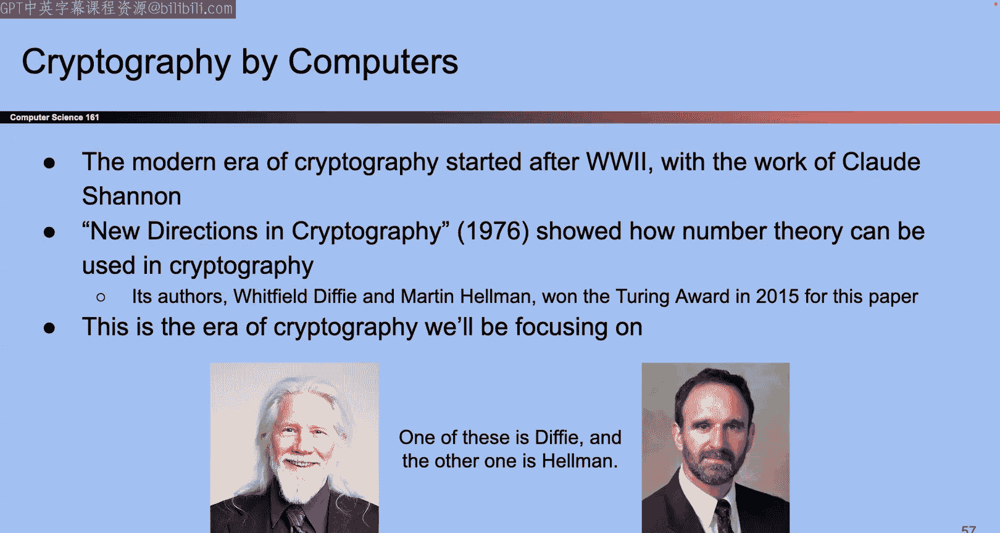

# UCB《计算机安全｜CS 161 Fall 2023 ｜ Computer Security at UC Berkeley》Calude-3.5翻译 p06 -06--CS161 FA23- Lecture 6 - Intro to Cryptography.zh_en -BV1YGbceREDs_p6-

好。

Yeah。Okay， so last time we actually finished up the memory safety unit so once you get done with Project one you're done with C code for the rest of this class and maybe for the rest of your life I don't know but for this class no more C code after the first unit and today we start a brand new unit so I guess before we start i'll give you a quick rundown of what the last unit was we talked about all those different kinds of memory safety vulnerabilities remember all of them came from the same fundamental law which is that code does not check bounds and because it doesn't check bounds you can write past the end of an array and all these different types of vulnerabilityities show up we talked about them in a lot of detail。

Then we talked about the fixes， there were some high level philosophical fixes including use any other language that's actually memory safe。

 talked about why people use see and we talked about the specific mitigations that exist so non executable pages。

Every section of memory like stackg or the code section， it's either executable。

 you can run the ones in zeros as instructions or it's writeriable， something about no audio。

sounds to me like there's audio， Okay， so maybe that's just the specific person， okay。

So not executable pages means that every section of memory is either executable or wriable。

 but not both as I fumble with the video panel。Okay。

 and we talked about ways to get around that and all of them focused on executing code that's already in memory instead of writing code yourself and executing which wouldn't work if that defense was on and we talked about stack canaries the idea was like the canary in the coal mine we had a value on the stack that has no purpose except sit there and if it gets modified then we know there' something wrong this happen that's great for attacks that started lower addresses and write continuously upwards with no gaps because what will probably happen is before the attacker can overwrite valuable stuff like the RP they'll cloer out canary first and the value will get changed。

Talked about pointer authentication which is a fancier version where instead of having just the canary we have like one canary or one secret value per pointer instead of one per stack frame and then finally we talked about addressbased layout randomization which was the idea that hey maybe instead of putting the stack in the same place every single time we can shift the entire stack up and down the relative addresses stay the same but the absolute addresses they shift up and down that's my brief summary of what we spent the last two weeks talking about but for today the brand new topic so this is the second of the four big units that we have in this class this one's all about cryptography so I'll tell you what it is a lot of today will be definitions and then starting tomorrow willll get or starting next Monday we'll start getting into cryptographic schemes。

Cool， okay， so。We're starting with definitions， here's a definition which is the word cryptography has's been around for quite a long time。

 maybe longer than computers and the classical definition is the study of secure communication over insecure channels and what we'll see as we go through this unit is some of the older definition but also some of those newer definition which is not only do we want to protect data across insecure channels。

 but sometimes we want guarantees on this data is guaranteed to be safe in certain ways。

 even if there's an attacker present so depends on what kind of attacker what guarantees we want those are all things that we'll see okay。

I will also say that this is the Matthewthes unit of the class， so we're about to really dive into。

Being able to follow some small proofs there will be like some syntax that you're going to have to follow I would say it's not like terrifying so you know we'll try to walk you through it and review any prerequisites if they come up but do know that this is the mattheiest part of the class and it's kind of downhill after this crypto unit is over but just putting it out there。

Just so we're setting expectations I guess okay and one important thing I will note is that this is the only unit probably where we're gonna have a don't try this at home warning and the reason why is because we're gonna spend maybe four weeks on cryptography and that's gonna be enough to give you basic building one so we'll give you a sense of here are what the algorithms look like and here's what they guarantee here's what they don't guarantee but in four weeks we are not going to have enough time to show you exactly how to build these and go over all the little edge cases that can go wrong and a lot of these algorithms they're really fragile if you make one tiny mistake the entire security of your algorithms could be busted so even though we're showing you enough to understand how these algorithms work at a high level we are not showing you enough that you can go out and program these by yourselves and if you do you could run into a world of trouble so instead of trying to write these protocols yourself and you'll even get a chance to do this in project too you could certainly go。

Implement all the stuff that we show you by yourself。

 but that would be a bad idea because we're not showing you enough to be able to implement all the little edge cases and make sure it's totally secure instead what you'll do in project two and what you should do in real life is use cryptographic libraries that other people that are smarter than us have written so unless your name is like David Wagner orlua Popa or one of those other cryptography researchers at Berkeley。

This is probably not something you'll be doing and instead we'll use those cryptographic libraries that are wellld。

几。😊，Great and I think I mentioned this in the first lecture too which is by understanding at a high level how these protocols work。

 even if you don't go out and write these protocols yourself。

 it'll make you a better consumer you'll be a good judge of if someone comes up to you and says here's this cryptographic protocol you know think the shiny new AI power whatever cryptography like you can judge whether they're doing something that's based in good fundamentals or are they like selling you crapP that's like an actual valuable skill to have when you're looking for tools to use okay。

Here's a story about why you shouldn't try this at home so to story from Berkeley actually so you might remember you know back in 2020 we were all know staying home and stuff and when we were staying home。

 we had to learn how to give exams online that was the whole year of my life was trying to figure that stuff out and 61A also had to figure that out that's our intro CS class at Berkeley and so they had to use some sort of cryptography to say oh when I distribute the exams。

 maybe it has to be secured and then when the exam starts they'll type in a password and like unlocked the exam or something but when they did this。

 they made a serious mistake just like we said which is instead of using libraries that are well- vetted。

 they tried to write some of their own cryptographic code so they came up with their own ideas or they tried to implement the stuff that they saw in this class and when they did so they made this kind of small seeming mistake where they had an algorithm that was secure if they used it correctly。

 but they made a small mistake and it turns out that in theory。

The exams that they gave out they gave out like an encrypted version of the exam and they said when the exam starts we'll give you the password and then you can start solving the questions turns out that we looked at this afterwards just to see what they did and it turns out it was actually possible to peek at the exam questions before they were released now to this day well we don't actually know if anyone did that I guess we will never know it was in theory possible but also hey they were first year CSTs so I don't know but。

The fact that it was possible already shows you that cryptography is a really dangerous field if you do something just a little bit wrong really bad things can happen so it's a very fragile field but it's a pretty interesting the worst part that like really made us sad was that we looked and apparently they had taken this class before so they saw this slide that you all just saw and they went out and they did this anyway and now they're here as their own slide for like all of eternity so if you don't want to become your own 161 slide for the rest of time then do heed our advice and remember all the things we're showing you they're going to help you become good judges of what tools to use and what tools not to use but they do not give you license to write code yourself unless you become a security professor at Bkeley okay so you've been warned。

All right， let's start going through a bunch of definitions， some of them might be familiar to you。

 some of them will probably be brand new but we have to have these definitions so we can all speak the same language when we're talking about cryptographic stuff so in almost all of cryptography we like to talk in terms of characters so me and our new friends they're called Alice。

 Bob even mallllory Alice and Bobber like our heroes they're the good guys and their goal is they want to send messages to each other but the communication channel that they're using is insecure in some way and depending on the context of the problem that could be someone could be able to read the messages that they're sending someone could be able to modify the messages that they're sending so it depends on the use case but ultimately Alice and Bob are our heroes and the goal is they'd like to exchange some sort of seeker between them that's Alice and Bob and sometimes if we need more characters you'll get Carol Dave someone whose name starts with E and so on but usually Alice and Bob。

Those are heroes they're trying to send messages to each other securely and then we have a set of villains so Eve is one of those bad guys and usually Eav power is like an eavestroper so you can see why they were called Eve so Eav power is that she can read any data sent over this channel so if Alice sends any sort of data to Bob Eve can read that data and maybe learn something about what Alice is saying and then we have mallory so mallory's power is usually that she can read and modify data so not only can mallory see the messages being sent over this communication channel mallllory could also modify what it says so Alice could send something mallory could read it change it to something else she likes and then send it to Bob and maybe when Bob receives it it'll look different and that's something we'd have to protect against so these are characters we'll see over and over again depending on the context of the problem they might have different abilities sometimes they have more power sometimes they have less power so it depends on the specific problem。

But in almost all cases， a lot of word problems will involve Alice and Bob trying to send messages and even Maory trying to do some sort of attack。

Okay， so those are our characters。And you know the reason why we do them is just so everyone kind of has a instead of always saying hey consider these two people sending messages we can just say consider Alice and Bob that's a nice way of using shorthand that we all know okay so there are some examples and again usually Alice and Bob want to send messages to each other but Eve is going to read those messages or Mallory's going to try to change those messages and our goal is we don't want even Mallory to learn the contents of the message that could be the goal or maybe we don't want Eve Mallory to be able to change the message or if they do change the message we should be able to find out that it got changed so those might be things we're looking for in terms of security properties in the face of even Mallory they have tas。

Okay that's one definition here's another definition or set of definitions。

 these are some properties that we might want on our data so。One property that seems。

Kind of intuitive is the one that you maybe think of first when you think of cryptography is if I'm sending messages between me and my friend or Alice and Bob。

 it should probably be the case that if I want these messages to be secret。

 Eve mallllory any adversary， they should not be able to read our messages and there's a word for them it's called confidentiality It turns out that's actually not the only type of guarantee you can have when you're thinking of cryptographic guarantees of how your channel is secure。

 you could also have a property called integrity then this property says if Alice and Bob are sending messages over a channel but mallory is there and mallory could change the messages。

 then integrity is the property that if Mallory changes the messages。

 we are going to find out that the message got changed and so we won't accept the message if it's been changed or we'll do something different if the message has been changed so that's integrity we have a guarantee that if we receive a message we know that it has not been changed or if it has been changed。

 we can find out。There's also authenticity which is going to feel kind of the same and will tease apart how they're different as this unit goes on。

 but authenticity is the property that I can prove that a certain message came from somebody who claims to have written it so if Alice and Bob were sending messages back and forth authenticity might be the property that Bob gets a message and reads the message and says。

Something and I want to know， did Alice write this message or did somebody else pretend me to be Alice write the message or did Alice write the message and then somebody else modified it before sending it to me so authenticity would be the property that if I received the message I know for a fact this came from Alice or this did not come from Alice。

And again， if you splinted them a little bit it does kind of seem like integrity and authenticity are pretty similar。

 both of them have to do with stopping attackers changing messages before they get received and again we'll tease apart how they're different。

 there are some cases where we have you more than two people and then integrity and authenticity become different properties but for let's say like the first week or so。

They're more or less the same。But those are the two main thingss we're looking for。

 we're usually looking for adversaries to not be able to read our messages。

 we'll call that confidentiality and also adversaries to not be able to change our messages that's called integrity or authenticity and we'll tease apart how they're different。

Here is it okay。Read for more definitions， all right。

Here's a definition it's called keys so this is the most basic building block you'll see and basically any cryptographic scheme we'll build you need some sort of secrecy in order to make all of these algorithms that guarantee all these wonderful properties to work and when we have some secret value we'll usually call it the key and there's two types of keys so we'll again teas apart what's different between these keys a lot in coming lectures but know that there's two models of keys that you can have so there's one model in which Alice and Bob both know some secret so Alice has a secret bo has that exact same secret value that would be called the symmetric key model both have the same secret value how do they get that secret value you have to come back next week to find out so for this week and for next week until we talk about key exchanges we will assume that Alice and Bob somehow magically have the secret value that they know and it's the same value but nobody else knows it so there's a value that secret it's known to Alice。

It's known to Bob it's not known to anybody else in the universe and how that happened you'll have to tune in next week。

 but that's the symmetric key model， but that's not the only model of key there's another model that we'll be talking about soon which is that everybody could have two keys you can have a secret key that you keep for yourself so Alice's secret key is known to one person Alice and nobody else and then Alice will have a corresponding public key that gets published through the rest of the world。

And those two keys form a pair， so secret key is linked to the public key。

 the public key is linked to the secret key together they might be able to enable some cryptographic protocols and in this model everybody has their own pair so Bob has his own secret key public key pair Aliceice going have her own secret key public key pair and that could go on for multiple people。

And if you've taken CS70 and you've seen RSA encryption might sound familiar if not。

 we'll go over it again in a couple weeks， but that's another model you can use and we'll see this again in much more detail and just giving you some highlights。

O。Yeah sorry this section is just very definition it's just a lot of words being thrown at you some of them you've seen some of them you haven't so bear with me and we'll talk about more interesting schemes really soon Okay here's a security principle that you've seen but I'm going to slightly tweak it to make it relevant to us when we're talking about the cryptography unit so we already saw from lecture one remember lecture one it's like it feels like forever go in lecture one we have that security principle called Shannon's maxim or security through obscurity and the idea there was well remember someone could leave their house key under their doormat and be like well I hope no one sees that or I hope the attacker doesn't know that I hidden in my house key under the doormat or like in the plant or something but we should always assume that the attacker knows our system and we shouldn't rely on the attacker not knowing something。

So in those cases， the attacker might know， oh， people tend to keep their house keys in secret places near the door so they'll go to the potted plans。

 they'll go to the doormat and pull the key out and you know suddenly your security is it's gone right？

And a better approach in that example would be let's not use security through obscurity。

 let's not assume that the attacker doesn't know our system。

 let's actually rely on the security of this key and keep the key to ourselves keep it private now the attacker doesn't have the key it doesn't have access to our system so the difference here was am I relying on the fact that the attacker doesn't know where my key is or am I relying on the fact the attacker does not have access to my key period even if he knows where it is。

That's Shannon's maxim that's security through obscurity Now i'm going to slightly restate it for cryptography when we do that it gets another name because we're in the definitions unit and there are a lot of names so now instead of calling a Shannon's maxim now it gets called Krakov's principle I don't know why but Krkov's principle in a pure definition form it says a cryptographic system has to be secure even if the attacker knows the details and the only thing that should be secret the true source of secrecy from which all security guarantee should stem is the key itself。

So for example， you could imagine， oh， I really hope the attacker doesn't know how I'm using the key like I really hope the attacker doesn't know how my algorithm works and I'm just gonna hope that that realize or that gives me the security so think about what happens if I rely on the algorithm being unknown to the attacker like the attacker doesn't know what algorithm I'm using with the key to secure messages if the attacker finds out my algorithm how am I going to fix that I'm going to have to come up with a new algorithm because the attacker has compromised my old one that easy probably not。

Now by contrast， if the key is the source of secrecy and not the algorithm itself。

 if the attacker finds out what my key is， yeah that's bad but how do I fix that I just switch keys use another key。

 so it's a lot easier to switch keys and use another key then it is to come up with a whole new cryptographic algorithm。

 so for that reason we prefer if the source of secrecy。

 the place where all security comes from is the key itself and not some part of the algorithm that we hope the attacker doesn't know。

诶。And in real life， this also seems reasonable， a lot of the algorithms that we use are algorithms that are pretty common。

 everyone uses the same set of algorithms that are kind of standard。

 so in those cases we shouldn't rely on us having some sort of secret algorithm that the attacker doesn't know。

 we should use the key itself to secure things okay。😡，That's Kurco principle。

 it's a principle you've seen before， but it got a new name and a slightly new definition for this unit。

Okay。More definitions so now we're going dive a little bit more into confidentiality and integrity and authenticity now that we have this idea of keys and the idea of Kirkko's principle and Dora belt so this is roughly what it looks like when we talk about confidentiality and Alice and Bob sending messages and we're going to implement algorithms that do these things so here's the physical analogy so let's go to the real world and think about what would confidentiality look like in real life so maybe Alice has taken her message written it down on a piece of paper and she wants to securely send this piece of paper to Bob but it has to be over an insecure channel。

What that means is that maybe an attacker can read that piece of paper and see what's going on。

 that would be bad。So how can we fix that Well in the physical world one way we can fix that is we can take that secret message if we just pass it right across the insecure channel。

 someone could look at it and they can read the message that's bad So instead we're going to use a key and lock it in a box so get a box we put the message in the box we lock it with the key and then we take the box with the message inside and we pass that across the insecure channel now remember who knows the key in the symmetric bottle only Alice and Bob Eve doesn't know so Eve is going to see that message in the log box have no idea how to access it and read the message and then when it gets the Bob if we assume that we're in the symmetric key model Bob has that same key so Bob can use the same key unlock the message or unlock the box and get the message back that would be the symmetric key model how do Alice and Bob know the same key well again come back next week but for today when we talk about the symmetric key model we assume Alice and Bob off the same key so that's what makes this whole model。

Okay， taking messages putting them in boxes great， I think sometimes when other people teach this class they actually come to class with an actual box and then they like log messages inside。

 but I can't afford an actual like lock box so you'll have to use your imagination okay。😊。

Now here's what it looks like in computers so we can't actually have keys and lock things in computers。

 but booking is a pretty similar idea which is let's take our message and instead of locking it in a box。

 we're going to run it through some algorithm that simulates putting it in a box and locking it and that algorithm is going to be called some encryption algorithm so what encryption algorithm goes here that's going to be one of the problems that we have to solve and we can see here comparing it to the physical analogy from earlier what is the encryption algorithm taken as input it has to take in a message and a key just like we saw from before and somehow has to compute something on the message in the key and output the encrypted message。

Just like our physical analogy， this encrypted message you can think of it as some scrambled up version so using the key taking the message and scrambling up the message in some way that makes it really hard for the attacker to figure out what the original message was now that it's all scrambled up and hard to read we can send it over the insecure channel Eve is going to have no idea what it says because it's all scrambled up but then we have to unscrable it for Bob so Bob is going to have to run this encrypted scrambled message through a decryption algorithm just like in our physical analogy we have to use the key take in the scrambled message use the decryption algorithm to unscramble it and hopefully if our algorithms work out Bob gets the original message back。

So that's the model we'll be working with and in the next lecture to our goal is to find something to put in the encryption algorithm box and find something to put in the decryption algorithm box that's the goal for the next couple of days okay。

P。Someone's phone is ringing okay that's right one more piece of vab that you'll see sometimes is instead of saying message and encrypted message sometimes you'll see plain text and cipher text those are just fancy cryptographic terms for the original message which we call plain text and the encrypted message which we call cpher text so just some terminology you might see as we go through okay。

That's confidentiality and we'll talk about that for the first two crypto lectures and then after that we'll be talking about integrity and authenticity this one also has a physical analogy but it's a little bit weirder so if you thought that lockbox one was too easy well here's when that's a little bit harder to wrap your head around but it does have a meaningful I think physical analogy so here it is it's a little bit weirder remember integrity is the property that an adversary cannot change our messages without being detected so when Bob receives the message Bob should be able to tell was the message changed by somebody while Alice sent it over or is this the original unmodified message from Alice that's our goal we want to figure out whether or not the message was changed。

And crucially integrity and confidentiality， they are different properties right so if I care about integrity。

This is a separate thing from confidentiality maybe when I only care about integrity I don't care about the message being unreadable to an attacker I just care about the message itself not being changeable by an attacker so for this setting I don't care about whether or not the message can be read by the attacker I just care about whether or not the message can be modified that's integrity it's a different thing from confidentiality maybe you want both and we'll talk about how to get both but if you just want the property of integrity by itself and what you care about is that the message can't be changed you don't really care about whether or not someone can read it because that's confidentiality that's a different property okay so here is what it looks like in a physical analogy and I told you it's kind of weird but here's how I think so imagine Alice has like some super special tape I don't know why she has the super special tape but what we can imagine is that Alice takes some super special tape and uses that tape to seal up an envelope so she takes the message。

Puts it in an envelope and then seals it up with like super special Alice only tape that nobody else is access to。

And when she does that， she's created some sort of seal on the message that tape。

 she's wrapped the message in her special Alice tape。

Now she sends the message and the seal across the channel。

 she has to send the message because if she just sends the tape。

 then how is Bob going to know what the message says。

 so she has to send the message in the envelope with the seal on top。

 not just the seal itself because if Aliceice just sends the seal but I have no idea with the message。

That's like sending a blank envelope so we send the message inside the envelope with the seal that only Alices could have generated。

And now you can imagine if Mallory wants to try and change what the message says。

 she probably has to open up the envelope and take the letter out and change something on it。

 but you can imagine if Mallory wants to do that she has to break the seal and as soon as she breaks the seal she can't put the seal back together it was special Aliceice tape Mallory does not have this special Aliceice tape to put that seal back together so as soon as Mallory tries to modify the message that seals gonna break and she has no idea how to put it back。

Eventually this message gets to Bob and Bob's going to check that the seal is unmodified。

 so this is where the analogy starts to break down a little bit， but Bob is going to use his secret。

 which he shares with Alice to make sure that this seal is not modified so when Bob gets the message if it looks like someone has like opened the tape Bob is going to be like oh I don't think this is the original message but if Bob gets the message with the seal and the seal looks like it's beautifully wrapped and no one has ever touched it then Bob can be confident that the message is for him and it has not been modified。

Okay that's the rough physical analogy， we take a message。

 we add a seal to it by like wrapping it in tape or something and if someone modifies it。

 they break the seal and they have no way to put it back。

Okay now let's see what that looks like in computers so in computers it's kind of the same idea。

 but instead of saying that we create a seal or we use like magic tape there's this new algorithm that we have to come up with this will happen in a week or two where we need to create a tag that's our in CS version of seals so instead of saying seals or magic tape we call this thing a tag and so we need to design an algorithm that takes in a message。

And the secret key and somehow creates a unique tag for that message。

So here's the unique tag that was created for the message using whatever algorithm we design。

Then what we can do is we can send the message and the tag across the channel and the hope is if someone tries to mess up the message。

 then this tag will no longer check out this message in an tag they come in a pair so if you change the message the tag is no longer the same or if you change the tag the message no longer matches the tag and so it should be the case that mallllory who doesn't know the key has no way of changing the message and tag together。

Without breaking something， either the message or the tag。

Eventually this thing gets to Bob and we need to come up with this algorithm too where Bob takes the key。

 uses the key to check for tag and make sure it has not been modified and if Bob checks and the tag looks good it matches the message。

 Bob can be confident that the message wasn't modified otherwise it's like seeing the tape was broken you're like oh the message in the tag dot match so I don't think this was something from Alice or someone might have changed it。

几。😊，That's the rough intuition， we will talk about this a lot more in a future lecture I promise but that's the rough intuition so you take a message in a physical analogy you put some like super special Alices Bob tape on it and if someone messes with it the tape breaks in crypttography you come up with this tag generation algorithm and Bob checks that the tag has not been modified。

Okay any questions are are we just stretching between tag and Yeah question was difference between tag and seal seal is something I made up it's like a physical thing that people talk about when they come up with physical analogies it's not a real cryptographic term at all the real cryptographic term is tag so that's the last thing you'll ever see that word' seal but if you've ever seen seals in real life it's those like fancy stickers they put on envelopes。

That was what we were trying to make you think of， I guess。

 but maybe letters were too outdated so I can't use that analogy anymore。Okay。

 other questions the question was， if I take which one do I not change？If I leave the tag unchanged。

 but I changed the message， oh if I reuse the message from before。

 we'll talk about that soon it's called the replay attack， but not today， so stay tuned。Okay。Cool。

 let's keep going。Couple more definitions and then promise this you were almost done so remember we talked about this way back in lecture1。

 which is whenever we talked about cryptography or any sort of attack。

 we need to think about threat models what can an attacker do what can an attacker not because depending on how powerful the attacker is that also changes our sense of what counts as secure and what counts as insecure so in order for us to design things that we think are secure we need to model what the attacker is able to do and what the attacker is not able to do like if our attackers are not able to read or modify messages then we're all set So we need to think about what else the attacker can do there's lots of different models we can come up with we're not going to talk about all of them the ones that we're going to talk about and that are pretty common in the cryptographic community。

Is this idea that you know what maybe this Eve character she can do more than Eavestrop so we already know if Alice sends a message over the insecure channel Eve can read that message and see what it says or if Alice sends any data at all over that channel whether it's like the message or scrambled message or a tag or whatever we know Eve can read that stuff。

 but maybe she can do more so here's a model that people use in。

Cryptography and the reason why they use this is because it models things that happen in real life as well。

 So there are two more abilities like two more extra powers that we could give to Eve and these are usually used when we're analyzing confidentiality when we're analyzing integrity there's different threat models that we'll talk about there but for confidentiality there's two more threat models or two more additional powers that Eve may or may not have so one of them is。

Can Eve walk up to Alice and trick Alice into encrypting a message of Eve's choosing so for example Eve says I really want to know what the encryption of the word potatoes is so Eve walks up to Alice and says hey can you encrypt the word potato for me and if Alice will dutifully use the real secret key to encrypt the word potato and return the cipher textex to Eve then we say yes Eve has this extra power。

Okay， the second one iss a little bit similar but kind of different as Paul which is can Eve walk up to Bob and say hey I have this citext this was some encrypted message it scrambled up can you use your key to decrypt it and tell me what the decryption is and if Bob will oblige and do this for any message that Eve provides and we say that Eve also has the second power which is Eve can trick Bob into decrypting any message she wants Bob to decrypt and Bob will have to faithfully using the real key decrypted so those are the additional two powers that we can give to Eve and depending on which powers we give we get different now one question you might have is like wait a minute。

This sounds really weird why is he able to do this like is Alice that stupid and we'll just encrypt anything Eve says well it turns out the reason why we're modeling this fact that Eve can walk up to Alice and say。

 hey， encrypt this word for me and Alice will just do it without thinking twice is because this model's vulnerabilities that exist in real life maybe you have a website and it's got some vulnerability where the user can input something and you're going to output what the encryption is so it's possible that these vulnerabilities exist in real life and the way that we're going to model them in our Alice Bob Eve world is we're going to give Eve these two powers to model something that's pretty common in the real world。

Okay， so that's why we're doing this， we're not just giving E powers because we feel like it。

 it's because these things model attacks that are possible in real life。

Okay so depending on which things Eve can and can't do there's all these different threat models each of these rows represents different one and they all get different names depending on what's possible now for our class we're going to focus on that row。

 the one that's highlighted it and it gets a special name which is the chosen plain text model so it's a really fancy way of saying we already know Eve can Eveestrorop that's always a given but in addition we're going to give Eve one extra power which is Eve can walk up to Alice give Alice some plain text and say please encrypt this for me and Alice will faithfully use her secret key encrypt it。

 give it back to Eve。For any message Eve wants and Eve can even repeat this if you wants to that's called the chosen plain text model it's a fancy way of saying Eve has this superpower or she can trick Alice。

 but she does not have the power to trick both of of things that's this role that's the role we'll be focusing on and if you want to there are certainly other models out there so if you think that your threat model is different the attackers you're facing have different powers you can pick a different model in real life a lot of analyses come using the chosen plainex Cyphertex model where Eve has both powers because that's the most powerful one so the security guarantees you get from the protecting against this most powerful attacker with both powers most tend to be the strongest guarantees and so that's what a lot of people use in practice but for us chosen plain text is our model we're choosing it model attackers that we think are realistic but they don't have to be what you think is realistic use the model that makes sense to you。

Okay question so Sha E's intention is to read the message。

 not far but I changes it so shouldn it have been。If so it gives intention is means something why。啊。

去单位行。Yeah that's your question which is you can correct me if I didn't interpret it correctly which is if Eve's goal is to read messages。

 it seems like this second power where I can trick Bob into decrypting stuff that one seems a lot more valuable to help Eve read messages if her goal is to read messages right but remember we are trying to model things that exist in real life so it doesn't really matter what Eve wants to do we're trying to model what Eve can do and so in our model we're going to say Eve has this power up but not this one and Eve has to somehow use this first power to learn what messages are or learn what the message says。

That helps。So yeah， maybe Eve wants that second power。

 but if in our model we think it's not realistic for Eve to have that second power and we're going to model it so that she does not have the second power if you think your model in real life is such that Eve does have that second power and you want to protect against it that you might choose a different model but that's the one we're choosing。

Okay。That's our threat model。 Okay， here's a slide you will be seeing over and over and over again it's the full list of all the cryptographic algorithms that we will be throwing at you in the next two or three weeks we're going to go through them one at a time。

 but what I want to highlight here as the map of what's about to happen is that。😊。

There's two kind of axes that we're working on so anytime you come up with a cryptographic algorithm you kind of have a choice to make so the first choice you make is do you want to be in column A or column B the column on the left those are all the algorithms where Alice and Bob share a symmetric key remember the symmetric key Alice has a secret value secret key Bob has the same secret value they haven't told you how they get the secret value but they have the same secret value and they can use that secret value in their algorithm that's this column on the left column on the right is asymmetric key where everybody has their own private key and a matching public key and they come in pairs。

ok。So that's one thing you can choose before you design an algorithm or before you choose an algorithm to use like in your project two you're going to be like I need this thing to be true。

 which algorithm should I use you can pick well I think that the you know in my current model I have a symmetric key so I'll use the one on the left or in my current model I don't have a symmetric key so maybe I have to use the one on the right it's up to you you have to choose which algorithm meets your needs is best for what you have available to you maybe you don't havesymmetric keys is available to you maybe you do。

😡，So that's one thing you can choose Another axis you can choose from is you can choose you know top row or bottom row so here you're not choosing what the key model is you're choosing what you need。

 what security properties you need so if you choose any of the algorithms in that top row then you're choosing algorithms that give you confidentiality guarantees they stop people from reading your messages if you choose the algorithms in that bottom row you're getting algorithms that give you integrity they stop attackers from modifying your code so again。

 we'll see this over and over again we'll go through all this in detail but the highlevel ideas when you pick an algorithm or you're working on project two where you're designing a cryptographic system and you're like I need an algorithm which one is best for me one way to think about it is well what keys do I have available to me am I at a symmetric key setting or am I an asymmetric key setting and then once you figure out the column you can then think what do I need right now do I need people to not be able to read my messages then you should go with something in the top row or do I want。

To not be able to modify my messages then you might want to go with something in the bottom right and maybe you want both properties you might need multiple algorithms。

 but that's our roadmap it's one way， not the only way。

 but it's one way to organize our thoughts when we're seeing all these different algorithms getting thrown at you。

Okay。I think we are finally done with definitions so any last questions on them before I move on。

 you will see them over and over again so。You don't have to be experts on them yet。

 but now you've seen them for the first time so now we can start talking about everything in the same cryptographic language which is cool okay we are going to stop and start in this top left corner and then work our way through all of these different algorithms but for today our focus is this top left corner which means even though I just spent all this time telling you about how asymmetric key models exist not today at some other day so for today Alice and Bob have symmetric keys they both have a secret value that only they know and nobody else knows how they get that you got to come back next time to find out also for today we're only going focus on confidentiality so we're not going worry about those tags and how we get people to not modify our messages we're just going to be concerned with making sure that people can't read our messages that's for today if you want the other ones we'll get to them soon okay。

We already talked about these for the most part， we know that the thing we have to design is the encryption scheme and the decryption scheme so we need to design those to give us the confidentiality guarantees we talked about the symmetric key assumption we talked about how you don't have to worry about how they know the same key we just assume they have a secret that they know nobody else knows one more assumption we're going to do for our schemes in this section when we talk about symmetric key encryption or symmetric key anything in general is well what message is Alice is trying to send to Bob is Alice trying to send text message in English is the message like Chinese is it a picture is it a video that message could be all sorts of different things and so instead of us having to worry about is Alice's message like a video or is it picture we're just going to say all the messages Alice and Bob sent to each other they're bit strings which is a fancy way of saying it's a bunch of ones and zeros and that's a nice abstraction because whatever。

Was trying to send it。Picture video I don't know what else movie whatever right we can always take that thing and convert it into a bunch of ones and zeros don't have to do anything with cryptography to make that happen we just have to take that object convert it to ones and zeros and send it so for our purposes when we think of messages we will just think about the ones and zeros and let Alice and Bob worry about what the ones and zeros represent。

诶。😊，So。Just one abstract we're going to do all right。

 you've seen this picture before we saw it like 15 minutes ago so we know the definition here it is in some more mathematics I told you there was going to be math so。

When we want to define an encryption scheme， there are actually three things we have to define we already define two of them or we already know there's two we have to implement which is the encryption algorithm and the decryption algorithm what goes in those boxes right now is like a question mark it's our job to fill in what happens when Alice takes the plain text and the key how is she going to scramble that into a ciphertex we need to figure that out where the designers and similarly when Bob gets the scrambled up ciphertex and wants to use the key to decrypt it。

 how are we going to decrypt it， what are we going do to the bits that's our job to design in the next 30 minutes one final thing that comes up when we're defining these schemes is oftentimes we will also have to define where do the keys come from So for today we're going say the magic key fairy comes down and gives Alice and Bob the same secret key but in general you do also have to define where the keys come from。

ok。So in math， that's what we're looking for。ok。Well。

 let's think about what does it mean to be confidential so we already know from before that we want messages to be confidential but there might be other things we want like for example。

 it would be nice if Bob actually got the right message after decrypting so if Alice encrypt a message using our encryption algorithm and then Bob runs the decryption algorithm that we wrote and gets the different message that would not be a very useful cryptographic algorithm so we need to bake in some extra properties。

 one of them is correctness which is if I encrypt something then I decrypt it with the same key I'd better get the same message back otherwise this whole algorithm is not sending messages from Alice to Bob properly and we can say that in math we can say if you take a message and encrypt it and then you call the decryption algorithm on it you'd better get back M the original message so that's mathematical expression that says if you encrypt something and decrypt it you'd better get back the original message。

几。😊，We also want efficiency we're going to talk about this later but it should be the case or it would be nice if these things didn't take forever so even though we won't be talking specifically about like runtime it still will be nice if the things that we're doing don't take forever to finish so in the back of our heads we will try to keep track of how long these algorithms take in practice and let's look for things that are pretty fast because if things are fast well that's good right we want things algorithms that are fast we don't want cryptography to be very slow otherwise no one would use it so hopefully something that comes fast and for free。

And then finally， we'll talk about confidentiality。

And we already have a definition for confidentiality。

 but like what does it mean for an attacker to not be able to read my message is that specific enough to start coming up with schemes Well I don't know。

 there are some follow-up questions you could ask like hey。

 what if Eve can read the first half of the message but Eve has no idea what the second half says like is that confidential I don't know what if Eve figures out that the message starts with a certain phrase like dear Bob。

 does that count as confidential or does that not confidential is it half confidential I don't know or what if Eve already knew something about the message like Eve already knows oh thiss Alice person she's really form she always signs her messages with sincerely Alice Eve already do that So if she looks at the message and finds out that it ends with sincerely Alice is that breaking confidentiality is it not I don't know or what if we already know that Alice's message out of some finite set like we know Alice is gonna。

Send one of buyers sell but we don't know which one is that breaking confidentiality or if we figured out or if we guess that she's probably sending by is that breaking confidentiality what if I think I know what the message is but i'm not super sure so that definition of saying an attacker can't read our message is it's a good starter but it's not specific enough and when we're talking about these mathematical proofs to make sure that things are secure and confidential we got to do better than this。

😡，All right， so let's do better。 let's write a definition that。

Gives us actual backing to start designing schemes here's a definition that's more rigorous so i'll read it and then we'll try and think about what it means so we should say that when Eve sees that cybertext it's the thing that Alice sends over the encrypted channel it's that scrambled plain text if Eve reads it she should not learn any additional information about the plain text that she didn't know before。

That's better。 That's more specific Now we don't have to have that problem of oh what what have even knew something before The idea is if she sees that ciphertex。

 she should not learn any additional information that she didn't know before That's good That's more specific。

But even then it's not like fully specified and so one thing that security researchers like to do is we could take this definition and we could keep adding in more and more specific terms and try to make it mathematically rigorous and it's going to be a mess read in English so let's try to do it instead of writing this big English definition that's really hard to read let's think about it differently so something that security researchers like to do to design security or to define security is let's try to phrase it like an experiment or a game between two people and depending on who wins the game that'll tell us something about the security properties so what do I mean by that well let's try to design this experiment I know it's a lot of words but。

Let's say Eve chooses two messages of the same length。

 why of the same length we'll talk about that soon。

 but let's say Eve chooses two messages so I mean heck we'll play the experiment ourselves so。

Give me two words that are of the same length， I always say the messages are bit strings。

 but you and I can't read bit strings there's these words。Who's got a word of five letters？

No words of five letters don't play wordle， Okay bread， so that's one all right， M0 is bread。

Give me another one M1 what clear Okay true M1 is clear Okay。

 so this is the experiment so you can be Eve I'll be Alice maybe next semester will swap So if youre Eve you've chosen two messages right their M0 and M1 and you send them to me So here's what I'm going to do I'm going turn around you can't see me anymore I'm going to flip a coin you have absolutely no idea what the outcome of my coin flu was that's what this m sub B is that B is the result of my random coin flu I flip a coin you didn't see the result。

And if it comes up heads， I will encrypt bread， if it comes up at tails， I will encrypt clearly。

Okay so I'm going to do it I'm going to turn around I'm going to flip my imaginary coin it came up some way you don't know and i'm going to encrypt something you have no idea what I encrypted and here's my encryption Okay this is hypothetical well let's say this is what happened okay so。

There is my encryption。So somehow I took your message， I used my key and I scrambled it up， okay。

 that was me， that's me Alice。Sending you the cipher text Okay so what do you know well you know because of this experiment that I just encrypted bread or clear but you don't know which one right so what's the definition of confidentiality the definition is you should not know any additional information that you didn't note before so before I showed you this before I showed you mB and you only sent me those two messages what did you know you knew that I was going send you to pretend you don't know this。

Since across that you don't know it， so before you knew it。

 all you knew was that I was going to encrypt red or clear each one with 50% probability and you didn't know which one that's you before I sent this thing。

And now I reveal to you。That's the encrypt。So what do you know now well you still know that it's either bread or clear and if it is the case that me revealing to you what the cyberphertext is gives you a better idea of which one I encrypted。

 then this scheme is not confidential because me revealing this cybertext to you gave you additional information that you didn't know when I didn't reveal it to so that's me using experiment two-person game to formalize the definition of confidentiality。

你。😊，Questionsions。tYeah there was another way of phrasing it which is without the key is it the case that knowing the output tells you nothing about the input it's a related idea in some cases is not exactly the same we'll see it soon so for now we're going to frame it using this really specific game because we're going to keep developing on it but yeah there are also other ways you can frame this okay。

So here's the idea right again， before I showed this to you before it was revealed to you。

 all you knew was that with 50% probability I encrypted bread with 50% probability。

 I encrypt it clear you didn't know and then I reveal it to you if it is still the case you stare at this really hard you think about it if you still have no clue which one I encrypted your still best guesses that it's 50% bread 50% clear and you just have no idea which one you't even have a hunch and that means that you didn't get any extra information from me revealing to you the Cytext Cyphert didn't help you at all that's confidential however。

 if I show this to you and suddenly you're more confident you're like actually looking at this ciphertext it looks kind of like breaded to me then however you did that you have somehow broken the confidentiality of my system because by seeing the cybertext you learn something that you didn't know before。

Okay， that's you formalizing it with the experiment。ok。

Now let'st do it a little bit differently because remember our threat model was not just that Eve can read the message so yeah I revealed the message to you and then you thought about it and then told me whether or not you had a better guess as to which message was encrypted but remember Eve has an extra power why does Eve have an extra power because we gave Eve the extra power to model real worldorl scenarios so Eve has that extra power so you're even this semester sometimes we swap it this semester your Eve so because you' Eve you can also walk up to me I'm Alice and you can come ask me hey。

 give me the encryption of anything you want work and I as Alice I have to faithfully use my key encrypt the message and provide it back to。

Okay that's the rule， that's our threat model so you can always walk up to me and you can say hey。

 please encrypt this word for me and I have no choice but to faithfully take my key and encrypt it for you and give you the results。

😡，ok。😊，So our experiment it was good， but it didn't account for this case because we know you as E you have extra powers and our experiment didn't account for them so we need to redesign this experiment so that you have those extra powers so let's try it again once again I could write it in words there it isn't words it's kind of gross to read I could say even if you're able to do that attack and trick me into encrypting messages you still have no idea which message was sent Okay that's a definition kind of hard for me to wrap my head around so I'm going to play another game to define this thing Now it's called in CP once I add the structure ability and by using games it helps me think about whether or not my schemes are secure in terms of this twoplay game and we think about who's winning and who's losing okay。

So here we go it's a similar game from before but I'm going to give you that extra power so before we play the experiment or the game from before I'm going to give you a chance to exercise your power so you may walk up to me and ask me to encrypt anything that you're choosing you come up to me and you're like you know please encrypt potato and I'm like okay I'll take my secret keyK encrypt potato and send it right back to you and you can repeat you can come up to me with as many messages as you feel like I will always faithfully encrypt and send it right back to you。

And eventually once you're happy， you think you've explored the scheme enough the idea here is that as you keep asking me for messages and I keep sending them back to you。

 maybe you're learning something， you get all these pairs of like oh when I encrypt a potato I got this and when I encrypted this and I got this maybe you're learning something as you do that maybe you're not but once you're satisfied you get bored you think you've learned enough you're up for the challenge you're like all right。

 let's do the experiment and just like before you walk up to me and you say I'm ready for the challenge and I'm like all right。

Send me your challenge So you send me the two strings just like before So you send me your first string which was bred and your second string。

 which I guess was clear great what do I do I'm Alice so I turn around you can't see my coin it's imaginary I flipped it It comes up heads your tails with 50% probability it's heads I encrypt bread if it's tails I encrypt clear and I send it right back to you so that's this step right here I chose B by flipping a coin。

 whatever I chose it gets sent right back to you so you get some mystery string。

I have no idea what the stream was last time， okay， there's some stream goes right back to you。

And just like before， it's your job to see if this gave you any extra information before I showed it to you。

 you knew it was rhetoric or clear， once I showed it to you， do you have a better idea， I don't know。

😡，Okay， but remember he still has the powder so if she wants to。

You can come back to me again now that you've seen all this and you can keep asking me for more plain text cybertex pairs you're like I'm not satisfied I want to learn more I'm like okay know hit me with your messages so send me some more ends any strings you like I will always stick the key and send right back to you and you can use this to learn more you can learn more about the scheme you can learn more about the messages you can maybe try to learn what my key is。

And once you're satisfied， you're like， I think I know what's going on Alice， I see your game。

 then eventually you're going to take your guess， you're going to say， all right， my final answer。

 having investigated this scheme asked you for encryptions and issuing you this challenge。

 my guess is you flipped heads or you flippedtails， in other words。

 you need to guess which message I encrypted。Did I encrypt bread or did I encrypt clear No it's one of the two So which one is so that's the game the same game as before I just added these two extra steps to model that power where Eve can come in and ask me to encrypt whatever it is you want。

ok。And eventually there's a winner right so let's say let's define who wins and loses the game and then break it down some more so who wins well you're E so you're going to guess which message I encrypt if you guess correctly you win if you guess incorrectly I win so。

That's the game and how does this connect to confidentiality Well。

 if it is the case that you can win the game with probability greater than a half。

 that means that you're doing better than random guess you have a pretty good idea of what's going on so if I show you some ciphertext and you're like that's spread I'm pretty sure and you get it right most of the time you must have figured out something about my scheme so this scheme is not secure because you're the attacker and you're winning a lot however if I do this over and over and over again and you just cannot do better than 50% what does that mean it means you're basically a randomly guessed and if you're a randomly guessing then it must be the case that my Cyphertext that I'm giving to you gives you no extra information because you're just randomly guessing how could you learn something new So that's the intuition。

In the worst case。You have to be doing at least 50% you have to be winning with at least probability 50% because you're guessing heads or tails。

 so in the worst case， your win rate is 50%。 if your win rate is below 50% or if something has gone horribly wrong but if you're randomly guessing your win rate should be around 50% however。

 if you learn something about my scheme as a result of you using your power to ask me to encrypt stuff or you've learned something or the scheme that's solve is insecure。

 then somehow you must be able to do better than 50% because by me showing you what the Cyphertex is you should be able to look at that and be like oh it's spread or oh is probably clear doesn't have to be 100%。

 if you do anything better than 50%， even if you're getting it right 55% of the time then I must have leaked something that I shouldn't because I'm giving you the opportunity to look at this and somehow you know with better than 50% chance that it's br or clear that's not good that breaks the confidentiality。

Okay， so if there's a lot of text， that's basically what it means。

Okay one last thing I'll say about this is something pretty cool is in all of this definition I never actually said what strategy you're using that's pretty cool you as Eve can use any strategy you want to solve this puzzle or just solve this challenge so what words are you going to ask me to encrypt in that query phase once highlighted in green what words are you going to pick to me here in these phases highlighted in green that's up to you do whatever you want that things help that you think would help what words are you going choose as M0 and M1 that's your choice do whatever you want and once I show you the Cyphert what strategy are you going to use what computation are you going to do to choose whether or not I encrypted n0 or M1 it's your choice you can do whatever you want go ask Gpt like take out your computer start writing scripts flip aco whatever you like and what's really cool about this property or this definition is that I make it no。

Assumptions about what you as the attacker are doing。

So if it is the case that I can prove that you can never win the game with probability better than a half and it holds for all strategies because I didn't assume which strategy you're using。

😡，Then this definition means that my scheme is secure against all attackers of this threat model it doesn't matter what you're doing I don't have to know。

 oh is the attacker doing this because the attacker doing that doesn't matter if this definition holds and I can prove that it holds then it is the case that no matter what you do like for all possible eaves out there Eve that's flipping coins the Eve that's like you know writing this down on paper the Eve that's like asking Tra EBT it doesn't matter all of those eaves are never going to win like game with probability greater than a half if I can prove that this definition holds that's pretty evil。

😡，So I can defend against all sorts of attackers with this one definition。

 even against attackers I don't know about I don't have to know what your attack is。

 I can prove that this is secure for all strategies， that's very cool。O。

Now there's a couple edge cases so this definition it works for the most part。

 but it's got a couple of asterisks that I got to show you in order to make this definition fully rigorous okay so there's three of them here we go the first one is link we already saw this briefly earlier when I said when you gave me those words needed to give me two words at the same length and the reason why is because。

We usually allow cryptographic schemes to leak the length of the message。

That's our assumption that we make and in order to model this assumption in the game。

 I had to force you to pick two messages the same way。So first of all。

 let's talk about why this is the case。What if I wanted to build a scheme that doesn't linkate？

Well then all the messages you send they have to be the same length。

 otherwise I can look at the length of the message or the cipher textex and guess how long your message is so if you want to protect against that and create perfect security against me learning the length。

Then every single Cytex has to be the same length is that practical not really because if the same length is something like 16 bytes then you can't encrypt anything longer than 16 bytes that's bad what if you want to do something large like you say all the messages and cybertex are one gigabyte large well then now even if you send something small it still needs one gigaby of encryption to send which is pretty wasteful so there's no way around this in practice so usually we're okay if the length gets leak。

ok。😊，So this is a practicality thing， you could certainly design a cryptographic scheme that doesn't leakclaim。

 but for our purposes we've decided that there's just no practical way to do this。

 you're either going to be limiting yourself to how much you can encrypt or you're going to be spending tons and tons of internet bandwidth with or something encrypting gigantic messages or making gigantic Cytext for the smallest plain text。

 so that's not great。Okay， and in order to model this in our game。

 we need to say that M0 and M1 have to be the same length well why is that because we don't want length to be a factor in this game we already said we don't care about leaking length。

 I need you to find something that's not length that tells you about the message。😡。

If we didn't have this rule Eve could cheat you could just give me a short word and a long word I would encrypt them and because I'm allowed to leave length you'd see a short message or a short encryption or a long encryption you can figure out which is which right so I mean if you want to make it explicit you could send to me M0 is like a and then M1 is like a lot of A's yeah。

And if I flip a coin and I give back to you an encryption that's， you know， like 20 letters。Well。

 then you probably know that I encrypt is the long thing。So yes。

 you learn which message I encrypted you broke the scheme。

 but you broke it using length that's kind of cheating because I was allowed to leave length all the along so in order to stop this you need to send me two messages that are the same length。

几。😊，I also just noticed this slide is outdated and I'll call tweets anymore are they okay keep going all right so that's one edge case the second edge case is well how long does Eve have or how much computational power does Eve have to think we already said Eve you're the attacker you can do whatever you want and think about to think about which message was sent or to think about which message to sent to me however we're trying to model attackers in the real world and attackers in the real world only have so much time they don't have the infinite time and so when I'm modeling you Eve the attacker。

I can usually make it so that I don't care about attacks that are just not practical in real life。

 so maybe there is an attack that's possible， but it takes you know like trillions of years to break my system。

Do I really care about that Probably not so I can model this in my game too I can model my attacker Eve so that Eve is not allowed to do things that take trillions of years so yeah maybe my scheme is vulnerable in the sense that somebody in theory could spend trillions of years breaking my system and they've learned my message but I just don't care about what happens many trillions of years from now so I am going to add an assumption or add a constraint that Eve you can't take trillions of years to come up with your attack you got to come up with it in some time frame that's practical and that's me modeling a real- world attacker because I only want to model attackers that I have to worry about like in my life right。

Okay so that's the attacker runtime constraint and well how do you limit yourself to things that don't take trillions of years like where do you draw the line one pretty commonplace where people draw the line is they think about the runtime of the stuff that Eve is doing if you' you're probably running some algorithms some algorithms have polynomial time runtimes like O of n squared O of and cubed some of them have exponential time runtimes like2 to the n and so in general we say that Eve is able to do things that are polynomial time like you're run o squared n squared algorithm to figure out what the message was that's fine that's something that attackers can do in real life but if you had to run an o of2 to the n algorithm to figure out what's going on that takes exponential time and most likely you're not gonna to have time to do it before the solar system like explodes or implos on its。

So exponential time algorithms were usually not too worried about them because they take just too long to execute。

So we're going to limit you Eve to doing polynomial time things that's the second line or the second edge case all right one more asterisk which is imagine that you as E。

 you can guess what message I am encrypting like whether I flipped heads or tails and encrypted the first one or the second one。

But you can only guess with probability 50。00000 and a lot of zeros 1%。In reality。

Is that pretty close to 50% yeah， and so that advantage， even if you have a really。

 really small advantage， it could be the case that that advantage is so small that there's nothing useful you can do with it。

Right and so usually we're not going to talk too much about the mathematical notion。

 but there's this idea that if you are so close to 50% probability of winning that that advantage can't be used for any practical attacks you can't do anything useful with that 50。

0001% we're gonna say you know what that's as good as 50 for all intents and purposes。

 this scheme is secure because even if someone can guess with probability 50。000001 that extra。

0001% probably not very useful and usually these numbers come in terms of1 plus2 to the n or and some really large exponent those numbers are just way too small to matter nobody can use this advantage to their or to nobody can use this vulnerability to their advantage and we'll see this again later as small but that's our extra edge case so three edge cases messages have to be the same length because it's okay to link length Also we limit if the things that will happen in polynomial time because we don't need to work。

about attacks that take trillions of years and finally it's okayVve can win with probability 50。

00001 that runs down to 50 but something like two thirds that doesn't run down to 50 Okay here's the mathematical definition if you care about it but we're not going to test you on it in general negligible numbers are like one over2 to the n where ends kind of large okay。

So here it all is right all of the game on a single slide with all the exceptions right but you've seen it before so you are Eve you come up to me walk up to me come up with all the messages you like I will always faithfully encrypted for you when you're ready for the challenge you think you know my scheme well enough send me two messages I flip a coin send one of them back at you and you need to tell me which one I encrypt it and if you can do so with better than 50% probability。

 you're winning a lot that means you broke my scheme you learn something about my scheme is not secure however。

 if no matter what you do， you're reduced the guessing you just have no idea what I'm encrypting then my scheme is secure that's in CP that's the definition we use the game。

To formalize our definition of confidentiality questions。

YeahThere's a question about can I encrypt the same message twice。

 stay tuned because we're about to get to that。O。Oh okay so before we get to that I guess let's talk briefly about where cryptography came from。

 where we're going I will mostly speed through this because we are not going to ask you about the history of it。

 but it is nice to get a sense of where these definitions are coming from so I like it in the sense that it helps you review all the definitions that we've thrown at you because we have doing quite a bit of definitions at you so this are really old cipher Julius Caesar I don't think that guys been alive for quite a while so this is a really old cipher but we can still write it mathematically and so the idea here is when someone wants to encrypt the letter D I take the letter D and I go three letters later in the alphabet Efg and I output G is the cipher text and I do this once per letter that's the Caesar cipher so you choose the key the key is how far you're shifting in the alphabet and then when you encrypt something you take the key which shows you how far you're shifting and you shift by that in many les so if my key is three when I take the letter D I will shift it forward by three。

If I get the letter O， I'll shift it forward by three I get the letter G I'll shift it forward by3 to and encrypt so I'm taking the key and the message and using them together to scramble up and create a Cytext now how do I decrypt I gotta be able to go backwards so again someone gives me the key it's the same key K equal3 in this case and how do I decrypt well the algorithm is someone gives me Cytext G R what do I do I take the G I go three back in the alphabet and I get D I take the R I go three backwards zone okay。

That's the Caes cipher very old school but it works And how do you break it Well say you're Eve and you see the Cytext So this is not the NCPA print model it's just the threat model in general but say you see the or say you see the Cytext you have no idea what K is so how are you gonna figure out what this message you don't know how many letters I shifted fit by well you could try them all so let's do that well what if k is equal to1 what with the message P what if k is equal to two what's the message what if k is equal to3 what's the message and we just go through and well a lot of these look like gibberish so another little trick we can do sometimes is we can use our domain knowledge where we know the person who encrypted this message they were probably not trying to encrypt that because those aren't words So instead they were probably trying to encrypt the one that looks like English which is right there so sometimes we can use domain knowledge to our advantage。

writing those cryptographic proofs that might not be the case but in real light。

 sometimes this comes in play and we look for the things that look like what we expect so messages in English messages that make sense okay so we saw two things we saw the bru force attack where we try everything and then we saw this idea of using knowledge that we already know。

Okay， third is the one in English。OK。We could also model this differently so we already know there's a way to break it so we could also break this by using the chosen plain text attack so if we assume that Eve has that superpower where she can trick Aliceison into encrypting stuff here's one way that you could break this scheme using that power she could walk up you can walk up to me and say the message I want you to encrypt is AAA please encrypt that phone and I as Alice I have no choice but to faithfully take my secret key encrypt AAA and give it back to US CC and based on your knowledge of this scheme Krkoff's principle you know how the scheme works you know I'm shifting by some offset you see that you gave me A's I gave you a bunch of C's so the offset must be too so by using your chosen plain text attack powers you can also figure out what the cipher text is。

Okay so yes， you didn't need to use a chosen plain text attack to break this scheme。

 but we can model it as a chosen plain text attack。

 it's a nice way to remind yourself that that is okay。

So now we fast forward a couple years and we say， I'm not gonna go through this one in too much detail。

 but we could say you know that's shifting thing not very secure so let's try to do something a little bit smarter。

 which is let's actually come up with a unique mapping so let's say a you map to this letter B you map to this letter C you map to this letter they're all unique so I create this specific way of scrambling letters well now what's the key the key is not just the number telling me how far to shift the key is this entire table so this shows you that key sometimes they don't just have to be numbers or bit strings keys can be all sorts of different data types in this case the key is this entire table telling me hey if you've got the a translate it to an N if you've got the D make it a Z and so forth how do I encrypt I look up the letters in my table I convert them and that's my Cyphertext how do I decrypt I go to my table I look at the Cyphertext column Z oh that maps back to D so I can also decrypt this key okay。

Well now try the brute force attack now and see how that see how you like that right number of different mappings now is huge two to the 88 that's going to take trillions of years to finish so good luck trying them so the brute force attack that worked on the Caesar cipher is not going to happen now even if you have a really powerful computer but what about that chosen plain text attack。

Could you come up to me and ask me to encrypt something and then I have to faithfully do it and give it back to you and could you use that to learn something about the key like what would you send what would you ask me to encryptly think about it and ponder well what if you come up to me and say hey please encrypt the message ABC D EFG all the way to Z what do I have to do I have to take my key faithfully encrypt this and what am I going to give to you I'm going to tell you exactly what letter maps to a what letter maps to B so on and so forth I've got no choice that's what I have to do in the chosen plain text tech so if I do that you learn what the key is and now you are able to encrypt in decpt messages as well。

Okay，' not going to talk too much about crypt analysis in this class。

 but you can also imagine using things like， hey， I know bowels are pretty common。

That's not something we'll see a lot in this class。Okay。

So we already you saw the takeaways from that unit。

I guess a couple of slides got swallowed sorry about that but that was old school cryptography then they eventually moved to machines Enigma this beautiful topic for World War I where things were done using machines and like mechanical cryptography they have this actual machine that encrypted things and decrypt things but nowadays they're not special built cryptography machines that are computers so we're going to talk about how cryptography works in computers but by seeing these old school algorithms you can get a sense of what the shows plain text attack is and how these things work in practice okay I guess the slides got shuffled so we will talk about enigma really quickly and thenll electricco so here it is this is the World War I cryptography machine and what's pretty cool about this is that now instead of doing cryptography by hand we're doing it by machines and so I'm not going go through this some two machines it's a pretty interesting topic basically the idea is you'd come up with a specific setting on this machine you type in letters and then on this machine it would do some sort of computation with circuits and then it would shine。

Or like the light would go off on a letter that would tell you what the corresponding sidetex letter was so you could like press the a key a bunch of stuff would happen and then a letter would light up and youd be like okay a maps to n and if you press a again things will change and then you'll get a different letter out so one letter could map to a lot of different letters it's a lot fancier than what we saw from before not going talk about how it works in detail but it is pretty cool。

So how do you set this up the key is how you set up the machine， how do you encrypt in decrypt。

 you press letters and then you see what lights up and Germans thought this was unbreakable I'm not going to talk about the story too much but it's a pretty wild story and so this was breakable in fact and it turns out I'm not going to go through it in too much detail again but the way that they broke it well there's a couple things that made this week。

 one of them was the Germans they did not know Kirkovs principle。

 they didn't take CS161 they were like well I'm just going to assume that the allies。

 they don't know what this machine looks like。We have the machines we're using them。

 they don't know what the machines even look like so how can they even break my algorithm if they don't know what the machines look like however the allies they stole some machines。

 there were machines lying around， they would steal some and I and now that they have the machine they know how it works so we can't rely on Krkoff's principle because we cannot assume that the attacker doesn't know what our machines look like and what our algorithms look like。

So the Germans they used Kkoff principle when they shouldn't they were also known plain texts and chosen plain text attacks where we knew every morning the Germans would send a weather report so we send some or some ciphertext we would not know what the Cyphertex set with the key was but we would know the first characters were weather report so we can use that to ourd advantage we could also trick the Germans like we would put something in a certain location or a city and we know the Germans would send the name of that city and enigma and we get some chosen plain text attacks。

 this is us tricking them into encrypting something by putting a minefield somewhere or something and finally we just brutefor the heck out of this theme we built a giant machine try to punch of combinations in that too and so the last thing I'll say before I let you all go is that this has a pretty great legacy which is that Alan Turn who worked on it was one of like big computer science founding fathers and also this actually most experts say did help shorten the worst so cryptography real life benefits very quote and we're gonna to start talking about the computer error。

Next time， okay， sorry for going over， I will see you all next time。你。

嗯楚。