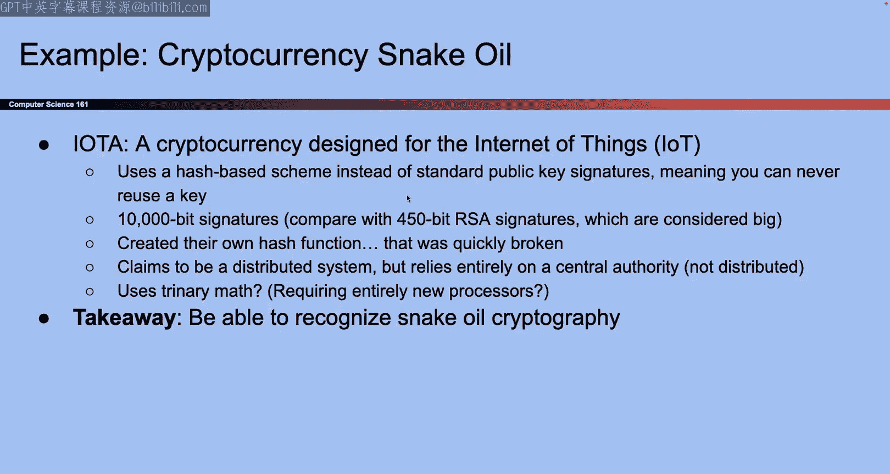

# UCB《计算机安全｜CS 161 Fall 2023 ｜ Computer Security at UC Berkeley》Calude-3.5翻译 p12 -12--CS161 FA23- Lecture 12 - Certificates, Passwords, and Case Studies.zh_en -BV1YGbceREDs_p12-

有问。

对。Okay cool so this is the very last lecture in scope for the midterm now we know it's like a couple days before so you're not expecting to know this stuff for the midterm in a lot of detail honestly as long as you watch through this lecture or read the corresponding readings like you'll be okay we're not testing any of this in great detail but it's still good to know okay。

😊，So。Just a quickly review from last time and I guess if we have time left over at the end。

 we could also go back and talk about digital signatures in more detail。

 but last time we talked about public key encryption and the idea was that everybody uses the public key to encrypt one person uses the private key to decrypt we talked about hybrid encryption which was the solution to the fact that encrypting things with public key it can be slow because it uses all this magic math and it can also have size limits if you're doing things like mod key or modM then the messages that you can encrypt they are between zero and p minus10 and M minus1 because you're limited to this mod space so if I want to encrypt two messages that are equivalentent modM the decption would not be clear so we have to encrypt things within size limits so it's all kind of annoying and the way that we fixed it is that instead of encrypting our message directly we added this layer of indirection so we use public key which is great because people don't have to share a key we use public key encryption to just encrypt the symmetric key。

Send that to the other person and now the other person has the symmetric key they can decrypt and now thanks to public key and encryption。

 both sides have a key that they share and now they can use vast symmetric key photography where all we have to do is shift a bunch of bits around。

Okay， and then finally we talked about digital signatures。

 so here the idea was that only the person with the private key can sign something so if I own the private key I'm the only person in the world that can sign things with that private key。

 but everybody else in the world can use their public keys to verify。

And we saw one possible implementation which was also based on RSA and so here the idea was that if you remember all the way back to RSA encryption。

 the way that we encrypt it was we took the message。

 you raised it up to the E power and then how do you decrypt you raise it up to the D power and the E and the D they cancel out their multiplicative imverse but in RSA signatures we go in the other direction so when we want to sign something we first raise the message up to the D power that creates a signature and we hope that nobody else can raise things up to the D power because they don't know the private key and how do you verify well you take that M to the D you raise it up to the E power which is the public key so everyone can raise something up to the E power and if the result comes back as M and you know that the signature is verified otherwise it's not so that's the high level idea it is just RSA encryption but instead of raising something to the E for encryption and then D for the decion you raise it to the D first to assign everyone else raise it to the E to verify。

Short summary of last time， Okay， anything else you want to know about。Stuffing last time， okay？

So we're actually at the very end of cryptography believe it or not so all I have to do today is wrap up a couple loose ends throughout things that we've done so couple topics certificates and password hashing that are more involved and then at the end if we have time I have all these random case studies if we have time we'll get through them if we don't have time you can read them on your own。

That's today， okay。So the first problem that we have to solve we solve all these major problems we've gone all the way to public key cryptography。

 but there is one problem so first I guess we can talk about what makes public key cryptography so great what's amazing this is a thing that was not possible like 50 years ago or whatever but what's really amazing is that now two people can communicate securely even if they don't share a secret that's pretty cool and we took all this math to unlock unlock but it's a pretty cool achievement I can sign something you can all verify and nobody can forge I can also encrypt things and only you can decrypt that's all great we don't have to share any secrets so is that like too good to be true like how can this be possible are there any catches so there is one catch and maybe you've already spotted it but it's kind of subtle so catch is that。

Public keys are kind of hard to distribute so well what do I mean by that So suppose Alice wants to send a message to Bob our classic scenario we've seen it over and over again and so what's the first step that we saw in all of those public key encryption protocols Well the first thing is that Bob publishes his public key to the world he generates the key pair and then he announces to the world I am Bob this is my public key another way of saying it is you could say Alice asks Bob。

 hey what's your public key and Bob answers， these are basically equivalent but somehow Bob has to send his public key to Alice either by publishing it to the world or by sending it to Alice okay and then after Bob has sent his public key to Alice now we can do all the public key stuff where Alice encrypts the public key or assign something and Bob can decrypt and verify so that's all great but this step where Alice asks Bob for his public key or where Bob announces his public key to the world that part is actually kind of vulnerable if you think about it like think about mallllory looking at this。

So it's true that once we get to the stage where Alice is encrypting things and signing things it's kind of hopeless for mallory she can't tamper with things she can't read things。

 but what about that very first step where Alice asks Bob for his public key could Valory do something there or maybe what she could do is she's the man in the middle she can modify messages so when。

Bob announces to the world or when Bob sends to Alice。

 I am Bob and here's my public key Maory could take that message and say I don't like this message I'm gonna take this message tamper with it and I'm gonna replace Bob's public key with like my public key or something So now Alice believes that mallllory's public key belongs to Bob well that's kind of bad because now if Alice tries to encrypt the message with the key that Bob provided that mallllory taampered with suddenly Alice is encrypting the message with mallllory's public key and Maory could use her own private key to decrypted So that's the problem。

 The problem is it all looks so beautiful and perfect but if you squint a little bit there's this really subtle edge case which is that very first step where the public key is announced to the world or distributed to other people someone could tamper with that they could send their own public key we could send someone else's public key so that's a problem we have to solve that today that's a picture version of it。

 Bob wants to send his public key to the world but mallory intercepts it and says I don't like that I'm gonna to change it I'm going to make Alice receive。

I own public key so Alice receives this key but she thinks that it's from Bob so when she sees this she thinks that this is Bob's public key so she encrypts it with what she thinks is Bob's public key sends it to Bob mallory can decrypt this she can maybe even tamper with it for sending it forward to Bob so we have a problem we have to solve this okay。

So how do we solve it Well maybe your first instinct that my first instinct might be what we already designed signatures didn't we。

 wasn't that the whole point of signatures is that when I have digital signatures someone cannot tamper with a message like if I sign a message and you tamper with a message and the signature will fail to check out if I have a message in a signature and I tamper with a signature the signature will fail to check out if I try to tamper with both I cannot forge a message with a valid signature so at first glance it seems like wait a minute I can just use signatures to take care of this right but think about who's private key what I'd be using to sign this so when Bob publishes his public key to the world who's signing it well I would imagine Bob's gonna to be the ones to sign it。

 he's sending this thing to Alice he is publishing the key to the world so I guess Bob signs it okay so Bob uses his private key to sign his public key that's great how do I verify the signature I have to use Bob's public key but that was the thing。

I was trying to verify in the first place so how am I getting that so we run into kind of like a circular problem if I want to make sure that Bob's public key is correct and untampered with I could try to sign it with Bob's private key that's the person sending it but how do I verify the signature I use Bob's public key which was the thing I was trying to verify it kind of like meltl your brain。

 but there's a circular problem basically the problem here is that the thing we're trying to verify is the thing we need to use to verify so seems like we're kind of stuck so somehow I don't know how to send this public key to Alice in a trustworthy way Bob can't sign it himself because this is the thing I used to verify so kind of get stuck okay so another way of putting this and this kind of gets a bit more philosophical the problem here is that Alice doesn't trust like anybody if she only trust things that are signed she starts trusting nobody and if you go through life trusting nobody then well you're gonna kind of have a sad time so。

Somehow we might just have to put our trust in somebody and then use that trust to gain more trust。

 I realize that's super deep and philosophical， but we'll see what it looks like in the context of distributing public keys Okay so the goal here is that yeah。

 there's this problem of this is trueer Bob tro or anyone that I talk to if I want their public key I don't have a way to get the public key they can't sign it because then I can't really verify it so ultimately I need to pick someone that I trust and then like listen to what they have to say and hope that that helps okay so that's what the trust anchor is and we'll see it really soon okay this is a little bit of like off topic I guess before we go into the actual need of certificates but one protocol that you'll see sometimes and this is not the approach that we're gonna talk about today but another approach that you might see out there it's called trust on first use it's kind of clever。

 And so the idea here is that。The first time that Bob sends this public key it is true that you don't know is that Bob's public key is that mallllory's public key like you don't know it could be anyone's public key so the first time that Bob sends his public key you're not really sure whether it's his or whether somebody else tamper with it so one thing you can do and one thing that a lot of reallife protocols like SSH do is they'll tell you this is a public key that you have never seen before you don't know who it belongs to it could be Bob it could be mallllory so do you want to trust this public key and if you trust it then I'm want to save it and in the future I will believe that this belongs to Bob otherwise if you don't trust it then we're not going to use this key so if you've ever used SSH and you get those like warnings like hey do you want to proceed like on Project one or whatever what were they actually asking they were asking you're trying to use the public key of this other computer like the hive missions or whatever and they were asking you do you trust this public key because I do not have a way to trust public keys at the moment so can you just implicitly trust it。

Believe that this is the real public key and if you type yes and your computer trusted you and said okay I'll take your word for it。

 that's actually their public key even though I wasn't sure or I don't have any cryptographic proof so here what you're relying on is you're just kind of hoping that at the moment you're not being attacked because attacks don't have them too often so you are taking a bit of a leap of faith you're hoping that the first time that you log in no one is attacking you but depending on your threat although maybe this isn't good enough or maybe it is so if you believe that like this know each servers are not out there attacking you then maybe this is good enough but you're working for you know。

National security organization or something maybe this isn't good enough so this is one possible little approach is just to trust on first use and then in the future trust that public key going forward。

 but we're going to look for something a little bit stronger than this but do know that some protocols they go with this okay。

So the thing that's a little bit stronger that we're going to use is something called certificates and like I'm not a huge fan of this name and someone asked in chat how do you verify that a public key belongs to someone So this is what a certificate iss going to do so I'm not a huge fan of the name certificate like it doesn't really tell you what's going on like when I see public key encryption I'm like oh I know what this is it's using public keys to encrypt but when I see the word certificate I'm like I don't know what this is so don't get tripped up by the word and think that certificates are this huge complicated thing or it's doing more than it claims to do a certificate is just some fancy word of a really like simple relatively speaking cryptographic value So what is the value that we call a certificate is only this which is it is your public key signed by someone else that is it there's nothing else to the certificate does a certificate and all like a message or personal whatever nothing right all the certificate is is it a message saying something like。

This is Bob's public key sign Alice or something like that， that's all so it says。

This is Bob this is his public key and there's a signature on it that's all that a certificate is it's someone's public key signed by someone else so yes the name is kind of weird if I wanted to name it I might call this something like public key signed by someone else but I didn't name these so we're stuck with certificates okay。

Sometimes you might see them written using like shorthand like this。

 but the important thing is what is a certificate， it's a message saying this person is Bob and their rep key is this and we take that entire message。

 we sign it， we send the message and the signature， and that whole value。

 the message and the signature， it is the certificate。

So the idea here like why certificates are even useful is because we already solve that problem from before which is Bob Bob cannot convince Alice to trust his own public key so instead Bob is going to say something like okay maybe you don't trust me because I have no way to verify my public key so you'll never know if I am who I claim I am but suppose that Alice has a friend like Ebot you know everyone's friends with Ebot so maybe if Alice trusts Ebot and what we mean by trust here is that Alice and Ebot the friends Alice knows exactly what Ebot's public key is then here we can say Ebot is our trusting this is someone that we trust no matter what we know what their public key is we trust and how do I know what their public key is well maybe I just trust them and hope that I wasn't attacked or something but somehow this is someone that I trust it。

 how did I trust them that's up to your protocol but the important thing is that we trust this person we believe that this is truly their public key so if the person that we trust。

Sends us a certificate saying Bob's public key is this and they signed the message it's signed by someone that you trust then you have basically taken your trust in that person and you're using that trust to spread the trust out to Bob so that might be kind of a confusing way of saying it but another way of saying it is if I trust Ebot and Evanbott says that Bob that's Bob that's his public key then I should probably trust that that is actually Bob and that's his public key so I trust what Evanbott says we all trust what Evanvanbott says he's our trustmaker okay。

So what is a certificate， such a fancy name but all that it is it's a message saying something like Bob's public key is blank and a signature on that message by somebody else that is all that a certificate is what is a certificate good for a certificate is good because if you cannot verify your own identity you could ask someone else that you trust like a third person and if I trust Evanbot and Evanbot says yes。

 Bob's public key is this here is a signature on that message to proof that I sent it I can use Avanott's trusted public key to verify that now I trust Bob and this can actually go on so now that you trust Bob maybe Bob can endorse somebody else and that person could endorse someone else so certificates can change together which we'll see but how does a single certificate work nothing more than a message。

And a signature on it。Okay， so that is the definition of a certificate so now there's a question of okay so I kind of know how this works if you trust someone you can delegate that trust or spread that trust to someone else。

 but there is still a question of where did these things come from who generate certificates in real life so we could organize certificates in a bunch of different ways。

 so here's one possible way so we could say。Maybe there is one person that everybody trusts so like everybody in the world puts their trust in like one trusted directory so this is like the most trustworthy person in the universe and we delegate them and we say it is your job to tell me what other people's public key is everyone in the world trust you we're counting on you and you're going to tell us what everyone else's public key is so that's our trusted directory it's a single person in the world the most trustworthy person in the world and they're going to tell us what everyone else's public key is so how does this work well we could have this single most trusted person in the world they can have a public private key pair they can send it to everyone else in the world and everyone else is going to believe that this is the right public key why do they believe that this is the right public key because this is the person that we are implicitly trusting we're like we trust you we hope you're trustworthy and so we all hope that everyone uses or everyone believe that this is the trusted directoryies public。

So everyone trusts this， like we'll bake this value into our computers， our phones。

 everyone knows this value we all trust this person。😡，So if everyone trusts this person。

 then now anytime I want to know someone else's public key like， hey， what's Bob's public key。

 I go up to the most trusted person in the universe and I say， hey。

 what's Bob's public key and the most trusted person in the universe sends me a certificate。

 what does the certificate say it says Bob's public key is this signed by that really trustworthy person and I can use that really trustworthy person's public key which I trust implicitly to verify the certificate。

There's the message it's signed by the trusted keys private or the trusted directory's private key and I can use their public key to verify so now this person can tell me everyone else is in the world it's public key。

Okay that is one possible approach so in this approach who are we putting our implicit trust in so remember if we trust nobody if we go through life trusting nobody then we're never going to be able to believe Bob when he says something too paranoid so we have to invest our trust in somebody first and then they can spread the trust to other people so in this case who is the person that we are just believing blindly without taking like taking their word for it in this case the person that we are believing blindly is the trusted directory that's the one and only person who we've put our blind trust in and they are going to delegate trust to everybody else okay。

So we trust that person， we trust that this is correctly and truly their public key and then they we also trust that they're a trustworthy person and that they will only sign certificates if the person is trustworthy。

I said the word trust a lot， but it's like about trust， so talking about that okay。

So that's one possible approach and maybe you already don't like it so let's think about maybe why we don't like it。

 I guess we can show an example first then and talk about why we might we might not like it Okay so one reason why we might not like it is because I guess hes our example which is that the trusted directory is like the president of UC right this person is probably pretty important and trustworthy I'd say I don't know this guy but maybe he's really trustworthy this person is our trusted directory and all of the UC system so in this case if I want people's public key。

 I'm always going go up to this one person and ask so I want Nick Weaver's public key he used to teach this class I'd go up to the trusted directory and ask I want David Wagner's public key guy who invented the blog cipher I would go up to Michael Drake and ask and so forth okay so。

Maybe you already don't like this scheme and what are some reasons why you might not like it Well one reason is like this person is probably going to be very busy like if we delegate one person in the world who we trust and their job is to provide public key to everyone else in the world that's kind of a lot of work to put on a single person who's going to do that how do we put all of our trust in a single person so there's one problem which is this person is probably just not going to have the time or even if we thought about like some server that's doing this this server is probably not just not going have enough compute power to serve the entire world and give certificates to everyone in the world who requests so this approach it's not scalable maybe like in a small club or something where you trust the president maybe it's good enough but like for the whole world this is not going to scale well。

And the second problem is like， well， what if this person turns out to not be trustworthy for some reason？

You know maybe they're walking in like they drop their keys somewhere and someone else picks it up well suddenly all of the trust that the entire world put into this person it's like misplaced down because this person is no longer trustworthy so there's a single point of failure and if this person fails it's going to affect the entire world like catastrophic because now everyone was relying on their trust on this person and if this person is no longer trustworthy then while things are going to start to break everything's going to start to break I no longer know who public key is who's like someone sends me their public key I don't know who that person is so I'm gonna to have problems。

Okay and another problem in terms of like scalability and usability is like imagine this person or this server like goes down for a minute so server breaks or something someone has to come fix it well now the entire world has to wait for this server to come back up also kind of a problem so it was a nice approach but turns out having a single authority or a single point of failure it's not good for scaling but it was a nice try and in theoryor would work if there was someone this trustworthy out there okay so let's try again this time let's think about what would this look like in real life so in real life there's no such thing as we walk up to the most trustworthy person in the world and ask them to do all this work for us so instead let's think about what this might look like in real life and so in real life we might do something a little bit more scalable and in particular I'll pull it all up。

We're going to do something like building a tree of trust we're going to say let's not just have one person endorse everybody let's try having one person use certificates to endorse these people and all of these people can use their keys to endorse these people and you know all of those people can use their keys to endorse more people and so the trust can start at a certain person and they can slowly spread all the way out so instead of one person being responsible for all of the work of you know giving certificates to everyone they can delegate trust to more people those people can also delegate trust to more people so I can have this big slow spread of the trust okay so。

For example， here， I'm going to build a hierarchy and it's still going to start with like Michael Drake。

 the actual UC guy I actually don't know like has he been like fired or canceled or something recently is that still the guy I don't know these legs are kind of okay we'll look it up together after I think I looked it up a year ago and it still was but you never know okay so Michael Drake the guy this is the guy at the very top and so the first thing I'm gonna to do is Michael Drake。

 this guys probably pretty busy probably does not have time to sign public keys for every single person in the UC system it's like what tens of thousands of us there's just no way too busy so maybe what this person will do is Michael Drake is going to instead of delegating trust to each individual person in the UC system。

He's going to use a certificate to delegate trusted people at like each college so we could say okay。

 you know Carol Christ Christ I don't know， but I think is she still using a birthday chanceancellor or is she like gone now I don't know she're retired about to retire okay so this light is still good for today all right so。

We could say instead of delegating trust to every single person。

 Michael Drake will delegate trust to only Carol Christ and so how do you delegate trust the way that we delegate trust is we use a certificate and what is the certificate it is nothing more than a message saying here's Carol here's her public key I trust her sign Michael Drake see that's the whole certificate and using the certificate anyone who receives the certificate now knows if I trusted Michael Drake and Michael Drake told me that Carol's trustworthy。

 then I probably trust Carol now as well so it took the trust from one person spread it to a second person maybe Michael con it to all of the individual UC campuses I do not know the chancellor names at other UC campuses but we can imagine they all get similar certificates Okay and so we can keep doing this like step by step so we could say okay Carol know you're gonna sign or you could sign the public keys of every single person on the Berkeley campus but that's a lot。

So maybe she delegates like my department or something and again。

 how do you delegate all you have to do to delegate trust is to send a certificate。

And what is a certificate it would just say something like David Wner's public key is this and I trust him to sign for the CS department so it's the name of the person and their public key I sign it so now anybody who trust Carol they now trust David so。

That would be the second layer we can do this over and over again I think when we made this slide Dave Wagner was the CSs chair so I don't know if he still is don't think it is but that was the intent of this one okay and so this can keep going layer by layer how many layers you do is kind of up to you and how you want to organize your organization but that's the idea instead of having one person sign everybody's public key we can have hierarchical certificates where person A delegates trust to person B person B delegates trust to person C and the way that I would do this is I would come up with all of these different certificates and each certificate says nothing more them this is a person that I trust if you trust me now you trust them and we can do that over and over again to spread trust out and a really common way that we would draw these if we draw a tree like before someone at the top they delegate they delegate they delegate all the way down okay。

So once we build something like a tree we get all these fancy names but these are just names for the thing that we just saw so if that made sense i'm just adding a little bit of vocabulary so that person at the top like Michael Drake Gu we sometimes call them the root certificate authority and here I guess the intuition is that's like the root of the tree it's at the very very top but sometimes we call them a certificate authority this is a person who is an expert at certificates they can generate certificates for other people。

And sometimes we also say this for the people in between so like Carol Christ who is delegating trust and like David Wagner who is delegating trust。

 sometimes we call them intermediate certificate authorities。

 so here are certificate authorities is just a fancy way of saying this is a person who's going to generate certificates for other people so if you trust them you can ask them questions and they can delegate trust using certificates that they generate to other people okay。

So that is maybe how you would do it in like this a fictional UC example in real life what does this actually look like that's a good question and turns out with security sometimes we're going to like bridge the gap between cryptographic protocols that are like pure math and things that actually happen in the real world which I think is pretty cool and so this is one of those cases where what does this actually look like in real life well we can't just have a single roots in real life who is this most trustworthy person So instead what actually happens is you can look this up afterwards if you want is。

There are like around the order of 100 Ro certificate authorities and each of them have like their own tree where they delegate trust to all sorts of different people and so if you look at like their internet browser or something you'll see that like Firefox or Chrome or whatever they come prebundled with the public key of like these 150 root certificate authorities and we just assume that they're trust or Firefox assumes that they're trusted public keys and how do we trust them well I mean that depends on you if you don't trust them you can go and delete them from your browser and suddenly you don't trust them but Firefox Chrome like they generally believe they're trustworthy and these are based on things like reallife business relationships。

 organizational relationships so for example one of these could be like a big company like Google might have a r certificate authority and so now the question just becomes do you trust Google like is that a trustworthy company that you think is only going to sign legitimate or like delegate trust to legitimate parties or is Google going to delegate trust to an attacker。

I don't know that depends on how much you trust you know mega corporation Google or whatever or maybe say like the US government might have a certificate ability so you know do you trust the US government to sign the public keys of other people and trust that the US government will not sign the public key of an attacker I don't know that's up to you so that idea of like。

Real world trust has to come from like business relationships organizational relationships it's kind of interesting so that's what this bottom part talks about。

😊，Okay， cool questions。嗯。Do Google and the US government actually have Ru do Google and the US government actually have Rus。

 I don't know。 We' have to look it up later， but I believe most Rus come from some like。

Organization like nonprofits that deal with like the internet or companies like that。

 so it's a good question no。Okay other questions certificates signed for use students outside abusey Berkeley are not trusted I'd say that depends so like in this kind of silly example we were assuming that da Wagner is only going to go through the trouble of signing public keys for Berkeley students and is not going to go through the trouble of signing other certificates。

 but if your model is different if it only looked different。

There was a really good question which is can mallllory Tmper with a certificate I'm hoping there's a slide on it but maybe not so something kind of cool about certificates that I should briefly mention even if there is no slide on it is that certificates are public values so think about what's in a certificate in the certificate I have somebody's name I hope that's public and someone's public key yeah that's probably public and the signature on those two values all three of these things can be public I'm not leaking any secret information when it comes to certificates so certificates it's okay I can make them public and that's okay something else that's kind of cool about certificates is that because they come with the signature it doesn't actually matter who you get the certificate from you can always verify whether or not the certificate is legitimate so this might answer the question from before so say you know mallllory walks up to you mallllory and she hands you a certificate that says this is Bob's public key signed by a certificate authority that I trust so。

You now suspicious you're like wait but mallllory sent it I can't trust mallllory but remember all the certificates come with a signature so if you get a certificate even if it comes from mallllory and it says something like Bob's public key is this signed by Evanbot you can still use Evanbott's trusted public key to make sure that this certificate that Mallory has ended to you is trustworthy and can Mallory tamper with it well she can try but if she doesn't know Evanbot's private key she has no hope of tampering with the certificate something else pretty cool about certificates is that they all have public values and because they come built in with signatures you can actually receive them from just about anywhere you can always verify whether or not their ballory so that's pretty cool。

ok。That's cool Anything else I want to say about certificates。

 we're kind of getting into the trivia at this point。

 but a couple more things I guess I can say really quickly are that public keys are for these root certificate authorities。

 they're usually hardcode for example when you download Firefox it comes prebuilt with list of 150 public keys and maybe you're concerned you're like how can I possibly trust those public keys like how do I know that they're correct but if you think about this like these 150 public keys like they're pretty much public knowledge like everyone knows them any of us with a download of Firefox will have these keys so if you're super parent you can also ask around and just make sure that these are the correct public keys。

 we're kind of getting into the ways of things here but you can almost think of these public keys is like common knowledge it's like saying you know who's the president of the US like yes Maory could certainly come up to you and lie about who the president of the United States is but like it's such public knowledge that getting the right answer is probably not going to be too hard so I guess quick side note if you don't trust the public keys。

Of the Ruiers， you could say there's such public information that the odds of me getting the wrong answer are pretty in the same way that it would be pretty hard to attack someone and convince them。

 you know that the president of the US was somebody else okay。

I think as mostly all wanted to say I guess one final thing I'll say is that you do not have to sign the certificates over and over again so if you're a certificate authority you can sign it。

 you can hold on it with the message and the signature like store it in your database and whenever someone requests you can just give it to them with the signature presign so you do not have to resign this thing over and over and over again as people ask for it you can sign it a single time hold onto it and then distribute it whenever people ask for it and that's nice because remember signature is kind of expensive so if I only have to do it once store the signature forever and send it out that's kind of nice。

Okay but I realized the last like five minutes they got a little bit into the trivi of certificates。

 most important thing is that they are someone's name， they' public key。

 it is signed by someone that you trust and I can use this to delegate trust in a hierarchical way。

 that's the important part okay。So really quickly you might wonder what happens if certificate priorities mess up so what if I accidentally send something that's wrong so perhaps I got tricked or I got hacked or something and suddenly there is a certificate floating around in the world that says this it says Bob's public key is PKm the PKm is mallory's public key and this message is signed so anybody who trusts me the certificate authority that issued this is now going to believe that Bob's public key is that thing that evil thing so that is a problem and something that we have solved the certificate authorities try to be secured but sometimes this actually does happen once in a while and it actually happened once where apparently they issued a certificate someone that said like Microsoft's public key is this and what was that it was some random Joe's public key so suddenly this person could now pretend to be Microsoft to everyone probably better okay。

So how do you solve this there's a couple solutions that people like to use in real life so one solution is to make these certificates expire and I kind of like this one is pretty simple so the idea is that every certificate in addition to the cryptographic values of like identity public key signature they're also all going to come stamped with an expiration date and so now anyone who receives the certificate will say I'm only allowed to use this until the expiration date after it expires I'm going to rere the certificate maybe the certificate that I rere is the exact same that's okay but the expiration date forces me to check a couple times so if someone hacks into my system and generates a bad certificate or if I mess up and accidentally generate a Microsoft certificate to someone who is not Microsoft well yes it's kind of bad but it won't be too bad if the expiration date short enough eventually that bad certificate is going to stop being trusted by everyone else because it's expired so。

That is one possible approach Now you do have to start thinking about like is this usable in the real life or like in real life So now there's a bit of a tradeoff which is well I could make expiration dates really short。

 so this would be like I give you I don't know do people still go to the library you should libraries are great but like you go to the library imagine if they check the book out to you and they said this is due in five minutes if you want it again you got to come back in five minutes check it out again so you read the book you're on page one and then five minutes later you go back and renew it page two go back and renew it and like yes you can do that but it's probably not gonna be very good reading experience so you could force the expiration dates to be extremely short and in fact this happens in real life there are certificates that expire in five minutes。

10 minutes one hour and what happens here that you have to rere a new certificate once every hour so this is kind of unusable in some cases more usable in others because you have to keep requesting over and over but the good news is that if something goes wrong that certificate。

Going to become harmless in just an hour or just five minutes On the other hand。

 you could say actually these certificates renew once a year so once you get a certificate。

 it's good for a year Well now the tradeoff is that it's more usable in some senses because you don't have to go back and renew it over and over but maybe it's less secure because if you get a bad one suddenly it's floating out there for a year yeah question a new certificate often doesn't increases the number of certificate give and create the number of Yeah that's a question which is would you increase the number of bad certificates if you were forced to redistribute over and over again I guess it depends on what you're assuming the certificate authority is if we think that they get hacked like 1% of the time then yeah maybe it's not a great assumption but in general we assume attacks are rare so we're hoping that since attacks are pretty rare if attack does happen we wanted to die off really quickly like in an hour as opposed to having the results of that。

Attack like stay for years and years if the expiration did was really wrong， so that's our goal。

 okay。There's a question of how do you verify the public key of a random old user like someone comes up to you and says I want a certificate。

 how do they verify that is actually between you and the certificate authority so different certificate authorities will have different verification processes like in the real world it could be something like and I guess talk about this one in the networking unit but how would you know to issue a public key to someone sometimes the certificate authority issues like a challenge that only you can solve and you solve it and then they issue a certificate to you but that'll come up more in the networking unit it's a good question though and it's something that's up to the individual certificate authorities to enforce so maybe a certificate authority because say something like I don't think they do this but they could say something like you need to come in person and show me your ID and then I'll give you a certificate they could do that too but usually done。

There is one case where frequent renewal could arguablyably more arguably be more usable and we'll talk about that when we talk about leadynncpt when we talk about TLS。

 so I'm not going to talk about it now， but theoretical curious okay。

 so approach number one a lot of small details but the important thing is that we just use expiration dates stamp every certificate with an expiration date it creates a tradeoff between usability and security which we see a lot okay。

There is a second approach which is I don't know maybe you like it maybe you don't so the second approach is that every certificate authority will once in a while give a list to the world and say okay this is my list of mistakes so I messed up here here here here here please do not trust these certificates and delete them from your list of trusted certificates as soon as you can and I will send another list next week of all of my mistakes so in this case I am repeatedly or periodically sending out a list of certificates that I do not like anymore and sometimes people call that a certificate revocation list or whatever but the important thing here is that the certificate or the certificate authority sends a list they can even sign the list and that way I can verify that the list is correct delete all the certificate。

Okay， so。You know this also works totally fine you know list can get large。

 maybe potential drawback I'd say the main drawback here or a couple drawbacks are like well first now it's up to the user to actually like download these and make sure that they're revoking as they go so maybe it's more work on the user there could be a problem which is like what if the certificate authority is down that could be a problem because now you don't know whether or not the certificates are expired or not expired or revoked or not revoked so basically all of this is just to say that there are tradeoffs between security and tradeoffs between usability that we have to deal with okay。

So。Certificates， reification lists， expiration dates， ways to delete。

 certificates we don't like anymore。One thing i'll briefly notice that we are only scratching the surface of certificates in the same way that we are only scratching the surface of a lot of these things。

 so yes while it is true that like deep down a certificate really is just someone's public key and someone's name signed by someone else that you trust there are a lot of specific things that go into it so yes it feels kind of simple but I do not recommend going out and starting to implement this thing there's like a huge protocol about it so。

Just be warned that we talked about it， but we only talked about the basics。

So you know I'm not going to talk about this too much。

 but there is another approach which is instead of doing hierarchy like a tree where that's the root person that I trust they delegate trust to more people。

 they delegate trust to more people you could also build like a graph and here we're building like a web of trust where everyone can sign for their friends and there is no like boss at the very top of the tree and there is no tree structure so that also works the main problem here is that just get super messy because these graphs can get super complicated like oh Alice Sp as Bob and Bob B as7 Mo1 mustspares so David or whatever so these webs of trust can get complicated so people have trieded in the past but they get a little bit annoying sometimes okay。

So that's it for certificates again， the trickiest thing here I honestly think is the name because seeing the name certificates does not remind you that all that it is is a way for us to solve what was the ultimate problem that we solved。

 the problem that we do not know if this is really Bob's public key and how do we know that this is truly Bob's public key。

 we ask someone else that we trust and we can do that in this tree structure to get hierarchical trust。

Okay。That's it for certificates。O。Cool， so the second kind of final topic that we're going to briefly talk about it's kind of like an application。

 so it's not really a hole we have to plug。In our exploration of cryptography。

 but it is something that's pretty useful， so we're going to take some of our protocols and use them to build something that you might use a lot in real life such as passwords so sure you know what passwords are they come up all the time so how do we store passwords securely。

Well， I've kind of already given away the answer because this is called password hashing but since I've given away the answer I'll tell you a bit about cryptographic hashes so remember that a cryptographic hash takes an arbitrary length input you can pass them as long of an input as you want and the output is going to look random so if you change a single bit of the input the output is unpredictable we also know that the cryptographic hashes are generally pretty fast they shift a lot of bits around and we also know that cryptographic hashes are one way in collision resistant the important thing here is that if I show you a hash you have no idea what input I use to generate the hash you also cannot come up with any other input that matches to the same hash theyre also collision resistance so if I challenge you please find two hashes that output or two values that output to the same hash you're going have no hope of doing that。

Okay so that's all hopefully in review okay so now let's think about passwords and yes。

 I have a definition of passwords on the slide if you really want it。

 but hopefully we all know passwords are that secret thing that you type in and it's like it's all circles when you type it in okay so we know what a password is。

Okay。So when you type in a password， have you ever wondered like how does the server actually know if my password is correct or not so maybe the first thing that you think of is well maybe the server is storing the list you know Alice's password is this and Bob's password is this and everyone's password is this so yeah they could do that does that feel very secure to you know it doesn't feel very secure to me because imagine if someone hacks into their service or leaks information well guess what now everybody knows your password or the attacker knows your password so if someone hacks into their system they immediately learn everyone's password and that's kind of bad news so that's our first idea we don't really like it so now let's start thinking cryptographically so maybe your first idea is I don't want the attacker to know what the passwords are that sounds like a job for confidentiality so perhaps what I will do is I will encrypt every user's password and then when a user sends me their password what do I do I decrypt the password that I stored check it against the password against the user。

Provide it and see if they matchsh。Does that work Well think about what happens when the attacker hacks into the system What if the attacker steals the list of encrypted passwords and they steal the key what happens now we are back to where we started the attacker still has everyone's passwords so yes we could encrypt every user's password but this doesn't really stop an attacker if they take total control of the system they know the key they know the encrypted values they can simply decrypt and find out what my passwords are so in real life most people do not use approaches one or two unless they are really bad at't hitting websites so instead。

We want something a little bit trickier， specifically I want to be able to know that your password is correct the user types of password。

 I want to know if the password is correct or not but I do not want to actually store anything about your password and you're like wait that sounds so contradictory how can I verify that your password is correct but not give the attacker any chance to know what the original password was and like how can that be possible but remember we have the power of hashing on our side so instead of going with encryption or the password itself let's store a hash of their password and what's so great about this is yes。

 we can verify that a password is correct how do we verify you send me a password I hash the password that you sent I check it against the hash of the password that I have stored if they match and you're good to go if they don't match then I do not log you in your password is wrong So when you first sign up you give me a password and I hash it I store only the hash I don't store your actual password。

And then every future time you log in， I rehash the thing that you send and I check it against the password hash like you can think about why does that actually work like what property of hashes am I using to back the fact that this is true like how do I prove that this will always work and try and think about it。

Well one thing that has to be true is this thing I better be determinist because if you want to sign in 10 different times you're going to send me the password 10 different times I'm going hash it 10 different times I'm going to compare it to the same hash in the file 10 different times so I better be getting the same password hash over and over again if you give me the same password okay so for usability purposes it better be deterministic。

And we know hashs are deterministic so we should be okay what else Well hopefully these things are one way and why do we want them to be one way because again imagine the attacker who hacks into my system so what do they get they get a whole list of these are all the users in my system and these are all of the hashed passwords that they have so I do not want an attacker to be able to know if this is the password hash like I've given them the password hash what password did I use to generate the hash I don't want them to know and if the hash is one way that I should be okay。

So if I give them the hash， they have no idea what input I use to generate the hash。

 then I should be okay。Okay， so if we have those properties， then these hashes should be secure。

 so now users can log in and the attacker who steals my passwords file has no hope of knowing what the actual passwords are。

Okay。But we're not like totally done because even if the attacker doesn't know exactly what the password is。

 they might still be able to learn something about passwords。

 I don't want the attacker to learn anything about the user's passwords so how can I do that well imagine something like this maybe this is pretty common so two users sign up and they both just use the super secret top secret 161 approved password password 123 think about what happens here both users use the same password so what do we do we store Alice has password hash of password 1。

2，3 Bob Pass password hash of password 123 so what can the attacker do if they look at my file well don't notice wait Alice's password hash is this and Bob password hash is the same thing and so the attacker can look at this and immediately determine Alice and Bob even if I don't know exactly what their password is they're probably using the same password because their password hashs are the same so。

That's kind of the problem so one problem is we are still leaking whether two people use the same password。

 even if you don't know what the password is， I don't even want attackers to know that two people are using the same password I don't want to leak that information。

There's another problem which is most people are pretty bad at choosing passwords like I don't know about you。

 but not all of my passwords are like you know really long secure strings of random characters right everyone loves to use like their birthday their dog's name whatever and so。

What an attacker could do is they could use brute force to their advantage so they could say I know that most people choose passwords that look like stuff like this。

 password 1，2，3， password 1，234， 1235790 the names of like all the common dog names。

 all like the birthdays out there so the attacker could take all the common passwords that they know about using their domain knowledge of these are all the common passwords。

 they could simply hash every single one and then compare against the passwords file that they've stolen and if they notice that wait one I hash password 1。

2，3 it matches the thing associated with Alice that Alice must be using password password 1，2，3。Okay。

 was this called it's usually called a dictionary attack and here the idea is that you take a dictionary of all the common passwords or like maybe even a dictionary of all the common words that people use in their passwords and I hash every single one one by one by one by one by one。

 and then I check those again something in the passwords file okay。

And it turns out if you do not want to calculate the hashes one by one by one and you think it's too slow。

 there are actually algorithms out there that take advantage of the underlying way that hashes work to make it even easier to compute an entire dictionary of hashes in really fast time those are called rainbow tables we're not going to talk about them but they're pretty cool they leverage the fact that hashes do like reuse work and stuff so that if I want to hash the entire dictionary。

 there are more efficient ways to like hashing the first word hashing the second word hashing the third work I can try to reuse work and hash the entire dictionary even faster。

Okay so these are problems basically people can use the same password and I don't want to attackers to be able to brute forcece my passwords so i'm going to solve both of these so first i'm going to solve that first problem which is what if two different users decide to use the same password so I think about this and i'm like well the problem here is that hashes are deterministic by hash the same thing twice I get the same password output I do want to keep that theirre deterministic I don't want to switch to something different I don't want to introduce randomness because if I introduce randomness I can no longer verify passwords but I can do something pretty clever called salting a password。

And so here the idea is I'm going to associate with each user a unique value in addition to the password so for example。

 for each user instead of simply storing this is their username so Alice's password is and then I hash their password I'm going to say this is Alice this is the random value associated with Alice and instead of just hashing their password I'm going to hash the password and the random value unique to Alice no one else is using this random value。

 only Alice is using that random value okay so how do I verify that if someone sends me their password well then all I have to do is take the password that the user sends to me concatennate it with the salt that I'm storing the random value associated with Alice that I remember I hash both I check the resulting hash against the one that I stored if they match the password is correct otherwise the password is incorrect so do note here that the salt it has to be actually stored I have to remember。

what the salt is because if I don't remember what the salt is。

 how can I recompute this hash so I store this is Alice this is their salt and then this is the hash of Alice's password combined with their salt okay。

So I do need to sort the solve every single time It's not a secret value I don't really care if the attacker knows the important thing is that it's different per user and does this solve our problem from before well think about what happens if two people sign up with password 1。

2，3 as their password well the first person is going to say this is Alice this is their random value belonging to Alice that's unique to Alice and the hash is password 1。

2，3 plus Alice's random value that is some hash output what about Bob Bob signs up with the same password here is Bob here is Bob's different unique random value here's the hash of Bob's password the same thing concatenated with Bob's unique value so now even if two people have the same password the hashhes are gonna to look different which is good。

Right， so now we have Alice and then I don't know， the salt of Alice and the hash of same password concatenated with Alice' salt。

 same thing for Bob， but Bob's password is going to be concatenated with his salt。

 so those values are different okay。So questions about how do you generate salts that's a good question the important thing the property that we really care about is that it's different per user that's the main thing that I care about so you can generate salts however you want you can do them randomly but the important thing is that they are different per user that's what we care about and do we care about salt being secret well not really because if someone knows the salt what can they really do the salt doesn't help them learn the password the salt doesn't help me reverse the hash the salt isn't the password you can't enter the salt and try to be logged in so the salt to itself is not supposed to be secret okay。

So one good thing is that that now the attacker doesn't know whether or not two people have the same password。

 but there's another really good benefit which is remember those dictionary attacks those become a lot harder now so for example。

 think about what happens if a user wants to do a dictionary attack and learn everybody's passwords but what they do they would take their dictionary of like the 10000 most common passwords they would hash the first one hash the second one hash the third one compute this big list of the hash of all the common passwords and all they have to do now is be like Alice's password hash is this check their lookup table Alice's password is this and here's Bob's hash password I check the lookup table of all the hashs that I compute I figure out Bobs password and I do this over and over again so the only brute force work that I have to do in my initial approach I only have to hash the dictionary once I get the hash of every single possible password。

And then for each user， I check their hash against the ones that I computed see if I find imagined if I do that I know the user's password so the total runtime for this thing is I need to hash all the possible passwords which is like O of M and then I need to check one user per database。

 which is like O of so in essence the total number of things that I have to hash was just the entire dictionary one time front to back I read the entire dictionary front to back a single time hash it all I'm good what about the salted version well think about what has to happen now so suppose I do the same thing I go through I hash every single thing I password 1。

23 I hash password 12，3，4 I has every single common password I can possibly think of all the dog names all the birthdays and what do I do now well I look at the first person's password which is password concatenated with Aliceice assault hash and I go to my table hoping to look at up and wait a minute。

my table only has all of the patchs of passwords， but I want to find a match。

Or I want to be able to like find the input that gives me password concatenated with salt so these two are like not compatible right if I want to know Alice's password I cannot go to my table and try to find it because the password was hash with the salt and all the ones that I computed did not use salt so as the attacker I'm now in trouble how do I actually figure out what the correct passwords are I need to do a little bit more work specifically instead of just going through and hashing every single value password 123 all the birthdays I actually need to say I'm gonna to take every value in the dictionary concatenate every single value in the dictionary with Alice's salt and then hash all of those and get a lookup table and who is that lookup table good for like who can I attack with that lookup table only Alice because that lookup table involves Alice's salt and the specific to Alice's salt now what happens if I want to learn Bob's password all of those hashes that I concatenated？

or computed using Alice' assault are worthless so back to the drawing board I have to rehash the entire dictionary using Bob salt con at the end and then check again and if I want like David's password I have to go back hash the entire dictionary again with David's salt and check against David's hash password that's stored so now instead of hashing the entire dictionary once for every single user I have to hash the dictionary once for the first user rehash it again for the second user rehash it again for the third user so my brute force attacks just got harder by like a multiplicative factor instead of hashing once for all the users I have to hash once for every single different user so now the attacker's life is harder so adding assault it's a cheap way to make the attacker's life a lot harder。

Okay。Any questions， there's a couple chat messages。

There was a question of is it possible to dhash remember hashes are one way so you cannot take the output of a hash and learn what the input is hashes are one way that's the property that we talked about there was a question of does the attacker know which hash function should I use that I use M5 that I use Sha one shot2 Sha3 well you could try to keep that secret but remember we assume the attacker knows the system so yes I could try to keep the hash algorithm secret but in general we assume the attacker knows the system and in practice there are just not that many hash algorithms to choose from so the attacker probably knows there's a question of do I need to hash the username you don't really have to the important thing here is I want passwords I want the bru force to be harder so adding with salt different for me question of how do I generate resultss random is okay okay they just have to be different。

Okay that's one possible fix to all of my problems there's a second fix and this one almost seems kind of back resent firstd and it's like flying in the face of all the things we've talked about in cryptography so for once in crypto we finally want something slow and like wait why would I want something slow and why would I want to go against all the common wisdom of like we want algorithms to be fast we want' people to be able to use the algorithms well think about this？

When someone wants to log in， how many hashes do you have to compute for the user who wants to log in one right the user gives you a password and you hash that one password check if it's correct okay maybe the user has to try a couple times they forgot their password that's still what like five hashes 10 hashes it's not a lot and so for a user who is just logging in legitimately taking like one try three tries of the password they are not going to notice a difference if your hash takes 0。

0001 seconds or 001 seconds there' just not going notice from the user's perspective but now think about the attackers what is the attacker doing the attacker is computing the hash if not just one thing but the entire dictionary of thousands and thousands of values so if we make a hash like a thousand times slower guess how much longer the attacker's boot force is going to take a thousand times long or if I make the brute force or if I make the hash like a million times slower now the attacker's time is going to be a million times as long true。

The user's time is also going to be a million times as long。

 but for the user who's only hashing one thing， they are barely going to notice the difference it's the difference between like 0。

1 seconds and one second they're not going to notice。

 but for the attacker it could be the difference between like one day and 10 days so there could be a really big difference for the attacker but a small difference for the user。

So here we're not actually affecting like the asymptotic difficulty we're not doing big o of anything。

 all that we're doing is we're adding a big constant factor which users will only compute one hash will never notice but attackers for computing tons and tons of hashes it's going to make them really miserable so that's the idea behind slow hashing okay。

There is a slow hash you get to use in project two here's some information about it we'll talk about in more in the project as well it turns out slow hashes for passwords is really useful you can even use the output of the slow hash as a key that's what this function does for you which is kind of cool so if you take the user's password and you hash it using one of these slow hashes the output is actually usable as the key because it's a random unpredictable value so that's kind of cool okay but more on that in Project2 promise okay。

So final thing I'll talk about about password hashing before we move on is there are two types of attacks when we talk about password hashing and honestly sometimes it's easy to confuse one with the other or like believe that they're kind of the same thing but if I tease them apart you'll notice that they're actually quite different So one of them is called offline attack and one of them is called online attack So I guess we can start with online attack because that might be the one that seems most natural So in the online attack how would I try to dofor here's what I do I go to the website and I would type in username Alice password password 123 and I would hit the submit button and if I hit the submit button who is computing the hash I send it to the server the server is the one computing the hash checks against their file it doesn't work and they return to me and say sorry passwords wrong try again and I'm like okay username Alice password1。

234 submit send this into the server the server confused the hash checks that against the password in the database no match so they replied。

He's saying wrong password try again okay password one two three four five send it over server hass send it back to me so here in the online attack I am interacting with the service so in other words I am making the server do all the work I am submitting all these password guesses and i'm making the server to all the work compute it and send it back to me and。

If this word online doesn't seem like super intuitive。

 you can almost think of it as what did I have to do here。

 I had to log onto the internet and like send all these requests over the Internet。

 make the server calculate it and the server tells me that I'm wrong over and over and over again So that's the online attack here I am making the server do all the hard work of passion for me and I am simply enter in tons and tons of guesses So that's the online attack。

 these tend to be pretty slow because what does the attacker have to do they have to submit all of these to the server one by one and wait for the server to reply which could be slow these tend to be kind of slow these are also a lot easier to defend against because how do you defend against it with timeout or something if the user gives you the wrong password 10 different times like lock them out don't try again for another hour or something Now the attacker's life when they want to bruteforce millions and millions of possible passwords is a lot harder So that's the online attack That is me typing in passwords over and over again and making the server check。

Okay by contrast， there's something called an offline attack in here we are not going to ask the servers to do the hash。

 we're gonna to do all the hashing ourselves So the most common example here is that we steal the passwords file so we now have a list These are all the users these are all their salted or not doesn't matter I have a list of all the users I have a list of all the passwords so now who gets to compute the hashs and check if they match I can do it myself I don't have to ask the server to check for me hey is this password right is this password is this password right。

 I can do all the checking myself by computing the hashes so this is called an offline attack if you don't like the name you can think of it as once I steal the passwords file I no longer need to connect to the internet to do anything I can take the passwords file I can go to my like remote cabinet in the wilderness and I can compute password hashes as much as I want and learn people's passwords without ever talking to the server again So that's the offline attack and offline attacks are usually a lot more dangerous because the attacker can try lots and lots of different。

Passwords and the server kind of has no way to stop them if you have the passwords file and the attacker goes and buys a ton of compute power like tons of processing units and computes tons of passwords in parallel there's nothing the server can do to stop it it's an offline attack。

How do you stop these you have to use the defenses from before where you salt the password make the attackers life a lot harder now they have to compute the dictionary once per user use slow hashes that multiplicative factor of the thousands really going to make the attacker' life a lot harder but in general offline attacks are a lot more dangerous than online attacks so depends on your threat model if you're worried about online attacks maybe your password doesn't have to be the strongest thing in the world if you assume the server implements like a time out or something but if you're trying to defend against offline attacks you need a really really good password because the attacker can has as much as they want and check against your guess or check their guesses and make sure they're correct questions Yeah there is a good question which is what about those like forgotten my password things and I don't think。

Super relevant to this lecture like the hashing part of it。

 but you're right that they're often like side channel attacks where instead of trying to break the password itself you may be like trying to trick the server into sending the forgot password link to you or something so those are totally possible but in terms of like trying just to defend against leaking the password itself this is kind of what's considered state of the art it's a good question though there's lots of other social engineering ways to get around stuff like that。

Okay。Cool so quick summary Maria password hashing so we talked about how encrypting the password is not a great idea because the attacker can steal that and decouple the passwords storing plain text passwords is a really bad idea but hashs are great because you don't have to keep the password yourself but you can still verify that the passwords are correct so even if someone compromises your system they cannot learn all the passwords how do attackers try to break this they use brute force attacks how do I stop that I had assault I make the hashes really slow and we also talked about how there are two categories of the attacks。

😊，ok。O that's it for password hashing so I now have time to tell you all about these random side channels and case study stuff so i'm going to do that until we run out of time okay so first one i'll talk about is something called a side channel attack now these are really cool and these attacks are actually also really common and so here the idea is that。

We're not gonna to like I guess maybe another way framing this is you might have a scheme that is perfectly secure some like genius PhD wrote a paper and they proved yes。

 HM is superior or you're using like AES never been broken in 10 years or whatever like won the competition everything you could have a scheme that is in theory perfectly secure but if the way that you implement it the way that you write the code to make that thing work is even slightly off or flawed。

 you could break the entire scheme， so yes the scheme could be totally secure in theory but the way that you implement it could cause problems and so that's really subtle and something that is really really dangerous when it comes to implementing cryptographic schemes a lot of problems are broken because not because the scheme is insecure like yes we know AES is secure but if you implement AES insecurely now you're going to have problems so。

Let's see if we have examples of side channels I don't know if this one's super useful but the one that I really liked about side channelnel attacks is like something like timing attacks so I'll give you a really quick example which is think about how someone might check if the password is correct so I know this is not how people actually store passwords as we just saw but imagine if someone or some server wanted to check if your password is correct so what would they do well I would imagine they would take my input and compare it to the password at stored so if Alice types in a password like like what's Alice's password to me guess don't give me your actual password。

😊，What is it1， two， three，4， Okay， really secure password so if Alice sends a password like one，2。

 three，4， then we're going to compare it against the one， two， three。

 form that we sort so what are we going to do we're going to compare okay。The character one， yes。

 the same， the character two， okay yes， the same character three。

 the same character four the same and now that I check that they're the same I know Alice's password is correct。

 I log them in okay。But what if someone gives a password that's totally wrong like Alice's password is one。

 two three four but the password that I give is like you know five five five5 or something is totally the wrong password so what might you do you might start comparing you compare five and one oh those are not the same these two values are not equal so I can immediately tell you if password is wrong okay。

What about if I gave a password guess like one，2，3，5。

 which is you know closer but what would I do in this case I would check one and one。

 the same two and two same three and three same five and4 on not saying return false so yes in theory this works perfectly fine like if you think about just in theory I check that these things are equal perfectly secure but like think about the amount of time it would take to do the top thing versus the bottom thing and think about how an attacker could be able to leverage that if the attacker sends both of these incorrect passwords。

Then maybe if your scheme is really insecure， what if this one on the bottom returns in like one second because you immediately find out that the password is wrong and it returns false？

But what if this one on the top takes like three seconds to return because it has to check the character one and then the character2 and then the character3 and only at the fourth character doesn't notice that something is wrong That one at the top is gonna to take more time to return so maybe even though my scheme is perfectly secure in theory what would this look like and like a cryptographic paper was something like compare a is equal to B if it's true return true return false whatever So in theory it might be perfectly secure but the way that you implement it you might end up leaking information and attacker might know。

 hey my guess of1235 that was a lot closer because the code checked a bunch of characters before returning the first wrong one but the one on the bottom that one returns so quickly that was probably way off So maybe that could be limited minute attack could use that's called like a timing attack where I take it advantage the timing of when the values are returned to me or when the results returned to me So not something you have to know in like great detail like it kind of made up example here and yes in real life most people are not going to。

Notice a difference between like you know one character comparison and three character comparisons。

 but it turns out these kinds of timing attacks they do happen in real life and the amount of time that it takes for you to compute something even that can leak something so you have to make sure you can't even leak things and the amount of time it takes you to compute a result for the user so it's really tricky okay。

Cool， so that's a really quick example of side channels apparently this happened like some spy setting or something。

 but there you go okay。So that's our first special topic checked out I'll try to get through some more since we have some time。

 Okay this one's really cool and has a really funny answer it's called nothing up my sleeve numbers So in this one。

 we're gonna notice that cryptography uses a lot of constants a constant values so here are some examples like the algorithm the way that it works the hashing algorithm is it first initializes something like K equals 150 constant value we can look at the code of the algorithm。

 there is a hardcoded number in there it's probably not actually 150 I made it up but it's some constant value hardcoded there are some other ones like in diiffy Heman everyone uses the same key in the same G it's a public constant value that everyone can know or think about like elliptic curve diiffy Heman those also have constants that everyone has to know in the Hmac you remember like the iPad and the Oad those were constant values that were just written on the slide they were constants and so in a lot of these cases like lots of different values would work like if you took the Hmac。

And you swap the values of iPad and iPad， maybe the security proof is still okay。

 but when I'm publishing a paper when I'm implementing HMAC， I have to choose something。

 even if any value works in theory， I got to choose something where like in Diffy helmetl。

 any prime P in any generator energy works， when I'm actually using Tiffy helmetl in real life。

 I have to pick something so what do I pick？😡，Right like the P andG what do I pay what's the default what's the default G what do people use So one question that you might want to ask if you're trying to be a good cryptographer and want to be really paranoid and check things is who chose these numbers where did they come from So as an example of why you have to be really careful about this stuff here's a bad PR from back in the day and so you know it's like a really weird PRG is really bad and in particular this PR when it was published by the NSA the security like administration or whatever like the US government they published it with these two hard coded parameters So in their paper or in their implementation that they released the world for use they said please set P equal to this specific value and please set Q equal to this specific mysterious hard coded value so like please said Q equals 1723 blah blah blah and so a lot of cryptographers saw this and they were like。

Okay but how did you pick those values like any value would have worked here so why did you pick 17 something something something and so it turns out like later people ended up figuring out like I'm not gonna to read this off but people ended up figuring out that those numbers that were chosen were actually specifically chosen so that it gave people it gave the NSA like an advantage or like a factor into the system by factor I mean that those numbers were specially chosen so that they had a way of breaking the security of this scheme that other people didn't so scary I think this is not actually confirmed so you know I don't want to like I don't want people knocking on my door so it's allegedly true but apparently people tend to believe that this actually did happen so。

When ends up happening is that because of those specifically chosen numbers apparently the designers of this algorithm knew that those specifically chosen numbers allow people to figure out what future output is or past output of the PRNG if you know the secret trick so they specially chose numbers to give themselves the advantage of they can decrypt things or they can break the PRNG but from other people's perspective they were like it's just the number what are you talking about I just chose the number at random but they knew they didn't chose it at random they chose a special number that gave them a way to break this PRNG okay so if you're in the market for a PRNG please don't use this one apparently the NSA like rigged it so don't use them okay。

Okay slide's broken the NSA hack me already okay there we go so this happens kind of all the time there are lots of different cases like this。

 in fact something pretty funny is that when you're using diiffy He there are proofs out there that certain values of P make it a lot easier to break diiffy helmet so even though any value works there are some values that are a little bit more secure and some values that are a little bit less secure depending on which value that you choose so which of those values was chosen by everyone in the real world who uses it I don't know where's this modern P come from I don't know like nobody knows apparently so kind of mysterious okay and so the problem here basically is that because of the fact that sometimes specially chosen values can give you backdos there's kind of a problem here which is that when you publish one of these schemes or when you publish an implementation it is true that in theory any number would work but when you choose any arbitrary number you might get people suspicious even。

If you are not actually trying to be nefarious or evil and trying to insert a back door or trying to choose a value that like makes the scheme less secure。

 people might still be suspicious， they might ask you hey your implementation uses this hard coded value。

 where did you get it from and so。😡，Yes， there are stories and lots and lots of stories。

 but basically the idea here is that if you would like your implementation or your system to be good you should always be transparent about where you got these numbers from so ways to do this for example for example。

 do not do what the NSA did and when people asked hey。

 where'd you get those numbers from any number would have work so why did you choose this really specific one and they were just like I don't know shows it at random that will make people very suspicious of you however。

 you can do things to make your schemes more transparent so here we're not talking about whether this scheme is secure or not a theory we're talking about whether your implementations are transparent and are successful at convincing other people that you're not doing anything suspicious that's why it's called nothing up my sleeve numbers we want to be able to convince people that these numbers were not specially chosen to do something evil okay so examples of how you can do this one thing you can do is you can simply argue and give an actual reason of why those numbers are good so for example when people design AES。

They said yes， any number works here， but I chose these because they have this nice property that they're going to be harder to bring。

 so they gave an actual cryptographic reason people believed it。

 so nobody suspects that AES has a secret back door because those numbers were clearly argued， okay。

😡，Other ways of doing it are you could also pick something that has human significance so for example you can choose like your birthday your name the digits of pi comes up a lot。

 you can choose values that are like12，3，456789 or something so if you choose values that have obvious significance and here you're not just saying like oh I pull the value out from like nowhere you can say I chose these values because anything would work so I pick something silly like digits of pi or my name or my birthday and here you might be like but what if your birthday is the backdoor well yes that's technically possible but in general coming up with these really specific values that cause backdoors to exist is pretty difficult and usually requires you know trying millions and millions of values so in general if someone has something transparent like this you can probably like believe the men know that yeah the first few digits of pie that probably is not coincidentally the a secret value that makes things break so。

Again， you know being able to argue this it also does involve things like human factors。

 how do you convince other people that your algorithm is safe。

 but in general you have to be careful because if you choose any old number when any number would have worked cryptographers are very paranoid people they will always come up to you and say please tell me how you chose these numbers because maybe you chose them to give yourself an advantage and we don't like that okay so that's nothing up my sleeve numbers since we're kind of short on time I will not talk through all these slides but if you're curious Nick Weaver who used to teach these classes。

 by the way， you can start backing up everyone Nick Weaver who used to teach these classes had a whole section of like iPhone security。

 you have like half lecture on it so if you go back to past semester semester websites you can watch them it's kind of cool I'm not gonna talk about them because there's a lot of words but Apple apparently put a lot of thought into this so we have some summaries over here kind of cool none of this is in scope obviously。

One that's kind of pulled is that you can now become a better consumer of cryptography and I'm not going to talk about this either。

 but turns out now that you know what the established protocols are。

 you also know when people are feeding you bullshit which is really great so if someone comes up to you with like this huge scam now you know what the accepted protocols are and you know when people deviate from those protocols they are often selling you crap so that's a pretty good advantage now there are examples and there's literally a slide where Nick is just like tweeting at people angrily about things so you can read that if you're curious but again none of this will be in scope which is kind of interesting okay so that's it with the crypto unit good luck on your midterm everyone and I'll see you next week okay right。

