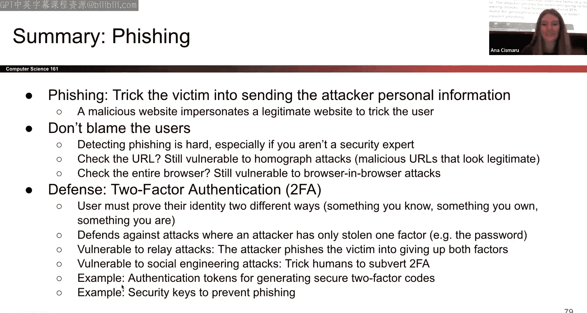

# UCB《计算机安全｜CS 161 Fall 2023 ｜ Computer Security at UC Berkeley》Calude-3.5翻译 p15 -15--CS161 FA23- Lecture 15 - XSS and UI Attacks.zh_en -BV1YGbceREDs_p15-

H。

includingncluding meeting patrols right everyone those in person and those on zoom so there's a 188 midterm happening today and as you know parent teaches both classes so he's preparing for that midterm and so Anna and I will be filling in and we'll go over XS so I'll go over XS and Anna will go over UI attacks。

Before we begin just a couple announcements。啊。Project two design documents are to this Friday there are no discussions this week that's because we just want the lecture content to catch up take the discussion content and so next week we'll go over excess and cookies I believe yeah in discussion Yeah so exercise then I guess UI taxes as well will come in next week。

嗯。We have so if you finished your design document and want to submit it you can go ahead and do so and then you can sign up for design reviews this week these are basically early design reviews the actual deadline for design documents is this Friday and then design reviews will begin next week and a majority of them will be held next week。

 but there are a couple slots or early design reviews。

 the only thing you have to I guess keep in mind is that the design you can't do multiple design reviews basically so if you choose to go for an early one unfortunately you can't sign up for the other one because we want to have space for all the students in the class。

All right， any questions before I get started？All right。Today we'll go over XSS and UI attacks。

 so just a little recap from what happened last week。

So we talked about cookies and we said that cookies are this。

Pce of data is basically like a byte string that is stored in the browser and it's set by the browser or it's set by the server it just depends on context and it has a bunch of attributes as you can see there and the cookie policy basically states that it states 0。

1 and it states 0。2。I won't read those out because I find it too cumbersome so i'll go over an example。

 so we say if you have a cookie which has the attributes a domain example do co and it has a path which is slash sum slash path those are in the cookie and its attributes and then you have this particular。

Servever with some sort of domain that you want to go to and let's say that URL is basically HttP and then you have fool example do co and some path and then index for HTML so what this kind of cookie policy says that。

A server with a certain domain can set a cookie with some sort of domain attribute if some sort of condition is met。

 and what are those conditions？The cookie domain should be a suffix of the servers domain。

So in this case， the cookies jumpm in is example。 co and the suffix is the ending part so the。

Server's domain should end between what the cookies domain is and in this case we can see that it does because the cookies domain is example。

com and then the actual server is food example so that's the ending part and then the second condition is that the cookies path attribute should be a prefix of the server's path attribute basically so in this case we see that the cookies path attribute is sum path and then。

The server starts off with some path， so as long as these two conditions match。

 then the server is able to set a cookie for that particular domain attribute。Any questions？

All right， and then now we'll go on a session authentication which uses cookies。

 so this is kind of like a a scenario where we say。

I access something for the first time I get a value from the server or from the browser and then I will store that in my browser anytime I want to access that particular piece of information again on that particular website or whatever I already have that particular value cached in my browser and so I just get easy access to it I don't need to sign in again。

ok嗯。Session tokens。 so session tokens are these things that。

arere given to you and you store them as a user if an attacker gets hold of your session token they can log in as you so that's a problem so these session tokens are randomly generated by the server and then they should also be just stored by the browser。

Okay。Then we also talked about CSRF， which is cross site request forgery。

We talked about this thing called same origin policy and how you can't access you know different things are not of the same origin and then we talked about。

We now talk about CSRFs which have this which have the ability to jump across different origins using cookies basically so if a user。

auuthenticates him to a server for like bank。com and then he has a cookie stored in his browser for corresponding to bank。

com， and then the attacker tries to trick the victim into making a malicious request to the server that corresponds to bank。

com， the server won't throw an error because it knows that like the browser will attach this cookie to the request and the server is that the cookie is valid and it just won't make a fuss about it。

So this is a kind of attack that can be done by some malicious user。

We'll go into examples of how these stuff can actually happen later on。

The major part of about all the attacks that we'll talk about today is that the vulnerable person has to go through some sort of action so the attacker in this case must trick the victim into creating either a get request or a post request a get request so basically like you click on the link you want some sort of information a post request is a server gives you back some sort of information that will display something to you or will cause some sort of harm to you。

And then we also talked about CSRF defenses， so a couple of defenses are the CSRF token it's basically like you know how we had the cookies。

 this is also some other byte string it's a value， it's provided by the server to the user and the user should attach that value every single time he sends a request to the server and that's the only way that the server is able to accept that request。

嗯。The referral header is another defense， which basically says we will only allow requests from the same site。

And these things are， you can think of them as things you can enable so you can set it to true or false and if you set it to true then you only allow stuff from the same site。

And then there's also the same side cookie attribute this basically means。

That the cookie is only set by the browser， actually by the server。

 only if the request has the same domain of the site that we're trying to access。

Does that make sense？If you have any questions， feel free to interrupt me。

And some of these are not implemented on all browsers just because of the complexity or just some sort of management issues that go behind it。

So today we'll talk about XS and theI text but that I'll come later so what is XS so it's basically crossite scripting and it in 2020 was rated as the most dangerous software weakness and in 2023 it remains in number two so it's still high up there。

So what is the same origin policy it relates to excessS in a certain way so we'll talk about it so two web pages have that have different origins should not be able to access each other if you have e。

com and you have bank。com they shouldn't be able to access each other because that would be a shame。

嗯。And in this case， well， that's the exact same example that I gave。

 but if you have some sort of JavaScript that's running on evil。com。

 that should not be able to access some sort of information that you have in your bank account。

And now what is JavaScript it's a programming language that's used to run code in your web browser it's used in most of the browsers to date so it's really popular JavaScript is known as client site so it's run on the users。

Browser， so it's not run on the server。 So this is a piece of code that can be embedded in H。

 for example， and then sent by the server to the client and then the client。Okay。

 so there's three words I'm using here client browser and server。

 I want you to think of the client as and the browser as the same entity and think of the server as the thing you're getting information from。

So。The server sends some sort of HTML to the browser and then when that's rendered and run。

 JavaScript is kind of if JavaScript is embedded in the HTML。

 it's run and its contents are displayed。And JavaScript is used to manipulate web pages and it's pretty common these days。

You don't need to know JavaScript syntax in this class。

 all you need to know are the most important functions that we talk about。In lecture and discussion。

 that could help you with your exploits。So。An example JavaScriptscript is given here。

 so this JavaScriptscript called happyappy birthday it creates an alert happy birthday and that's embedded inside HTML using the script tags so when when the browser loads this piece of HTML a pop up with happy birthday。

Will be generated as an alert。So。You've got this handler which basically takes some sort of request in from a URL or like parts of the URL and generates what you know needs to be done with those specific parts so if our URL for example is go to vulnerable do co and say hello question mark and the if you do a question mark whatever comes after it are the。

Arguments to the function that you want to execute。 So in this case。

 you want to run like the hello function and then。The parameters are the name and you want the name to be e bond So what happens is when this URL goes。

The handler gets called the name is treated as a string and then that's passed in after hello and the response is basically an HTML output which just says hello Ebo。

And if we go one step further， so that's the output。

 but if you go one step further and instead of just having Ebot have bold tags。

 that's how HTML bold tags work， whatever is displayed is the exact thing that's in name so when this gets rendered into the HTML when it gets put into the HTML and when this gets rendered you'll find out that Eboott is not bolded so。

After that， you have an example where we'll now say since we're able to have the bulk tag。

 which is an HTML thing， why can't we just have script text， right， it's also。😊。

A way to put JavaScript into HTML and so that's exactly what we'll do and that also gets rendered because the same item gets put into the name parameter when that's run we generate a pop up with an alert。

So this is a way for you to put JavaScript into your HTML。电。

and this also gets this is not just a string vulnerability。

 so percent S as a format specifier and that's just not only with that particular format specifiedifier also happens when you have HTML and you try to have a string in between with like a literal value。

So。Trorusst site scripting okay so the main idea behind this is that the attacker adds some sort of malicious JavaScript to a legitimate website that the user or the victim thinks you know is harmless。

 there are multiple ways that these attacks can happen， but there's two main types of them。

 one is stored excess and one is reflected excess。Stored excess is the name suggests。

 is basically stored。Somewhere so where is it stored。

 it's stored on the actual server and whenever a request is made to the server that JavaScriptscript embedded in the HTML is sent over to the browsers to be loaded。

So this is。As the last point says， stored access exploits this thing which is a server side vulnerability so we know that the servers weak is some loophole there and the attacker has managed to inject some sort of JavaScript into the HTML code there。

So an example I'll give is like Facebook pages， if I have a Facebook account and I embed some sort of JavaScript into my Facebook page。

 anyone who loads my page will make a request to the server。

 the server will find my Facebook page give them something to be able to render my Facebook page and then when they do so the JavaScript that's on it will also get run。

Yeah。This， again， like I said before， everything is。That any vulnerability means that。

The victim has to load certain stuff， so in this case the victim needs to load the page that that's been injected with the JavaScript and then we come down to the question of how do we do that？

So。Just going over the previous example， the attacker will inject mallitia script directly into bank dot com。

 The victim will request content from bank dot com。 The bank will send over mallitia script。

 The victim's browser will execute said mallitia script。

 which has that jascript thing embedded in it and then depending on what that jascript So so far we've just been talking about alert tags alert。

Arror messages， but there's much more nasty stuff you could do and。

An example is you could still the attacker could steal vulnerable valuable data from the victim and an example of that is the session tokens if you have the session token like you mentioned before。

 you can log in as a person and that would be bad。Another thing the attacker could do is then take this session token and make some sort of request to Bangkok。

So if the attacker decides the victim should transfer to me$100， then he'll just do that。She。

Now we'll go to reflected X。So reflected XS basically is that the attacker needs to make the victim input JavaScript into a particular request to a specific site。

And then what happens is whatever content is I guess output it is reflected in the browser。

 so whatever output comes from the server is reflected in the browser hence it's called reflected access so this means that when。

The victim makes a request to the server， there is no malicious content being sent by the server so the server is not the bad one in this case or the spoiled one it's the request that is spoiled so。

Reflective exercise basically means that you need to， the victim needs to make a request with。

Javascript injected into it。So how do we do this， there's multiple ways you could have， for example。

 an image and an image。In HTML has an image tag and it has a source。

 the source runs with a specific origin if you have the source being， for example， Google。

com and you pass in some sort of parameters and the parameters is as this example says a script alert tag then that would be an issue so you would click on this link you would basically go to Google。

com and then whatever you ask for in this case the script alert tag it kind of doesn't exist。

 but it'll be reflected back to you in whatever comes back from the server。So in this case。

 what happens is the attacker directly sends something to the victim， for example， a link some way。

So many attacks basically have to do with social engineering so these attacks are ways that you could make bad things happen。

 but how do get the attack to the specific person is social engineering so the attacker sends the victim some sort of malicious request or some sort of link that's bad the victim kicks on it and that。

Link is kind of。Polluted and so the victims。I guess accesses are all under control of the attacker so the victim will make some sort of request bank will。

Say or do what that particular request told it to do and then。

The browser will execute that sort of malicious script。

 and then the attacker is able to steal that data。And in the previous situation。

 he's also able to make malicious requests。So。The question is。

 how do we force a victim to make a request to a legitimate website？While we inject jascript into it。

 so one idea there's many and i've already given an example of having an image source where the source links you to some sort of legitimate website and then the thing you're asking is。

An alert tag and that's kind of what's going to be given back to you another thing is you could trick the victim to visiting the attackers's website。

 but then。You redirect to some sort of other malicious website。嗯。Any questions？

This kind of goes over two main things， stored exercise and reflective excess。

The main difference between them is where the exploits happen。So stored excess is。

Some sort of malicious JavaScript stored on the server。

 any normal request to the server by the browser will return corrupted information。

TheRelective XS basically says that。The victim makes a request to the browser where that particular URL itself is corrupted so it's asking for something that has some sort of JavaScript embedded into it how do we get this victim to create the link because surely you don't want to like sabotage yourself so how do we make the victim click on this link by sending them some sort of thing that looks like it's normal。

So CSRF and XS are not the same thing， so they're very similar to each other。In excess。

The HtTP response that's either being sent to this well。

 the HP response that comes back from the server or the HTP request that's being sent from the browser to the server and is I guess coming back as a response。

 both of those already have the JavaScript embedded in them。

And that just means that when the JavaScript comes back to the browser。

 it's executed and this sort of execution happens on the client side and so。

XS is executed on the client side， so that's like one major thing about XS。CSRFs， on the other hand。

You're basically taking an ACTP request， you're basically making an ACTB request to the server。

 but what you're doing is you're taking a cookie value and just passing that in and making sure that that cookie value is the same。

So CSRF relies on the fact that this person who you're trying to attack has a valid session that is active for some sort of thing that you're trying to manipulate。

Does that make sense？Any questions？One chat。I think there's also。Yes。

 that why is it safe across after return from the server。嗯。Could you repeat that？

I the but it's not right there， it's that。Yeah， so the question was that why is the client fine when clicking some sort of malicious link。

 but then after he gets a response from the server that's when something bad happens right okay？

The idea is that。嗯。Htm is basically rendered or executed in your browser upon like。

AReceivable of some information from the server。So youre if you're clicking on a link。

 what you're doing is you're making a get request to a server so you're saying。If， for example。

 it's a request to Google。com you're saying， oh hello Google I want said information and then it's going to say okay here is said information and that's some response that you get from the server and once you get that that's basically your HTML piece of information that you receive the browser says okay I got this piece of information I don't know what to do with it but I need to render it to see what it actually is and it will render that and upon rendering it JavaScript will be run and if the JavaScript script is some sort of alert tag that we've seen then itll just run with and then you'll see some alert there。

So。Until we get to like you know， discussion and until we talk about these in more depth。

 I will stick to the example of just alert because that's the simplest thing that you know you can visualize。

So。Let's just see this in action right we've talked about it in theory so what happened in 2021 when there's a student in 61C called Rohan he was just snooping around Calnet and he found a couple things so he found that when you log in Calnet there's a bunch of things that are stored or actually that are submitted when you're trying to log in so one of the fields are username is username。

Password and then the execution so what the execution is is basically a state。

 so it's the state of I guess it's it's a representative state of that particular user on the server side。

And then what would happen is that if this particular execution key was kind of you know wrong。

 it would display an error message and say， look， there's some internal service error and we're not able to process this and then if you look at the bottom it says badly formatted。

 flow execution key and then garbage value equals something right。

So the idea was that the server expected the execution to be in some specific format。

 it wasn't in that format and it just said， look， this is what I got and this is wrong。

 right like fix it。What if you mess around with execution？

So the execution key is placed into the error message and where is it placed in the HTML that's sent to the browser that's rendered and you see this。

You know， internal service error。Now， if we have badly formatted execution key and in codes。

 if we put some sort of malicious value。We possibly are able to have that executed right。

 so if the execution key was hello， then you would see that execution key hello would be returned。

So if that execution key was changed to a。Javascript embedded in HTML so you have a script tag。

 you have alert one and then you close the script tag， if that was the execution key。

 then that is exactly what you would see in place of like garbage value equals something。

When that is received on the browser side that gets run and then the JavaScript。

 whatever the JavaScript says to do will be done。And so。

One thing that we'll talk about on how to fix excess is escaping characters。

 but Calet at the time did not escape the execution key。

 so what you could do was change this value to whatever you want to and put it in terms of JavaScript。

And that would get embedded in the HTML and then that's it like whatever you want to be run will be run。

So here's one way to， well， this is exactly what I said， what you could do is。

So you could change execution， you could say the input with name execution would be this particular text and the text is basically the alert exercise kind of JavaScript tag and that gets rendered that gets run and you see an alert。

So what basically happened was Calnet did not sanitize its inputs properly so it didn't escape the characters which we'll talk about in a bit this would only happen if you click show me the error so it says here is an error that you received if you don't care you just close the browser if you do care then you say oh what is this error and you click on it then it will display whatever is being run。

嗯。And in this case， I talk about， you know， I again talk about alert one。

 but there's multiple things you can do， you can steal someone's credentials。

 basically you're running some sort of malicious code as them。

 that's the kind of idea that you kind of want to have when you're running these exploits。B。So。

If you're interested， the cause of this exploit is written there and you can take a look。

 it's just old software。What are some defenses that you could you know use to protect yourself against all these nasty cats so there's this thing called HTML sanitization certain characters。

 for example， when you start a script tag you have。You know。

 the crocodile bracketets and then you have script。If you see that。

 you can just get rid of it as the browser and then you just won't be able to render that particular page as JavaScript basically。

If you instead use Ampersand LT instead of the left opening bracket and if you use Ampersand quote instead of the actual quotation。

 then what you're essentially doing is you're escaping all these characters that are considered dangerous and so if you have JavaScript embedded into your HTML that just won't run as JavaScript。

So all these。Things are kind of safety measures that you're having on the browser side because the server can give you false information。

 you can send some sort of information to the server and get back some sort of JavaScript that will cause reflective excessS at the end of the day everything is being rendered on the side and so that's where you want to have your protections。

Another thing is don't try to reinvent the wheel， the wheel just have trusted libraries do this for you。

She。嗯。And then we'll go to escaping characters， so this is something that you could do as well。

Html do escape string on the name basically is a built in HTMLm function that will escape strings safely for you so just don't do it yourself that's the idea and if you send in this name which is this alert tag what it's going to do is going to escape all of these things and sanitize your input and what you get out is in place of the。

Less than sign you get ampersand LT， which is less than in place of the greater than sign you have ampersand GT which is greater than and so when this is being rendered。

 what you see in the URL and once youre see in the response are not the same in the URL。

 what you see is JavaScript in the response what you see is some weird thing that just won't be recognized as JavaScript and won't be run。

So。If a programmer basically has to take action for every single thing that could go wrong or every single possible exploit or character that could happen。

 a lot of things can go wrong just because of human factors。

 there's just too many possibilities for any human to consider。

So what happens nowadays is you have these HTML templates and what you can do with these HTML templates is just put whatever pieces of information you want and they will give you and it will escape these characters and sanitize your infants for you properly。

 so you don't have to go about doing them yourself。Even functions like HTML。 escape string。

 you have to write them in， so these templates will avoid that entire thing for you and just sanitize everything for you。

So this is an example of a go HTML HTMLl template where you pass in name or like dot name and then that parameter gets sanitized。

She。So， another。Yes， defense that you could use is content security policy so this is basically telling the browser again。

 this is a browser level。Defense system， you're basically telling the browser saying that， look。

 there are all these things that could go wrong， but I am only interested in hearing from these specific places and so I want to tell my browser that if I get any request or any source of any piece of information coming from a source that is not what I want to hear from。

 I would kind of ignore that。So it's kind of like blacklisting。

 or actually it's like white listing sites and saying these are the ones that I want to hear from and anything that's not in the set just ignoring。

Another thing you could do is disallow all inline scripts。

 so basically if you have any JavaScript that's encoded in HTML just。

You can't have that basically that's the point so disallow all those another thing is allow scripts from specific domains so if you。

Want something from Google。com and you think Googleogle。

com is safe then only allow scripts from there。And with this sort of domain specific approach。

 you can go as specified as you want so you can allow larger domains or you can allow sub domainomains only and stuff like that。

So these approaches also work with the contents of other things such as iframes and images。

 so for example， an image will always run and it will always load with the with the origin that the source specifies so if。

The source of Google。com， it'll think that， okay， this is fine。

 even if the request is being run from a malicious server or like a malicious webage。

So you'd want to kind of like sanitize all these inputs and just make sure that all of these are survey。

Again， what this means is that the browser is the only or like is the single entity that's used to mitigate all these。

Exploits and also enforce security so what you kind of want to do is have some sort of defense and depth so you just want to basically layer up like an onion and just like layer and layer and layer if something breaks then there's multiple layers they。

Any questions？All right， well that's about it for XS。

We'll move on to UI attacks and then I'll take feel free to kick a stretch break you know these lectures are along so。

Your walk you stand up for a minute while， I get the mic going。Youre to do so。こ。All right， hello。

 hello lit UI attacks so this section hopefully is going to be a bit more like。😊。

You might have seen this stuff before because this is like very prevalent in the real world so UI attacks what are they so in general we're basically trying to trick anc into taking some sort of malicious action right so so I mentioned a couple examples of how taking a malicious tricking a victim into taking a malicious action could lead to something like XS but it could lead to other things as well so sometimes we want to take advantage of our user interface so basically the trusted path between our user and our computer and we've talked about a lot of like web security things that kind of you know help protect us against a lot of attacks such as same origin policy but in UI attacks we're basically going to think more about like human factors and psychological tricks to trick our victim into performing some sort of actions so this is all about the security principle consider human factors。

😊，There are two types of UI attacks that we're going to talk about today so the first one is clickjacking and we're basically going to trick our victim into clicking onto something from the attacker and you know that might lead to excessS it might lead to something else and the other one which you might have seen in real world is fishing which is when we're trying to trick our victim into sending us some personal information so both of these are pretty relevant and hopefully that'll be fun to talk about today so what happens in clickjacking so our goal is to trick our victim into clicking on something from the attacker right and the mainnerability here is that you know。

Like the browser trusts the user the user usually is not malicious or there's no reason for the browser not to trust the user so the browsers basically had to do anything that the user tells it to do right so and the user clicks on something the browser will assume that the user intended to click on it so why do we even care about clickjacking so does anyone have any ideas as to like you know what could we do by stealing clicks from a user？

😊，No hands all right， or head over there。Yeah yeah so we could like I guess just make them do all these sorts of actions like a get request right so some examples aren't like oh we could trick them into downloading a malicious program right via get request could trick them to like like your Facebook page or your YouTube video if you know if you're really desperate for likes could trick them into deleting an online account and many more right as you mentioned like as long as we get them to do something by clicking we can do lots of actions and then another thing we can do as well as stealing keystrokes so does anyone have any ideas as to like why stealing keystrokes might be useful。

😊，Yeah exactly， so you can steal the passwords， you can steal credit card numbers。

 steal any other personal info， so yeah， lots of vulnerabilities and useful things we can steal as an attacker。

😊，So we're going to start by going through a bunch of examples of all these different web pages and kind of seeing what's going on so on this web page here could anyone tell me where the real download button is。

😊，Maybe if you guys like， I don't endorse this， but if you stream movies online， you might。

 you might recognize preachs like this。 or it's like click here to play the movie。

 You can't really tell， right， There's De buttons everywhere。

 So what happens if we click on the wrong one。 Well， you know， we might get。😊。

Some malicious program downloaded or we might accidentally like someone's YouTube video， etc。

 etc so that's kind of the premise of clickjacking and now we can go through like a more step by step example of how to set up a clickjacking problem so here we have the Berkeedduu page and we can see how we can't really see it too well because it's really title here but we can see that if you hover basically over this blue banner it redirects cloudfund。

 berkeley doedduu， which is where Berkeley generously asks you for some donations and you know as good students we love donating money right but maybe maybe you know we don't actually want to donate money and Berkeley is gonna to try to trick us into donating money let's kind of like take this example so how can Berkeley trick us students into donating money So step one let's load this Berkeleyedduu in an iframe so remember an iframe is a specific type of HTML and。

Basically what it does is it's going to create this like website great， essentially。But you know。

As a student I'm still going to see the strain I'm not gonna to click on it being like oh I don't want to donate today you I'm a poor student on top of that you know Berkeley as a school itself can't generate clicks on our behalf right because of same origin policy remember the frames are isolated so Berkeley is going to try to you know get us students to click on it somehow So how do they do that maybe they're gonna to make some really enticing content So they're gonna have this text here that's what the piece says saying you know you want to click here exclamation mark you really really enticing content and let's place it you know we can't really see it right now but it's still technically placed in our frame but it's placed underneath our frame sorry so now we still don't see our enticing content we still see the frame we're not really prone to clicking on anything right if we make our frame slightly more transparent so see how now the Berkeley content itself is getting。

more transparent right and sorry for those in the back I don't even know if people in the front can really see you can faintly see you know you want to click here show up right well we can make it even more transparent and now we for sure see you know you want to click here right and you can't really see theley Berkeley stuff anymore right so if you make it fully transparent。

Your Berkeley frame is still there it's just fully transparent so you know as a student you're told you know you want to click here maybe you know curiosity intrigues you you decide to click here and eventually you still end up clicking on that same Berkeley donation banner and you get redirected to this crowdfund Berkeley donation thing and then you know maybe you're going to be more prone to donating so that's how basically all those like download buttons work and like how how this clickjacking works is are basically coming up with some sort of variant on inserting an invisible frame and then overlaying that frame either on top or underneath or like kind of in between frames that actual users might want to click on。

So here we talked about how we can you know lay lay the legitimate site over a visible increasing content right so here you know the visible content as you know you want to click here the invisible thing is over it but it's invisible you could also do it differently so you could have the legitimate site be visible underneath malicious content so basically our victimss going to think they're clicking on some legitimate site but they're actually clicking on something illegit so for example the download buttons that we saw earlier like those illegal private streaming sites I think use that technique so here for example we might have our Berkeley Berkeley website and then we have this download X file that's like invisible so if you click anywhere in that general area of the Berkeley website you'd actually end up clicking on the download button。

And then variant three is basically laying the malicious content。

Partially on top of the site so you can change the appearance of the site without breaking same mortgage as the policy so what they did here is they actually took this Paypal page this Paypal page is legitimate but then they overlaid the amount of money that you're paying so the user you know if they're not super savvy may think they're just paying 15 cents right but we actually don't see whatever value is underneath that 15 cents so it could be you know $1000 instead of $15 cents which would be a pretty drastic change in payment price so。

That is， I guess the invisible frame side of clickjacking do we have any questions so far？No。

 awesome， let me check to dooo them also， no awesome okay。

So then let's go into another side of click tracking this one I find really funny but its it's still a problem so a temporal attacks basically JavaScript right is what we're using to run hit the that browser it can detect our position of our cursor and changed our website right before a user clicks onto something so basically we can kind of trick the user into like going towards something that they want to click on and change it really change the thing that they're clicking on really quickly before before they actually notice so the example here is like let's imagine you know we're trying to click on this click here button that we have and as you know as you oop。

😊，As we move our cursor to click here right as we're you know clicking on it the page changes and suddenly we're granting access to clickjacking to manage your contacts so this has done really really rapidly which is why like this example seems maybe a bit a bit silly when doing it on slide it's done really rapidly so you know users don't notice it and yeah it's kind of a silly problem right to have but。

😊，That's temporal attacks and then the other type of attack that we can see in regards to clickjacking is cursor joing so a CSS which is I guess the。

😊，Do you remember what ESS stands for in？No， that's X。

CSS is cascade style something CSS is about the style of your HTML like making it pretty someone can look up what the full full fact part it is but basically CSS you can use to change like how your HTMLl looks and make it look pretty and so you can actually change。

What your cursor looks like and since again JavaScript is able to kind of track a cursor's pre。

 we can basically change the appearance of our cursor and also create a fake cursor to trick the user into clicking onto things so in this example you know we have our fake cursor let's create a Q of CSS and maybe some JavaScript and here we have our real cursor that was made less visible due to you know due to the hacker trying to basically trick us into using using this fake cursor so in this example here basically we might be thinking that we're clicking on play now right because this fake cursor is hovering over play now but in reality our like cursor that's basically invisible is in fact hovering over this download that Xy file so when you press click you might be thinking that you're actually clicking on play now but in fact you're clicking on download this malicious file。

So that's cursor jocking it's yeah it's crazy what you can do with a bit of CSS and HTML and JavaScript but。

😊，There we go that's cursor jacking and so let's go into some defenses I don't know what happened to this slide let's just make all the text show up and make it like look less weird so how do we how do we defend against these clickjacking attacks so the first thing we can do is enforce visual integrity so basically make it really clear what is like just the browser web page versus what is like you know a system prompt so in Windows for example whenever you know windows is asking for permissions or trying to notify of some important change they're actually going to darken all of the screen and make this like pop up really bold so you can easily tell like okay this is Windows communicating to me via like the system control or the browser control。

😊，And everything else on this page is like not legitimate another way that browsers do this is Firefox actually。

 you know， decides to cross the boundary between an actual web page and I guess like the browser exterior to show that。

 you know， oh， this information like，Is not part of the web page only it's part of the like legitimate browser because I'm overlaying it slightly on that browser portion that you know webp pagess don't actually have control over so that's one way of protecting against clickjacking the other way is enforcing temporal integrity so for that example where you know the page changes really quickly before you press click Firefox the way it does that protects against that is that it actually as your popup pops up it disables this okay button until one second after the dialogue has been focused so since you have like that delay you know for sure that you know nothing is going change when you click on this because you have to wait one second to click okay so that's enforcing temporal integrity and then some other thing ways that you can prevent clickjacking or just requiring confirmation from the user so sometimes you know it's a bit。

a hassle but the browser could ask you to confirm that your click was intended。

 but you know from a user perspective it's not the most ideal another way you could defend against these RF frame busting techniques。

 so just forbid other websites from embedding iframes and basically that'll you know get rid of this invisible iframe attack that we talked about and we can also do that via content security policy so ESD as I was talking about earlier and it could also be enforced we don't talk about this too deeply but Xframe options which is in your HTTP header so。

That's click checking， what questions do we have about click checking？Or do we have questions at all？

No。Oh， oh yeah， trick try。No nothing in chat yeah， hopefully like this stuff is somewhat oh question。

Yes。Xframe options so I think from my understanding it's just like an HTTP header setting that you can set I don't know too much about it either because we don't cover it in this class。

 but I think it's like you set the value in the header it might be a boolean it might be some option like one two or three saying like oh if this is enabled。

 then don't let other websites embed iframes into my site。Yeah， yeah。

 and so we don't really cover it aside from I guess what it does at a high level。

 so don't worry too much about it。Other questions？Yeah but yeah hopefully this stuff is like somewhat like intuitive since you know you might have encountered it before all right so fishing fishing is another big UI attack that we see these days so let's assume you know that how we get this email saying like hello your account's going to be closed please update your information here and click on click on confirm my account now。

😊，But as we click on confirm my account now， again。

 sorry that the text is tiny it says if we have around this， it says take us to universalkids。com。br。

php right universalkids。com doesn't seem like what this Paypal link should redirect us to right something seems a bit suspicious there。

So let's assume like hey okay well I didn't notice that this redirect was a bit suspicious I decided to click on this now it's asking me to enter my email it's asking me to enter my password I'm going to keep doing that wow it's asking me for all this information my first name last name date of birth address mobile number all this information credit card information yeah sure I trust Paypal i'm just going keep adding all this information right but in reality since。

This is the official Paypal page we see how the official Paypal page right has Payalcom at the top well this page has eventxi。

com at the top so I just went through this whole process of you know giving out my information to who I thought was Paypal but in reality was just like some attacker so that's the premise of phing tricking a victim into sending your personal information and the main vulnerability here is that people are you know not tech savvy you guys are in the right place because you're gonna you're learning about this right and we're at Berkeley and you know they teach us about this anyways but some people don't know too much about phishing attacks right so they have trouble distinguishing between what's a real website and what's a fake website。

😊，So how can we like protect against phish or do we think if we check the URL， is that sufficient？

Feel free to like nod your head yes or no， does checking the URLL seems sufficient to y'all。

All right， so we think this is real okay so checking the URL in this example you know it could work but because like this looks like a real website it says pnc。

com sweup right this says PNC here on the image so it seems like you know there's an alignment there but you know we don't really know that pnc。

com is a legitimate website does anyone know has anyone heard of pnc as a company。Y does it exist。

 I saw someone raise their hand。 Yeah， okay， maybe it does exist， but okay。

Po point is I at least haven't heard of Pnc。com and as an attacker I could like try to register you know some website and just make it look really official and like try to trick people into sending information I guess PncC is a real example but what about here Apple。

com maybe maybe this one's a more familiar example people know Apple right so is this a real apple apple URL what do we think？

sych so these letters are basically cyreic alphabet letters that do not actually correspond to the Latin alphabet。

 so if you're really really evil you could come up with this fake don domain name which visually looks exactly like Apple。

com but。😊，It's not so it's really， really heinous but it's something that people do and it's something to be aware of So this is basically the premise of hograph attacks so we're creating malicious URLs that look similar to legitimate URLs so like if you think of hographs from a like English perspective you can think of like oh I can't bear to be without pancakes and oh we are the golden bears yay so like same same word but different meanings that's basically what we're doing in essence here as an attacker and yeah it's a bit sad I guess it makes you lose hope sometimes that like oh even even checking the URL is insufficient so okay maybe checking the URL is insufficient so what if we like check everything you know this browser what do we think does this browser look legit。

😊，Yeah。😊，I'm sorry I'm sorry to break your hope here so this browser was actually a browser inside of this bigger browser and they basically modified the CSS and HTML could basically trick you into thinking that this is the legitimate browser and in fact it's a browser inside a browser and right now this is just a frame that's part of a attackcker。

com so you might be thinking wow， I'm in Bank of the West let me put all my credit card information and all my personal details and in fact you're just still giving it to attackcker。

com。😊，I will say these are extremes， I don't think。

That you know don't lose hope in humanity and in computer security just yet。

 but they exist so this is a browser and browser attacks so we're basically simulating the entire web browser with JavaScriptscript but again you know these are these are really。

😊，Terrible things to do as an attacker and most users are not like you guys not security experts so you know don't don't blame yourselves if you fall for one of these more complex phishing scams on top of that you know attacks are not common are not common so people try to see the best side of things and don't suspect malicious action and detecting fishing can be really hard as we just saw right so luckily for us you know most。

I guess of the tech world tries to like train train users to be aware of phishing so maybe you guys have seen example emails like that coming from Berkeley these emails sometimes are actually phing tests to see if you will click on the email and fall for the scam and sometimes Berkeley or maybe if you've had this your other internships or jobs you'll get an email from IT being like hey I've seen you fall into our you've fall in for our phishing scam here here are some resources to learn more about ph and then hopefully you don't fall for it again so you know society is trying to train everyone to be more aware of fishing。

But okay， let me pause here questions about all this fishing stuff。No， well。

 how how are we on time Oh we're great on time Okay， so yeah， so let's talk about， okay， how can we。

😊，Protect maybe against some of this fishing maybe against some of the click backing so with fishing right the problem is is that we're allowing attackers to learn all this sensitive data so for example passwords I think passwords is probably the most common ones it's usually it's like step one into your authentication process so if two factor authentication probably everyone here has duo mobile I think it's a requirement for Berkeley。

But the idea is you require more than one password to log in right so you have to prove your identity in multiple ways before authenticating and there's three ways you can do that so first you know get input something you know like a password a security question。

And then you can use something you have so a phone I think that's how duo mobile works for most of us right we have the app on our phone。

 we type our password， they ask us so can you like confirm on your phone and then we're logged into Calalnet right you can also have a security key and we'll talk about that in upset and then you could also confirm it via something something you are intrinsically right so a fingerprint face ID some of Apple's functionality I think has some like twofactor authentication with face ID so even if you end up stealing one of these three things right they don't have access to the second factor and usually it's easy to steal like a password or a security question right because of databasebased breaches but it's a bit harder to steal something physical and then it's super hard to steal something like that's I guess intrinsic to your own body right so that's how we use twofactor authentication and defend also against other attacks where a user's password is compromise。

Right so for example， if we take an attacker thats stole a password file and decides to perform a dictionary attack。

 if our user reuses passwords on multiple websites。

 which hopefully everyone now knows not to do if you know an attacker is able to compromise one website and then try to reuse that password on some other website if twofactor authentication the attacker is basically like not able to like take a password that they found from one website and try it out on all these other websites right and that's an extra layer of protection there。

So that's about two factor authentication and why it's great。😊，Unfortunately。

 since this is a security class， I'll talk about how we can also。

Not how we can subvert it and how it's not great so one way you could do it is yeah relay attack so we're basically going try to steal both factors of authentication in one single go in one single phishing attack so for example I'm going first convince the user to send me okay let's do it like this yeah so we have two factors the password and a code sent to the user's phone so what can we do as an attacker first let's ask the user to input their password then we're gonna immediately on the I guess back in on the attacker side try to log into an actual website as a user and then the actual website right is going return a code to the user saying hey your authentication code is one two34 and so then our phishing website will ask our user to enter the code the user will enter the code into the phishing website and then we as the attacker can enter it into the legitimate website so maybe maybe a diagram explains it better。

😊，Right so we'll say hey login the victim gives us the password。

 we go really quickly to Google put in that password Google then says hey this is your two factor authentication code we also say enter the security code right because the victim doesn't know that it's talking to not talking to Google it's only talking to us right and so then the victim will give us the code and really quickly will go to Google and enter that code。

😊，And then we're logged in to Google as the victim。Makes sense。Cool， yeah， so。

That was one way of subverting two factor so a lot of these two factor the two factor schemes right they work via one time code to phone number so there's other ways you can subvert it via social engineering so for one。

😊，An attacker can call your phone provider and tell them to。

Activate the SIim card so that basically like they receive your text which is very very outlandish but it can happen right so the moral of the story is like SMS is very practical I think like most applications days use SMS for two factor authentication but theres still ways to subvert it they can also just attackers can call your like phone provider customer support or like the company's customer support and ask them to deactivate to factor authentication on your behalf but you know hopefully if it's a legitimate company and they're doing their job well they'll ask you to validate your identity before you do that so that hacker might fail at this task but yeah basically moral of the story is to factor authentication is pretty good I think all these apps that we have or all these security keys that we'll talk about in just a sec are really cool SMS is useful but has some downsize question。

あたるてます。So I think there's like ways to simulate like phone numbers I'm like not super sure but I think there's ways to like basically like have one SIim card associated with multiple phone numbers if I understand correctly so they basically again trick them being into like hey use this SIim card for this phone number as well or actually they might yeah they might just take over they could call the phone provider and say hey like I got a new SIim card but this is like my old phone number that I want to keep can you transfer it over to here I think that yeah that's probably more I think that's the correct correct answer there yeah but it's like very extra of them but I guess if people if attackers are really desperate right they will go through this process。

Cool okay， so another example of two factor authentication authentication tokens so this is going to be a physical device that generates second factor authentication codes so an example of this is RA secure ID or Google authenticator so how does this work。

😊，So our token and the server we're trying to authenticate to are going to share a common secret keyK and when we want to log in the token is going to generate an HMac using our secret key and the time the time is going to be truncated for usability purposes the code might also be truncated so there's some we go room there but basically our user is going to submit the code to the website and this website is going to use the secret key to also verify that HM right so hopefully HMac is something we feel comfortable and familiar with。

And we can see how basically yeah this process we're able to ensure some authenticity right one drawback is that we could again have vulnerabilities to relay attacks like we did I guess a couple slides ago and then it could also be vulnerable to online brute force attacks right if since all these values get truncated it reduces I guess the scope of our brute forcing but this is the type of tool that maybe you have used if youve ever had like an internship and they give you like a corporate laptop of like the UB key that's that's exactly that type of tool so you're trying to like authenticate to like the company server specifically。

And yeah， I guess one way to deal with online root taxes is to add a timeout to like。

 I guess reduce how long you can try to root force but。

Another thing you can do or use instead of a token is a security key so a security key is going to be designed to defend against phishing as well。

 it's also something that you use and basically when you sign up for a website the security key is going to generate some public private key pair and it's going to give the public key to the website and you're going to keep that private key on your physical device so when you want to log in the server is going to send some nos to the security key the security key is going to sign the nos web with the。

It's going to sign though not the website name and the key ID and then give the signature to the server right and since it's a public private key pair right the server can then verify that the signature matches up with what it expects to be so that's one way of ensuring authenticity and that's going to be very useful for a phishing attack because in the phishing attack right the security key is going to generate a signature with the attacker's website name and not a legitimate website name so the attacker can no longer I guess use this security key output on a legitimate website right because there's going to be a mismatch between the attacker's website name and the legitimate website name。

So。That is good because it solves the really attack problem that we were talking about earlier。

So that's all the two factor authentication stuff I had to talk about。

 do we have any questions about two factor？No okay and let's do a quick summary of everything we've seen today so we talked about XS right and in XS we're basically able to insert some untrusted content into our HTML so there's two types of XS right stored XS is actually going be stored in the server it might be some example as we see up here where we have HTML and then we insert some script here a very common example is if we have a post on social media with ja we can then I guess modify the ja that's stored on this social media site and then get some malicious action done we also have reflected XS so reflected XSS is going to cause us to input JavaScript into a specific request。

😊，And so that's usually done in via a URL and for example。

 the classic example we talked about here is if you have a link for a search engine for a search engine query with JavaScript。

 you can modify that link and insert some script in the actual link to execute the malicious script。

 but the only requirement that you have reflected XS is that you actually need to trick the victim onto clicking on the link with JavaScript while installed XS。

 it just kind of occurs as you load the page so you don't actually need to trick the victim into clicking on any links。

Then we talked about excessS defenses， so we have HTML sanitization right to basically like sanitize all these HTML script tags and we also talked about content security policy so basically limiting where we can load resources from。

Then we also talked about UI attacks and we talked about clickjacking where we're essentially trying to trick the victim into clicking on something from the attacker and we've talked about different ways of doing clickjacking so fake download buttons。

 invisible frames and attacks， cursor jocking and all their defenses so visual integrity andor integrity。

 user confirmation and frame busting and we also talked about phishing so here we're going trick an attack victim into sending some personal information and the premise is that sometimes it's really hard to I guess detect phishing attacks so don't be too harsh on yourself self follow one but there are ways to defend against phishing namely two factor authentication so you want to use two different ways of proving your identity。

 the best ones are to use security keys or authentication tokens。

 but if you know you're using some less sensitive data you could also use twofactor essay。

S codes or applications。So that's all I have or all we have do you guys have any last questions？No。

 okay， awesome， thanks guys。Al like we should stop the reporting all right。

Let's see thanks everyone on Zoom。😊。