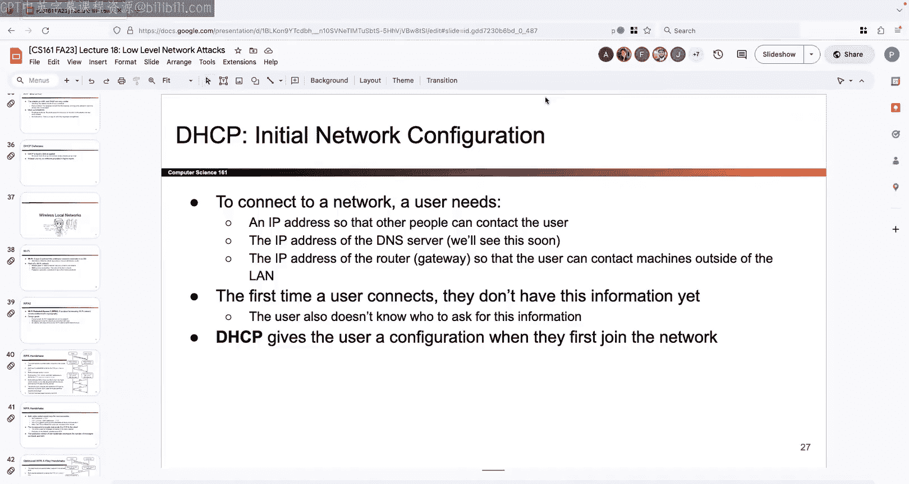

# UCB《计算机安全｜CS 161 Fall 2023 ｜ Computer Security at UC Berkeley》Calude-3.5翻译 p17 -17--CS161 FA23- Lecture 17 - Intro to Networking.zh_en -BV1YGbceREDs_p17-

诶我。啊。We are deep in project too， I hope so I'm going to try something new I've never done this before。

 but since we're all here we're all friends we'll see how it goes so there are a couple of things in the Project two spec like I know it's a long spec there's a lot of different moving parts and honestly even reading through it once isn't always going help me get all the inricacities of it reading through it twice might not help you have to go through it and just like internalize it so I figured maybe what I could do is。

Like point out a couple really common things that everybody always misses on the spec throughout the next couple weeks so this way like you heard her from me it's in the specquiz it's in the spec we talked about it in like discussion so。

You know fingersing crosseds that we don't mess it up because these are little things that are maybe a little bit counterintuitive but they can make a big difference on your design。

 so the one that I want to bring up today and I have more for you in the coming weeks is that when somebody calls accept invitation they are allowed to change the file name like it's not entirely intuitive but if you look at the definition of accept invitation it takes in one the username of the person who sent the file okay the invitation pointcho which tells you aware on the datastore you put the invitation or whatever it is the recipient needs to access the file but like look at this third argument this file name argument allows the person who receives the file to rename it to anything they want so when the recipient receives the file they can put in any file name here it does not have to match what the send originally called it and now two different people could be referring to the same file using different file names like everyone messeses up every semester and we tell。

and they're like， oh okay and I have to go back and change my design and I feel really bad so you've heard it from me now you'll hear it in your designer reviews if you mess it up so now you know it's also here in this example you see that evanbaugh called this thing foods do Txt shared it with someone else and then when codebo received it codeba named snack。

txt that's okay now they both refer to the same file using different file that's allowed you have to support that。

Okay， all good now that you've heard it， we're never making this mistake again， right。

 heavens every semester， okay， fingers crossed。Okay。

 anything else you want to know about project too before I start talking about。Actual content。

 not their project to is an actual content， but it was unplanned。Okay。Let's talk about networking。

Okay so we are done with Webbb Finally， we are now three units down we finished memory safety。

 cryptography web the SQL injection and captures and we're finally starting the fourth unit。

 which is all about networking So just like how do you remember the first web lecture was all about the introduction to Web and we didn't talk about attacks the first networking or not the first networking lecture that's today the first cryptography lecture was all about definitions and we didn't necessarily talk about attacks and then way back the first memory safety lecture was all about X86 is well you get one more of those today it's your fourth and final one where we're just gonna to give you a really whirlwind quick tour of networking and what the whole picture is like at a high level and then we'll spend the next couple of weeks digging in to specific parts of the networking protocols and talking about attacks but today is your high level you weren't able to take 168 so you watch this lecture intro to networking and if you're a total expert at all these protocols maybe todayll be a little bit boring but maybe you'll learn something new that's the plan for today。

So we will start off with what's the Internet just like the what's the web slide and what is cryptography Here is your one slide introduction to what the internet is so you've actually already seen it when we talked about web we talked about how the browser and the server have to somehow be able to send data between each other but we didn't actually tell you how that happens we just said well somehow my computer can just send data to the computer in Soto hall's basement but how does that communication actually happen that's what the internet is that's when we have to break down so we need to break down how are these machines connected how do they talk to each other what protocols do they follow what sets of rules do they follow and what are some attacks that can happen over the Internet so that's what the internet is and that's what distinguishes it from the web you can think of the web as the data that's being sent between browsers and servers and the internet is how that data get sent it's the connections between the computers and the protocols that tell us how these computers talk to each other okay。

And protocols， you've seen this word too and we talked about HtTP， I even showed you this example。

 So protocol is a fancy way of saying both sides need to agree on a way to communicate。

 So for example， if I would like to send some HtTP packet to the server。

 we need to send it in this really specific format where like there's a get or a post type and then there's like a header with certain information and then there's the data。

 there's the URL， whatever there's this very specific format that we format all of our request in and the server formats all of its responses in a very specific format。

 this way when both sides send and receive information。

 even if then information to bunchial ones and zeros， they both understand what's being said。

 that's what the protocol is it's a set of rules that we agree on so that when we talk to each other we know exactly。

What we need even if the data that we send ends up being ultimately serialized into a bunch of ones and zeros and we showed you the example of like like you and I could have a protocol where if you want to ask a question like you know you raise your hand that's the rule that we agree on we could agree on different rules like if you decide that actually the way that you like ask a question is like you like wave a flag or something that's cool that would be a different protocol but the important thing is that we both agree on the protocol so that we both know how to talk to each other okay。

Great so as we talk about the internet and like why it works I'm going to repeatedly draw an analogy to something that I think has really cool deep similarities to the internet。

 but maybe you've never heard of it， it's called the postal system remember this thing like you can send mail from point A to point B so I guess nowadays is like super obsolete but the postal system has a bunch of great analogies to the internet so we're going to use it over and over again and so if you think about like fundamentally why does the Internet even exist the fundamental goal is I have data on computer A and I would like that data to go to like computer B sitting somewhere else in the world or in some other room So the ultimate question is just how do I get that data from point A to point B that's what the internet is going to try and solve and if you think about what is the postal system solve it kind of solves the same problem I have a letter and I want to send it to my friend but my friends all the way on the other side of the world So how do I send this message for me to my friend that's what the postal system is going to solve as well so。

These have pretty deep analogies like we're not gonna quie you on how the postal system works but we're gonna use it as sort of the analogy Okay so the first building block we need to make any of this stuff work Postal system internet。

 there has to be some way to move data from point a to point B So there has to be some sort of physical structure or some physical building block that can take data from one location and like physically transported to another location。

 there are all sorts of different ways you can do this So if you think about the mail analogy this could be like a mail man well like a bag of mail and they like carry it over it could be know like a delivery man with like a vehicle and the car has a bunch of letters loaded into it if you think like old school。

 they have like the pony express where they have know this like renegade person or whatever would carry the letters and like just write the pony across the Wild West or whatever you can use a carrier pigeons and anyone know what these are like you have the pigeon is really smart you tie a letter to the pigeon and like flies to his destination There's all sorts of different。

Real life ways that I can move information from point A to point B but you have to pick one So this is your first building block choices。

 which of these do I pick Do I want the mailman who has like a bag of mail and carries it over do I want person driving the car with a bunch of mail inside Do I want the person on the pony Do I want the pigeon It's up to you like philosophical question for you is if I have a pigeon and I like tie a really really big USB drive I that faster than the internet I don't know open question so that's what the physical analogy looks like。

 but of course when I'm building the Internet you cannot use pigeons to build the internet or I guess you can but you'd have to worry about raptorors according to Wikipedia okay so instead we're gonna to have to come up with some other sort of physical like electrical engineering solution to moving data from point A to point B and we're not gonna to talk about this in detail but this is the building block that we need So it could be something like wires I could use a wire to connect my computer to my friend's computer and。

Somehow like the voltage levels on the wires determine the ones and zeros that get sent。

 there's also wireless technology where maybe our computers don't have to be connected by a wire。

 but we can send I don't know like certain frequencies of radio waves and that's going to cause information to go from point A to point B there's all these different sorts of like physical engineering solutions but all of them have the building block that all of them provide to us the building block that it allows us to move data from point A to point B but there's a choice plug what you want to which of these you want to use that's up to you but you have to pick one it's not one that we're going to talk about in detail but ultimately that's our first building block it lets us take a bunch of zeros and ones and transports them to some other location using a wire using radio waves using pigeons whatever you like right okay。

So what do we do with this building block， I now have a building block that says I can take two computers in the world and like hook them up。

 Okay that's really cool。 but how am I going to organize this so you can imagine I could stop at this point and just say well I have the building block lets me send ones and zeros anywhere I want So I'm just going take every computer in the world I just hook them all of using the same like set of wires or using the same wireless protocol you can do that but that would be really complicated。

 there's no organization everyone's computers are connected to everyone else's you can imagine it's gonna be a whole mess instead we're gonna try to build this up incrementally to get something that's a little bit more organized than just saying。

 oh yeah， everyone in the world's connected to everyone else。

 So the first thing I'm gonna to do is I'm gonna take my building block And instead of connecting everyone in the world with it。

 So here I've chosen to use wires but you could have chosen some wireless protocol So if I choose to use wires instead of taking one really long wire and like connecting everyone's computers with a really long wire which doesn't sound like a fun time I'm instead going take everyone within。

some local scope and connect all of those up so for example I could take everyone's computers within like the Berkeley network and connect them all up or I can take everyone's computers within my home Wi-fi network and connect those up and if I do that from a computer standpoint I get something called a local area network that's your first vocabulary for the day so it's a term for all the computers that are connected using this little building block within some local physically nearby area。

If you think about what the analogy would be in mail， the analogy that I can think of is。

 well it'd be kind of annoying if I just ask my you know like trustee carrier pigeon to fly like anywhere in the world my pigeon would probably like fall over dead before it gets that far instead I'm going instead use my building block to just connect everyone nearby so maybe like I live in an apartment complex and I have everyone in my apartment complex was nearby and we'll connect all of our apartment complexes or our apartments I guess in the complex together so we get this little local network where everyone can talk to everyone else so within this network anybody in the apartment complex can talk to anybody else anybody within the local network can talk to anybody else we haven't extended this to the whole world yet。

 but this is gonna to be our building block that we're going to use to extend this to the rest of the world okay。

So that's great we got the apartment complex now everyone within some local scope can talk to each other。

 but that's not our goal our goal is to get the entire world connected so how do I do that so I have a couple of choices so one choice I could say is maybe I have two different apartment complexes and so what I could do is I could somehow connect them all up together so if I'm using some sort of wire I could draw a wire between like every pair of these houses but that would be a lot of wires and it'd be kind of annoying So instead I'm going to abstract away the fact that I've already used this local building block to give me a set of apartment complexes connected together and another set of apartments in a complex connected together and instead of drawing all the like cross wireres between them I'm going to connect them using a single wire and through something like a post office people been to post offices lately I don't know outdated like but if you use a post office what's really nice is that instead of me having to connect every house on the left side to every house on the right side。

I can just connect all the houses on the left side to the post office and then the post office can connect to all the houses on the right side which is kind of nice and so if you do this you get something called a wide area network because I'm taking all these little building blocks the local networks and I'm piecing them together into a wider network okay so that's maybe how you think of it in like apartment complex post office terms if you want to think about this in computer terms what we're doing is we're taking two different local networks and we're connecting them together using well this is going to be a router as you'll see probably on one slide okay。

Great， so。That's how we connect together multiple local apartment complexes instead of using a wire to connect every single house together。

 we can use one post office to connect both of them together okay and again。

 this is an analogy so you don't have to take it to heart maybe you're like oh I don't think this is how post offices work it's okay it's an analogy and so ultimately my goal is with enough post offices and enough of these little local networks I can build up this huge network of networks where all of these little apartment complexes in the world they all get connected together in the world using a big series of post offices and if I do that I ultimately get what's called the internet or I guess the analogy version of the internet So sometimes people like to call the internet a network of networks why do they call it that because within one of these little red squares I have an apartment complex and everyone inside there is connected using a local network and then all of these local networks get hooked up using post offices to create a global like worldwide wide network。

That's why they call it a network of networks I have all these little networks that are local and then I can connect them all up to form a really big network using these post offices that connect them all together okay so that's one observation iss sometimes those people call these a network of networks the second observation is that if I want to send okay so suppose I am the color okay I am this person I live in this little house here and I would like to send a letter to my friend who lives over here and so one thing you might notice is that we're not in the same local network so there is no wire directly connecting us I could have built this differently I could have built it so that there are wires connecting every single house but that's kind of annoying so instead。

How do I get my letter from me in the top left to my friend in the top right Well I'm gonna to have to send it across multiple hops so I have to send it to this post office and then this post office might forward it to you know like this post office which might forward it to this post office which finally would forward it to my friend or something so sometimes my letter might have to hop through multiple post offices on its way to the destination it might not be the case that I have a direct line of communication to the person I want to talk to sometimes the way that this network is built that message is gonna have to pass through a bunch of different post offices and get route it through all of these little post offices before it finally finds this destination it's just the way that we built this network。

Okay。So it's kind of an analogy but one powerful idea that's already appeared。

 even though I haven't really told you how any of this stuffs implemented yet is there were all these layers of abstraction that have appeared。

 so hopefully from 61 ABC， whatever prerequisites this idea of abstraction layers is kind of familiar like it's already been burn into your brain but if not what's really great about this layers of abstraction is that it allows us to build a really complicated system like you can imagine as we get to the whole world being connected。

 these things can get really complicated from an engineering standpoint but what's really great about the layers of abstraction is that we're starting with these small pieces like oh here's a wire it connect two houses together and then I use that as a building block for layer too hook up all these little local apartment complexes and then I use that as a building block for my higher layer where I connect all the local networks together and what's great about this is that once I have these layers of abstraction if I'm thinking about one layer of abstraction I don't have to。

about all the other layers below it or above it like that's really great So for example。

 if I am like the post office manager and my job is to figure out how to route messages from point A to point B so like my job is to figure out okay from this house to this house which set of post offices should the message bounce through well when I'm thinking at this level3 internet layer I don't have to worry about things like oh is the pony going to get to destination or who's going train the pigeon I don't have to worry about that stuff that's all abstracted away from me because that's in a layer of abstraction below me so if I'm thinking at this layer of abstraction layer3 and I'm thinking about how do these local networks connect together I don't have to worry about how layer one implemented that's someone else's problem who trains the pigeons how do the mailman know where to go that's someone else's problem I just have to worry about my layer where I think about how these local networks connect together and if someone changes layer one like some engineer comes along someday and says you know what like pigeons theres。

So 1940s I want to start using like Falcons or something that's great it doesn't matter for us because we're thinking at a higher layer of abstraction。

 we only have to worry about we're at layer two， the links that are created by these birds we're at layer three。

 how do we link up all these local networks together the person doing all the engineering changes at level one they don't affect us they're at the lower layer of abstraction。

 so that's the beauty of these layers of abstraction not only does it let us build something really big by using all these smaller building blocks hierarchically but it also lets us not think about other layers of abstraction。

 we just worry about our layer。And the services provided by the layers below us。

 we don't have to worry about how the people below us are implementing stuff are they using pigeons are they using radio waves it's kind of not my problem okay so it's a beautiful idea comes up all the time in computer science and it comes up here in the internet too。

Okay so all of this was pretty high level you know like we're thinking about pigeons and Falcons so now I'm going to actually try and nail down a little bit what the networking model actually looks like。

 so I'll show you something called the OSi model， I guess before I do that I'll give you one more analogy so if you don't like the mail analogy like that's okay here's another analogy where we use like your computer which is also built on levels of abstraction so for example。

 when you write code， I don't know about you but like when I write code I'm not thinking about things like oh how does this code going affect like the voltage level on my computer I'm not thinking about that because that's too far away from a layers of abstraction standpoint so when I'm writing code I'm not thinking about oh but when I run this line of code it's gonna to cause this circuit to like flip from an on switch to an off switch whatever that's too low of a layer of abstraction of thinking so instead when I write code I don't have to worry about that because instead I only have to worry about the code that I write and the code that I write。

Relies on or can use services provided by like the operating system and then the operating system can rely on services provided by like the device like keyboard or the underlying circuits and then those circuits can rely on physical properties like the voltage levels so even on your computer you have these layers of abstraction and if someone decides to go into my computer and says well actually you're no longer using I don't know you're no longer using the X86 chip you're using the M1 chip well that's okay right like at a higher layer higher level of abstraction the code that I write still work okay so if you don't like the mail analogy there's another analogy again I going to test you on the analogy but it's good to get some understanding okay。

So here's the model you have to know you don't have to know the acronym but it's called the OSA model so I guess the first thing I will say is like fair warning。

 this model is really old's from like the 1970s so I don't know this is outdated lecture slide or just simply outdated model so it's from the 1970s which means that there are some things in this model that are just obsolete so their first question when you see this might be like where the heck did 5 and6 go。

 they've been obsoleteted so why the heck we show you this because even though it's kind of an old model nowadays some of these layers are a little bit more fuzzy so not every protocol we see will be cleanly separated into one of these layers it's still a really nice way to get introduced to what the network looks like so don't go out and like treat this as gospel and say well every single protocol has to be part of one of these five categories because in real life sometimes the boundaries between these kind of blurred but at a very high level of we're just thinking philosophically。

about how the network is designed this is a good starting point okay so in the same way that when we talked about web you don't want to go out and start thinking like every single website is built the same way well same thing for all the networking protocols there are all sorts of complicated protocols that live between these layers but this is what we're going to use as a starting point for today like I told you is a Worldwin okay so let's do it。

So we start at the bottom start at the top two but I'll start at the bottom okay so at each layer we're going to think about what does this layer provide us a service to the higher layers and what does this layer rely on from the lower layers of abstraction so just like before if we were at layer2 we were thinking about the apartment complexes we were able to rely on someone below us already solving the problem of moving data so I was the person designing the apartment complex I don't have to worry about how data get sent someone has already trained the pigeons or figured out the mailmen and the ponies for me。

 I don't have to worry about that's a service from a lower layer that's been provided by me and similarly if I'm working on the apartment complex I don't have to think about oh but how is this going to work when I connect up the whole world at someone else's problem I just have to be able to provide an interface or some service that someone above me can use so we start at layer one is' the lowest layer so all that this layer is going to provide as an interface for other people。

Love is a way to send bits from point a to point B like that's it and we talked about this already it can be like voltage levels it can be like radio waves there's all sorts of protocols that live here we're not going to talk about them。

 but this is where like the hardware engineering level of like。

Things happen okay clearly I am not an expert， but this is where all the engineering stuff happens so that data can go from point A to point B and because we're at the lowest layer。

 we don't rely on any services below us， but now anybody above us can simply assume that this is done So you'll notice like yeah I'm kind of know I'm kind of adult。

 I don't know what any of this stuff means， but that's okay I can still use the internet because I don't have to know exactly how this stuff works。

 I just have to know that ultimately this layer， whoever is building it。

 the genius is over in the E side they have guaranteed to me that there is a way to send bits from point A to point B and that's all I need I don't have to know exactly how this stuff works if someone wants to come in and change how this stuff is implemented it doesn't affect me and that's the beauty of abstraction it allows me to be stupid I not know about what this layer one is doing and still be able to implement things at higher layers it's beautiful So this layer what does it give me in like cartoon format it gives me a way to send zeros and ones between two different physical。

That's it，Great， so let's keep going we go one layer up now we start thinking about the link layer so。

Again， the link layer is going to do something is going to provide a service to everyone above me so whoever is working at the link layer。

 they're gonna to figure this stuff out and then everybody above them doesn't have to worry about it。

 they can simply trust that the person at layer2 has taken care of it for them that's the beauty of abstraction so the link layer is going to provide some way to send data from one device to another and connect up all the devices within a local network so it's kind of similar to what we already saw from earlier this is going to allow us to take all the computers within a local network and connect them all together so that everyone within this local network can talk to each other all of this is taken care of by whoever is working at layer2 the person at layer2 doesn't have to think about layer one level stuff they can just assume that the building block of sending bits from point A to point B exists and their job is just to hook up all the computers within the local network and then anybody above can now assume that this local network exists and the person at layer2 has already taking care。

Okay so here's what it might look like pictorially we already talked about the term local network and what is the local network it's all these computers within a local area and if you need like a physical analogy you can think of like all the computers on the Berkeley network or all the computers on your home Wifi network and somehow they're all connected to each other using wires using wireless using whatever the layer one person thought up I don't care is blowy as a layer of abstraction。

Okay so yeah this kind of works okay and so what I can do with this is I can now start sending messages and thinking of protocols that allow me to send messages from one computer to another sometimes people call them frames at layer2 again it just kind of a vocabulary term so not something to memorize but if you see the word frames it's usually the fancy way of saying a message at layer2 and so the way that you build this frame is kind of up to you there's lots of different protocols but if you want to just build a high levell kind of first attempt that a frame you might write something like this you might say something like well here's where the message is from so it's from computer a and I would like to send this to computer C and then i'll have some data like oh hi this is a just saying hello or please send me money or whatever so contents of the message could also be inside this frame okay。

So。I think it's basically it for link layer and again。

 the thing about the layers of abstraction it's kind of beautiful is that even though this is the picture that we're gonna take with us to a higher layer so we can take this picture with us to a higher layer and we can just assume that all the computers are connected that doesn't necessarily have to be true and so for example if I'm the layer2 engineer I don't have to have a single wire connecting every single computer I could also somehow connect the computers in some sort of graph like this and then as the layer two person I can just figure out how to take this message from a to C okay go that way or from a to E okay send it through B but like all this is happening at layer2 and the people above me don't have to worry about how this is done so anybody who's using layer2 can just assume that the picture looks like this where all the computers are hooked up even if in reality what's happening at layer2 might look something more like this。

Okay。So we's talk about how you would address computers so here I like helpfully labeled them ABCD but you can imagine in real life。

 they're probably not going to be labeled ABCD like that so nicely for you so instead we have to think about what are the protocols at layer 2 and how do they identify computers so really common protocol at layer2 is called ethernet that's the wired connection that people use and upset about that so the way that layer two computers are addressed is using something called a Mac address so right away I will say like my apologies the people in cryptography name something a Mac and the people in networking name something a Mac they are the same name they do not mean the same thing I don't know how to reconcile this besides telling you ahead of time so I'm gonna to at least do my best once we start the networking unit when I'm referring to the Mac address which is a networking concept and has literally nothing to do with the Mac from the cryptography unit I will do my best to call them Mac addresses。

And when I'm talking about cryptographic Max， I will do my best to say cryptographic max I might screw up now and then。

 but it's an unfortunate piece of computer scientists just choose to name things the same for whatever reason Okay so it's called a Mac address it has no relation to cryptographic Mac they just happen to have the same name unfortunately so what is the Mac address the Mac address is a hardware address baked into your computer that uniquely identifies your computer for layer two purposes So when I manufacture this computer or like manufacture the phone it's got this Mac address baked in and it tells me exactly like a unique address with this particular computer now we don't even know what the bytes exactly mean。

 but the way that people usually write them is six hexbytes because that's the length of the Mac address its six bytes long So it's usually written as six bytes with colons between them that's just the syntax that people use doesn't really matter how they're split up if you're curious it's right there。

But the important thing is that this Mac address is a hardware specific tag that tells me like which computer is which so I don't label the computer's ABC。

 I label the computers using the Mac addresses that are like baked in whenever the computer was made okay。

So that's the link layer， it tells me how to hook up all these computers together and at the link layer if I want to identify a computer like hey。

 what's this computer， I don't call it the or like John's computer instead I would label it with its Mac address okay。

Great， so we figured out how to connect all these computers within one local network together now let's scale it up and start connecting together all these different local networks to create a global network and that's gonna be the third layer it's called the network layer okay so again the network layer gets to rely on layers that are below it So the network layer doesn't have to worry about things like how does that protocol work where you like send things across the wire do you use carrier pigeons do you use wireless layer3。

 we don't have to worry about that。 Also at layer3。

 we don't have to worry about how a local network is hooked up somebody else is already taking care of that so we already know a local network is totally hooked up So my job is just to use the local network as a building block to figure out how to send packets from any device to any other device in the world So my job is just to take all these local networks and connect them up together using those post offices routers and that's going to allow me to build a global network。

😊，Okay。So this is what it might look like in again cartoon format so again in layer2 model all the computers are connected to every other computer inside the local network。

 we could in theory just scale up layer2 to the whole world but you can imagine connecting your computer to every other computer in the world is probably bad news so instead I can take this local network with ABCD and this local network with EFGH and I can connect them together just by connecting both sides to a router which is kind of nice and the router here you can think of it like the post office in the analogy so now instead of having to somehow like crosswire every single pair together of computers I can instead take this local network and add the router to it so now the router is part of this local network and then maybe add another router to this local network and it could be the same router they could be tutor from routers connecting together the architecture is kind of up to you but ultimately the final goal here or what we've built。

way for two different local networks to talk to each other without having to like combine everybody into some huge unsable local network okay and again just to like hammer in the idea of layers of abstraction like how these local networks are implemented is not our concern right so whoever connected up ABCD how they did it is not my problem。

 did they connect them all up with a single wire with lots of different wires it not my problem same thing with EFGH if they chose to do something different is not my problem all I care about is connecting them together with a router okay so once I started generalizing it might look something like this I could have a router and then it could be connected to like all sorts of different computers here I just drew a but it could have been so many of the different other computers here and then like this router could be connected to C and also a whole different local network of computers and just like we saw in the post office example。

Sometimes a message could take multiple hops to get to its destination so it could be the case that A and D are not directly connected。

 they might not even be connected through a single router so sometimes if I want to pack it to go from a to D。

 I might have to send it to one router forwards it to someone else was closer and then this router says well I can't find D but like go this way and then this router is like oh I'm connecting to D so I'll send it to D so sometimes a packet which is the layer three term for a message might have to hop multiple times through the network in order to find this final destination and again like layers of abstraction this beautiful idea that this first hop from a to the first router that could be done wirelessly maybe the second hop is through a wired ethernet connection maybe the third hop is through w-fi it doesn't matter because at layer3 all of that is abstracted away from me so whether that first connection is wi-fi or ethernet whether the second one is ethernet is the third one like carrier pigeons I don't care it。

That's all been abstracted away from me， I can assume that the lower layers have provided the service for me and I can use those lower layers to build a network like this that lets me connect up all the computers in the world with enough routers and enough local networks。

ok。Great， so again， packets is the fancy name for messages at layer three so layer two。

 we call them frames at layer three we call them packets。

 people just like naming things I guess we have to deal with it and just like before。

 even though I haven't shown you exactly what the packet looks like yet and we'll show it to you in a couple weeks you can think of the packet has somehow happened to involve things like well this message is coming from somebody who's it going to what's inside the message it's kind of like when I'm writing a letter at the very top of the letter I have to say who the letter is from and who it's going to or if I'm writing an email I have to say which email address is coming from which email address is's going to so somehow I have to include that information and later we will also talk about some of these other notes so we'll talk about how sometimes if your message is really long。

 it might not fit in a single packet or you might have to split it into smaller pieces and that's something we'll talk about in a couple weeks when we talk about TCP so stay tuned。

And just like before， you saw that diagram。It's not always the case that you can just send a packet directly to his destination。

 sometimes the router says， I don't know where the destination is but I know it's like that way so I'm just going to send it to a router in that direction and hope that it gets closer。

 okay。And I guess final thing I will say is that packets are not guaranteed to take a certain route。

 so like in the graph， just because this time the packet went this way。

 maybe next time the packet could like take this southern route and was still be the destination。

So there's no guarantees， we'll talk about them more when we talk about later three protocols， okay。

And this one we'll see again later as well， but the later three protocol that everyone uses is called the Internet protocol or IP and。

There's another addressing system here at the IP level so at layer2 when we were thinking about computers at a local network scale。

 we would always use Mac addresses， those are their hardware addresses baked in and that included things that were useful at layer two that are kind of beyond the scope of this class but instead if I'm trying to address all the computers in the world I'm going to use a different addressing system called IP address and here the reason why I'm using two different addressing systems is again kind of out of scope of this class but the numbers that are encoded in each addressing system are specific to that layer and have like special meanings to that layer that are kind of beyond me to but the important thing is that if I'm at layer3 and I want to pick out one computer in the whole world like I want to know I want to send a message to this computer right here sitting in front of me what is this address this computer is gonna have some IP address associated with it and so that's how you're gonna to address this computer so that everyone else knows where to find this computer okay ways that you can write an IP address。

So there's two forms of IP the old school version is IPV4 and the way that you would write it is you would write four decimal numbers with dots between them each number between0 and 255 because overall it's a 32 bit number that's only you can write it but nowadays there are a lot of IP addresses that are IPV6 Why is that because they ran out of IPV for so they had to make more so IPV6 is the more modern version here usually the way that people write it is they use Hex why do they use decimal for one and hex for the other it beats me but that's kind of the syntax that people use again not something you have to memorize but something you'll probably see as you start exploring the world of networking。

Final notes I will say on IP is that for now you can think of the IP addresses as being unique so my IP address is a unique IP address for the whole world no one else shares it technically this isn't quite true there's something called like network address translation that allows multiple computers to have a single IP address the perspective of the outside world it's not something we will talk about in detail I believe the textbook has a short section on it but for now you can just think of IP address is being globally unique and it's good enough for us although it is not technically true there are some exceptions okay and as we said from before。

 the reason why there are two different address to systems like why not just use one is because the IP address has useful information about where this computer is like is this computer in Berkeley is it China is in like Antarctica so somehow this IP address tells me something about where the computer is that maybe the Mac address the hardware address doesn't by contrast the Mac address might have something about like the manufacturer of this computer or。

Something about its hardware work capabilities that the IP address doesn't have。

 so there are two different addressing systems， but they both have value。Okay。

 so it's not the case that I can just choose to use one over the other， I kind of have to use both。O。

So final note on IP and this is a problem and we're not going to be able to fix it today because we're just going up to layer three is that at the IP level。

Things are not reliable so reliability is a property we're going to care about a lot as we talk about networking。

 but it's not a problem we're going to be able to solve with our tools today。

 so reliability is the property that if I send a letter to my friend I would like my friend to like actually get the letter and I would also like my friend to get the letter in order so for example if I send a letter in two parts my friend should get the letters in the same order that I sent them and if I send a letter to my friend I would hope that the letter is correct and there are no like random errors that corrupt whatever message I'm trying to send to my friend and so reliability is gonna to be the property that when I send a message it actually gets there and is received correctly there are no random errors things don't get rearranged so we're gonna to figure out how to do this in a future lecture but the ultimate like take away from this slide is that IP does not provided so if I just stop at IP and say that I'm done I'm not going to have reliability because instead IP has something called best effort which you can kind of think of as。

Opposite of reliability so reliability says if I send a packet there is a guarantee that the recipient will receive it。

 but IP doesn't offer that IP service is called best effort and best effort basically says yeah I'll try my best and if the packet gets dropped too bad I didn't promise you I'd send it and if the packet gets corrupted too bad I didn't promise you'd be uncorrupted or if the packet show up out of border well too bad I didn't promise that and so IP does not promise these things if you want these things we're going have to build more layers but not today。

Okay。So that's the property of reliability， it is something we want。

 but it's not something we have yet， and this is going to motivate all the higher layers of the internet that we're going to build in the coming weeks。

 but we've at least gotten to the point where everything is connected。

 so for today it's good enough okay。😡，So that's layer three。

 it connects up all the computers in the world using this network of routers。

 but like we said it is not reliable， so somehow if this packet is going from a to D。

 it could be corrupted， it could get lost transit and that's something we'll have to deal with。

Laterer okay so coming soon all right that's layer four I guess so we're not going talk about it today。

 but layer four which we'll talk about when we talk about TCP a couple weeks from now or a couple lectures from now this is going to provide to us the way to actually provide reliability so something fails to get sent TCP will resend it until it actually works if things get sent out of order tCP will add timests or like add you know ordering stamps on each message so that they arrive in order we'll talk about this a lot more into later lecture so stay tuned。

Okay， so layer four。We're gonna actually be able to make things reliable and we'll see this when we talk about TCP but again the beauty of the abstraction idea like it's so important and beautiful and comes up everywhere not just networking is that when I'm building layer4 and you'll see this when we build TCP who cares how the internet is implemented Was it that graph of routers was it a bunch of pigeons flying around I don't care all I care about is that I have this unreliable protocol and I'm going to add some protocol to make it reliable so all of that stuff at layer 3 and below once I'm thinking at layer4 I can just abstract it away like it's just this black box and who knows what's hiding underneath so that's the beauty of layers of abstraction and we'll see it over and over again。

Okay。And so finally we make our way all the way up now that we have a way to reliably send data from point A to point B we can now start building applications that help our users so so far we've just been talking about like arbitrary data ones in zero messages letters but once we get to layer7 we can start building more rich applications we can build things like social media website file storage website search engine。

 anything else you can think of so all these applications that are built upon the ability to send messages from point A to point B reliably those are all happening at layer 7 it's called the application layer and so if you're wondering where was the web this is where the web was so we started by telling you all about web and now we're like revealing to you all of these layers of abstraction below that make the web work but again layers of abstraction you didn't have to know how all these lower layers work in order to understand how the web works so that's the beauty of it。

Okay， but we will slowly work our way up the stack and once we hit the top。

 we will have conged the networking unit and the web unit will have merged and then we will finally be done。

Okay， so that's the ultimate goal for the next couple of weeks。Okay。

 questions or thoughts on this OSI model again， there are simplifications in here。

 not every protocol is going to get a clean categorization into one of these five categories。

 but as like a first attempt at what the network looks like， it's good enough for our purposes， okay。

Let's talk about headers， okay？So let's look at what it might look like in the male example again not gonna to quiz you on mail。

 but this is what it might look like。 So Alice really wants to tell Bob about this。

 I've been meaning to have this life forever， but I guess I was really hungry someday so that's what it says okay so what's Alice is going to do well Alice is not going to send this straight to Bob so I don't know maybe Alice and Bob have really like made it since the cryptography unit now they're really rich So instead Alice is going to say I'm not sending this myself I'm going make secretary send it shes loaded is rich so Alice's secretary is now going to take that message so Alice is just sitting there and like her CEO chair and just says like you meaning sending message to go tell Bob that I'm hungry okay and so what is the secretary going have to do the secretary is going have to take this message that Alice just like blurts out and the secretary is going have to write it down she's going have to write down I am hungry on a official Alice letterhead and on the letter is going have to say something like this。

This is going to Bob and it's from Alice and it says， I'm hungry， okay。

So now what what's what's the secretary going to do is the secretary going to like get up and like run over to Bob's office probably not so instead the secretary is going to say well I'm not sending this to Bob so I'm going to take this and I'm going to give it to the postal system and the postal system will deal with sending this to Bob so。

Some level we're gonna have to wrap this letter inside an envelope right we can't just send a letter by itself。

 We have to put it inside an envelope， put a stamp on it and then the letters envelope is gonna say something like here's Bob's address and I'm gonna to send this to Bob's address my address is whatever okay so this is made it all the way down to the mail person mailman so what's the mail I'm gonna to do well the mailman's gonna look at this and say well it looks like it's been for one two。

3 Bob Street so I'll send it right over and then whoever is collecting mail in Bob's office gets this letter goes up to the secretary and like here's the key moment right I know mail is not the most exciting topic but the key moment here is that as soon as this gets to Bob's office this top header it stops mattering because it's already made its way to Bob so I can just take that envelope and unwrap it and throw it away no one else ever needs to see it anymore because it's already served its purpose of helping this letter get from Alice to Bob so we unwrappped。

That outer later we throw it away， we've already used it。

 it served its purpose of getting this letter from Alice to Bob at the mail level， it's done。

Okay then the secretary gets it and maybe the secretary has a bunch of different bosses and the secretary looks at this header and says。

 oh， this is meant for Bob specifically and not any of these other bosses so I will take this message and when I give it to Bob I don't have to give Bob this like oh it's for Bob I can take that I've already used it to determine it's for Bob so I can unwrap that throw it away and finally Bob gets just the message okay so now Bob knows that Alice is hungry I don't know why that's useful but perhaps it is okay。

So if you started this again， what you'll notice is that we started with the message and as we move to lower layers right Alice is the highest layer she's the boss and she thinks that the highest layer of abstraction。

 she does not deal with petty things like how do I send this to Bob or how do I put this letter in an envelope or what is the Bob's address she does not deal with such earthly matters because she's the boss at the highest level and then when she sends this to lower layers。

 all these people below Alice like the secretary and the mailman they have to take this letter and wrap headers around it which add additional information about where this message is going so Alice thinks that the highest layer and just thinks about the message she doesn't have to worry about earthly matters like Bob's address and then the secretary is gonna wrap something around it which tells the other secretary what to do with it and then the mailmans gonna wrap something around it which tells all the other mailman how to get this to Bob so as we move to lower layers of abstraction that are thinking about lower layers like how do I transport letter from point。

s point B， they add on more information onto this message and they kind of wrap it around the message at higher and like at lower and lower layers。

 more things get wrapped around the message， okay？Then I send it over and as this message propagates back up the chain you'll notice that all of these headers start falling away so I'm done with the mail so I throw away that header the envelope is gone the secretary uses this and figures out ohs for Bob I can throw away that part of the letter and just give Bob the actual message and then Bob at the very highest layer。

 gets the original message with all of those headers like unwrapped and thrown away。Okay。

 so as I go to lower layers， I gift wrapped this thing in a bunch of successive layers of headers。

 and then when it gets to his destination， I unwrap all those layers so that Bob gets the original message。

Okay that's the male example， so now let's take a look at this in I guess you saw the layers of abstraction as well。

 Alice doesn't have to think about the addresses， we've been over that okay。

So as we saw at the highest layer， there are few headers and as I move down the message gets wrapped in successive layers of headers and then when I move back up the stack I unwrap all of those layers so that's what we saw earlier okay。

And these things that we're wrapping around sometimes we call them headers because they are like a heading that contains extra information that someone else needs to know so we already saw this we go down the stack and then we go back up the stack so this is what an actual header looks like I don't need you to memorize this but you can imagine that in the web the layer or sorry the headers they don't look like12。

3 bob Street or send to Bob what they actually look like is maybe something like this So if I'm at layer2 what's the addressing system that I use at layer2 well those are the Mac addresses So instead of saying something like1。

 two，3 Bob Street it would say something like oh well here's the source Mac address sixpi value because Mac addresses or sixpi long here's the destination Mac address maybe there's some other stuff that we're not going to talk about。

But that's what the header looks like and then what's the stuff in here well this is the stuff that everybody above layer two needs so。

When this message goes down the stack and it arrives at layer2， layer two says here's all the stuff。

 this could contain other headers at higher layers， I don't care。

 I'm just going to wrap my own header around it and then when I reach the destination。

 whoever's at layer two at the destination will just unwrap this layer and then give the rest of this stuff。

 possibly including higher headers to the people above okay。

Here's the layer three header again not for you to memorize but you can see interesting things like here's the source IP address。

 here's the destination IP address， maybe there are some flags that we'll be talking about。

 maybe there's like the length of the header， the identification number。

 all sorts of different metadata， this isn't exactly the data that I'm sending。

 but its data that's going to help me make the protocol work。Okay。

Here's what am might look like in actual HTTP again the specific like headers and what they say is not the most important thing。

 but the most important thing is if you watch you're gonna watch more headers being wrapped around as I go down and then headers being unwrapped as I go up so we go down and as I get to layer4 layer4 is gonna add its own header leaving the layer7 data inside so if I start here this dot dot dot that's the actual message I already added possibly some HttP headers the HttP protocol but also I have headers I send it down here TtP wrap stuff around it and the HtTP headers are still there I didn't delete any header so I'm wrapping headers inside more headers I go to the IP layer I have more headers here I'm using IP addressers is to say here's the final destination at the ethernet level I wrap more headers and these headers are gonna tell me things like how do I get from one hop to the other so remember that the IP layer is thinking global。

And tells me about the final destination of the packet the ethernet level is thinking in terms of local networks and just tells me how to hop to a route list closer to the destination so I wrap more things around it maybe the wires will wrap more headers around it eventually all of this becomes ones and zeros and get sent over and now we have this like。

Massive like onion of headers wrapped inside more headers wrapped inside more headers。

 so then we're going to start un wrapping so the internetthernet protocol says okay。

Well here's some stuff right you might notice that the Mac address has changed as I hop many。

 many times to get to the destination it's not the most important thing here but it happened okay so I go to the ethernet layer and what's the ethernet layer going to do it's gonna unwrap its own layer so the orange stuff is gone but you'll notice that all of the remaining headers are still there so you can almost think of it as what is the ethernet layer C the ethernet layer Cs these are my headers that are relevant to me and everything else in here some of its headers some of it's not all of that from my perspective is data is data that the higher layers want to use some of it could be more headers but from my perspective that's the data is for don't care people above me above my pay grade so the ethernet layer unwraps this stuff and now it's the IPs layer turn to look and what does it see the IP layer Cs these are my headers that are relevant to me that I understand like I speak I I can unwrap these headers and decipher what they mean and what？

What's all this other stuff I don't care all this other stuff is data from the perspective of IP some of it might actually be headers but from the IP's perspective it's all a bunch of ones and zeros for somebody higher than me to interpret okay then I go to TCP and TCP has the same interpretation these are the headers that I understand that I can speak all this other stuff I don't care some of its header some of it's not it's all the data that i'm going to send to the higher level and finally the HtTP layer gets the final message unwrapped it can unwrap its own headers and then finally decideci for the actual message okay。

So thing you really have to take away is not the specifics of what each header said。

 we're going to impact that in the coming lectures but the important thing you want to see is that when I start at the top and I start going down I wrap more and more layers on and then eventually everything gets bottomed out in layer one where everything becomes ones and zeros and gets sent over radio waves wires and then I get to the other side and then I unwrap everything layer by layer and at everything layer。

 everyone sees what like everyone sees their own headers and then everything else in here from their perspective is data even if some of it is actual headers okay so from the Ethernets perspective。

 all of that is data inside the yellow box from the I perspective。

 everything in the green boxes' data from the TCPs perspective everything inside the blue boxes is data and then from the HP perspective everything that's not the header is data okay。

And so you see the headers going up and down you also see the layers of abstract of play here so here are those two big ideas like colliding and producing for us this like beautiful way to send data from point A to point B So we see that every layer and I know the text is kind of small but it's all stuff youve seen every layer relies on services below it so this IP layer did not have to think about oh how do I wire everything together and this IP layer didn't have to think about how do I like。

Get a packet to hop from one router to the other that's the problem of the layers below it it's a service that's already been provided IP doesn't have to worry about it and same thing about does the IP layer need to worry about oh well I'm unreliable so how is the message going to be sent reliably IP doesn't have to worry about that that's provided by TCP other examples like TCP doesn't have to worry about how messages go from point A to point B like how does the packet know to go in the right direction not TCP's problem IP is already taken care of that TCP only has to worry about how the packet actually gets delivered reliably。

Okay。So quick summary I this like just kind of short okay quick summary。

 I'll take any questions that you have and maybe you can go home early we'll work on Project2 that'd be amazing Okay so I'll give you a quick summary so summary is well what's the internet the internet is this global network of computers so it is the how in how data gets sent from point A to point B the application layer or the web that is the content that actually gets sent so that's the key distinction here we talked about this Osi model fair warning it is a little bit outdated you know it's outdated because five in to six are straight of missing these days but it is still a nice way to abstract away or to illustrate the layers of abstraction that are at play when I build the internet so when I build it I start with all these physical bits or these physical protocols that tell me how data go from point A to point B that provides second layer which tells me how messages go from one computer to another and a local network where everything's hooked up。

That then can be used as a building block to connect up all the computers in the world as a network of smaller networks so the wide network。

 the internet as a network of smaller networks that are locally connected and then that provides unreliable ways to send messages from point A to point B then I have to build another protocol on top of that which we'll talk about next time or some other time that allows me to reliably send messages from point A to point B and once I have a way to reliably send messages from point A to point B I can then use that to build applications that are the web so like search engines social media network website anything like that okay so I guess at this point you have a couple of options so we could either I actually think this happened one semester ago too so last semester the people voted and they said we should just start talking about lowlel network attacks so this way we like fall behind or whatever we're in good shape the other option。

Is you go home， so I will leave it up to democracy。

Sorry for people on' reporting you don't get to vote okay or like people who are watching later you don't get to vote so think about what you want we can either talk about some attacks or we could go home so。

What do you want， okay， who wants to go over a couple of attacks and then go on 6 30。

half more than half， I can't really tell who wants to was Paul today。Less than half。

 what do youall think， I feel like the first one one， but I can't really tell。Okay。

 I'll keep talking， but if you have to go， you can always just watch the recording later。

 I understand， okay。But I guess I have until 630， so I'll use it， okay。Well let's do it。Oh。

 getting ahead one， okay。If he makes you billna better this is what was chosen last semester too。

 so I guess there's some precedent okay so last time a one minute ago I showed you this slide so now I'm going to tell you about some low level network of text okay。

So just like in the cryptography unit we have to define who the attackers are so now Im going to tell you who the attackers are So let's do that Okay so we'll think about our threat model because again。

 everything boils down to the threat model it's like lecture1 if there are no attackers we wouldn't even be here but instead we need to think about who the attackers are so in the networking unit we're gonna be primarily concerned with three types of attackers okay the first attacker is the man in the middle attacker they should feel pretty familiar from the cryptography unit so they have the goal or they have the property that they can read packets that are sent over the network and they can also modify or delete packets that are sent over the network so it's kind of like the men in the middle in the cryptography unit they can see things sent over the channel they can modify things sent over the channel they can delete things sent over the channel this is like mallllory okay。

Then we have the onpath attacker So what can the onpath attacker do the onpath attacker is a little bit weaker。

 It's kind of like E in the cryptography unit so the onpath attacker has the ability to read packets but does not have the ability to modify or delete the packets so they can see what's going on but they don't have any ability to modify or delete packets And finally and this one might seem kind of silly at first。

 but we'll talk about why they're so important。 There's the offpath attacker The offpath attacker cannot read packets cannot modify packets and cannot delete packets So your first question might be like well what the heck can they do turns out there are still things the offpath attacker can do but these are our three threat models depending on the question or depending on the setting you're looking at in real life Different attackers might be relevant but these are the three that we care about in this class other ones might exist too okay so what the heck is they do with this offpath attacker they can't read our messages and they can't modify and delete like why do we care so much about them This is why and so。

The reason why is because if you think about the network everybody has access to the network so it's a little bit different from the cryptography unit because everybody has access and they can send their own packets so as an attacker yeah maybe I can't read your messages and I can't tamper with your messages but I still have the authority to send my own packets through the network there's no like restriction that says I can't do that I'm a person on the network just like anybody else so I also have the power to send my own packets through the network。

And crucially I can also be dishonest with the packets that I send so even though I haven't shown you exactly what a packet looks like。

 you can imagine that the packet has something like well， who's the message coming from。

 who's the message being sent to well no one said you had to fill those out honestly right so for example。

 I don't know like Enbot is the attacker maybe that's not fair maybe I'll say maller's the attacker and Mallory can lie about what the packet says so if Maory were being totally honest the message would say something like from Mallory to Alice but no one said she had to be honest instead of saying from Mallory to Alice Mallory could simply fill in something different in the field and say something like from Alice to Enbot or whatever I guess I messed up the names here so maybe instead of saying from Mallory to Ebot which is the honest thing she would say if she filled out this field honestly she could say something like from Alice to Enbot and then send it off。

And now from Evan Bott's perspective， the message came from Alice。

 even though it was truly authored by mallory， so spoofing is just the idea that when I send a packet regardless of what specific protocol I'm using。

 I could lie about some of the fields in the headers。

 instead of honestly filling them out and saying I am allory and I'm sending the message。

 I could sayI'm Alice， not really Alice but I can pretend to be Alice and send the message and lie about some of those fields。

 that's whatpoofing is。Okay and again you have to make assumptions about who can spoof and who can't so in our class we're going to assume that all three types of attackers have the power to spoof so all three attackers whether you're a man in the middle or on path or off path you have the ability to spoof in practice is that really true it kind of depends we'll also see some protocols make it harder to spoof than other protocols and that's something we'll see later but for now you can assume that everyone has the ability to lie about whether or not they're the actual sender。

O。That's spoofing and that's why makes this is what makes off path attackers so dangerous is because even though off path attackers cannot read our packets or modify our packets。

 they still have the ability to spoof packets and that could be bad， okay？

So you might ask well like why do we model attackers like this Well again these are our models they are trying to model what attackers actually look like in real life so the reason why we chose to use these particular attackers is because in real life a lot of attackers do have these capabilities to read messages to tamper with messages here's some examples I don't need you to know about these so for an example or whatever but as an example maybe an attacker has like this some sort of like hacker device that like goes to the wire itself and like reads the ones in zeros on the wire so maybe somehow they like tap into the wire that you're using to connect to the internet and then they can like see the ones in zeros being sent on the wire I guess that's the thing you can do but I don't have enough hardware expertise to actually explain this to you besides saying that it exists but this is maybe a way that someone can become an onpath attacker since these things exist a way that we model them in our models is to call them onpack attackers okay。

There's something else you can do you can go go to those like you know。

 those like big underwater cables that like connect different continents。

 I guess you can spy on those two something that happen once I guess， okay。

There are some other ways to do it， so here's one which is if you think about how layer two is implemented。

 remember the people at layer two can implement things however they want and so one common way that layer two is implemented is using something called broadcast so the way that it works is if you think about this wire this wire is connected or it's connecting everybody within this network together。

😡，So this wire connects everyone from A B C and D together it's like a single wire that's being used to hook all four computers up and so what that means is that if you send a message through this wire like you change the voltage levels on this wire everybody actually gets your message that's one possible way that layer two is built and so that technology is called a broadcast technology so the idea here is that if I send a message there's only a single wire connecting everybody so somehow if I change the voltage levels on that wire everybody can see the voltage levels that are being changed so the only way that I can send a message at layer2 is to send it to everyone else。

Okay， well that's kind of strange what if I want to send a message to a specific person well the way that broadcast technologies deal with that is that they're going to add those fields like oh it's from a to C and then they're going to broadcast it because that's the only way you can send messages is to change the voltage levels on this one and single wire。

And then everybody who's not see is going to get the message but they're going to promise to like not read it because it's not for them that's what the broadcast technology is it says the only way I can send messages on the local network is to send it to everybody else on the network because that is the way that the hardware is set up and therefore if I want to send a message to a particular person sometimes called UniIcast to contrast contrast with broadcast the way that I'm going to do it I'm still going to broadcast because that's my only way of sending messages but when I broadcast I'm going to say this message is only meant for C if you are not see。

 please close your eyes and don't look at this message thank you okay that's what the protocol will say now of course as a computer you are not obligated to follow this protocol and so if you choose to break the agreement and your computer B and you get a message saying this is for computer C everybody who's not C please ignore if you choose to not ignore and check it out anyway well first of all you're breaking the rules you shouldn't do that。

If you do that， you're entering something called promiscuous mode。

 it's a fancy way of saying you're rating messages that are not meant for you in a broadcast protocol。

It is something that the computer can physically do like on a hardware level you are receiving those bits。

 so if you somehow overwrite the protections against it。

 maybe you like admin access on the computer or something then you can enter this mode and bypass those protections and read messages that are not meant for you so that's another way that people can be on path oftentimes when we write like questions in this class at least will sometimes assume that people on the local network are on path because of this broadcast technology but depends on the specific question but if you're ever wondering why we often assume that people within a local network have。

The ability to read messages is because of these technologies now this is not the only way you hook up computers。

 but it's a common way to do it and because this way exists。

 we have to be concerned with this threat model。O。There are also some tools you can use I think older versions of this class actually had you play with these。

 but unfortunately I don't think we have those sprouting around anymore， but if you're interested。

 they're out there in the world for you to play with so these are ways in which you can actually look at packets being sent so if you want to enter that secret mode where you're checking on all the packets。

 even the ones that are not meant for you you can do so using these tools and then you can like snip around sniff around and like check out what other people are saying so there are terminal tools for doing this like TCP dump there are graphical tools so instead of looking at terminal output but you can look at this nice looking output you it's kind of not legal unless you get permission from whoever is running the network but it is something that exists great there are other ways to do this I'm not gonna talk about all these apparently some toy that someone was really interested in so they added a slide about it I don't know anything about it but there are other ways to be onpath attackers the key takeaway here is that there are different ways to be onpath attackers the specific way。

You're an onpath attacker doesn't really matter when you're building the model。

 but these are the justification for why we talk about onpath attackers so you might say well。

 why talk about onpath attackers at all are they even realistic these slides show you that they are。

😡，Even if cost you 200 bucks， I don't know what this is。

 go play with it someday and tell me tell me how you like it， okay。

So I guess in the remaining 10 minutes I'll like tell you about one more protocol so it's your very first protocol it's like nice and simple as a gentle introduction to lower level protocols and if we have time maybe we'll talk about a text。

 but if not it's okay。Okay we talked about the two layers and so you might remember there were two addressing systems on two layers at layer two we use Mac addresses that are hardware addresses baked on a computer that somehow identify this computer and then at the IP level where I'm trying to identify computers in the whole world I use IP addresses which somehow tell me information about where this computer is in the world。

 not just something about its hardware okay so both addressing systems are necessary。

 one cannot replace the other because they encode different information about the computer being addressed but there are still two different addressing systems。

 it's kind of annoying we need a translation system because if I walk up to you and I say I really want to send a message to Bob but I only know Bob's IP address。

 I can't use this at layer 2 protocols if I go down to layer2 and I say please send a message to IP address 1。

2。3。4 the IP address or the layer two protocols is going to say。You're not speaking my language1。2。3。

4 is an IP layer 3 address I only speak layer two addresses you're not speaking my language when I look at these numbers they have no meaning to me so you cannot run layer two protocols using this IP address so instead you need to somehow translate you need to somehow say there's a protocol for taking this IP address which layer2 Cs and has no idea how to parse and translate it into the corresponding Mac address that's something that the layer two protocol can actually parse so how do I do this protocol turns out simpler than you expect maybe it's even a little stupid it's so simple so let's see what happens okay so the first thing we do。

Is we check our cache just to see maybe I already know Bob's Mac address maybe he told it to me maybe I just remember from before so first I'll check my cash if it's not in there okay well then I got to do something a bit smarter so what will I do so Alice is going to broadcast to everyone on the local network so she's gonna send a message intentionally targeting every single person in the network and she's basically going to yell to the world or to the local network like go out to the apartment complex on the balcony and start yelling and say does anybody know the Mac address corresponding to this IP address oh please can someone translate this for me because I do not know the Mac address and she hopes someone will answer。

And then Bob hears this message and says， oh you're asking for Bob because 1。2。3。

4 that's me I'm Bob so it's nice to meet you i'm Bob my AP address is 1。2。3。

4 and since I'm Bob I know my corresponding Mac address here it is have a nice state okay so if Bob sends this response back to Alice everyone else hears this message and says I'm not Bob I don't know the answer so everyone else ignores it Alice gets the answer and she can cash it so that way she doesn't have to ask again。

That's the protocol straight straightforward so here it is in pictures Alice as a cache mapping IPs to Mac because the whole goal of this protocol is to translate layer three IP addresses into layer two Mac addresses so her first step is well she doesn't know Bob's Mac address she knows Bob's IP address she needs to find the mapping she needs to find the translation but she doesn't know it so first she checks her cache empty okay well that doesn't work so instead。

She's going to broadcast through the entire world Does anybody know the Mac address corresponding to 1。

2。3。4 so I go to the entire local network， everyone else that I can talk to on the local network I will ask this question okay and I hope someone gives me the answer and then Bob hears it and Bob says well it's me I have IP address 1。

2。3。4 so I'm going to send you a response I don't have to send it to everyone I just have to send it to Alice and I'm gonna say my IP is 1。

2。3。4 here's my Mac address have a nice day everyone else sees this request and says1。2。3。

4 that's not me I don't have to answer this okay Alice gets the message and she cashes it that way in the future she doesn't have to go and like yell and ask everyone else。

Okay。Great， so a couple final notes what if Bob is not in the local network So Alice is going in shouting and like saying does anyone know the IP address。

 what if Bob is not in the local network， maybe Bob's like in a different country or lives in a different apartment complex how do we find Bob so the answer to that is that the router will respond with its Mac address so you can think of this as the post office will say you're looking for Bob Bob doesn't live here so send it to me the post office and I'm going to go forward it to wherever Bob actually lives or get it to some other network that's closer so if Bob is inside the local network he will hear this request and be like oh 1。

2。3。4 that's me here's my IP address here's my Mac address now you know。

If Bob is not in the local network， the rabbpper will hear this request and be like。

 you're asking for this IP address， that person doesn't live here。

 so I'm going to tell you my IP address and my Mac address。

 and I'm going to promise you send the message to me and then I don't know where Bob lives but I know he lives outside so I'm going to take this message and forward it to somebody else who's closer to Bob。

😡，Okay， great。That's one of the notes， which is what happens if Bob is not in the network。

 well the router can respond with its own IP address。The Mac address， all the replies are cached。

That's just a way for us to remember previous requests。

Kind of funny but some implementations will cash the reply even if no request was sent so if Bob is just feeling very generous and walks up to Alice and says here's my IP address you didn't ask but thought you should know Alice will probably cash that anyway in some implementations so that's the second note it'd be very strange for Bob to do this unless he was trying to be malicious but maybe he will I don't know okay there's the attack you have four minutes but I have faith that you will be able to design this attack in four minutes because it's fairly straightforward okay。

So all that we are doing like Arc there all these diagrams and stuff but don't overthink it all that we're doing is we have a question and I simply shout the question to the world and someone answers it for me who knows the answer like that's the protocol okay so think about how you might do attacks on this if you are one of these people like say your mallllory okay so we'll start with the first step Alice checks their cash it's empty okay so we have to go ask the world Alice asks the world does anybody know the IP address of 1。

2。3。4 and if we stop right here Bob is the one who's supposed to answer but if you're an attacker what might you do？

You might answer yourself so instead of Bob sending the answer Mallory might hear this and say well I'm not 1。

2。3。4， but that doesn't stop me from lying I pretending like that's me and I'll say yeah that's me I'm Bob here's my IP address which I'll lie about here's my Mac address which I will replace with my own Mac address and if mallory hears or sorry if Alice hears this answer first Alice is going to cash that answer and now when Alice has a message he wants to send to Bob guess where it goes goes to mallllory instead so that's what the attack looks like I know there's all these different arrows but it is simpler than it looks。

 I simply shout a question to the world and mallllory gives me the wrong answer and this way instead of sending messages to Bob the message gets sent to mallory instead because mallllory claims to be Bob and gives Bob's IP address translate it to mallllory's own Mac that's a malicious answer and now Alice's message to Bob ends up。

Going to Mallory instead。Okay so that's actually it that's the attack now Alice has this wrong thing in her cash all her bo bound messages will now go to mallllory instead okay so let's quickly look at what the properties are to make this happen and we'll probably talk about this in a bit more detail next time too since i'm running low on time okay so。

I guess first we should think about why this even worked so that what were the problems with ARP that made it so vulnerable but one of the problems is that Alice has no idea whether the answer is correct or not Alice simply has to trust that whoever sent the response is not an attacker there is no built-in method at least in this protocol a verifying the response if someone responds and says my IP address is 1。

2。3。4 and here's my Mac address Alice just has to believe it she has no way to figure out oh is this trustworthy is this not trustworthy from her perspective she sees the numbers and she just has to choose to believe it okay。

😡，Second vulnerability is that Alice is not expecting two answers。

 she' is expecting exactly one person to respond so she's going to accept whoever respond first and if there are two responses。

 well she was never expecting two so she'll just take the first one and then ignore the second one right if she's only expecting one why would she look at the first one and like wait for a second one there is no second one if there's no attack so if Mallory sends a response Alice will accept it if it arrives before Bob and so that introduces something called a race condition which we'll see over and over again but the idea is that the attacker has to get their response in first before Bob and that way Alice will accept the first one。

Okay， other。Really quick。Like rules or like properties of this attack well one rule is that mallllory has to be in the same local network to do this because Alice is only going to shout this question to everyone in the local network and so mallllory has to be in the local network to hear the question and give the malicious response Alice is not going to shout this to the world only to the people in the local network and finally。

😡，The sofing attack it creates like an upgrade for for Mallory so what does Mallory need to be able to execute this attack。

 she has to be an onpath attacker right she has to be able to hear the request that comes from Alice so that she can send the response but after she makes this attack happen she gets upgraded to a man in the middle because now all the messages meant for Bob get sent to mallllory instead so you can think of this somehow as like an upgrade she was an onpath attacker but after she executes this attack she becomes a man in the middle she gets upgraded。

Okay so we'll probably finish this next time sorry for kind of an awkward stopping point but there are some defenses but in general this attack is so low level that it's kind of hard to defend against we'll talk about switches next time so I will see you next time we'll talk about more low levell networking attacks and maybe one more project two hint okay so stop by next time you get more networking you get more project two hints it'll be a fun time okay。

See you later。

