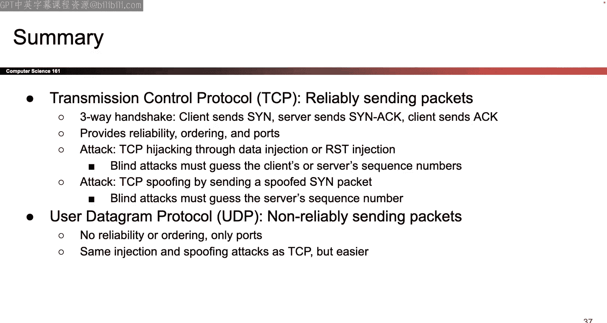

# UCB《计算机安全｜CS 161 Fall 2023 ｜ Computer Security at UC Berkeley》Calude-3.5翻译 p18 -18--CS161 FA23- Lecture 18 - Low-Level Network Attacks.zh_en -BV1YGbceREDs_p18-

Yeah。

Okay as promised I will try to keep up all these project two tips until it's due or until I run out of ideas so this is probably the most common one that people always mess up so last time we reminded you that when someone accepts the invitation they can choose their own name for the file name that's definitely in like the top three things that people always miss this one has a very good case of being top one it's these two requirements when you call revoke access and these actually make the project easier I'd say by limiting the scope of who's allowed to call revoke and who you are allowed to revoke access from so the only person who can revoke access from a file is the owner we are never going to call revoke from the context of any other user so a user who is not the owner of the file the person who originally created the file will never call revoke we're not going to test it the behavior is undefined your girl can do whatever you want if you want to crash that's okay if you want to error that's okay we don't。

We're never going to do it in our tests。Okay and then the second thing that people always mess up that's kind of related is that the only people who you can revokeke from if you're choosing to revoke a file and you're the owner。

 you can only revoke from people who you directly shared the file with and that one will probably make more sense of an example and furthermore。

 if you revoke from someone that you shared the file directly with anybody that they shared the file with should also lose access okay so here's the example that I think makes it crystal clear so if we imagine that this is the sharing structure user A creator the files that they're the owner they shared it with B and C C shared it with G shared it with D and E D shared it with F who is the only person on this picture who can revoke access from a file。

A， nobody else can revokeke access from the file， so if B calls revvo access undefined。

 if E calls revvo access undefined， who is the only person or who are the only people that a can call revvo access from only B and C so we will never ever test the case where A calls revoke on D or A calls revokeke on F。

 we're not testing that do whatever you want or don't even worry about it。😡。

And it's the case that if A revokekes from C， C and G both have to lose access， if A revokes from B。

 B， D， E and F all have to lose access， so if you revoke from someone。

 everybody in that sub has to lose access， those are the rules of revoke。

Okay and I would say most of those make the project easier because now you don't have to worry about different cases like oh what if the non-owner revokes or what if the owner revokes from someone who's not a direct child。

 you don't have to worry about those cases， so it simplifies the project that's really care that you make sure you like take these to heart because I think they make the project easier in the design phase and also in the coding phase okay and then the final note that I should bring up some sort of the revoking area is that say a calls revoke access on CG that means that C or sorry a calls revoke access on C that means C andG lose access to the file everybody in this sub B D E and F they still have to have access and crucially they do not have to reaccept an invitation so if you call revoke on CG everybody else should be able to keep using the file as if nothing happened which kind of makes sense if you think about a file sharing system in real life if you revoke access from someone everybody else should not have to reaccept an invitation to keep using the file。

 they should be。to continue using the file like nothing happened so for example。

 if A calls revoke on C C and G lose access， B should immediately be able to call load file store file or aend to file and it should just work B does not have to wait to receive another invitation or accept another invitation B D E and F they all have to be able to continue using the file as if nothing happened。

😡，Okay because from their perspective they weren't revoked they should still have access to the file they do not need to call accept again and that is also something that kind of limits the scope of possible solutions and hopefully makes things easier so that is why I wanted to remind you people miss it every semester and they always come to us like three weeks in the project oh I didn't know only the owner can revoke only the owner can revoke they can only revoke from someone they directly share the file with you revoke from someone you directly share the file with everybody in that sub loses access okay I've said it like five different times so if you watch this lecture like I think you got it this example even write out exactly what I just said。

Okay， so everyone go with that， we're not going to mess this up this semester， I hope， okay。

 fingers crosseded。Okay， anything else you want to know about Project two Robvo Ac before we get started？

So can be reoke doesn't it's undefined right whether you allowed or not we don't care。

 we are never going to test the case where B calls revoke if that's what you're asking。Yeah。

 that's a great question Okay， anything else you want to know about this picture， the graph。O。

Excellent so now we have that taken care of no one's ever gonna mess that up again sh fingers crosseded okay so last time we left up I told you about Ap。

 which is our first lower level networking protocol。

 remember that the reason why Ap exists I have a slide this I don't know maybe I do the reason why ARP exists maybe I have a summary slide let's use this so the reason why Ap exists is because we have IP addresses which are used to address computers at layer 3 and we also have Mac addresses which are used to address computers at layer2 So every computer has two different ways to refer to it。

 you can either use the Mac address to refer to like the physical hardware on the computer where you can use the IP address which encode some information about where this computer is in the world So both of these addresses have different meanings they're both necessary and so aRP is the protocol that lets me translate one to the other So if I know somebody's IP address but I don't know their Mac address ap is the protocol that will translate it for me and the protocol is simply if。

To know what the Mac address is I go to my local network and I shout to everyone in the local network I broadcast and I say I really want to know who has the Mac address corresponding to this IP address I'm intensely curious about this can somebody help me and the goal is that the person with this IP address if they're in the local network they will respond to you and say that's me that's my IP address here's my Mac address now you know if the person is not in the local network and the router can respond and say that person is not here。

 but here's my IP address and here's my Mac address if you send the message to me I can forward it to Bob or whoever the other person is okay so what's the attack well the attack is that if I broadcast this request the attacker could just reply and lie and say that's my IP address here's my Mac address even though that really wasn't their IP address so the attacker can lie and return their own maliciaious IP address here's Alice broadcasting the request to everyone you've seen these slides before Here's Mal。

lying and saying yeah that's me even though it's not and here's my malicious Mac address or my own Mac address and if her answer gets there before Bob's answer。

 then Alice will accept Maory's answer， cash it now。

The consequence of this attack is that in the future if Alice ever wants to send a message to Bob she looks in our cash and says well wheres Bob well Bob apparently lives at this mag address so I'm gonna send a message to Bob and then the message gets sent to Maory instead okay so here are the properties of apoofing and why it's a problem or why it even exists but one problem that we talked about at the tail end of last time is that Alice has no way of verifying the response there is no cryptography in this protocol there's no way to tell whether someone is truly the IP address holder or the person who host the IP address you requested or if there's lying about the IP address you simply have no way of telling this protocol is just too simple for that。

Other problems are that Alice is not expecting two people to respond if she says who has the IP address 1。

2。3。4， she expects a single response， not like 10 different responses so she's going to accept the first response and that means that if the attackers' response shows up first it will be accepted and then the second one will just get thrown away depending on implementation but usually just ignore right because you don't expect a second one and if Bob response first then well now the attackers response is going to get thrown away that's called a race condition is going to come up over and over again as we see different networking attacks so sometimes if Alice is expecting one response then it's really a matter of whose response gets their first so that's what the race condition is some attackers can win the race conditions some attackers can't if you don't win maybe you have to try a bunch at times that depends on your threat model okay。

And so what does apoofing require from the attacker and what does it allow the attacker to do afterwards so I think of apoofing as like an upgrade attack so to do apoofing you first have to clear the qualifier of being an onpath attack you need to be in the same local network because this entire protocol operates at a local network level Alice broadcast the question to everyone in the local network and she gets a response from someone in the local network so in order for you to carry out this attack you need to be in the same local network as the person asking the question so that basically makes you an onpath attacker you're the person who can read the messages being sent from Alice to everybody so that's the requirement to execute this attack the prerequisite is you have to be an onpath attacker but if you are an onpath attacker and you execute this and you succeed then you upgrade yourself into a man in the middle attacker who is more powerful man in the middle can additionally tamper and drop messages so why does the upgrade happen Well the upgrade。

Because after the attack any message bound for Bob is now going to get sent in Mallory instead so Mallory can take that message。

 modify it， drop it， tamper it， and then send whatever the modified messages to Bob so now she is the man in the middle and she can tamper with messages however she wants so you can kind of think of it like an upgrade attack Maory used to be an onpath attacker and has to be an onpath attacker to execute this thing but once she succeeds。

 she upgrades herself the man in the middle。Okay， that's mostly review from last time so I got so rudely cut off at 630 about the defenses。

 so let's talk about those okay。So the main defense is that in real life when you execute this R protocol。

 you're usually not going to broadcast the request to everybody on the local network because that could be too many people that leaves you too vulnerable to attacks so in general this is kind of a very high level overview of a possible defense most local networks have something called the switch and the idea is that the switch is some like central computer sometimes is the same computer as the router or some server sitting on the local network and the switch is going to maintain its own cache so instead of you broadcasting the request to everybody every single time you're instead of going to walk up to the switch ask the switch hey do you actually know who Bob is and what their IP and Mac addresses are and if the switch knows then you don't have to do any broadcasting at all and you save yourself。

our protocol you maybe save yourself from being attacked using the apoofing attack so if you walk up to the switch and the switch knows the answer then you don't have to broadcast if you walk up to the switch and the switch doesn't know the answer then the switch has to broadcast anyway so it doesn't completely stop the apoofing attack。

 but it makes the。Broadcast step and the reply step a bit less common so that it's less possible to make this sofing attack happen。

 Okay so you kind of think of it as if there's this central switch that's maintaining the mapping for everybody。

 then probably the central server is gonna have a larger cash because it's collecting requests from every single person on the local network。

 So in general， the switch is gonna to have to broadcast less often。

 And if you broadcast requests less often then the attacker has fewer chances to successfully run the spoofing attack。

 So that's one of the benefits of switches， there's fewer broadcast requests。

 And we know the broadcast requests are the things that are vulnerable。

 it's also more efficient in general。 So this one definitely depends on your specific network and how you're building it。

 but in general， switches are kind of nice because now you don't have to broadcast as many times。

 So if broadcasting is expensive somehow， maybe you've saved yourself some time。

And switches can get a lot more complicated。 We are like barely scratching the surface here。

 but you can even use switches to do something like take a single local network and split it into a bunch of smaller local networks So even though at a like physical level。

 everyone is connected up in a single local network if you feel that the local network is too large you can use switches split the local network into smaller local network which are called virtual local networks and they're called virtual because in reality everyone is connected up but you use the switch to isolate different parts of the network into their own local networks so that if you broadcast you're not broadcasting to everybody you're just broadcasting to one specific isolated section of the local network so that might be nice if for example you're running like a company or something and you want to have this like topser local network that's really secure and you want to have this broader local network that's less secure Well maybe you can use switches to do that So we're just kind of touching the surface here and it's not something we're gonna to talk about in detail but that's the rough。

😊，ic of ways you can kind of help stop our smoothing。 Nonene of these are bulletproof defenses。

 and we'll have to wait until later to see what the bulletproof defenses are， but it's a start。Okay。

Finally， there are also some tools out there so this is like a software level fix where maybe you can like run some software on your computer and you can check if there's anything that's kind of suspicious。

 for example， if you see two responses come back when you made a single request that might like。

Make you think oh， something is kind of weird here。

 And so some some tools like Awatch are designed to do just that。

 So they're going to sit on the network， watch the a request go back and forth。

 And if they see something really suspicious like， hey theyre just got there were two answers that came back or like there's this one computer that keeps answering every single query and is kind of weird。

 then maybe the tool can alert you。 So those are possible ways to help defend against aming。

 although they're definitely not bulletproof if you want a real secure defense。

 you're going have to come back in a couple weeks okay。

Final thoughts on A is a very first networking protocol， the very first attack。Very first defense。

Okay。Let's do another one This one's called dynamic host configuration protocol I will never ever test you on what it's stands for。

 but it's called DHCP So here's what it's for。 So the reason why DHCP exists is because when you connect to the network for the very first time you have to somehow like get yourself set up so if you go back to the postal analogy it's like when someone moves in for the first time they have to get set up they have to remember things like oh this is my address and here are all the addresses of my neighbors and here's the address of my nearest post office so you can imagine when someone moves in for the first time they have to get themselves situated and start thinking about like oh well my address just changed here's my new address and since I moved into this new place my new post office is over here so I have to remember all these things here's what it looks like in the computer world so when you first join a network and connect to the internet you need a couple things you need an IP address so when you first move in someone needs to tell you what your address is in the same way that if you first connect to the。

Someone needs to tell you what your IP address is or you have to be assigned an IP address so that other people can send messages to you。

 you can send messages to other people， so you need an address for yourself。

The IP address in particular So that's something you need。

 you're also gonna need the IP address of a DNS server。

 We haven't talked about what DNS is unfortunately， we'll talk about it in a couple weeks。

 So for now you can just imagine the DNS server is a helpful friend who's going to provide some useful service and we have to know where they are so we can go find them but what they do is a problem for another day and finally we should also know the IP address of the router sometimes called the gateway this is the server。

 the post office whose job it is to forward messages outside the local network So if you would like to contact people who are not in your local network。

 your local apartment building， you need to go to this router so that they can forward messages in the right direction So these are the three addresses you have to know but when you first connect you simply don't know this stuff you don't have an IP address you don't know where to find this helpful friend the DNS server you don't know where to find the router to send messages to the rest of the world So DHCP is the protocol that's going to help us learn all this stuff for the first time。

Okay。Let's see what it looks like and as I go through it it's gonna smell and feel kind of familiar so let's do it okay so the first thing we do is when I first move in I don't know anybody so the best I can do is I'm just gonna broadcast I don't know anyone I don't know who to ask so I'm just going start shouting to the world and everyone in my local network I have just moved in can anyone please tell me some configurations that I can use like tell me where to find the helpful friend the DNS server tell me where to find the router so you broadcast this request to everybody。

And you can receive replies so different people might be able to offer you information like here's an IP address you can use and here's a DNS server you can contact and here's a router you can talk to and multiple people might be able to offer in practice it's usually just one person that offers but in theory multiple people could offer so maybe there are like two DNS server sitting in the network or there's like two different routers so maybe there are multiple different configurations that you can choose even though in general there's probably just one and each configuration has to come with an answer to all the questions so each configuration has to say here's the IP address you're using here's your helpful friend DNS server you can go talk to here's the router you go if you want to send messages to the outside world So that's the offer itself。

And so here you are you've been courtd with all of these like wonderful offers and you have to pick one so you're gonna broadcast to the world and tell everyone thanks for all the offers。

 I'm choosing this one。 maybe you just got one maybe you've got multiple but either way you're going to tell the world or tell everyone in your local network Thank you for all the offers I'm choosing this one so this way everyone who has not been chosen can say okay you're not using this okay I can save this for somebody else or offer this request or offer this like IP address to someone else in the future so I'm gonna to discard if I wasn't chosen whatever offer I made and if I was chosen okay that's great I'm going to keep my assignment like my IP address assignment the DNS server and I'm gonna remember that this offer has been accepted so here the client is broadcasting to the world and saying which offer was accepted and everyone acts accordingly and then finally DHCP server whoever's making this offer is going send an acknowledgement and we'll see these things over and over again but this is just like a confirmation emails like a receipt。

That says， okay， like you have chosen to accept my offer， I agree that you have accepted my offer。

 so we both agree that we're using the same offer and that it's been accepted so this way both sides get to agree。

 it's like a receipt or a confirmation that everything has worked on。

Okay' four steps let's look at it in pictures and again if she feel kind of familiar from Ap because it kind of is the same thing。

 Alice comes up does not know the answer to some question。

 the question here is different from an ap but still there's some question which is like what's my configuration I don't know and just like an ap one I don't know I broadcast to the world and say can anybody please help me so we broadcast everyone in the local network oh please help I need a configuration I just moved in I just connected。

 okay and while Na's gonna to get some responses so she might get one responses she might get two responses and each response has to come with all of the answers to her questions like here's an IP address that I can assign to you that you can use from now on here's a DNS server you can contact as a helpful friend here's a gateway you can contact for the rest of the world so different servers could offer different answers she might get multiple author she might get one and either way whenever she picks her favorite if she gets multiple or if she just gets one when she。

Picks the one that she likes she's going to broadcast the world and say thank you everyone for the offers I'm going to use the one that DHcP server number one sent everyone else thank you for playing but I don't need those okay。

Great， and finally， DHCP server one is going to somehow do some reservation that says okay。

 IP X belongs to Alice， nobody else can use this IP。

 I can no longer hand out this IP to other people because Alice is currently using it this is the DNS server she's going talk to here's the gateway router she's going to talk to and then the DHCP server one send like a receipt or a confirmation or an acknowledgement that says okay you've agreed to use this configuration。

 I agree to give you this configuration we're all happy and everything is worked done。ok。So。

That's the protocol again it feels kind of similar to Ap because it kind of is And so guess what the attacks are kind of the same as an ARP So the vulnerabilities are also the same。

 What was the problem that made ARP so vulnerable but one of the problems was that an ARP when you screameded and shouted and asked who has the IP address Mac address mapping and you got an answer you have no way of telling whether the answer was correct there was no crypttography there was no way to verify who was sending you the response So in the same vein when you use DHCP and you like ask the world who can offer me a configuration you have no idea who answers the question So Alice has no way of verify who the response came from just like an Ap they have the same problem and this means that both of them have the same vulnerability which is that anybody can lie and answer So just like an ap or someone can walk up to you and lie and say oh I have this IP address here's my Mac address and lie about the answer in DHCP someone can also lie and say oh here's a configuration just for you and someone of the。

ation could be malicious or messed up， and Alice has no choice but to accept it， okay？

And another problem that's very similar from art is that in general。

 Alice cannot be sitting there waiting for lots of people to respond She can't be so picky and say I'm gonna to sit here and wait for 10 people to respond before I choose my favorite what if 10 people don't respond what if only one person is ever gonna respond so in general Alice is going to just accept whoever comes first this is implementation dependent like if you really wanted a DHCP protocol that accepts the second answer I guess you could but in general since we really only expect one response we're not going to sit there and be like oh but what if there's the second one you don't know so as soon as you get one you usually just going to accept it and that introduces another race condition which is that if the attackers malicious answer shows up first Alice is probably going to accept it first because why would she sit there waiting for the second one to show up this one is kind of implementation dependent if you want to implement the HCP differently you could but that's what we have one to say okay so what can you do with theHP so just like before we think about。

What is the prerequisite to making this attack happen Well again you have to be in the same local network to execute this attack for the same reason as an a this is an attack happening at the local network layer it's only happening within a local network you broadcast and shout the questions of the local network you get configurations from the local network so in order to execute this attack mallllory needs to be in the same local network just like before and just like before if you succeed at this attack you upgrade yourself from an onpath attacker who is in the local network reading messages and you upgrade yourself into a man in the middle attacker who is now able to tamper with messages as well okay so how is the upgrade going to happen here remember mallory can lie about any of the configurations so imagine it instead of honestly saying that's where the post office is mallllory says I'm the post office come talk to me well now it's gonna happen is anytime Alice wants to send a message to the rest of the world where are you gonna to send it she's not。

Go to the real post office because she has been tricked to thinking mallllory is the post office。

 so any messages sent to the rest of the world end up going to mallllory instead and now Mallory can take the message modify it and then send it forward to its destination。

One possible way to use theHCP to lie about something that gives you the man in the middle capability is you can lie about the gateway router instead of saying that's where the post office is so messages for the rest of the world should go there。

 you can lie and say I'm the post office messages to the rest of the world should come to me and now anytime malice sends a message。

 it goes to Mallory first， she can do whatever she wants to it， she can drop it she can modify it。

 she can add on her own messages and then she can send it forward to the destination that makes her a man in the middle Now even though we haven't talked about what the DNS server is。

 you can imagine that Mallory could also lie about that too so instead of saying that's where the helpful friend is who can answer all of your DNS queries whatever those are。

 mallory could claim that she is the helpful friend and any DNS queries should go to Mallory instead and that could be bad if we're relying on this helpful friend for some sort of like information that we care about I promise you will talk about it when DNS comes up but you can imagine that Mallory lying about this is also bad news。

Okay so this slide hopefully should feel very similar to the a slide like a lot of the words are simply copy pastted because the vulnerabilities that unlock both these attacks are very similar and the prerequisite to the attack and how the attack upgrades you to be a man in the middle they're all basically the same okay so here's a slide that hammers home the idea that they are the same both of them have the same key vulnerabilities which is that the attacker can lie about the answer that's spoofing and in both cases there's some race condition which is that the attacker needs to make sure they're answering against their first。

 both of the vulnerabilities suffer from these attacks because they are broadcast protocols where you ask everybody including the attacker and in both cases there's no way to trust whether the response that comes back is legitimate or not these protocols are just too low level and too simple for that。

Okay。So how do you stop the HCP Well it turns out here I don't even have an answer for you like the switches I can only say it's hard and the reason why it's so hard is because when you first joined the network like when you first move in it's hard to trust anybody it's like when you move into a new apartment complex for the first time you don't know who any of your neighbors are there's no one there who you can really trust especially if you're being very apparent so instead we're gonna have to rely on defenses in higher layers and we're gonna have to punt this problem to a couple weeks from now and later we'll see a defense or a protocol that introduces cryptography that's going to stop all of this stuff but that's gonna to be a problem for later so for now all I have to do is say like stay tuned there will be protocols later that introduce cryptography that help us stop these attacks but for now we just have to accept this as effective life and hope that a higher layer helps。

Okay， I know it's not the most satisfying answer， but the best I can offer for now。Okay。

 anything else you want to know about these first two protocols？They're kind of similar。

 they serve different purposes， but they have the same vulnerabilities。Anything on zoom。Okay。Yeah。

Great， let's talk about some more low levelvel protocols。

 So now we're gonna move into like wireless local protocols and how they work。

 So everyone's sort the term wi-fi before we're not going talk about the hardware behind it in too much detail。

 but you can think of w-fi as this protocol that wirelessly connects up all the machines in the local network So when you're using wifi to connect all of our machines to the Berkeley visitor network or the EUro network depending on which one's working that day So that's that's the w-fi protocol。

 it uses some like physical wireless technology at layer one that we're not going talk about。

 the important things you have to know about the Wi-fi network for this class is that each Wifi network has these things associated with it So each Wifi network has an access point This is the machine that helps you connect the network。

 So it's sitting somewhere in the network remember that the network is just a bunch of machines connected together。

😊，The access point is some machine who sits there and its entire existence is just to help people connect to the Wifi network。

Each WiF network has a name， so if you've ever gone and tried to like connect the different networks。

 everyone has a name， the name is called the SSI you don't have to know what it stands for。

 but that's a fancy way of saying every WiF network has a publicly identifiable name。

And every Wifi network， at least the secure ones， they have a password， so you could。

 I guess technically have a Wifi network without a password。

 but in general Wifi networks they have a password， you enter the password， that's how you connect。

Hopefully sounds kind of familiar， okay？So how does the thing actually work so the way it actually works is using a protocol called WPA2 and it helps us secure Wi-F networks using cryptography so we're going to have to design this scheme I' kind of walk you through it we can try to think through the goals together so what do we need for this protocol to be secure and functional well one thing that is hopefully we can all agree is would be good is that if you have the Wi-F password you should be able to join the network so if you walk up to the access point and you present the correct password。

 the access points should allow you to join the network that seems fair。

Okay also it would be nice if all the messages are encrypted so that if you're not on the Wi-fi network。

 you can't look at the wireless messages being sent back and forth and like snoop and see what they say。

 so it would be nice if all the messages were secured somehow using cryptography that seems like a nice goal to have and also if you don't have the password I don't know why this says network should we change it okay？

Cd a type them， let's fix it so that should say password， okay。

Your work your work okay sorry about that okay so the final point is that if you don't know the password you should not be able to join the network and you should not be able to see what other people are saying over than the network again seems pretty reasonable but I don't know the password I should not be able to join the network I should not be able to learn the keys that people are using to encrypt messages so those are the goals that we want so now we're going to have to build this thing okay。

So let's build it so the way we're going to build it is going to draw this entire handshake it's going to be a protocol between these two people and they're going to exchange a bunch of messages in order to make sure that the client is authorized to access the network and if they are authorized we're going to give them access to the network by giving them some secret keys that they can use okay so there are two different people in this conversation there's the client this is the person who is trying to connect has the password and would like to connect to the network and there's the access point this is the person who's already on the network and their entire existence in life is just to sit there waiting for requests and author people to connect if they have the password okay。

Let's watch them talk to each other so the first thing that should happen is the client should walk up to the access point and say I would like to connect to the network please so it's just a request client sends to the access point and says hii I'm the client I have the password I want to connect to the network please is that okay okay。

Great so at this point we had to start thinking about design because one thing we could do is we could just have the client send the password directly and then the access point to check if it works or not and we could think well does that satisfy all of our design requirements well if the client just goes ahead and sends the password what if the attacker looks and sees the password being sent so what if the attacker is reading all these messages and can see the password being sent now the attacker knows the password so we probably shouldn't send the password and plain text over this insecure channel that would be a bad news so we're gonna have to be a little bit more clever we can't actually send the password but we still have to somehow allow the client to prove to the access point that the client knows the password so here's how they're going to do it it's a little bit more clever and takes a bit more design so。

😊，We know the client knows the password if this client wants to log in they have to know the password the access point is already on the network so they should know the password too so both of them are going to run some deterministic algorithm on the password to derive this thing it's called pre-shaharre key I'm just going start calling a blue and start color coding this stuff because there's about to be a lot of acronyms okay so they use the w-fi password they throw it into some deterministic algorithm like a hash or something and they get out this blue key pre-shared key okay。

What comes next now they're going to exchange random nonsense so they're going to each generate a random number and send the random number over the insecure channel to the other person we'll see why this is useful later so for now you're going to have to trust me that the random nonsense are useful but they are okay。

And so now we're going to do another derivation and again we're going to find some deterministic algorithm like a hash a key derivation function from Project two like pick your favorite。

 we're going to use some deterministic algorithm and we're going to take three things and throw them into the soup and get some deterministic output So the three things that we're going to throw into our deterministic algorithm soup and mix them up we're going to throw in the preshahared key a thing in blue we're going to throw in the nonsenses。

 a thing that I colored in red and we're going to throw in the Mac addresses of both the client and the access point so all these values go into the hash or go into this like soup and outcomes comes a new value and the new value is going to be called the PTK I'm going to label a purple and he guesses why。

Well what happens if you mix blue and red you have purple you see what I did there okay so we take this PSK the blue thing。

 we take the non which are these random values that I colored in red if you mix them together you get this purple pairwise transport key or PTK but the important thing is that both sides are drivingriving it independently so it's not the case that one person derives it and sends it to the other that way and attacker over the channel could see it they are both deriving this on their own on either side so notice that the secret keys。

 the blue one or the purple one they are not actually getting sent over the channel both sides are deriving it by themselves using stuff that they both know。

Okay。At this point it would be nice to check that things have not been tampered with like imagine if the attacker taampered with the nos and now each side has a different key that would be bad and I don't want that to happen so the way that I'm going to check that both sides have derived the same thing and nothing has been tampered with is I'm going to exchange Mac codes from the cryptographic unit message authentication codes and this is going to be annoying because like we said last time Mac addresses and Mac from the crypto unit they share the same name so I'm going to temporarily fix that and hack around it so I'm going to temporarily renamed the message authentication codes from the crypto unit into message integrity codes so I'm going to call them mix for the rest of the date when you see mix if's not a new thing it's just the message authentication codes like Hm from the cryptography unit is it annoying yes it's very annoying but unfortunately these two things have the same name so we just have to hack around it。

Okay so the specifics I'm going to abstract them away here if you remember the cryptography unit we can build specific ways to do this。

 but you can imagine that both sides generate a MI which is the Mac from the crypto unit they exchange them and check that the messages have not been tampered with so there's a little more that goes into it but you can imagine we already know from the crypto unit that mix have the power to help us check if things have been tampered with so here we are just leveraging that power to check if things have been tampered with and if you believe the cryptography unit and the properties of the MI then hopefully this feels convincing if not you can dig in and think about how they would do this but for now we're going to extract it away okay。

So at this point both sides have a key that they share。

 which is great and then the final thing that's going to happen now that they both share a key is that the access point is going to encrypt using the PTK。

 this group key and send it over to the client and then the clients going to acknowledge that everything has worked out and that they've received the group key and the group key I've colored in green because it's separate from all the others。

😊，Okay， so I realized I just threw a lot of stuff at you so we can try to break down and see what all this stuff is actually for。

 okay？So to go through it one more time and then we'll talk about properties the client walks with the access point says I would like to authenticate and the access point says sure let's do it so they both derive this blue key from the password independently they're not sending things to each other they are simply deriving it by themselves offline okay and then they both exchange random number so each side generates a random number which if color red they exchange it over the insecure network and then they take the PSK which is in blue they take the nonsenses which are in red and they take the Mac addresses and they throw all of those things into a soup and like a hash function or something and out pops this PTK and purple finally they use mix to check that nothing has been tampered with and if you believe the cryptography unit you don't have to worry about the specifics but we know that mix somehow can help us check if things have been tampered with and if both sets are satisfied that nothing has been tampered with the final step is that the access point sends a group key which every one of the is going to share and they send。

Encrypted over the network and the client acknowledges and says， yep， it's been received， thanks。

Okay。Let's see some properties So what did I achieve here there's a bunch of words for you Okay so what did I achieve here that I achieve all of those goals from my like two slides ago Well both sides have a secret key which is good so both sides derive the same key they went from the wi-fi password and they threw that into some hash got the PK in blue they took the PK and blue the nonsenseis that they exchanged in red and the Mac addressess and they threw all of those things together to get the PTK and purple and now the PTk can be used to encrypt all future communication So if you ever want to talk to somebody on this network you can encrypt the message using the PTK you can send it to the access point the access point knows how to encrypted and then can send it to someone else in the local network so the PTk can be used to encrypt communication which is good one observation that you might make at this point is that the PTK is different for every user why is that Because if I run this handshake like 10 different times。

I'm going to get different nos every time those are random numbers that I generate。

 which means that every single time I run this handshake if I get different nonsenses when I run this derivation I get different PTKs so if a bunch of different people connect everyone gets a different PTK but they're ultimately all talking to the access point anyway who can forward the messages onwards so that's okay。

But in general， the PT case that get derived should all be different， okay？

And finally there was this extra key that got sent so we were like there were already so many keys why did you throw in yet another one this green one well the group key GTK is useful because sometimes you want to broadcasting like we already saw protocols from before that involved broadcast so sometimes you don't want to just talk to the access point and like ask the access point to forward something to a specific person you would like to send something to the entire world in this case I guess the entire local network so how would you do that how would you broadcast you can use the GTK and everybody who's ever connected gets the same GTK from the access point so this way if you broadcast everyone knows the key to decrypt the message。

 which is nice。So that's what the GTK is for you can think of the GS be for group so everyone in the group has the same key this way if you ever want to broadcast a message to everyone in the group。

 the local network use the GTK everyone gets it okay so those are our properties we'll see whether it's secure against attackers later but we've at least achieved our functionality goals which is that everybody can connect the network if they have the password if they have the password they receive this set of keys there's a PTK in purple that they can use to send things to the access point and the access point can send it to its destination there's also a GTK which they can use to broadcast messages to everyone and that one works because everyone has the same GTP。

Okay。Its also just occurred to me that you could maybe argue the P stands for purple and the G stands for green。

 I don't know， maybe I'm just a secret genius when I meet these slides， okay。

Any other questions that don't involve colors？Or maybe they do involve colors， I don't know okay。

This handshake。 it works great。 I think it's intuitive。 You can think through all the steps。

 and you see these like exchanges happening。 So I like it。 It's very nice to read。

 but there is one problem， which is it's kind of slow。

 So you can imagine that sending messages over the network takes time。

 if you're using like a wireless protocol。 You have to wait for those wireless radio waves to get to the other side and then they have to think a little bit and I send you an answer so you can imagine that sending messages back and forth takes time。

 if I look at this protocol， I'm sending a lot of things over the network。

 I'm sending this request and then I'm sending this no。 I'm sending this nonsense。

 I'm sending two different mix。 I'm sending a Gtk and an act。

 like that's a lot of arrows going back and forth and each one takes time to send over the network。

 So this is going stack up and it going to make connecting to a Wifi network kind of slow。

 I don't like that。 So I'm gonna make it faster。 So this next version of the handshake that you're going to see it is the exact same handshake。

 I am not changing any of the semantics。 The derivations are exactly。😊。

The same they're both both sides are going to get a PTK and purple at the very end the clients going to get a GTK at the very end the group key that they can use it is all the same the only difference is I'm going to slightly shuffle the steps around to try and reduce the amount of messages sent back and forth just to make it faster so at this point if you're still feeling shaky about the handshake this might feel kind of confusing the important one that that really is going to help you get the security properties is this one the conceptual version but in real life since we care about optimization and making things fast we are going to slightly optimize it okay。

So let's look at what this would look like， the authentication request。

 and there's no optimizing that we have to tell the access that we want to communicate。

 so that's the same。And they're both going to derive something okay still unchanged Great。

 at this point， we're gonna send the Nos to the client。 So it's called a nos。

 I guess for access point， a for access point， perhaps okay and at this point we pause what would have happened in the non optimizeimized version in the non optimizeimized version the client would have send its own nos and then both sides would have derive something。

 But if I stop at this point and I look at the client。

 the client actually has everything they could possibly need to derive the PTk in purple why is that because the client knows blue Pk the client knows red because they have the nos from the access point and they have their own nos。

 they don't need to receive them from someone else and they know the Mac addresses So at this point instead of waiting and like sending another nons and exchanging a bunch more messages the client's gonna say well forget all that I have all the things that I need So I'm just gonna go ahead and generate my PTk first So now we're kind of losing the symmetry of this protocol and the client's gonna to say。

I know all this stuff first I know my own nonsenses I know the other person's nonsenses because they've sent it to me I know the PSk because I've derived it I'm ready to compute the PTK so I'm going go first sorry access point you have to wait till later I'm going go first generate the PTK since I know it so what good is that well now。

We can save ourselves a step because now the client is ready to send the MIC because it's so far ahead of the protocol and so the client can send the MIC and the enots together in one step remember in the original unoptimized protocol we had to send these one after the other in two different messages but now we can send them in one shot because the client knows the enots can send it at this point and the client already knows the MIC because the client has skipped ahead in the protocol generated the BTK already so this saves us an exchange which is nice。

Okay at this point we look at the access point， does the access point know everything is it ready to compute the PTK Well sure is because the access point knows the PSk in blue it knows the nos it knows its own nos and it just received the clients as nos so now the access point is ready to do the derivation it's true the access point had to wait a little bit later that's okay It's saved us the back and forth message which was nice So at this point the access point is ready to do its derivation they still derive the exact same thing so these two formulas sitting inside these boxes is exactly the same I haven't changed that at all the only optimization is that I'm reducing the amount of messages sent back and forth okay。

And now again the access point tries to save itself a message， so it's going to send the MI。

 but it's also ready to send the GTK so it goes ahead and sends both bills in a single shot instead of doing it across two separate messages and then finally the client acknowledges so I took the old message or the old protocol which had like six back and force and I've compressed it down to four which is an improvement。

But overall， if this looks confusing， that's okay， I think it's confusing too because it's optimized and in general when we optimize things they start to look a little bit less intuitive。

 so if this looks weird it's okay I like looking at the symmetric version where everyone's exchanging things nicely but once you get the hang of it in real life this is what people do they call it the four way handshake because if you ignore the authentication request which doesn't really have any information or any like cryptographic information there are four things being sent ans es and the MI together as one the MC and the GTK together as one and the a at the end that's four things so they cut it down from six to4 we optimized。

But it's okay， the ultimate like thing that we're computing is exactly the same。

 so if we haven't changed any of the cryptographic properties of this handshake。

 we just made it fast， which is good。Okay， that's the optimized version， but again。

 if you don't like it， the intuitive version is sitting right there for your per in fact。

 I'm going to go back to the intuitive version when I talk about a text just to make things easier okay。

 so what are some different things you can do。Against this protocol。

 there are a couple attacks that we're gonna to talk about。

 And so one possible attack is if you are already in the network。

 so you're someone who knows the password and you've connected to the network。

 that's the prerequisite for this attack， you know the password so you can derive the PSk。 Well。

 something you could do is you could pretend to everyone else that you're the access point so you're lying and telling everyone else。

 if you want to connect to the network， come talk to me instead of talking to that real access point。

 So that's called the rogue AP because you've gone rogue and pretended to be the access point yourself。

 So instead of talking to the real access point， maybe somehow you can make the client talk to you instead and we're not gonna to talk about the specifics of how that actually happens。

 but you can imagine that if that actually succeeds。

Well now the client's gonna be talking to you instead and you know the PSK so you can honestly follow this entire protocol。

 the client's not going to know any better， they're going think you're at the access point and this upgrades you to become a man in the middle because now anytime the client has a message to send to the rest of the world they're going to come to you because they think you're the access point not the real access point so that's the rogue access point attack what's the prerequisite to making it happen the qualification is that you have to be on the network you have to know the password so that you can execute this handshake as the access point and what does it do if you succeed。

 it allows you to become a man in the middle because the client's going to do this entire handshake with you instead of with the real access point you're able to do this whole handshake because you know the password and if you succeed now the clients going send all of this messages using that PTk that you and the client share to you instead of the real access point and so you can now see all the messages that the client wants to send that makes you a man in the middle That's thegue。

Gax is going attack。Okay。There's another one so another attack is well Wi-fi passwords might be kind of weak so just like how we talked about in real life a lot of people use weak passwords well Wifi passwords could also be weak and so we could try and do a brutefor attack so here i'm crucially adding the word offline。

Because there are kind of two forms of brutefor attacks and we saw this when we talked about passwords So there is one really silly attack that we're not even gonna to talk about because it's so silly。

 It's the online brute force attack So what would that look like Well that would look like me clicking on the network on my computer typing in the password writing the entire handshake and it's not going to work because the password provided it was wrong and then what do I do I try again I type another password and hope that it works I type another password and hope that it works So that's the online brutefor attack because I'm relying on the access point to tell me whether or not I got the password right。

And just like we saw in the passwords lecture， this is going to be very futile because the access point is going to get very sick of you after a couple of requests and say。

 okay chill out， you're obviously just guessing I'm going to not let you connect anymore and I'm going to reject future authentication requests from you so the online group first attack it's not even on the slides because it's so silly and the access point can stop you with some rate remedy。

So that's not what we're talking about it's easy to get this confused and think that the brute force attack simply means I go onto the network and just start mashing passwords and hope that one of them works that's not what we're doing because the online brute force attack is kind of too easily stop to even talk about so instead we're gonna talk about the offline brute force attack in this one as much more powerful because instead of waiting for the access point to tell me if I got it right or return an error to me I'm going to record some information and then do all of the bruteforcing myself it's offline I don't have to wait for the access point to tell me whether or not my guesses correct I'm going to record some information and use the information to check my guesses myself and if I check all the guesses myself I'm not limited by the access point getting sick of me I can check as many guesses as I want so how does that work so。

If I think about what an attacker can observe if they're looking at the network and watching somebody else connect so maybe the attacker they don't know the password that's the setting of this attack but maybe they watch someone else who does know the password run this handshake so they're gonna like peek in watch someone else run it and be like oh man I really wish I could be that client who knows the password but I'm not so I'm gonna to have to write down instead all the things that that client looked at so what did that client send over the network that the attacker now knows the client sent the authentication request there's no cryptographic information there but that's okay。

But the client of the access point also has set nonsense so the attacker can write those down now the attacker knows a certain set of nonsenses。

Do those help me learn the password， not by themselves。

 but maybe with some other stuff they can also crucially。

 the attacker can also write down these mix message integrity codes from the cryptographic unit。

The attacker can also write these down and so the attacker knows the nonsenses。

 the attacker knows the mix and the attacker can write all of these values down and now the attacker has a framework that they can use to try and guess if their guess is correct or check if their guess is correct without talking to the access point so how will the attacker do this the attacker will do this and check if their guess is correct by following the exact same derivation and seeing if the mix that the attacker generates match the mix that the client and the access point generate so here's how it might go。

The attacker knows exactly how the derivation protocol works。

 We assume the attacker knows the system。 So the attacker is gonna make a random guess。

 This wi-fi password total guess， they're like I don't know。

 maybe it's potato Okay so I take the w-fi password guess potato I derive a PK is it correct Probably not but it's a guess I take my guest Pk I combine it with the nonsenses what licenses me to combine the Pk with the nouns like why do I know these because they were sent over the network and I wrote them down so I know them as the attacker and the Mac addresses。

 we're gonna assume the attacker knows the Mac addresses because if I send messages back and forth I can see the Mac addresses being that are being like sent to and from the to and from fields Okay so we assume all these things are known I get a pk out if I throw these into my hash suit I it correct I don't know is a guess It's probably not right。

 but it's my guess and then using this PTK。 What's the next step in the protocol。

 The next step is to use the PTK to generate these mix think like H map。

So if the attacker uses this PTK to generate the mix well if the PTK is correct。

 it's gonna match the mix and now the attacker knows that they found the correct password if the PTK doesn't match then attack the PTK used to generate the mix and then if the mix do not match what the attacker wrote down then the attacker knows I messed up my initial guess must have been wrong so I'm going to try this all over again but crucially none of this requires talking to the access point。

 all you have to do is write down this authentication request that you saw from somebody else write down all these values and that's going to give you the ability to check all of your guests offline by yourself you're no longer limited to the access point getting tired of you you can try this as much as you want until you find something that works and you were only limited by your own compute power and how secure the Wi-fi password was in the first place that's why it's the offline brute force attack not an online attack and that's why it's a lot more powerful because here you don't have to rely on the access point to check your guess。

for you and say like nope wrong password nope wrong password again nope wrong password I'm getting tired of you instead you can write down these values yourself。

 you can run these exact same derivations with a guess and then check if your guess is correct I make a guess I run all the same derivations if I get the same M then my guess must be correct if I get a different MI then my guess must be incorrect and that's what lets me check。

Okay it's the offline brute force attack so that's attack two out of three Okay the third one it's not really an attack。

 but it is a property which is might remember forward secrecy from the cryptography unit if you don't remember it we will talk about it again today and then again in a couple of lectures so it's okay if it doesn't sound super familiar the forward secrecy is basically the property that if I write down a lot of stuff now so suppose the attacker does not know the password now but they write down all of this handshake and they also write down a bunch of encrypted messages so they have be sitting here and they're just like oh if only there was a way to get the password then I can decrypt all these messages and so forward secrecy is the property that even if the attacker learn something in the future they cannot take all this stuff that they've written down and decrypt messages unfortunately WPA does not have this property because if an attacker writes down all this stuff and then later in time they learn the PSK well what can they do？

Well then they can take the PSK， they can use it to derive the PTK because they know the PSK。

 they wrote down the nonsenses， they can derive the PTK in purple， and now that they have the PTK。

 they can decrypt all the stuff that they wrote down in the past so this does not provide forward secrecy because an attacker can write down a lot of stuff now learn the password later and still decrypt all the stuff that they wrote down in the past in order for something to have forward secrecy。

 the attacker should not be able to do this。Okay。So that's the third kind of attack。

 it's not really an attack， but it's a property that we wish we had， but we don't in this case。

 the attacker can write down a bunch of values and then in the future learn the password。

 use the password to derive the PTK in purple， and then use the PTK to cook all sorts of stuff that they wrote down in the past。

So those are our three attacks Rogue A where was this okay Rogue AP pretend to be the access point。

 you have to know the password， but if you know the password， pretend to be the access point。

 you can upgrade yourself to a man in the middle offline brutefor attack this one is useful that you do not know the password but you can write down all these values it gives you a tool that you can use to make a guess and check your guess without talking to the access point so that you're only limited by your own compute power and you don't have to wait for the access point to get sick of you finally there's no forward secrecy because an attacker can write down these values and the encrypted messages and in the future if someone ever tells them the password or they ever learn it they can come back and take these values that they wrote down and decrypt them and figure out what you were saying in the past so there's no forward secrecy。

Okay， those are the like the three attacks of the day that you have to know。

 anything else you would like to know about them。ok。Sounds good。 How do you stop them。

 You have to upgrade your WPA and use a more fancy version called WPA Enterprise。

 So this was gonna sound a little bit like too good to be true and we're gonna to have to use some protocols from later lectures to really make this work。

 But here's how here's how it's gonna to work。 So the main problem is that think about like， yes。

 there were all these different handshakes and I derived like 20 different keys with different colors but ultimately like what was the only piece of secrecy that separated users that are legitimate and attackers who were not legitimate The only piece of secrecy from which all other secrecy was derived is the password That's the only thing that secret every other secret value Pk Pk G Tk all of that came from knowing the password So in other words。

 if you know the password you've unlocked all this other stuff。

That's the core issue is that everyone has only one password that they all share And if you know that password you can derive everything else。

 that's why the offline birdfor attack was so powerful because if you know the password and you're all set that's why the Rogue API attack I guess was powerful that's why the nofor secret anything applied if you know the password and kind of your host or you can decrypt things in the future So the core issue is that there's only one secret value and everyone shares the same secret value it's the one and only value it's the wi-fi password and so to fix this we are instead going to give everyone a different password So now it's no longer enough to just give your username or sorry just to give the password that everyone shares instead everyone one of us is going to have a different username and every one of us is going to have a different password So if you think about like EU room which is the wi-fi network got Berkeley here。

If you've ever logged into Ero before they want a username and they want to pass so Ero uses WPA En。

 but if you think about like a homewifi network or something maybe you don't need a username that would be a WPA2 or WPA PSK implementation so the difference is that if you need to supply a username and everyone has a different password you've upgraded to using WPA enterprise okay so how does this one work well now the access point is going to be some sort of like authentication server and so the way that it's going to work is again most of this is going to come into like clear view when we talk about TLS in a couple of lectures but somehow we're going to use some cryptography magic to form a secure connection to the authentication server and this is going to allow us to know that it's the real authentication server not an impersonator not a rogue AP and it's also going to confirm that our communications are secure how can this magic cryptography possibly work。

You'll have to come back in two weeks to find out， but somehow we're going to form a secure channel to the authentication server and we're going to enter our username and password to the authentication server。

 the server is going to check if our username and password is correct and if they're correct the authentication server is going to send us a one time key to replace the Pk so most of WPA enterprise actually works exactly the same there's still a PTk that everyone generates there's still a group key that everyone uses the only step that gets swapped out is that very first step or we generated blue PSk so。

In the older model， the way that we generated blue was we just took the password。

 hassht got the PSK in this newer model， the way that you get the PSK is you walk up to a secure authentication server。

 present your username and password if they're correct you get a one time PSK to use and that PSK is unique to you it's different for every single communication it's one time use only and it's a lot more secure than the password because it's high entropy。

So that's the fix that we're going to make and it's going to solve those three attacks that we talked about There are still other attacks that are possible that we're not going talk about here but the three attacks that got stopped are the rogueapp attack got stopped why is that because now the authentication server is going to somehow be authenticated there's no way to impersonate them Tls will provide that to us in a couple of lectures the brute force attack is going to be a lot harder basically impossible at this point because the secret value the blue PSk that you're using is no longer derived from a password that's insecure it is randomly generated and the odds of guessing like a 256 random string like zero astronomically unlikely and finally this also solves the forward secrecy problem because that PSK is used once and then thrown away so if someone records a bunch of messages there's still not going to be able to learn the PSK in the future it's a onetime key as soon as you're done using it you throw it away so that's what gives us forward secrecy。

So WP En is stops these three attacks in general， it doesn't always stop all of the attacks。

 there are still like higher layer attacks that are problems but。

For the context or for the story that we're building here， it stops the attacks that we discussed。

Okay。Final note here because people ask it every semester people ask why is WPA layer1 Okay it's weird。

 I know it's weird， but a lot of the protocols that we're talking about remember they don't fit cleanly into the model So that model that I showed you with like layer 12347 like it's kind of an outdated model and in real life a lot of protocols don't cleanly fit into one of the layers WPA is one of those cases So sometimes people argue that it's layer 1 because it involves like the wireless messages is being sent back and forth sometimes people argue that it's layer two because it's happening on a link or a local network layer So is there a really good answer not really would we ever quiz you and say like please tell me what layer it's at node because people in general don't agree on the answer So don't worry too much about what layer WPA sits at the the main things that matter are how we built that protocol to help secure messages and make sure that everyone with the password has a key everyone without the。

Passware cannot get the key and also how those attacks worked so the protocol itself was what matters。

 what layer it lives in， we don't really care because those layers are a little bit outdated。ok。

So anything else you want to know about our DHCP WPA， otherwise I'll summarize。

 and then I'll like slightly talk about next time stuff and then we can go home okay。

So quick summary we talked about the classes of attackers from last time they're going to come up over and over again so make sure be super familiar with the three classes of attackers we talked about ARP and DHCP which are kind of cousins in the sense that they both have the same vulnerabilities I broadcast the question to the world and I accept the first answer that comes back in both cases there's no way to trust the answer that comes back in both cases there's a race condition in which the first answer that comes back even if it's malicious gets accepted and in both cases it's kind of hard to defend against because these protocols are simply too simple I said simply too simple okay they are too simple to stop those attacks so we're going to have to wait for higher layers to help us and then finally we talked about WPA for wi-fi connections and again what layer it lives at I don't really care the important thing is that we have this handshake and the key parts of the handshake where's my handshake the key parts of the handshake were that。

There's my handsh。keyey parts of the handshake where that both sides started with a password。

 they derive the PSK and then they derive the PTK it's all happening offline。

 they do not exchange this key over the channel so that other people can't see it。

 there is a no which helps us make sure that the keys derived are different for every single person there's a group key which we use to broadcast messages to everyone else and then we talked about the three attacks and how WPA En stops them。

O。Final thoughts on any of this lowle stuff WPA R DHCP types of attackers got one project two thing that I showed you at the beginning or anything else Okay so in the interest of staying ahead this happens like every other semester I'd say I will show you one more thing about the IP layer so we'll move up from layer 1 and2 into layer 3 and then we'll be done and we'll save layer4 and beyond for next time okay so layer 3 I'm just gonna to give you a quick whirlwin speech for if you want more information on this I guess go take 188 or 168 it's full go on their website and check or something I don't know I can help you with that but let's talk briefly about what happens at layer3 okay。

So remember， at layer three， this is where we're going to take all those little local networks and you can think of them as like little apartment complexes and we're going to use a big network of routers and like post offices to link them all up and connect the whole world。

 okay？And so at layer 3， the protocol that lives at layer3 is called the Internet protocol or IP。

 this is the protocol that everyone uses to talk over the Internet so later we'll see some layers like layer4 there's a choice of protocols but at layer3 there's no choice everyone uses this to connect up all those little local networks together so everyone uses the IP protocol or the Internet protocol as we've already seen everyone has a unique IP address technically not unique but for the purposes of this class unique is good enough we talked about how IP addresses have evolved over the years so over the years I think it's fair so back in the day IP addresses were 32 bit values in the way that you wrote them was you just wrote four numbers with dots between them that's like classic IP but then eventually they ran out of these so they started to issue IPV6 addresses these are longer they're 128 bits so we're never running out of these but these are longer and to write them use hex and colons。

Why I don't know people have interesting ways of writing things okay you don't have to memorize how to write these the important thing is if you see one of these you should know that it's like an IPV6 address okay we talked about how they're not really unique there's something called network address translation that we're not going to talk about that makes them not technically unique but for the purposes of this class it's good enough to assume they're unique okay。

And again the IP address itself contains information about where the computer is so we're not going to talk about exactly how you read these numbers you can imagine somewhere in there there is some information that tells the routers where this thing goes so it's just like a real address like if I write a real address like I don't know12。

 three Main Street Berkeley California94720 that address contains information about where I am in the world and so it allows people sending messages to know where to forward that packet IP addresses addresses have the same property even if we're not going to talk about the specific numbers and what they mean okay。

So one more thing you should remember from layer3 is that because of the way that computers are wired up in that like network of network structure。

 it's not always going to be the case that a computer is directly connected to every other computer in the world that doesn't scale it's not how we built the internet so if I want to send something to my friend in like Australia which is a country I've chosen totally at random and which choose a different one every semester okay so if I want to send a message to my friend in Australia I cannot send a message directly to my friend but I can send a message over layer3 and what the layer3 protocols are going to do is it's going to send a message for me to some other router that router is going to say well I can't reach Australia but I'm going to send it this way because it's going to get you closer so that router will send it forward to another router and that router is going to send it forward to another router so it can take many。

 many hops across the world for my message to reach its ultimate destination in the same way that if I was sending mail。

There's no like dedicated mail manager gonna like swim across the ocean and take my message to Australia instead。

 but Mama' is probably gonna have to take this message and route it across a bunch of different post offices to get the message to its final destination great so one extra vocabulary term for you is that sometimes people will say that Is belong to subnets。

 which is just a fancy way of saying there are a group of addresses。

 they all start with the same sets of numbers， the same sets of bits and these addresses are somehow like in the same geographic region or like close to each other So somehow again these numbers they tell me something about where the addresses are like I don't have an expertise to tell you how that's true but somehow these addresses they can be grouped subnets and the subnets can help me figure out exactly where the messages should go it's like if I had an address and the address said like Australia well maybe you don't know exactly where the message should go but okay Australia like that way。

And you can send the message in the right direction， okay。Great。

 here's a more words So how do I send a packet in the local network I can still use IP to do it so IP is the layer3 protocol it allows you to send things to everyone in the world that could be people in other continents it could also be your neighbor so how do you send a message to someone nearby you in the same local network and IP you can still use IP you take the message at the highest layer you rock all those headers around including the IP layer and so what would happen here is that you would check the destination IP and you realize using the information in the number like wait a minute this person is like my neighbor this is not someone in Australia this person is in the same local network as me so I don't have to go through any ridiculous like router hops to get this message to his destination and so the I protocol will look at the subnet look at the IP address and realize you know what this does not need any ridiculous router hops to get to its destination I'm just gonna use Marp to figure out what the Mac address is and then use my layer。

Your protocols to send this only using a single hop to its destination and I'm done。

So IP can also be used to send messages within the local network。

 the protocol would look at the IP address， realize it close by。

 use Ap to figure out the Mac address and send it over a single hop to its destination and you're done。

By contrast， if you want to send a message to someone who's far away， not in the same local network。

 then instead of just sending it across a single hop to its final destination。

You send the packet to the gateway or the router and then the gateway now has its job to send it somewhere else that's closer and then maybe that gateway sends it somewhere else that's closer and so this packet could take multiple hops to reach its destination okay？

Here's another word that people use at the IP layer again I don't know why people like using so many different terms of different layers。

 but they do so we just have to live with it so sometimes people call the local network an autonomous system why it beats me but that's what people call it another way you can think of an autonomous system is it's a bunch of computers that are like。

Connected up together and they're somehow operated by the same entity and what does operated by the same entity mean。

 you can imagine that's something that relies in the real world。 So maybe it's like oh。

 these all belong to the same company they belong to the same university So that's what the autonomous system is you don't really have to know anything more beyond the fact that it's a fancy name for local networks And so the protocol that actually figures out where the packet should get sent。

 It's called BGp again， you don't have to know what it stands for and we're only going to scratch the surface of BGP but this protocol is somehow going have all the information and all the rules that say I have a packet it's going to this IP address。

 Where should it go Should it go that way Should I go that way Which next router should I send it to Bgp is going to tell me how to do that Here's a simplified picture As we saw there are lots of different autonomous systems which is a fancy way of saying it's a local network with a router sitting inside they're all。

To together in some way some systems are connected directly some are not this is how the network looks in real life Okay so if this sender wants to send a message to the recipient。

 there is no direct connection if I look at all these arrows。

 no direct arrow so this message is going to have to send to the recipient over a couple of different hops through a couple of different autonomous systems so。

How did these autonomous systems build this map You can imagine that this map is not like sitting in front of me as a picture that I can look at to figure out where the messages should be sent So the rough idea behind how these systems actually build this graph to figure out who they can reach and who they cannot reach is each system is going to announce to all of its neighbors who's reachable so autonomous system 6 is going to announce to the world I am connected to the recipient。

 I'm connected to autonomous system5 I'm connected to autonomous system4 now all of its neighbors know that if I want to reach the recipient。

 I should go through6 how do I know that because six just announce to the world and all of its neighbors that they can reach the recipient So now five knows if I ever want to get to the recipient I should send it to six because six claims to me that they can reach the recipient samee thing with four if four wants to know how do I get to the recipient well I know that six said they can reach them so I'll just send it to six and trust that they know what they're doing okay。

So four and five， they reasoned this out， they announced these to the world and all of its neighbors and now three knows。

 okay well if I want to reach the recipient， I don't have a direct connection。

 but I think back to all the things I've heard and I remember oh number five number five said that they can reach the recipient through sixs or whoever else so if I ever want to go to the recipient I'll just send it to five and let them take care of it and so three realizes that three can reach the recipient by sending it to five and letting five take care of it the rest of the way so three announces I can reach the recipient through five and going the rest of the way and one hears that and says oh you can get to the recipient okay in that case if I ever want to go to the recipient I'll send it through three and let three take care of the rest so when everyone announces their reachable destinations to all their neighbors everyone can build up this kind of rough idea of where messages can be routed。

In reality the routing protocol is a lot more complicated you can imagine there are lots of different routes through this network which one do you take BGP answers all those questions and tons of gloryry detail but it's not stuff that we're going to cover so this is kind of as much as you have to note it is definitely a simplified picture because。

In real life there are lots of questions about which routes to take which pa or shortest VGP answers those but we don't answer them in this class Okay so what are the attacks well the main attack at this layer is it's spoofing kind of like it always is and so far at least so。

The idea is that when you announce to the world who's reachable I mean you can lie right no one is gonna to check if you're right so each autonomous system could lie and say I can reach the recipient even though I can't and if you lie and say to the world that you can reach the recipient even though you can't well now any messages meant for the recipient are going to come your way because you claim to be able to reach them so if number three goes rogue and says。

 so if number three is like the attacker and it broadcast and says I can reach this person well maybe that's a lie and if autonomous system number three is lying about being able to reach this person well now any messages is meant for this person are going to come to number three and now number three gets to be a man in the middle and like modify those messages before sending the board so that's called BGP hijacking you're hijacking the network by lying and claiming to be someone that are claiming to be able to reach someone that you really cannot reach。

And that's going to maybe convince other people to send packets your way okay something else that can happen at this layer that we've already seen is spoofing and spoofing is the idea that you can send a packet and lie about the sourcedown so if you send an IP packet you can lie and say I can reach or like I am Alice when you're really mallllory that's this idea behind spoofing and in general we assume that everyone can spoof one of the defenses that can exist against spoofing happens at this layer so in general。

Each autonomous system should be responsible for checking things like this so for example if you're a router and you see someone sending you a bunch of IP packets。

 but the IP packets have a bunch of different send fields like I'm Alice and then the next packet I bo and the next packet I'm Evan but well then maybe the router is gonna get suspicious and say like oh hold on you're probably spoofing I'm gonna stop accepting these packets so autonomous systems should in theory be able to check and stop source Is from being set to the wrong value and stop you from lying but in real life。

 some autonomous systems just do not either because they were configure by the attacker or they're under attack or control or they're just not set up the right way so like roughly speaking some autonomous systems in the real world they will stop spoofing by checking whether or not you're lying about who you are in the sender field and some autonomous systems will not and it really just depends on which system you're on and how you configured it So those are the attacks at the。

IP layer， there's IPpoofing， which we've talked about already some systems defend against it。

 some don't there's BGP hijacking where the entire autonomous system is malicious and lies about who we can reach and in both cases I'm going to like again quote at you the same thing we've been quoting all day which is that at this level there's just not enough information or not enough cryptography to defend against these things so instead we're just going to accept them as a fact of life and we're going to accept that okay at layers one2 three man in the middle they might just exist there are simply ways for people to become men in the middle attackers and there's nothing we can do about it you're going to have to wait until next week and we're going to like destroy all the men in the middle attackers with a single protocol so at this point we're going to accept men in the middle attackers as a fact of life and then like a week from now you'll come back and then we'll like destroy all the men in the middle attackers together okay。

So you can start back up if you want， I'll quickly tell you a summary of the last 10 minutes as you like walk out so we talked about BGP all you really have to know about this layer is that the internet is a network of networks。

 each small network， each local network can be called an autonomous system and the way that they connect up together is that everyone broadcasts the ways that they can reach other people in the network and so if you lie you broadcast that you're able to reach someone that you're not able to reach that could convince other people to send you messages could make you a man in the middle。

Okay， that's it so I will see you next time and we'll talk about layer four stuff。

 so we're moving up the stack， okay。

喂。