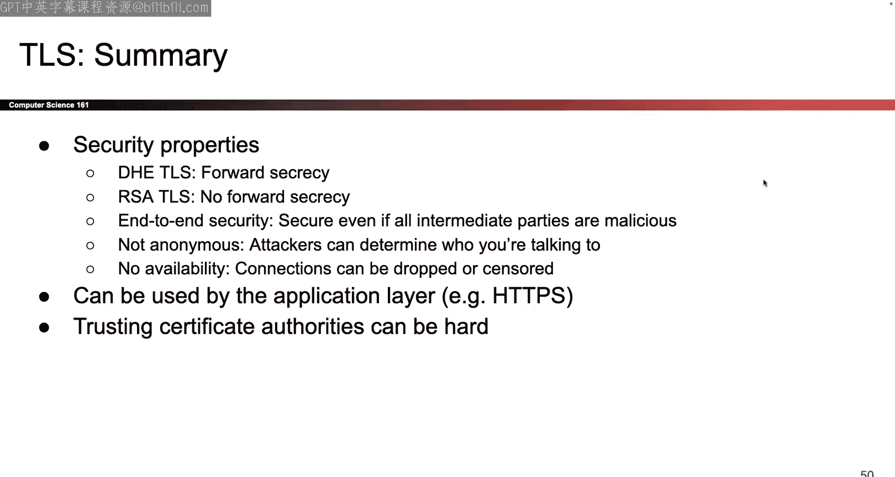

# UCB《计算机安全｜CS 161 Fall 2023 ｜ Computer Security at UC Berkeley》Calude-3.5翻译 p20 -20--CS161 FA23- Lecture 20 - TLS.zh_en -BV1YGbceREDs_p20-

Okay， hi so today' is the two just kidding you all can't see it okay now you can so today is the TlS lecture。

😊，Really cool lecture but before I talk about that I'll give you one quick project two tip so I guess today we'll talk about append efficiency unless someone else is intensely curious about something else So this one hopefully we all agree right now that aend efficiency is not measured in terms of the amount of compute that you do is not measured in terms of space efficiency it is specifically measured in terms of bandwidth efficiency and the way that bandwidth efficiency is measured is every time you want to read something from datastore。

 you have to call datastore get and that downloading of data counts against you in terms of bandwidth anytime you want to change something on datastore。

 you have to download the data， change it and reupload using datastore set that also counts against you when it comes to bandwidth so the total amount of bandwidth that you use and you append to a file has to be constant size no matter what the user' settings are so。

Whether or not the user has one file or a million files。

 the total bandwidth of a pen has to be constant， whether or not the user has appendix to the file once or a million times the total of append bandwidth has to be constant。

 hopefully this is all stuff that we already agree on and so I guess any questions or do we all agree that bandwidth is the way that you measure a pen efficiency okay？

Soute question， yeah。And it's okay for it to scale and the size of the app so the question was is it okay to scale with the size of the append that's okay that's the only thing that it's okay to scale with yeah great question Okay so。

Now that we all agree what bandwidth is and hopefully is in your design if not。

 this would be a good attempt to update your design so that it satisfies the bandwidth requirement。

 the way that you would test something like this because we didn't provide any bandwidth tests so it is on you to write these tests and all the tests that we have on the autograder or test that you can replicate yourself so what I would recommend doing is if you want to check for example that the bandwidth doesn't scale with file size then what I would do is I would come up with several different scenarios maybe like five different scenarios and in the five scenarios we have all else equal so the same user the same number of the user has the same number of files the name of the file is the same so we come up with five different scenarios where everything else is the same and the only thing that we vary in the five scenarios is the size of the file so maybe in scenario number one the user with the same username the same file name。

 same everything creates a file that's 10 bytes and then in scenario two same username site same file name。

Everything 100 bytes scenario number three same username same file name 200 bytes and you can do this for several different scenarios and then check the total amount of bandwidth for every single scenario and the way that you would check the bandwidth for each scenario is you would check there's a helper function that we provide I think we provide that gives you the total amount of bandwidth that you have used so far in this test so you can check before I call the append what is the total count of bandwidth that's been used after I call aend what is the total account of bandwidth that have been used and if I compare those two numbers the difference in the bandwidth before and after the append tells me the amount of bandwidth that that particular append used so there's a helper function that does that for you you call it before and after you check a difference that's my recommended way of doing it there are certainly other ways but that's what I like。

And then after that what you can do is you can check in these five scenarios where the size of the file was different what was the bandwidth for each of these five things and if they were all constant or very close to constant then you know you've got a solid in a pen when it comes to scaling with the file size however if you see a linear pattern where as the file size gets bigger the bandwidth number also starts to increase then maybe you have a problem that you want to start sniffing up so that could be one way to deal with file size you can do the same thing for any of these other ones you could say I have different scenarios where the user has one file 10 files。

 100 files a million files and check what the bandwidth is across these four different scenarios see if they scale so those are my tips for how you might test for bandwidth you can use the helper function that we provide to check how much bandwidth is being used and then you can make up scenarios to see if your pen scales with any of these things that's my tip for getting a perfect app but is certainly up to。

Okay。Questions thoughts does everyone good with a pen people always mess this up and think that it's time efficiency or space efficiency it is bandwidth efficiency that's what makes a pen tricky yeah question。

What is the corresponding helper function， I don't remember the name of it off the top of my head。

 but it should be somewhere in this bag so。If you dig around， I have faith you find it。Okay。

 maybe somewhere in here。And。Something like that yeah， here it is measure bandwidth okay so。

There's an example。O。😊，Cool so that's it for Project two hopefully it's going well were nearing the end of it so I wish you good luck as you enter the home stretch okay let's talk about Tls so last time we left off I was at layer4 and at layer4 there were two choices of protocols that you can use both of them build on IP so in both cases you're relying on IPs power to send messages anywhere in the world and on top of that you're possibly building something that adds other features so both TCP and UDP added the idea of ports which means that if one computer would like to talk to another server but there are two different connections going on like there's different applications talking to each other the ports can help you identify which connections are which and TCP in particular additionally adds reliability so it takes the IP protocol makes it reliable and the high-level ideas where that we added some sort of ordering on the bytes we stamped every byte with the number。

We also added reliability by forcing each side to acknowledge every message that it receives。

 so if you receive a message you must acknowledge that you received it and if you do not acknowledge the message will get resent until a message gets sent and it gets successfully acknowledged we talked about the way that this is implemented there are some flags that we need to implement all of this stuff we have to add sequence numbers we talked about those and the two classes of attacks。

 they basically said PCB there was no cryptography， there will be today。

 but there was no cryptography last time so if an onpath attacker or a man in the middle would like to read your communication they can if they would like to tamper with your communication。

 either by injecting data or injecting a reset packet to stop connection entirely or by starting a brand new connection they can and the off-path attacker is the only one that we can kind of protect against and the way that we do that is by randomizing the sequence numbers the starting sequence numbers so that the offpath attacker has a heart。

Guesing what the sequence number is because they can't read it。Okay。

That was the summary it was all stuff from last time so today we are finally going to add one more layer on top of TCP that finally introduces all of the cryptography that's going to make these network connections secure so like along the networking journey remember there' have been like three different attacks where I just kind of shrugged and said it's okay we'll deal with it when we talk about some higher layer today is that day where we defeat all of those attackers that we've like left in the dust so far okay so to do that we're gonna to have to build another layer and this is another example of how this model is 1970s outdated so back in the 1970s no one really thought about secure communications over the internet and so we had to add that in it is not really layer 7 because you can build stuff on top of TlS like the web is built on top of TlS is not layer 4 because we already built layer4 so I am going to call it layer 4。

5 I don't know if that's like what people actually call it we're shing this into an outdated model so I know that。

This is probably not how you've learned how to count your other classes， but we are accounting 1，234。

4。57 okay， and the reason why we don't use five and six， they're outdated。

 they represent other things that we don't use anymore okay。

All of that is to say we have TCP built for us， we did it last time we now have the ability to use the bystream abstraction we get to think in terms of connections so for all of today you're never going to have to stop and stress out about oh but what if the packet is too large how do I split it up or what if the packet doesn't show up while I have to resend it for all of today we don't have to stress about that because we are going to be sending all of our messages over TCP and TCP is already guaranteeing to us the bystream abstraction I can feed in any bytes that I want they're going to show up on the other side no problem so we do't have to worry about any of that stuff today because we're building on top of TCP and the goal is to still provide a bystream abstraction so I'm not going to change the fact that the end user is going to think in terms of connections Im not going to change that however I'm going to build a layer of cryptography on top of TCP so that the connections that go back and forth are more secure against those on path。

M with middle attackers okay that's the goal we have TCP as the building block it's done for us。

 we don't have to worry about rearranging packets and putting them in order and we're going to build a cryptographic system on top of it that gives us the ability to send messages securely。

Let's do it， okay。So just like every design tasks so far I'm going to first tell you what the goals are and then we're gonna start piecing together something that hopefully achieve those goals so here are the goals some of them seem maybe more obvious。

 some seem less obvious so the first one that would be nice is confidentiality we've seen this one we don't want people over the network to be able to read the messages that we sent back and forth in TCP so far they can do that because TCP has no notion of encryption but after we introduce confidentiality now the attackers have no clue what I'm saying when I send messages back and forth we would also like integrity so we don't want attackers to be able to change what I am saying without being detected if the attacker tries to change something I want to be able to detect it and kind of a corollary of integrity or like something related to integrity that we sort of hinted that for all of class but I'm going to make it very explicit this time because it's a common attack is the replay attack so the replay attack I guess the way that I think of it is。

If all the messages are totally secure they have confidentiality， they have integrity。

 then maybe an attacker sees the packet growing across the channel and has no idea what it says there's confidentiality on it。

 the packet is unreadable to the attack they don't know what it says also the packet has integrity so the attacker can't mess with it but what if the attacker wrote down the exact sequence of ones and zeros in that packet so they wrote down the exact packet they have no idea what it means or what the Mac says or how to change it but they wrote it down and then they sent that exact same sequence of ones and zeros to the recipient a second。

Would the recipient think that the original sender meant to send the message twice and if so that constitutes a replay attack I am replaying the message even though I have no idea what the message said and I have no ability to change the message and if your scheme is not secure enough you might be vulnerable to replay attacks because the Mac could still be valid if you haven't changed it at all you're just copy the ones and zeros。

 the original message could still be valid if it's just a bunch of ones and zeros even if you don't know what it says and you could possibly trick the recipient into thinking that it was sent 10 different times maybe depending on the way that you set up this protocol but we don't like that because imagine if the message just so happened to say pay $10 to Mallory well now if I send this message and I replay at 10 different times。

Then Maer is going make a lot more money than she should and we don't like that so we would like to also stop replay attacks at the same time as providing integrity so it's kind of a side effect or another property that we would like but something we haven't made explicit until today now it's very explicit okay and the final thing we would like this authenticity and so here the property we want is that we would like to make sure we're talking to the legitimate server so when my computer makes a connection to Googlecom to get these slides I would like to make sure that I'm talking to the real Google do co and not somebody who's pretending to be Google co that is something that I would like to ensure。

Okay。So those are the properties that I want， confidentiality and integrity we've seen those before replay attacks are kind of new and here I'm defining authenticity very specifically to say I want to make sure that the server that I'm talking to that I know exactly who they are and that I can trust that this is the real Google and it's not someone who's just pretending to be Google and sending me a bunch of garbage data okay。

So。To do this， we're gonna build a handshake。 we've already built the handshakes before。

 but this one is the TlS handshake so it's kind of long。 so bear with me。

 we're gonna go through the entire handshake and then I will break it down and talk about how each part achieves the goals so we'll go through the handshake first some of the steps might seem kind of like incomprehensible at first and it's okay it's a long handshake but I guess without further ado we'll jump into it So the first thing to remember is that this handshake is going on over TCP So you never have to stop and say what if the message is too long or what if the message goes about our order don't care TCP is taking care of it all for us So everything that we send back and forth is being sent over TCP I do not have to worry about reliability so get that out of the way there is a TCP connection it had to be formed first so first the two sides are going to say hello to each other So here they are saying hello the main thing that is important in these two hello。

There's a lot of stuff There are details that we're going abstract away for now。

 but the most important thing that they send in this exchange is a sequence of random numbers or two random numbers so the client picks their own random number I'm going to call it R subB sends it to the server in the client hellello message server picks their own random number R sub sends it over in the server hellello message so now there are two random numbers that have been exchanged I haven't used them yet but that is what's happened in this step okay。

And so intuitively， if you want to start building intuition on how this works。

 you can think well the random numbers are going to make sure that if I do this handshake 10 different times。

 there's going to be at least one thing different in every one of those handshakes because these are random numbers and they're going to change every time so intuitively that's why they're needed we'll go into a lot more detail about why each step is necessary but for now they've exchanged random numbers technically this is a bit of fine print they're also going to agree on some cryptographic algorithms at this point so for example they could choose to use HMac they could choose to use AES base Mac like the one you saw the midterm or something so there's a lot of different algorithms that they could choose to use they could choose to use AECBC or AES EtR which one will they choose they're going to agree upon that stuff here as well but that's more fine print the random numbers are what's really important for the security of this step。

Okay。At this point it's now time to figure out who the server is remember one of our key goals is to make sure we know who the server is so the first step that we're going to do on our journey to making sure we know who the server is is we're gonna ask the server to send a certificate and the server is going to send over a certificate so at this point you need to go back into know the dusty cowebs and think about what is a certificate remember it's kind of a weird name I would have called it something different but I didn't invented it so we're callinging them certificates but remember a certificate is nothing more than the server's public key signed by someone else that you trust that's it so the certificate contains the server's public key is this and that message gets signed by the private key of someone else that you trust you can use the trustworthy person's public key to verify that that's true and here the trustworthy person is the certificate authority how do you trust them more on that later but the key here is that you get a certificate it's a fancy way of saying it's just someone's public。

K signed by someone else that you trust you can validate the certificate by checking that the signature is correct and if you check the signature and it checks out what do you know at this point so another thing that's really helpful when you go through a complicated handshake like this is try and think about what are the things that you know at any given point so at this point do you know that you're talking to the server well not really because anybody could have sent a random number anybody could have sent a certificate those things are public I could send the public key of someone else that's okay so at this point the only thing that you know for sure is you know the public key of the server why do you know that because the certificate told you this is the server's public key it's signed by someone you trust so you have 100% confidence that this value is the server's public key you know that this person is the actual server with that public key who knows someone else could have sent you the certificate however you are at least confident about what the server's public key is。

That's what this step is for， so it's easy to like overthink this step and think， oh。

 the certificate tells me that I know who the server is it does not。

 it just tells me what the server's public key is。😡。

But I'm not all the way there yet Okay certificate set certificate is sent。

 I know what the server's public key is and now we keep going so at this point we're gonna do a premaster secret exchange and this one's kind of tricky because there are two purposes of what we're about to do There's also two different ways to do it So things we about to get a little complicated。

 So there are two things that we want to do one thing we want to do is we still want to know we're talking to the real server and so somehow we need to know that this is the person corresponding to that public key I know what the server's public key is I want to make sure that this is the person who owns the corresponding private key so remember in public key cryptography。

 the private key is kept to yourself the public key is published through the world you know the public key that's been published to the world you trusted from the certificate but you have to know that this server is the person with the corresponding private key That's how you know this is the server so somehow we're gonna to have to issue a challenge that lets us know whether or not this。

Server owns the private key and if the server can solve the challenge。

 we know they own the private key， if the server is unable to solve this challenge then we know they're probably an impersonator so that's one thing we're going to try and do in this step。

And at the same time because we can we're also going try and get a shared secret between these two people so far no shared secret random values certificate they're all public so we would like to get a shared secret and maybe it's not totally obvious yet why this is useful but you can imagine when I'm going on my way to do cryptography and like encrypt things and mac things it would be nice if they shared a secret so i'm going to try and do that first and then use the secret in interesting ways later okay those are our two goals now we have to figure out two different ways to do it so one way to do it is to take advantage of RSA and this is what that version looks like it's a single message there it is。

And so there's two different ways to think about this depending on which purpose you're trying to solve and which goal you're trying to solve so first i'll tell you what it is all that you're sending as the client youre sending some random secret so the client picks the secret they can just choose it randomly they encrypt it with the public key of the server send it to the server that's it so it's just the premaster secret which is a random value chosen by the client encrypted by the public key of the server okay。

We can think about this two different ways so one way to think about it is why does this guarantee that we are talking to the real server and not an impersonator and the way I think of it is the client is issuing to the server challenge the client is saying okay server you claim to be the person who owns the private key of server okay well I'm going to make sure that you're not lying and the way that I'm going to do that is I'm going to send you this message encrypt it with your public key or what you claim is your public key and if you are who you say you are in that you own the private key then you should be able to solve my challenge。

 decrypt this and get the secret so that we both agree on the secret however if you are not who you say you are you're an imposster you're an attacker then when I send this message over then the fake impersonator of the server is not going to know the private key of the server and will have no hope of decrypting this because you have to have the private key of the server to decrypt this message。

So。One way of thinking of it is that this is a challenge issue to the server and if the server is able to solve the challenge。

 then we know it's them， if the server is not able to solve the challenge then we know it's some impersonator and the other thing that this does at the same time because there are two different goals that we're trying to check off is that this is also going to help us establish a shared secret so if the server is who they say they are then they can decrypt this message and now the client and the server both know the secret why does the client know the secret because they chose it why does the server know the secret because they got sent an encrypted version of it they decrypted it and nobody else should be able to know it because I didn't send the secret and plain text I sent an encrypted okay that's the RSA approach it checks off both of my goals now I have a challenge that only the server can solve and I also have a shared secret that both of them have。

Okay， questions。talkWhat if the server is fake and talks to the real server gotcha so you could this is probably like a little bit beyond the scope of just seeing it for the first time but the question was what if the servers like relaying messages forward while the server is not the impersonator is not going to get the plain text of the premaster seeker at any time so？

RightAnd you'll see this when we finish the handshake。

 but the server is not going to get the premaster secret in any form except this encrypted form。

 so the impersonator still won't know what the secret is。

But I'll try and finish the handshake and we can ask more later if you're curious okay so this is one possible way to achieve those two goals。

 but there's actually a second way to do it and so here I'm not actually introducing another step I am offering to replace this step with a completely different alternative so I'm going to throw out the premaster secret idea with the RSA and I'm going to put in something different and I'm going to put in something based on Diffy Helma this is an equivalent approach both of these achieve the same goals and we'll talk about which one is better later but they achieve the same goals and so in this approach and I'm going to leverage the power of diiffy Hels I go back and I think I remember okay diiffy Heman is this way where two people can share a secret even without exchanging or even so that attackers looking over the channel don't know what the secret is so the way that we're going to do that is just classic diiffy Heman server sends G to the A Mop client sends G to the B MoP they both derive G to the A B Mo P now。

They both agree on a shared secret like typical diffy Heman stuff and so that solves our first challenge。

 which is how do you make sure that there is a shared secret that they both know you use Dffy Heman but one problem is that remember there were two goals of the step one of the goals was to make sure that they both share a secret check Dfffi Heman does that second goal however is we need to make sure that the client is who they say or sorry the server is who they say they are no fake servers around here so how do we make sure that's true with Dffy Heman if you just send plain difffi Heman there is no proof of who the server is if we just do plain diffy Heman anybody can send that G to the AMp G top is some random value。

 anybody is licensed to send this including any attacker so diffy Heman by itself does not tell me that the server is who they say they are so I need to add in that extra challenge to tell me if the server is who they really claim to be or if they are an imposster so the way that I'm going to do that is I'm going to。

Additionally ask the server to add a signature on its stiffy helm and handshake。

The server is going to send G to the a， but it is also going to sign G to the a with this private key and then I can use the public key to verify that the signature checks out why does this guarantee that the servers who they say they are because if the server was fake they would not be able to generate the signature and when I try to verify it I'd be like oh wait signature didn't check out you are not the real server so by signing that this half of the diffy helmetman handshake I'm guaranteeing that the server is who they claim to be and not an imposster okay。

So that's what checks off the two goals， the regular Diffy Heman checks off the goal of getting a secret that they both share and the additional signature allows me to make sure that the server is who they really are and not someone pretending to be the server because only the real server could have generated the signature。

 someone pretending to be the server would have had no hope of generating the signature okay。Great。

 so these two steps again， they are alternatives right you could have chosen either one and later we'll see which one is better but for now either one is okay So at this point。

 what do we know at this point we know who the server is thanks to this challenge I'm pretty convinced that this is the real server or an imposster and so now we will also both have a shared secret so now it's time to start deriving a bunch of keys and so this is the point where we realize like okay I remember from the cryptography unit that like key exchange or key reuse is kind of bad I don't just want to use the same key to encrypt everything and Mac everything so I'm going to take this one three master secret。

 the one secret that we both share and we are both going to independently derive a bunch of new keys and so here we're just going to be paranoid and just go crazy and like derive a bunch of keys in particular we're going to derive four of them and you can think of it as this is going to allow me to split the key for encryption and the key for Mac this allows me to avoid key reuse when I use the same。

in two different algorithms， so both sides are going to derive four different keys。

 both sides are going to know all four keys and all of this happens offline so they are not sending keys to each other。

 they both know the starting secret， they can both run the same deterministic algorithm。

 some PRMGs of hash or something like that and they can both get four different keys that they both know。

Why4 or not2， also something for later， I told you TLS has a lot of moving parts， but for now。

 the important thing is that they both compute keys and they do not have to share the keys over the chat。

 they both know the secret so they can both derive the keys。Okay。

So what do we have at this point at this point both sides have a set of keys that they can use to communicate that no one else knows and the client and the server knows or the client knows of the server is so at this point it is now time to make sure that the handshake has not been tampered with because all this time when I've said all this stuff over the network a lot of it was like unsecure for example G to the B mod P if I choose to use this option someone could have tamper with that or what about those random numbers at the very beginning someone could have tamper with those two so somehow I have to make sure that the messages were not tampered with and the way that I'm going to do that is I'm going to exchange Max here when I use Mac I'm referring to cryptographic Mac not Mac addresses that's something that happens on at the layer2 or whatever。

Today is all about cryptography this is the cryptographic Mac so intuitively what I'm doing is I remember I think back to Mac and I remember okay Macs are a way to help me check that messages have not been tampered with so if you're convinced by that you can abstract away the exact way that this is being done and just remind yourself open Mac helps me check if any of the things said so far have been tampered with so far okay if you want to be really pedant you can think about what specific key they would use and how they would regenerate the Mac to make sure that they check out correctly but for the purposes of just seeing the handshake for the first time I think it's good enough to just say the Macs are a way to make sure that nothing has been tampered with so far and we can do it because both sides have secret keys that they share。

Okay。And finally after all of this handshking stuff we finally have a series of keys that they both share。

 we know who the server is and finally we are able to send messages back and forth。

 they both share secrets that they can use to encrypt things and Mac things the client is confident what the server is it's time to start sending messages so now we can use encryption and Mac。

 hopefully in some secure way older versions of TLs use bad ways of doing it but somehow we're going combine encryption and Mac to send messages back and forth now the messages have integrity and they have confidentiality and we are done。

Okay that's your first taste of the handshake we're gonna to like start digging really deeply into it so if you have questions maybe hold them for a couple slides okay so at this point you've seen the whole handshake they exchange random numbers the server sends a certificate which tells me what the server's public key is and nothing more at this point there's a premaster secret exchange and the premaster secret exchange could be RSA or it could be diiffy Heman but in both cases they're going to allow me to get a shared secret and also convince me that the server owns the public key and then at this point they're going to send Max to make sure that nothing has been tampered with so far and if they both agree nothing has been tamered with it's time to start encrypting and Mac all my messages okay。

That's the whole handshake it barely fits on the slide so this is kind of condensed but now we can start thinking about all those three goals that we had before and think about did we actually get all of those checked off So the first one I'm gonna do is did we successfully make sure we're talking to the legitimate server remember one of our goals was I don't want this to be an imposter pretending to be the real server I want to make sure this is the real server so how do I make sure that's true why this this handshake guarantee it well it guarantees it through two different steps so one useful thing when you're seeing this handshake for the first time is think there are like so many different steps which of the steps guarantees each of the properties that I care about here the property I care about is am I talking to the real server the way that I check that is there's two things that are needed the first thing is the certificate I need the certificate to know what the server's public key is otherwise I don't know the certificate is a way to know what the server's public key is and be100% confident because the public key is signed by someone else。

I trust and furthermore knowing the public key by itself does not guarantee to me that this is the server that's the part that's kind of tricky if I know what your public key is I don't know who you are because the public key is public anyone could have known it so the second step that is absolutely necessary to make sure that I know who the server is。

😡，Is that exchange either using RSA or diffy Heman because that is a challenge that only the server with the private key can solve so I need to know what the server's public key is certificate provides that I also need to know that this is the person with the private key and I don't need to know what the private key is but I need you to prove to me that you know the private key and the two ways to do that or either issue a challenge if you know the private key you think you're so hot you know the private key if you do then you need to be able to decrypt this premaster secret that I generated and encrypt it with your public key or in the Dffy Heman option you think you know the private key prove it to me by signing your half of the diy Heman exchange in both cases if the attacker is an inersonator who doesn't know the private key then they would not be able to complete this challenge and so they would fail at that step and when they fail on that step something later down the line is going to catch that so maybe the Mac exchange will be messed up or something you can think about that kind of on your own time but the important thing is that only the legitimate。

Could successfully clear these steps。That's one of the goals checked off Let's think about a second goal so the second goal is did we successfully provide confidentiality and integrity over the messages it seems kind of convincing like I exchanged some secrets and no one else knows the secrets can I be very confident that no one else knows the secrets well the way that I can convince myself is the attacker doesn't know the premaster secret that was the original secret key from which all future secrecy is derived and the attacker doesn't know the original secret why is that there's two different arguments I have to make for the RSA case I think okay well how was that freemaster's secret sent it was sent encryptpto with the server's public key if you don't know the server's private key you have no idea what that secret says so we're good in the diffy Heman case we appeal to the properties of diffy Heman and we remember if you see G to the A Mop and G to the B mod P you have no hope of knowing what G to the A B modp is so we're good there as well so in both cases we're appealing to。

The cryptographic protocols to guarantee that the attacker doesn't know the original secret。

If the attacker doesn't know the original secret and all the other secrets were derived offline from the original secret then the attacker has no way of knowing those derived secrets either。

 it was done offline so the attacker has no extra hints to use to figure out what those derived secrets are and so if the attacker doesn't know the original and the derived secrets were done offline the attacker should also not know what the derived secrets are so it is not a formal proof but hopefully talking through it seems reasonable that the attacker doesn't know what those derived keys are and then we're using those derived keys to encrypt and Mac things so hopefully feels okay that the attacker is unable to figure out how to decrypt those messages or how to tamper with them because of the nice okay。

So seems reasonable that the messages are secured but there is one extra thing remember we said integrity is great。

 but there's a replay attack problem that we have to solve so let's solve that now so there are actually two types of replay attacks like this is all Tls by the way I'm always like okay there is one property but it's actually two properties happens all the time Tls just has a lot of complexity like that but it is kind of interesting anyway TlS replay attacks how do we stop them turns out there are two replay attacks that I care about So one of the replay attacks is what if I wrote down a message a bunch of ones and zeros I have no idea what it means or what it decryptps to what if I wrote it down from a previous TlS connection and then now there's a completely separate connection going on and I want to take the messages from the past connection and inject them into the current connection how do I stop someone from doing that across different connection well for this one the step that I'm going to appeal to to argue that this is okay is these first two steps because these first two steps where I。

Change the random numbers are going to make the symmetric keys different every single time right so I guess one thing I should have made really clear that I didn't so that's on me is that the derived keys also throw in the randomness So I guess I forgot to mention the randomness does get used we don't just generate random and throw it away the randomness gets used at the point at which I derive the symmetric keys so。

I wonder if the slides are just wrong， I would hope not because that would be。

Kind of an L on my part Okay， did we say it Yeah， we did Okay I just forgot to say it out loud so there it is the symmetric keys are not just derived from the original secret。

 but we also throw in the randomness and the reason why that's so important the randomness that I throw in the reason why that is so important is because of these replay attacks across connections。

Because I am throwing in the randomness to generate the derived keys。

 if I have two different connections the random numbers that get thrown in to generate the derived keys are different and so the ultimate keys that I end up using in these two connections are different so if I take a message from one connection copy down all the ones and zeros and try to shove that message into a different connection it will fail because the symmetric keys are different for every connection so those random numbers they come in handy for this type of replay attack okay。

But there's another type of replay attack， which is what if someone copies down the ones and zeros from the current connection and then tries to inject them again in the same connection。

 they'm not trying to inject them into a different connection but the same connection。

 how do we stop that this one turns out I have to add another feature to Tls that I haven't done so so far So here one way to think of it I think the cleanest way to think of it the first time you see this is think about timestamping all of your messages So instead of just sending a message like pay mallllory $10 make us say something like pay mallory $10 sent on November 1547th okay great and if I write down the exact timest I can even be more precise then if someone tries to copy the message and send it again the timestamp's not going to check out and I will know that this is something that was replayed and not a fresh copy of the message if the attacker really wanted to send a message twice then it would say something like pay mallllory $10547 Also pay。

10548 pm right there would be two different messages with two different timestamps， however。

 if you get two different messages with the same timestamp you should be pretty suspicious that probably means that someone is doing a replay and tech okay。

So I think timestamps are the cleanest way to think of it intuitively。

 but in real life a lot of people don't use timestamps and instead they use record numbers record numbers are basically the same as timestamps。

 they're just a unique counter that goes up for every message so you can either think of it as a timestamp or you can think of it as this counter that starts going up and so it could be like message number 500 says pay mallllory$10 and message number 501 is also pay mallllory $10 that would be a case for two different messages were intended or the same message was intended twice but if you get message number 500 pay mallllory $10 message number 500 pay mallllory 10 you should be kind of suspicious that record number didn't change maybe someone's doing a replay attack okay so that's how we stop replay attacks within the same connection at this point I do want to mention because it's kind of a common pitfall if you're still wrapping your head around record numbers by the way's okay if this doesn't make sense the first time around but。

The final bullet point here that is worth noting is that the record numbers are not the same as the sequence numbers they serve completely different purposes and they live on different layers what were the TCP sequence numbers for they were there to help me reassemble the message so they live at the TCP layer and the reason why we stamp every message with a number was to be able to reassemble messages that is not what TlS record numbers are TlS record numbers are for a completely different thing and here we're using them to prevent replay attacks and it turns out that the sequence numbers in TCP they're not encrypted when we talked about TCP do we ever mention cryptography no so the sequence numbers are sent unenrypted however the record numbers they have to be sent encrypted why do we have to send them encrypted because imagine if an attacker tries to replay something we want to make sure the record numbers inside the encryption and Mac protection so that the attacker cannot tamper with the record number or else that would be bad okay。

That's the replay attack within a connection so there are two different replay attacks。

 one of them is between connections， we solve that with random numbers。

 one of them is within the same connection， we solve that with record numbers， okay。

Finally that's the TLS handshake it is the hardest handshake you will see in this class at least so I think it takes a couple of run throughs to digest I think a useful thing to think about is each of the properties and which steps guarantee each other properties okay questions about TLS open floor yeah so like the client。

Like couldn能 depend against。对太了。attacker Yeah it's a great question which is what if someone tampers with the random numbers and I think these are the kinds of questions by the way that you would ask when you're trying to wrap up your head around TlS mean like ask yourself like talk to your rubber duck or your dog and talk about these questions to try and convince yourself that TlS works So one question is what if the attacker mees with a random numbers here well they're going to get caught because remember there's a step where max get exchanged and so if they tamper with the random numbers then one site is going to think know the clients going to think I generated the random number 10 but then the attacker might change it to 20 or something and give the server 20 when each side generates a Mac the client's going to generate a Mac on the message 10 because that's what it think it sent the server is gonna generate a Mac on the number 20 because that's what it think it received and when they compare Mac they're going be like hold on these zone match someone probably mess with my random numbers。

Is there your question though， okay， anything else？Okay。

 feel free to keep thinking about it like I do think this is one of the denser topics that we end talking about in the networking unit homework will give you some practice with it so。

😡，Yeah， but it's a a fairly complicated handshake， so it's okay， okay， any other questions？

Same question related give the at the same time and。

Okay yeah this was a little bit more complicated so I'll try to give you a quick answer and we can talk about it more later so the question is what if the server tries to like relay every single message to the real server so if this was the attacker and the attacker wanted to relay the client hello to the real server and then when the server hello comes back from the real server the server like relay is it back to the client the problem is that at this step right here。

 this certificate has to be the server's real public key we cannot send the attacker's public key here has to be the real server's public key because that's the only one that'll be signed by the certificate authority so at this point the client is convinced that the server public key is the correct one and so at this point when you do this exchange this fake server is not going to be able to decrypt that private key which means that they're not going to be able to learn what the secret keys are and so if they don't know the secret keys they cannot tamper with messages or read the messages could they like forward every。

Single message sure， but they're not going to be able to change anything about the messages or read the messages Okay that's a great great point though anything else yeah keep going Yeah there's a question about what happens if things get dropped or remember all of this is happening over TCP so I don't have to think at all about things getting dropped TCP will take the encrypted blobs and do the splitting of messages and resending of encrypted blobs for me So when I send a message with a record number 500 I'm guaranteed against there because of TCP's a question though there was one in the chat about are the messages encrypted they are here I'm just using this little symbol over here C severe or whatever to note that they're encrypted but that's also a good point but they are encrypted they are okay。

Final thing I'll mention because I guess no one asked it every semester like sometimes people call me out on this sometimes they don't so I guess not this semester it's okay okay sometimes people ask me tell me about the four keys so I'll tell you so technically if you really wanted to two keys is probably okay one key for encrypting everything one key for Mac everything the main reason why you might want four is so that the messages in one direction get encrypted with one key and the messages in the other direction get encrypted with another key technically is not necessary maybe there are some like really obscure attacks that I don't know about but at least for what we're presenting here the two key approach would have worked okay the four key approach is just us being more paranoid and so messages in one direction get encrypted with one key messages in the other direction get encrypted with a different key but both sites know both keys right that's the key。

Okay that is the key no pun intended both sides know all four keys and so even though the messages get encrypted with different keys in either direction。

 both sides are able to encrypt and decry them okay and same thing with the max there's one for Mac in one direction one for acting in the other direction you can imagine that these solves something like a reflection attack which we' I going to talk about in this class where someone copies them all the ones and zeros in this direction and then tries to send it back in the other direction the fact that we're using different keys might also help stop that but it's a little bit out of scope I just want to bring it up in case people are curious okay someone asked if RB andrs are similar to the IV I think you could probably say that they're similar to IV and that they're public and they're there to make sure that the encryptions and the secret keys come out different every time they're not exactly the same but I think there's a reasonable comparison okay。

ThoseThose are all great questions， anything else you want to grill me on about TlS before I tell you about some properties of this theme。

Okay。Properties so forward secrecy this one we've seen kind of sortda so today i'm going to like make it very explicit so remember the idea of forward secrecy is that if an attacker hypothetically wrote down everything they saw now maybe at the present time they have no idea what it says and to them it's just a bunch of ones and zeros they don't know what it says but imagine if they recorded everything now and then sometime in the future they hacked into your computer and learned all of your secrets or somehow you expose all of your secreters or they got leaked well。

Forward secrecy asks the question if we have the scenario the attacker write stuff down now and the secrets get leaked later are you protected against the attacker in the future reading the messages or looking at the messages that they wrote down from the past and decrypting them if the answer is yes you're protected against that then forward secrecy is guaranteed and if you are not protected against that in other words an attacker in the future could get the values that they wrote out and decrypt them using the secrets that they have learned then forward secrecy is not guaranteed okay so that's the property of forward secrecy and so。

This is what's going to help us distinguish which of the two approaches is better when it comes to exchanging premaster secrets so in RSAbased TlS there is no forward secrecy and let's think about why so the reason why there's no forward secrecy is because what can the attacker write down the attacker can write down the random numbers those are sent publicly the attacker knows those and the attacker can write down that encrypted premaster secret remember in the RSA version we send the premaster secret encrypted with the public key of the server and that gets sent over the channel and so the attacker can see that and if later the adversary comes back or the attacker finds out what the server's private key is it gets leaked the attacker learns it well now they can take this encrypted value and they can decrypted because they know the private key it's been stolen and once they know the decrypted premaster secret and they know the random numbers they can derive the symmetric keys and they can decrypt all the stuff that they previously wrote down and because this attack is possible。

Security property of For secrecy is not guaranteed for RSATls the main problem here。

Is that the private key is kind of a long-term thing it's usually kept around for a long time So if you encrypt something with the public key and expect someone else to use their longstanding private key to decrypt it then if the private key gets compromised then you might have bad news okay by contrast diiffy Heman does guarantee forward secrecy and the reason why it does is because the diiffy Heman handshake does not rely on longterm secrets like the private key that I'm keeping around because what will diiffy Heman do well first think about the messages that get sent back and forth the two messages that get sent back and forth are are diiffy Heman favorites G to the A Mo B G to the B mock key and so you can imagine if the attacker writes down these two values at the present time they don't know what the secret key is G to the AB and also remember in diiffy Heman that A and B get destroyed as soon as they both share a key because A and B are not the actual key the actual key the secret is G to the AB that's when everyone cares about So as soon as I。

G to the AB I can throw A and B away， destroy them never to be used again so even in the future of an attacker comes back and compromises all of my secrets they're not going to know what A was。

 they're not going to know what B was and with just these two values they have no hope of coming up with G to the AB okay。

So that's why Tiffy Helman provides forward secrecy， it's because of the fact that the A and the B。

 the secrets that get used are thrown away right afterwards， whereas in RSATLS。

 we're relying on source of secrecy， the private key that gets kept around for a long time。Okay。

So forward secrecy is the reason why we prefer the diy Heman version over the RSA version and so in older versions of TlS you had a choice when both sides said hello they could choose which of these two to use but nowadays in the most modern versions of TlS there are a couple of fixes that we've made so you don't have to know all of these in too much detail there are a couple of fixes that hopefully feel good for users of the internet so one of them is nowadays RSA is no longer support it you cannot use RSA anymore you are forced to use the Diffy Helman version because it's more secure so the designer said that other version it wasn't so good you can no longer choose it is no longer in the list of cryptographic protocols that you can choose you have to use Diffy Heman and secondly there's a little bit of a performance optimization this one is very similar to the WPA performance optimization you remember in the WPA handshake it was like sixway handshake and six was too many so we crunched it down to four well it turns out that if you' guaranteed。

To be using dipy helmet ahead of time you can actually take that long handshake and compress it just a little bit by sending G to the B and G to the A in the client hellello and server hell steps so you save yourself a step there I don't have a picture of it but the idea is very similar to the WPA version I take that really long handshake and I try to send some of the messages at once instead of across different steps to save the amount of round trips that I have to make back and forth okay。

And the final thing that was added in this latest version of TlS is while older versions of TlS。

 they use like Mac that encrypt encrypted Mac and you have to think about which one was more secure nowadays modern TlS chooses one of those fancy modes that gives us both integrity and authenticity at the same time we briefly saw those in the cryptography unit TLS now uses those so you get one key or one encryption algorithm that also provides integrity and that's what we use to secure our messages so we don't go and use like Mac that encrypt because that wasn't secure and it turns out that the use of Mac that encrypt on older versions of TLS it actually did cause problems and I think there was a sled on that back in the cryptography unit but you don't have to know that okay。

So there are some updates， you just have to know the highlights。

 basically there are performance optimizations and also security optimizations or security improvements that is based on things that we've learned in the past。

O。So end of like how TlS actually works so now it's time to talk about TlS in practice so any final questions on like how the protocol actually works before we talk about this。

Okay by the way， I didn't draw this but like how cool is that right wow okay if you would like to contribute we have some empty slides so you know shoot us an email you could be the next person with something on here Okay very cool so shout out to that okay。

😊，So let's think about some things that you might care about when you're using TLS in real life so one of them is how efficient is it so in TlS what are the things that might take time well one thing that might take time is public key cryptography you remember this like public key cryptography uses all this magic modular math and it's so slow so technically public key cryptography will introduce a little bit of performance overhead in general it's not something you really notice but it does affect you when you're first creating the handshake because when you first do the TLS handshake to start up the connection you have to do that diy Hemman key exchange and that could take a little bit of time depending on your particular hardware or implementation it could take a little bit of time so technically if we really want to be honest and think about the costs public key cryptography accounts count okay what about symmetric key cryptography because now compared to regular TCP I have to actually encrypt every single message that I send is that expensive should I count that？

Against the performance of TCP or sorry TlS I would argue no because symmetric key cryptography is cheap it is just shuffling all the fits around we know that's fast in fact modern computers they know that everyone runs AE you run AE I run AE all day every day because of stuff like TlS is' just such a common protocol and so modern computers like the people who wire up the circuits。

 they actually specifically wire up the circuits in some way that's like beyond my understanding to make it so that AE runs quickly so not only are computers really good at computing symmetric key cryptography they are like special built to be really good at AE right it's like an AE computing machine it's really good at it and so。

I would argue at least personally that the symmetric key cryptography should not count against the costs technically is this slower than TCP Yeah kinda because you have to encrypt thingss are you ever gonna notice the benefit in my opinion。

 nope so I guess it depends on your particular setting but I would say for like most modern settings you're never gonna to notice this so basically free Okay so I don't think that counts against efficiency but maybe you disagree the final one that I do think counts is latency so latency remember from any freere is the amount of time it takes for a message to show up on the other side and so here there's a little bit of extra waiting time because when you first connect with a server like think about what you have to do in plain TCP threeway handshake S S act ready to start sending messages What about in TlS in Tls you have to do S synAC Act to get the TCP connection running and then you have to do this gigantic handshake with like six different steps with a bunch of public。

Cryptography and only after all of that stuff can the first message be sent so the first message will have a little bit more waiting time but after that first message and the handshake is done you shouldn't really notice any performance drawbox so my opinion the trade off here is that there's gonna be a little extra waiting time before the first message but I would say in most cases it' worth it because now all your stuff is secured but it's up to you I guess if you really care about that first message showing up instantly maybe something like UDP is better for you but your call okay。

Great so that's how we think about the efficiency of TlS so here's a really cool property of TlS so remember how we said there were all these different attacks remember like apoofing the attacker could become a man in the middle and we just kind of said okay deal with it and like DHCP the attacker could become a man in the middle okay deal with it BJP the attacker could become a man in the middle deal with it so finally TlS this is what's going to allow us to deal with all of those attackers by giving us this really beautiful property called end to end security and so what end to end security says is that。

😊，For TlS to work you need two things to be true the client has to be secure。

 no one can attack my computer and hack into it， the server has to be secure no one can hack into the server and steal their secrets。

 if these two things are true， literally every single person in between me and the server or the client in the server could be malicious there could be 20 men in the middle is standing between me and the server ready to tamper with things there could be 50 of them doesn't matter everybody in between could be malicious and TLS is still going to stop all of them and the reason why is's because remember everything is secured with cryptography。

 everything has confidentiality， everything has integrity so even if there are like tons of people in the middle who have like hijacked R and DHCP and whatever it' still okay because between me and the server everyone can be insecure or an attacker and they're still not going to have any ability to read my messages tamper with my messages or impersonate the server。

It's a really great property because it allows us to take all of these different networking attacks that possibly result in men on the mental attackers and just say all of them are defeated in one step or with a single protocol。

 that's pretty equal， okay。So it's a great property but like don't get too excited over it and say okay this solves all of my problems because remember how we said end to end security guarantees things as long as your computer is good and the server is good but what if the server is not good and so end to end security does not stop one of the endpoints itself being malicious so for example。

 imagine if you made a TCP connection or sorry a Tls connection to like the attacker's website。great。

 it's beautiful it's end to end secure Everyone in between you and the attacker cannot stop you。

 but the attacker can still mess with your connection right or give you bad data so if you make a beautiful end to end secure connection using TlS with the attacker you're still vulnerable because who are you talking to using this beautiful secure connection。

 you're talking to the attacker and so。And tenant security helps stop people in between。

 but it does not stop the end user being an attacker， so you still have to be careful。

 this is not a magic wand that stops everything， but it does stop all of those network attackers in between that we've seen okay。

Question Yeah， that's a great question which is doesn't the certificate confirm the identity of the server。

 but what if you are intentionally somehow connecting to the attacker's website and so you get the certificate and the certificate says yes this is really the attacker's website and you're like okay and then you connect to the attacker things will still be bad so that could happen for example in the web attack or like trick someone into making a connection so it's a great question though so here it does stop people pretending to be someone they're not but if you are really talking to an attacker and you really intending to talk to them then you get an end to end security connection but it's with an attacker so you can't say end to- end security solves all of your problems okay it's a good point though okay Tls it's wonderful has all these wonderful endto end properties but again we have to be a little bit careful we can't go out and celebrate yet because there are a couple of things it doesn't provide so here's a property that we're gonna to see again at the very end of class which is anonymity。

TLS does not provide it so this is a property that you might want maybe you don't but the property is that you do not maybe you don't want other people to know who you are so you don't want other attackers to know who you are and who you're talking to and TLS is not going to do that for so TLS does not promise to hide who you are and attacker could still figure out who you're talking to and who you are and so the examples of how they can do that well they see the certificate the certificate is in the handshake it's unencrypted and it says the server's public key is this so an attacker could possibly read that certificate message and say oh okay this is the server they're talking to so an attacker could figure out who you're talking to you can also imagine that all of this is built on top of TCP and IP right so when I create these beautiful encrypted messages I still have to take them split them into packets and send them using the IP protocol and what is the IP protocol include it includes that header with the source IP in the destination。

That's not encrypted that's something that i'm building on top of and so the IP header is still unencrypted so someone could also use that to figure out who I am and who I'm talking to so all of this is to say TLS does not provide anonymity attackers know who you are okay。

Here's something else it doesn't provide which is it doesn't provide availability this is another property that we'll see in more detail later but for now you can imagine availability is the guarantee that your messages will get there even if an attacker is present and this is not guaranteed with TLS and so why is that true the easiest example is a man in the middle can just take every single packet that comes over and it's encrypted it's called Max how can the attacker tamper with it well they can't but they could delete it and so the attacker could see every packet coming over they can't tamper with it or change what it says or read it but they can just be like delete delete delete delete and then no messages ever show up and so。

That would ruin the availability of your Tls connection so if someone really doesn't like what you're doing。

 maybe they cannot read what you're saying or tamper with what you're saying。

 but the man in the middle could potentially just delete every single message okay here's a more exotic attack which is remember that Tls is built over TCP and so this one is kind of funky to wrap your head around I would say you get this though like you have a rock solid understanding of networking and or the like layered idea and the networking protocol so if you trust the layers of abstraction you'll remember that in TlS I could have this encrypted message it's encrypted it's got a Mac it's beautiful okay there it is and so how do I send this thing the way that I send it is using TCP right so the way that I'm going to send this message is I'm going to wrap it in a TCP header and then send it there it is TCP header and then this is the packet that I send over so I have this beautiful encrypted message that nobody can ever。

or tamper with I wrap it in the TCP header and I send it over but this TCP header it is not part of the encrypted message and so this TCP header is still vulnerable i'm sending all of these encrypted ones and zeros over a TCP connection and because I'm sending it over a TCP connection that reset injection attack from last time it still applies because how do you do the reset injection attack。

You inject something with the right sequence numbers and a reset flag set can someone do that here they can because the reset flag is not part of the encrypted message so someone could in the header inject or add the reset flag and they can stop the connection as well okay it's kind of tricky but turns out to work here and the reason why it works is because TLS is built on top of TCP okay。

Questions question was will TLS work if you don't care about reliability that's an interesting question I mean TLS is built on top of TCP so like it already assumes the reliability if you wanted a version of this that doesn't guarantee reliability you probably could build one it would just look different。

I know， that's an interesting question though okay， but since we're building it on top of TCP。

 we get the reliability guarantees and the order guarantees of TCP。

 the flip side is that we're also vulnerable to TCP attacks like reset injection， okay。Yeah。

 good question， though okay。That's one other thing that it does not provide and so finally though we have actually reached the point at which our networking stack as we go from the bottom and come up has actually touched the web stack which started at the top and moved down and we've like they've met in the middle as it was like beautiful moment where they both meet and so。

This is the point is I heard 601C whispers anyone has anyone taken 601C with like Dan Garcia because in 601C they also have this moment where like you start layering up and then like start layering down and then when they meet everyone like starts like getting up and walking around okay as anyone like experienced that I experienced it many years ago okay so he still does it now I guess okay okay so we're not gonna do that you can go and like walk around in circles outside later if you would like to I'm not going to but it's still a moment we're celebrating which is that we've started at the bottom and built up progressively more richer layers and we finally got to the point where we've met the application layer and so now because we have TlS we can now build anything we want over TlS TlS provides a way to send messages from one computer to another with cryptography guarantee what can I do with that I can build the web I can build HTTP using this tool that allows me to connect？

computer to another because remember when we talked about web we kept saying well there's a way for one computer to send a message to another that's going to be the networking unit。

 you've built all of that from the bottom all the way up you've built it and now you can build the web on top of it which is really cool so now you finally understand why Https and HttP exist both of them are pretty similar protocols at the web level the only difference is that if you use Https you are sending messages over a TlS connection if you use HttP you're sending messages over a plain TCP connection no extra TlS had it on top that's why those two protocols exist now you know okay and so HttP is one of the things that you can build on top of TlS because HttP requires a way to send messages between two computers you have it is TlS and now you can build httP on top and then build all those web applications but there are also other things you can build so for example you can build like SH as a way to like remotely connect to a computer。

You can build file transfer protocols all sorts of interesting application things exist built on TCP and TlS these are the building blocks that allow me to make all these applications work okay final note is that all these applications live above TlS and so all the attacks of the web unit like SQL injection XS CSRf these do not or TLS doesn't depend against and kind of feels maybe reasonable because if I have a computer and I make this beautiful end toendec connection with another computer but the other computer sends me like malicious jascript well I'm still in trouble right so even though the man in the middle network attackers cannot mess with that connection if someone is sending me bad ja I'm still gonna run it and I' still be in trouble or if my computer makes a connection beautiful end toend encryptryed to another server and then I send a SQL injection payload well okay no one can tamper with the payload but the attacker or the server。

Go to get attacked by it Okay so we don't stop the the vulnerabilities at the very top layer。

 we only stop the networking attackers at this layer and lower layers as well， okay。

There were a couple blue slides here you don't have to know these this one's kind of interesting so I'm not gonna talk through it in too much detail but the interesting thing is basically that modern computers try to default to Https but you can try and force them to downgrade to HTTP it's kind of cool there if you would like it okay I guess these are blue okay so actually I think what happened is I made them optional because I ran out of time last semester but this time I have not ran at a time so unfortunately you have to know some of these things so I'm going to make them unopional but I promise you they're not too bad so okay。

Let's， let's do it， okay。Okay， so you don't need to know SL strip being I'm okay with that I probably should have checked these before I came here oh well okay so unfortunately you have to know these。

 but I promise you they are pretty straightforward okay so。

And I think it's kind of interesting too it like a human design problem So originally back in the day the way that you would comm the way that your browser would tell you whether or not you're using Https or HttP is they would do this if your connection is HtTP no lock symbol for you it's not secure if it's using Https you get the log symbol okay straightforward enough。

 but the problem here is that like we're not punishing people enough for not putting or for not implementing Https and we would like to incentivize everyone to use Https so here it's kind of like we're giving you a little reward if you use Https and if you don't use Https you don't get the reward but things still look okay and so this encourage people to start adopting Https but nowadays we want everyone to adopt Https and TlS because it's just the more secure thing to do and so nowadays when Tls is so widespread and we want everyone to be able to use it we've swapped up the rules a little bit。

Nowadays。Browsers do this instead so nowadays if you go onto the website that does not have HTTPS right you just use regular TCP not only do you not get the log icon you get punished with this like not secureure icon and so this is a way to try and encourage everyone to adopt HTTPS by explicitly showing you that this is not a secure connection okay so it's a little bit of human engineering。

 I find it interesting that browsers can change their user interface like this to encourage the world to adopt HttPS which you should okay because guess the final thing I will note though is that the log icon while it encourages people to adopt HttPS and TlS you do have to be a little bit careful because it does not guarantee that things are secure right you shouldn't see a log icon and immediately think oh everything is wonderful right because the attacker at their own log icon attack the log icon could mean you have a secure connection but you're talking to the attacker so you have to be really careful。

The log icon is good but it is not foolproof right so we still have to think about our users this is a nice way to kind of try and convince the websites and the servers to try and adopt httP and and support Tls connections and upgrade their software so that they support TlS but we still have to be careful with the end users we don't want to like give them false hope in the log icon because if I make an httPS connection to like attacker。

com the log icon is going to show but I'm talking to an attacker and who knows what they're going to send to be okay。

This one is not in scope so okay I guess I'll change it again but I'll take this one out of scope for you so you don't have to know the details of this one it's basically another PRNG sabotage one this thing just comes up over and over again so many examples but it basically says if you use a bad PRG you're kind of in bad shape okay I guess I'll be nice to you I don't want to go through the trouble of putting these back in scope I want to test you on these but I find this part really interesting so I'll still talk about it so the reason why I find this part really interesting and it does have some takeaways that I think are valuable is this is kind of one of those places where the networking protocol the ones in zeros and how we actually implement things actually has to meet the real world where we have to think about what entities and organizations do we trust so as we've already seen right like ones in zeros in a computer we can build trust and we can build certificates and these schemes that provide integrity but ultimately trust also has to come。

From real life relationships， so I find that really cool， okay。So you've already seen this。

 this part I guess you probably should know which is that in TLS the server says the certificate and I told you the certificate is verified by someone that you trust but who is that someone that you trust that's what we have to figure out because all of TLS security relies on that certificate telling me what the server's public key is so I have to know who actually sign that public key and why do I trust them right like that's not something that a computer or an algorithm can answer for me that is something that I have to answer using my real life trust which I find really interesting okay so this is just a review of why certificates are in there and so。

One thing that happens sometimes is that when you receive the certificate。

 you don't know who signed it and so that's a problem because all of TlS relied on the fact that that certificate that got sent was signed by someone that you trust what if you don't know who signed it or if the person who signed it is not someone that you trust well browsers tried to tell you this and warn you about it and we talked about this all the way back in lecture 12 like yes。

 technically you will see this and it's trying to warn you like what is it actually trying to warn you about now you know it's trying to warn you about the fact that the certificate that got sent is not a certificate signed by someone that you recognize and it's asking you do you want to place your blind faith in this certificate that you've never received before or would you like to be cautious because maybe that certificate signed by someone that you don't know maybe an attacker signed it maybe it's not the real public key of fool co maybe it's an attacker who made their own fake certificate and signed it you don't know and so now it is up to the user。

P their trust in this certificate that they'd never seen before so that was that is what a browser is trying to tell you when it shows you this in real life what do most users do like except right they just want to get it over with they don't know any about anything about the certificate stuff but now you do so。

That's what happens you can consider human factors， but if you're curious。

 that is what a browser is trying to warn you about when it tells you about this unknown certificate authority problem。

 it doesn't know who signed the key and that could be scary okay and we know it's scary because if you don't know what the server's public key is then you could be talking with someone impersonating the server that could be bad okay that's the unknown certificate authority so now you know if you want to know how to verify certificates。

 I don't know what you do this unless you're like very bored but I was very bored one day so I did this so if you're really curious on Firefox I don't know if this is still true because Firefox is newer these days like it's been updated since I did this but if you go on the website you can click through more information security view certificate there's the certificate right there so if you've ever been curious you can view it I don't know why you'd ever be curious but if you are there it is you can even see things you know like oh it's signed using RSA there's the signature it's kind cool okay。

Other problems are what if this service private key gets compromised。

 what if someone steals the service private key we have to deal with revvoking certificates we've talked about that before in the certificates lecture okay this is the part that I find interesting which is how do you actually know who signed these keys and how do you trust them and the way that you trust them is that your browser actually has the public keys of like 100 ish rude certificate authorities baked into your web browser so when you download Firefox or Chrome and you don't update any of the default settings you are implicitly without anyone asking you for your consent putting your trust in these 100 organizations who have the power to sign TLs certificates that's what you're saying when you accept or when you download Firefox or Chrome so somehow you're putting your trust in maybe like the Bazilla organization or Google that they have actually properly vetted these organizations and somehow you're also。

implicitly putting your trust into these organizations should you trust them I don't know it depends on how you feel so these organizations could be anything like companies like Verign is a company that issues certificates there are nonprofit organizations I'd imagine there are like government organizations in here how many of those do you trust that's a question for you it's kind of interesting and so some of these actually might not be trustworthy for example if they get hacked and you can't trust them anymore or if they can be bribed companies can be bribed or then now you can't trust them either and it turns out that this has happened before so some certificate authorities have been hacked by people some of them have been hacked by people some of them have been hacked by people there's a lot of these and so。

Sometimes when you get hacked or when someone briibes you and you accept the bes。

 the web browsers will have to delete you from the list of trustworthy authorities so these companies will like just get nuke from the list of trustworthy certificate authorities but all of this happens in real life It's not a security algorithm that we try and figure out to like cryptographically know that these people are untrustworthy the only way that we know is because if they're like shady business practices in real life or the fact that they just get hacked a lot so yeah that's interesting okay but the takeaway basically here is that coming up with these trust angers is hard and it relies on real worldor trust you cannot rely on just the ones in the zeros in the algorithms to give you trust you need to put your trust into organizations Google Lazilla so that's kind of interesting okay there are a ways to solve this and we're not going to talk about them in this class we've done optional lectures on these before so if you're curious they're there but I'm not going to talk about them for time okay。

There are lots of these apparently okay the final thing I do want to talk about because I find it interesting is modern certificate authorities there are a lot of them and if you've ever wondered who is the largest certificate authority it's called lead Zynnccrpt this is real stuff that you can go out and implement so let encryptncrypt is the world's largest certificate authority and the reason why they are the world's largest authority is because they are free so when you ask for a certificate they give it to you for free。

 you don't have to pay I believe they are organized by a bunch of nonprofits that care about internet security and they realize that charging money for certificates causes people to forego security or they have to make a tradeoff of like money versus security so they decided to heck with all that I'm going to issue certificates for free the nonprofits will pay for it somehow and so because they're free the reason why I'm telling you this is because you have no reason not to implement Tls on your web server if you ever build one because I'm telling you it's free I just do it okay。

And let's encryptncpt also tries its best to make everything as easy as possible。

 there's lots of different ways in which they try to encourage people to use their service and to generate certificates and to use TLS implement TlS and so for example one of the ways that they try and make sure that things are easy this is the way they issue a certificate in like modern software there are like tools that can even automate this stuff for you so it's pretty cool but if you're ever wondering how the certificate authority knows it to you this is how they do it so you can read that if you're interested but seeing as I'm short on time i'll leave it to you but the takeaway here let's encrypt is free。

 theres no reason not to implement TLS in 2023 okay。

To summarize here is the handshake I think it's a lot of different steps it's pretty dense and so the way that I think about it is try and think about all of the different properties that I care about confidentiality and integrity I care about the two types of replay attacks and the same connection in different connections I care about those making sure I'm not talking to an impersonated attacker I care about those as well and these are the steps they guarantee them so I encourage you to like play around with the handshake think about which steps guarantee which and the homework will also give you a chance to play with those。

Talked about the properties。Whatward secrecy we care about and that's why Diffffy Helman is superior。

RSA is no longer allowed we talked about the endto end security property it stops a bunch of networking attacks that create men in the middle attackers they are all now stopped but you have to be careful because endto end security does not stop you if the end hosts itself is malicious we also talked about two things that are not provided by TlS and on anonymity on availability and we talked about how it links up to the application layer and finally I give you a quick rundown of my trust and certificate authorities going to be part that on reallife trust okay end of TlS so come back next time there's a couple more networking networking things I got to show you and then we'll be done for the semester Okay and Google on Project2。

