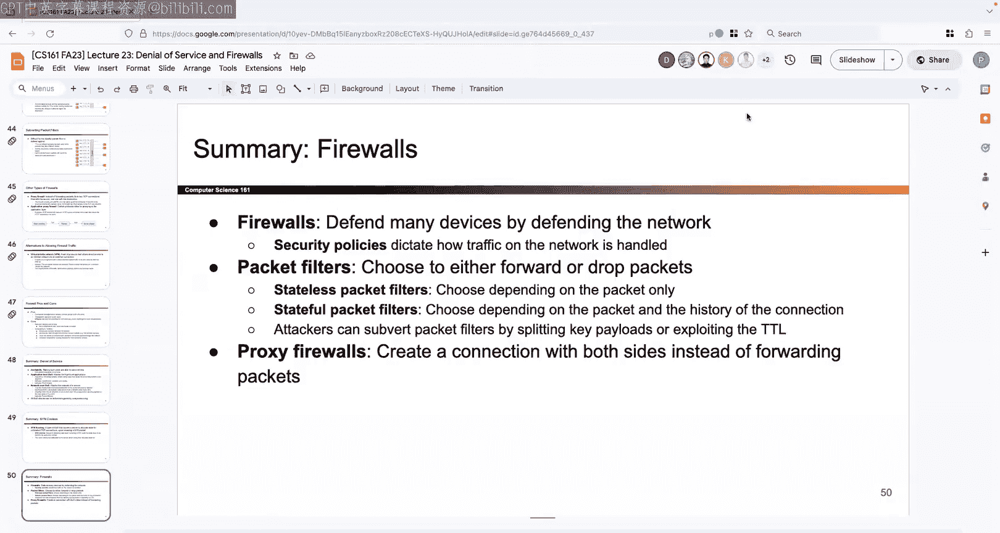

# UCB《计算机安全｜CS 161 Fall 2023 ｜ Computer Security at UC Berkeley》Calude-3.5翻译 p23 -23--CS161 FA23- Lecture 23 - Denial of Service and Firewalls.zh_en -BV1YGbceREDs_p23-

Okay， let's get started。To end the semester where there's like 10 people here I love it okay thanks for showing up Okay so last time we talked about DNS Se that was probably the last like major protocol you're going to see all semester where we spend a whole lecture walking you through how it works but I find it really cool ideas that we take DNS and then we add the security on top but we had to make it backwards compatible the two big ideas where first we're going to use signatures to cryptographically verify records so the name server signs it offline and then everyone else uses the public key to verify and then the second idea was that we somehow like inserted the idea of certificates by introducing this hierarchy or we use the domain hierarchy so that every name server can not only tell you where the next name server is but also endorse the next name server by signing their public key and we talked about how you would implement all of this in like total full detail by talking about the new record types DNS key for the public keys。

 the D and R pair of records that allow me to delegate trust。Someone else。

 and then the RsA to sign my final answers。And then finally we briefly mentioned you're not going to get tested on it in like too much detail the idea that in real life every name server actually gets split in two and so the upper half uses its key signing key signed the lower half's public key which is the zone signing key and then the lower half can sign records for all the future name servers and then finally we talked about how if a record doesn't exist we actually have to be a little bit careful and so we had to design NSSec to say if a record doesn't exist。

 you need to be able to sign a message saying there are no records in this range of domain names and if you don't like that you think that leaks domain names you can upgrade to NSSec3 which actually hashes the domain names before alphabetizing them but those are kind of the high level ideas behind DNS Se。

And it's designed。All good， anything else you want to know， that's DNS second on one slide。Okay。

So today we get to start kind of the end of the class like the home stretch most of the lectures from here on out are just kind of like special side topics so we're not going to talk about a whole protocol front to back but we're gonna talk about things that are still really important don't get me wrong we could probably teach a whole class on either of these topics but we're just gonna give you the high levell overview and then you know if you're interested you can go explore more okay so that's the end of the class kind of a survey of all the stuff that we wish we had time for but didn't have time for and so here we are going through them okay so the first thing and it's really important but it's something that we haven't really talked about in detail yet it is denial of service and again this could like fill a whole class but today all use is to fill half a lecture okay。

So this is one of those properties that we've mentioned a couple times but we haven't really dived into and so it's the property of availability which is if I have a service that I want users to be able to access I would like them to be able to access it and the denial of service attack a tax availability by trying to make this website or the service unavailable for the people who really want to use it and well there's like tons of reasons why you might want to do this so maybe you want to do it it's kind of like the same as all the reasons for lecture1 so you could do it for profit you could do it because it's like a rival company you don't like you could do it for a political statement you could do it for censorship because you want to just have fun all sorts of different reasons but these are all the tax on availability and the idea is that I don't want legitimate users to be able to access someone else's service so I'm attacking the service itself and this happens like all over the place I can probably like go online and find all sorts of different articles Here's one from I don't know is that 12 years ago but。

Baically shows that you can like pay for D services so one option is to make someone else do it for you that's like you know security is economics or something here's one from I guess 2005 but it still happens so there could be like extortions or somehow someone like takes your website down and says you know give me all of your secrets or the website is going to stay down or like pay me this amount of money or else your website's going to stay down so there's like all sorts of stuff you can do this stuff comes up over and over again i'm sure you like you've seen it in the news too if you follow that kind of stuff。

So today we're going to talk about how you would execute these attacks and then maybe ways the depend against it and we'll see a couple of like really specific examples just to illustrate why these are dangerous okay so to me there's kind of two categories of a denial of service attack So the first category is the program that's running the service is somehow broken so I'm going to somehow force that program to like crash and if the program crashes then nobody can access it so this could be something like maybe the program is written in C and there's some buffer overflow and you can use it to like shut down the program or just like crash the program and now it can't run maybe there's some like SQL injection vulnerability and you like delete the entire database so these are flaws of the program itself the program itself has some way for the attacker to cause the program to stop working or shut down and so that's one possible way you can attack a program or a service and then the other way you can attack is called resource exhaustion or that's what I've called it which is the idea that everything has。

Limited resources so there's no such thing as infinite resources and so whatever limit there is whether it's like computation or network bandwidth I can somehow overwhelm that and if i'm using all the resources and the computer like runs out of memory or is no longer able to send any more packets because it's like sending as many packets as it possibly can already then maybe legitimate users are going to time out or somehow error when they try to visit the website so one idea is we can crash the program that's running the other idea is we can somehow overwhelmedw the program so it runs out of resources so those are kind of two possible categories like attack vectors and so we'll look at them both。

So in both cases or I guess maybe in the second case in particular。

 this is the idea of a bottleneck which we'll see a couple times today and the idea is that maybe your program has a bunch of different moving parts。

 so maybe it's not just single program running maybe you've got like a database and you've also got the program itself and then you have all these other side programs that are doing other things so your system could be really complicated and so maybe someone will try to do denial a service on all the different parts but really a lot of programs have something called a bottleneck which is I mean maybe you're for the term before and even nonsious context but the idea is that the bottleneck is the place for the resource limit is the tightest so this is the place where it's easiest to overwhelm because the resource limit is small and if I overwhelm the bottleneck and that could cause the whole program to go down well then maybe that's a place where the attacker wants to target so maybe an idea you've seen before maybe one we'll see today okay so we talked about two different ways we can attack something we can attack the program and crash it。

we can overwhelm the resources by trying to target some bottleneck and then there's another kind of axis along which we can make decisions and so this axis says well what layer are you actually targeting so when we run a program we know it runs on all these different layers we've seen the whole networking stack before so we could target the very highest layer and target the application itself so this would be like target the program itself that's running targeting the resources on my computer that's running the program so that would be like application level but then we could also maybe target the network itself and somehow target one of those lower levels to overwhelm the like network protocol so I can make a choice here decide between application or network the layer that I'm attacking at and then I can also independently make a choice between am I going to try to overwhelm the number of resources that are available or am I going try to somehow crash the protocol or crash the program by exploitting some fl so those are all choices that you get to make if you're trying to figure out what these attacks are how to defend against。

And hopefully not how to execute them， but I guess we'll show you some approaches here Okay。

 so i'll start with application level and so here I want to target the resources on the application so this is like the computer running the program or the program itself and this is different for any program that i'm running but something that a lot of these attacks have in common is the idea of like asymmetry and so the idea is that。

If I'm trying to overwhelm the amount of resources well maybe the attacker doesn't have access to a ton of resources So how are you going to attack the server if you don't have a lot of resources yourself。

 you're gonna to have to look for places where there's assymmetricmmetry where the attacker only has to spend a little bit of resources but they can cause the server itself to consume a lot of resources so this is an attack that's cheap for the attacker to implement。

 but super expensive for the target that's the kind of thing we're looking for could be other attack out there that maybe more symmetrical where the attacker has to pay a ton and then the server waste the kind of resources so those might be more symmetrical but those would be more expensive for the attacker so the attacker likes the ones that are asymmetric the attacker pays a little bit but the server consumes a lot so there are a lot of different examples of this so here are some examples of programs that we don't want the actual server to execute I haven't told you like how you'd make the server execute stuff like this but you can imagine there are programs that like exhaust the。

File system space so these are examples of resources that are limited so every computer I don't know about you。

 but like my computer has a limited amount of space on it。

 so if I just start writing a bunch of garbage to the file system maybe that will exhaust the amount of space on my disk I can also exhaust the amount of memory so every computer only has a certain amount of like working ra memory so if I try to mal something massive that could like maybe crash the program or cause the program to run out of memory every program you can take like an operating systems class maybe there's limited to the amount of threads that you can run at a single time in parallel so maybe I can like。

Try to exhaust that start a bunch of different processes a lot of disks also have like limits on how many things you can read or at a given time so maybe i'll try to like open like a million files at once or try to like write all these different places and maybe that will also cause the disc to complain so these are all just like high level ideas of how you might or like what you might want to do as part of an attack although I haven't said like how you would do these we can imagine those are all ideas that are out there okay。

Here's one I find really cool and I find even cooler Does everyone know like I got roped into to teach 61 B this semester which is our data structures class so I got to see merge sort in Quicksort in like way more detail than I ever wanted to remember but okay so this light has like special meaning to me now I guess but it's still really cool especially if you take a class like that and so maybe you remember and I just spent like two lectures proving to a bunch of like little kids or freshmen or whatever that merge sort is n log n in expected runtime and worst case so in other words。

 no matter what you throw a merge sort it always runs at n log n time and I finally like remember what the proof of that was you don't have to for this class but I had to so I'm telling you that okay and then you might remember there's another algorithm called QuickSo which also sorts a collection of items and this one if you give it a random set of inputs it's n log n expected runtime however if you give Quicksort a specific array and does' anyone even remember which one it is sorted array then QuickSo takes n squared time。

To finish or if you give an array that's like sorted but backwards， it's still n squared time。

 So in other words， merge sort is n log n no matter what you throw at it。

 Quickword is n log n with overwhelming probability on random arrays but it is n squared if you choose a really bad array and so the idea is that well if somehow like someone's running like a sorting service I don't know why they would but maybe they're running a sorting service and they allow users to input whatever things they want Well maybe an attacker who's trying to exhaust the amount of resources。

 they could like intentionally give the sorting service an array that's already sorted or an array that's sorted but backwards and that would cause quickword to run an n squared time So this way I'm causing the server to run and use even more resources by giving it a specially chosen input that I know causes worstcase runtime on certain algorithms so that's a really cool attack from 60 UMB you don't have to know this but like I was looking it up and I found out that apparently。

On your implementation of Quicksortt， you can actually come up with specially designed arrays that cost nquad runtime。

 so even if you use like different variants of Quicksortt。

 there are still algorithms out there that apparently like specifically target Quick sort by giving it worstcase arrays and there's like a whole field of theory out there if you're curious but the takeaway is that if you have a problem like this。

 you're trying to put out a sorting service to the world and you want to choose the sorting algorithm that is safest then maybe there's an argument that merge sort is safer because no matter what you throw it it's never going run in really slow n squared runtime it's always a safer n log n so even though maybe like in practice you might prefer quicks because it's faster on average maybe in the case where you're worried about a attacks maybe merge sort is the one you want to go with so it's an open question depends on what service you're running that's the idea behind the algorithm of complexity attack supplying inputs that caused the worst case runtime which could be really bad and maybe。

Use up a bunch of resources or use up a bunch of time。Okay。Pretty cool。

So those are just kind of some ideas behind maybe ways that you could implement denial of service attacks so now let's talk about ways you might defend against them so one thing you should do is you need to somehow figure out that you're being attacked so that's actually easier said than done and we'll see this again throughout today but first you have to figure out that someone is trying to exhaust your resources and that might not be totally obvious maybe the request looks legitimate but that you start getting more and more and more and you're like wait a minute this doesn't look so legitimate after all and so somehow you have to even figure out that someone's trying to attack you and how might you do that well it's not super obvious maybe somehow you want to force every user to like log in before they ask you to perform some service and then maybe if a single user keeps like spaming you with request you're like wait a minute that user is trying to do something nasty and trying to like cause me to exhaust all my resources so maybe somehow you have to like tell everyone to authenticate themselves and then try to figure out which users。

or being bad which users aren't， maybe that's the thing you want to do。

 but even then you have to be careful with denial I service as attacks tax the authentication service itself。

 maybe some user tries to or some attacker tries to stamp a bunch of login requests and now you're spending all this time performing hashes or something maybe that's also going to cause you to exhaust resources so you have to be super careful because any part of your program that you allow users to interact with could be vulnerable to something like this。

Other ways you could defend against this are you could try to use ideas that like isolation or quotas and basically the idea is that you don't want one user's actions to affect other user's actions so if one user is scanning you with requests that should not cause you to make your entire service go down and suddenly other users can't use your program so maybe somehow you like separate the service out so that or different users using different parts of your service maybe that's something you can do depending on what you're building another idea is that maybe you can only give every user a certain amount of resources and maybe that's limited so you can say okay today know if I'm building a sorting service today you can sort know 10000 things and that's all that I'm allowing you to sort and there's no more and so maybe that's one way to stop people from overwhelming your system you give everyone a limited amount of resources that they can consume like per day or per hour and once they use that all up no more for them something else you could do is maybe you could say only users that are trusted so maybe they have to。

Sign in or they have to have a verified email or something and only those users that you trust can execute requests that are expensive and everyone else cannot so those are all ideas that you could take with you if you're trying to defend defend against these attacks okay。

😡，There's more so something else you could do is you can maybe make the user spend some resources before asking you to do something and so here we're gonna to try to make those asymmetric attacks a little bit less asymmetric so in general there could be attack that exploit asymmetry where the attacker pace just a little bit and is like hey please generate 10。

000 random numbers and then now you are stuck here like generating a bunch of random numbers and wasting a bunch of effort but maybe you can make the attacker life harder so instead of just having the attacker say 10000 random numbers go and you have to do a bunch of work you could maybe ask the attacker to do something expensive as well so maybe the attacker has to now solve a capcha which we know either takes time or money maybe the attacker has to somehow like do a certain amount of work before you do the work so now the attacker has a harder time forcing you to do a bunch of work so that's a possibility people call it proof of work and then there's also another solution which always works but it's kind of silly which is what if you just have。

gigigantic amount of resources so if I just somehow pay for like infinite compute then an attacker can no longer overwhelm my resources so why not just do that all the time well because it costs money so if you want to have a gigantic amount of resources that's going to cost you money and maybe that money is not worth it if you're not that concerned about do attacks so you have to think about your threat model what kind of people are going to be attacking you is it worth paying for like you know billions of gigabytes of storage if you're just worried about very rare attacks or if there are no attacks at all so it depends on your threat model and。

Maybe if there's something you really care about then maybe this is something that you want to do so for really big services out there like I don't know Google or something。

 maybe they do over provision because they care about going down quite a bit I dont know don't work for Google so you'dt have to ask them okay quick final note on this slide is sometimes if you don't want to overpro because that's gonna to cost you a lot of money you can use something called a content delivery network which I find really cool and so the idea is kind of like insurance does everyone know how insurance works everyone go to like being adults and thinking about insurance so the idea behind insurance is that we all pay a little bit of money and it goes into a pool that the insurance company collects and then if one of us I don't know like suffer some sort of accident or like knock on would we don't but if one of us gets into some accident that's super expensive well then the insurance company is going to take that pool and then like use it to help who got into the accident help them out or help them recover whatever they lost and so the idea is that we all pay a little。

To minimize our risk it goes into a pool and then whoever gets unlucky they get the pool that was collected and so that's the idea behind insurance so the idea behind a content delivery network is kind of the same every one of us that has a website we all pitch in just a little bit of like money or resources and then it goes into this big pool that's managed by some company like Cloudflare does this for people and then the idea is that if someone tries to attack and we take that big pool of resources that we've all teamed up to create and then we allocate all those resources toward whoever is getting attacked to try and help them out so it's kind of like an insurance scheme everyone tries to minimize their risk by paying just a little bit but because there's a lot of us we all team up and we get a lot of resources together and then that big pool of resources can be like dynamically allocated toward whoever needs it so that's pretty cool okay if you're interested I'm sure Cloudflare has like a blog or something you can read but that's all you have to know for this at least。

Okay， that's it for things that are happening at the application level where I'm overwhelming the resources on a computer itself or the server itself。

 anything you want to know before I talk about the network level。

 so now we're going to talk about networking protocols how to break those。We've been on Zoom， no。

 okay。Time for some network level attacks so now instead of attacking the program itself。

 which is what I've been doing so far like maybe the program itself was sorting and I give it a bad input well now instead I'm gonna to start attacking the network itself so I'm going to think about the protocols at the lower layers and think about how do I attack those so that the victim or who it is that I'm trying to attack is somehow like going now struggle to like access the internet I do that so there's a bunch of different ways I can do this as well so you could think about trying to overwhelm the victim's amount of resources and when we say resources we have to be a little bit more specific so we could say well maybe the victim only has a certain amount of bandwidth so it's like maybe I can only download this this amount of data per second or maybe I can upload this amount of data per second so if I spam the victim with a ton of like upload and download requests maybe the victim's going run out of bandwidth and now is no longer able to upload or download requests from other users that's a possibility or maybe somehow。

Vtim's networking protocol has a certain limit to the amount of packets it can process so maybe as the IP packets like to start flying in the victim's computer is only able to process like 10 per second or whatever limit and so in this case maybe if you send it a lot of really small packets you can cause it to like log jam get a traffic jam and now it's unable to process all the packets in time and then when the legitimate packets come in now they're stuck waiting as well or they get dropped that would be bad okay。

Maybe when you think about denial of service and you see it on the news or whatever you don't see like DoOS but you see Ddos you see that extra letter in the front So like what does it stand for so it stands for distributed denial of service and so here the idea is that it's not just one attacker trying to overwhelm the victim it's multiple attackers or one attacker with multiple systems all trying to target the same victim so this will be the picture of a denial of service attack that's like distributed so you have a lot of different people all attacking the same service and so this one is really powerful and this is why you see this in the news all the time so why is this so dangerous well this one' is really dangerous because if an attacker has a bunch of systems at their disposal well first of all now the attacker super powerful because they have access to all these different computers and machines that can all attack the victim at once so maybe in this case the attacker has the advantage they've got a lot of bandwidth and then something else that's really hard now for the victim is now there's like。

Data coming from all over the place so maybe it's not like before where there's just a single person sending you a bunch of requests and maybe you just tell them like okay no more for you and then everything is good but in this case the spam or the overwhelming packets are coming from all different directions they're coming from everywhere and so now the victim has a really hard time telling is this packet good or is this packet coming from one of the like 10 different attackers and that's a lot harder to tell who's an attacker and who's not so this makes it really hard for someone to depend against it and so one thing you might ask is how the heck is an attacker going to get this many systems under their control and well there's lots of different ways for that too so maybe they like paid to get a bunch of systems under their control if they have the kind of money for that something else they could do is maybe they have some sort of attack that they can execute on like a bunch of different computers and then all the computers are part of their control so they have this big army of computers that they compromise using the same attack and then the attacker。

and be like okay like army of computers like attack and then they all like start sending packets to the same victim sometimes people call that a botnet where all the computers have fallen under the attacker's control now the attacker can tell the entire army to start flooding a single victim so those are ideas behind Ddos and the reason why it's so dangerous and so hard to defend against is because traffic is now coming from all different places and not just one place okay。

So more kind of popery about denial service， you can see this lecture is kind of just showing you a bunch of different ideas that are helpful and maybe not like diving too much into any specific one so before we talked about asymmetry and so we said well it would be really nice if the attacker just have to spend a little bit of money or a little bit of resources and then cause the victim to have to spend a ton of resources so an example of this would be like I'm not gonna to do this but you can imagine some like really evil instructor could be like okay all of you your homework is to like go home and start like copying the dictionary or something like that so how much work does that take for me like not much I just have to tell you to do it but then how much work does it take for you like a ton because now you're at home copying the dictionary don't actually go home and copy the dictionary but that's an example of asymmetry or amplification so here's another example that actually uses one of the protocols that we've seen which I find kind of cool and so the example from here is called DNS amplification。

And so the idea is that like think about the DNS protocol when I send a response or when I send a request how big is that request it's pretty small。

 that's just a single record that says what's the IP address corresponding to this domain name so it's really small it's a tiny request but then do you remember those responses that came back were they bigger well yeah there were a lot bigger because they said things like oh here's the next name server and here's like 13 different NSS records and here's 27 different a records so you might remember you might remember those responses tended to be a lot bigger just in terms of amount of data number of records compared to the requests so could I somehow use this to attacks on well there's one thing we could do which is I know that the request is really small so to send a request takes me no effort at all but then the DNS name server sends a really big response in response and so somehow this DNS name server it's like an amplifier it takes me just a little bit of data or returns a ton of data。

So it's amplifying the request and you don't have to be the person to do the amplification because the DNS name server is doing it for you so well what can I do with this well if I don't have the DNS name server amplifier at my disposal I would just have to send a bunch of packets to the victim and that means that totally symmetric so every extra packet I send is an extra packet to the victim response or receive or like if I send 10 bytes the victim receives 10 bytes there's no asymmetry everything I pay is the same thing as the victim pace but if I could leverage this amplification from the DNS name server maybe I can somehow send as the attacker send like 10 bytes but then cause the victim to have to receive like1 thousand0 bytes that would be amplifying my response so how do I do it how do I get the DNS name server to send a really big amount of data to the victim without me having to consume a big amount of data myself so the idea is to spoof so if you look at this packet。

This packet is spofed because it's really coming from the attacker but the attacker is lying and saying it's from the victim and so it goes to the server and how big is this packet it's really tiny it's just a small little request the DNS name server gets this packet and says oh I got a question time to answer it and so who is the DNS name server going to send the answer to this is the whole idea behind spoofing right as we go back to the attacker no because the attacker lied about where it came from。

 this response that is sofed is going to the victim instead the victim never asked the DNS name server a question but they're still getting this gigantic response because of this spoofed request so the attacker sends a request it's really small and is sofed and the DNS name server sends a response that's massive 27 records another 13 records all of it goes to the victim so here we're exploiting asymmetry to amplify the power of our attack。

s prettyty cool okay， questions about this one， this is one of like two schemes you'll actually see based on actual networking protocols today。

 okay。So that's pretty cool so what are some good things about why you might or why an attacker might do this like what are the advantages well we already saw one of them which is the attacker pays just a little bit like sends one record but then the victim receives like 27 records in response so the attacker is able to amplify the attack and you can also imagine that a DNS name server probably has a ton of capacity because it's out there answering these questions all day so sometimes you can take advantage of these servers out there that not only amplify but also have tons of capacity and so you can make them do all the heavy lifting and make them send all the garbage data and garbage packet is to the victim so that you don't have to do it yourself and the other kind of benefit that you get from this is now the attacker well the victim I guess doesn't really know who the attacker is because like look at the packet the victim receives it says from server to victim and I look at this and I'm like wait who's attacking me is the name server attacking me well not really the attacker was doing it but the victim according to this。

G at least has no idea who the attacker is so in some cases you can even hide who the attacker is for example。

 when you do the DNS boing attack but I suppose it depends on the specific attack and sometimes you can conceal who the attacker is because the packets look like they're coming from the amplification server even though the attacker was the one who initiated all being tax okay。

So why not just do this all the time why don't attackers just always do this all the time Well one problem is that you have to be able to spoof we know it's possible in theory but maybe some networks blockpoof packets so you have to be a little bit careful for example if you're an offpath attacker then TCP spoofing is hard that's something we already saw so you have to be able to do this spoofing here we were using UTP so it wasn't too bad but you can imagine that if I was doing TCP and spoofing is a lot harder because I have to get that entire handshake rate and that's like from the TCP lecture okay。

Amplification pretty cool so now let's talk about how you would defend against network level attacks So one possible idea is because these are happening over the networking layer and I have all these packets streaming in and I have to figure out which ones are good and which ones are bad Well maybe I need to somehow come up with some sort of filter that says these packets are good these packets are not and so I have to design this thing and how would I design it like what would the filter do and that's kind of a difficult question and we'll see why it's so difficult probably in a couple slides but somehow I want this filter that tells me these packets are good they come from real users that packet is from an attacker trying to do with do attack so I'm going to reject this packet that accept this packet but how do I know which packets are from legitimate users and which ones are from the attackers turns out that's not so easy sometimes and the other problem is that the packet filter itself could be the bottleneck so what if the packet filter is doing something super expensive to check of a packet is good or not and then。

Well a bunch of packets and the packet filter itself like craps out or just runs out of memory Well now the packet filter itself is also vulnerable so somehow this defense that I added to stop do text the defense itself could be dust so you have to be really careful everything has limited resources and so you have to be careful okay I realize I said you have to be careful twice but it's true okay other things you can do to subvert packet filters is the attacker so how might the attacker try to get around this packet filter well one thing you could do is you could sort of spoof packets so even if I'm not doing any sort of amplification attack I'm just sending a bunch of packets I could still spoof them and lie about where they're coming from and now the packet filter has a harder time telling which packets are good in which packets are bad because all the bad packets are coming from all these random Is so that can be harder to defend against Another idea is if you use distributed denial of service or Ddos in this case you don't have to spoof and lie about where it's coming from because the packets are。

be coming from all these different places so even if you don't lie about where the packets are coming from they're still coming from all different places and now the packet filter has to be really smart to figure out which packets are good and which packets are part of a denial service attack so it's pretty tricky okay。

As before there's still a defense that always works at the application level。

 at the network level at every level， and it's just over provisioned so just go out and buy a ton of equipment so that no one will ever have the bandwidth to overwhelm your network and again。

 why would you not always do this because money it costs money and maybe your threat model says it's not worth it to pay all this money。

 but it's a possible option out there or you can use a content delivery network like Cloudflare and we can all play insurance and like pay a little bit and then have someone else over provision。

 but that's always a defense that's out there？Okay。

So those are all kind of high level ideas behind denial of service。

 why it works approaches that people would take defenses that people might use so I'll show you just one example that's like really hammered out and like it's a full protocol or not protocol I guess but a full attack on a protocol just to give you a flavor of what these attacks are like so here I'm going to try to exploit TCP and so the idea is remember this TCP handshake it's it's a threeway handshake the attacker sends a sin the server sends a syn act the attacker sends an act okay it's all good stuff we've seen it before and so。

You can also imagine this thing is super common。 Everyone uses TCP all the time and you can also imagine that when this TCP handshake gets completed or like when it's starting up the server needs to allocate some memory if it's like running in some program it's got to allocate a little bit of memory so that it can store things like the server needs to remember wait what was the sequence number that the attacker gave also what sequence number am I choosing so I can start counting out myself maybe I have to store some memory to keep track of data that's like streaming in but hasn't been processed by the user yet and so there's a lot of stuff that the server has to remember as soon as this TCP connection starts running so every TCP connection has to have some amount of memory allocated to it so that the TCP connection can use that memory to write down things that it cares about like sequence numbers or like hey this piece of data just came in and the user hasn't requested yet I'm gonna to hold it here for now stuff like that and so the idea is that what if the attacker forced the server to start like 20。

Different TCP connections100 different connections a million connections Well now the server has to remember the sequence numbers for 1 million different TCP connections and that could be a lot of data to remember maybe the server runs on a memory before it finishes remembering all the stuff from all these different connections So that's the idea behind overflowing or overwhelming TCP but this seems kind of symmetric because for every connection that the server remembers you're like wait a minute doesn't the attacker also have to start up that connection So if you want to make the server remember a million TCP connections doesn't the attacker also have to start a million connections isn't that really expensive for the attacker to like where's the asymmetry so here's where the attacker is gonna make this attack possible and more practical by exploiting asymmetry So the idea is if I look at this handshake who goes first the attacker is the one that goes first and then when the server receives the response the server is the first one to remember data。

So if I look at this picture， the attacker says I want to connect here is my sequence number and immediately upon receiving the sin the servers got to say okay I got a sequence number Time to write it down time to generate my own sequence number and write that down to so as soon as the attacker sends a syn packet the server is now obligated to remember a bunch of stuff even though the handshake hasn't finished yet the server right here after the first step is forced to like allocate some memory okay so how's the attacker gonna exploit that well the attacker knows that none of these connections are ever gonna be legit so what does the attacker ever have to remember these numbers well maybe the attacker doesn't so what if the attacker just sends the sin now the server is sitting there like okay I got to allocate some memory and then I'll reply with the Sinac what if the attacker just number X these connections don't have to actually finish because by the time we get to this step right here the server is already allocated the memory send to the synac and is like okay I've got this space already for your brand new TCP connection。

I'm waiting for you to reply and well attacker doesn't have to reply the server might just be sitting there with all this memory and if this happens over and over again then the server gets totally overwhelmed so the reason why it's called SIim flooding is because the attacker sends nothing but S packets over and over again forcing the server to think oh shoot I'm so popular like a million people want to connect with me and start connections the server has to start and allocate a bunch of different memory spaces for each of these different connections but the attacker knows in reality none of those are ever finishing so the server has to allocate all that space but the attacker who knows none of these connections are ever finishing can just send a in and then forget a better right away so the attacker spends a little bit of space just then the Simp packets doesn't have to remember anything but then the server is totally over has to remember all the different connections。

Okay。Sin flooding is pretty cool Okay， how would you stop this Okay as usual。

 there's always the same defense over and over， which is I will simply have enough space for a million connections if you think that's the defense you want to do。

 it is out there but again cost threat model all that good stuff another possible idea is what if I somehow do some filtering like can I somehow like say this TCP connection is legitimate and this one's not but like that's kind of tricky because if I look at this connection this connection has a total of one packet and what is the packet contain a sequence number So if I show you a packet with a sequence number and I ask you is this a real user or is this an attacker what are you gonna say I don't know it's kind of tricky to tell because there's no data in here how do I know if this is an attacker sending me garbage or a real user trying to connect I don't know because all I have is a single sin packet so。

You could definitely try to filter but filtering will be pretty tricky because it's so early in the connection that you don't have any sort of signal as to like is this a good connection is this a bad connection so it's kind of tricky and again all the same problems from before apply someone could overwhelm the filter the attacker could spoof the addresses so that the filter has a hard time telling who's legitimate and who's not all those same problems apply but there is a defense that is especially targeted towards sin flooding it's called sin cookies and so the idea here is I don't know why they call them cookies not that I think about it。

I guess you can think about it as we're gonna to send a little bit of state back to the attacker if you want to think of it that way in the same way that cookies store state by sending things back and forth。

 but basically the idea is that the server is going kind of say okay well you made me go first and allocate memory but actually I'm not gonna to do that I'm going make you allocate memory first so the attacker is going kind like reverse it and make the server sorry make the attacker go first and if I make the attacker go first then now the asymmetry that makes this attack possible it's going to be totally gone so here's what it looks like here's like a conceptual picture and then we'll make it real。

 I guess a little more slight okay so we already know that before the client would send us into the server and at this moment in time the server is obligated to allocate a bunch of memory because the server has to prepare for the connection to finish so in other words the server is going first but what if the server didn't go first what would that even look like。

SoAt this point the server is obligated to remember a bunch of stuff and that costs memory。

 but what if the server said actually I don't want to go first， I'm going to make you go first。

 what would that look like well what if the server says I'm not going first。

 I'm going to send all that stuff back to you so whatever stuff the server had to remember whether it was a configuration information or sequence numbers or act numbers。

 the server is going to say I'm not foreign that， I'm going to send it back to you the client。

In the syninag and then the client， if you really intend to finish if you're not just sin flooding me and you really want to finish this connection then you should send that stuff back to me instead So in other words。

 I'm forcing the client to go first and at this point the client's gonna to have to start up and store all the state and only then is the client going to send the state back to the server and then at this point the server is ready to actually allocate state because the handshake is done and the connection is ready to start up So all that I've done is I've taken the state that would have otherwise been stored here at this first step and I fired it back at the client and I said I'm not writing this stuff down like you write it down and send it back to me and then the client sends it back and only at this point is the server happy saying okay this connection is probably real so at this point I'm going to start and write all this stuff down allocate the memory and so now the idea behind asymmetry is gone because what happens if you flood a bunch of sins over and over again the server just says I got a sin I'm not gonna allocate memory the stuff that would have。

I'll send it back to you and you remember it and so the server never actually allocates any memory until this final step is done so now Sthle doesn't work if you still want to overwhelm the attacker you actually need to also create a bunch of connections yourself and so now that's going to become more expensive for the attacker and the whole asymmetry is gone。

Okay。That's a S cookie。 That's the nice version of it。

 But of course I cannot go in and modify TCP for the same reasons that DNS had to be backwards compatible。

 I cannot go into TCP and say， oh， there's suddenly a new state。 can I do that。

 that's gonna break all the TCP。 So where do I put this new state I have all this stuff I want to remember like where does it go So here's why people actually do。

 here's the syn packet And instead of sending back some extra state that I can't just like add to TCP because there's no place to put it I'm gonna put it in the sequence number That's kind of cool So the idea is that instead of coming up with any random sequence number I'm gonna to somehow take that stuff that I really wanted to remember and put it inside the sequence number we know the sequence number is just a bunch of ones and zeros and usually they're chosen at random but who said those sequence numbers can't represent some extra stuff that I care about maybe they can So somehow in those ones and zeros。

 you can encode the information that you care about and then。Where's the extra arrow。

 the client can send it back to you and then you can look at the act number。

 extract the information that you care about so that's what people might do in real life。Okay。

 so this is basically the same as before， by the way。

 the only difference is that instead of having this magical new state that appears out of nowhere。

 I instead have to put the state inside the sequence number and we know that's okay because the sequence number has this like 32 bit series of ones and zeros。

 I could use it to represent some information if I felt like it， so that's what the server does here。

Okay。So why is this so useful， well the reason again why this is useful is because the attacker now has to be the first one to they have to go first。

 they have to store memory and allocate memory first and the server is not going to just store memory or allocate memory on every sin。

 it's going to wait for the whole handshake to finish okay。

I think that's mostly it for sin cookies it's the one attack you have to know for today anything you would like to know about it it's probably the most complicated part of today as well so。

Anything else you want to know？Okay。Kind of cool I like it Okay end the first part so it's your last chance to ask do questions at all。

 otherwise i'll talk about firewalls for the last 35 minutes and then we'll be done。O。Cool。

 it's like about firewalls It's kind of a separate topic So even if you fell asleep during Dos。

's okay this is a different topic we'll start from scratch So what are firewalls。

 why do I care about them and so the reason why I would care about them here's like the setting that I'm gonna to use and then we'll talk about how you might build something So the setting is you are somebody managing a company it's a really big company and you would like to protect a company against external attacks So there could be all these different people who want to attack your company and you would like to stop everyone from the outside from attacking your company and so why is this so hard you're like well that's not so bad I'll just go around protect all the computers but why is that so hard well one problem is that how do you know how many computers are there like there are there could be like hundreds of computers in your big company some of the computers could be really old and outdated maybe they don't have good security maybe some computers are operated by people who just aren't security aware they don't have the right stop。

Where they are going around clicking on malicious links all day， right？

How do I protect all these different people they have different hardware。

 they have different software， the operating systems could be different。

 some computers could be so old that you're not able to update them。

 there could even be computers that you just don't know about that are in this network so I have this huge gigantic local network of all these computers and I want to stop them from being attacked from the outside so how do I do that I could go around trying to secure every single machine or I guess somehowtra to scale or make the scalable and secure the entire network with one system。

So that's my new goal， which is i'm not going to go around securing every little service one by one。

 I would like to secure the whole network one at once， so this is what it's going to look like。

So there's the firewall I guess this is also I don't know this is super relevant anymore but like back when I did this a couple years ago。

 I would always tell people like this is one of those points where people always like to this is by a super off topic but people always like to compare like CS topics to real world and be like oh this is just like real life whatever and while I think it's like true sometimes I don't think it's always true and this is one of those cases where I don't think it's true so I do not endorse this but the solution that we're going to use to secure the entire network is we're going to like build a wall okay like very 2016 of me to say that but we're going to build this wall and it's going to be a great wall and it's going to stop everyone from the outside from attacking the services inside I do not endorse this in real life but that's what we're gonna to do and so the idea is that there's gonna to be a single point of access and so all the machines from outside like the entire rest of the world if they would like to access or talk to the people inside the network。

They have to go through this single checkpoint right there's this absolute wall and everyone has to go through the single checkpoint in order to access or send packets inside the network and that single checkpoint we're going to call it the firewall and this actually is relevant or we can think of the security principle like complete mediation right the idea is that there could be all these different ways to get into the network but I'm going to enforce that every single person has to talk to the firewall first if they want to enter my network and that way I can check who's being or who's an attacker and who's not okay。

And this is gonna protect the entire network remember that like in this local network if they want to talk to the rest of the world。

 they also have to pass through the firewall first so everyone is mediated through the firewall and so this structure works just fine and the only question left to answer is what does the firewall do right the firewall is sitting there it's some program that you're not gonna have to write and the program is specifically gonna have to say I just receive this input from outside or someone from inside wants to send this packet and the firewall just has to judge and say is this allowed do I let it pass or is this not allowed do I not let it pass and do I block it and so the last thing I have to implement to make this firewall totally work is I need to write the code sitting inside the firewall what does it allow what does it not allowed and this depends on your threat bottle so if you think that anything goes the firewall could just be like yep everyone goes through if you want to be super parallel you can say oh nothing goes through in reality you probably want something in between。

Youd have to come up with your threat model and figure out like what is a good threat model。

 what attacks am I trying to stop who's trustworthy。

 who's not in particular one thing that we already assumed when we built this threat model is we assume that everybody inside is trustworthy and everyone outside is not that's why we want everything from the outside to go through this checkpoint because we think all these people inside they're all trusted I don't want anything from the outside that's an attack so the firewalls going to check everything from the outside so we've already kind of thought about a threat model but if you have different threat models you could certainly design the firewall differently anyway that's the structure we're going with so now let's think about what policies could I use there's actually lots of different ones out there so you can pick whichever one you want here's an example of one that you might choose so。

Maybe the firewall says what do I do with packets that are on their way out they're coming from the inside and they're going to the rest of the world you could do whatever you want here。

 you could like say oh I'm gonna like flip a coin and deny it half the time be very strange but you could but one policy that people sometimes use is if it's outgoing I'm just going to allow because what did I say in my threat model my threat model says everyone on this side of the firewall inside the network is trusted so if something is going outbound it's coming from the inside going through the firewall it's probably coming from someone I trust so I'm just going to let it go if it came from inside it trustworthy。

 I'm going to let it go if you don't like that you think some of these people are malicious。

 you can change your threat model but a common threat model out there is that everyone inside is trustworthy so outbound traffic is okay okay that means also that anyone inside can connect to any service。

So you can connect to any website you feel like and if you don't like it change your policy okay what about inbound Well what about the packet coming in this way now you have to distinguish what's good。

 what's bad， what is allowed， what's not and so now you have to pick some rules So here's a possible set of rules that you might consider which is I'm only going to allow inbound messages if they are a reply to something that was outbound so like if someone inside sent a letter to someone outside and then someone else has send a reply I'm going say that's okay's a reply to someone that I trust so I'm gonna assume that's okay maybe there are some services that you're okay with so maybe like if the connection is run over SSH you're going allow it it's kind of up to you and then maybe you could say everything else is not okay So if someone outside wants to talk to someone inside unproed。

 you might say nope can't do that I'm only accepting replylies to conversations that were initiated from the inside that's a possible approach again this is just an example so if you don't like it you can write。

Different rules here， but it's pretty like open ended so we can put whatever you want there okay。

 so maybe out down maybe only allow sum down and maybe deny everything else okay。

And so well again there's kind of a problem here which is that when I'm writing this code in all likelihood you are not going to write literally every single rule that covers like any possible request。

 there's just too many possible packets out there how are you going write a rule for every single packet including ones that you've never seen before so most likely your rules are gonna miss stuff so what happens if one of the packets that comes in like doesn't check off any of your rules do you allow it do you deny it you're probably going have to default to something so you can either write your policy as defaultlo which basically says everything is good except for this。

 this this this this so you're list up the things that are not allowed。

 everything else is good and so that's called default allowed and that's called you writing a denial list so you could do that and another option is you could do default deny so in this case you specify these are good everything else is not good so whichever one you like you can use。

Which one do you prefer depends on your priorities so if you are concerned about users being able to use software。

 maybe you want to do default allow because if there's a piece of software you've never seen before and the user wants to use it it would be nice to allow it by default so the user can use it as opposed to default deny where you're going to be like I've never seen this before I'm going deny it by default and now the user is angry at you so default allow is better for usability but it could be dangerous because what if the thing you've never seen before is an attack well then now you're in trouble so default allow is more flexible but more dangerous。

By contrast， if you really care about security， maybe you prefer default denied， I'm really paranoid。

 everything could be an attack， I want to be super careful。

 so I'm going deny everything except for the stuff that I know for sure is trustworthy on my allow list so that would be more conservative but it's worse for usability because what if you miss something it's going get default denied and then the user is gonna to complain at you and you have to slowly build the list of stuff that you trust which could be more work so if you're paranoid you care about security default denial I is probably better but if you care about usability maybe default allow is better so it's an open question you can go with whichever you prefer okay。

So that's the firewall that's how you might write some rules something else you could think about what the firewall is doing as a rule is you could think of the firewall as a packet filter we kind of saw this in the DoAS unit as well and the idea is that what does the packet filter do it takes a packet and has to answer yes or no do I allow this packet to go through or do I block this packet and drop it right here and disallow it so you have to make a choice for every packet that comes in you need to analyze it and make a choice so the simplest kind of filter you could possibly make as a stateless filter and here the idea is that you're just gonna to look at every packet individually so you're not going to think about the packet that came like five minutes ago or you're not going think about packets that could hypothetically come in the future you're going to say there's one packet in front of me right now I'm going to look at just that packet and nothing else that's called stateless because you're not remembering state and so that means that the only thing you can use to judge if the packet is good or not is the packet itself you can't think about things in the past don't think about things in the future just look。

The packet itself and make a decision， what's nice about this， is it simple。

 what's bad about this is that it might miss them a text so。

How might you like implement something like this or how much you implement one of our policies from earlier using a stateless packet filter so one thing you could do is if you're using TCP right how can I tell if something is a reply or not well I remember that if I'm replying to something there's probably an act flag set so if I see the act flag set on a TCP packet I could say well I'm going to look at this packet all by itself it has the act flag set so I'm going to say this packet is probably good the act flag is set it's probably in a response to something else that's one possible kind of hack way to implement this policy maybe if the act flag is not set like if someone on the outset is trying to connect to the inside what would they send they would send a S packet with no act flag you would see that and say nope I'm not allowing inbound connections that are brand new so I would see that there's a S flag there's no act flag I will deny this so that's a possibility with UDP it's a little bit harder because。

UDP doesn't have the notion of act so how you would implement this is kind of an open question or maybe a bit trick here maybe it depends on the specific UDP connection protocol。

 but that's one possible way you can implement a protocol like this using a stateless filter so again you can do whatever you want you can like say oh I'm gonna only accept packets with this flag in this flag but that's possible or that's one possible idea okay what if you don't like that what if you think stateless is too weak and you want stronger protection well this is where state full packet filters comes in and so here the idea is that I'm going to keep state which means that not only am I going to look at every packet one by one but I'm also going to remember packets in the past that have come before and so that means that instead of looking at every packet one by one that's like the packet mindset I'm gonna start thinking about like the connections because if I have a bunch of packets I can reassemble them into a connection and I can start keeping track of like data that the other person sends or data that the user from the inside sent to the out。

Outbound or data that's inbound from the other person so I can keep track of connections now and then I can think not only about every packet one by one but think about the different connections Okay i'm going to sit down because I got kind of lazy anyway。

So ultimately you still have to make the same decision， which is you get a packet。

 it's either good or it's not good， but instead of just looking at every packet one by one。

 you get to think about the packets in terms of connections which is kind of cool okay so here's an example of a connection rule that you might allow so you might say now that I'm keeping track of all the different connections I'm going to allow connections that come from this IP address to this IP address。

 but only if the destination port is 80。So that's something you could say something else you could say is you could say I'm going to allow everything right the star is like a wild card character for any IP address。

 so I'm going to allow connections from anybody as long as they're from inside the network。

 I'm going to allow those connections to go to anybody outside but only if the outside port is 80 so you could allow that too I could say I'm going to allow everything that's outbound。

 I could say I'm going to allow anything that's incoming。

 but only if it goes to this particular IP address， so maybe inside your server。

 you have all these different computers， some of them are top secret but one of them is serving a service to the outside world and it has this IP address in this port well then maybe you say anybody coming in is not good except for this particular inbound connection so if they're trying to connect to this server it's okay if they're trying to connect to any other server it's not okay so you don't have to like memorize this syntax but I find it like reasonably readable basically the stars for a wildcard INT for internal EXD for external。

So I got a new。Okay。Rules， firewall rules all good， okay。

 and again the reason why you're able to do this is because the filters are stateful now so they can keep track of connections and remember oh this packet came from this connection so it's good or this packet came from this connection so it's bad。

Okay。What else do I need to tell you about Staful packet filters they can be smarter so instead of looking at every packet one by one you can reassemble packets and PCCP like use the sequence numbers to reassemble if you're using something like HttP you can be even smarter and reassemble that to and be like oh that's a get request and that's a post requests and maybe like I'll accept post requests but I won't allow get requests so stateful packet filters can be a lot smarter if you would like to which is be more expensive to implement but it's a possible straight-off you can make okay FTB is a file transfer protocol I'm not going to talk about it but if you're curious there it is okay so this part I find kind of fun it's an example it's a little bit contrived。

 but it demonstrates how people can subvert packet filters so how might an attacker try to get around the packet filter so let's say this is my policy right there's all different policies out there that you could implement I'm going choose to implement the policy if the message that is incoming。

Contains the string root i'm going to deny it i'm going to think this person is trying to log in as the administrative user who is called a root i'm going to deny that so if I ever see a packet that has R OOT in that order I will deny it's no good everything else it's okay。

Everything else is good So for example， let's be the stateless packet filter and let's look at these one by one So I look at this one do I let it go eep because I look through the letters there's no root I look through this one looks good there's no root I look through this one problem This one says the letter root no good so I drop this packet I keep the other two and I let them go okay how might I separate this because if I look at this it seems like if someone wants to type in the word root then they're gonna get caught because I'm going find it but remember TCP。

 I can split messages across different packets and reassemble them So what if I do something like this where I send one packet with the letter O one packet with the letter R and then o and then t and what does the firewall do it looks at each of these one by one and it says well this one says o that's not root that one says R is not root not root not root So all four of these actually go through the firewall and the firewall lets them through。

And then what about the person on the other side Well now the person on the other side is gonna reassemble these using the sequence numbers and they're gonna get the word root and that's bad we don't want that so that could be one way to subvert is to split the letters across different packets something else you could do is you can send them out of order so maybe this firewall it got a little bit smart it's like actually even across different packets if I see R OT I'm going to stop and deny it but maybe the way you can get around that is you can send them out of order so I could say I'll send the O first then the R so I'll swap the order of those two and now the firewall gets even more confused because it says。

 well that spells O rot that's not root so maybe the firewall lets these packets go but then on the other side when they reassemble using the sequence numbers they do get root in a 4567 that's root okay so how would you stop this attack well now the firewall has to be smarter the packet filter not only has to have state and remember all these different packets but the packet filter also has to be able to reconstruct the connections。

So this packet filter went from just being stateless and just checking characters one by one to now having to understand the TCP protocol and understand how to piece together packets using sequence numbers。

 so this far I want had to get considerably smarter just to stop this attack。

Okay are we good if the firewall speaks TCP does that mean everything is good but here's an even stranger attack and so this attack exploits the fact that IP packets have a time to live and so what that means is that do you remember how packets take a hop or a bunch of different hops to get to its destination what if a packet gets like lost So it's going down the wrong path or maybe a packet gets trapped in a loop somewhere and gets sent like back and forth and back and forth or the packet is somehow like wanders off path and goes in the wrong direction well we don't want those packets to be stuck in the network forever So even though we didn't mention it explicitly before IP packets do have a time to live which basically says this packet is only valid for this many more hops before it's gonna to say it's at of hops now is probably just stuck somewhere or it's gone off the wrong path I'm just gonna drop this packet and they can recented if they're using TCP So every time the packet takes an extra hop we take the time to live and decrease it by one to say you have one less time step left。

To live one less time step one less time step oh you're out of time this packet gets dropped and this avoids having packets like bounce around the internet forever okay so how do I exploit this well maybe the firewall and the end host the person you're actually trying to talk to maybe they live at different distances away from you so maybe I'm the attacker I on this left side maybe the firewall is like I don't know 10 hops away from me in the nearest route but then the end hosts is another couple of extra hops away 1314 hops whatever and so maybe what I could do is well first I have to figure out how far the firewall is and how far the end hosts is and the way that I could do that is I could maybe see how long does it take for the firewall to respond to me how long does it take for the end host to respond to me and see how or like see how long they take I could also send packets with increasing TtLs to see if they reach the firewall so for example I can send a packet with TTL 10 see if it comes back if it does it means。

Reached the firewall if it never came back the firewall is probably more than 10 hopps away so that's something you could do but basically the idea is I can figure out how far away anybody is and then I can exploit the TTLs to do something like this and I can say I'm gonna to send all this crap some of it even has duplicate sequence numbers who knows maybe they're corruptive packets I don't know but the firewall can look at all of these and even if the firewall was super smart and knew how to reconstruct TCP packets if you're to the firewall and you get all this stuff what message is being sent because you have two values with sequence4 you don't know which one is right you've got two with sequence5 two with sequence6 and7 you receive all eight of these packets and you're like what's the answers that like root like what is the answer here right and what message being sent the firewall doesn't know but maybe because of the way that I set these time to lift some of these packets have a shorter time to live and they just like fall off and stop existing before they reach the end hostst。

Turs out out of these eight packets only four of them arrive at their destination and you can guess which four ROOT so now the firewall could not see the right answer because the firewall lives earlier in the network or like earlier in this sequence of network hops then the end hosts so the firewall sitting here is kind of confused but then the end host still gets root that could be possible so。

This is really tricky to defend against because these times to Live can be different so I can't just look at these and be like oh this one's short oh this one's long because I don't really know what path the packet took to get here I don't really know if it's gonna to get to his destination because the numbers can vary now and then so it's kind of tricky like how do I know which of these are gonna get there I don't really know how do I know what the actual messages am I gonna have to try like every possible combinatoric number of like oh well the first one could be an n and an R second one could be like oh and I be like N O T like nut I don't know like R IC rice maybe I don't know there could be all these different messages do I have to like check them all that could be really expensive now maybe I'm opening myself up to denial a service it's really tricky okay so all of these examples are just to show that there are a waste to subvert these packet filters and like increasingly complicated waste and if this firewall isn't like really smart it can get fool in ways like this。

Okay， and you also have to be careful because the firewall gets too smart and starts computing things really complicated that are really complicated。

 well now maybe the filewall itself could be vulnerable to denial the service。

 so it's a really difficult trade off。Okay。There are some other types of firewalls so if you don't like this you're like looking at these packets one by one and now I have to speak TCP and stuff this is just too hard so there's other types of firewalls out there they're called proxy firewalls and so here the idea is like forget looking at every packet one by one this firewall is going say if you want to talk to someone inside you can't talk to them because they're on the inside so instead if you're on the outside and you want to talk to somebody you're gonna talk to me the firewall and then I am going to form a separate connection to forward your message to the server so now the firewall is acting as a middleman it's saying if you want to talk to someone inside you can't do that talk to me first'm like talk to my agent the firewall is the agent and we form a connection with the firewall not with the server inside so now the firewall is not like trying to look at every packet one by one the firewall is the real intended destination and the firewall can look at the messages and then decide whether or not to forward them to the server on the inside so can。

I think of it as the firewall is the middleman and I'm forcing everyone outside or inside to make separate connections to the firewall and the firewall is going forward the packet instead of people on the inside and outside directly connecting another way to think of it as the firewall is just a full man in the middle so we're giving the man in the middle capabilities to edit or drop or read any packet that you get you can also do this at even higher layers so if you want to do this at a higher layer than TCP you could say outside if you want to talk to someone like don't talk to me talk to the firewall create a brand new HtTP connection talk to the firewall if the firewall thinks it's okay firewall will form a new HtTP connection on the inside and then forward your messages so that's the idea behind proxy we will probably see this again in a little bit but that's the high level idea okay。

What if you don't like firewalls or how do you get around firewalls so one thing you could do is you can use a virtual private network so I'm sure we've all used this before to like pretend we're in other countries and like watch I don't know whatever like foreign Netflix or whatever I don't know what people use this for anymore but basically what does this even do like why does this allow me to like start viewing like websites in other countries or whatever and so the idea behind a virtual private network is that like let's think back to the company example for a minute where's the company example where you are。

Okay， maybe not， okay， here you're the company example。

Maybe one of these employees like takes their computer and like goes on a business trip and now they're outside they're in a different country or whatever and so maybe now because they're on the outside。

 the firewall thinks oh you moved outside you're the attacker now you cannot make connections to the inside but the employee is like but wait a minute I'm the employee I was in your network just a moment ago I just had to like go somewhere else and so now the firewall thinks you're on the outside but you want to be on the inside so like how do I reconcile that this is where the virtual private network is going come in handy and so the virtual private network is going create a tunnel where is the VPN like okay virtual private network is gonna to create like a tunnel it's like a secure TlS connection that's going connect from that employee who's like on business trip on the outside directly through TlS to a connection or to server that's on the inside and so now any time the server or the person on the outside wants to make a request they're not going make the。

Ququestest from their computer outside because the fire alarm will block that。

They're instead going make the request through the tunnel to the server on the inside and then the VPN on the inside can now make the request So now this employee looks like they're still at home in the office。

 even though they've gone somewhere else so that's kind of how I think about the VPN there's this tunnel that allows you to connect inside the network even though you're outside so allows you to pretend like you're inside and bypass the firewall even though you're outside and that's gonna to the high level idea this is also why you can use the VPN to pretend you're like you're in a different country because you tunnel to some server in another country and then instead of you making the request directly from your country you're going to use the tunnel and tell someone in that other country to make the request for you and that's how you make it look like you're from a different country and you download I don't know whatever country is a Netflix that you're looking for okay so。

That's kind of a high level idea behind what a VPN is。

 I think we will also see this again later when we talk more about proxies。

 but that's one possible idea to get around a firewall like legitimately if you're trying to get around it。

Okay， so do quickly wrap up let's talk about what's good and what's bad about a firewall So here are some things I like about firewalls。

 one of them is that as the person managing this gigantic network。

 it allows you a centralized and scalable way to manage your network So here're the person trying to like secure this entire gigantic company with like 10 different buildings and whatever all you have to do is build a firewall and make sure that everyone goes through the firewall before they like send their packets to the rest of the world and now you've secured the entire network with a single machine that's pretty cool and say you want to change the policy like the boss comes and says we gotta be more secure or the boss says all the users are complaining。

 make it less secure so they can use their software whatever well now all you have to do is change the firewall you don't have to like go around and change every single computer so that's kind of nice gives you a single point of control it can be transparent depending on how you operate it so now everybody who's using your network they know here's the firewall here are the rules that it's obeying so。

I send connections I got to follow those rules so you can make it transparent if you choose to so that's kind of cool and then again you can mitigate security vulnerabilities at the endhost so again you can have like millions of computers but they can all be secured by a single firewall which I found pretty cool what's so bad about it well one problem is not all applications work well so sometimes the firewall is gonna like we said accidentally block something that it shouldn't block maybe the network itself is slower because now the firewall has to check stuff and so there's one really big problem which is remember how we assumed in our threat model that everything on the outside is like bad and evil and scary and everything on the inside is secure and trusted but like who said that's screw what if your threat model is just slightly different and you think that actually the insiders can also be attackers So now this threat model makes the firewall like model totally out the window you have to come up with something different because think about the employees on the inside。

They were trustworthyy but like what if they're not what if the employees can be brideed。

 maybe someone like threatens them like that would be super scary maybe people take devices from the outside like their cell phone and bring it inside the network and now it's connected to the inside and of and it's trusted even if it shouldn't be and so it's really dangerous and if an attacker is managed manages to compromise a computer that's inside then things could be really bad because if I look at my picture I should really just take this picture and copy paste it everywhere okay so if I look at my picture imagine if an attacker takes over one of these computers like I don't know this one at the top is like compromised right where compromised well then what happens now the attacker can send malicious packets to anybody else inside and the firewall would not know any better because all of this is happening on one side of the firewall so the firewall cannot see that the attacker is already inside the network and sending a bunch of bad stuff around so it can be really tricky to be really careful if we believe that people on。

inside our part of our threat model， we could have multiple firewalls。

 we could start to think about how we would secure individual devices but it gets more complicated from there。

 so we're just scratching the surface but that's kind of the high level idea behind firewalls Anything else you'd like to know before I summarize think of some way to waste five more minutes of your time and then we can all go home。

Okay， so here is your summary again today was kind of two different hals two separate topics。

 So first we talked about the Iowa service and we said there's a new property in town that we care about and it's the idea that a legitimate user should be able to access my service we talked about。

Two different places you can attack things you can attack things at the application level This is the program running at the highest level above all the network protocols。

 remember I could crash the program， like run some SQL injection。

 delete the database or something or I could try to exhaust the resources by going after some bottleneck  different ways to do this include the algorithmic complexity attack where I force inputs that cause worstcase runtime how do I defend against this stuff I can use quotas give everyone a limited amount of resources I can use proof of work。

 make the attackers job more expensive so now they cannot go ahead and just like exploit asymmetry against me and then the other class of network or sorry Den service attacks is at the network level here I'm trying to attack network protocols like TCP or IP and so here I'm trying to flood the network bandwidth how can I do this I can use distributed dos and this means I have to get multiple computers under my control and then everybody floods the network at the same time and now it's really hard to tell where the packets are coming from。

Use amplification like the DNS amplification attack where I spof a really small packet and then the strong powerful DNS server fires a gigantic packet back of the victim And so I had to spend a little bit of work as the attacker。

 the DNS server does all the hard work for me and the victim gets flooded with a gigantic amount of data to stop this I can use packet filters but packet filters we have to be really careful with them because they could be overhel as well and also it could be hard to tell which packets are good and which packets are not like if you' using distributed denial of service how do you tell which packets are good it's kind of an open question how do you stop these things one defense that always works although it might costing money is to over provision just get a ton of resources and you're good and we saw using content delivery networks you could like pay into an insurance scheme to get overproing if you don't want to pay for it all yourself or you can pay for it all yourself depends on your threat model The one example of thought that we really showed in detail with S flooding and here the idea was that if an attacker sends a ton of sin packets over and over and over again and that's gonna。

use the server to allocate a ton of space because every S packet represents a new connection。

 or the server receives it says oh time for a new TCP connection allocates some memory and that's going to cause the server to exhaust tons of space but crucially the attacker doesn't have to remember any of this stuff because the attacker is just sending a bunch of syn packets and forgetting about them right after So the attacker spends zero memory。

 the server spends tons and tons of memory， there's asymmetry there。

 the way that you stop it is to use sin cookies and here the idea is when the attacker sorry when the server receives a sin packet it's not going to start state right away。

 It's going say I'm going hold on to this。 I'm going fire it back at you。

 the client make you remember it and give it back to me when you truly want to finish this connection So now someone's just flooding a bunch of syn packets。

 they're no longer going cause the server to exhaust a bunch of resources because now the server is making the client comes first and then the final thing we talked about was fireables。

 the idea was that if we have a threat model which is not a totally accurate when all。

That everyone inside my network is trustworthy I want to protect them everyone outside my network is bad and evil and I want to keep them out then I can use a firewall separate everyone it's a single source of like mediation where everyone incoming and outgoing has to go through the firewall and then from there all they have to do is to find a policy a set of rules that says when a packet shows up do I choose to accept or do I choose to reject how do I do that I could just look at every packet one by one that would be stateless I could look at packets together and think about connections that would be state but we already saw that you can like reorder packets you can split the bad words the magic words across different packets you could exploit time to live and do all sorts of really fancy things to avoid getting detected by the packet filters but these things sometimes have to be really sophisticated to find the things that it' trying to look for。

And then the final thing I talked about was the idea behind proxy firewalls and so here the idea is I'm not going to look at every packet one by one or try to reassemble the connections。

 I'm going to say don't just make a connection inside and then I have to piece it together myself。

 actually make a connection to me directly as the firewall and then if I think this connection is good I will make a separate second connection with the end hostst I will forward all of your messages for you okay。

Anything else you want to know， I guess it is 629 so I don't really have anything else to say。

Anything on zoom than this Okay cool so hopefully project three is coming along okay if you're still working on project two hopefully you're almost there you know we're around if you want to talk about it or any help but okay besides that see on Wednesday for more networking popery。

喂。

