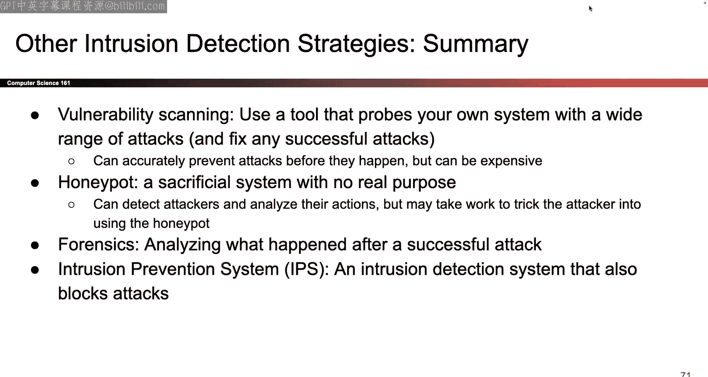

# UCB《计算机安全｜CS 161 Fall 2023 ｜ Computer Security at UC Berkeley》Calude-3.5翻译 p24 -24--CS161 FA23- Lecture 24 - Intrusion Detection.zh_en -BV1YGbceREDs_p24-

Okay。

Okay。Where do you started all right okay more networking pot very fun so like most of the you know hardpore networking protocols are over with so the rest of the way we'll just be looking at kind of high level overviews of stuff that again like this could probably fill a whole class but we'll give you some highlights and if you're interested you can always look more into it okay so last time there were two main topics talked about denial Ni service and the idea was there's a new property in town that we care about called availability and if we attack availability and make users unable to access the service that's called it denial service attack we talked about how you can attack the service by like crashing the program itself like a buffer overflow or SQL injection delete the whole table or you can overwhelm the limited amount of resources that a computer or server has we also talked about how you can attack things at the application level so here you're attacking the program itself that's running or you can attack the networking protocol itself like make TCP break or break TlS or something and so。

Both of those are places where you can attack， we talked about specific attacks like DNS amplification。

 you spoof a little DNS packet and then the DNS server sends a huge packet to the person you're trying to overwhelm。

 we talked about distributed thoughts or multiple computers overwhelm a single target we talked about S cookies where S flooding where someone spans a bunch of syn packets causes the server to start up a bunch of connections with all these places where they're allocating memory and we talked about how S cookies is a way to fix that so that instead of allocating memory instantly when the S shows up they send back the state to the client and then the client sends the state back at the very end and only then does the server actually allocate the memory okay。

So the first topic， second topic was firewalls and we talked about how if you have all these different computers in one network and you want to secure them all at once。

 you can build a firewall and this is a single point of access where all the packets coming in or going out of that network have to pass through the firewall you can write your own code to define what packets the firewall allows and which ones the firewall does not allow。

 it could be stateless it doesn't think about the history of old packets， it could be stateful。

 it could be really smart and construct back TCP connections and think about what they're saying。

 you can subvert them as we saw and then we briefly talked about proxies where instead of the firewall looking at every packet one by one。

 the firewalls and man in the middle and if you want to talk to someone on the inside you connect to the firewall first and then the firewall floors your message to the inside okay。

So today's topic there's just one is intrussion detection I find it really cool because there's not a lot of like super technical you got to see this like10 step handshake or whatever it's mostly just highlo overview of things that you want to think about on this topic I find it really nicely organized so I guess we'll just get into it okay。

So the motivation for today is that for basically all of this class so far the framing has always been here's an attack。

 how do you stop it and so for example， oh here's a buffer overflow and if you use a staary you can make it harder for the attacker to perform a buffer overflow or like here's SQL injection if I escape characters that make it harder for the attacker so we've been trying to prevent attacks but one thing we haven't actually really talked about is well most of these defenses they're not perfect okay there's a couple that are perfect like don you see that's perfect but most of them are you know not perfect and even if you come up with a good defense you're not going to stop every single attack so so far we've only been talking about how to prevent attacks but one of our security principles said if you cannot prevent an attack from happening you should still be able to detect that it happened so today is all about this like entire second half of security that we haven't talked about yet which is how do you actually detect the attack when it happens。

Maybe your prevention method didn't work， you added the defense staingaries or whatever。

 but the attacker still gone around the staingary， so how do you know that the attack actually happened that's going to be our goal for today okay。

So to motivate the intrusion detection ideas that we'll be talking about we needed an attack to detect I could use buffer overflows or whatever。

 but I'm gonna to take this opportunity to show you one more attack just because I can and because it's really common so it's called a path traveral attack and by showing you this by the way I think we have checked off almost all of these which is kind of cool so this one is up there as well so let's take a look and again this is just another attack that's out there and I'm just going to use it as a way to motivate all the intrusion detection things that we'll be seeing today okay so maybe you're familiar with file paths if you' like ever worked in a terminal you probably have seen these things so we know that a file path tells you where file is and you can say well it's in this folder slash this folder slash this folder other special characters that you might have used before in a terminal if you've ever used one dot if you've ever done like dot slash something dot slash X in project one what does the dot represent。

dot represents the current directory that your terminal is in and if you've ever done something like CD dot dot what does the dot dot mean that's shorthand for what the parent directory is so the parent folder that you came from okay here's some examples of what that would look like so here's a file path it's a pretty innocuous one it says start the s which is the root directory go to the home directory go to the public directory go find the E Mo GPG file okay pretty standard。

So you follow the  errorss and you're all good。Here's another one where maybe you've already navigated your way into the public directory so maybe you've opened a terminal in the public directory。

 you ran CDd or something and you say dot slash codebo dojpg so how does that work the dot represents here where you are there's the dot and then you go to the code ofjpG file okay and finally here's one that's kind of weird so remember that dot dot that takes you to the parent directory you can also use it inside a file path so I can say okay slash home that's the top slash public go into the public folder oh dot dot so go back up to wherever you came from and then private go to the private folder passwords。

 txt it is a very strange file path but it is valid because this dot dot is just shorthand for go back to where you came from。

So it's valid kind of strange maybe well use it for some attacks okay so the intuition is let's say there's this like website that's going to give you files so I have some website out there and I want to let the user request an images so I'm gonna to ask the user hey what file do you want the user says I want ebot jpG and the backend says okay well I'm gonna serve all the files in the public directory so I'm going to look in the public directory plug in whatever the user says which is ebotpG this forms of file path and the file path takes me to this file I will send that file back to the user so pretty standard user enter something we substitute into the file path and then we give it to the user maybe having seen all those different web attacks where we like did SQL injection and XS maybe you already see where this is going because what if I enter something like this right this is kind of part of the file path that I saw earlier and if I take this red input and I plug it inlash home。

public slash whatever the user wants， well we already know from before that this file path is going to say home public oh dot dot go back private passwords。

txt and suddenly even though I hardcoded the home slash public to try and only serve the folders in the public folder。

 I have now given the user away to find the passwords。

txt file by inserting that dot dot the special characters okay。

So that's the attack It's kind of similar as say SQL injection where there's some input in the backend and you get to substitute in as the attacker your own input and if you substitute in some stuff like dot dot it gets treated as part of the file path and that's not good so maybe lets you authorize files that you're not supposed to access often use the dot dot because that's how you go up the directory so you can navigate into other directories that you want to find and we can talk about ways to prevent this so if this were like any of the previous lectures we'd say we would stop right here and say well the way to defend it is make sure that the user input is not treated as a file path so maybe this dot dot like escape it somehow or tell the user you can't have dot dot in your input so we would say okay just don't allow the special characters or escape them and we're done but that's not what today' is about today's not about preventing it's about detecting so maybe we have some defense for this thing but what if it's not good or what if this attack still happens how do I like detect that this happened that's our。

For today， but that's our motivating example。Okay， does everyone go with Pa reversal？

Now you know what it is So you can use it on the project or whatever。

 and also we'll talk about how you would detect it。

 Okay so first we need to decide what kind of detector we want。

 So here's a couple types that you could consider there's three right there。

 let's talk about them one by one。 So the main difference is where you put them So I guess the first question you can ask yourself is if I want to be able to detect something I need to like put some machine somewhere that does the detecting So I need to have some program or some like code that's running that can detect that the attack is happening So the first question is like where do I put it So here's a picture of a network that might seem familiar from last time we have all these computers inside that are all connected up in some local network if they ever want to talk to the outside world they have to go through this router and then the router forwards their message to the outside world。

 So it's a picture that we've seen over and over again。

 And so the only question now is that I have a machine that's going do the detecting where should I put it So there are lots of different choices。

 So I'm going to first decide to put it here at。the router so there's some machines sitting right here that does the detection and if I put it there then it gets a special name it's called the network intrusion detection system or MIIs why is it called the network intrusion detection system because i'm putting it here and so it's thinking about things kind of at a network layer I'm going to protect all these computers inside by putting the detection here okay。

Great so there it is i'll put the detector right there at this point you might say this kind of looks like a firewall I think they do have some things in common。

 the main difference is that the firewall was actively deciding what to allow and what not to allow。

 but this is going to only think about detecting things okay。😊。

So let's take a look at what it would look like okay so one thing you could do then is because I want to protect all the computers on the inside。

 I can keep track of all the connections that are ongoing kind of similar to what the firewall was doing and then I can look at all the packets flying back and forth and think about like well does this packet indicate that an attack is happening or does this packet not indicate that an attack is happening and if the packet somehow seems suspicious maybe the detection system will start going off and say oh oh there's an attack you better check something out so that's the one thing you could do or how you could build the Ns and that's why putting it at the network or at the broader works' because you can look at all the packets going back and forth？

Then see if you spotted anything funny Okay so what's good about it Nis， what's bad about it。

 One good thing is it's pretty cheap and we'll see it in contrast to some of the other systems So we already saw from last time like's kind of similar to firewalls if I install a single network detector at the router I cover every system in the network because everyone else has to go through me to send packets to the outside world So I can cover all the systems on the inside with a single detector that's pretty cheap it's easy to scale relatively speaking because if the network insight gets larger maybe oh suddenly the company got bigger and a bunch of other computers showed up。

 you don't have to go around and like do a bunch of other extra work。

 you can just take the Ns and like somehow you make it more powerful So maybe it's easy to scale if that's your definition of scaling。

As we saw with firewalls， which were kind of similar in the sense that you install one thing and secure the whole network。

 it's easy to manage because there's only one machine that you have to keep track of。

 you don't even have to tell the end users about this they get the security property of the detector but they don't have to do any extra work which is nice for them perhaps if that's something you care about you don't use any of their resources。

 you just build this one extra detector and then they don't have to worry about it it's really good of the system already exists and you don't want to go and like fix all the stuff that's already there or upgrade the stuff that's already there。

 one thing that's kind of nice is if you remember trust a computing base way back in lecture1 the trust a computing base here is smaller because the only thing that really has to be security sensitive is the detector itself everything else can be insecure I don't care only detector has to be secure for the system to work okay。

So there's a bunch of good things about it So why not just use this all the time。

 Well the biggest problem with the NIDs is sometimes the thing that the NIDs reads can be different from what the end hosts reads And again we kind of saw this last time when we talked about the packets being rearranged and stuff but it can get worse and so here are some more examples of how maybe the NdDs reads the packets one way。

 but then the person at the end who's actually receiving and processing those packets maybe reads the packets differently So there's not speaking the same language So here's an example where the interpretation might not be consistent So lets let's be theds for one minute right so we are the Nds and we're right here and we're watching the packets stream back and forth and we really want to find those those path forver attacks because we don't like them。

So we see this packet dot dot slash ETc password right and so we need to think together you know like CS161 class news detector do we think a path reversal attack is going on I think so right this doesn't look very good it looks like someone's trying to know navigate up a directory or something so maybe we should alert maybe we should be like oh something's going wrong and worn whoever is monitoring this Ns Okay it's all good but what if this packet has a TTl that's kind of short remember last time this packet might only have a couple hops left before it just gets cut off and maybe it never reaches the end hostst so maybe we would make a mistake because we would be here freaking out and being like oh no there's a path reversal attack but if this packet never reaches the endhost then there wasn't actually an attack so we got it wrong so this could be a case where we think there's an attack but there isn't because we interpreted the packet that went through differently in particular we thought the packet was gonna reach the endhost that it didn't。

So there's a problem where what we see doesn't match what the N host sees。

 there's another problem which is sometimes we don't read the packets the same way。 So again。

 we're the Ns we see this packet and we need to think do we like freak out and tell everyone that there's an attack going on or do we just let this packet go and go along with its state So I look at this and I'm like well I don't see the dot dot do I don't see it's no dot dot so maybe we just let it go let it go on with its state but what if the person who receives this packet ends up using URL encoding so remember URL encoding sometimes you can have special characters in the URL and maybe this is part of the URL maybe when the person who receives this packet decodes the URL they're like oh what is the2 e that's a dot and this2 e is a dot and the2f is a seems like we have a problem and so if I decode this maybe I do get a pathcurveral attack so we messed up we thought there wasn't an attack because we looked at this and we were like oh there's no dot dot but it turns out it actually was an attack so we got it run。

Again， and so this time why do we get it wrong Well we got it wrong because we interpreted these things one way right we just read them as characters but the end system was thinking about them in terms of URL encoding so we weren't smart enough to think about this the same way that the end hosts is thinking about it how would you solve this Well maybe now that Ns has to think about URL encoding to so it's not enough just to look at the characters and find the dot dots we need to think about what this would hypothetically be if it were a URL so now it's going to work for us to think about that maybe we have to speak more languages okay here's one that's even worse and look at this and I'm like。

 wait is this a past througherssal attack like I see dot dots and I see slashes but like what are they trying to access I see all these dot dots and slashes are they even going to find a file that they're not supposed to access is this even a harmful input What is the end hosts even going to use this for Are they even going put this into a file path or is this some I don't know like someone's playing a game the type in a bunch of dots and slashes。

Like what is this input right it's hard for us to know and so this is a case where there's not enough information we see this input and we just don't have the information to judge if this is a path reverssal or not maybe it is a path revveral attack maybe it's not because this never gets fed into a file path maybe it is an attack but it's never actually hitting a file that we care about like I don't know we don't have the information so this is a case where。

It's kind of hard to fix right these are the cases oh。

 maybe I'll fix it by speaking more languages and understanding the encoding。

 but in this case like I just don't know the answer and I have to take a guess if I guess that it's an attack。

 I could be wrong if I guess that there's no attack I could still be wrong so there's inconsistency with the way that we think about things as the needss and endhost things about thingss kind of a problem and it's kind of a big problem so these are all cases where the needss just doesn't know but even worse is that maybe the attacker knows that there's the needsds in place and if so maybe the attacker is gonna be really clever and the attacker is like oh I know there's this detector sitting here waiting to detect my attack so instead of letting the detector find out that there's an attack they could maybe like maliciously trying to fool the detector into thinking there's no attack。

So they can take advantage of this imperfect observability or take advantage of the incomplete analysis。

 all the stuff that we've seen before and they can try to get around that and they can take advantage of the fact that the MIs is thinking differently from the end hostst and they can try to come up with inputs that the Ns just let's go and lets them go through and doesn't detect what is actually an attack so they can try to intentionally and maliciously get around the detection and that would be bad so here's some examples we already saw one by the way when we saw those time to live packets going through and we set the time to live packets differently that could be a case where they were trying to ede detection by the firewall right？

So how do you stop this Well turns out it's kind of tricky right and this again could be its whole like research field it's really deep topic but at a high level we have to somehow make sure that the NIDS is thinking the same way as the end hostst is thinking but what does it mean to think the same way you have to think about encodings you have to think about file paths you have to understand what this input is being used for so it can be really difficult to have everyone speak the same language。

Another way you could maybe try and mitigate these attacks is you could maybe force the user to have a certain form of the input so you could say everyone has to use encodings or not using encodings so this way I don't have to see this and be like oh is this encoded is all this' going decode it if I force everyone I tell the users you have to give me an encoded input or you have to give me an unencoded input then maybe this way I can detect things easier。

 I can force everyone to follow the same format another option is I could just try all the different options so I could say is this encoded。

 well maybe it is I'll analyze it that way maybe it's not I'll analyze it that way too but as we saw last time this could be like exponential there could be so many different interpretations including ones you don't even know about one other option is you could just be careful and say well I don't know if this is an attack but it might be so I'll just like make a note of it and say hey something suspicious happened and check it out later So those are all ideas that are out there but it's a tough problem like how do we actually solve this？

Its not totally obvious and there's another problem that's related but even harder to solve which is do you remember how TLS is end to end secure and we're really happy about that but like think about the Ns is the Ns really happy when messages are end to endec because now if the Nzi is a packet over TlS what does it see it just see all the encrypted junk and it's like I don't know how to decrypt this so how do I flag of this is an attack it's totally encrypted。

 I can't even read it how do you expect me to know if this is an attack or not so again we have imperfect information the Nhos knows how to decrypted but the Ns doesn't so now the Ns has a really hard time answering the question of is this an attack so how do you solve this well one thing you could do and like I kind of feel not super comfortable with this maybe you don't either one thing we could do is we could just voluntarily give our keys to the Ns so that it can decrypt our traffic but doesn't that feel kind of weird like we had this end to endec property and then now we're like giving it up like giving our key to someone else that's kind of weird like。

How do we trust the NIs or like is it okay to give these keys out so it feels kind of unsavory right maybe you're not a huge fan of it maybe you are but that is one possible solution although you know the idea of sharing a private key is kind of weird okay so that's the drawback of encrypted traffic as you can see there's not like a great solution but something you'd have to deal with if you're using a MIIDs okay？

That's it for network level interest detection， was all it's good， it was all it's bad。

 ways to get around it。Other stuff you'd like to know， okay？

So that's one option it's not the only option so first we put it another border router and talked about what that would do now let's try something different which is what if we put the detectors right here in other words we install a separate detector on every single computer on the network if I do this it gets a special name postbased intrusion detection or a HiDS。

And so now the only difference is I took the detectors and I put them there instead okay so what happens if I put them there what are the consequences Well what's good about it and you'll see this is kind of like the opposite of NIDs so what's great about the hostbased detection is well all those problems with inconsistencies are totally gone because who is interpreting the message as the detector oh it's the same person who's reading the message so if the message was meant for the server the detector is the server so they can read the message the same way so I no longer have to worry about one person reading a message one way and the other person reading the message the other way because the detector is the same machine that's trying to read the message that's great this is on the end hosts I don't have to worry about the time to live thing where the packet doesn't get there we inconsistent interpretations I don't have to worry about encryption because I'm on the same machine with the private key so that's nice another kind of nice thing that wasn't mentioned in NIDs is that I can also stop attacks text within the network。

So if I have a detection system on every machine and there's someone inside the network sending a text。

 I would catch that as a HiDs but the NIs wouldn't catch that So that's kind of nice if you're talking about scaling。

 there is an argument that hit scales better if you think that someone is trying to overwhelm the Ns So if we put the MIIs right there there's the detection system someone could overwhelm it it's right there someone could dos it from there but if you have all these different machines it's harder to doss all of them at once so maybe that's something you prefer but again kind of depends on your definition of scalability what are some things that are bad it's basically again all the opposite of what the nis had So remember how the nis was super cheap it was one machine to protect everybody well now you have to go around and install one machine and one detector for every single server on the network including servers that are old need to be upgraded servers that you don't even know exist so it could be really difficult and expensive and even though it stops most e assian attacks it might not stop all of them depending on how this His is set up。

So maybe the HiIDS doesn't understand with file name parsing and then it's unable to detect those。

Still not perfect but maybe better so it's a trade off right there's no right answer to which one you want to use maybe use a mix of them。

 but as you can see when you want to decide which one to choose you have to think about the trade offs okay that's it for kidss。

Anything else you want to know？So the final system is kind of not in the you know like contrast between these two but it's still really useful it's called logging and so here the idea is that well a lot of machines out there I guess I'll split up everything okay so a lot of machines out there already generate logs so for example if I'm running like a web server or something maybe the web server printing on a lot of logs messages telling you what happened I don't know if anyone's played with web service before or something but if that's something that happens or maybe like you run a script like a program or something like the other day I was editing a lecture or whatever and I use like FMM pack or whatever and it's sp out all this output telling me what it was doing so you can imagine a lot of tools out there they spit out messages telling you what's going on and so maybe one thing I can do is if I'm running this service and the service spits out all of this message or all these messages telling you what's going on maybe I can just take those messages and read them and the messages oh attacker user did this user did this I did this and maybe I can just read those messages and see if anything is suspicious。

So that's the idea behind logging the systems themselves are already spitting out a bunch of messages。

 which is a benefit I don't have to spit out the messages myself so I can just use the messages that are already being outputted by the service and then like maybe every night after the service closes or whatever I can just run a script on those files it could just be like some python script that reads the lens one by one and just sees that the file itself has any evidence of the text so。

Nothing too fancy here。 I just use the logs that someone else has already generated and then I just run a script on like the text file to see if anything indicating an attack happened。

 So what's good about this is as cheap， I don't have to build any logging systems of my own。

 I just use someone else's system I just run like a Python script every night nice and simple I don't really have to worry too much about ambiguities because the logging system is the end host the person generating the logs is the person processing those messages so I don't really have to worry about two different people interpreting things differently for the most part but there is one really big drawback of logging。

 which is by the time you see that message that's suspicious right the log tells you that something has happened。

 but that thing has already happened， So if you're doing logging。

 you can't detect the attacks in real time you can only detect after the attack has happened so you look at the log and the log says hey someone' just had to access the passwords file and you're like great I found an attack I'm gonna to detect it but maybe it's too late maybe they already。

Have the file so you can only detect things after the attack happens unlike the other two or you can maybe detect things as soon as the packet comes in。

 then again there are some evasion attacks， maybe if the Python script isn't super smart and it doesn't understand URL encoding。

 you can still be in trouble。Okay。That's logging that's the third place you can put something so you're not really putting something at the end hostst or putting something on the network you're just analyzing the log files that could spit up Okay well one other problem that comes up is if the attacker is super clever they could change the logs so we know the logs are being stored somewhere on on the computer like on disk or something maybe the attacker when they're attacking could also delete the files and then now there's no evidence of the attack so you have to be really careful。

Okay。That's it for the places where you can put detectors。

 that's like one part of today down so next it's kind of a separate but related topic which is measuring how good they are okay。

So we talked about where to put them now we have to think about how do you measure if a detector is good or bad so the way that I think we should measure is thinking about what kind of mistakes can a detector make so we know that we just keep asking the detector the same question the only question the detector has to answer is was there an attack yes or no and the detector that's kind of harder to say than I thought the detector can say whether or not there's an attack or not and the detector can get it wrong in two different ways and maybe this seems familiar if it doesn't seem familiar it's okay one way that it could get it wrong is the detector like panics and says oh there's an attack but there actually wasn't？

So the detector got it wrong and we call that a false positive there was no attack。

 but we said that there was false positive the opposite is there was an attack。

 but we were just like oh there's nothing wrong going with your date and so that's a false negative because we missed an attack that actually happened both of these are errors but they are different types of errors one of them says there was no attack and I panicked is that there was an attack the other one there was an attack but I missed it and so。

When I want to measure the detector accuracy it's not enough just to give like one number telling me how good it is I need to measure both of these because there are different types of errors so I can measure the false positive rate I can measure the false negative rate if you remember your you know C70 probability the way that I measure the false positive rate is I look at all the cases where there's no attack so I summon together all the scenarios and situations where there was no attack and I count how many of those cases there was an alert that's the false positive rate so it's only among the cases where there's no attack I count up the places where I'm mistakenly panicked and that's the false that's the false positive rate the opposite the false negative rate I collect all the cases where there was an attack and then I count up how many I missed that's my false negative rate okay so。

I actually measure these and I want to keep them as low as possible right like the probability of accidentally alerting should be as low as possible。

 the probability of missing an attack should be as low as possible。

 So one question to ask then is how good can these things get Can they be perfect Can I build a false positive rate0% detector So what does that mean to have a detector with a false positive rate of  zero a false positive rate of 0 means that when there's no attack So I summon up all the cases where there's no attack there is0% probability that the detector alerts How do I build a detector that alerts with probability of 0% to get that 0 percent false positive rate。

 I could build something like this So here's a detector。

 it takes in an input and what does it do does look at the input。

 it just immediately says nope nothing is wrong， So you give it anything and it says nope nothing is wrong seems like a pretty silly detector but what is the false positive rate here。

 It's zero because what is the probability that it accidentally。

On a nonattack zero because is's never flagging so this gives you no false positives。

 but hopefully we all agree that simply always saying there's no attack is probably not very good but about 0% false negative rate。

 how can you make sure that you never miss an attack this is a question that's like almost so silly it's stupid how do you never miss an attack you simply always say there's an attack So whenever someone gives you an input you're like yep。

 that's an attack you're never going miss one but is that really a useful detector probably not okay so。

This is to say you should not actually use these， but this is to say that when you make it a good detector you need to balance these two and often there's gonna to be a tradeoff where if you have a better false positive rate you'll have a worse false negative rate and vice versa so you have to be really careful and think about which of these two you value more and it turns out that not only do you have to think about the tradeoff between these two but depending on the thing that you're trying to protect the tradeoff can be different so here's an example where false positives and false negatives can affect or like I guess the setting itself can affect whether or not you care about false positives and false negatives so in particular maybe these two things have different costs so here's an example fire alarms。

 those are detectors right their job is to detect if there's a fire or if there's not a fire and so fire alarms can go wrong in two different ways there can be a false positive or false negative and so well again we can't have perfect false positive rate。

 we can't have perfect false negative rate， we have to think about tradeoff。

And in this case when we think about the tradeoff， we should also think about the cost of getting it wrong in either direction So what is the cost of a false positive with the fire alarm that means there's no fire but the alarm goes off what is the cost cost is I have to get up it's like 3 a the alarm goes off and crap I got to get up go outside the fire department has to come waste some time。

 check the building and be like yeahup， there was a false positive everyone go back home right so I was annoyed my sleep was disturbed the fire alarm or the fire marshal whatever I had to waste time coming over to check the you know the false positive and then tell us there's no alarm so everyone is kind of annoyed so there is cost to it it's not good but then what is the cost of the false negative what if there's a fire and you miss it there is no more building I would argue that's worse and so depending on your priorities maybe this is a case where you're okay with some false positives if it makes your false negative rate really low so there is no one detector。

That is the best detector always it depends on your setting maybe there are other settings where you prefer to have more false positives or fewer false positives and more false negatives than you want a different detector so it really depends there is no perfect detector that always works okay and so that's how we see but like the cost can affect whether or not the detector is good or not so you can have the good detector but you had to balance the tradeoffs and whether the detector is good can depend on the setting that you're using it in okay this also reminds me of like three semesters ago。

 three or four semesters ago there was an exam in like one of our buildings in the Evans or something and the freaking fire alarm enough so that was the case where I thought the false positive was very high because I had to like cancel the exam or whatever but that's a different story Okay ask me about a later for curious but maybe that's a case for the false positive was really annoying I don't know okay。

Anyway this is a situation in general like yeah， we had to cancel the exam or whatever。

 but at least the building is still standing so maybe that's a case where false negatives are worse I don't know or maybe it's good if Evans okay I shouldn't say that okay anyway I don't know maybe you want to take it with low false negative rate if we would like Evans to stay standing I don't know aren't they going like remodel it at some point I don't know okay anyway there's also something else that kind of matters and so this one requires a little bit more probability to really like hammer down so I'm not going like force you to remember this but。

😊，This is a case where it's kind of tricky and the idea is that the rate of attacks also affects the quality of your detector and it's kind of a paradox and hard to see right away。

 so I'll try to talk you through it but it's kind of heavy duty So the idea is let's say there's a detector that has a 0。

1% false positive rate that's really good because that means that if you present it 1000 innocuous inputs that are not attacks it will only get one wrong that's pretty good right give it 1000 things none of them are a and it messes up just once pretty good okay so let's take this detector and use it on two different worlds so let's take this detector and use it on system number one or scenario number one in this scenario there are 1000 attacks or 1000 requests that are not attacks and there are five attacks per day okay so what would this。

Deteectctor do well this detector would take the 1000 nonattack and how many would it goof up on just one right the other 999 it would correctly identify as not a attacks it would mess up on just one and maybe we get lucky and flag the other five attacks so that means that we got one false positive and maybe like five other attacks that is six things to check in total five of them are attacks and we catch them when like great found the attacks one of them we investigate oh not a attack this detector messed up and we throw it away that's also bad。

Here's another scenario suddenly our server becomes super popular and tons of users start using it so now there's like 10 million requests that are not a text and there are still five attacks per day I use the exact same detector I'm not changing the false positive rate。

 everything is the same。So now how many false positives do I expect to see there are 10 million requests that are not attacks and for every 1000 I mess up on one so in total if you do the math。

 there are 10000 false positives I think the math is correct let's trust that is' correct there are 10000 false positives right 0。

1% of these 10000 nonatts accidentally get flagged so there's 10000 false positives okay so why might that be a problem well in the previous case there were five attacks one false positive so I looked through you know six things I found the five attacks and I was good but what about over here now there are 10000 false positives even if I catch all five attacks there's no false negative or something that's still 100005 things to look through and 10000 of them are false positives so how useful is that for real like。

Well now maybe someone has to like manually check 10000 requests to see which ones are actually attacks and they have to like pick out the five in the 10005 that are really attacks that's kind of hard right so maybe here's a case where just by changing the scenario this detector went from being pretty good to not so good and all that I changed was that there were a lot more non-att so all of this is to say that if your base rate of attacks is really low it is just really hard to find the attacks right this is a case where there are only five attacks out of 10 million and five so the rate of attacks is really low and that means that even if you have a really low false positive rate when you go into this pool of 10 million and five things and you just like scoop up a bunch of stuff you're going to end up scooping up a bunch of false positives that you then have to like sort through rate and in this case there are 10000 of those false positives and only five attacks so。

The takeaway that you really have to know， I don't care if you memorize this example。

 but one thing that's good to know is that if attacks are really unusual and rare。

 like in scenario number two， it is really hard to find those attacks because even if you have a really good false positive like 0。

1% when you go into 10 million things of which only five or what you want and you just like scoop up a bunch of attacks that you flag you're going to end up getting a bunch of false positives that you have to like weed out manually so it can be really hard to build a good detector for scenario number two okay here's a picture I'm not sure I'm a huge fan of it anymore but if you like to basically shows that like as the number of request goes up the number of false positives goes up proportionally okay it made sense to me at the time。

 but looking at back at it a couple years later so here's the place where I have to introduce a bit more like probability to really show why this is such a problem so about base rate fallacy and so。

Again we're going to assume the same thing from before， which is that there's a 0。

1% false positive rate and every attack gets detected really good detector like these percents are so low and if I have this scenario where there are 10 million non-attacks and five attacks。

 how many false positives that I fish out，10，000 of them and how many real attacks that I fish out。

 five of them so I have 10，000 and five things。Right that are flagged 10000 of them are false positives and not really a five of them are attacks So that question for you see if you remember your CS70 is if you see the detector alert。

 what is the probability of an actual attack happening you see the detector alerts going off is actually an attack or is it a false positive that's your question there are a 100005 detections fiber attacks。

 the other 10000 or not So the probability that this is an attack is really low that's so weird right somehow I have this really good detector but when this detector goes off there's only a 0。

05 probability or percent probability that it caught an attack and that's so weird as what people call it the fallacy because when you see the thing go off you should really be thinking attack because it's a good detector but because the base rate is so low even though this thing goes off the probability that is actually an attack is 0。

05% which is really low and so that's so。Strange even though the detector alerted。

 it's still really likely that it's a false positive so it's just really hard to find the five true attacks when the base rate is so low so the fallacy that we're looking at here is that you have this detector it's really good it goes off but unintuitively when it goes off with overwhelming probability it's a false positive that's so strange okay。

That's the fallacy again， if you don't have the exact probability。

 it's okay but the important thing is that the base rate can affect the quality of detectors this detector was super good when there were 1000 legitimate requests。

 but once that 1000 became 10 million suddenly not looking so good okay that was the takeaway you have to know back to stuff that is not glue background so then question is well I have all these detectors。

 some of them are good， some of them are not one thing you could try and do is you could try to put them together and make combo detectors so maybe I have two separate detectors I went to the store I bought one detector that detects on smoke one detector that detectors on temperature and I want to use them together well how can I do that well one thing I could do is I could put them in parallel I think circuits if you remember those so one thing I could do is I could chain them in parallel and what that really means is that if either detector goes off then my combination detector goes off and I think those in tech so in other words if I go out to the store and I buy a smoke detector and a temperature detector I am going to alert。

If either one goes off， only one of them has to go off and I think it's an attack and this can also chain or extend to like a chain of a lot of detectors or maybe I go out and I buy 100 detectors and if any of the 100 go off。

 I say it's an attack。Okay so what's that going to do in general that's going generate more alerts because only one of the 100 has to go off for me to alert overall so overall i'm probably going to be alerting more often than I just use any one of those detectors because i'm using them altogether so in general this is not always true but roughly speaking this is going to reduce the false negative rate because if there is an attack and I have 100 detectors like one of them had better catch it right so this is probably going to reduce the false negative rate it is less likely that I miss in order to miss an attack all 100 detectors have to be wrong which is pretty unlikely however。

This is going to increase the false positive because if even one of the 100 accidentally goes off。

 I'm going to detect so this could increase the number of false positives that I have to check the other approach to go in a serious composition and what this means is that if you have 100 detectors or two detectors you need all the detectors to alert for your overall combination detector to alert so in this case if everyone but one person alerts。

 you don't alert overall so what's that going to do that's going to generate fewer alerts in general because you need everybody to agree there's an attack for you to alert and that's probably going to reduce the amount of false positives because if you just have one detector accidentally go off you're not going alert even if you have like five detectors accidentally go off out of 100 you're still not going alert you're only going to alert if every single detector goes off but that could increase your false negative rate because if 99 detectors agree that there's an attack and one of them doesn't agree while you're not going to detect if you use the serious composition so you might missatt this way okay you're going also use things that。

ofIn between you don't have to just go full parallel full series。

 but this is just to say that usually if you reduce one rate， you increase the other。

 there's no free lunch， you can't always just reduce both failure rates and how you combine the detectors is an example of how those rates kind of trade off okay there's a lot of mathematical proof but it's kind of a high level sketch of how those trade offs exist。

O。Great， that's it for error detection， rates of detection， how do you measure if a detector is good。

 is there anything else you want to know about that before we talk about how you detect。

Okay so yeah I find this lecture pretty cool because it's really organized right we went where do you detect where do you put the detector and we talked about places to put it and then we talked about how do you know if the detector is good。

 how do you measure it and then now our third question is how do you detect right so far I've just been saying okay the detector gets an input and says yes there's an attack or no there's not an attack but how does it know that like what thinking is it doing what logic is it going through to know if there's an attack or not and it turns out there's actually lots of different ways to think about how the detector detects an attack So that's our next question which is not what is detecting or where is detecting but how that's our next question Okay and just like before there are some different categories and we'll go through each one so without further ado we'll start with the first okay this one is called signaturebased detection and the idea。

Is if I see something and it looks like an attack I've seen before。

 I have this list of attacks that I know about if this matches one of those list of attacks then I flag that's it that's insurebased detection and so the idea is that you have this like list of common patterns that attacks follow and if it matches any of those common patterns you will flag okay sometimes people call it blacklisting。

 I believe the term that people prefer to use these days is like deny list but sometimes you'll see blacklisting and kind of older settings and so the idea is you have a list of things that you deny that you don't allow and if it's on the list then you say it's not allowed if it's not on the list everything else does not get flagged okay so sometimes people call it a deny list even though it says blacklisting whichs kind of an outdated term I think nowadays and again this can happen at different network layers so just like how we can put the detector in all sorts of different places we can use this strategy at all sorts of different places so maybe we can read the TCP headers and do this in the TCP layer or the。

R layer we could also do this at the application layer and think about what the HtTP request is and see if the contents of that match an attack so you have a choice here of where to put this okay。

Here are some examples so back to our canonical example of how do you detect a path revveral attack Well one thing we could do if we're building a denial list of things that we do not like that indicate a path reversal attack we could think back and we could say I remember that dot dot slash is what people often use to navigate to different directories is this all that path revveral attacks out there probably not but is this a common pattern that path reversal attacks have I think so so I'm going to add this to my list and I'm going to say if any request contains do dot slash I'm going to flag that's the pattern that I think corresponds to the attack so I'll put it on my denial list if I see it I'll flag will it be perfect probably not will there be false positives false negatives probably but it's a strategy at least okay。

You don't like it We could also talk about buffer overflows。

 that's something we could detect so maybe one thing we could do is we could say well I know that when I read a buffer overflow。

 it often contains shell code is that always true， not really。

 but is it mostly true probably so if the buffer overflow usually contain shell code then one thing I could do is maybe I'll keep a database of like these are the kinds of shell codes that people tend to use and if I see a request containing shell code then I'll fly So if it's on my list of common shell code then I'll fly is it going to be perfect probably not I'll miss some attacks I'll get some false positives but maybe it's a strategy that I can use something funny here is not as very off topic but something funny about this is has anyone run into the issue on project one it happens like once we' twice every semester where they download the project or they try to upload the solution and then your browser or antivirus says no because they think you're uploading an attack I find it very funny but that's a false positive because you're uploading your project like you did this as a project but then the browser think you're uploading an attack and doesn't。

Allow it because your project can think show good， so I find that funny。

 that is a false positive okay。So what's good about this what's bad about it one thing I like about it is it's simple I took me like two minutes to explain there's a list of stuff you don't allow if it's on there you flag it's really good at detecting attacks that we know about because if we know about the attack we can put it on the list and detect it and if it's an attack that we studied in the past before we can have it on the list and think about it something really good is that you don't have to build this list yourself you can share in the community of security people there are all these libraries out there that have already been put together that show common attacks and we can share and like all contribute to it so you don't have to build these lists yourself which is really nice these are general purpose list that everyone can use there's some drawbacks which is if there's a brand new attack good luck finding it because if you don't know about the attack it's not going to be on the list of signatures so you're kind of screw。

Okay you also might not catch variants so if someone takes the attack and modifies it just a little bit to avoid the pattern that you're looking for。

 then maybe you don't catch it， so maybe they take the shell code that you're looking for and just kind of tweak it by a couple of bytes and suddenly you can't find it anymore or you don't flag it anymore so you have to be careful the attacker can even do this maliciously if they know that you're looking for a certain type of shell code they can intentionally use a different shell code or intentionally modify the shell code to avoid being found。

Okay， so you have to be really careful and just like before you might have to parse things so you might have to say oh here's this thing but I have to read it with URL encoding or something so you have to be careful you can miss varianceance okay to generate false positives okay cool that's the integer based detection those are some good and bad things about it。

I'm going go on to the next one once you stop me okay so we can also do specification based detection and this one is kind of just the backwards of signature based so in signature based I had a list of things that are not good and if it's on the list of things that are not good I fly specification based is the opposite here I list out all the things that are allowed so I say these are all the things that are allowed and then if it is not on this list then I fly。

So I flag everything except the stuff that's on the list the historical term for this is whitelisting the more modern except the term is like allow list which we saw last name as well or specificationbased detection and so that's kind of the idea the opposite of signature based I have a list of things that's allowed if it's not on there I flag here are some examples of how you might do that so maybe for past reval attacks I can look at my folder and realize everything in my folder e code of whatever those are all file names that only have letters like a through z0 through9 so maybe my specification is that all the file names inputted by the user can only have letters and numbers if you input anything that's not a letter or a number I deny and I flag so I can alert and flag if anything contains something that is not a letter or a number so I'm specifying what's allowed everything else including the dot dot slash is not allowed what about buffer overs how would you do this？

Really depends on your settings so I'll give you one example。

 but it can be different based on your setting so maybe you have a program that asks the user how old they are it's a C program the user types in a number and then that's how old they are so if you ask how old someone is they should only be typing numbers correct they should only be typing digits zero through9 if I ask someone how old they are and they start like potato like that's not the answer right and so I could say I'm only going to allow the digits zero through9 that's my specification anything else that's not in the zero through9 is going to be flagged and so what about like things like show code and buffer overflows like when we write up buffer overflow like what does it look like it's like there's like A's and there's show code there's all these bytes that are not principal and that's not an age so if I see that maybe I can flag here because it's not part of my specification okay。

What's good about this Well it's kind of the opposite of signature based So now if there's an attack you've never seen before you can still catch it because if that attack doesn't conform to the specifications that you wrote。

 you're gonna catch it so what's really cool about this is you can actually catch attacks even if you've never seen them before if you're really careful about this you can have a low false positive rate like in the example of ages it's pretty hard to accidentally flag an attack yeah I guess it's hard to have the false positive in the case where there's ages because you're specifying everything that's allowed and so like if it's correctly specifying only things that are allowed。

 it's pretty hard to show an attack that only uses diits so maybe you have a lowest false positive rate depends on your setting what are some drawbacks the biggest drawback is this is not something that's general purpose remember in signaturebased detection I have a list of attacks those attacks are like always a so it's a list that everyone can share and contribute to but in this case that might not be the case because you need to。

mannually specify what's allowed and it could be different for every program this program allows ages this program asks for your names so you have to specify something different this program asks for a password with this set of rules you have to specify something different so you may have to manually take your time to specify all the things that are allowed if you miss the specification and you accidentally lease something out that could be a problem if you decide to change your program later you have to go back and change the specification so this one is kind of time consuming and that's the tradeoff that you have to make okay。

So two down two to go okay the third one， this one is kind of funky and I'll try to explain it in a way that's not too weird。

 but basically the idea is that attacks are usually gonna look a little bit weird so what do I mean by weird well I could either specify what's weird like the previous two cases or I can just try to be fancy and be like you know how like machine learning and AI is like all the hype these days so maybe I'm going to use some fancy machine learning algorithm to automatically develop a model of what is normal so I'll be like here's a bunch of input like think about it really hard train on the data give me a model of what's normal and if you see something that's not normal according to your trained model tell me it's an issue so I'm leveraging you know machine learning or I'm leveraging like statistics to figure out this is what I think is usually normal and if it's not normal I'll fly okay so it's kind of similar to specification based I'm still using an allow list but it's not an explicit list of what's allowed it's a model that someone else。

Learned based on what's allowed Okay it's kind of weird So I'll try to formulate some examples。

 but really it's kind of an openend question so maybe you analyze a bunch of inputs maybe you don't have to do it yourself maybe you outsource it to like some machine learning algorithm and maybe the machine learning algorithm studies like oh this is an attack this is not this is an attack this one isn't and it studies really hard and it starts to see a pattern maybe automatically without you having to specify maybe the machine learning algorithm is really smart and it realizes when I see the dot dot it is high probability that this is an attack so maybe it learns the dot dot is part of an attack so maybe it's gonna to alert if that dot dot appears and so that's not something you specify but it's something that the machine learning algorithm learns through data and patterns and training data okay what about buffer overflows and again this is a rough idea like how machine learning algorithms work is totally out of scope for this class but maybe I have pass out a lot of examples to the algorithm and it starts to learn something it sees a pattern。

And it sees， well all the things that are not attacks。

 they tend to be things that a user can type on a keyboard because that's what most users tend to type stuff on their keyboard。

 but attacks， they tend to have things that are not principle like those rawbytes back slash XFF。

 that's not a keyboard character， that's a rawbyte that corresponds to some non-principal character so maybe your machine learning algorithm learns this from data。

 without thought you telling it and maybe the machine learning algorithm is smart and figures out oh actually if I see this FF character。

 I should flag this is pretty unusual okay。So you know She code might have those like FFs and nonprincipal characters and if those are correlated very strongly with attacks。

 maybe the detector can use statistics to learn this and then alert okay so what are the tradeoffs what are the benefits drawbacks again I can detect attacks I haven't seen before as long as the attacks falls outside of my model of normal I can detect it。

 what are some drawbacks this is kind of weird which is if you're a model is bad。

 you can actually fail to detect attacks that you know about as a human you can be like I know this is an attack but if my model isn't smart enough to find it my model could actually let that attack through that's kind of scary I can fail to detect new attacks if they don't look weird enough to the model。

 what if our model is inaccurate like I give the model bad data and it learns patterns that it should not be learning that could be a problem false positive break could be high because maybe there are attacks out there that look or there are non-att that are just simply unusual like maybe someone is just the weird of they loves to type nonpri characters。

You would flag them， but it's not an attack， and that could be an issue with your model。

 depending on how you build it。 So it's really tricky to kind of a trade off of。

If you only look for super unusual things， then maybe you reduce the false positive rate because you're only looking at the weirdest things ever。

 but you might start missing stuff because there could be slightly weird things that are a attacks by contrast。

 if you try to sp it around and say oh'm gonna I'm going to take everything that's even slightly weird that you can have a lot of false positives even if you misfe attacks in the way your false negative rate okay in practice。

 this is not something that most people use， there are a lot of papers about it。

 if you're looking for like a research topic， this might be a good one I can't profess to know much about it but maybe some other people working in the field do but in practice as far as I know this is not super widely used because it's really fickle and hard to get right but it's out there and do know that it exists final one is behavioral detection。

 this one is kind of its own category and so ways will talk about it so here the idea is we're going to totally switch gears and say we're not gonna look at the input itself so far what if we've been doing we've been saying here's the input do do。

what or here's the input is is what the user typed as their age is then an attack yes or no behavioral intention is going to switch it up and say I'm not going to look at the input at all what the user inputs I don't care instead i'm going to look at what the input does as an effect or like what actions happen as the effect of the input I realize I said that very weird okay we're not looking at the input itself we are looking at what the input causes the server to do so we're looking at the behavior caused by the input instead of the input itself okay。

😡，And it turns out that within this behavioral category you can even have subcategories because what do you do with the behaviors you could do something signature based where you're like this is the list of behavior that's not allowed if it's on this list flag you could also do it a allowed list and say this is the list of stuff that is allowed as behavior this is behavior that's good if it's not on the list of good behavior then you detect you could even learn a model if you wanted to that's behavioral as all these different subcategories but the idea is that you're looking for evidence of a text So you do not look at what the user inputs as a string and be like is this string good or not instead you look at what's actually happening as a result for example。

 maybe you look at the file system and you say hey what files are you fetching from disk and if you ever see wait a minute。

 why is the program trying to read the passwords file when it never has to that could be evidence of the behavior being bad what about buffer overflows well maybe I write a。

And my program never calls the exact function I wrote the program。

 I never calls the exact function and I run it and I watch it and it starts to run the exact function I'm like wait in a minute that's not the correct behavior I was never expecting the exact function to execute now it's running that function that's super weird I'm gonna flag that and I didn't flag that based on what the user inputed I have no idea what the user inputed but if the user inputed something and it caused a function to execute that I wasn't expecting that could be evidence of an attack it's good about it just like before it can detect new attacks because we just have to watch the behavior and if the behavior is bad there's an issue in certain cases there's a lowfo positive rate for example in the example of exact。

Well， that could be a case with almost zero false positive because if exec is executing。

 that's a really really strong signal that something is really bad that's going on。

 this could be cheap depending on your system because behavioral monitoring is sometimes already built into your system for example。

 your operating system is already keeping track of files that you're reading so you could just kind of piggy back off that and use that to help you out。

What are some drawbacks Well there could still be false positives for example。

 in the passwords file example， maybe someone is really trying to access the passwords file legitimately because they want to like log someone in or something so that could be a case where you have to worry about false positives you might only detect attacks after they've already happened so it's kind of like the logging example where you might not see the attack until you see the exact function is executing there's probably an attack but maybe it's too late because the functions already running so you might not be able to detect the attacks ahead of time like by contrast to maybe say if you're doing signature based you can look at the input' like oh input's got shell code attackss about to happen start to stop it but in this case you have to wait until the exact function is executing and by then it could be too late depending on your setting it's only detect successful attacks so if you have an attack that fails maybe nothing out of the ordinary happens because the attack failed and you might miss it maybe you want to know if an attack failed so depends on what you're trying to look for okay。

And again， attackers can get around this the same way they can get around all the other things by trying to avoid some behavior that's malicious。

Cool， so those are the four strategies， is there anything else you want to know before I clean up and talk about some other miscellaneous topics in the field。

 okay？Cool so those are the four strategiess you have to know what's good about them what's bad about them Okay so in the last what 1718 minutes I'm just going to talk about some other things in the space of intrusion detection that didn't really fit into the rest of the lecture but I find pretty interesting anyway okay so here's an idea which is well it's not really detecting attacks in real time but maybe one thing you could do and again this just didn't know if anywhere else i'm including it here and so the idea is what if you launch a attacks on your own system。

In order to see what you're vulnerable against and what you aren't so this is called vulnerability scanning and the idea is that before you launch your system to the world and give attackers a chance to try and break your system you're going try to break your own system by maybe using a tool that like hits it with some common attacks or by designing attacks yourself or by paying other people to try and find a and if you find any attacks while you're in the planning stage you can shut it down right there and fix it before you give it to the world so this is you preemptively checking for attacks before giving your system out to the world and putting it in production so it's very widely used it's not an intrusion detection system necessarily because that's being used when your system is in production but this is something you can use to prepare your system for potential attacks and it works really well together with intrusion detection systems so something to watch out for if you ever go into this area okay。

What's good about it， it can be really accurate if you have a tool that tries a lot of common attacks that you know ahead of time that those attacks have been defended against which is really good。

 this is good because it's proactive， you are not waiting for other people to break your system before you fix it you're breaking your own system to check if it's good and really stress test it for security before you ever give it to the world so it's proactive that can be really good if your security conscious it can be really intelligent because there's something you could do maybe depending on your setting which is maybe your intrusion detection system is imperfect and an alerts on something but you already know you fixed it so it's probably a false positive so you can maybe use that to reason about intrusion detection system alerts what are some bad things well the obvious bad thing is takes work you got to do it you got to go and like make the attacks happen and try to defend against them so it can take work I'd argue the work is worth it but depending on your system maybe not if you can't modify the system this is kind of pointless so it depends on your system this could be dangerous so maybe if your system is really。

Fagile you have to be really careful because if you run this thing what's it going to do it's going to try a bunch of attacks on your system and what if you try a bunch of attacks and then you suddenly like accidentally break your system and you can't bring it back that could be bad so you have to be really careful about this run into the sandbox or something but that's vulnerability scanning kind of a cool strategy okay。

Here's one that I find really cool so it's called honeypots maybe you've heard it before and maybe it'll sound familiar so the idea is I'm going to have maybe this big complicated system with a lot of stuff that's sensitive and inside the system I am going to intentionally on purpose put a system that has no purpose but is's just sitting there why would I do that because if the system is sacrificial and has no purpose then nobody should ever be touching it doesn't do anything useful it is just sitting there right and so that means that no one should ever be accessing this so if someone does access it what does it mean maybe they're an attacker who doesn't know what's going on they try to access the system and then we caught them we're like a you're an attacker because you're trying to access the system that is totally pointless okay so is it perfect no there can be false positives because maybe someone just stumbles around and they're not an attacker but they accidentally touch the honeypot and they could get flagged when they maybe didn't want to be flagged or shouldn't be flagged so it can be a false positive and if this sounds familiar？

That's because we've already seen a honeypot one could argue that the stack canary is a honeypot why is that because the stack canary is a system with no real purpose that value on the stack we're not putting it there because it has useful computational value it is simply there because no one's ever supposed to touch it so if someone touches it they're probably be attack and that could also have false positive someone accidentally over it the canary but in general the false positive rate is load if someone touches the stack canary you can be pretty confident that an attack has happened and you can detect it you can panic and be like oh there's an attack and try to recover by crashing the program or something okay。

Here's some examples in real life that I find pretty cool。

 so there's an example from hospitals which basically says as like an employee of a hospital。

 it's really important that you do not read records of patients that are not yours。

Or so I'm told I'm no hospital expert but it seems reasonable that you should not be reading about the medical history of other people that you're not working for。

 so one thing you could do if you really want to catch people who are you know evil and trying to like read the records of other people they're not responsible for you could pick someone with like a really you know good big celebrity who's like in the news and like you super spicy this changes every semester like the are there any celebrities who are like embroiled in drama right now I can't think of any I'm not up with a gossip。

No no takers I think it was Elon like a semester ago is it still Elon I don't know okay so I don't know you put like you know Elon must name in the the records and then someone's like oh is I want to see Elon's you know medical histories they open it up and then when they open it up we catch them so that's maybe one thing you could do I don't know。

Okay maybe it works better when we have like celebrities and broiled and drama。

 but I can think of any right now so we'll have to go with Ellon Okay other examples are one thing you could do is you might want to make the honeypot tempt into people right like if the honeypot does nothing maybe the attacker has no incentive to go after it but one thing you could do is you could just leave a little bit of money in there this's kind of a sneaky little trick which is well maybe on that computer the honeypot that does nothing but it's just sitting there you just leave a little bit of free money like a little bit of some free money。

 some free bit and so when the attacker goes into your system if they don't know any better what are they gonna do they're gonna go into the system maybe they don't know what they're doing or what the system looks like and they look around and they're like oh it's free money why not take the free money and they take it but as soon as they take it you know they're an attacker because theyve touched your honeypot and no one legitimate you really be touching it so that could be something worth looking out for here's an example of a honeypot that's really powerful which is if you ever wonder like how do they catch。

Sm like how are how are they so good at catching spam there's lots sorts of different things out there。

 I don't know exactly how either， but here's an example of a way to catch spam with really good probability。

 which is you create an email address。 you don't use it for anything legitimate so nobody is supposed to send you real emails but you take this email address you post it everywhere and guess what you're gonna get you're gonna get tons of spam because you posted your email address everywhere And so if someone sends you an email it is got to be spam because this email is not used for anything legitimate its just a total junk email that is only there to catch spam so that could be a way to trap people you can think of it as a honey pop because this email is not being used for anything legitimate so if someone sends this address an email probably a spam email and you can catch that and prevent it in the future it was pretty cool I find that one cool what's good about it again you can detect attacks text you haven't seen before one thing I find really cool is that once you have the attacker detect it when they like access your honey。

Po you can start tracking them too because you can watch what are they doing like who are they What are they trying to do。

 what are their goals So the thing you can do that's really powerful is if you find them using the honeypot and they're still working in your system you can find them and track them down and see who they are and do a bit of like counterintelligence that's kind of sneaky something else you can do is you can distract them so maybe you have some super sensitive system that's top secret so you put a little bit of Bitcoin somewhere else and hope that they just go for the Bitcoin and they don't touch your super sensitive system if they don't know any better what are some drawbacks。

 it can be tricky to like convince the attacker to actually go get that money maybe the attacker knows that there's some sensitive system and they go straight for that and they avoid your honeypot entirely so they don't fall into your trap your bait's not good enough that could be something that can happen maybe you have to make it convincing maybe the honeypot is super obvious that is not doing anything no one's gonna to touch it maybe that's less of an issue if you're trying to do something like the spam trap in that case the spam is so automated that maybe you don't care。

Youre going to like leave it out there and just catch the easy spam that comes to your spam trip so again depends on your system and the attackers you're trying to catch on your threat model。

 but those are some trade offs of honeypots okay I find it really cool really sneaky。

Is there anything else you want to know？Okay more topics that could be their own lecture but instead they're going be one slide or half a slide so one thing that again has to happen that we really haven't talked about we spend a lot of time talking about detection and how you find the attack。

 not necessarily preventing it but something else that really has to happen is like for better or worse attacks happened like it would be really nice that there was a world with no attacks but inevitably they're going to happen and when they happen you have to be able to recover and so that's a whole field of know computer science which is how do you recover from attacks and things going wrong so things you might have to do are you might have to do forensics which is a fancy way of saying you have to do detective work if an attack happened you have to figure out what actually happened。

 you have to do a bit of debriefing like what happened。

 why was I attacked how do I make sure I don't get attacked again what do I have to fix so I have to do a bit of detective work to try and learn what happened than recover from it you might have to recover and say oh I lost all this data how do I get it back that I didn have backup。

That I saved if something broke， how do I fix it， how do I patch the issues that cause the attacks so they don't happen again。

 that's a whole field that we have to worry about and it differs depending on the systems that you're building。

 okay。What would you need for forensic you might have to leave ws so that you can figure out what happened there are some tools out there to help you read the logs to see what happened but overall like really interesting field but unfortunately not when we have lots of time for in this class but you know it's out there and be aware that it exists okay so one other thing is at this point sometimes it's pretty tempting to think okay well I just saw this whole lecture on detection and I don't see why it's so different from prevention it seems to me like if I detect something I should just stop it at the same time and you'd be right because all these strategies that we've been thinking about for detection oftentimes we'll also work for prevention so we spend this whole lecture I kind of tricked you into saying oh we're doing nothing but detection but it turns out all these ideas can also be used for preventing attacks as well so sometimes you can take detection and prevention I them back together and get something called the intrusion prevention system and so here not only are you detecting attacks but you're also preventing them at the same time。

That's pretty cool sometimes this is not possible so for some strategies that we saw like logging you cannot prevent because by the time you read the logs the attack has already happened so there's no life prevention sometimes it's difficult depending on the system that you're building because if you want to be able to prevent you have to take proactive action like you have to drop a packet or tell someone that an attack is happening or somehow interfere to cause the attack to stop so it can be kind of tricky and so for some inrusion detection system like the on path needss if it's only passively reading traffic there's no way for it to detect and also stop the attack we can find that the attack happened we can alert then maybe the on path needss doesn't have the power to stop the attack but it depends on the capabilities that you give your system okay。

So it's tricky how do you stop the attacks You can use like reset packets。

 you can change the firewall rules to stop packets from coming in So kind of a tricky problem Okay something else kind of tricky is that maybe the false positives are expensive now because think about a false positive in the detection system in the detection system if I have a false positive what happens you panic and you say oh there's an attack someone please look at it maybe they look at it there's no attack okay you wasted some manager's time looking at the attack there's some IT guys time looking at the attack but what about the intrusion prevention system because now not only are you detecting the attack but you're also shutting it down at the same time So if you mess up and you make a mistake and you accidentally shut down something that you thought was an attack but wasn't you could actually affect users who are not out there for an attack who are not attack rules so maybe I don't know this project one thing where you try to like upload your submissions to greatco and your browser rejects it because they thinks you're trying to upload malicious shell code Well if your browser prevents you from doing that that could be an。

false positive because now you can't submit your project。

 They stop a nonatter from uploading their code to gradeco so that could be a problem again。

 you have to worry about false negative false positive。

 This is kind of like a joke slide I don't worry about it。

 but it's like do how do you have a false negative rate of zero Well you just have to wire with no security whatsoever How do you have a false positive。

 This might be backwards， I don't know but how do you have know a perfect detector。

 you could just have a wire that does nothing， this is basically saying there's never an attack。

 How do you prevent all attacks you just cut the wire now there's no attacks ever stuff like that but there are tradeoffs right you cannot just cut the wire and be like oh no attacks Yeah。

 but you just stop everyone from sending their messages How do you attack the system because the intrus detection system is a system itself It's also a computer or a program learning code So you have to worry about the system itself being attacked So someone could try to doss the system by sending it a bunch of attacks or nonatt or whatever and now it has to analyze every single。

And the detection system itself could run out of memory or space or time， that could be a problem。

So maybe the attacker just sends a lot of stuff， suddenly the detection system goes down and doesn't know what's an attack or it's not and maybe that's a way for the attacker to get their attacks through because it's confusing or overwhelming the intrusion detection system so you have to be really tricky you could even attack the system itself maybe the detection system itself is vulnerable to like buffer overflows or something in particular the detection system could be vulnerable to code injection and why is that because maybe the intrusion detection system sees a piece of code and needs to know is this code malicious how does it know maybe it has to run the code and what happens if it runs the oh just got attacked so it has to be really careful and run that thing in a sandbox and make sure that if it tries to run some test code that's not trustworthy that it doesn't affect the intrusion detection system itself。

Okay here's an example of a modern intrusion detection system there are lots of examples out there。

 I'm not going talk through it in too much detail， but here we can see that there's some packet filter so it's like a nis type thing you can parallelze it so if you ever need more processing power you can just stack on some more CPUUs or GPUs or whatever to give it some more processing power that's a good way to scale it you can have logging you can have signaturebased detection so I don't know I've never used this knits before but you're curious that's what it looks like okay well'll use more stuff okay but also use a hit it's all on every device but I'm going to talk through it so I have three minutes there's a kind of long-winded summary because today was a long-winded all sorts of different topics Over lecture hope you enjoyed it so summary is there are path for attacks that was our motivating example for the date you do have to know this attack it's useful for Project three and remember the attack is that if you use the dot dot it allows you to navigate to hire directories and might allow。

To navigate to files that you were not supposed to access the way that you would stop it and prevent it is to make sure that user input is not treated as a file path but in general we were not concerned in this lecture about preventing but about detecting so different ways you can classify detectors you can ask the question where do you put it and so if you put it at the network level it's in network system or a Ns and in that case is's cheap because it's one system for everybody easy to scale easy to manage but the problem is there's that inconsistent interpretation the Ns might read something one way and then the endhost reads it a differently by contrast you could have the hits which is installed on every single endhost this is expensive because you have to find every single end hostt and install something but you solved the inconsistency problems and it also works on encrypted traffic which is nice What about logging logging was the idea that servers already generate logs by default a lot of the time so you can take those text files run through a program and see if any of the logs or evidence of an attack。

But the key problem here is that it only detect attacks after they occur okay detection accuracy。

 we talked about how you would measure if a detector is accurate and we said there are two errors that can happen if there is an attack and you miss it that's a false negative。

 if there's no attack and you flag that's a false positive both false positive rate and false negative rate matter and trading lock between the two of them is a really tricky thing oftentimes if you combine detectors for example。

 you end up getting fewer false negatives but more false positives or vice versa there's a trade-off and crucially there's no such thing as a good detector for all purposes。

 the quality of a detector depends on where you're using it how much does a false positive cost how much does a false negative cost。

 do you destroy Evans Hall and how bad is that what is the rate of attacks we saw that if attacks are really rare and hard to come by then the detector itself can be really hard to design because you can scoop up tons of false positives to come with the actual attacks that you find and then you have to pick out the attacks within the false positives。

And that can be really tricky。Fal thing we talked about really quickly is four ways you can detect something so signature base says here's a list of things that's not allowed flaggi its on that list specification base says here's a list of things that's allowed flaggi's not on that list anomaly base says use some fancy machine learning get a model of what's normal flaggi its not normal behavioral says don't look at the input at all look at what the input does and see if it's evidence of compromise and then finally there with all these other side topics that we just kind of briefly skim the surface up if you're interested there's a whole world out to explore but that's that's all we have for today so I guess I'll see the next time there is a lecture on Monday knows the before Thanksgiving so if you don't come I won't be too sad but I'll be here talking about some stuff until then I'll see you then I guess thats。

