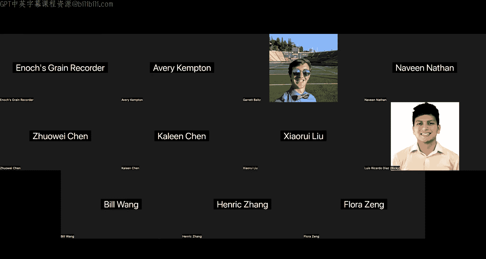

# UCB《计算机安全｜CS 161 Fall 2023 ｜ Computer Security at UC Berkeley》Calude-3.5翻译 p26 -26--CS161 FA23- Lecture 26 - Tor.zh_en -BV1YGbceREDs_p26-

ok。Hi， there's more people than I expected for this is second until last lecture okay。So oh wait。

 you can't see anything， that's not good。Maybe sure we can see something。In person。Okay。Oh， no。

 you can see something， okay。All right， as I was speaking or as I was saying。The idea behind tour。

 so last time we talked about proxies， which was the idea that if you want to stay anonymous on the Internet instead of sending a message yourself。

 which would cause other people to know who you are。

 you're going to ask someone else to send a message on your behalf and if someone else sends the message on your behalf then the recipient doesn't know who you are and also if you set it up properly like we saw last time by using some encryption then you can also make it so that onpath attackers who look at the packets being sent cannot tell who's talking to whom so that's what we're looking for and we're going to try to extend that idea to build something called tour so the idea behind tour is that instead of having just a single proxy we're gonna to have a bunch of proxies here we have three in this picture and Tor doesn't call them proxies it calls them relays so we're gonna to call them relays too。

And we talked about how to use ToO we're gonna to have to have all these different relays。

 some way to find the relays which is slightly out of scope for what we're talking about today。

 but youll need some way to find the relays and then a specially built browser that can run the tour protocol so let's see how the protocol works I guess before we do that we talked about the threat model last time so we said we're looking for anonymity we don't want people to know who we are we want it to be reasonably fast it's gonna to be a little bit slower because you need other people to send messages on your behalf sending the message through a bunch of relays is just going be slower but we don't want tor to be like unusably slow so at some point it's going to be a security versus performance tradeoff and then we talked about trying to preserve and the anonymity it's hard to say against local adversaries that is people who can observe messages being sent。

Okay。So here it is some words I'm not going read that I'm going to show it to you in pictures so here's Alice here's Bob they want to talk anonymously and the Tora network is made up of all these relays whose entire existence in life is to take packets and forward them and we already know that by taking a packet and forwarding it in other words by sending a message on someone else's behalf you can help contribute to the anonymity of Alice's message。

So we're going to start by how we're going to start this protocol is we're going to pick three relays out of this big pool how did I choose them it's not really in scope for this class but there are protocols out there you can imagine we've chosen these three relays so the first thing we're going to do is're going to do a TLS handshake just like the ones we've always seen between Alice and the relay so TLS handshake gets created and now Alice and the relay have an end to end secure connection nobody between Alice and the relay can see what's going on okay。

Or yeah， any onpath attacker between Alice and the relay cannot see the messages or modify the messages that are being sent。

 So what now， well I haven't gone to Bob yet。 So the next thing I'm going to do is now this relay is able to forward any messages for me So I am able as Alice to securely send a message to the relay and then tell the relay hey this thing don't receive it yourself like send it to someone else。

 So at this one we're going try and do the same thing we did with proxies if I can find it。Okay。

 do you remember how when we sent the message from Alice to the proxy。

 it was encrypted from Alice to the proxy and then we said hey proxy， send the message to Bob。

 thanks， love Alice， we're going to do the same thing here。

But we're going send instead of directly to Bob we're going to send a message through the first relay to the second relay so Alice is going to use this first relay and say。

 hey first relay can you send a message forward to me to the second relay and say okay and then the second relay has a response which goes to the first one goes back to Alice so these two relays can now talk to each other so what are they going do if they have this ability to talk to each other well they're going to form a Tls connection of their own so now it's kind of like a TlS connection inside of another TlS connection it's kind of weird to think about but what's happening here is Alice is going to start another Tls handshake。

And all of her second handshake messages go through the first relay encrypted。

 then the relay forwards it to the second one and the second one sends a handshake message back to Alice and they relay forwards it back and forth and eventually what happens is now Alice and the second relay have their own end to end encrypted connection that goes through the first one so any messages between Alice and the second relay。

 they are protected through the TLS connection， which means that nobody else including the first relay can see what those messages are。

 but the first relay will forward everything back and forth。

Okay' be happy with that then we're just gonna to do it one more time so at this point you assume Alice as a way to get to the second relay and an end to end secure weight so through the second relay what do we ask the second relay we don't want to talk to the second relay necessarily but we are going to through the second relay form another connection to the third relay and here what we're doing again is we're taking the message forward forward forward to here and the messages that we're forwarding first is another like a third TlS handshake where every handshake message bounces between these three relays and eventually once the TlS handshake is done we now have an endto- end encrypted connection all the way to the third relay finally through the third relay we can now send messages all the way to Bob and then get to Bob and if we want to we can even form another TlS connection just like the first three that would be the fourth TlS connection all the way to Bob so that is roughly how you set it up I know it's a little bit confusing I'm not going to lie it's probably one of the more confusing things you'll see。

The idea is that for every relay that you connect to。

 you can use that relay to forward any messages that you like。

 and you could just forward whatever you want， but specifically Alice is going to choose to forward a TLS handshake to the next relay to form an even deeper end to end encrypted connection。

Okay。I know it's kind of weird to look at， as we said。

 the relays are going to serve only one purpose in life which is forward packets and that's basically all that they're doing and sometimes they're going to have to encrypt in decpt messages depending on if the message is sent through TLS okay。

That's one way to look at it they're on a huge fan I'll give you a second approach to look at it so the second approach to look at it is to say Alice has a message and she wants to send it to Bob through these three relays so she wants to bounce between Alice to the first loan for the second one to the third one all the way to Bob but she doesn't want any of these relays to know that she's talking to Bob so a naive thing you could do is Alice could just take a message package it and say this is from Alice to Bob give it to the first relay forward forward forward but the problem there is that all the relays can see that Alice is intending the message to go to Bob and any of the opath attackers could also see that the message is intended to reach Bob so that's not great So instead we're gonna to have to use that practice that we saw earlier where we encrypt messages and that way the proxy doesn't know who the message is meant for until they decrypt it and also the opath attacker see an encrypted message so they don't know who the message is meant for So what would that look like well this is the message she wants to send。

To Bob hello world she cannot send this directly because she doesn't want the realist to know that this is meant for Bob so she looks and she thinks who's going to send this thing to Bob well I'm not going to send it to Bob the relay one's not sending it ultimately relay3 this one in green is the one sending it to Bob so I'm going to wrap this message in a layer of encryption and say the only person who should see that this is going to Bob is relay3 so you can almost think of it as that proxy trick from earlier or we encrypt the message send it to the proxy and then the proxy sends it to Bob we're playing that trick with Alice relay3 and Bob that's the trick that we're playing。

And then what But how does the message get to relay3 in the first place Well I could send it directly to relay3。

 but if I did that， then relay3 would know who I am because they could decrypt this message and say。

 oh you're Alice， you're sending the message to Bob。

 I know who everyone is So instead of sending this message directly to relay3 we're gonna send it through relay2。

 how do we send this message through the second relay。

 we encrypt it with the second relays public key， This is the same little encryption trick that we saw last time with proxies。

 I'm just applying it over and over and over again So now relay2 would get this message decrypt it and see oh something's meant to go to relay 3 but they wouldn't be able to decrypt the green encryption to find out that the ultimate destination is Bob So if you're happy with that I'm just gonna apply it one more time and say well how does the message get to relay two in the first place goes through number one relay and red So I'll encrypt it with relay one's public key using the exact same trick or using some key that they share using the exact same。

That we saw earlier with proxies so ultimately you get this message that is wrapped in a bunch of layers of encryption this is also why by the way To stands for the onion router because you have this message and you wrapped it in a bunch of layers like onions okay so how does this message get sent to Bob if you're thinking about how the message is constructed you could think of it as we start with Bob and then we tack on all these layers of encryption that's one way to think about it and every layer of encryption you can think of as somehow like taking that message and wrapping it in a layer of encryption so that。

Onest way to that person any like relay1 really a two don't know what the message says That's one way to think about it。

 Another way to think about it is it an extension of the protocol that we saw last time with a proxy but all of that said another way to see this if you didn't like the first way where I created a bunch of Tls connections inside other Tls connections and you didn't like the second way where I took the message and wrapped them a bunch of layers of encryption maybe you'll like the third way so the third way I can think of to explain this is I now have this gigantic union of a message it's encrypted like three different times and I want to send it to Bob but I'm not gonna send it directly to Bob I'm going to send it first to the relay in red number one there it is and reallyo one looks at this and says wait a minute this message is encrypted I don't know what it says but the top level of encryption is something that I know how to speak it's kind of like unwrapping the layers in the networking unit I speak this top layer of encryption I know the key that was used to encrypt I can decrypt this thing so。

I'm going to decrypt it and see what's inside so really a number one peels off its layer to reveal the juicy stuff inside and what does it find it finds hey please relay this to number two thanks and here's some encrypted crap it's like oh okay so what really a one sees is not the actual message it just sees send this thing to really a number two here's a bunch of encrypted stuff you don't know how to read thanks and that's all that really a one can see so really a one unwraps its layer of encryption it sees oh there's some encrypted stuff I got to send to the next person so it does this job and forwards it to the next person and that first layer is now peeled off。

Now we get to relay2 and relay2 says this message is also encrypted。

 I don't know how to read it but I can decrypt my layer so this is a key that I share with Alice that's because earlier remember how Alice created a connection with the second relay through the first one so they can decrypt or really number two can decrypt its encryption unwrap it and what does it see if it unwraps its yellow layer of encryption it sees oh please send this message to reallya number three。

 here's a bunch of encrypted stuff that you can't read okay and so reallylay number two sees I need to send this thing to reallylia number three it's a bunch of encrypted stuff that I can't read but that's okay I'll send that encrypted stuff over to relaya number three and finally really a number three gets this message and says this is encrypted with the key that I know so I'm gonna to decrypt it and finally I get this message inside that says send it to Bob say hello world and Relay3 can send it to Bob and say hello world so that's another way of thinking of it I would argue maybe the third version is the most in。

But honestly whichever one makes sense to you is good with me so you take the message you wrap it at a bunch of layers and then every single person decryptps their layer and what they see inside is just the instruction to forward this to the next person who will then decrypt their layer。

 forward it to the next person decrypt it send it to bottom。

Okay so why is this useful Like what good is this compared to the two proxy method Well let's stop and think about what does every relay actually know Every relay knows where the message is coming from because we're using some sort of like TCP built on IPO or whatever so every relay knows where the message is coming from when they unwrappped their message they know where it's going to and that's all they know because everything else is encrypted so they can't see So when Alice send this over to relay1 what is relay1 know it's like listening out here's all the stuff that I know well this relay in red it's like I know the message came from Alice so it knows where the communication came from originally then it unwraps this redlay and sees oh send it to relay to bunch of encrypted stuff so what does it know it knows I got to send this to relay2 but that's all that it knows it doesn't know anything inside here so in total the list of things that relay one knows it knows message came from Alice I was instructed to forward it to relay number two and that's all that I know I don't know。

This is meant for Bob because that's hidden under all these layers of encryption that I as relay one have no power to decrypt so relay one only knows his two neighbors came from Alice。

 meant for relay two don't know anything else。Nowice's look at relay2 what does it know It knows I got a message from my friend relay1 okay so I know who relaya1 is I unwrap this layer of encryption and I see oh I got to send this message to relay 3 okay so I know who relay3 is and it's kind of all that I know I have no idea that this came from Alice because she used this proxy relay one to send it on her behalf So relay2 has no idea who Alice is and relay2 also has no idea who Bob is and you're like wait but Bob's name is right there remember it's hidden in a layer of encryption that relaya number two has no power to decrypt so relay2 is stuck it knows that this thing came from relay number one it knows it's going to relay number three and it's basically it doesn't know anything else。

Finally we get to really a number three， what does it know it knows a message came from really a number two you're starting to see the pattern and what is it it knows that this message is meant for Bob because it gets to decrypt the final layer and send the message to Bob and one other thing that you might have noticed at this point is that really a number three it doesn't know who Alice is because Alice sent it through a bunch of proxies it doesn't know who Bob is because it's gonna forward the message to Bob at the end。

 but one more thing that really a number three might know is really a number three could also know the message itself because if you imagine really a three takes this green thing unwraps it and then sends the final message to Bob if Alice's message to Bob was unencrypted really a number three can see it if Alice doesn't apply any encryption beyond what To is already adding then really a number three could see the message being sent to Bob because ultimately if you think it back to the proxy example Alice's message is basically hey please tell Bob hello world thanks I'm Alice and so ultimately really a number。

3 might be able to see the final message being sent if you don't like that then Alice and Bob shouldn't just be sending hello world and plain text。

 they should be exchanging keys using TLS or something and this entire arrow in blue should be going back and forth and back and forth as a TLS connection so that the relay number three。

 even when it unwraps its final layer it sees to Bob TlS stuff between Alice and Bob so if you don't like that the relay number three can see the final message Alice and Bob can choose to use additional encryption and talk over TLS just like how in normal networking anybody can choose to use TlS over their normal networking protocols。

Okay， so that's basically it for the diagram and that's kind of like heavy duty。

 anything else you want to know about it。Okay I'm still like weirdly impressed with the number of people maybe it's just like after Thanksgiving maybe it's because Project two is over okay I don't know anyway really number one knows that Alice is using Tor that doesn't know who she's talking to really number three knows who Bob is it doesn't know who Alice is really number two is kind of oblivious is no idea who Alice is has no idea who Bob is so this way by using multiple relays there is no single proxy that knows everyone's identity and you can contrast this to earlier when we saw the one proxy approach because in the one proxy approach the proxy in the middle knew who Alice was also knew who Bob was but now that I use multiple proxies it's a lot harder for any individual proxy to know who Alice is and Bob is at the same time。

Okay。Cool， that's the tourist circuit。 So the final circuit in the reallylay， by the way。

 you could use more or fewer， you could choose to use one and just have a normal little proxy just like we saw last time you could choose to use three。

 which is kind of the standard and what you see here if you want to be really paranoid you can use like6 you can use 10 you can use however many you want if you're willing to pay the extra performance price you can use 10 you got to bounce the message through 10 different relays but ultimately that's kind of how it works the one special term that you might see now and then is really a number three because it gets to see the final message in the final destination it gets a special name we call it the exit node and the exit node is special because it gets to see the recipient and also if Alice chooses not to encrypt the message then the exit node can also see what the message is just like in the example we saw before So the exit node doesn't know who Alice is but the exit note might know who Bob was and crucially might also note that the message meant for Bob is hello world so that could be bad。

Exit note isn't so nice what if it's not just forwarding messages back and forth like it's supposed to what if it decides to be an attacker well it could take that hello world message which is it's supposed to forward faithfulably to Bob and it could change the message and make it say whatever it wants so if。

That's something you're concerned about， then maybe the users， Alice and Bob。

 instead of just sending the word hellello world in plain text。

 they should be using TLS themselves and exchanging keys and doing the whole handshake over that blue arrow that you saw earlier and that way the man in the middle。

 the exit note can tamper with the messages so you might need one extra layer of TLS to make sure that the exit note cannot tamper with the messages。

Okay。That's the exit note that's a special name because I gets to see some extra things and unlike all the other notes which only got to see encrypted stuff and was forced to forward a bunch of encrypted stuff and if it tampered then you would know thanks to the TLS connections。

 the exit note in particular might be able to see the traffic depending on whether or not the users encrypted and so that could be something you have to be concerned about if you're building a threat model of who and tour might try to attack。

Okay。So。It's kind of the rough idea of tour I think we have a couple slides on how it works in practice One kind of annoying thing is that if you choose to run an exit node like if you want to run a relay you can't you can go home and set up your server and your computer can be a relay whose whole job is to protect everyone's privacy by taking messages and forwarding them if you do so you might have to be a little bit careful because you can imagine people in tour often use it for not super nice things like why would you want to be anonymous maybe because you want to do some things that are not super legal if you were not anonymous so sometimes the exit notes get complaints because the exit notess look like they're the ones forwarding the messages when they're forwarding like pretty nasty things so if you do about an exit node like and the FBI like comes knocking I warned you now you know okay。

That's tour it's the protocol， now we can start analyzing what it's good for and what it iss weak against。

ok。So one critical weakness of tour is we talked about how it stops local adversaries so if I go back to my pictures。

 my favorite picture of the day right here， any local adversary that is somebody who's like between two of these people like think about the messages that they see what is the adversary between Alice and relay1C。

 it just sees this whole encrypted Boblobbbin has no idea what it says。

 same thing if it's between if the adversaries between these two relays sees a bunch of encrypted stuff okay between these two relays sees a bunch of encrypted stuff between these two relays like this relay and Bob well maybe it sees hello world if the message is unencrypted。

 but if this big blue arrow is a TLS connection then between the relay and Bob。

 the local adversary doesn't know anything either， and also between all of these what is the local adversary no。

 it knows oh Alice is talking to relay one doesn't know who both people are。

 relays one and two are talking， doesn't know who Alice and Bob are relays two and three are talking。

 doesn't know who Alice and Bob are relay three。Bob are talking has no idea who Alice is so no matter where they attack or choose to like situate themselves in the network to spy on packets being sent back and forth。

 they have no hope of learning who Alice and Bob are that would be like a local adversary I think like Project two revoke user adversary type person they would not be able to see who Alice and Bob are by contrast what if someone was a global adversary that is they can see every message flying across the entire internet。

And specifically anything sent across those pairs of relays that we just saw if someone has a global view。

 they can use side channelnel attacks to learn that Alice and Bob are talking so you can actually break anonymity in this case if you have a global view and you're like how can that be you just told me about all this valuable sorry for keep switching back and forth you just told me about all this valuable encryption like this is encrypted and so is this so is this so how can somebody who sees all of these messages know that Alice and Bob are talking the protocol itself seems totally secure right that's what you've been arguing to me for the past like 20 minutes or however long I've been talking So why can the global person see that Alice and Bob are talking this is what's known as the side channel attack or the protocol itself and theory is totally fine but the way that we implement it might have some subtle flaws so in particular there's a timing attack which is kind of weird which is if you are able to see everyone on the network you might see like hey Alice。

Just sent a message into the tour network， so she took a little message and then I sent it into the tour network and it started bouncing around a bunch of relays and you might have a hard time following it through the relays but you might be able to say。

 okay， Aliceice sent the message around this time。And then maybe like one second later。

 you see a message pop out the other end of the big network of relays and it goes to Bob and you're like well it's interesting Alice sent a message and then one second later Bob got a message of like maybe a similar size or something interesting。

And then maybe Bob has a reply so what does Bob do with the reply like sends it into the relay network it starts bouncing around the relays and then out pops a message to Alice like one second later and the attacker is like oh interesting Bob sends a message Alice gets it one second later so if the attacker is able to do a little bit of detective work it might notice like wait wait a minute every time Alice sends a message it comes out the other end or something I don't know what it says。

 but something on the other end comes out to Bob like a second later and every time Bob sends a message into the network something on the other side shows up for Alice one second later and using this the attacker might be able to even though they don't see anything in the packets correlate the timing of when the packets are sent and deduce who's talking to whom so you might be able to break anonymity using timing attacks this is not to say like the encryption is broken or like TLs is broken but the way that we implemented the network to be as fast as possible ends up leaking a bit of information about when Alice and Bob sent。

sageSo you have to be a little bit careful。And how do you protect against this turns out To decides forget it。

 We're not gonna worry about this。 This has got a couple of reasons against why why does for only protect against local adversaries One reason is in order to stop the global adversary。

 you have to be kind of slow because how do you stop the timing attack you'd have to do something like intentionally add delays to make the timing attack really hard maybe I will sends the message and like a random amount of time later Bob gets it。

 you could do that that would probably stop the global adversary and their timing attacks but you've also just made tour like unusably slow someone has to wait a random amount of time to get a message like have one convincing people to use that that's I going to be super fun so well we could include global adversaries in the threat model and stop them to we're not gonna bother with that because there's too much effort and ends up sacrificing too much performance to the point where this would just be unusably bad So this is a point where we're going stop。

worryoring too much about security and start worrying about like practicality and using the system at all so that's one reason why we don't stop global adversaries I guess it's not on the slide but one other reason why we tend not to stop these adversaries is because like they're not as common as the local adversaries you can imagine in real life someone might be like spying on your router or something and knowing what messages you're sending but how many people out there really have a global view of every packet getting sent over the internet like probably not that many people so we're not too concerned with these people even if they probably do exist up there in like governments or the NSA or whatever but not something that's poor has to worry about。

Or something that To has intentionally decided to just like shut its eyes and not worry about。O。

There's one more problem which is when I talked about all these relays。

 you might have noticed I kept saying something like where's my favorite diagram it's like okay relay2 knows that a message came from relay one and a message came from relay3 that's all the things that it knows and can list out and it doesn't know anything else so each of these relays has a list of information and it's incomplete it doesn't know that using the list of information the relay cannot deduce that Alices and Bob are talking but we assume that all the relays were working individually What if they work together What if they take all of their incomplete information and they team up and relay one's like well I don't know everything but Aliceice sent me a message and then I sent it to you what did you do with it and relay two is like I don't know but I sent it to reallylay number three and relay3 is like oh I sent it to Bob so maybe if these relays take all of their partial information and team up and combine the information suddenly your message not so anonymous so one critical weakness of to is that if multiple notes。

Work together and they team up and share information Sudden your message might not be so anonymous now you're not supposed to do this The tour protocol officially says if you're working relay or a node you should not be talking to other node is just not nice don't do it that's what the rules say but you can imagine if attackers want to be malicious they can try to collude and if everyone canludes along the whole chain then you break anonymity by contrast。

 if one of the people in the chain refuse to share information or they're honest then you might still have anonymity for example if you have a chain of like 10 and person one's like oh I send it to person2 person two is like I send it to person3 and then person three is like I'm not telling you where I sent it well now you're not gonna to be able to trace where the message went to so at least one honest note is required for the anonymity to be preserved if everybody colludes you can deduce what the whole chain of messages is or what the whole chain of forwarding is and figure out who's talking to whom okay。

So how do you form collluding nodes you need to go and find people and team up and so for example you can like create a bunch of nodes yourself like if I operate 100 nodes and someone chooses two of five nodes well those two nodes are colluding because guess who they're owned by me and also me so those two nodes would be colluding because I own them both so in practice if you want to collude is not that hard you don't even have to talk to someone else you could simply make a bunch of nodes yourself and now all of those nodes are collluding so how do you stop it there's no real way to stop it it's another inherent flaw of tour but you can make it a lot harder by choosing more nodes so if you're wondering why was three a number that we choose and in theory it's because if I chose three random people it's a lot less likely that those three random people are working together or are somehow the same person than if I chose two random people。

Or if I want it to be really paranoid I can go nutss and be like I'm going pick 10 random nodes and now it's going to be really hard for those 10 randomly chosen nodes to all be controlled by the same person or somehow polluting so the more paranoid you are you can use more nodes but the tradeoff of course is that your protocol is going to be slower because now you have to bounce through 10 different people so in general most people are happy with three I believe that's the default or so the slide says but if you want the program to go faster or the protocol to run faster maybe you're happy with two maybe you're happy with one but in general three so people like。

Okay， that's collusion， that's another weakness of tour。

There is one way to stop it which honestly I'm not going to talk about too much but the idea is that there are some notes that can be more trustworthy than others so ToR could have some sort of know like ranking system or trustworthinessiness system it's like when you go on eBay and they're like 99% trusted seller or whatever they're not going to sell these scams stuff are they so maybe there's some protocol out there that we're not going to talk about in this class but in theory you can imagine that some notes can be more trustworthy than others and we can give them the power of being like an exit note or something so that we hope that they guard the protocol from being totally broken if everyone can。

Okay。There's one final problem with TorR which is it's kind of weird to say it almost this is one of those things that's like so simple is confusing。

 which is that if you're using Tor， people know that you're using Tor which is like such a weird statement what does it mean it means that if someone watches you you sending networks or network packets。

 they can see that you are sending messages into the Tor network because you would be talking with a bunch of relays so everyone knows who the relays are there's some directory out there and so if you are constantly sending messages back and forth to relays and an onpath attacker sees that they don't know who you're talking to they might not even know like who you are。

 but they would know that you're using Tor so that's something that if you want to hide it To is not going to help you with that they might be able to see that you're sending things into Tor and sending these out of To and so this brings up something else that's really tricky which is that anonymity only works in a crowd so the classic story that people used to illustrate this is apparently at some point somewhat at。

Harvard or whatever inhibition is at Harvard but apparently the like classic story is Harvard they're like I don't want to take my exams so I have a genius idea which is I'm gonna to send in like a bombhead or something and they're gonna to cancel all the exams but I can't let people know that I was the one that sends in this threat so I'm gonna to use tourr so they use To the message goes through all the relays and then Harvard administration gets this message like oh shut down the exams no exams this week and so Harvard's trying to figure out hey where did this message come from and they look in their dorm network and they notice well they know the message came from To because it's sender identity is disguised and they look at there like campus dorm network and they look for well who's sending messages into thetor network one person okay well that wasn't a great defense right so anonymity only works in a crowd you're the only person using tourr it's a little bit obvious when you send an anonymous message that it's you so maybe not the best idea maybe you should simply study for your fl exams。

I don't know but。As to be a little bit careful with anonymity。

 there needs to be other people in the network to disguise you being among them and so need to be careful Tor browser shouldn't have any distinguishing features otherwise they could tell oh you're using you're the only person with like Tor browser version5 or whatever that would also be bad so you have to be really careful with how you're using TorR and make sure that you're hiding in a crowd if you're going to do something super illegal okay like bad life advice。

Okay， this one we're not going to talk about too much， if you remind me。

 I'll make it blue just to make you happy， but if you're interested。

 there are still ways to try and hide the fact that you're using ToOR so you use some like hidden entry node so you would find an entry into the tour network that's hidden or like not publicly known so that people don't know that you're using tour but not something we'll talk about in like too much detail。

 but know that there are ways to hide that you're using Tor。

 they just involve a little bit extra work。O。So it's mostly a for tour and how it works。

 anything else you want to know， nothing on Zoom。Okay。I'm still oh question。Yeah， the question was。

 if you are the entry node， do you know that Alice is the sender and the answer is yes。

 because you know the message came from Alice？回你头到答了。

How does want to know thatOh does that' a good question how do you know that it's not like some other relay that is a good question maybe you got me I think I'm assuming there's something about the message itself that like indicates that you're the first one but that's a good question I guess I'd have to look it up and get back to you。

like bother me on Ed or something other questions question was how if Alice makes TlS connection with Bob how do you hide your identity well remember that the only things that you're passing back and forth are like the TlS handshake packets you're never saying who you are and Bob is never saying who he is so in TlS you don't have to necessarily say who you are part of TlS you know if that helps？

Okay。We can talk about them more afterwards if you want。O。

Those are all good questions okay tour exit knows we talked about that tour weaknesses we talked about those okay this part we are not going to talk about in too much detail。

 but know that in everything we've seen so far are mostly thinking about cases where Alice is anonymous we don't know who Alice is but Alice knows who Bob is in other words。

 Alice knows I want to send a message to Bob so in reality what this would look like is the client the person using the service is anonymous but the person they want to talk to that is the server is not anonymous so for example when I go on the web I'm like www do Google co I know I want to talk to Google even though if I use To Google might not know who I am but I know who Google is I know who I want to talk to what if the person I want to talk to also doesn't want to be identified So it's not that there's some public person out there like I want to talk to Bob or I want to connect to Google what if the。

I want to talk to you is some like top secretre mystery person who doesn't want me to know their true identity Well then things get a little bit more complicated and if you've ever wondered what the dark web is maybe you've heard that term before。

 the dark web refers to services that are like this where you are able to connect to them using tourr but you don't actually know who they are there're just a mysterious service out there and you can talk to them but they don't give up anything about their own identity who they are where they're located。

 that's what the dark web is and so you can still use the tour network for this now it's a little bit more complicated because not only do you need to preserve all the anonymity but you cannot even know who the person you're talking to is or where they are which is kind of mysterious there's a bunch of slides honestly this work so complicated that I am not 100% familiar with it but the slides are there if you want to go through it one of like con directors of while back made the slides so shout out to Nicholas wherever you are but unfortunately I'm not familiar enough with this the rough idea as far as I know。

Is that the two client and server。Its out there the client doesn't know exactly where the server is and vice versa so they like dig through the network until they find some like meeting points and then they send messages back and forth it's like in those like old movies where like the detective like goes into a dark alley or whatever receive something from like a mystery man or whatever I don't know something like that some sort of rendezvous out there So that's kind of the idea but again not something you have to know in like any sort of detail but if you're interested towards like a pretty deep topic or kind of just touching the surface of it And so yeah there are some extra slides okay。

K of cool啊。Okay， that was pretty quick， I going to talk about forum practice。

Unless you want to like challenge me on this。Okay thank you for not challenging me on that Okay what is good about Tor Well it's free。

 the protocol is as far as I know mostly open source the main funding of Tora come from the US government how do you feel about that I don't know something to think about and the idea is that you pay the reason why it's free is because by using Tor and by encouraging more people to use it you're creating the crowd so like the service that you provide a tourr or the way that you pay for using it is you become the crowd because if a lot of people use it it's easier to hide people inside so that's one way to think about the cost model or why you'd want to use Tor remember we talked about the exit nodes or a man in the middle unless you use TLS so the exit node can see the final message that you're sending we talked about how it's slower because the packets have to hop across potentially a bunch of relays and we talked about how there might be some usability tradeoffs for example you can think of like a lot of modern websites use。

Tracking software cookies to remember who you are and customize your settings。

 if you want to be fully anonymous， some of those might not be possible anymore。

 so it's a little bit annoying to use depending on your use case。Okay， so speaking of use cases。

 what is actually used for well one thing that's pretty common is for censorship resistance so。

If you don't want people to know who you are and you want to publish statements or you want to connect to services that are otherwise blocked。

 you can use Tor and because TorR doesn't know who you are or where you're coming from governments cannot censor you so that's one possible way to use it one thing that sensors can do to try and stop you is they can just stop all tour so if someone really wanted to stop you from accessing a website they could just be like if you're gonna try to use tour to anonymously access that website so I don't know who you are so I can't censor you I'm just going stop you from accessing To in the first place if you even try to access any tour entry point I'm just going stop you right there if you want to get around that you have to use something a little bit more complicated like a bridge service that we only kind of skim the surface of but that's the rough idea people can try to block tour itself to continue to censor you they could also just like try and stop you from downloading to in the first place which is something that people might try to do but overall。

Reture resistance， one possible use case of tour。So yeah there's a bit of an arms race sensors don't want people to use tourr Tor tries to like keep itself up to date so that people can use it to access things that's one possible use。

 perhaps the good use， there's one other use of torra which is to do super illegal things like aggressively illegal things because if you want to do something illegal like you could maybe just go to another country or be located in another country where it's legal but what if something is illegal everywhere like in the world well then tor might be your only option so unfortunately a lot of。

Like use case is just to do super super illegal things。

 things that like any government in the world would not let you do things that like actual companies like Cloudfllaare will just not even touch because it's so radioactive and toxic that they're just like we're not going associate a company with your stuff and so these are the kind of things that are just like like objectively super super illegal you know I'm not going to mention too many of them some of them are just like straight gross to be honest or nasty some of them are just like super hardboard drugs and stuff like that but if you're wondering if if you've ever heard about like dark markets dark markets are services that are hosted on tour where you can buy and sell like super illegal things like weapons or drugs or similarly scary things and things that other governments would maybe never let you touch but using tor they don't know who you are they don't know who the seller is either so you can make your transactions in peace maybe not in peace if you're like buying weapons but you know what。

Okay apparently you can also use store to like just discuss if you want to go online and like talk about all your legal activities apparently there are formss for that but I cannot say Ive visited any of those if you're interested there's like a history of these things they kind of version as far as I know from like a libertarian standpoint where people are like let's have no regulations and let's have the free market regulate everything and when the free market regulates everything a bunch of legal stuff starts streaming in and then people get arrested so maybe not the best but。

Yeah apparently there's a lot of drugs apparently we can buy weed on the dark market maybe in countries where that's not so legal apparently Nick who used to teach this class like did some study on this so he have some slides here for you if you're curious but yeah generally like。

Places where I would advise staying away from finally it makes a lot of money these days。

 but authorities out there try very hard to shut these down as well and if you get caught using one of these things you are like absolutely liable so like not my recommendation also because these are like so shady the people on the websites are also super shady so sometimes people will like build up their reputation and they just scam a bunch of people and then run and what can you do like they're anonymous and then you just scam me out of your money so。

Yeah， very fun stuff okay on that like super happy fun bright note。

 I will summarize tour and then maybe we'll talk about a question mark less depressing topic in Bitcoin I don't know is that less depressing。

 I guess we'll find out but in summary the idea behind Tos that we want anonymity we don't want people to know who we are and we talked about how this is difficult to achieve on your own may be a bit easier for attackers when way to do it is to use a proxy。

 have someone else send a message for you a stronger variant of that is to use tour and route your message through multiple machines everybody knows or each of the individual relays knows where the message came from it knows where the message being forwarded to next。

 but that is all that it knows so none of the individual relays know who the sender is and the recipient at the same time So no one machine knows who you are and also what you're doing or who you're talking to there's a whole network of relays that you can pick and connect to the exit node can be a potential threat because if you don't encrypt your messages the exit node can see exactly what your message is。

So that it can forward your message to the end recipient， we talked about weaknesses。

 the global adversary can use timing attacks to see exactly when the packets enter and leave。

And try to figure out who you are and who you're talking to there can be collusion between the nodes if you want to stop that you might have to use more nodes but that could be slower and then we talked about how tour traffic is distinguishable so be careful because anonymity only or extend a crowd and briefly we talked about how onion services allow you to connect to servers that are themselves anonymous so you don't even know who you're connecting to just some mysterious person you want to talk to and then we talked about how in practice it's used for censorship resistance and super super illegal things so if you ever go out in the world and like build stuff maybe don't build super super illegal things like tour or something like this that can be used for very illegal things so it's kind of tricky right like even if you have mobile intentions like censorship evasion people can still subver and use your programs for very illegal stuff so yeah something to keep in mind。

Questions yeah it do I consider it unethical to use tourr I don't know i've never actually used as a good question I mean I would say like it's software that already exists so it's hard to say whether or not it's like ethical or not to use it it's a good question maybe we should argue about it sometime。

But it exists is it ethical to build something like this that lets people like hide themselves and do super illegal things maybe let' so I don't know。

 but it exists out there and how you know about it。

Okay shall we talk about Bitcoin let's do that I forget if Bitcoinin's on the homework but I remember some Ts told me like oh you got you got to like get ahead because there's some stuff on the homework so I was like okay I'll do that so I guess I'll start talking about Bitcoin if it's okay with you for 30 minutes I me go home okay let's talk about Bitcoin okay。

Cool， this is the final topic by the way exciting okay this topic was actually after the cryptography unit as one of the applications。

 but we ran out of time， so I kicked it all the way to today so we're gonna talk about Bitcoin we'll talk about how to design it and then do people remember Nick Weaver who used to teach this class I don't know like before your time he was here before I was hired but he was like massive Bitcoin hateer so he has like a whole section about why it sucks so I'll do my best to know like do his section justice and talk about it but if you want how his version he has like a Bitcoin die in a fire lecture that you can watch where he gives it in like in stronger words than so if you're interested that's out there but before we can like talk about the merits or the downsides of Bitcoin we need to first talk about what it is in the first place so let's design it today and then maybe next time I will tell you wait should I get Nick to come on Wednesday wouldn't be fun okay maybe I see if Nick ones to come on Wednesday and tell you about why Bitcoin sucks but for now I'll just tell you how it works and then we'll worry about。

Whether or not it's good later， okay？So first we should talk about why Bitcoin exists what is it trying to solve so the thing that it is trying to solve is well we all know what banks are they're a place to store money and banks can also help us manage transactions like I can use a bank to send money to you or you can use a bank to send money to me that's very nice like send me money but。

That's what the bank is for。 You can imagine that there are a lot of different people Everyone has a sum of money and I'm just kind of describing how a bank works at this point。

 by the way， so like if this isn't like super revolutionary。

 it's kind of expected so if you've ever been to a bank you know that people can send money to other people Dave can say hey bank I want to send Alice 10 coins so what does the bank do the bank goes into it like little database or whatever and it says okay Dave had this much money I'm going to subtract 10 and because Alice was paid I'm going to go to Alice I'm gonna add 10 and then Alice is able to use that money here are some things that hopefully are I mean I hate to say this during lectures but I hope this is like blindingly obvious for those of you who have handled money before you cannot spend more money than you own if you have $10 you cannot spend 20 it seems reasonable you can't send someone 15 coins if you only have 10 but this is the part that's a little bit tricky which is so far we've been talking about a bank and the idea here is that this bank is a trustworthy entity I can go to the。

And I can say I want to pay Alice 10 and the bank's gonna go through and do all this work for me。

 So in other words， the bank is somebody who everyone has to put their trust in in order for all of this financial system to work the bank is the one enforcing that when you pay Alice 10 coins you lose 10 Alice Gaine 10 or the bank is the one that's enforcing if I go up to the bank and I say I want a million dollars I don't have a million dollars the bank doesn't give it to me so everyone has to trust the bank to keep track of all this information and follow the rules but what if you don't like that so some people say I don't trust banks I want to be able to build a system where we can send each other money and do all the things that banks can do without having to put my blind faith into some like I don't want this like big corporate bank making decisions for me and holding my money I to I don't want power to the people I want to hold the money myself and I don't want to have to put my money and my trust into a bank that might not be playing fair or whatever that's kind of theideology。

behind Bitcoinco and why people designed it but the problem statement basically is I want all of these things to hold true so all the like basic rules of money need to hold but I can no longer ask a bank to keep track of balances for me there's no more bank so no centralized bank we have to do everything ourselves and use cryptography to build the trust even though there's no central authority that's what makes this problem statement tricky so it's a bank but like without the bank that's the problem statement in one more okay so here are four peoples Alice and Bob you know that was Carol she's allor she's retiredring or something okay we're going have to change his later but like there she is as Dave the CS chair or CS chair I guess I don't think he's ever seen this lecturer but he ever does there's a little portrait of him so Cor enjoys okay anyway。

Let's talk about how to identify these people。How do you actually know who you're sending money to So if we think back to cryptography I'm like how do I know like when I'm talking to Bob right anyone can just come up to me and say hey I'm Bob pay me money but like how do I know that this is the true Bob and not someone impersonating Bob well if I think back to cryptography the only way to actually do that is to use certificate that was the only strategy that we had to verify that someone was who they say they are because if I want to know if this is really Bob Bob can present a certificate and be like well heres my public key it's signed by someone that you trust like a certificate authority now you know that this is my public key and you can use this public key to talk to me or in cry stuff meant for me or whatever so one idea is I'll use certificates that's gonna let me know if this is really Bob that I'm about to send my money to or if this is someone pretending to be Bob because I don't know anymore there's no more bank to keep track of who Bob really is so I need bo and how verify who he is but the certificate's idea kind of falls apart right away because。

Bob needs to be verified by someone else that you trust。

Who is that someone else remember the whole idea behind Bitcoin is like power to the people like do not trust central authorities so there's no central certificate authority that can issue trust out to Bob or Alice or anyone else so I can't use certificates for this job either。

It's kind of tough so instead。We're just gonna kind of like skip this issue entirely。

 which is kind of a silly fix if you can even call it that basically the idea here is that like forget thinking about people at all we're just gonna pretend that every person is defined by their public key it's kind of weird but we're gonna say forget this idea of like trying to verify oh this is Bob and this is their public key I'm just going forget all that and say like here's a public key whoever owns that public key I'm going to send the money it's kind of a weird work around but this is gonna to completely circumvent the identity problem because now we don't have to worry about who the public key belongs to we're just going be like there's the public key's sitting there Bob claims it belongs to him okay I'll send it money and that's kind of the best he can dos not the best solution or maybe not the cleanest solution out there but it's the best we can do and if someone steals that public key like it no longer belongs to Bob or he gives it to someone else well now they're the person associated with the public key and there's kind of nothing that Bitcoinman can do about it。

So instead of using actual identities or somehow proving that Bob owns public key be we're just not going to worry about that and we're just going to say public key be is a key out there who knows who it belongs to Bob says it's him but maybe I trust that maybe I don't and if I trust it enough I'll send that accounts some money and that's kind of all the Bitcoin one can do okay not the greatest solutions if you can call it that but that's how we're going to deal with identities going forward we're just going to treat everyone as their public key and how is the public key associated with Bob it's kind of enough what if someone steals the corresponding private key nothing we can really do okay。

走。Now let's think about how do you actually send money so before we had a bank and the bank was so nice they like kept track of everyone's balance and did the subtracting in the adding for me is super nice now there's no more no more bank to do that for me so here's my first idea and it's gonna have one glitteraring flaw that I'm going to go back and fix later which is I'm gonna imagine this like little town square or something and it's got this big like global bulletin board and everybody whoever wants to send money it's going write down their name and how much money they're sending on this like big old bulletin board so they're gonna say like I'm Alice I want to send 10 points to Bob and that's it that's on the bulletin board and it's written into history so I'm gonna have this big old bulletin board and it's going write down the history of all the transaction so instead of asking someone else to keep track of all the money for me I'm going to let this big bulletin board do all the talking anytime someone wants to send or receive money they're going to write down their name and how much money they're sending on this big bulletin board。

Okay your immediate question should be what if an attacker goes through the bulletin board and starts like era era stuff okay you're right that's a problem for now we're going to assume that that's not a problem and we're going to go back and fix it later so it's okay there's a glaring problem right now which is that an attacker can go up to the bulletin board and just like rewrite stuff but we're going to set that aside for now and make a couple of big assumptions that we'll go back and fix either today or maybe next time okay first big assumption is that。

The ledger is accessible to everybody this is something we already assumed it's like a bulletin board it's like you know out in like sprawl plaza or something everybody can see it so it's public and the second thing that we're going assume which I haven't proven to you how to do this yet so it should feel kind of weird for now but we will make it happen later is that everybody can add data so you can only append and write new statements but you cannot go back and change old statements so this is like a true history like it's written in sharply you cannot go back and change things how do you actually write or make a bulletin board where nobody can change things that's a later problem but for now you can assume this thing exists and we will deal with it later。

Okay so we will like hold our questions or like doubts and assume that theres some bulletin board out there everybody can write data to it and add their own transactions to create a global history of all transactions that have ever happened in history of the world but you can go back and change history seems fair so you got to write on this thing in permanent marker so how do you record transactions well you could just do the most naive thing that we've been talking about which is the person with public keyD who is that I don't care but someone with public keyD paid someone with public key who is that I don't know Bitcoin doesn't care10 coins so the person with this public key paid the person with this public key 10 coins I will sometimes in that and say Daveve paid Alice because we know who these public keys belong to even the Bitcoin doesn't necessarily know but we'll say something like Dave paid Alice 10 coins can I just do that am I like would that be what I be done but I just have this big bulletin board anytime I want to。

And money I just go up and write oh Dave paid Alice10 coins is that good enough Well try to think about attacks this one's another one that's like so easy it's complicated how do you attack this protocol。

 I can just go up to the bulletin board and start writing what like Evanbo paid me 10 coins and you also paid me 10 coins and you paid me 10 coins and you paid me 10 coins I could just go up there and start lying my ass off and say all of you are sending me all the money that you could possibly want so Maory could go up there and say oh Alice paid me 10000 coins she actually probably not but mallory could go up there and forge it so that's the first problem we have to solve So if you think of Bitcoinco as a series of problems that we have to like successively solve the first problem that we've already encountered is that with this bulletin board mallory can go up there and be like oh Alice sent me 10000 coins once you totally didn't so what do I need and I think back to the cryptography unit it which is what this is supposed to be associated with and like what protocols can I use to stop this？

Problem Well， the problem is that mallory is forging she's writing something that she shouldn't write。

 but who should write this， who's the only person in the world authorized to write this statement should only be Alice if's the only person who should be able to write this statement and spend her own money Other people should not be able to spend Alice's money So how do I stop forging how do I make sure that only Alice is the only person who wrote the statement I go back I think I dig through all my cryptographic tools。

 I like digital signatures for this because if I take my message and I sign it then the only person who could have possibly written this statement with the valid signature is in this case David and nobody else could have written this。

 nobody else can forge it because if they tried to forge it they would not have a proper signature because they don't know David's private key So our first solution is that everyone's got to signed their messages if you intend to spend some money you need to sign your message to prove that you are the one who wants to spend the money and someone else is not trying to spend your money for you。

Okay， that was our first problem， we solved it， nice。

Now here's our second problem which is we now have this global history。

 it's read only append only which is good it a true history。

 no one's modifying it and it tells us everyone who's ever spent money and we've already solved the problem of spending other people's money which is good but if I look at this thing I have no idea how much money Dave has just has this big old list of transactions and if I ask you the question how much how much currency does Dave have right now when I look at this I'm like I don't know this just tells me a bunch of like oh you paid you and this person paid this other person so I now need to figure out how do I use this big ledger of transactions which is just a bunch of here's a bunch of people paying other people how do I figure out how much money someone has so the naive way I can do this is just to do some math there's no actual balance on here you could probably modify this to include it but they didn't so one thing I could do I could just scan and just like okay I'm gonna go through the entire history of the world and be like okay I'll do some math。

was asking like how much okay how many coins does Alice also let's do it Alice magic started with 10 okay that's what the history says so history began Alice is 10 and then what does she do she paid four coins to someone else so I do a math 10 minus- four and she has six coins left and then B paid a bunch of money to D okay it doesn't affect Alice and then B paid a two coins so I had six I got two more okay so I have8 so I had to go through and do a bunch of math which you could do but it takes linear time and you can imagine if this ledger has all transactions in the history of the world you're gonna kind of have a miserable time calculating the amount of money someone has so while this works is not super clean so we're gonna do something a little bit better which is when someone makes a transaction I'm going to force them to cite their sources this is like you're like high school English paper or like Wikipedia when someone claims to spend money you're gonna be like you just spend 10 coins but how？

knowYou actually have 10 and you're not lying either someone can scan the whole history to confirm that you have 10 or we're going to put the burden on every single person spending money to tell me and like point back and prove to me like yes I actually have this money so here's how they're going to do it everyone's going to。

Cite their sources by writing， this is where the money came from and then just like before where the money is going。

And so this way I guess we'll see maybe afterwards why this is useful。

 but the idea is I'm gonna to cite my sources and say I want to give three coin to A and four coin to B and the question you have is like wait how do I know you have seven like you could be lying what licenses you that have seven coins to spend and you're gonna cite your sources and say actually look at this transaction where I receive money and look at this transaction where I receive money that proves to you that I have seven so now these two transactions have been cited you cannot cite them twice so I cannot say。

 oh someone gave me two coins and then like later down the line oh someone gave me those two coins I'm going to spend it again so you can't spend coins twice but you can cite each of these past transactions once and then use them to spend your coins and then how do you validate the transactions un spent you have to do a little bit of scanning but it's not the entire history of the world you just have to go to that transaction scan to the present time and check that no one else has used that money which is in general more efficiently doing all that math to compute。

It balanceances， okay so。That's a bunch of words here's a bunch of more words。

 but in a way that I think is a bit nicer， so I'm going to go through and write a history so I'm gonna say B and C magically start with five points Okay now five points so this is B signed by B so B would like to give five points to D Okay how does it do that like what license is B to have five who said B has five well in the message B is going to say I'm approved to you I have five because if you look back at message number one it says right there I have five so I'm proving that I have five that I can give to D and then I sign the whole message and that tells me that the message or that the five points going to D Okay great and then now C is going give all of its coins to D So how's it going to do that Well again going to cite a previous transaction that says okay Cs got five so I cite the transaction once you cite it you cannot reite it because you can't use money twice and so。

Using that currency those five are going to D and I no longer have control of them so those are these two transactions number two and number three they say input transaction one that's where I got the five you don't believe me I have five I picked it up right there and same thing over here you don't believe me I got the five I picked it up right here I want to send all of that money to D okay so if you're keeping track of all the money going back and forth B and C so I guess this is Bob and Carol have transferred all their money to Dave and now Dave is extremely wealthy with 10 and so what Dave going to do with 10 well maybe Dave wants to give it to a bunch of people so Dave says I want to give three to Alice and I want to give four to Bob Dave wants to spend seven coins and so what license is Dave to spend7 you're like wait a minute you claim you're so wealthy Dave but like how do I know you actually have the 10 well Dave says well I'm gonna to prove to you I have 10 because from transaction2 that person gave me five and then from transaction three。

Person gave me five so I have a total of 10 both of these transactions have never been cited by me before。

 so you know they're good， you know that I received the money and never spent it。

Okay so I read the input and I'm like okay Dave I'm convinced you're very rich you have 10 coins and so now you want to send those coins to other people who do you want to send it to according to the message that's signed by Dave Dave wants to send three to Alice and four to Bob but you're like wait this transaction doesn't balance 10 coins came in and seven coins went out what happens to the other three Well it's kind of a little hack Dave will just pay the change back to himself so Dave will make some change and say the remaining three I will simply give it back to myself that way if I ever want to spend the three I can come back and cite transaction number four and continue spending the three that I have left even though I've given out seven to other people and then once the three coins go to a and the four coins go to B they can cite transaction number four which is where they received it in future transaction to give the money forward so this is one way to look at it you can also look at every individual coin is being signed if you want to so you can imagine that like。

If it makes you feel any better， everyone like signs the coin and where it's going to。

 but I think this way is kind of clean so the idea is that you set your sources and tell everyone where the money is coming from and to verify that that transaction is valid that it hasn't been spent you start at number two and you scan to the present make sure that nobody has attempted to use transaction number two。

 which is nice than doing a bunch of that。Okay， that's the rough picture how transactions work。

We haven't actually gone totally into the banking part of this and the decentralized part we're simply just building like money at this point and how to spend money okay so this ensures that someone cannot spend more money than they have so remember that was another problem that we had from back here where was this right from back here we agreed that the first problem that we had sorry orhart where is this okay the first problem that we had was mallory can send a message or just write messages and give money to herself we solve that using signature so like check one problem down problem number two how do we know Dave has the money that he claims to spend what if Dave only has five coin and tries to spend a billion can't do that so how do we solve that we use transactions to cite where the money is coming from so everyone needs to prove exactly where the money is coming from and ci a transaction that has not previously been used and then only then can they send that money forward to someone。

elseAnd then we saw earlier that if you have any change。

 you can just make change like at the cashier and just give the money back to yourself。Okay。

 so we've successfully built a money kind of， we built a way for people to send money to other people that was the whole ledger of history and we also built a way to make sure that everyone is spending only the money that they have that is everyone who writes a message needs to cite exactly where their money is coming from。

O。So then we only have one more missing piece which is remember how we had that like leap of faith earlier where I was like trust me there's a bulletin board and you can write on it in permanent markery you can't change it but how do you actually do that so now we're gonna to fix that final problem and this final problem and the solution to it is what really makes Bitcoin special so all the stuff earlier you could probably build this given enough time of Bitcoin this is the idea that like really make the sold thing takeoff and made it famous and like made decentralization possible okay so let's talk about it before I talk about it I need to remind you about what hashes are so imagine remember that hashes give you this fingerprint over some like arbitrary length data and remember the key property that we liked about it is that if you change just one bit of the input the output becomes completely unpredictably random so I changed just one little bit of the input a hash again output becomes totally scrambled and we liked that and remember it's hard to find collisions so if I challenged you to find two inputs with the same。

Hh output， you will be stuck trying that for the rest of the universe。

 you're never going to find one if hash functions， if the hash function is cryptographically secure。

 okay？So something I want then is I want a data structure where I can append things just like we said familiar。

 I want to be able to append a bunch of nodes so like don't think about money for just one second just think about I want that like bulletin board of appends where I can only add things that I cannot go back and change things and I want to be able to go back and verify that nothing has changed so how do I do this。

 how do I like create a chain of data where someone goes back and changes something it causes a bunch of other stuff afterwards to become invalid Well I can do that by like creating this chain of hashes and it's kind of a funky idea the idea is that I'm going start with this block over here and in every block I'm going to contain the hash of the previous block so this is the first block there's no previous block Okay case no not super interesting I'm now going to create block number one and inside block number one I could just have data this is just a regular bulletin board I would just write some data but in addition to the data the clever thing I'm going to do。

I'm going to include a hash of the previous block， so here's the data here's the hash of what came before me interesting and then block number two gets added some later down the line in time so we add that data。

And then we say I could just add this data as an append。

 but I'm also gonna add and attach the hash of the block that came before me and then block number three。

 some data， the hash that came before me So why is this so useful Well the reason why this is useful is because think about like imagine if someone tries to go back to B1 and it's like I'm gonna be sneaky I'm gonna go back and like take one of these data bits and flip it well what happens if I flip a block in B1 like a little bit well what happens is hash of B1 becomes totally different because that's the property of the hash So B2 becomes different because the hash of block1 becomes totally different and then what is block3 contained contains a block of hash2 but remember block two already changed a little bit so block three is going change as well and so the idea behind the hash chain is that if you change any little bit of data and here we're assuming that I should know I think that's fine if you change any little bit of data it's going to cause a big like。

Collliion effect or chain reaction where all of the future hashes also get messed up How do you know the hash chain is good you can just compute all of these hashes so is hash of B0 matching the hash of this block yep is hash of B1 matching the hash of this block yep and so forth so I can scan through the entire chain once and make sure that everything's good so that's roughly the picture this by the way by itself is not Bitcoinin This is an idea that's been around forever but it's a start and then we're going to use it to actually build Bitcoin。

Okay， that's a hash chain， that's how you'd build one。

 the idea is that I always hash the previous block and what makes it kind of nice is that if someone changes the data in some earlier block。

 it'll cause this big old chain reaction and all the future hashes will be different。

And if you want to change the data and cause the hash to be unchanged。

 like good luck with that because you don't have to find a collision， which is going to be hard。

Okay so things that are cool about this， this hash of block two contains information about block1 because block two contains a hash of block1 which in turn contains a hash of block zero and so forth。

 so this hash of block two is like a fingerprint over the entire chain which is kind of cool and so whenever I want to create a new block I just have to hash the previous block and this latest hash is like a fingerprint over the entire thing without me having to hash the entire thing because I could also have just hash all the data at once but that's kind of slow so instead every time I append I just hash the previous block and this is a cleaner way of incrementally adding to things without having to rehash the whole chain all at once so the nice thing about this hash chain is the fact that every single time I add something I don't have to like grow back and like rehash the whole list at once I just have to hash the most recent block because I know the most recent block contains information about the block before it the block before it and all the way back。

Okay， it's kind of the idea。Okay， this has been around forever if you're ever wondering why get uses hashes。

 something like this you can also build different structures so here we have like a link list but if you don't like linked list like trees I can also build a hash chain in a tree structure which is kind of nice and again what's nice about this is if I want to add data I don't have to rehash all of the data at once all that I have to do is like kind of traverse that way of the tree which is kind of nice okay but I won't talk about that too much I think they come this over summer by the way so to be curious go to the summer website someone will tell you about Merrkel trees they're kind of cool okay so in my last five minutes of today at least I'm going to talk about how you build that actual ledger using kind of the hash chain as part of the building so the hash chain is really just a nice convenient way to get a bunch of messages in a linked list without having to rehash messages over and over again that's one idea I'm going to like set aside set that idea asidepher for now and then bring in the second idea and this this is the。

ful idea that actually makes Bitcoin tick so the hash chain that has existed forever set it aside for a moment I am now in the final seven minutes going to unveil the public ledger and the idea of consensus and this is what's truly going to make Bitcoin tick and this is the idea that really makes it all like come together okay I think i've hyped it up enough so。

Basically the idea here is that we've been assuming there's this like golden bulletin board that everyone can write on and it's trusted except that's not something that exists in real life。

 especially if I cannot trust anyone if there's no one that I trust I cannot trust this bulletin board to be accurate someone can always go back and like tamper with it or change history so there is nobody out there that can maintain this ledger for us that kind of sucks so what do I do instead I need a way for everyone to agree on what this bulletin board of history says without the actual bulletin board existing as like a trustworthy object which is kind of weird how do you get everyone to agree on history when there is no place to write the history it's kind of weird so somehow we all need to agree on what the history is like there's this big history of who' spent money and who's given money to whom and we as a group all need to agree on what that history is so how do we do that I'll come back to this point next time okay。

And what's the danger if we don't agree So first hopefully we agree yeah I guess hopefully we agree that we need to agree on what the history is。

 but before I do that I'm gonna to warn you about what's the danger of not agreeing on history the danger of not agreeing on history is something called the double spending attack this is the thing that made Bitcoin so difficult to solve for so long and made it such like a breakthrough achievement when someone finally solved it the double spending problem is the idea that if history is not a consensus thing if we don't all agree on the history then people can rewrite history in particular they can spend a coin twice and that's why it's called the double spending attack because the idea is that let's say we have mallllory and so if we don't all agree on a history I can go up to person a like on the right side I'll be like okay Alice I'm going to give you 500 coins Alice is like oh gee thinks and Alice and Mallory both agreed and the history says Mallory gave Alice 500 coins。

Alice agrees mallllory agrees that's what the history says and so mallllory has given Alice the 500 coins and then Alice gives mallllory I don't know what is mallllory like in the market for like a new car or something great now mallory says okay the 500 coins are spent or are they because what if mallllory now goes up to someone else like Bob and says hi Bob I'm gonna sign a message just like I always happen I'm gonna to give you Bob 500 coins and Bob's like oh gee thanks and so mallory says I agree that the history says I gave you 500 coins that's what it says right and then Bob says yeah I agree that's what it says you gave me 500 coins I'm going to give you know like my house okay awesome so mallllory now has the house from Bob and the car for malice but what does she actually do maybe she didn't have more than 500 coins in the first place and she spent the same 500 coins twice on two different people and she got both of them to agree on the history with her even though everybody in the group did not agree on the history？

That's a forking attack， sometimes it's called forking because Mallory has forged history and created two alternate universes。

 one in which the money went to Alice and one in which the money went to Bob。

 Alice and Bob both agree about the alternate universes that they are in and so they both give Mallory they're like precious possessions and Mallory has been able to spend the same money twice that's why it's called double spending。

Another idea or another way you can think of double spending or forking is you can maybe create two different histories where like one mallllory spends the coins and she's like Alice you and I both agree this is the true history right right here this list of things and so it says you have the1 hundred00 right we both agree give me your house or whatever okay and then later mallllory walks up to the rest of the world and says what are you talking about this is the true history right here I never spend 10000 what are you talking about but she's already know like taken the house and run with it right I guess you cannot run with the house maybe she has like taken the house and like lived in it and Alice no longer has the keys to the house is very convoluted example but the idea is that if everyone doesn't agree on history there can be diverging history out there and coins can be spent multiple times and unless everyone agrees and has a consensus on the one true history then double spending attacks exist or forking a text so this is the key problem that made things really。

Really difficult。 And it's the thing that we're gonna have to solve in two minutes okay so we agree that consensus is important and we agree that if there's no consensus。

 double spending can happen So how do I solve this Well。

 one solution that you might come up with is let's have a vote So there's a lot of us here hopefully most of us are honest So if I can just ask everyone to vote like hey。

 who thinks that the history says Alice got the house or the money and who thinks the history says Aliceice didn't get the money and if we all vote then hopefully if Maie is trying to like trick Alice only and thenll transit convince all of us that she didn't spend the money。

 we're gonna be like eat't spend the money mallllory and then we all agree and then mallory's double spending attack it's foiled So one idea is everybody votes we all like raise our hands and we say who spent the money who didn't okay that's great but this is the internet So asking people to vote on the Internet is kind of difficult and that's the thing we're gonna have to solve probably next time I guess kind of a tricky idea。

 so I'm glad I'm like。Virgaging it between two lectures， so you get to hear it twice。

 but the idea is that Mallory。Or if everyone wants to agree we can simply vote but voting on the internet is hard because like what counts as a vote isn't like one computer or one vote what if someone has multiple computers what if someone sets a bunch of virtual machines and pretends to have a lot of computers that doesn't quite work isn't like one IP per vote but that doesn't quite what if someone like makes up a bunch of fake Is or smooth a bunch of Is now they can just give themselves more votes so that doesn't quite work either and there can't be like a show of hands or like names because there's the internet people can fake a bunch of votes so instead we're gonna to try something a little bit radical and weird and I'll finish it next time so like think about it maybe be true on it and the idea is that everyone votes by using CPU times the idea is that's one vote per CPU and so everyone has to run a little bit of computation that's why it's called proof of work and when you run a bit of computation that entitles you to a votes and then we all votes using our computation and it is true。

That people with more computation get a little bit more votes。

 but in general we're gonna to hope that most people have on or most of the world's computation falls in honest hands and so the honest one wins out that's the rough idea that's how I explain it to people who have no idea what computer science is I'm gonna to have to go through it with like hashes and stuff in more detail next time but you'm kind of chew on that for a little bit the beautiful idea that really made an unlocked Bitcoin is the idea of proof of work we don't vote with our hands or with our IP addresses but we vote with our CPUs or our compute powers kind of a weird idea okay I'll leave you on that cliffing I guess so come back next time for the final lecture and I tell you proof of work and if we have time left over maybe other fun stuff All right。

