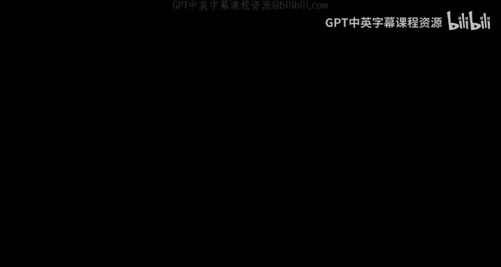
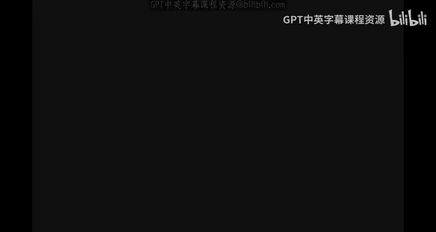
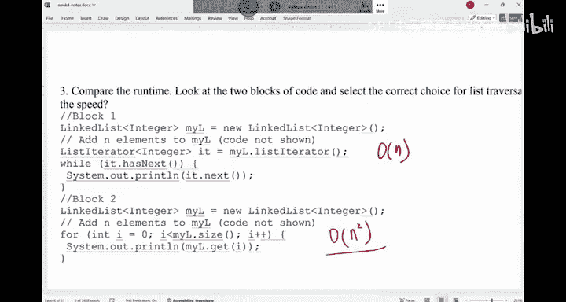

# UCSD《基础数据结构和面向对象设计（Java）｜CSE 12 - Basic Data Struct & OO Design Fall 2024》中英 - P12：CSE 12 - Basic Data Struct & OO Design - LE -A00- - Lecture 12.zh_en - GPT中英字幕课程资源 - BV1zJQHYcE8g

All right， let's get started。Morning， morning， everyone。

What we're going to do today is we'll finish up runtime and we'll do some exercise in here。So。

Project wise， I don't think there's anything new。 I think we did the quiz， too yesterday， right。

 So I think we， we did find out that some of us are looking around during the quiz。

 So well handle that。 but try not to look around。 I know sometimes people just habit of looking around once you' are done。

 but don't do that。 Okay， don't do that from our point of view。

 we really don't know if I're looking at other people's paper or you're just relaxing。 Okay。

 so try not to do that during the quiz or the midterm。No。Let's。

 let's look at the material for runtime。 right on Monday， we started runtime analysis。

 what it really does is to allow us to analyze a piece of code or analyze an idea without having to code it up。

 without having to code it up right， So we say this is asympotic analysis。

 meaning that we don't care about the minor details。

 It's a pretty coarse way to say this is kind of how you how your code would probably run。Okay。

 so it doesn't give you a lot of fine details， but it's a good starting point， okay。

I don't think this section got the time to do this problem on Monday。

 The other section was went slightly faster on this one。So let let me just explain this problem。

 and then we'll work on the rest。 Okay， so the correct answer for this one is E。

 We were asking which one of these following is true， Which one of these is true。

So if you look at the。The runtime with F N equals to this thing。

 The most dominant term of this function is analog log。很log。Right， so N loggan is a dominant term。

 We definitely say B is correct。 So a lot of students from the other section， when we were voting。

 B is right。 B is definitely right。 B is the most accurate description of this functions。 runtime。

 which is the ti is bound， but technically， C is also right。 C is also right。

If say F N belongs to big O N square。 In other words， we say n log n is。Kind of no。

 no worse than n squared。 No worse than n squared。So in theory， C is also right。

 That's why the answer is E in here， yeah。

So would you say Y it can also be n squared。

， let me plug in the， the power。 Otherwise orll sleep every five minutes。 So the idea is。

 N swear is also good because big O notation means less un equal to。That's in。

 So we are basically saying N loggan is no worse than in square。 It's， it's the same idea， right。

 So this is just not as nice， not as nice as the tide is bound。 Like， for example。

 if you ask someone， hey， tall， how tall are you。The person can say。

 I'm no taller than a million feet。Right it's true， but it it's useless for you， right so。

But if that person say， I'm no taller than。6 feet。 maybe that's more accurate description of how tall that person is。

 This N square is like that person telling you hes no more， no， no tall than a million feet。 So it's。

 its， it's a little bit above what in general， we would expect。 But in theory， C is also true。Okay。

 so in our exam， in our quiz， if we， we've asked folks， what's the runtime of this thing。

Will be very specific In general， we are looking for the tightest bound in general。

 because that's the most informative analysis。 Okay， but sometimes you do see like in theory。

 which one is true， Then you should consider real， the meaning of big notation。

Are there any questions？Right，How about we vote for the second month。

We have F N equals with this expression， right， This is the counting you have done。

 You came up with this result。 which one the following is not a correct bond。The frequency is AC。

Let me有。Start， haven haven't started yet。There we go。This。Which one is wrong， In other words。

 Which one is wrong。Both in。 which one is wrong。Alright。嗯。A lot of us saying more than one of these。

 A lot of us saying E。If you look at it， right， which ones。Is a wrong， I a wrong。Its wrong， right。

 So it's not less than equal to。 So the what's overall runtime of iPhone。The dominant term， is what。

And square。I's this thing。So is this N square。So n squares is not less than equal to log n。

It's not less than equal to。 And so， basically。A， B， and E Do all wrong。 C is right。

Can I technically say F N belongs to big O， N cube and also say this。Yeah， it can be。Right。

 so this environment is also good。 but I would to say。C is much better。 The tight bun。All right。

Are we good， Any questions？How about this one？FN equals sorry， FN equals to this thing。

Which one is true。U equals a two2 n。Which one of them is true。

We disagree with each other interestingly， for this one。Can we have a。Apple pencil。

 Can you have a quick discussion with the neighbor， Which one did you vote for and why。

Of a quick discussion。 What was your choice， We disagree on this one。

Talk to your neighbor a little bit， move your chairs if you have to， okay。So that would help you。

Solf peer instructions has turned out to be a good tool。 You know， you learn from your peers。 That's。

 that's a very important thing。Believe it or not。pencil。All。If look at the vote， guys。

 if you look at the vote， D， N E is。Its kind of more popular than if you look at a。

 the answer should be a。22 of n is very， very bad。 Okay，20 is way worse than N cube。 In other words。

 the dominant term of this one is。This exponential。 A lot of times。

 if you say my idea has exponential runtime， don't even bring it up because I would use it。

 It's called intractable。Meaning， no one can handle it。 That's why exponential growth is so bad。

 right。 But a lot of times in computer science， you think about it。

 a lot of the problems that we are dealing with on a daily basis is if you just boot force it。

 you have intractable solution。 In other words， it's gonna be factorial exponential。 But the。

 the beauty of C， S is with are different algorithms that people have designed to。

 to solve the problem that has a huge search space。But you can solve it with， for example。

 polynomial time。That is polynomials attractiveable， okay。So this one， exponential is very bad。

 Later today， I will provide a list of commonly seen run times。

 And then you youre gonna know which one is good， Which one is bad。 Okay， exponential is very。

 very bad， okay。So only a is right。 Only A is right。The other ones。

 they are always way better than exponential。Are we good。So just be very careful in here。

How about this thing， FN equals in 100。We are not looking for the tightest spun。

 We are not looking for the tightties spun。How about this one， What is going to happen。

Why does it always ask me to set up my Apple pencil。I don't even have an Apple pencil。I don't know。

Cl it。嗯。What is the right vote for this one。I think we're doing very well on this one。Allright。

 so the most popular choice is a good choice。Which random is not a correct bond。

All of them are correct。 All of them are good。 So F is a constant time。 Consant time is the best。

Right， so whatever the the， the input size is， it only takes 100 for you to finish the result。

 So constant time is extremely good。 In fact， it， it's better than of them。

 So you can see F is a member of all these。嗯。Ss of functions。Any questions。All right。

Let's look at the last。Example。In here。So we have this function called max difference。

That's what we did in here。So we are given an array。

 We want to know the maximum difference between any two elements。

And we want to count how many times each one execute， then give it a bigger notation。

 So if you do the counting and then you try to write it as big， let's assume。这太棒了。

Let's assume the tight pun， which one of them is good。What is the ti bound in here。

Assuming n is the length of the array，We are doing very good on this one。The answer。

I think most of us voted for B。Most of us voted for B， That is the right answer， right。

Because you have a nasty for loop， right， you have a nasty for loop。 So this one would run n time。

 This thing would run n time。 So it's basically n times n n square。Right。A be good。

How about this name， Can you have a discussion with a neighbor If I change this J plus plus change into J plus equals to two。

 Otherwise words， I double J and not double J like increase J by  two every time。 What's。

 what's gonna happen。Okay， another way I want you to think about is。

 what if I change this inner for loop to be this it doesn't do its job anymore。

 I'm just curious if I change the inner loop。Condition to this。

 what's gonna happen If I swap out this entire inner loop into this line， what is gonna happen。

Can you have a discussion？ What would you say the run time now。

If I change this into J plus equals to 2。系啊。no。😔，I should turn off。

I say J plus plus 2 J plus equals2。 What's gonna to happen。Is still going to be in square？

 Is it still going to be in square。Yes， will still be N square， right， So the outer loop run n times。

 The inner loop will run N D I by two times。So。N times N D I by2 is to n square over2。

 We ignore the constant factor that this still be n squared。Right。

 how about if I change the inner loop to to be listening。Do I still have n square？No。

 that was the runtime。With over runtime now， if I swap out， the inner loop will be this。Big O N。

 right， It's gonna be big O N at this moment， because now this loop does not rely on n anymore。

 All that has a super big constant。 But it's basically， you can think about this is like。500000嗯。

Or still be going。Because the inner loop doesn't rely on an anymore。 Which one is better。

 You have to be very careful If you have a super big， constant factor。It doesn't happen often。

 But if you have a super big constant factor， sometimes when you try to benchmark it。

 sometimes linear may be better than n square。 if a is not too big。Okay， but if n is super big。

 definitely like N is gonna outperform n square。Any questions。Why is this now of a sudden linear。

Are there any questions？Why I said， N here。O。Don't be sure to ask questions。 Are we good。All right。

 so that's what we have。Now we'll move on。 Okay， now we'll move on。 We have two other notations。

 They are very similar like biggo。 They are very similar like biggo， except they give you。

 Biggo would give you the worst case， right， not very worse。 sorry the worst potential run time。

Of a certain input with the algorithm， big omega would give you the bottom。In other words。

 is no better than biggo is no worse than。Big omega is no better than。 Okay。

 so the definition of big omega。 So we say F is part of big omega of G。

 If there is this C and n n that F is bigger than equal to C times G N for all n bigger than equal to n n。

It's very similar， except now Oomega is bigger than equal to。So G would provide some sort of floor。

You can multiply G with some sort of constant。Right， so if you look at F1， F2， F3。

You can say about which one is like this G is no better than。

 So big omega means this F belongs to big omega of G means F is no better。Then g。So in general。

 F is worse than G。They can be the same， but in general， F is worse than G。 Okay。

 so this one would tell you like。The kind of the。The the floor of your runtime， right。

 the floor of your runtime。How about this thing， F2 belongs to big omega F1。 F 2 is here。

 F1 is a linear function。 Okay， but it， its slope is very small。F 2 is a linear function。

 but the slope is slightly bigger。And they say this。F2 is big omega of F1。

看F2 is bigger than equal to F1。That world here。Surprisingly。

 I think well we disagree with each other quite a bit。On this one。We disagree with each other。

 Can you have a discussion。 Is that true or false， F 2 is omega F 1。Of a discussion。

 is that true or false。I'm expecting a pretty uniform vote， but we didn't get that。

 Is that true of us， F 2 is。Bigger than equal to F1。

You allow iPhone to multiply with a constant factor。You allow n to be bigger than n not。

Is that true or false。I a discussion。 I that true or false。不。The answer is true。 The answer is true。

 So this thing is true。I do have an argument， though。

 I I understand why some of us may have both for false。Since you can multiply C to F1。

Why can't I just make C times F1 that is bigger than F when in spare。Why con't they just P aC？

That would tilt to this F 1 to be above F 2。 Min is big。 Why can't I do that。

That would make it false。Can someone provide a counter argumentment to this one。Yeah。Right。

 so in here， we are not saying for all possible Cs， this must be true。

 We are saying you can pick a C。 You can pick C， such that when n is big， this condition is good。

 That's good enough。 It's the same thing for big O。When we have big we nothing of all possible seats。

 this must be true。 So you can pick。So if you look at if there are positive constant CNN And N。

 So they exist when nothing for all possible Cs。Okay， so in here。I can just pick C S1。

 then it's going to work。Right， so this is true。 How about this part， F1 belongs to omega F。2。

F1 belongs to omega of F2。Can we vote。On this one， the second one。F1 belongs to omega of F 2。

I think about doing even worse than the previous one。We used to have a two to one ratio。

 Now it's like 50，50。Between the two。Can we have a discussion， please， obviously。

 whatever I discussed didn't register， So can you teach each other， what did you vote for M， please。

Maybe you， you all can do a better job than me teaching each other。 What did you vote for。

 What did you vote for and why tell your neighbor， tell neighbor。More likely than now。

 your choices will be different。It'll give you more time to talk to each other。

F1 belongs to omega of F2。Is this true or false。This is the vote， right， This is the vote。

If you look at it， we， we say half of us say true， half us say false。 Remember， when you look at。

 it doesn't matter whether big O omega or theta later on， we're gonna discuss it。

 You are looking at the class。 You are not looking at the details of those two functions。

 If there's a constant factor difference between them， we don't care。In other words。

 do they belong to the same class？Right。I don't even know how to give an analog in here。 Like。

 for example， you say I， I don't know， using cars， right， So you say I I drive a Toyota。

 say all the Toyota's same。 That's similar， right， You might have a better Toyota than me。

 but we are all Toyotas。 There may be a Ferrari somewhere is way better than us。 So that's the idea。

 So when you compare these functions。 youre comparing their class。

 Some Toyota are more expensive than the other。 but they are all Toyos。 right。

 That's how it goes in here。 So F and F2， are they both linear。They are the same thing， right。

 They are the same thing。 So in other words， this is true。

So you basically say F1 is bigger than equal to F 2。 That's， that's okay， right。

 So because theres this equal in there， that's why it's O。You are comparing the class。

 You are not comparing small， minor details of those things。 Does't matter。 It does matter。

 It does matter in practice。 when you benchmark market。

 those small details would come out of a super old beat up Toyota， you have the fence toyota。

 obviously， those who cars are different。 when you try to drive them。 But on the surface。

 the allyotas。Right， so that's kind of the idea。 in here。 Does this make little bit more sense。

Hopefully it will register。How about this one， F1 is omega of F3， F1 and F3。In there。

Is that true or false。Oomega means bigger than equal to。You have to look at the class of those two。

Functions to class okay， and see if one is worse than the other or the same。

I think we are doing much better than on this one。Alright， we'll stop the vote。

 The answer in here is。This is。No good。No， good。 I think we are。

A majority possibility for the right answer in this one。 That's good。 So this linear is。

 is not big equal to a quadratic。How about the last one？lost the example in here。Alrighty。

 so I think we are doing better now， the answers。A right。

 so this quadratic is bigger than equal to the linear。 And in here， all those apps there are costs。

Bigger than doesn't mean it， it's better， right， So in fact， it's worse。 The run time is worse。呃，不。

So those are the costs。Any questions？So that's omega。 Okay， omega is bigger than equal to。

 O is less than equal to。 And there's this theta。 The is the tight bound。The definition of theta。

You can think about there exists A C 1， C 2 and a n that C times G， C 1 times G。

 C 2 times G would bound F。Another way to think about is if F is big of G and F is also big omega of G。

 then F is theta of G。 In other words， we are basically saying they must be exactly the same。

 When we say exactly the same， we are comparing the class。Okay， so that's theta。

 And a lot of times we， we really use theta notation。 That's the best。 It's like the tight bond。O。So。

 for example， you can say 3 n plus 20。 It is theta N。

This 5 n square plus 50 n plus 3 is like theta n square。 So theta would describe the exact class。

The exact class。Are we good。How about this one。F1， F to F3， the same thing。 F 2 is theta of F1。

 is that true or false。F2 is theta of F1。For some reason。

 I don't think the votes are coming in that that this show on your side。

 The votes are coming in or no。I don't think on my side， I don't see any of them。Nonetheless， O。

It's not bother with that。 So the answer would be this is true。 This is true。 They are the same。

 How about F 2 is big theta of F1。 Is that true。That's true。 They are the same。

 they're exactly the same。But F3 and F1， F2， they， they belong to different classes。

 So you can't say they are fade to each other。Are we good。So a lot of times。

 when we say big notation， give me the big notation of this thing。

 what we really mean is big theta is just a weird way that C S says computer science people have been doing this for years。

 So theres this is， is， in fact is， is， is not a good thing that people always misuse。

 Big old notation for theta。 And they give me a big notation。 What they really means theta notation。

That's what they really mean。 Okay， under certain situations like under certain algorithm。

 sometimes it is very hard for you to come up with a theta notation。

 That's when people use big O to approximate theta。 But on everyday life， a lot of them people say。

 what's a big O， they really mean big theta。O。So it's just a kind of a weird way。 It is not wrong。

 but it's just not as precise as we want to。 Okay， so just know about this。So big O。

 a lot of time means tight bound， which is theta。嗯。Let's look at this exercise in here。Of this sum。

 the middle。So the array size is N， assuming that's the case。 and you are。

You create this range variable， you have the star， you have sum equal to 0。

 and then you add things up。 What is the theta notation of this thing。The ball are in now。

What do you say。Take your time。 What's the theta notation of this code？Be careful。 Okay， be careful。

A majority of us。Are wrong， a super majority of us。Heres what。Be careful and we vote for this one。

Just because they see a full loop doesn't mean it's linear。

Just because you C24 loops doesn't mean it's catic。Okay。Think carefully。Right， we'll stop the vote。

 Can you teach each other a little bit， please， what did you vote for。

 I can tell a majority of us voted for the wrong answer。About 10 of us get the right answer。

Out of 90。 So can you talk to a neighbor。What do you they vote for？How many times would this？

 How many times were this？If you look at this loop， how many times。100 times。

 this rule is on there 100 times。So I'm gonna run half of the length of the array times。This thing。

 if you look at you get from start is less than star plus range， whatever range is。

 that's the number times this loop is going to run。And this range is 100。

 so this thing is going to around 100 times。So it's theta1。It is not theta N。

 a majority us voted for theta N， just because you have a four loop doesn't mean it is a linear time。

 right， It looks linear， but it's not if you look at it in detail。Right。

If you change this range to be something like this。Then， it's a linear time。

RightIf your range in here is related to n。Then you are looking at a linear time。Algorithm。

 as of now， it is a constant time。It is a constant time。Does this make sense because the loop。

 you go from start， you go all the way to range range is just 100。Yeah。Yeahや。

How is How is the concern time。So you， you did give an array， right， You are given this array。

 And I think the constant time idea comes from this for loop。 right， If say have a full loop。

 I'm going through the array。 How can its a constant time。 You have to look at the detail。

 You have the starting point。 So if you are given this array。

What we are doing is you have this start。And the ending point is simply start plus range。

 range is 100。So whatever you start， you gonna end at start。Plus， 100。

 you're gonna go through things in this range。So in other words， you're。

 it's only going to run 100 times。So it's not related to N。You have one operation， one operation。

 one operation，100 operations， one more， so altogether this rub is going to 104 times。

 no matter what the size of the array is。Is not related to the size of the array。

That's why If you change it in this way， If you change range to be related to the length。

 So you are no longer adding it like this， You are adding N D I by 100。

Then this loop in here would run N 100 times。 Remember。

 ice go from start to be to be less than start plus range。I didn't start from 0。 If I start from 0。

 it is related to。AndBut in here I start from start， and this is the range。O。

 so don't assume I saw from there。 I didn't solve from zero。Any questions。For this good question。

 Okay， Any other questions。Alright， so those are the no patients。

There are a few things I want to point out。 Number one， we have learned about theta omega O。

 We also learn about the best case。 average case， worst case do not assume they have this one to one relationship。

Best case。 worstors case。 average case is you have algorithm given different input。 Your code。

 your idea may behave differently。Okay， that is those three cases。

Those descriptions of O omega and the theta， they are used to describe under a certain situation。

 What is runtime。 What's the worst possible runtime， That's big。 What's the best possible runtime。

 That's omega。 Theta is the exact runtime。 So you can't assume best case is omega。 No。

 it doesn't work like this。 Once you say， okay， I have the best case situation。Of the best case。

 situation from an algorithm， you can use all three of them to describe it。You say， okay。

 what's the big analysis of your best case。 What's the big omega analysis of your best case。

 What's the theta analysis， similarly。The， the qua get messy。But you can use bigO。

 omega and theta to analyze average case。You can use all those three。

Ways to describe the runtime of those three cases。 They do not have a one to one matching。

 I do not want you to think worst case must be using biggo， no。O。Does that make sense？

that's one thing。 The other thing is， you should， as a C， S student。

 you should know your head the runtime of commonly used。Like algorithms， right。

 So what's the worst was kind of as it get better。 So I would read this down and this thing。

 you should remember it。So what will go from the worst to the best。So the worst。

The best Whats the worst that you can potentially。Realize。对。Factctorial， right， in general。

 factorial is the worst。 You say my algorithm runtime is factorial is the worst。

That's the worst kind of。 It's， it's not like the idea bad。 It just， it's intractable。

 You can't implement it。It doesn't work，Then the next worst is exponential， exponential。Right， so。

 for example，3 to the power of N。2 to the power of N 3 to the power N is worse than two to the power N。

Okay，The bigger the base is， the worse it is。That's something you have to know。 Okay。

 so 3 to our things is worse。D to department。Meaning。So， for example， this thing， can I say 3。

12 N belongs to big goal of 2，12 N。 Is this true or false。3 to the of N is big O of two the N。

 That is false。2 puff N belongs to big O，3，2 puff N。That's true。Okay， so3 is worse than two part。

 other words， the bigger the basis， the worse it is。嗯。

The easy way you can do it is you just take limit and approach infinity。 you divide them。

 If you end up with a constant in the end， then they are the same。And in here。

 you are now gonna get a constant。So you have the exponentials。 Then in general。

 you are look at polynomial。So， for example， big O and cube。Big O square。Big o。Bgo N， for example。

worstors too best。Go like this。Theres， in general， a lot of the algorithm that we deal with has this algorithm。

 this runtime en log。 en loggan is worse than。嗯。N， but way better than n square。

But you better an n square。And then you have the like square root of N， something like this。

So it's polynomial， right， And then the next best is log。Log N a lot of times people say。

 can you ignore the base of log， Yes， log base n， log base 3 and they are the same， okay， so。Bgo log。

 base 2， n， big go log， base 3， N， log 10 N， They are the same。 They are the same。

 There is no difference。Okay， log is a very， very， very good algorithm。

 So if you have a runtime that is log， it doesn't matter what the basis is。

 It is an excellent algorithm， okay。The best， the super best。Is a constant time algorithm。

Any questions for this。You should remember this， right， polynomial， the worst。And then exponential。

 and then polynomial。You know， you should know where en loggan is。

 You should know like log and constant。 Any questions。All right。So。

Let's look at some of the exercises。嗯。I， would leave。These things a little bit。

 We don't have time to do it during class。 But this is like P A。P3 stuff。 right。 So you have sorry。

 this is P4 stuff。 The iterator。 So you you can use the iterator to crawl on the。On the list。嗯。

What I want to do is I just want。 We only have five minutes。I want you to look at this one。Okay。

This one is a useful exercise。 I have two blocks of code。 in P 3， we implemented a link list。

I linkless， you can。Print out the link list。 So this is， I have a link list。

 I inserted n element into the list and then use the iterator to print out the list。 This is block 1。

 And then this is block 2。 What it does is I created the link list。 I inserted a lot of things。

 I'm using get。Can you talk to your neighbor， What is the runtime of this thing。

 What is the runtime of this thing， Are they the same。Think about how you implemented G。

There is no vote。 Okay， I want you to have a quick discussion。

 What would youll say the answer is for this one。Are they the same？

Do they give you the same runtime in here。If you have to implement something like this。

Are they the same？How many of us think they are the same。Some of us are reading hand。

 they are the same。Some of。The majority of things that are different。

 What's the runtime of this thing。E33 to crawl on the list。What do you say， the runtime is。

Is a linear time。So you basically move to right。The right to the left。

 right to the left iss like you have a rope and you have this robot cr。 And this is a linear time。

I think most of us would agree， right， How about this， this， this code， Is this also linear time。

It's not linear time。 Some shaking your head is not why this thing is not linear time。

What what did you do when you implement the get method for your P 3。What did you do on the link list。

What did you do， You start from the head。You hop forward I times。Right， that's what you did in P 3。

 And in here， the ideas， I， I would say， let's go to the zero spot。 You hop from head。

 hop to zero spot。 And I need to go to the first spot。 now。 What do you do。

You suffer from tear again， You hope。Twice。 And so I need to go to next。 and you start from 0 again。

 It's like if want to drive from here to Vegas， then to L A。

 you didn't go from here to Vegas and then the to L A。 You drive back to San Diego。

And then you drive from San Diego to Vegass and then to LA。

So you always restart from the very beginning。Right， so this thing is big O N square。

This is very bad。 You do not want to use a link list and use gett to traverse the list。

This is a very， very bad move because for linked list get always from the very beginning。

So you want to use the iterator to traverse a list。You do not want to use the gapAT method。Okay。Does。

 does it matter if I use the Eerator or get on a ray list。

It doesn't matter。 It's the same runtime。 It's all linear， but。For link list is different。 Okay。

 think about this。 We are done today。 We are done today。 Okay， I'll see you all on Friday。

