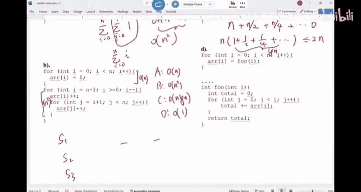

# UCSD《基础数据结构和面向对象设计（Java）｜CSE 12 - Basic Data Struct & OO Design Fall 2024》中英 - P13：CSE 12 - Basic Data Struct & OO Design - LE -A00- - Lecture 13.zh_en - GPT中英字幕课程资源 - BV1zJQHYcE8g

All right， I think we should start okay。

So。Oops。就是。Turn off。

The first thing we're going to do today is I want to address a little bit about the me term next week。

Okay， so next week on Wednesday， we have our midterm of being here for 15 minutes long， okay。嗯。

What will be covered in the midter， It will be everything from day1 until today， until today。

 So today， we most likely won't cover anything new。 We're gonna just do exercises， but。In detail。

 the topics include like exceptions。Generics， arrays， link list， iterators， runai。

 Those are the things you'll see in the meantimeter。As for the content of the midterm。

 we had several past midterms and finals posted on canvas。 You can use them。

 but I do want to remind folks this quarter's midterm will be different from the past quarter's midterms。

Um。The， the major difference is you can still see multiple choice， but the major difference will be。

 you will see quite a few coding questions。Coding questions， okay。

And those coding questions may sound scary， but I can tell you。

 guaranteed that's how I pick the questions。They will come from the PAs。

So if you've done the PA yourself， you shouldn't be scared at all。 You should feel very。

 very comfortable going in there， very confident。And the the reason is。

 the reason why I start to decide to do more coding questions is last quarter。

 when we were trying to grade the final exam of CSE 12。

And we realized some students don't even know how to write a for loop power loop。

It was very scary moment for us。 And the student did perfectly in the Ps。And obviously。

 the student either cheated or got up from ChaGBT or something。O。And there there aren't too many。

 like there are four or five out of 300。That's what we've。Found out。 And hence。

 what I decide to do is we will start to have more coding questions。

 And the way I design the coding question is， as there are maybe two coding questions。

 I'll pick some of the methods from the P， and then I'll change it just slightly。Okay。

 so you should be able to like， I'll give you the description。 say， get method from link list。

 I'll give you the description。 What this method is supposed to do。

 What kind of exception is supposed to throw， You not have to memorize those things。 You just be you。

 you must be able to write the code yourself。Okay， that is how the coding questions will be structured。

Because I'm super good at memorizing。I use TGB to help during the PA。

 and I'll just memorize what I have。It may not work because Ill change slightly。

So if you have done it yourself， you should be able to just address it very quickly。 Okay。

 that is the the meter。So I do want to make sure everyone is fully aware of that The past meterms。

 there are definitely good resources for you to practice the concepts。

 but there will be coding questions。 I， I hate coding questions more than you do because it's so hard or grade。

 Okay， we spent hours readinging those coding questions。 but I guess it's necessary for us to do it。

Are there any questions for the meter， I'll be happy to address any questions about the meterm。

Alright， so next week， Wednesday in here during class time。嗯。If there are no other questions。

 we'll work on this worksheet about that。Okay，This first part of the workssheet。

 I think we skipped it。And then we did this problem。Well， let's work on these exercises a little bit。

 okay。So。When we examine the iterator， you have iterator and then you have some sort instanceense variabless in it as left right index can we move forward。

Which variables are modified by the following function cause。 If I call these methods。

 if I call next。Which marbles？Should be modified。 In other words。

 you may say equals to something else or you say equals to2。Can you。Read it out in here。系。

So what would you say， this is for a PA4。Pier4， like this coming period that will be released today。

 you're going to write it to the Eer class so。That's what we'll see。What would you say？嗯。

That will be changed in here。Let me bring up the Java do for you。If you my next previous， this is a。

It can make it a bit smarter。And then， remove is here。What would you say， these variabless are。

Change， so when you do P 4， you definitely follow the right up， please。 Okay，1， one feedback I got。

 I was walking over from the other class。 I was looking at the tutor feedback。

 I think they were saying， well， sometimes when when they were helping our students。

 they realized that sometimes we didn't read the write up properly。

So if you are confused about certain things， make sure the first thing you do is go back to the right up and try to read through the whole thing。

 Sometimes it will resolve your confusion fairly quickly。So how about this， if I call next？

What will be changed， assuminguming everything is working。I would say left， It will be changed。

Left would be changed。 Left equals to left dot next。Right equals to right dot next。

Index will be added by one。what should I do with forward， can we move？If you look at where's next。

This is the next。 This is previous。Where's next， This is next。Should I set can move to be something。

Carmo will be with。True， right will be true。 How about。Forward。Forward would also be true。

Why do we need forward？What's your point？Why do we need forward？Yeah。I wish the end of the list。

What does forward do， What does forward do。It indicate whether the eat has moved image which direction。

 It was moving before。Right， so you once you reach the end with this。

 obviously you can't move forward anymore。 But the idea of the forward is sometimes you can look at this one。

 right， it's not next。 It's remove。So you're gonna remove from the list the last element that was returned by next or previous。

 because you can only call remove。Right， after you call next or previous， you， you must know。

 did I call next or did I call previous， Because they may have returned different things。

 And that's the thing you're gonna remove。So when you try to use remove method。

 you must consider can remove。 Can remove is like a threshold。 If you can't remove。

 you don't even do anything。 But if I can remove， they have to look forward。

 that would indicate which node you' gonna delete。Before it is true。

 it means you call it next and say， well， what was the thing that was returned by next。

 That's when you try to delete。Okay， so。All five of them should be changed。

Previous is the same thing。Left， right。Index。Can remove。Forward。

The the next thing is the remove method。 So I want to remove something。嗯。

If you look at remove methods， if you say I can remove， if you can remove。Do I change level rate。

If I said， let me delete this thing。You have something str between two an node。 you say remove。

 you're going to either remove one of those two things。Right， do I change level right？

But I甚 both of them。No， you change one of them， depending on what。

How do I determine which one do I change。Right， so you have to look forward and decide which one you're going to delete。

And then once you use， once you say， if I delete right， if I do remove this node。

 this right will be pointing to the node after it。 So you have to determine whether you're gonna change either left or right。

 So it's one of these two。Not both。Right， in general， do I change index。Potentially。

 if you delete the thing on the left side， your index is minus minus。 So index is possible。

Possible underline it， right， So it， it depends on which node youre gonna delete。

Because if you delete this thing on the right side。

 you really don't change the location of this iterator。Okay。So， index。How about can remove。

Do I change can remove after a car removed？What do I do with it。Fosse， right。

 so you cannot delete consecutively。 So you must change， can remove。

Youre not going to change forward。A backward。That's what we have。The last thing， add。

 when you try to add something， I think if you look at a， it inserts。This is。Where's a。Md details。

This is removed set at， okay。So when you do add， this element is inserted immediately before the element。

 that would be returned by next。Okay。So it's inserting before the iterator。

 It's inserting before the iterator。 The new element is inserted before the implicit cursor。

 subsequent calls to next would be uninfected， and previous would not be infected。

 So you should think about when you try to insert something。

 there will be something that will be inserted to your left in general。 Okay。

 So it's either left or right。 index potentially can be updated。How about can remove。

Should I update can remove。You have to look at the remove method。

I think you have to set it to be false。啊。If you look at it。There is this requirement。

 It can only be called。 This is the remove method。 It can only be called。If at has now been called。

Okay， so add might as add something you have to set can remove to be false。You can't remove anything。

And you have moved the cursor。嗯。You don't have to memorize these things。

 You don't have to memorize these things。 It's useless。The most important idea is when you write P4。

 please pay attention。 Please pay attention as you。Look at what variables should be updated。

So if you say， I have a link list， and then I want to remove。The whole thing。嗯。For example。

 if you say this is my linked list， assuming theres some tuminos in here and in there。

If you want to remove this thing。Right， do you want to say do you just want to delete the whole list。

This one。 Oh， this is the dummy node。 This is dummy node。 This is the the real node。

 You want to delete this thing。 You call out next。 the e would be here。

 and this node would be deleted。 This one would become node 0。 This one would be sorry。

 this is index still be 0。 And this is the the left pointer。 This will be the right pointer。

You call next again， call remove that this node will be delete。That's how it goes。

Eerers are very important， not because they are easy。

 It's just because they are more efficient for you to traverse the list。Okay。嗯。Another thing。

 when you do P 4， when you work on P 4， please make sure your P 3 is good。P 3 is the， the link list。

 Your link list must be crack before you can work on P 4。

 So we will publish P 3 with all the test cases。 You can upload your P3 and check。

So make sure you pass everything for P 3 before you work on PA 4。

 okay because if you have bugs in your link list。Your iterator may fail。

 but it may not be because of the iterator。 It is because of the link list。 When we create your P 4。

 we will use our link list as the link list for you。 So in other words。

 you will now be penalized if your link list is wrong， but。If a link this is wrong。

 you can't really do well on your iterator。So。That's how it goes preference。Allright， next thing。

We have this eer， right， So this is the link list。嗯。And then you have three items in here， Taminode。

 Taminode。 This is the iterator okay。So， can you。Work on these things。 If I call next。

 what will be returned from this function call， where thiser will be， right。

 have a discussion with your neighbor。 I think the one of the T A is told me not from our class。

 they， we shouldn't move the chairs today， because they have a test at 11 o'clock。

 So if you talk to your neighbor。Maybe you have two。Speaker to be louder。

So how would you say the outcome of these things are？

All these operations are sequential to each other。Are sequential to each other。

What would they say the answer is？嗯。What would be。The first next call was going to happen。

The left will be here。The right will be here。Right。What will be returned by this call。

 Do I return the Dmmin node， or do I return C。If I call next。Do I return now or do I return C。C。

 right， so the first node at the location 0。Anything else in here would would change。

Forward will be changing to2 index， it would not be one。Cant removal or concept will be true。系。

So that's the first next call。 The second call would be next again。So I'll be sitting here。

Left will be in here。 Right would be in here。 Index will be 2。Forward is true。

Time remove more that to still be true。Are you good？And then we say， add S。No， no。

 I need to insert something into this list， into this list。When you， when you reads the。

The Java do for a。one more thing。 We do the P。 Our P does not necessarily follow exactly what the Java do for link for this e does。

 So follow the P right up of what you need to do okay。In here， we say insert that certain position。

 It is immediately inserted before the element that would be returned by next。

And after the adaman that will be returned by previous okay。There is a verification。

 The new element is inserted before the implicit cursor。 A subsequent call to next would beect。

 un unaffected， and the subsequent call to previous would return the new thing。

So if this is what we have， we say we add a new spot。 where do we add it？Is it gonna be C， S，S or C。

Where I think this is also asked。Or is this CSES？Which one。

Just imagine when you insert something you call next。

 it doesn't affect what's going to be returned if I call next。It's going to be this thing。Right。

 if I insert it， it's not gonna be affected again。 So where， where is this as new node inserted。

It's going to be in here。Right。So it will be inserted in this spot。

And this left is now pointed over there。And you have to make sure the link is still good。

The index at this point， you should increase it by one。Okay， can move should be false。

Because once you add something， you cannot remove it。 Anything else I need to change。Anything else。

So you add something。To， to the list。Left right and all those things， anything else I need to change。

Anyone。What else do I need to change， I can't updated everything here。What else？Yeah。The size， right。

 So you have to change the list size。 now it has four things。 Very good。

So don't forget that this is the inner class of your link list so you can change the instanceense variables of the list。

Once we finish this part， we call next again。Then we'll be string between the last two node。 right。

 If were called next， I'll be sitting here。Be sitting here。And then call remove。

Do I see an error if I can remove at this moment？No， right。

 So you remove the thing that was returned by the previous moment。 The movement was next。

 This thing was returned。 So this guy's cut out。Does it make sense？So E， the node with E is cut out。

Are we good。All right。So when you write P4， P 4 is gonna be a easier one compared with previous P S。

 Okay， it's mostly because number one， we know we have a midter next week。

 So we intentionally make it a little bit shorter。 The other thing is in general， iters。

 We just pay attention to details。 There's nothing fancy in there。嗯。For this one， the runtime。

 I think we talk about it， right， for this section， did we， I think we talk about it。

 We know that when you try to traverse a list， a link list， you shouldn't use。Gt。Because this thing。

呃。Linear。And you run a linear algorithm n times。 So this whole thing is n squared。It's very bad。

It's very bad。Because you constantly have to go back from the very beginning of the list to move forward。

Using an iterer is linear high。That's what we have。So the runtime is much， much better。

You do not want to do something like this in the linked list。My question for everyone here is。

 how about a realist。What's a runtime。For these， for this one， What a runtime for this one。

 If I A reallyis also have get method。Rius， in fact， also has the iterator。In other words。

 anything you have done in here。You can just change the link list into a。

 everything else would just work。What's going to be the runtime for this idea。

 what's the runtime for this idea？Can we have a。Quick vote on this idea。诶。Linear B。Constant。

 C N square。D， I don't know about for this part。 If I use this idea。

 I change the link list into a real list。 What is gonna happen。

Please make sure you have your frequency correct， okay。

We can fix your clicker if you have the right frequency。

 We can find your clicker in the list and assign query to you。 But if your frequency is wrong。

 we can't even find your clicker。 That's very tricky。 Okay。

 so make sure you have the right frequency。嗯。What would you say the runtime if I use this idea？

In the array list， array list。ok啊。I think we are getting this one。 We are getting this one。

 A majority of us said a。 It's a linear time。That's correct。And so you have a a， you have the the。

 the eerator。 There is really no need for11， right， You just have two indexes。That's how it goes。

 right， So it's， it's gonna be linear。 How about this guy， I use ga method。

 A reallyius has ga method。 we implemented in P 2。 So if I do this thing。

 what do you think the runtime is， Let's vote again。For a rate。

We disagree with each other quite a bit on this one。If I use。

What we are trying to vote for is the overall R runtime of this block。

 If I change link this into a real。That's what were voting for okay。We have a tie。On two choices。

The two most popular choices are Thai。 Can you have a quick discussion across the aisle with your neighbors。

Right。You should be comfortable talking across the aisle， our Congress doesn't do it。

 but we should do it， right。So。Talk to each other， what would you say the answer is？我为什么。

This is the current vote。A and C， they kind of dominate。It looks like after discussion。More people。

voing for a， that is the right answer。 Why， because when you have get I in Aures。

 how did you implement G I。Think about in your head。 What did you you do。You just return， right。

 return data I。Theres it。So data I is just， it takes constant time to to get there。 So for a rate。

 this thing is big1。 So the whole thing is gonna be linear。All right。

So this is kind of the difference between using an iterator on a linked list where a real。

Are we good？So be very careful in here。Right， so we have a ton of multiple choice in here。A is， so。

 for example， we have a bunch of statements。 We have a bunch of statements。

Are these statements true or false， We are assuming big O is the tightest bound。

 and we are assuming unless。Specified otherwise， while assuming the worst case。Okay。

 so for these statements。Is that true or false？You go through each of them。 You can give you time。

 Can you do it yourself。 What is。This is kind of the multiple twist you may expect from a meterm。

Given the problem， you analyze it quickly and then solve it。Yeah。AC frequencies， AC。

So try to get you the answer for every one of them。Okay， we'll just go through them quickly。

And then we'll get started with hashing。Alright， so how about the first one。If F is big O N。

 we can definitely say F is big O n square。If we don't assume is the not。

 if we don't assume the tide is bound， Is that true of us。True， right， so less than equal to。

 if you don't care about the ti bound。Anything that is belongs to big O N is big O O N square big O N cube。

 right， So this is true。How about the second part？F is bigger n G is bigger n square。

 Then we say F is better than G。 if we don't assume the tide is bound。 Is this true or false。

 Can we have a vote。 A is true。 B is false。If， if we don't assume the ti is bound， F is。

B O NG is big O n squared的 F must be better than G。A is true。 B is false。

If you don't assume the tight bound， if you don't assume the ti is bound。

 when we try to use these notations。Look at this。 Look at this。诶哼。We are trying。

 We are striving for 50，50 in here。 We are doing a great job。 You see， it's。

 it's totally organic in here。 Nobody is forcing anyone to vote for a choice。 Now。

 is this true or false。 Can you talk to the neighbor a little bit。If we don't assume the tide bound。

Is this good or bad， Is this good or bad。F is big O N。Geez， Beale and Sre。Is that good or bad。

Remember， we don't assume the tight bound in here。If you don't assume tight bond， things can be。

ItThey'd be more vague。Alright， so canness this Fn is 3 n plus 5。Canness say FN is big O N。

Definitely， right。 now I say G N equals to 100。Can S G N is big n square。If I don't assume the太棒。

Less than equal to big O is less than equal to。 It means this function is no worse than this thing。

 In other words， can I say。G， which is 100， is no worse than。C拽的一个方。Definitely， I can。

RightSo if you don't assume tight bound， there's really no way to tell like anything that belongs to big O N can will also belong to big O N square。

Right， so in theory， that's the case。 So this is false。This is false。 If you assume tight bound。

 then definitely， yes。Right。So just be careful in here。By definition。

 big O one is less than equal to。Are we good。Next to a pretty report， big on notation。

 Care about when A is large。That's true。In CS C 12， we assume the worst case by default。Chhu。Right。

 now here are the data structures。 right， I say， okay， what what's the， the overall cost。

 We are thinking about the overall cost in the worst case scenario。

When we have an array and will insert an element in the array， the runtime is big O N。

Is that true of us。Yes。to make sure how you all feel about it。You insert something into our array。

被告人。Is that true or false。You about doing good。No。I'm not doing good。The votes are， again， tied。

We are looking at the overall cost。 We are looking at the overall cost。

Of inserting something into an array。嗯。I don't know。Maybe the question is confusing， our student。

Is this true or false， you insert something into array whatever have a linear time。Look at the vote。

 More people are voting for the right answer。 but like about half of us are saying。No， this is true。

This is true。 Why is it linear。 Can someone tell me why is it linear， yeah。Right。

 so when you insert at the very beginning of the array， that's the worst case。

 You have to shift everything down。 right， that's if you remember in P 2， what you did。

 when you add something， you have to shift everything down and then insert this spot in there。

 So that shifting is the linear time operation。So the worst case is linear。嗯。Does that make sense。

 questions？Next one。When you try to search for something in a array， the runtime is n squared。

 iss that true of false。I already， look for something in there。 The runtime is n squared。

In the worst case scenario， in the worst case scenario。

You have to imagine in your head when does the worst case scenario happen？How do you do it。

 How many things you have to go through。If you count， the number things you have to go through is。

 is proportional to N。 That's a linear。 If it's proportional to n squared， that's n square。

Were doing much， much better on this one。 Thank you。 So the answer is false。So that's why we have。嗯。

Finally， how about this one， DD is something in that rate。 The runtime is be1。

Think about the remove method you did for P2。What would you say， remove something from an。

The worst case scenario。When we say remove， it doesn't mean that you， you just delete it， right。

 You have to consider the overall cost。Of this entire remove method。 Just think about。

In the room I are implemented for PA2， you do do it。U。Stop the vote。 Were doing better。False。Right。

 so in general， we call insert。Find。Remove。We call them dictionary operations。Dection operationss。

For a， it's linear time。 If insert something， delete something， find something。

That's why it's called the list。 It's called the linear data structure。How about link list， insert。

 find， delete。 If I insert something into a link list， the cost is big1。 Is that true or false。

And we vote。Insert something into an linked list。You got PA 3。Add something。Into a linked。

Worst case scenario is a big O1。 We are looking at the overall cost， not just this insert step。Okay。

So just think about the overall code for your in add method in P 3。 What does it do。Allright。

I don't know。We have about 50 out of 70 people voted for the right answer。 This one is false， right。

 It should be word。It's， it's not constant time。 It's a。Linear time， you have to go to the ice spot。

I have to go to that spot。Like， like， when， when do I have the。So， let me close it。

 When do I have the worst case， If I have a linked list， Doub linked list。I said， insert something。

When do I have the worst case scenario。嗯。In the middle， right， So if you say insert at the front。

 then you go from head。 That's one spot。 When you say insert from the tail from the end at the very end。

 then you can go from the tail。 But insert the middle， you have to hop or two times。

So that's going to be a linear time operation，When you try to search for something。This is true。

 When you try to delete something。It's all big O N。

 So if we think about the dictionary operations Liless are， they all give you big O N run time。

 whether its due to shifting or whether it is due to seeking， right， so it's。

They have their own prong cons。All right。Any questions。For。This runtime on a linked list。Yeah。

What if we have a pointer in the middle， then the worst case would be， then。

 you can remedy that worst case by S A O insert third quarter。Yeah I have a quarter。To the pointers。

 And there is a this special link list called skip list， where you have several layers of list。

 Its like the idea of several pointers is more like a， I don't know if you write the cha in here。

 I don't know if there is an express line on the cha to say we won't stop at a certain stop。

 You go from one major stop to another major stop。 if， if you have this kind of system。

 this called skip list。That would remedy some of the issues in here。Any other questions？All right。

How about runtime analysis， I have these codes。 I want to look at the runtime。

So you have these codes。 Can you figure out the runtime of each of these things。Okay。Useual time。

 How about we do it together， How about the first one。

I equal0 I So less than n plus plus I J goes from 0 to I。Was a runtime。

Is it linear or is it quadratic？嗯。Cdratic， right， is's quadratic in here。 Why the quadratic。

 you can do the sum。 I goes from 0 to n。J goes from 0 to I 1 step。 So this thing would run I times。

And this basically means 0 plus 1 plus 2， all the way to n。And this is。And square。

So even if you have an auto loop on an inner loop goes from for you I to n or inner loop goes from 0 to I。

 Those things they are always kind of a linear cost。

So you are looking at a quadratic function like this。Are we good。Allright， How about B。Distening。

I could a 0， this for loop， this one。 Can me do a quick vote just for fun。Right。Let's vote。

 what's the runtime of this thing。All right。We are doing good on this one。 We， the both is like B。

 most of us think。quadratic， that's correct。 What I want you to see is this part is big N。Right。

 we know that's a linear time for a loop。 And this part is n square。So basically。

 you can imagine if your algorithm is made of several steps。So if your algorithm is like F， step 1。

S 1， S 2， S 3， you have three steps， for example， what determines the O R runtime of the algorithm is the worst part。

 The worst part will be the one that determines the O R runtime。Okay， just like。

 if you have a team of three people， the worst person would be like。The speed of the team。 So S1。

 S S 3 in here， just have two steps。 The bigger of these two。 So there's a this formula。

F plus G means the combination equals to the max Big of max of F and G。In other words。

 the worst part would dominate。嗯。Are we good？This C is a little bit tricky。 Can you。Ran。

Can you analyze it and then vote in on this one。C is a little bit tricky。

The walls are all world of place。What's the answer。Let's。Let's stop the vote。 Okay。

 I think the answer is more like C。 More people voting for C N log n。 Y the N log n。

wheres that lock coming in place？Is it D by2。we have the factor divided by2。

 that seems like the case。In fact， if you think about it， when I， I start from an。When I is N。

This inner loop would run n times。Right， and then I becomes N over2。

The inner loops run N or two times。Then I becomes N War4。The inner loop would run on four times。

All the way， when I become0， the inner loop would run zero times。So if you think about it。

There will be log and terms in here。There'll be log in terms。1 plus a half plus a quarter。

 plus all those things。 This that goes we。What's answer to that。Its less than equal to 2。

If you have one plus a fourth， plus a quarter， plus all those things。

This sequence is less than equal2。 So this thing is less than equal to two times n。 It's a linear。

 This is a linear algorithm。It's not a log。It's not a loggan。Okay。So just be very careful。

 And the way that say， well， how do I avoid this kind of problem。

Normally the way I approach it is I start from when this outer loop has some sort of value。

 I think about how many times the inner loop would run。 and you repeat this process。

 And then it's all about math。After that。Okay。SoThis one is linear time。

I guess we will have to stop here in here。 this D， I would for you to figure it out yourself。

 once we come on Monday， we'll get started with hashing， okay。So if you can。

 please also bring this note。For next week， we don't need any more notes next week。

 bring the same note next week。All right， we are done today。 We are done today。

