# UCSD《基础数据结构和面向对象设计（Java）｜CSE 12 - Basic Data Struct & OO Design Fall 2024》中英 - P15：CSE 12 - Basic Data Struct & OO Design - LE -A00- - Lecture 16.zh_en - GPT中英字幕课程资源 - BV1zJQHYcE8g

Oops， all right。I think we should get started in here。 Good morning。 Good morning。So， today is the。

And week 5。 So next week is the beginning of the second half of this quarter。O。

So we finished reading the midterm。Yesterday afternoon， after reviewing them a little bit。

 we release it this morning so you can find your midter grades on graycope。These are the statistics。

 This is the M C Q。 As you can see， in general， we are doing fairly well with the M C Q。

 So M C Q is worth， I think，14 points in total。 And this is the coding question。Proportion。

 a majority of us are still doing very well。 but we do have folks who struggle quite a bit with coding。

Right。And if you struggled a lot with those coding questions， numberer one。

 they are exactly the same。 I didn't even change the thing from the P， A。Okay。

 so if you didn't do well， you， you got to go back and review your P。 Okay， so that's number one。

Number two is out of of the folks who did poorly on the， the meter。You still have a second chance。

 The first part of the final exam will replace your midter， if it's higher。If it's higher， okay。

 so the entire mediumter is worth 24 points， but the total number points is 26。 In other words。

 you can get above 100%。 I think some of us will get above 100%。 and that like， for example。

 you get 105%。 And that actual 5% will be factored into your overall grade。

 So it's gonna help you okay。嗯。That's the plan。 But definitely review it。

 If you see any greeting mistakes， greeting mistakes。

 meaning this rubric is your code deserve this rubric， but we didn't apply this rubric。

Or if you say my， my， my code is， in fact， right。 But you said it's wrong。

 If you are very sure about that， please make a re request。

 The re request is due by this coming Tuesday。Okay， so that's what we have。嗯。

Are there any questions about the meter。Yeah。The total points is 14 points for M C Q。

12 points is for the coding。What，What's the question。Yeah， you add them up together。

 And whatever you got， divided I by 24， that's your percentage。Any other questions。さ。O。

I hope the me term is fair。 but if you have any suggestions， let me know okay。

The final example will follow a very similar format， a bunch of multiple choice。

 but there will be more coding questions。 There will be more coding questions。O。

So that's a very important thing， I believe。Now。What I want to talk about is。Hash， hash table。

 hash map， Ha set。 that's， that's the， the thing。Well hopefully we can finish it this week and then move on。

 Okay， so last time we talked about the idea of hashing。

 The idea of hashing is you have a lot of data。

You have a lot of data。 You used to say， let me just store them sequentially in a array or sequentially in a array list or in a link list。

 whatever the structure you use。 And then you do a linear search。Right， that would work。

 But the issue is everything is linear， which is slow。 So the idea is。

 instead of storing these elements sequentially in an array。

 I'm gonna first convert all the data have into an index into an integer。

And that integer is the index。 And then I'll put it into in the table。

 whatever this data is at the right index。And we also did this exercise where we say cols are unavoidable。

 Remember the birthday paradox， so。There is no way， no matter how good of a hash functioning design。

 you can't avoid this。 If you have two data that are different， there is no guarantee。

 There is no guarantee that their hash values will also be different。Okay。

Although the chance of that can be very small。

Any questions about this， idea or cling。In Java， In Java， there are many。

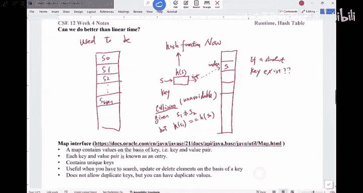

Implementation of this idea。 One is called a map。 The other is called a set。

So we'll just use this map interface as an example。

 you can go find this Java doc about the description of the map。So， map is the interface。

It basically contains values on the basis of key。 In other words， you hash the key。 And by that key。

 you can find the corresponding value。So each key and value pair is known as an entry。

 It contains unique keys。 In essence， what map does。

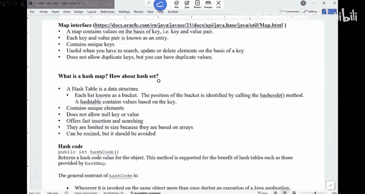

Try to draw it in here。You have a key value pair。 Like， for example。

 students P I D map with their student records。Normally， the value is very big。

 The value is very big。 The keys is not like， for example， for for people from the US。

 each person has a social Security number。 That number can be the key。

And then all your credit history， everything about。Your financial situation is the value。 Normally。

 the value is much bigger。 Okay， so you have， you， you。

 you have this key value pair and you want to store them in a， in a map。

 The way it works is you're gonna first pass through this。Hsh function。 and you hash the key。

 You don't hash the whole thing。 You only hash the key。And once you have this thing。

 you have this index。And this index。Would allow you to store this key in there。Okay。

 so you're gonna store this key in the table。 and the value is just。Like you， you can say。

 I have a reference that links to a value object。So when you have a map。

 you are never gonna hash the value and never gonna hash the value。Does this make sense。

All the keys in here in a hash map， it must be unique。Any questions about the idea of a map。Alright。

 so this is a map。For set， is very similar， except you don't have a value。

 You just have a bunch of data。So you just have a bunch of student names。 let me put them into a set。

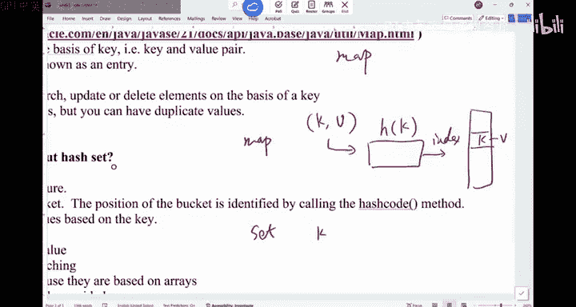

嗯。So what you do is it's very similar in the hash。 the key。 you only have key。Index。And then。

Whatever the indexes， you put it。Into the table。That's the difference between a hash map and hash set。

They basically implement the same idea of hashing。So hash table， it is a data structure。

 Hah map hash set is just kind of the realistic implementation。Of that table。Questions about this。

What's the difference between what。The what's the difference between a map and set is like。

 both of them just hash keys and put the keys into the table is except for map。

 you have this value associated with it。Okay。嗯。Maybe， maybe。

Let me see if I can do a quick demo in here。Do I have the code。This is Q。 And the what。

 let's do this。Really quick。So。For example， if you say， let me create a hash map。嗯。Where's my cursor。

I'm having some trouble。Finding my cursor， but。Public static void main。So if you say I have a map。

 I want to create a map。Normally you say hash。

Hash map。 And you have a key value pair。 For example， you may say my key is a string。

The value is a double。I said this is CC 12。You can create a hash map like this。

 You have to import it。Java do。Tility dot hashm。OkaySo by doing this。

 you can create a map that would map， for example， a student to their G。You can say CE 12 dot。嗯。

You can do。Like for example Paul。E close to。3 dot o。Let see， how do I insert it。Dot。Insert。

Where is my insert method。On the top of my head， I can't remember it there is empty。嗯，put。Put， yeah。

 there we go。Paul。And then three do。YeahI was using the C plus class format。

 But what this one really does is you're gonna put in this C SC 12 as the key value pair is gonna hash the pa and then give you the value in here。

 And if later on， you're gonna look for Paul， Whats Paul's G。

 That's when you're gonna be able to see is3 dot。 That's a hash map。For hash set is different。

As she said， you can only have， for example， a string。And in here。I think this one has a insert。

Still， not have insert。At。So， for example， you can add a string to this hash set that would allow you to say。

 I just have a bunch of data。 a bunch of keys in there。 It doesn't have the value associated with it。

Does that make it make sense now。So the benefit of having a map is you have this luxury of having a value。

 And normally， this value will be some sort of big data is， is not gonna be just a simple double。

It's not going be your double。Are there any questions。都是。有。Right。

 the hash function would convert a key into end， basically this paw is converted into。

You to search for？Yeah， it will be constant time checking in general。

 if you don't consider collision。Yeah。啊。き有。Right， so the key must be unique。 For example。

 if I say pause G is now 3 do 0。 But if you say I put in migrate grid after the midter just got better。

Pa and now I have a4 do GP。Then it's gonna to replace that three do。In there。

 So if the keys must be unique。 It's gonna just update the value。 if that key already exists。

Any questions for this。And all almost every data structure like has every language has the map and set data structure in there。

For hasht， you have to import the hashet。嗯。No。If you know the difference between a map and the set。

 basically， both of them rely on this idea of converting a data into an int into an int right as an index。

 So in Java， there's this function called hash code。

 This hash code is a function that would allow you to convert an object into an int into an in。

In other words， every Java object can be converted into an int。And this returns the hash code。

 which is like from the hashing， the hash code value for the object。

 And this method is supported to benefit hash tables。O。

And here are some requirements of this hash code。 I don't think before today we have asked folks to implement the hash code。

 but in the future， whenever you implement a class， in general。

 it's better that you provide equals method。 you provide two string method。

 you also provide hash code method。 Those are the three things in general。

 they all work hand by hand。So here are the， the description of the hash code function。

 It's pretty long。 It's pretty long， but it's worth reading it at least once。Okay，The first part。

 whenever it is re invoked on the same object more than once during the execution。

 this one must be consistently returned the same integer。In other words。

This function is a is like not random。 The first requirement is， it' not random。

If you run the code now， it's gonna return in teacher。 And during the execution。

 no matter how many times you caught hash code on an object， is supposed to give you the same。

Hh radio supposed to give you the same hash radio okay。That's the first thing。Second thing。

 if two objects are equal， according to the equals method， That's why hash code works with equals。

 So if two things are equal， then their hash code must be equal。Right， this means if。

Object 1 is the same as object 2。If。Object  one dot equals。I can't era erase this thing。

I don't know why。Ecos。Object 2。跟。Guarantee。0， one dot hash code。Is the same as O2 dot has code。

In other words， two same objects， they must give you the exact same hash value。Which makes sense。

 right， So same object。Same hash code。The last part is。也。欧 one。Dot equals O to n。 In other words。

 if that are different。If two objects are different。We don't guarantee。0，1 dot hash code。

Doesn't equal to O2 dot has code。So。If two objects are different。

 we can't guarantee their hash codes also are different。And this basically is to imply collision。

 This is to imply that we allow collision。Those are the three requirements， not random。Number  two。

 same object。Same hash code。 Number 3 is a allow collision。Other questions for hash code。

Hsh code is like， like， like what we just discussed。 It comes from the object class。 In other words。

 everything has hash code。 For example， if you have a string。Right in here。So， for example。

 if you say up a string。C， S C string S TR。Equals to C C 12。

And you can basically find this hash code。Ssem dot out dot print line， S TR dot hash code。

So it's gonna to be an integer。 You're gonna be able to convert this string into an integer。

So everything can be converted into integer。 if you overrite the。

A hash code method for any of the class that you write。 you can also convert into integer。

But a lot of times， like， for example， if Im a student。

 how do I convert that student into an integer。What's the strategy for me to do it。

The easiest way is。For example， if I say I have this demo class。Whatever it is， I have。

Like of integer， A of a string name。And I don't I have an array。

And there are a lot of things I need to do。 Allright， So I'm doing this class。 And now I said。

 convert this。Demo into a integer， a demo object into integer。 How do I do it。

 The easiest way is you're gonna do this thing， so。

It's not too hard for us to override the two string method。Right。

 so you just convert everything into a string。Here， I'll just return。 I don't know。

 return now for now。 Okay， so you should this， this part is not too bad， right。

 You just concate all the data into a string。 That's about it。

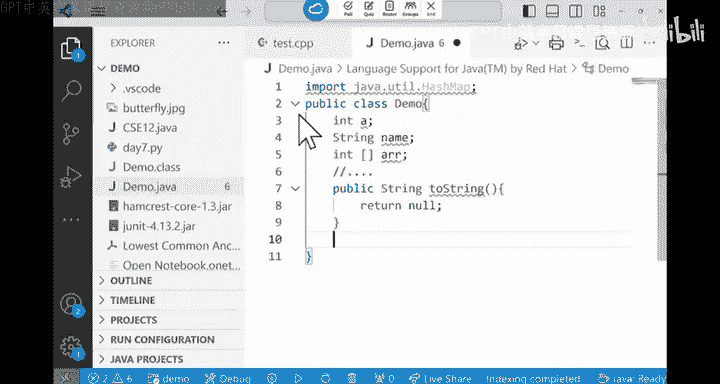

嗯。Your。Hsh code。Function。What this hash code function should do。

Is you can just return this do two string。Dot hash code。

 you can just use the hash code function from the string class。To do it。

That's the easiest way for you to convert any object because it， it's pretty intuitive for us to。

 to have the two string method implemented。 Once I have the two string。

 just use the hash code function from two string。Any questions。

We'll talk about how to convert a string into a int。Inter。Are we good。Alright， so that's the。

 the idea of hashing， okay。Now， based on our understanding of。Hushing。We have the hash code function。

 We have the hash code function。And then this one would return integer。Now。

 what's the difference between the value that hash code would return。

Comparare with the index location where this item would end up in the hash table。

 What's the difference between those two。Let me have a quick vote for this。Okay，F is AC。

Prequancies they。Which one is the right choice。Alright， out of the 77 votes I've seen。

Two choices tie。Between， mostly between。BN的地。Can you have a discussion with your neighbor， please。

 What did you vote for。Have a chat。 Have a chat。Alright， so let's look at a， right。

 Some of us did vote A。 The values are exactly gonna be the same， and a is wrong。Okay。

 you should not directly use a hash code value as index into a table。

 because this hash code value can be any integer。Meaning it can be up to a billion，2 billions。

 And that's gonna potentially go out of bounds。So you should always do a mod M。

Where M is the size of the table。Okay， this is very， very。

 very important because I remember in one years in CS S C 12，1 student didn't do this。

My student didn't do this。generate the hash code and then use it directly as the index。

And for some reason， this didn't even even look at the gray scope feedback either because his code was having runtime errors all the time。

And that was due to this problem。Is indexes are always auto bound。So make sure you mo on the size。

 okay。嗯。The next thing is B。 The return value， return by has might be larger。 I would say B looks。

Correct， it might be， maybe be small， maybe bigger。Okay。C。

 the hash code function would return different values。 If two objects are different。 We hope。

 but there is no guarantee。 There is no guarantee。And this must is wrong。Number 4。

 the hash code function might return different values for two objects that are considered equal。

 That is wrong。 right， So only thing that is correct is B。Hash code must return the same value。

On two objects， that are considered to be equal。Any questions。Already。So this is kind of the。

 the part about the idea of hing。 One important thing we have to consider is。

 what if there is collision。In other words， two different things got hash into the same spot。

What should we do There are many strategies you can adopt in C SE 12。

 We only talk about two of them in C S E 100。 You're gonna talk about 5 or 6 more strategies to handle collision。

 Okay， but these are foundational and they are useful， too。 Okay， and in the next P A。

 This is what we're gonna do。 This is what were gonna do。

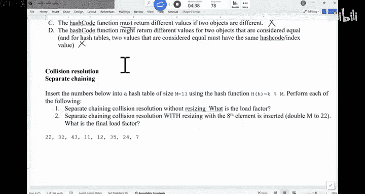

So for。For this one， for this one， what we're gonna look at is the first strategy is called separate chaining。

Separate training。 In other words， if you see a collision。

 what's gonna happen is you're gonna try to link all those things that are got hash into the same spot into a link list。

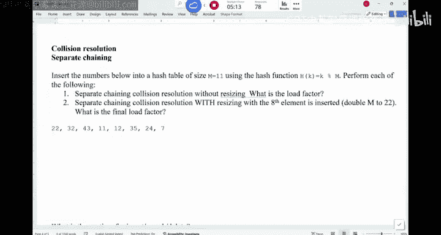

So the idea would， would go like this。 So， for example， if you have 11 things。

 I have a table of size 11。It goes from。0 to 10。And then you start to hash these data into the table。

 And the strategy is， if there is a collision， you're gonna just create a link list。

So everything in this table is basically the head of a link list。 In Otherwise words。

 a link list reference。Okay， so let's try it。 If you look at 22。

 the idea we're gonna use is just mod M。 So we're gonna say K mod M。 given the K， I just find out。

The mod result 22 mod 11。Equals 0。 So 22 is put in here。That's what it does。

 And then 32 mod 11 is 10，32 is here。43 mod 11 is also 10。 You can see there is a collision， right。

 So 32 and 43， they are both hashed into this spot。 You're gonna insert it。So the question I have is。

Should I insert it in here， or should I insert 43 over there in the beginning of the link list or in the very end of the link list。

What would you say is a better approach。Can， can we have a vote， Should I。

Insert in the beginning of the list or at the end of the list。你佢冇添。Only see two votes in。

 for some reason。I don't think I can， I can see any more votes in here。

Those are the only two votes that come in and both them all for a。Do we all think it。

 is's going to be this。Iner， what's the benefit to inserting in the beginning of the list。

What's the benefit。Yeah。It's faster， right， You never travel down the whole list。

Can't I do the same thing Like if this is a double link list I just append to the tail。

That may also work。 Then is it the same， Like， it doesn't really matter。Should I have option C。

 It doesn't matter。What's the benefit of。Like， I can tell you。

 we would prefer to insert at the very end of the list while traversing through the holders。

That's what we would prefer to do， why？What's the benefit of that。other other words， we。

 we would like， even if we have a double link list， this is what I want to do。What's the benefit。有。

Right linkedless， you don't have to shift anyways， even if insert in the beginning for readers you have to。

What's the benefit of inserting and going through this whole thing。

 Because even if you are insert at end， Doub link this you can insert at the very end。 In fact。

 yesterday， as we try to grade the insert method。From no。

 as we try to do the get method of link list。 I I indeed see a student who did very about depending on where you want to get to。

 the student was trying to go from the head or go from the tail， whichever is closer。

 That's very nice。 right during the exam。 But in here， even if I have a double link list。

 I can insert at the very tail。Cause， B1。 Why don't I do this。If that's what we do。

 like I always insert at the very end。If I insert through 43 again， I insert 43。

 there is a duplicate data in there， what's gonna happen。Always insert at the very end。

You're going to insert another 43。Because in general， hash tables don't allow duplicates。

 So it's important that you go through this whole list in here。

 try to look for the thing that may already being inserted before。Okay。

 so that's why we insert at the end of the list in here to avoid duplicates。Does this make sense？

So we insert 43 here。 and then 11。

And then，12。And then，35。24 and 7。That's what we have。So there are a few collisions in here。Now。

 this is insert。How do we find。Something。How do we delete。Something。Can you talk to your neighbor。

 How do you delete something， How do you find something if it's a。Find。22 in this。H shape。

 What would do you do。Or delete 22。Over the do。Can you have a quick discussion And also think about the runtime。

 What's the runtime of those operations。In the worst case。Alright， so， if you think about it。

 you have this table。 I say， let me insert something。 You hash， right， This hash of the。

 the data takes。Is it related to N like if I say hash this value。

 Does it relate to how many things are already in the table。No。

 it just relates to this data I'm hashing， right， So you can consider to be big or one。

So with respect to N， right， So the hash of the part takes big1。 and you find the location。

 you start to insert it。 go through this whole list and insert it。 That's what you do on insert。

 How about fine。If I try to find something。What's going to happen？As a find 17。In this table。

How do you find it， What's the first thing you do。一个呢。Hash 17， hash 17， you get。17 miles gotta 6。

And then you look for this list。In there， if 17 is there， you find 17， If 17 is not there。

 it doesn't exist。That's what find does。 Delete is similar。 You hash the value you want to delete。

You go to that location， try to find that value and remove it from the list。That's what it does。

Does that make sense？So now， what's the run time。 So let's think about this。 How about the。Insert。

Search。Delete。How about the worst case。What's the worst case to？

assumingming there are n data in there， the table of size M。Big O of N， why。Alright。

 so if everything is hash into the same slot。 I say， how can that be possible， Just imagine this。

 I say this is my hash function。 and I give you 22，33，44，55，66，77，88。

 And everything is hash into the  zero spot。 I just this data is weird。

 And that's what the end of it。 And now it's a insert 1 10。 I gonna hash into the same spot。

 So it's big O N。That's the worst case。 right， Would they， should they happen rarely， But in theory。

 that's what we go on runtime search。Look for something。Was a runtime。Is it better than be going。No。

 it's the same， right， just as bad。The you lead。Is the same thing。 believe it probably is even worse。

 You have to find a spot and cut out things。 So nonetheless， the worst case is， is linear。

 The worst case is linear， which is just as bad as really synlinist。Right。

 this is the super bad worst case。But in theory， so long as you don't have this very bad has function is almost guaranteed worst case would never happen。

 The chance for worst case would happen is less than in general，1%。So。

But what we in general try to care about is the average case， like on average。

 what is the runtime of hashing。As you can see if we use this separate training。

 if you use the separate training idea。第一。The worst case happen when you have like。

 when you try to insert into a spot where all the data in there。 The average case is。

 what's the average length of this list。What's the average length of this list？ That is the cost。

That is the cost。 What's the average land for the list。有。ND of M， right。

 if you have n things in this table with M cells， if you assume those n things are distributed kind evenly across all those M cells。

The case is N D by M。 And we call this thing low the factor。 We call this alpha。

 so this is basically how full the table is。That's roughly speaking。Okay， in general。

 you do not want your table to be too full。In theory， this alpha can be bigger than one， right。

 because this link list can be as as big as you want to。

 You do not want the link list to be too long because it's gonna directly affect the runtime。

 So the average case in here is Al。 right， This is the cause of this list。

 I have to go through this list。Plus， the cost of hashing。 this plus one。

 This one is the hash function。So's one plus alpha。 That's the average case， similarly for search。

 similarly for delete。

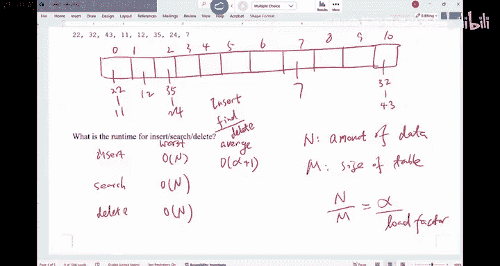

In general， alpha is less than one。 In general， we want to keep alpha not only less than  one is less than 0 do 7。

 In general， the table should not be2 full。 If that's the case， this thing is like constant time。

 near constant time。 right， so this is constant time operation。Which is perfect。 which is perfect。

Right， so hashing would give you constant time dictionary operations on average。

Are there any questions。We here， yeah。Sa again。It depends on the amount of data N is。 And also。

 you can adjust M right。 You cannot control N， right， how much data you are given。

 You cannot control N。 You can always control M。Right， so in general， you want am to be very big。

So this is the benefit of using space to sacrifice for time。

 You're gonna have a lot of empty spots in there， and that would speed up。R他。So that's a good point。

 right， So M， you can control。 We can control。This N is， we can't control。So for example。

 I'm expecting about。A meaning things。 Then you can make your M at least 10，10 million。

That would accommodate those meaning things。嗯。You you are basically gonna intention to make alpha small。

Good point。Any other questions？So this is the first strategy is called separate training。

 separate training。

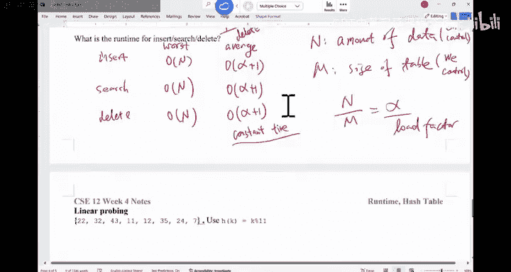

The second strategy is called linear probing。Lar probing is not too bad。

 It's very similar like before。 And what we have is you have the table。

And what we have is we're gonna try to insert this data into the table。 If there's a collision。

 you just walk down on the array and store the data in there。That's called the linear probing， okay。

 so。Just another Saturday， for example，22 will be hashed in here。

So the table is no longer a linkless。 The table is just a integer array。

 so we have 22 in here and then 32， you insert 32 in here。And then 43，43 is also hash to be 10。

 In other words， iss there。 So I need to look for the next empty cell。 There's nothing behind me。

 You wrap around。Then're going to insert 43 in here。That's what you do。

 So you just walk down in the array to look for。The next available cell，11 is supposed to be here。

 Now you walk down。 That's 11。Then 12 is here。 12 is supposed to be here。 It is inserted though here。

35，35 is supposed to be at 2。We do see a lot of collisions。24 is 2。7 is here。That's what the。

Table would look like if we use linear probebing。看。As you can see， this approach is annoying， right。

 you have to walk down the cell， But believe it or not。

 this linear probing idea would win against many fancy collision resolution strategies。

 And the reason is very simple because you're gonna walk down in the array to look for the next empty cell and array arrays。

 we know they are all cons in memory。 So when the CPU try to grab data from。

The memory in general just doesn't grab 1 bite。 It grabs a lot of bites together， put。

 put them into the hash into the cache line， and that would speed up the runtime quite a bit。

 So a simple idea in here， but it will work okay。Any questions about the idea of linear probing just。

Go through the array。 look for the next empty spot。So， that's insert。How about find。

How do I find something。I want to find。For example， find， I don't know，14。How do I find 14。A hash 14。

 which is 3。 This thing is now 14。 Am I done。我是戴队。I should keep walking down untilward。

Until you see a empty spot， until you see an empty spot。That's when you say 14 doesn't exist。Right。

Questions。Because 14 may have been pushed down。 How about delete， Dete is a little bit tricky。

 What should I delete， For example， say delete。32。A hash 32 is this spot。 Oh，32 is there。

 Can I just say delete it， I'm done。Anyone can say any issue。What if later on， I do find 43。

 what's gonna happen。It's a hash 43。 Oh， it's an empty cell，43。 Tanne is now there。43 is there。

 What's the problem。Because 43 got pushed down by 32。And you just deleted 32。 Now。

 you are assuming nothing is pushing down 43。As it was。 So when you try to delete 32。

 you are not gonna say， oh just mark this cell is empty。 You're gonna put the marker in there。

 Sometimestime people call this the tombstone， whatever。 So someone used to be there。

 So you kind of put a marker in there to say this cell is not empty。 This cell just got deleted。

So each cell has three states。 either is empty or has something in there， or it has a marker。

Are we good。This marker。Is used to avoid。Con future search issues。Can I just overriteide this marker。

 Like if I now， once I do delete 32， I say insert。I don't know，65。Can I just put 65 in here。

Would that create any problem。Can I just。Create like just obviously， you have to。

 when you say insert 65， you got to try to find 65。 You can't find it。

And then you're gonna insert 65 in there。 Can I just insert it over there， Would that be any issue。

There shouldn't be any easier。 You can just delete this marker， and put。This new thing in there。

Without any issue。有。Take the mark。So should I use， should I consider the marker in the load factor in general。

 No， because it's not a legitimate data。 And this data cell can be used。Right。

 so if want't to insert something in there， I can just delete directly insert in there。

And these markers will be removed。 like that marker。 if no one was inserting in there。

 when you rehash the table， sometimes the table is getting too full。

 you're gonna double the size of the table and then rehash everything in there。

 That's when you get rid of all those markers。

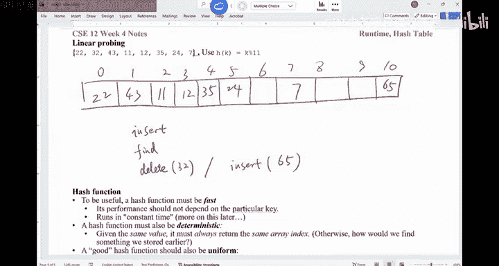

All right。

Looks like we don't have time to。Talk about this hash function in here。嗯。We don't have two minutes。

 let me push it a little bit。 Okay， before we finish here today， you may need it for this coming P A。

 Hah function is a function that would be able to convert any data into an int。 And in this example。

 we can look at how were gonna convert a string into an int。

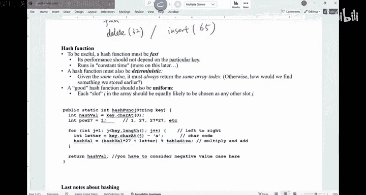

You're gonna view the。A string like this。 For example， you say Paul。Space， Chao， if this is a。

A string。 You're gonna view these strings as if they are number digits。

You're gonna give each of the positions some sort of weight in here。 this is 27 to the part of 0。

27 to the part of 1，27 to the part of 2。27 about 3，27 to about 4。five。6 and 7。

You're gonna multiply the askI value of these symbols with their weight。

 And that's how you generate a big number。 That's how you generate the big number。

 And that is the hash value。And this approach basically allows you to avoid。

Calculating those powers and then multiply。 So it， it's kind of a small， recursive approach。

 I want you to look at this one。 It's not too bad for you to look at it。

 But that's the idea of how to convert a string into integer。On Monday。

 we'll talk a little bit more about this than we should be。We to go for all the has related。Ps okay。

So we are done today。 We are done today。こ。

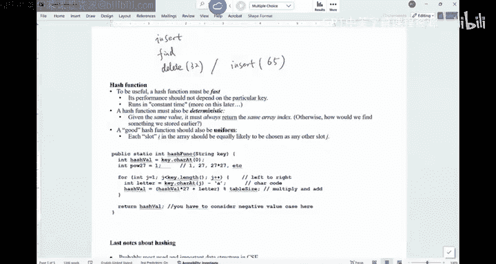