# UCSD《基础数据结构和面向对象设计（Java）｜CSE 12 - Basic Data Struct & OO Design Fall 2024》中英 - P16：CSE 12 - Basic Data Struct & OO Design - LE -A00- - Lecture 17.zh_en - GPT中英字幕课程资源 - BV1zJQHYcE8g

All right， I think we should start now。 Good morning， El， Good morning。嗯。Of of a sudden， it' week 6。

 week 6。So our has shabo PA， I hope folks。It's a new P A。

 So the auto grader was kind of a little bit slow to come up。

 But I think most of the issues should have been resolved。

 Are there any general issues Fo want to report about the high sha P。Ash mapap hash set。Concerns。

All right。No， for。For this week， we're gonna look at stack and queuees， stack and queuees。

 So to give you some sort of。Review， right， So we started with generics。

And now we talk about raius link list。 Those are linear structures。

 And then we talk about this crazy idea of hash table。 right。

 It's so simple yet it give you this big one runtime。So it's， it's， it's a great tool。 Now。

 we are looking at other different kinds of structures。 We'll look at stack and Q this week。

Probably also next week。 I just realized this morning， next week on Monday。

 there is no class because of。Verans Day。If I remember it correctly so。We miss a lecture。

 but I I hope by， by this week， we'll finish second Q。 and then next week well we'll finish up heaps。

And then the last data structure we have for this class is simply。Bary trees。So that's it。 That's it。

 So there aren't too many things left， but。That are all very useful。 They are all very useful， okay。

嗯。

And another thing I do want to share with folks in here is like over the weekend。

 I have several of my students。 they came back。 Two of them are working at Apple， one work Intuit。

 one work LinkedIn， and then two of them are working at startup。 I I was just asking them tell me。

 do you need to use AI in your job， right because I need to tell my students。Should they be prepared。

 And the answer they told me is， yes。They are all using AI。 In effect， the two person。

 the two people from intuitivetuit， They are saying it's part of their evaluation process。

 In Otherwise words， how integrated are you with the tools that we provide。

 That's one of the things that are being evaluated。So definitely。

 AI is something that you all should be prepared to use。 But I was also asking them。

 should I allow students from 12 to use AI， They say， definitely no， definitely no。

 give me a reason why our C S 12 student shouldt be using AI at this moment， They say how。

 how would you even know if the AI tools are giving you the right answer or not。

They were they were doing it。 and then they don't even know what is right， What is wrong in there。

 So you must have the basic skill to use those tools。 Okay， so I do want to stress。

 I want to share this in this experiences number one。

 you should definitely learn to use GB right or try to use copit。

 you should know what kind of question you should ask。 but at the same time。

 you shouldn't skip the foundations that you are learning from all the classes we are doing。

 so that's very important。 you got to strike a balance。 Okay， in C 12。

 please do not use GB or Copi to generate the code is gonna hurt you in the long run。

 Okay so that's the feedback from past students right， our a。

 So I figure I want to share this with folks in here。Now， for stack and queuees in general。

 our students don't have trouble。 I rarely see students， I say， I don't understand stack。

 I don't understand Q。 People always understand them。 The tricky part about these data structures。

 numberumb one， they are pretty strange。Theyre pretty strange。 Number two is。

 how can they even be useful in practice。So the application part of second Q can be very confusing。

But the idea of second Q is very easy。 Okay， so what we'll try to do today is we'll try to introduce the idea of second Q。

 and then we'll look at some of the applications。Hopefully。

 that would make people understand stacking Q a little bit deeper。 So what is stack and Q。

 They are very similar。 That's why I got discussed together。

 The next P will be a P where you implement your own stack。 You implement your own Q。

 But you are gonna first create this very powerful structure called double ended Q。

 And then you retrofit this double ended Q to be a stack。 You retrofit this double ended Q to be a Q。

 That's what we're gonna do。 Okay， so that's the next P。So second cubes。

 they are both linear structures， but they are different from each other。 So number one。

They can only be。 The data in them can only be accessed on the borders。That's what it is。

 So if look at， if you think about a stack， a stack。

 you can think about this as a like a stack of plates。Right。

 if you go to buffet before the pandemic buffet was pretty popular after the pandemic。

 not that much anymore。 For some reason， I don't know。

 But the idea is when you try to grab a plate to grab food。

 you probably want to grab the one from the top。Right， that's how it goes。

 So if you look at the stack， it can only be accessed from the top。 In other words。

 things that got buried they are there， but you do not have direct access to them。

That's the meaning of home access on the top。 So you can push stuff。 You can put more data in there。

 You can also pop from the top。The push is to insert P is to remove P is just to look at what's on the very top without doing anything。

 It's like， get the data from the top。 You can also check if this thing is empty。

 That's kind of what you have。 You can also know the size。 How many things are in the stack。

 That's also fine。

That's the idea of stack。嗯。Any questions。One thing you can think about stack is stack is first seen La out。

 This data is the first that get into the stack。 It will be the last one that actually go out。O。

Any questions。嗯。

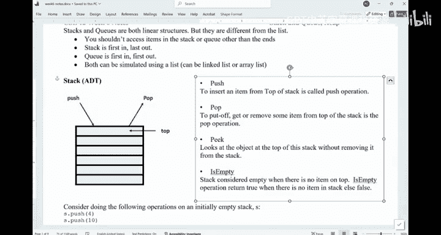

Let's look at this one。 Okay， So if you have a stack S， Okay， it in initially is empty。

 And that did some of these operations。 What are the data in the stack now。

 from the top to the bottom， You can assume this is something on the top。 This is on the bottom。

 Which one is the correct answer。 Can we have a vote。

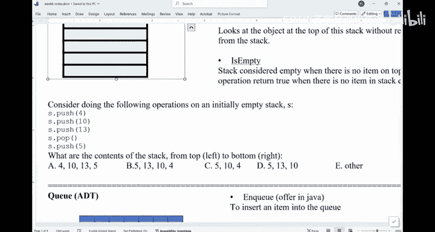

Let see if I turn it on。

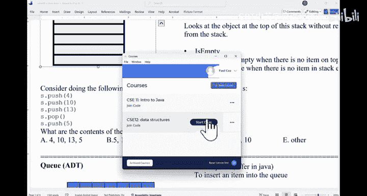

Alright， should be on。And also， yesterday， when we were meeting， they really told me， remote work is。

Not coming back。 so be prepared to move if you'll find a job。That's what today told me。

So what will be the。The data in the。In the stack。Alright。

 I think we have a very strong consensus in here。 C， C is the。The the answering here。 So let's。

 let's try it。Ding here。We have a four， we have a 10， we have a 13， when you pop， 13 is out。

 then you're pushing in the five， so it's  five， 10 and  four。Make sense。

 so you see it's not bad right， So first in loss out。 That's a stack。 Now。

 a queue is a structure like this。

Where you， again， you can only access the data from the ends。

 but now you can access data from two ends。This is called the front。 This is called the rear。

 The data is inserted in the back and removed from the front。 It's like a queue。 right。

 If you go to Starbucks you' are waiting in line， The first person in the front gets served。

 They got removed from the queue and people who come in later would get in line。

 That' that's kind of what it looks like。Right， so the remove part is called DQ。

 The insert part is called NQ。Just different names。O。So when you think about a queue in general。

 Q is first in， first out。 The first data that get in will be the first data that get out。

 You can do N queue insert。 You can do D Q。 You can also do peak。 You can know if the queue is empty。

 You can know the size of the queue。 But that's about it。

 So both of them allow you to access the data。Either from only one side or from both sides。

 That's it。Questions about what a queue is。So stack is ADT Q is ADT that descriptive ideas。 Okay。

 as how you can implement them。 You can use a array。 You can use a link list any you want to。There's。

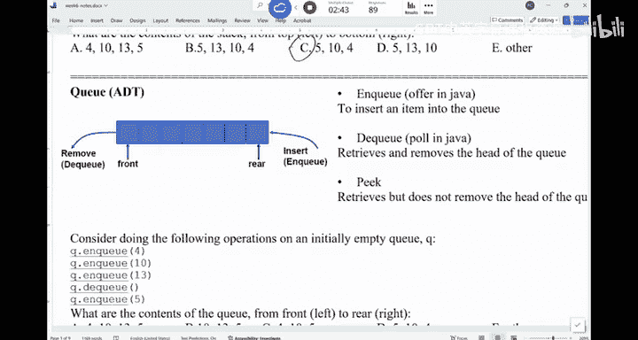

There are many ways to implement a sta who or cure。How about this thing。

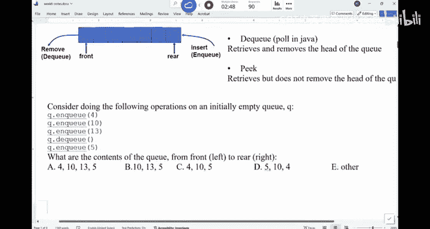

I will initially about you。And then I have these operations， An Q， N Q， N Q， D Q， An Q。

 What will be the answer in here。Left is the front。 right is the rear。Alright， strong consensus on B。

Let's check。 So N Q 4，1013， when D Q， you are removing the first thing and NQ again 5。

 So it should be 10，13 and 5。Right， so I don't see people making mistakes on this one。 right。

 You got the idea。 The question is， why， Why do we even need something like this， right， Why。

 Why do you just allow me to push in and then pop from。The beginning， why。

 why don't you allow me to access individual things in there。

 Isn't that great that I can access these individual elements inside the queue of stack。Right。

 that's a question you may want to ask， so。The， the idea of second Q， in general。

 my understanding and different people have different understanding of how these data structures work。

 My understanding is they are used to save data for you。 So in other words， you say。

 I have some data I need to save them for future use。That's what you do。

 And the difference between second Q is what saved data are you gonna to use first。

I have a bunch of data。 I'm gonna to just save them。 And now I need， I need to use some of them。

 The way you're gonna use it if I need to use the， the data that I just saved first。

That is gonna be a stack。You say， okay， I just save this thing。 And now I need to use the data。

 You just grab the most recent data you saved。 That's the idea of the stack。

 If you say I've saved a bunch of data， I'm going use the all these data first。

That is gonna be a queue。That's how you can kind of differentiate them。

 Both of them would allow you to save the data， but it depends on what kind of data you're gonna use first。

 If you decide to utilize those saved data。O， it's like you are backing up something。And then。

 all of a sudden， need to use them。And you rarely need to access these things。 If you say， I indeed。

 I need to use this thing in the middle of the third element in the data structure。

 If that's the case， you don't need a stack。 You don't need a queue。 You need an array。Okay。

 so that's kind of the， the idea。 Sta and queuees， they are used to solve pretty specific problems。

Not general problems。 They are not as commonly used as a race， for example。

 but the problems they solve are， in fact， are very nice， so。

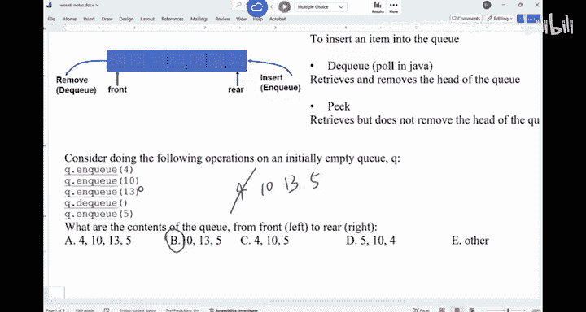

Let let me give you some examples of how to use them in Java。 Okay。

 so in Java and different languages have different。

Implementation of stack and Q and every language like Python。

 C plus plus Java would give you these classes。 Okay， so first thing is， if you look at it。

 I can create a queue。And if you look at this one， I say Q string names equals to new link list。

 this thing。What does it look like？It looks pretty strange， isn't it。This in Java。

 there is no Q class。 There is no class called Q。You just use a link list to mimic the behavior of a queue。

 That's normally what you do。Okay。What does this imply？

What can you say about linkless in Java camera with the queue。嗯。Nnkless must have implemented Q。

Q is the interface。Okay， so link list must have implemented Q。 That's why you can do it。

 When you do offer image the insert， I can never remember these function names。Looks pretty strange。

 and different languages call them differently。 So offer means insert。

 So you're gonna unki these things。And then。We gonna say。Print out peak。

 This peak means what's on the very top what's on the very front of the queue。

 And then pole means D Q。Okay， that's what it does。 So C I C 12 solids 107。 If you think about it。

 If you do peak， you're gonna print out C IC。 If you do poll， it's gonna remove C， IC。

 if you pole again， it's gonna give you 12。That's what it does。O。Any questions？So that's a。

If you want to create a stack， you， you can create the integer stack。 You pushing in these things。

 You do pick peak means you look at the top。 I think the top is 11， and then you pop， remove 11。

If we print out the pop， I're gonna see 12。 sorry，22 in here。系。That's what it does。

 So just remember this part。呃。Java doesn't have a Q class。 You a linked list。ok。In other words。

 anything a queue needs to do a link list can do it。

 which means link list is much more powerful data structure than a queue。Any questions。

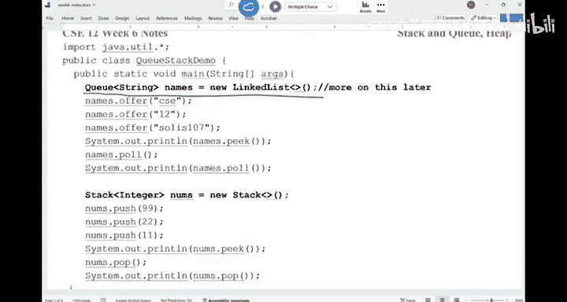

All right。So let's look at some of the applications， right， like I said。

I don't think people would have。hard time understanding the concepts。

 Sometimestime you make silly mistakes。 you miss。You you treat the Q as a stack。 But in general。

 people don't have trouble with the concept。 When it comes to the application。

 it becomes a little bit trickier。 Okay， so we have a few applications。 The first thing is。

 given the list of parentheesis。Like you， you， you're given a string。

 only made the print of this square brackets or curly bracket， whatever it is。嗯。

We want to determine if they are matched。 Like， if you look at something like this。

 it's matched perfectly。If you look at something like this。

 it's not matched because this region is messed up。That's what we want to do。

 That's what we want to do。 given this string。And we'll try to solve this one。 So given the string F。

 you want to return a boing。The question is， how do you do it， How do you do it。

 This used to be a combined coding problem from ICPC。 I think it was way back in 2019。

The fastest team to solve this problem takes about two minutes。at the problem。

 And then this submit me the right away。 So this is a classical application of。Stack and queues。

 Can you either talk to your neighbor or think by yourself， How do you want to solve it， right。

 Should I use， you gonna use either stack or queue， Which one would you use。

 Which one would you use and why。Right。That hopefully would make you understand second you little bit better。

 Have a discussion。 maybe having a discussion is better。 How would you do with this。

You in the string。How do you verify if all the parentfacees they match。

You've got to think about what is match。 How do you define match。Think about it， right。

Youre trying to process a string。Character or bad character。

And how do you define if this thing is matching or not。Any ideas？Any ideas。How would you want to。

Sove this one。Let me ask you， what character would be more important to determine if this。

String of parentfacees are matching or not。 Is it opening parentfacees or closing parentfacee。

That was say， oh， that that's， that's something I really have to pay attention。

I the opening premise or closing。Okay， so I， I need to keep track of the opens。Okay。

 I need to store it opens。 I see a bunch of opening parentes。

 either square bracket or just regular parent。 And all of us， I see a closing。

You definitely wonder if I see a clothing square bracket。

The one that would match it has to be a square bracket。It can't be a prentice。Right。

Does that make sense。 So， if you think about it。You are saving a bunch of things。

 saving the square bracket， parentes， whatever。嗯。And then all of a sudden， you see this thing。

You see this big closing。Brackkecade or parentes。 You see this。 Oh。

 this is the thing that I need to determine。 I it matching or not。 E， if Ive， if。

 if the latest parentes I saved is this， I it matching。Definitely it's not。Right。

I really need to know this thing。I need to know， is it this thing。

That's the thing I'm really curious。Do I care too much about the things in front of this latest open bracket。

I don't care too much about them， right， They will be used to match things。Later on。

But at this moment， I care about this thing。So it's like you're saving a bunch of data。

 and what data are we trying to use first。Is it the latest data we serve or the earliest data we serve。

The latest， right， the latest preesis or bracket we just saved。 Then are we gonna use a stack or Q。

We're gonna use a stack， right， Sta is the latest thing you saved in the use stack first。

That's how okay， were probably gonna need to use a stack to solving this problem。 in other ways。

 we can think about， I'm just gonna keep saving these。

Opening parentheesis and bracket into the stack。Whenever I see a closing bracket ofend of this。

 I want to check。Wass on the top of the stack， if they match。I'm good。

 I remove this thing on the top of the stack and then keep going。 But if they don't match。

 I can just return false right away。Doesn't work。Makes sense。And that's it。

 That's how you can solve this problem。Can you code it up or give you some time。 Can you code it up？

 Now， you know， you' gonna need a stack。Up on the top， you， you have the code to say， how do I。嗯。

Create a stack。 How do I use it？Can you do it。Conquery the character of stack。

Cold it up yourself and see if you can do it yourself。嗯。So given the hint。

 we should be able to code it up。Alright， how about we， we do this together。

 So we created this stack。And then we're gonna start to push things into the。In the stack。

 So when do we push something into the stack。When we see a opening。Prendeesis or scrap bracket。

 When we see a closing。 we want to check on the top。 So I personally would like to use a wall loop。

Well， I is less than N。嗯。嗯。So。Or I lesson than and。We're gonna check。 So cha C equals to。

F dot try at。ie。We'll grab this character。If。This see is the same as。Opening parentesis。

Or sees the same as opening bracket。We are gonna do the push。 So I thought。Push， see。Right。

 so we're gonna push it in。嗯。Ese。Oh， this means it's not one of those two characters。

 It must be a closing thing。It must be a closing thing， okay。In here， you also have to be careful。

 What are the edge cases you may have to consider。I want to compare this C with the top of the stack。

对。If the stack is empty， right， if the stack is empty at this moment is guaranteed。

 then there's nothing。 I need to。 So if。嗯。As thought， he is empty。Then we're gonna return false。

We are done， right。Otherwise， we look at the peak if。S start。Let's just save it。Cha。

Previous equals to S dot peak。So I want to look at the very top of the stack， if。

C is the same as opening parentesis。And。Previous。Equals to the closing parent。Or。

C is the same as opening bracket。And。So our sea is closing bracket， my bath。I wrote it Wang Wei。

This is closing， previous。Is。Opening， if this is the case， if they match。Right。

 well just do S start pop。We are done。elsese。Will return false。And I。

 I do have to do I plus plus in here。So， way up。We just checking to see if things are working。

 In the end， there should be one last check。Was a last check。I'm done with the whole string。

You should also check if the stack is empty or not。Return。A thought is empty。If it's empty。

 I return true。 if it's not。False， because you may have some leftover characters in the stack。系。

But that's it。 The most important thing is you， you you。

 you realize I need to use a stack instead of a queue。Questions。有。Sa again。たげ。What if。P so sorry。

 I didn't get。嗯。Right， so if it's empty， we already checked。 If S is empty， we already return。経気で。

Right， then you're gonna see a run error。有。呃。Before I。Pop it， I written philosophy。Why do we need。

 because this peak would just look at what's on the top of the stack。And I'm checking is。I mean。

 I think in Java， P would also return the value。So just in C plus plus， you peak， and then you pop。

 So just a habit。 So in here， I think you can also do directly pop。 And if that's a case。

 you don't do anything。 So in here， I just look at the top， if they match， I'm good， I remove it。

 But if they don't match a return force。That's what it does。Any other questions。Alright。

 so that's the first application。 Remember， stacking queuees， they save stuff for you， okay。

And you just need to know。

What data are you gonna to use first。The second application of stack and Q is in the context of maize traveral。

 maize traveral， okay。So you are given this grid is's like a2 by two。 sorry。

 is it a 2 D grid of 4 by 4。And then you， you can be given these things like M， N and K。

 So there are N rows， M columns In this example， it you just have a4 by 4。 okay， and K is the。

And so what does case stand for。K rows of pairs。 In other words， we want to give you these things。

These are the blocks that you cannot travel on。 So we， there are four。Blocks in here。

 These are the four blocks。And then you are given the starting location。 You are given the。

Ending an location。 So this is， this might be the input。 So as four rows， four columns。

Number of columns。And this is the number of blocks。The number of blue blocks。That you cannot。Tvel on。

 It like these are the the， the trolls。 You are not supposed to step on them。

And then this is the starting point。 So you have the row and column number。

 So these four things will tell you the location of the blocks。The location of the。Blue blocks。

Roow number， column number。 And this part is the starting location。 This is the exit location。

So you can just read in a bunch of numbers， and they would help you to construct this meansze。Okay。

Any questions？Assuming the maze is not too big， iss less than 1000 by 1000。

 So you have at most meaning cells in here。The question is， how can I teach the machine to say。

 you go from here to there。If you say there is no way， you， you report impossible。

How would you traverse this mateze， okay。Questions。Of what are we supposed to do。

You want to go from the start to the end。

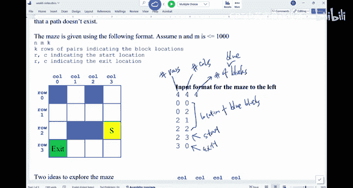

If it's impossible， you。It just report impossible。 Okay， there are two ideas。

 and I will explain the ideas， and I want you to think about which idea are gonna use a stack。

 Which idea are gonna use the Q and why。So the first idea is， I want to go from here to there。

 and I will use this right hand rule。 If you have been in a corn mate， I don't know。

People in California may not in a lot of corn mas， but in the Midwest。

 there are a lot of corn mazes in there。 there are miles of corns。 And then what。

 what you do is the the corn is very tall， taller than me。 So when once a kid get in。

 they have no idea where they're going。 And the way you should do it is you use a right hand to touch the wall all the time。

 You just keep walking。You're gonna it's guaranteed you're gonna to be able to come up。Okay。

 that's the idea。 So if you， if you look at the starting point， if you are a person like this。

And you can face any direction。 So this is your right hand。 You' gonna touch。The wall。

 and just keep walking。 So you're gonna walk all the way in here， circle around。

I'm just gonna draw the。 I'm gonna trace the， the right hand of the person。

So this is what it looks like。Right hand， touching the wall。And that's how you reach the exit。

If you face down， if you face down in here， your right hand is touching the left side。 and you。

 you're also gonna be able to get there。So this is the right hand rule。

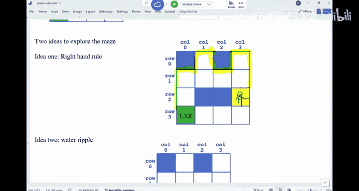

Just move across the mas。Another way is much harder to do as a human being。

But if you think about if you have this special capability to send out sound waves。

You're gonna basically do the following。 You're gonna basically send out water ripples。

 If you think about this is a pound of waters。 you throw a pebble into the starting point。

 and then you're gonna generate water ripples。And this ripple is gonna to go from the inner circle and expand。

 expand until one of them hits。The exit that's when you stop。 For example。

 the first ripple effect would be these three cells。They are one。Dcent away from the starting point。

And then， the next。Effect would be this one。 So two layers。And then， three layers。

And then the fourth layer， you are able to find the exit。It's like youre sending out sound waves。

And you're just counting how you gonna be able to reach there。

So those are the two ideas you can think about。

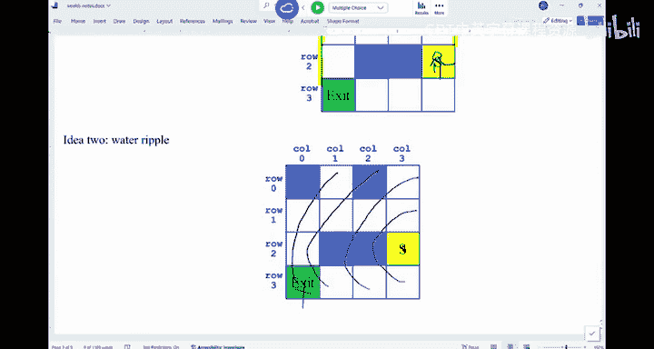

Now， can you have a discussion。In order for you to successfully implement the first approach。

 are you gonna use a stackg or queue。How about this part。

 Are you gonna to use a stack of you and why。You know。You know， the difference between them， right。

 They all save some data。 What are we saving。And one says I need to use something I've saved before。

 If you need to use the latest data， that's a stack。 If we have to use the earliest data。

 that's a queue。So think about this。 have a discussion。How do you want to implement these ideas。

Talk to each other。 let's figure this out。嗯。The coding part of stack and cues are now too bad。

Understanding of why we use them is tricky。 Okay， That's why we are doing these exercises。

You have to know what are we saving here， right， saving the data。

 What are we exactly saving as you try to implement these ideas。What are we trying to save？All right。

 How about the first one。The right hand rule of what， what are we trying to save about both of them。

 What are we trying to save。I'm going to save these things。

That's the data that will put into the stack or Q。 What are we trying to say。

We're trying to save the cell we have stepped on。That's what Im trying to save。

 You step on a on a cell， You save it， step on a cell， you save it。 So if you think about it。嗯。

The first cell I'm， I'm stepping on his disk。So it's this guy in here。And then。

Ill keep moving forward。Is this one。It's this one。And as you can see， I hit the dead end。Right。

 that's a dead end。 So I， I have to step back and then keep going in this way。 So this is 1，2，3。4，5。

6，7， and then 8。 That's how I will do it， right。No， do I need a stack or queue？

 How do I determine that， Let me find a good spot in here。Youre gonna say， okay。

 I'm going from one to 2。And this is the dead end。 This is the dead end。I'm gonna。

 if you think about their that is like you have reached you keep pushing keep keep saving things。

 And all of a sudden I have nothing to save now。Of nothing to say。I need to get rid of something。

 I need to use the data that have saved。 Now， if you think about I saved X 1 and then saved X 2。

 what do I get rid of now。Keep saving， saving， saving。 And then I'm nothing to save。 at that end。

 What do we get rid of。Do I get rid of xmal or do I get with x 2。Keep saving I。

 I'm gonna get rid of this X2， right， well， this thing is no longer useful。 I' get rid of it。

And then I would save this X 3， save x 4， save x 5， or x 5 is a dead end。I now get rid of x 5。

 I keep going。So what does that look like， did we get rid of the most recent data that we just saved or did we get rid of the earliest data that we just saved。

It's the most recent one。 Do you agree， So keep saving And then that end。

 get rid of the thing on the top。 And then， if possible， keep saving。That's how it goes。Right。

 so this one， if we， if we use the most recent data， is gonna be what。Stack， right。

 It's going to be a stack。So that's kind of why we need to use the stack。Right。

If you think about this water rippo idea。

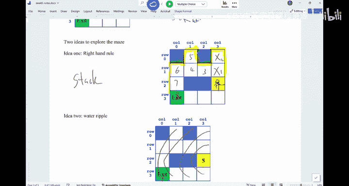

If I start from here。And the things that I would save， like， I。

 I obviously cannot hit this blue spot。 But what I would do is I would save。 This is my X 1。

 This is my X 2。 These are the two spots that I've been to。 I saved here。 I saved this one。😊。

And the next thing that I would try to say， okay， I'm nothing else to save now。

 I need to get rid of something， and then。Start a new batch。 So I will， I will start from here。

Which one do you think X 1， X2， Which one of them would link me to this spot。

Is it X 2 that would link me to this spot？ This the X 1 that would link me to this spot。Is the X 1。

 right， This spot is the one that actually we save X 1 X 2。 get now it's a dead end。

 get rid of the stuff and keep going。 The reason why I insert this X 3 is because it's a neighbor of X 1。

So I'm getting rid of x 1， and then I'm getting rid of x 2。 and that's why I get rid of x2。

 That's how I can pushing in x 4 and x 5， because they are the neighbors of x2。So in this example。

 were pushing X1 x2， and then we。Pop x 1 first。 And then by doing that， Im able to get into x 3。

 and then pop X 2。 I'm able to get to x  for and x 5。😊，So this one， Im because I saved the X1 first。

And then getting rid first。That means it's first in， first out。That means it's a queue。我。

So those are just two different ideas。 You have to understand what youre trying to save and which one are you gonna get rid of first。

 okay。Does this make sense， Any questions？

Okay， so both of the approaches are useful。What time is now。

 So we may not have all the time to go through this idea。 but this stack idea。

 we call this the depth。First。Search。It means you're gonna go as far as you can in one direction until you hit the dead end。

 That's when you backtrack and look。Look at the other options。 If you have no other options。

 you can keep backing up。Okay， until you give up， until you give up。But in here， if you look at it。

 we go north as far as we can。 We hit the dead end。 That's when we backtrack to here。From here。

 we first went north， but we also have the option to go west。

 So that's how we kind of solve this whole problem in this way。The second approach is called breath。

First。Search。This is like， I'm gonna visit south of the same distance to me。In each batch。Personally。

 D F S is much easier to write and。And widely used。 P F S is also widely used。

 but usually it serves as a subrout of other algorithms。 Okay， so we will wait a little bit。

 I think we'll wait until Wednesday to talk about the details of those algorithms。 Okay。

 I think we are done today。 We are done today yeah。

All right， so see you on Wednesday， see you on Wednesday。

Yeah。So this says like。Al like6。Somewhere else。6 sixいしょん。

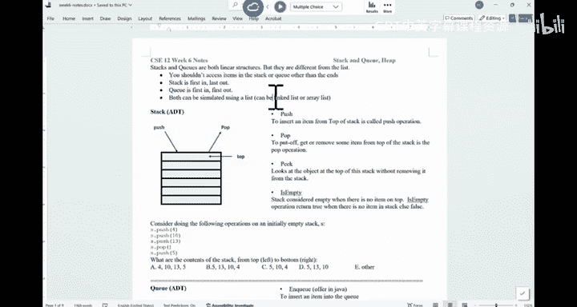

