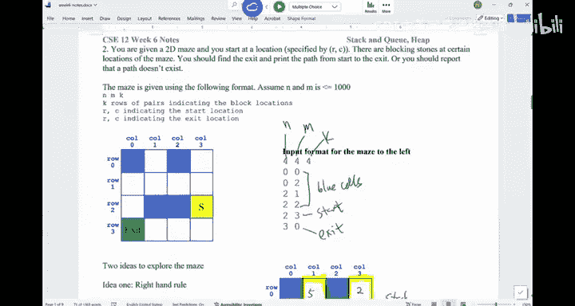

# UCSD《基础数据结构和面向对象设计（Java）｜CSE 12 - Basic Data Struct & OO Design Fall 2024》中英 - P17：CSE 12 - Basic Data Struct & OO Design - LE -A00- - Lecture 18.zh_en - GPT中英字幕课程资源 - BV1zJQHYcE8g

Let's get started， okay。Morning。So Wednesday， week six， Wednesday week6。There are a few things。

 I want to。Talk about。 So for this one， the hash table hash map P A， Okay， I think it's still soon。

 Make sure you complete it， okay。The next P A is about stack and Q。 And the plan is。

 we'll finish up stack and Q today and then move on to heaps。嗯。Are there any questions？All right。

So let， let's look at the idea of stack and Q。 Last time we said stack and Q。

 they are used to store information。 And then you can start to use the information youve stored。

 but not in a kind of random order。Right， you， you may not need to know things in the middle。

 But in general， you say I need to use the latest data or the earliest data。

 So depending on which one you want to use， that's when you have the the difference between stack in Q。

 We had this example of Mas traveral。 We went through the idea。 But we didn't really。

Provide details yet。 So today we'll finish this up。 and this will be the， the end of stack in queue。

So if you look at this maze， you， you， you have a starting point， you have an ending point。

 and then we'll try to go from the starting point to the ending point by trying by trying to find a route。

The idea of using a stack in here is you're gonna save the cells that you just visited。

One of another。And once you hit the dead end like this spot。

 you're gonna have to basically backtrack。The idea of the backtrack is you， you， you went back。

 you go back to the spot that you just visited before。Right， so it'ss just like human behavior。

 right， So if I walk from here to there， if you think about these like the chairs， for example， you。

 you walk。On a row of chairs。 once you hit the dead end， if your back check。

 you are hitting the chair that you just visited before you hit the dead end。So you。

 you are using the latest information you just stored。 Hence you're gonna need a stack to help you。

That's one way is called DF S。 The other approach is DF S。B， F。

 S follows the idea of you're gonna visit the， the cells that are equally distant from the source。

Right initiallynitially， is these two cells。 they are， they have a distance of one。

 And then these three cells have a distance of two and go on。 If you do something like this。

 in order for you to systematically generate those cells with the same distance in general。

 if you say， I visit one and then visit2。If you want to January 3，3 is just a neighbor of one。

 So youre gonna， you know， you want to use one to January 3。 You want to use 2 to January 4 and 5。

So because you rely on 1 to January 3， we say you are using the earliest data。That you have saved。

 And you gonna need a queue for this one。O。Are there any questions。For traveral idea。Alright。

 now let's， let's try to。Think about the steps， right。 So here's the algorithm。

 Here's the algorithm that we can use DF， S and B，F S to solve the problem， okay。Let me。

Let me do this， okay so。First thing。Ill use I write down the T F， S idea。说啊。The F S。

So how are we supposed to code up the D F S In general， you create a stack。Right。Create stack。S。

So you have this stack as。And then， you're gonna。Start at this point。 you're gonna push。Start。

Into us。Right， so you're gonna start at this point。 So now this is the first cell that we visit。Well。

S。Isn't empty。So while the， the stack is not empty， what you do is is very straightforward。

Is it current。Equals to。嗯。S start。Pop， so you're gonna remove this thing and give it to current。

 So that's the cell that I'm sitting at。For every neighbor。内b。Of current。If。It's new。Un visited。

You will push。Into us。And that's about it。O， so what does it mean。You are basically sitting at the。

 the starting point。 And then you look at the neighbor the fast。

 If the neighbor has never been visited before， you're gonna push them into the stack。

 and then you keep going。That's D F， S。 O， that's the F， S。If you think about the P， F， S。

It's pretty much the same thing。 I don't know how I can copy this thing。Is there a way I can copy。No。

This is annoying。 So it's， it's just change。Stack to Q。 That's it。Everything else works。

Except when you say push something into the stack， you say N Q。 When you pop something， you say D Q。

That's it。 Theres no difference between these two approaches， okay。嗯。Are we good。Let's。

 let's trace this once so you， you can understand the idea in here。

When you think about for every neighbor in here。For every neighbor of a node。

 a node we have up to four neighbors， right， So in what order am I gonna explore the neighbors。

 So you're gonna look at。The neighbors in the order of。Up。当。Left， right。Right， so up down left right。

 That's the order that you're gonna look at your neighbors。嗯。Oh sorry， there's one more thing。

 I forgot。 So you say Mark current has visited。Sorry。😔，You want to mark current as visit in there。嗯。

Here is the。The implementation。 So we start with node S。 S is in my stack。As it's in there。

And then we get into the the wall loop。 right， We pop this S。 So S is out。It is marked as visited。

It is marked as visited。Then look at the the four neighbors。

 What are the four neighbors I have in here for S。You look at this cell above you。

This cell is unvisited， so it's 1，3。Is in there。And then T is 3，3。So you go up， go down left。

 I can't go there。 right iss not in there。 So those are the two neighbors I have from S。Basically。

 the idea is you pop something， push in the neighbors， P something， push your neighbors。That's。

 that's what D F S is。 So now the next thing I， I， I have to remove。

 So I'll come back to the while loop。 The list is the， the stack is not empty。

 What's the next thing that would come out from the stack。Is this 3，3，03，1。嗯。It is 3，3， right。

 It is 3，3。 So it's this one that will come out。And they marked this cell as visited。

I pushing in the neighbors of this cell。 The neighbors， this cell is。

 you look at the neighbors in this order。嗯。0，3 would get in。0 or，3。And now， the。The。

 the cell beneath me is this S。 But remember， we only pushing in the neighbors that I unvisit。

 This S is already visited。 don't push it anymore。 So up， good， down， already visit left。Is1，2。

Always keep writing the parentdeesis。1，2。And now we have done。 right， go back to the wall loop。

 we pop， which is 1，2。We mark this cell as visited。And then we look at the neighbors of this cell up。

 nothing down。 nothing left is good，1，1。The right， this size is already visited。 So don't push it。

So now， go back to the beginning of our loop。1，1 is out。We at the neighbors of this one， up 0，1。当。

Blue block， left，1，0。Right is already busy。 I don't push。

So now this is the very top of the stack now，1，0。This cell is marked that I visited。

You look at the four neighbors， up block。Dg is good，2，0。喂。Left， nothing right already visited。

 So now 20 is。Marked as visited。 You look it up， you look down。

 it depends on when you declare you have found the exit。

 You may say the moment I push in the exit into my stack。foundund the exit。

 or you say the moment exit pop out from the stack。 I say I found it Either way is fine。

 But let's say the easiest way is now you are about to pushing the exit。 You found it。

 Youre done at this moment， you are done。但是 the。The way that we just went from S to the exit。

Any questions。对。So， oh， I see。 I see。 did I make a mistake， We say， we look up。Then look down。

And then left and the right。1，3。So this is what we look up。1，3 is what。Sorry， dude。

 I'm making me when I removed 3，3， I thought I removed。 I I'm supposed to remove this thing， right。

 Sorry， my bad。嗯。2。Annoying， but sorry， we， we wasted a few minutes in here。

 We have to follow the same order。 thank you for pointing out。 I didn't even realize this。

 So when we try to push in the data， I'll redo it in here。😔，Sorry。😔，嗯。

Probably the result we find out is a little bit better， but。My bad。So we， when we look at this cell。

 right， were pushing S。 S is the first thing they're getting in。 the S got out。

 You look at the neighbors S。 We look up， which is 1，3。We look down， which is 3，3。对。So this 3。

3 got removed。 That's why folks are confused。 Sorry about that。 So this S come out is visited。

 The next thing that come out is 3，3， which is this cell。And then once 3，3 comes out。

 you look at the four neighbors up is already visited down。 Nothing。 Left is good。 So it's 3，2。Right。

 have nothing。So now for 3，2， I'm gonna remove this 3，2 is now visited。The neighbors of 3，2 up。

 nothing， down。 nothing Left is 3，1。R side is already visited。 So three wines out。

You try to push in the neighbors。 Then that's when you are， you say you are done。Sorry， I。

 I popped the wrong node in here。 It should be this one。We remove。Any questions。What's the。So。

 why do we want to go down instead of up， Because this is the order we want to say this is how we want to look at the neighbors。

 If you look at the， the neighbor above you first， theyre gonna be pushing first into the stack。

Right， and then you， you look down， this is the cell that actually would。

 would be above the neighbor above you。 So they have a better chance to come out first。

Because we're pushing1，3 first， we're pushing this out。

Before we push in this cell and this cell would come out early as we are going。Dro。Alright， now。

 how how about we do this。That's the order that we get。 Can you look at the order。

 if you say the neighbor I look at is。当。left。Up right。

If this is the order I'm gonna use to look at the neighbors。How would your exploration。Behave。

 can you do this yourself。I don't make the mistake。Okay， the coordinates carefully。

So the order of neighbors exploration is I will look at the neighbor beneath me。

And then my neighbor to the left， my neighbor up， my neighbor to my right。That's the push order。

 Basically， that's the push order。And I try to push the neighbors in that order。是。

I'll give you a few minutes， okay， so。嗯。Both in once you' are done drawing it out。 Okay， so want you。

 you have the。You have the the handout。 If you need a handout， I think we have some extras。

We have some extras in here。 Okay， if you need handout。

Try to draw it out and see in what order are you gonna use DF S to visit。Yourselves。

booting once you're done， I'll keep the boat on。 No need to rush。How to try it out。

You probably won't visit the cells in this order now。Try to try it out。

 and look at you should get the exact same answer。You and your neighbors should get to the exact same answer。

And also， for those of that Im done， I want you to think about， how do I actually build this path。

That would allow me to say， this is how you go from S to the exit。

How do you actually build the path to do it。All right。

How while we try to do this together is should be similar， okay。嗯。Now，Also， I。

 I would think about how we can build the， the path。

 So you have empty stack with just the starting point in there to start with。

And then you pop this thing。Right， you look at the neighbors。

 We're gonna try to push in the neighbor beneath me， which I have a neighbor 3，3。

I did mark this as S visit。 So pushing the neighbor 3，3 to my left， nothing。Been above。S is 1，3。

And then to my right， there's nothing。So now one，3 would come out。1，3 would come out in here。 Now。

 how， how do I remember， right， How do I remember。The path。

 because it looks like I probably is gonna go through this route in here， right。You。

 for each of the notess that you pop out， you remember。Who triggered you to be pushed in in here 1。

3 and 3，3， They got triggered to be pushed because they are the neighbors of S。 So for this node。

 you say1，3s parent is S of。So in other words， S it's like 2，3。 So I would say 2，3。 my。

 the reason why I'm in the stack is because I'm the neighbor of this thing。 So for basically in here。

 for every neighbor of current， if it's un visit， you push them in。

 you also basically mark the parent of this neighbor to be。Current。That's kind of how you do it。

 Okay， So for each of the variable， you can remember who's。Who is this parent？And and now1 in here，1。

3 would come out。 iss marked as visited。 I look at the the four neighbor， the four neighbors。

 I say d is already visited。 Left is 1，2。Up is 3，0， 0，3。And then I'm done。 So for one and 3。

 once they come， once they push in， they would say， my parent is。1，3。Their parents are 1，3。

 That's how we kind of。Visited them， because they are the neighbors of this cell。1，3， okay。

The next thing that would come out is 0，3。This cell is marked as visited。

 You look at four neighbors up No sorry， down already visited left block。

 nothing on the up and the right。 So this is a dead end。I just don't push in anything。

 that then just don't get to push anything。And， and then we go back to the beginning of our loop。

 Now，1，2 is on the very top。 So we're gonna look at this cell。 This cell has。

You look at four neighbors。呃。The four neighbors of one，2 is。The one to my beneath， it doesn't work。

 Left。 This one is there 1，1。1，1。 And then the other， this one doesn't exist。

 This one already visited。 So  one，1， it remembers its parent is 1，2。系。So one one would come out。

The four neighbors，1，1 down。 Nothing left is 1，0。And then up is 0，1。Their parent is1，1。

The next thing that would come out is 0，1， this cell。Has no neighbors。 So that end， come back to 1，0。

 Come back here。This cell， if you， if you look at the four neighbors。2，0 is this。Neighbor 2，0。

 itss parent is 1，0。The next thing that would come out is 2，0。Look look at the four neighbors。

Dng is the exit。 So where they find it。 This is like。3，0。And we are done， right。

 And the way that you actually trace back。You just。

 you're gonna have to trace back from the exit from how did I get to exit。

Do they sorry for this exit is's not 3，0。 It's apparently is 2，0。So this exit is parent is 2，0。

 I get here。 Who is a parent of this thing is 1，0， which is here。 Who is parent of this thing is 1。

1 is here。 Who is parent of this thing is 1，2，1，3，2，3。 That's how you trace it back。So for each cell。

 just remember how you get here。And then if you trace back。

 you're gonna be able to figure out the overall path。Other questions。Now。

 why do we need this visited array？ Why do we need this visited status for each of the nodes。

What's the， the reason。有。You may keep adding the same cell again and again。

 and you may get into a circle。 right， You remove this thing。 you push it in。

 and then it gonna be popped again。 So you， you may get into a circle。

 So it's very important that you maintain the visited status of each of the cells。Are we good。

How about we do this， Can you do a B， F S。On this one， B， F S。B F， S use a queue。

 which is exactly the same algorithm， except now you are pushing into a queue。

 You are decoing from a queue instead of a stack。 Can you do this by yourself。

 Follow this order down。Left up right to look at your neighbors。 do this。 Run a B， F S。

 start from S to exit。Yeah。When you run B F S， right。You have to be able to trace the entire process。

Vin once you are done。 Okay， so take your time， Try to。Do it yourself。 Keep the vote on。

See how many parts are done。25 done。How to trace it。Be just be careful。 Don't make silly mistakes of。

Which cell is which cell？Alright， so let's， let's take a look at this one。 right。

 You start with node S， and then。The， the neighbors， the one beneath you is 3，1。No， sorry，3，3。

The one to your left， Nothing。 The one above us is 1，3。To my right， nothing。 So S is out。

 You look at the neighbors of S。And you， you do the same thing。 I remember how you get here。

 So I get to 1，3，3 via S。 So the parent of 1，3 and 3，3 is 2，3。It's just like before。

 you'll remember how you' cat here。And then youre gonna Dque in here is just be， be careful。

 This is 3，3 would come out first inside 1，3， so。3，3， which is this cell here。

 So this cell will come out first。You look at the neighbor of 3，3。 It is 3，2。Im to pushing in 3，2。

The， the parent of 3，2 is 3，3。So， we。Deque listening thing。 The next thing that will try to de is 1。

3， which is this cell。This cell would come out。 Its neighbors that are unvisited。

We will go down and then left。 left is 1，2，1，2 would get in。And then 0，3 would get in。

So their parents，1，2 and 0，3。 Their parent is this cell， which is 1，3。

The next thing I would come out is。So1，3 is already out。And the next thing that will come out is 3，2。

3，2， which is this cell。This cell would come out。 It neighbors down left。 There is a left。

 which is 3，1， The 3，1 would come in。The parent of this cell is 3，2。

It got into the queue because of this cell， so。That's what we have。 The next thing I see is 3，2，3。3。

2 is already out。Marke it out。 The 3，2 is already out， and then 1，2，1，2 is this cell。

This cell is out。The neighbors of this cell is。Down left， left is 1，1。1，1 would come in。The parent 1。

1 is this cell， which is 1，2。The last thing we have is 0，3，0，3 would come out。

The four neighbors down no good left。 So there's nothing。 This is basically a dead end。

The next thing we， we have we D is 3，1，3，1， which is this。

 So the four neighbors down left now exit is pushed in。We say we are done。The parent of the exit。

Is 3，1。We are done at this moment。So how do you trace back from exit， You go to 3，1。 here。

 you go to 3，2。 here， you go to 3，3。m here you go to 2，3。That's how we do it。Questions。So， that's B。

 F， S。Yeah。不是反。Does B， F S find the short path， It is guaranteed it will， It will。Okay， so B， F， S。

 if you just count the number of hops， B， F， S would give you the shortest distance from the start to the exit。

Okay。So it's guaranteed for this， but not DF S。 DF S can't guarantee， yeah。How do you handle it。

If two paths conversege to the same square。And that's what's that square。 Is that square like it。

So you， if you have two partss， depending on which。We try shorter。If the one that is shorter is。

 you're gonna reach。Thats square。 we the shorter out first。That's how you should go。

And assuming if there is only one path from this conversed square to the exit。

It's guaranteed to be able to get there first。It's like a sound wave， right。

 So if you ripple through the effect， one of the route would hit the exit first。

 And that's a route you gonna have。Any questions about this。Which way would you prefer。

 Do you prefer DF S or BF S。's，'s， let's vote in which way。Would you prefer。

 let's look at several metrics。The first one is run time。What's a runtime。Of those two algorithms。

 which one is better， Which one is better。 A is A means D F， S is better。So， this is D F S。B is B， F。

 S is better。C is the same。 They are the same。How about runtime。

 Which approach do you think is better， or they are the same。 Can we vote in。

If you're think TF S is better， both for A， PF S is better。 both for B， C is about the same。

Asymptically， asymptically， in general， in a grid。Not just this example， but in the general means。

 asymptotically， what would you expect the runtime to be。For B， F， S， How about the B， F S okay。

Try to vote in。We really disagree with each other on this one， a lot。Can you have a discussion。

 Please talk to your neighbor。Runtime mice。 which one is better。 Oh they are the same。

 If you're they are the same， then that's see。In general， O， not this example， but in general。

In the worst case。Alright， so how about the D F S。If you think about， I start from here， you， you。

 you try to visit potentially sell。 like， when does the worst case happen。You start somewhere。

You explore all the possible path and realize you can't do it。Can I say the worst case of D F S。

When you try to shareworth means you visit all the potential cells that you can visit。

 but you cannot find a path。It's like， this is exit。 Everything else is all good。

 I just have a few blocks， blocking this exit。This exit is box in by blue blocks。

 Everything else are open in the visit every potential cell， but none of them would lead to a path。

 Then whats a runtime。Is pretty much the size of the grid。 right， How many things you have。

 So runtime I T F S would be how many cells in here， you may say N square。Right。

 so that's the number of cells you have。 in here is the same thing。So runtime wise。

 they are the same。I say it's proportional to the size of the grid。How big the graph is。

 How big the grid is。 Okay， that's what we had。So runtime mice， they are the same。Any questions。

So it's proportional to the size of the graph。Yeah。Now， how about this thing。How much memory。

We may need to use。Obviously， you have to store this thing as a grid。

 right when we think about memory of these algorithms。

 we are thinking about like how big my stack can grow up to be， How big my Q can grow up to be。

Does this make sense。So which one do you think has the potential to。Be worse or better。B， F， S， B， F。

 S， or they will be the same。 Can mean both again。嗯是。Which one is better is。BF， S is gonna be better。

 or DF， S is gonna be better Are they are about the same。The vote。Looks like it's wrong。

 A majority of us the popular world is wrong。 Let me explain， right， I don't think there's。

 there's too much hope that if we discuss in here， in general， you can see， its it's almost a tie。

 in general， D F S would perform better。D， F， S will give you better memory performance。

 In other words， this stack won't grow too tall。B， F。

 S has the potential to have this queue grow pretty big。 Okay， why is this the case， you can imagine。

 as we try to。Explore the mainze。 What T F S really does。I you start from this source。

 all my neighbors， you start to branch out。And he said， I have two neighbors。

And you're gonna pick one of the neighbors and， and try to explore everything underneath this neighbor。

Before you jump to the other neighbor。 So you're gonna pick one of them。 okay at this neighbor。

We have。3 other neighbors。 So I will pick one of the neighbors and keep going。

So the route that you may take。Maybe one of these routes。Right， and this thing can continue。

Until you hit the dead end。And what you see in this side is like， how deep。This。This this tree is。

 This is like a structure where you you， you go from as like is。In the in。

 if you go in one direction， you go as deep as you can。In other words。

 how far can you go in a single direction。That's how big the stack may grow into， yeah。Right。

 because once you， you're gonna keep piing things up， right。

 in one direction until you stop until you hit dead end。

 all those things that you have been keeping track of they are all in the stack before you start to remove things。

Right， so this is kind of in general how big the stack may grow into。For PFS。Its slightly different。

 B， F， S does this。 B， F， S is， okay， I have two neighbors I'll visit both of these neighbors。

And these neighbors， they may have their own neighbors。visit these neighbors。

 and they have their own neighbors。And you go layer 3， and you keep going until you hit。The exit。

If you carefully observe the behavior of the things you push in there。

 imagine I'm able to get these neighbors into the。😊，Q， after I pop this thing。

I'm able to get these things into the queue after I pop deathing。So in the stack， sorry。

 in the queue， what you will see is you will never see。2， more than two layers of。

Neighbors inside this view。 In other words， initially， you have these two things in the。In the queue。

 in the next round， you have these two things in the queue。And go on。

 So if you think about this is the grandparent。 This is the parent。 This is the child。

 You'll never have three generations of nodes in there。

 You almost have at most two generations of nodes。 So in the end。

 the size of the queue would grow to be。This thing， roughly speaking， how wide this tree is。

So it's not a direct。 directionion。 It's like how， how wide this thing is。 And this thing in general。

 is bigger than the depth。Have a question。Right， this thing is more like if you think about this is more like linear。

This thing is more like， I would say。Similarly to N time square rootband。

So that's kind of what we have。 So in general， B， F S use more memory。 B F， S use more memory。

But it gives you a better attribute， which is the shortest distance。The D F S can't give you。P，F。

 S can give you short distance。 use more memory。D F， S can't give you that， O。

The last thing is which one is more commonly used。D， D F， S in general is more commonly used than B。

 F， S。Okay， the reason is， in general， TF S code is very short because a lot of time people just use recursion Instead using a stack。

 They just use the stack frame of function to do it， okay。So a lot of times people say。

 traverse a graph。 people just by default， go to D F S。Are there any questions？All right。嗯。

I think we will stop here today。 Okay， we， well we're gonna have to talk about priority Q on Friday。

 okay。So we are done today。 Were done today。I was wondering if I remember there's another algorithm。

We're solvinglving the maze problem。

