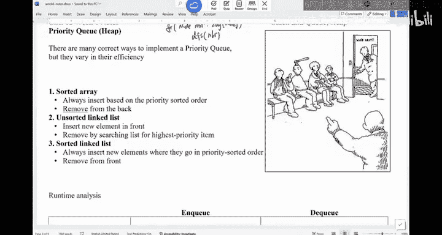

# UCSD《基础数据结构和面向对象设计（Java）｜CSE 12 - Basic Data Struct & OO Design Fall 2024》中英 - P18：CSE 12 - Basic Data Struct & OO Design - LE -A00- - Lecture 19.zh_en - GPT中英字幕课程资源 - BV1zJQHYcE8g

Let's get started in here。 Okay， Good morning。 Good morning。So we are done with stack and queues。

 And today we're going to look at another data structure called priority queue okay。After priority。

 we are going。Focus on trees， binary trees， which is a very important concept。Announcement， right。

 there' is no class on Monday because it's Veterans Day。 So enjoy your。Break。No。Today。

 we'll also release the next P。 The next P is about a double ended Q。

 and you adapt it into stack and Q。 right， That's kind of what it does。

 So the idea of this P is I want everyone to get a sense of this design pattern called adapter。

Aaper is like you。You create a very powerful data structure。

 and you use it to serve the purpose of a less complicated data structure。For example。

 second queuees， in fact， they are very easy data structures。But deck is more complicated than that。

 Okay， so you're gonna create something more complicated。 And then inside the stack class。

 you just create a deck reference and call individual methods of the D class to perform the task required for a stack very similar to a queue。

 okay。So it， it's like， for example。You want to say， I， I want to just sell lemonade in a park。

 right， You may just make a lemonade yourself， or you can spend a million dollars to buy a fancy lemonade machine。

And the sell lemonade in the park。 The idea of the adapter is you buy this fancy machine and use this one to do an easy job。

 That's basically what we are doing。So it shouldn't be bad。 The double ended queue is。

 is a good practice， okay。For today， we'll be looking at。This data structure。

 we call the priority Q is also called the H。 They basically mean the same thing。 Okay。

 so he and the priority Q， they are both data structures。Because， technically。

When when people talk about part cube， the only way people think about is he。

 people don't use other ways to make a part cube in general。 Okay。

 So this is a cartoon about E R visit， right， So everyone is saying who is next and is everyone is pointing to this guy with the X on his head。

 he should be the next person right， It's not because public came to E R first。But it's because his。

 his problem is more serious。They should take care of it。 technically， this is a real story。

 not a real story。 but during the pandemic， we have to go to E R for something。

My wife heard her back， and then we have to go to ER。 and then we were waiting there for a long time。

 Like everyone was stuck in that waiting room and people who came in late。

 they always got pushing early because there were a lot of seniors and having some complications that they all got rolling earlier than we waited hours and people are getting impatient and。

 in fact， the head nurse she came out and basically explained the idea of what the priority queue is。

 when you wait in E， you are now waiting for your turn based on the arrival time。

 If you think my regular queue。You are basically priorizing people who go there the earliest。

 The wait time is the longest， right， The longer the wait time is the more priority you have。

 But E R is not。 is not based on time。 It's based on the severeness of the disease。

So that's kind of what's going on in here。 So you can think about a regular queue is a special case or part。

 You just prioritize wait time。But in practice， there are many things that we prioritize， right。 So。

 for example， in computer systems， normally on my computer。

 there are at least100 different processes that are running at any given time。

 when something happened， the system have to decide which process gets to run。

Normally is not how long the process has been waiting。 each of the processes in Windows system。

 as well as in Mac in all opening systems that are assigned a priority。So the higher the priority is。

The earlier it will get processed。Okay， that's where it is。嗯。

Obviously， there's， theres this problem。 if you think about party。 It may lead to a scenario。Where。

I need to charge it sometime will shut down by itself。

If its not plugged in to save battery。Now， the issue with party Q is。If you not careful。

Someone with a very。Like someone with a less serious disease may wait for a long time。 right。

 So that may lead to something called starvation。 In other words。

 this process has such a low priority。 You'll never get a chance to be processed because there are always high party jobs coming in It may lead the starvation of。

The low party jobs。 And when you take C S C 1，20， you have probably two weeks just talking about how to manage the order of process execution。

Now， in this class， what we want to do is we want to think about what data structure should we use to mimic the behavior of priority here。

 So you give， give the data some priority in your。Data structure。 And you want to say。

 no matter in what order they come in， I will always kick out the data with highest priority。

That's what we want to do。嗯。Does this make sense of what a particleic is。All right。

So here are some proposals that we can think about。 Number one is we can use a sorted array。

Will sort these parties， these processes based on their。Pority order。We just sort it normally。

 Then the smallest party will be in the beginning。 The largest party is gonna be in the end。

 And then whenever I have to kick out basic D Q， I will get a read。Of the part， the， the。

The data in the very end， because that's the one that has highest priority。

 I should insert something。 I just insert somewhere in the array and then just keep the whole array sorted based on priority。

That's one idea， okay。The second idea is， I will use a un sorted link list。I just。

 whenever a process comes in， whenever data comes in。

 Ill just put it in the end or in the beginning of the link list。 When I try to say D Q。

 I would search through the link list and find the one that has the highest priority and then remove it。

That's the second choice。 The last choice is I will keep a keep a link list sorted。

So we'll always insert the new elements where they go in party sorted order。 In other words。

 I have a bunch of data in the link list。 When try to insert something。

 you try to find the right spot inserted。And then we'll remove from the front。

 We assume that the list is。sortred in reverse order。 The largest one is in the beginning。

 the smallest one is in the end。So these are the three choices。Okay， what I want you to think about。

 You can talk to a neighbor is， can you write out。The runtime of these three data structures。

 when it comes to NQ， I want to insert some data into the data structure。

 What is the worst case runtime about DQ。For sorted array， for un sorted link list。

 for sorted link list。 Can you write it on your note by yourself。Do you do this。

And the reason why I am asking everyone to do this is so we can appreciate what a heap can offer。

While looking at the worst case。Run time。Tight bound， big notation。If you are done。

 look at your neighbors run time。 They should be similar。They should be similar。W， you can also。

 if you say I'm done， Can you also think about if I just maintain a regular array。Right。

 not sorted what do you do。Your runtime should be exactly the same。 If there is a difference。

 then one of us。Possibly， both of us made the mistake。Right。Alright， so how about this。

 sorted the array。I keep the resources based on priority。 The largest party is in the back。

And the reason it see the back is pretty straightforward because I cut it out。

 I don't have to shift anything。 So that's。A better design。 So what's the cause of anQ。

What's the cause of anque。I want to insert something in the worst case scenario。对。When。

 when does that happen。When， so it's the highest party is in here。 The lowest party is in there。

 When does N Q the worst case。When it when you insert in the very beginning。

 you're gonna push everything back。 But one spot is like insert in the beginning of run。

 So that's the worst case， Sp O N。How about D you。Sa again，If the arrays sorted， right。

 if the arrays sorted。What you need to do is you can just compare this data with the last thing in there。

Right， so if， if the idea， like， what's， what's the best， if I want to insert something。

And you are saying you， you want to insert in the very end。 And that would also be big O N。

 Is that what you're saying。Like， for example， if you know the array sort。And then。

 you want to insert。110， you just need to compare with 100 and it's already bigger than 100。

 You know， it's going to be bigger than everything in there。It just gonna insert in the very end。

 So it's be O1 Sp1， if you insert it in there。嗯。Well， since one question was raised。

 can I also do binary search if I I insert。35。Can you do binary research， Would that give me a。

Better run time now。If I do binary search for 35， because the array is sorted。I think。

 we talk about binary research in this class。Dider we。We didn't。Did we learn that in 11。Maybebe啊。

I thought I did talk about binary searching here。We didn't。Does。

 does that ring about if you ever already， You want to look for something。You can do low and high。

Kind of boundaries。Yes， I know。 I I I。系系。Please tell me， O。

 that's something you definitely need to know。嗯。I don't think there is a base。Unless I'm wrong。

Can you see the clicker。Can you。No， you can't see it。嗯行。Okay， now it's there。Did we。

 did you know binary research It's more about， do you know binary research， A is yes， B is no。

Do you know binary search。How can this be。F confused。About half of us saying， yes。

 half of us saying no。Then we learned that from somewhere else。Where。

 where you learn binary research from。In 11。哦，AB。20， where。

 where did you learn pi research For those of us who learn pine research。Can someone tell me。Google。

 O。A P， okay， AA， So we never talk about binary research until。

Thank you for letting me know about that。 That's， that's a problem。I can see why。

 now let me explain binary research。 Okay， it's not too bad。So binary research is， is， in fact。

 a pretty interesting algorithm。 What it does， Bi research by itself is， is， is a topic that。

We can spend a week on， right， So what is binary research。

 Bi research basically says you have a big search domain。 You have a big search domain。 and you。

 you are looking at like， this is your search domain。ok。And when you， when you look at this domain。

 normally this domain is sorted like it's going from 1 to 3。 like it's sorted data， okay。

And when you think about the binary search， binary search would give you this concept of the function that appears on this domain would have this binary property。

Like the ideas， binary your properties is like you have a bunch of， you。

 you may ask a question about the data in this domain。 So you may look at the function F。Right， F X。

 and this function will be a binary function。You，You may see true， true。

And then all of a sudden you see a false。Or you see a bunch of falls。And then， you see a true。

That's kind of when you look at this kind of problem。

 you can apply this algorithm called binary search。This is kind of the。

The general idea of binary research。 But in this class， in this class。

 I think we should at least know how to do binary research on a number， on a bunch of numbers。

 So you may be looking at this thing。 So you may have a array。

This array has supposedly have n things。And you're given the X。 You're given this X。

 assuming the array is already sorted。 You have data in there。Okay， so。Is it sorted。Let's say。

 I want to know 30。AMo does 30 exist in this array。 Does 30 exist in this array。

And it would fit this property because you can just design F X to， to say。

 is F X bigger than or equal to 30， bigger than equal to 30。

And that would basically says for the values that are less than 30 will be false。

 And once you hit something that is bigger than to 30， that will be true。But in here。

 we are looking for exact match。 So I want to know where 30 is。And the idea is。

 if you know this entire big domain，0 and n -1， you can find this value in the middle。

And for example， if this value in the middle is 25。What can you say about。Where 30 might be。

You must be。To the right side of 25。 right， That's what it is。 So it must be to the right side of 25。

 But if this thing is like。35， you know， it must be to the left side of the mid because this whole array is already sorted。

And。The， the benefit of doing this thing is you basically cut your search domain by half。

Every time you make a comparison， if this is already 30， you find it。 Theres no problem。mSo。

This is the idea of binary research。 This is the idea of binary research。

 How long do you think it's gonna take for to find。If the answer is there or not。What's。

 what's going to be the runtime。Log， right， because you keep reducing the size by half。

 So in other words， if you n things。How many times do I have to divide by2。

 such as the size becomes one is log base 2 n。And that's the， the runtime。A lot of times。

 lower bound would also be used。 So it's called lower bound function。

 Lower bound function is binary research。 Basically。 So in， in a lot of algorithms。

 people call the lower bound。We can write the binary search function really quick。

If I given this array。You are given this array。And then， normally。

Let let's say you are given this inte array。 and then you are given this key。

 You want to look for this key。And return the bulloleion。You can specify。The left。

The left side is where it starts， where it starts， the left boundary。And the right boundary。Es to。AR。

 R dot length。This is the right boundary。 This is the right boundary。And welcome for the first。Te。

I think。I may be off by one here， but well， L is less than R。

So the left side is less than the right side。 This is the condition to stay in the loop。

 In other words， I haven't。 They haven't met yet。You calculated the myth。Equals to this thing。

Which is the middle point。Right， so L plus R minus out by 2。嗯。Now， if the mid point。

Is exactly the same as the key。Or return true。Right。Oh， safe。If the midpoint。Is bigger than the key。

我死在这儿。Youive this needle upon the speaker down the value I'm looking for。Then if this value exists。

 where is it。It must be to the left side of the amino1。 It must be to the left side， so。

If you think about it， this is right， this is left， and this is met。You。

 you say it must be this region。It must be this region。

 So you will move right not to be mid because you already know mid is not what we are looking for。

 Youll move right to be mid to be immediately to the left side of mid。So right equals to mid。-1。Else。

L equals a mid plus 1。In the end， youll return false。Because once you out。

 once you go outside this while loop and you never found it， you return false。

But this is the idea of binary search。 You will keep going like you move L and R to specify the search domain。

 And every time they would drop half of the search domain。

So this whole thing takes log and time and hence the binary search。Okay， so definitely。

 you have to know this。 Okay， you have to know this。嗯。All right， any questions？Allright。

 now going back。If I want to say。If I want to insert something into a sorted array， I say。

 can I use binary search to find out where this thing is。I mean。

 you can return the location instead of returning true and false。And then would that beat big O N。

I use binaryer to find the insertion spot and then insert over there。 Would that now beat B O。

Right now， as we insert in the very beginning， we push everything down。 That big N time。

How about if I find the insertion point using binary search， that would be big log。

Would that help us。예算呢。No， right won't help because you still have to push things down the line。

That's， that's the issue。 right。 So binary research does allow you to find a spot。

 But if you have to insert into an array， you have to push things。 So shifting is always an issue。

 So even if you use binary research， because I will insert in the middle， it's still not gonna work。

In the worst case situation。Now about DQ， What's the cost of DQ。In this array。

 the highest priority one is in the very end。What's the cost We to DQ。You still be going。No。

 what's the runtime now。Big O1， right， just cut out the last thing， which is big O1。So if you。

 if you use a sorted array。I mean， A is okay。 A is bad。 Deker is good。Right。Does this make sense。

How about unsorted en list。Maybe it's better。 I ask you all to vote。A isB go1。 B is b n。She is big。

Log。I think those are。Reasonable choices。What would you say， the runtime of unsorted theingists。

Just keep things into the list。 You can insert in the beginning or in the end。

I don't care about the author。Was a runtime now。If you look at the vote， we do have a winner A。

 and that's correct。 right， If you to say， I don't care about the order。

 I don't have to maintain the order。 The easiest way is insert in the head or in the tail。 Big one。

 Big1 time。How about DQ。I need to find the one that is the largest party and then get rid of it。

 What would you say the， the cost for DQ。Both in again， all those three choices。

 Now for DQ of unsorted linked。Alright， let's， let's check。we we got this one。Big O N， right。

 Most of us are voting for big O N。 That's good because you have to search through the whole list and find this one。

So it's it kind of reversed compared with the array。 How about this one。 This nice thing。

 sorted link list。 I'm maintaining the data in the link list， as sorted。

What's the cost for me to unki in a worst case scenario。The cost to Ncu14 books。Thank you。

A link list， the data in the link is sorted。And we are assuming it the largest in the beginning。

 and it's like descending order。What's the cost for me to unki now。Remember a full party queue。

The most important part is。When you deque， you must get rid of the one with the highest priority。

RightThat's the the most obvious behavior。 But you still have to think about AnQ when you insert data。

How much does it cost？So I have a sorted the linked list。I want to insert something。Alright。

 quite a few of us are saying B。 Qui a few of us saying B。Linear， right。

 So it looks like you have to find this location you want to insert。 And for link this。

 you have the hub。 And once you find that spot， the insertion part is bigger1。

 But seeking the location is bigger。 And that's， I think that's the。The argument， now。

 can I use binary research to help me because binary research is logan。

Can I find this spot in login time。And once I find that spot， I would use P O1 time to insert it。

Can they use research。Why not。有。Right， you cannot easily define the midpoint， Midway point。

 If theres array， you， you know the average of the index。for English， there's no way for you I say。

 go to location 5。If the link list has 20 things， I say 0 and 19， the average is like， I don't know。

9， So go to location 9。You cannot just go to the location directly。 You have to hop。Right。

 so even if you have a link list， you want to mimic the behavior binary search to go to the middle point。

 It takes linear time。 So it doesn't help。 So in other words， for a sorted link list。

 you can't use binary search。Our research would rely on。A array。 So is the hash map， right。

 The hashing tables。 You cannot say the backend data structure is linkless。 It doesn't work。

 It has to be an。So this one is biggo。嗯。Sored the link list。 How about D Q。EQ should be B go1。Right。

So just gets rid with the first thing。If you look at these choices。We are stuck， right。

 One of them is extremely good。 One of those operations is extremely good。

 but the other one is linear。Can we do better than this one。So that's the， the question。Obviously。

 the answer is， yes， we can do better than these proposals。 and hence the idea of a heap。So that's。

 that's why we want to use the he。And I can tell you the the end the result is for he。

 andQ will be login。DQ will be login。So everything is now log efficiency。

 I do want to remind everyone how good log is。 You can't say a log is just。

I mean how good log compare with constanttantine。I can tell they are very similar。 They are very。

 very similar。 Log is extremely slow function。 Just imagine if you say， I have a log。1 billion。

If you that my data size is  one billion log 1 billion equals one。lockway， too。In other words。

 if you say I have a log efficiency。And。I give you an array of size，1 billion。

If the runtime is login， it's what。30， around 30。Logged 1 billion is about 30。 If you log 1 trillion。

I think it's about 40。So although your data sites are exploding， log goes very， very slow。 So it's。

 it's almost in never rise。 Its， it's a very flat function。 So it's very similar， like a constant。

So in other words， the， what he can offer is way better than this linear time， way， way， way better。

 Well， you do compromise a little bit in here， but。The， the， the difference is not that big。Okay， so。

That that's what I want to kind of explain。 Now， how does heap achieve this goal。

 Here's the description of what a hip is。 Heap is one kind of a binary tree。Now。

 what is a binary tree， right？ A binary tree is a length structure where you have node。 The node。

 you can think they are linkedless nodes。Each node has at most two links pointing to other nodes。

 and each node has one node pointing to it， except for the root， which has 0。 So in a sense。

 what we have is you can think about。This is what we have。This is a binary tree。

 This is a binary tree。 A note。 Well， if you think my link let as the previous as the next。 Now， in。

 in fact， instead naming them previous next， you name it left and the right。So you can look at this。

 This is a tree structure。 You have this node。 It may have up to two children。

 And here is up to two children at most。In order for you to say something in the binary。

 it doesn't mean it must have exactly two children。 For example， this node has one child。

These node have no children。Okay， that's what we have。 But this is a binary tree。

 this is a binary tree。 So a he is a data structure like this where each of the node would store the data that we are looking for。

So if you have data， each of the node would contain one of those data。

So the data laid out in this way。嗯。But hip is not just any binary。 It is a special kind of binary。

 In Otherwise words， it's a pretty rigid binary。 It's called a complete。3。A complete tree。

So what is a complete binary tree， is basically means all levels must be full。

 except at the last level where the nose must be filled in from left to right。 In essence。

 you can think about a binary tree like each node would split。Into two ways。

 until at the very bottom level， where some of the node may be missing on the right side。

So you can think this is a super nice tree。 It's like a triangle。And then at the lowest level。

 you are missing some noise on the right side。 That's a allowed。ok。

So this is the structure requirement。There is also an order requirement， the data requirement。

 The order of data must obey he property。Meaning that every node， if you think about。

 this is the parent。This is the left child。 This is the right child。The parent。

If you look at being heap， each parent is always less than or equal to its children。This is。

 this would give you a mean he version for max hip version， each。

 each pair must be bigger and equal to its children。That's a requirement。

 So in order for you to have a heap。It must be a complete binary。With this ordering requirement。

 we say the ordering is some sort of vertical ordering。Compare parents with the two children。

Questions about this。Okay， I I would， I will try to explain why we， we have such a rigid requirement。

 It is basically to mimic the best behavior of a priority queue。So， let me。

Let me reiterate some of the concepts。 Number one， what is a tree。

 A tree is a connected acyclic acyclic graph。 So this is a tree。

So the whole thing is connected to their edges in between the nodes。This is a tree。

 It doesn't have to have a root。 Not all trees will have roots。 So what is a root。 If you。

 if you imagine this is a tree and you lift any of these node， You lift this up。

And all the other node would fall into place based on gravity。

 Then the note that you just lifted it up will be the root。 It doesn't have any parent。

So that's the idea。 So it's upside down。 If we think about the tree in， in reality。

 the root is at the very bottom。 The leaves are at the very top。

 But the trees we have in here is the other way。 So the root is at the very top， the leaves。

At to the very bottom。 So this is a tree。 If you think about the rooted tree。

It's something like this。For example， this is a root is tree。 This is the root。

And these are the leaves。Over a tree。So root has no parent。 leaves have no children。That's what。

 what it is。A binary just limits how many children each node may have at most。

A binary means I most two children。 Eernern tree means I most three children。

 There are also trees like called 2，3，4 trees。 It's like a tree mayre each have up to four children。

That's what it is。So this is a rosy tree。 Now， a complete binary tree。Is， is like this。

When you think about a binary tree， it always implied。 There is already a parent child relationship。

Right， if you， if you think about binary， it is always rooted。 It must be rooted as something。

 Otherwise， theres no relationship between who is a parent， who is the child。So in here。

 a complete binary tree would be like this。For example， this is a complete binary tree。

Everything before the lowest level would have two children。

Except the lowest level where there may be some nodes missing on the right side。There's a binary。

 There's a complete binary tree， a full tree。F binary。The requirement of full binary， each node。

 if it has children， must have exactly two children。It it's okay if a node doesn't have any child。

 So in other words， a node would have either 0 or two children。If have a binary new tree like that。

 It's a food tree。 So food tree may be like this。This is the future truth。

So a full tree doesn't have necessarily be a complete tree and vice versa。So for full tree。

 this one have two children。 This one have two children。 This one has two children。

 The other ones did have zero children。That's a food tree。So do not confuse that。

Any questions so far。All right。Now， there are also other metrics that we use on trees for the rest of the quarter。

 while are working on trees。 So one thing you should know is what's the height of a tree。

The height of a tree is the distance between the root and the deepest leaf。

How many hops you have to go。 For example， the height of these tree were。

Was it height of this tree in here。The distance between the root and the D P。Well。

 what are county edges in general。 What are county edges。 Sos 1，2，3。 The height of this one is 3。

The height of this is 3。The height of this tree is also three。If you look at them。嗯。So。

 this is the height。嗯。The height of a single node is 0。 The height of a no tree is 91。

 So we can always。Thinking that way。There is also a depth of a node。The depth of a node is。

 how far away is it from the root。For example， the depth of this node is one。

The depth of this node is 2。 It just tells you how far away is it from the root。

SoThese are the terminologies。As of now， we are not gonna deal with these things。

 But after we finish the heap， we'll spend all the time on binarying trees。

 That's when we gonna have to be able to calculate all those。Like， for example， give a tree。

 you verify if it' is a complete tree。Or give you a tree。 We verify if it's a full tree。

I give a tree。 You tell me the， the height of this tree。I'll give you a node in tree。

 You tell me how deep this node is。 So those are the information。 You have to know how to do it。

 okay。So far， any questions about terminologies。Then let's， let's do a vote in here。We are look at。

Heaps， so what？A heaps in here。Heap is let me open up the boat。

 Heaps up complete binary trees where there is a ordering requirement on the data。

 A he can be a mean he。 A he can be a max he。 But you have to be consistent。

 If you say this is a mean he。 Then every node must follow the mean he properly。Similarly。

 for the max。What would you say， The answer is。Which ones。Quite a few of us are saying E。

 A lot of us think， more than one of them。 Can you have a discussion in the number of which ones。

It should be exactly the same thing， right which ones。Which ones are。Heaps， which ones are heaps。

Alright， which ones let's say is， is a a hip。Strucural wise is is a hip。 So he has two requirement。

 The first part is structure。 Is this a complete tree。No， it's not。Right， so the top part looks good。

 But at the lowest level， this node has a missing left。

 You can only missing miss node on the right side。So， this one。No， how about B。

Is this on good or bad。Good or bad。Bad， right。 This is aernary。So this one have three children， no。

You can't have three children。 It must be a pioneer tree。 How about well。

 then C And D has to be right in order for E to be right。 is C right。

This one is bigger than is So this one looks like a mean heap property。

AndSo parent less than two children， parent less than two children， parent less than two children。

 parent less than two children。Is O if 27 is is on the left side，18 is on the right。Is that okay。

Can the hipap have the， the， the children， like in other words， do I have order from left to right。

No， for he， it doesn't。 It doesn't matter。 right So as the parent is bigger than the two children。

 I don't care which one is bigger， Which one is smarter。 So this one is good。O。嗯。

This one is also good。 This one is also good。 So 5， less than these 2，6， less than these，12。

 less than that， Strize。Both of them are good， so。E is the right answer。Does this make sense？

Alrighty， then I guess we are done today。 We didn't get the time to do the operations， but。嗯。

I will see you all on Wednesday。 See you all on Wednesday。 Don't forget， this coming Tuesday。

 we have a quiz3。Quz 3， okay， anything before he is fair game。 Anything before he。

 So we' are not gonna talk about he。In this coming quiz。All right。

