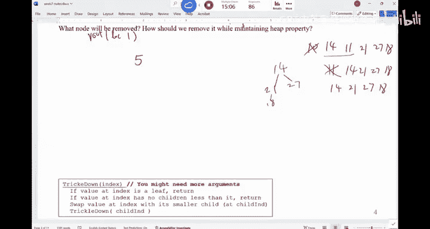

# UCSD《基础数据结构和面向对象设计（Java）｜CSE 12 - Basic Data Struct & OO Design Fall 2024》中英 - P19：CSE 12 - Basic Data Struct & OO Design - LE -A00- - Lecture 20.zh_en - GPT中英字幕课程资源 - BV1zJQHYcE8g

All right， I think we should get started in here。So morning， everyone。Ofba sudden is week 7， week 7。

So，7，8，9。And then。The last week is mostly for review。 So we have a few weeks of new materials。嗯。

I don't think I have a announcement per se today。 Are there any questions before we start。So it's。

 it's now crunch time， right， week 7。 And this is when people may tend to get sick because you are more stressed at this stage。

 okay， so。Make sure you dress warmly， eat well， sleep well， you know， if possible， so。嗯。

That's how he goes。Now。For。For today， we look at priority Q。

 Last time we looked at the idea of the party Q and the new node is there are some copies over there。

 are new copies in here。 If you need a copy of the note is here。

 and we probably will use this note for next week， too， based on。The material I put in there。

 So we'll see。Last time， we looked at the definition of heap。Right， so we have looked at the idea。

I think we finished this exercise。I think we finish this one。

 So a heap is a complete binary tree where。A parent and is two children or its children would follow a certain ordering p。

 So you may have a mean hip。 You have a max。 You can pick either one and you just stick with it。

 right， You say I would like to have a mean hip。 normally what you are looking for is in this problem。

 I need to access the smallest data all the time。You may also have a max he that would allow you to access the largest data all the time。

 currently in the set， okay。So these are the definitions of a heap。

 We also talk about basic idea of trees， right， So you should definitely know all these definitions。

 What is a binary tree， What is a complete binary tree， What is a full binary tree in the sector。

Are there any questions of those concepts。Right。No。When we try to represent a heap like this。

This is a mean hip。 this is a mean hip。 When we try to represent this。 We can use a link this idea。

 So you create a node class。 It has basically two references， node references。

 You can say the left reference of5 would be pointing to this node。

 The right reference of 5 would be pointing to that node and just build it up。Right。

 that's something you can do。Sometimes when you look at this kind of node。

 you may also bring in a parent。Poiner。 So you may say， in this node。

If you have to use a tree structure， you say you， you create a node class in here。

 you have a node of left child， right， child and parent。Right。

 so one reference is pointing to your left child。 One reference is pointing to your right。

 And then my reference to say， who your parent is， because it may be useful。

 That's normally what you do。Now， given this kind of node structure。

 how do I know if a node is a leaf node。How do I know like 14，11，21，27，18 is a leaf node。Although。

 if I use this kind of node structure。How do I tell if a node is a leaf node。Right。

 so if both the left child and right child of that node is now。

 it means they have no children By definition， a node with no children is a leaf node。

 How do I know if a node is a root node in here。Wen。The parent is now， right。

 So you can definitely look at all those properties to， to， to say， okay， where is the the， the root。

 Where are the， the leaves and do all the operations you want to。The。

 the interesting thing about a he that mimics the behavior of party queue is in general。

 you do not need to know what is inside the queue。 if you think about the queue， right。

If you think about the regular queue。You， you， you do N queue。

 you're gonna save some data into the queue。 But when you say I。

 I need to access something from the queue， you only have access to this very front of the queue。

You do not have access to things inside the queue。That's normally what we do。 So if， if you。

 if you are providing a structure like this， you are， it's like overki。

 you gonna be able to access everything in here。Normally， that's not what we need to。

 And because the p of a he being a complete tree。 When you have a complete tree。

 You can always use an ray to simply represent that complete tree。 Okay， I do not want you to， to。

 to say， okay， this is a he。 so I can use a rate to represent it。 Its not the case。

 Its because he is a complete tree。So complete trees， complete binary trees。

You can use an array to represent it。That's normally what you do。

And there are many other data structures that mimics the behavior of complete tree。 For example。

 for those of you who in the future may may learn this data structure called a segmentation tree。So。

 that's。Complete tree structure。 You can use our rate to represent it。 So is this regular。嗯。

When you look at how do I represent it， its， it's pretty referred。 Go top down level by level。So。

 pop down。Right it here， sorry。Pop down。Level by level。It was out of five。And then the next to know。

 the 6，10。 The next one is 7，14，1121。And then 27，18， That's how youre gonna write it out。

So can just go。Lvel by level。It's like you are doing a P， F， S from this route。And I do it。Like that。

That's how you convert a tree into this array。The size of the tree is 9。 There are 9 nodes。

 and I'm leaving the zero of element unused。In your Zi books， it。Use this zero element。

 Both are okay。 Both are okay。 It's up to you to decide which approach you're gonna be able to use。

 But they basically represent the same key。 Okay， so we're gonna start from location。Wen。

So this is the size of the。嗯。Keep， so it's nine elements。Now。

 one in interesting popular is wheres the root。 The root is always at the first element。🎼Right。

 so because this， this is how you do it。 So if we think about， I need to get the root， you know。

 the first element is there。And a lot of time you say。

 I want to find the smallest in here because the root is in this mean hip is the smallest say give me the smallest data and then kick it out from the queue。

 A lot of time you say I have to get， I have to delete this 5。 If you have an array。

 you delete the first element of the array。Is that a good operation or no。about Ray。

 remove the first element。Its a very bad thing， right。

 because you have to shift everything to the left。To， to fill the gap。

 But that's not what we're gonna do when we remove 5。

 So we gonna actually bring some data to replace 5 and then do some operation。

 So it's not gonna like， we're gonna get rid of 5， but not like what we did with the reals。

 cut it out。 shift to the left。 No， not in that way， okay。Now， if I look at this array。

 I look at this tree。The are interesting properties。 you should know。

 These are the properties you have to remember。 Okay， number one， half of the trees are leaves。

 halflf of them are parents。This is one of the properties of a complete tree。

 So if you look at five is apparent，6 is parent，10 is apparent，7 is parent。

About half of them are parents。The remaining ones are leavess。O。So you may look at it this one， So。

In other words， how do I get to for anything before for parents。Everything after four our leaves。

So the last parent index is simply size divided by two interior division。Size there I by 2。

So if size is 9，9 divided to it4。 So everything before4， including for our parents。

Everything after four， not， including for， will be。Leaves。

 so that's something you can easily figure out。 So about half of the， the trees are are leaves。

 So has a lot of leaves。Yeah。Now， if I， if I have a note， like。If no 10 right here。 What are the。

 the two children，11 is the left child，21 is the right child。And if I don't have this tree structure。

 I just look at this array。 How do I find is two children Its simply the left child is2 I。

 The right child is 2 I plus  one。So if 10， two times its index is 6。

Two times this index plus  one is 7。 So 11，21，11 is the left child of 10。21 is the right child of 10。

That's how you view it。You can also figure out who my parent is， like。3， the index will 10 is 3，3。

 divided by 2 is one。So。This5 is a parent of 10。要差一对。So if you know the index。

 you can divide by 2 to get to your parent location。 If you know a node location，2， I。

2 I plus 1 will be the two children。So in essence， just by looking at this array。

 you can forget about this tree structure。So in your head。

 you must be able to go back and forth between the array representation and the complete tree representation without any trouble。

And these formulas are the bridges。The formula see from Tpo is different from these formulas because T box use0 index H。

 I use one index hip。In our quiz。Well， I think we did quiz 3 yesterday。

 I think Branding has already released quiz 3 grades。 So you should be able to check it。 But when。

 when， I'm gonna be able to cover this in quiz 3 re。 But in the final， we'll be very clear of。

Do I represent this heap using y index out your index。You should be able to。Go to the formula。

 no matter what。Qu friends。Al right。So we have some worksheets。 That's what we'll try to do in here。

 Okay， so in the handout on page。3， okay。So if you need a handouts。

 there are some over there some in here， feel free to grab one。We have this。Heap of this heap。嗯。

Can you try to answer the first two questions。The first two questions。In this heap。

14 is that location 5。Where is his parent？Don't draw the he。 Just use the array。 Just use the array。

Now， who is the parent of 14， who is the parent of 27。How do you do it。Allright。

 so who is a parent of 14。But do the math， too， So just。Whatever this value do I buy to。So。Right。

 who is the parent of。27。Whatever it is。4。That's how you find this parent。Now who is a parent of one。

Nothing， right。 So one has no parent because it's the root。嗯。How 도。Are we good。

How about number three， I think we can vote on this one。I'm seeing a no base， again。

Can you all see the base。He there。I think the clicker system here is getting a little bit flimsy。

Can you see the base。No。Let me restart it。go。So number 3， please。What would you say。

 if a value is in the hip starting at index when you stored at a location I。

 where can you find this parent， It should be an easy vote。Should be easy road。Right。

 we'll stop the vote。 If you look at it， majority of us said B， right， I divided I by2。No problem。

Now， how about this thing。If a value in the， if I have a value in the hip。In here， is the location I。

 then where is left child。 If I book a note， I， where is the left child。Where is the left child？

Of this node。我天。You have to use a clicker。プとす遅覚しな。No， you have to use a remote。ま。All right。

So the answer is to， I。Right，2 I in here。 The next thing is 2 I plus1。We got it in here。

Are there any questions for this。2 I，2 plus1， those are 1 and the right child。嗯。Next thing。

This is a heap。This is the heap。Draw out the complete tree。With us。What does this one do。

Can you draw to the tree based on this array。All right。Let's draw this together， so。So路 is three。

And then the， you have 6，5。As the child。And then you have 8，9。You have 1214。等 have1110。Right。

 that should be the he structure。 just。Go， this one。 This one is two children is these two。

 And then the two children of this node is these two。 So it just keeps。Going to level by level。

That's how it goes。Any questions？How about this one。Of this heap。And have this array。

That corresponds to this he structure。Which node ABC D， E corresponds to this red cell。

 assumingum it's why indexed。 So we are not using this zero spot。We not using it。Can we vote。Alright。

 so the most popular choice is C。This node。Right。Why can， can someone。

 did do you all just lay out and see this is where C will be。That's one way can do it。 Or you say。

 okay， it is two level up from the root。 This is the root。 divided by two， divided by two， so。

That's also。See。Right， so basically， what we are trying to do is we are trying to find a mapping between a tree and the array。

 So you are comfortable using the array to mimic the behavior of a tree。Are we good？All right。So。

What is。What value is the direct parent of this one。

So who is the direct parent of this red cell in the。Eep。Who is it the art parent？both AB，C， D， E。委川。

One of them is the direct parent。Remember， all the things， all the examples we having in here。

 we assume its one indexed。 we assume it's one index。Heap in January is now bad。 you know， it's。

It's just a ray manipulation。 So once you are comfortable with this kind of mapping。

Mipulating a array is something dirty。In general， we we do not。worryorrry about。So。

A lot of us voting foresee。Keep look at we don't have to discuss。

 So a big chunk of us what see is simply 70 by 2。对。No。Where is the。Where are the children。

Of this node 5， can you have a quick discussion with your neighbor Think about what are the two children of this node 5。

What are the two children。Have a discussion with our neighbor。 What would you say。

Where are the two children。Alright， the two children is with。This is one of the child，2 I。

2 I plus  one is out of the bounds。 In other words， it doesn't have a right child。

 This note doesn't have a right child only has one child。So left， this is the left。No right child。但是。

Does this make sense？Alright， so are there any questions of the relationship between array and the heap。

When you are writing this coming P， right， So we。This P is the D P， right， The next one will be he。

 So when you' are writing this coming P A， you're gonna just manipulate this array。

 You are not gonna use a tree。To mimic the behavior of the hip。Okay。

So when you think about the operations on this array， normally with say N Q D Q， right， P is easy。

 P is just return。The first element in this array， That's it。So unq means insert。

I want to put something into this array。 Duous， I want to remove the root of the。The he， So say D Q。

 because this is a priority Q。 right， So I want to get rid of this route。 So which node do we remove。

 Want to get rid of the root， Can I ask you to have a quick discussion with your neighbor based on our reading。

 if I I need to get rid of 5。I need to do something to make sure that once I get rid of 5。

 the result is still a hip。 It's still a mean hip。How would you do it， How would you do it。

 when I try to。 This is basically the I idea of D Q。Right， so how do I do DQ of a priority Q。

 Can you have a discussion， please。What would you do， You gonna kick out the root。 And then what。

Alright， can I say this。 Well we're gonna remove the root。Bas city location one。Right。

 that's the thing we're gonna get rid of。Can I simply say this， Just shift everything to the left。

Shift everything to the left。I know my hip is 6，10，7，14，1121，27，18。Will this work？Is this a heap。

How do you verify if a given raises a he。610，7，14，11，21，27，18， is that a he。Is that a heap。

 Can you draw it out？ Is this a he。So 6 is the parent has two children，10 and 7。14 and 11 here of 21。

27 here I 18 in here。 Is this a heap。Is this a heap。Yeah， it is a he。Within this work。

Can you give me a counter example。I just cut off。Shift everything to the left， which is a bad move。

 right， because you can take linear time。But why I shouldn't do this。Runtime wise， that's a concern。

 But would this guarantee to be correct。If I take you one more time。I gather this six。Now， I have 10。

7，14。11，21。27，18， now， I'm in trouble。 This is no longer a me he。Because of this10 is here。Right， so。

Can I say this if you look at the hip， a mean hip。The smallest data must be added to the root。

Is that true or false。Yes。Can I say the second smallest data must be one of the two children of the root。

Can they say this。Is， is that true or false based on your understanding of a hip。

 So the second smallest。Which in general， we shouldn't even be concerned， right。

 The second small is is。One of the。Rs children。Is this true or false。A is yes。 B is no。Fse。

What would you say。So。IThink this thing stopped again， true。Do you all see no base again。嗯。

What's going on here。I need to talk to the。There's something that is now working。Let me try again。嗯。

Can we。Is this true of us， The second smallest must be one of the two children of the root。Yes or no。

The second smallest。Must be。 So I'm just trying to be tricky in here， right。

 So I'm trying to force you to think a little bit deeper than just。The surface and of it。嗯。

Is that true or false。The answer is。If look at it， a lot of are saying， yes。Right， it， I mean， it。

 it's possible， right。 So one of those two children， can someone justify this， why。有。Right。

 so if you think about this， if you just look at one of the， the two nodes in here， this thing。

 if you look at it， this thing must be a mean hip by itself。This thing must be a mean hipap by。

 So if you just look at the root， the left sub tree， the right subre， they must be a mean hipap。

 In other words， this 6 and 10， they will be the smallest。Of 6 will be the smartest of this region。

10 will be the smartest of this region， and one of them will be the smartest of both regions。

 hence the second smallest。Do you agree。Make sense。How about the third smallest？

Assuming there is no duplicate。 Can I say this， The third smart is must be one of the。

WellI think you can see the counter example already here。The answer is no， right， The answer is no。

 You can't say the third model This must be one of them。 No， you can be somewhere down the line。

Right， so one way or the other， this is kind of what the he is。

 And what we are trying to do is we're trying to once we get rid of this 5。

 I want to make sure that the result is also gonna be a he， meaningan that this。

 whatever I put in here will be the second smallest。So which will be one of these two， hopefully。

Right， can they simply say， oh， just replace 5 with one of these two。 Would that work。Since we say。

 oh， the second smartest will be one of them。 I just say if you get rid of5。

 just pick the smallerer of these to put it in the first place。Wouldn't that be easier？

What's gonna be the problem。My proposal is this， like if we are being interviewed。

You know how to build a heap。 You know how to remove。 But they said， here's another idea。

Why would it would work or why it wouldn't work。 My idea is this， find the second smallest。

Which is the， the two children， one of those two children of the root。And then， replace it。

Put it to the very front。Of the array。That's my proposal。

Find those two children put it in the very front。 So in this exam， the get rid of five。

 the two children 6 and 10。 So I would just put 6 in the very beginning。

 which would end up with this thing。And now I would say， okay， I have 6。

 now Ive 10 is7 as my two children。 I would say， Ill put the second smallest。

 which will be two of my kids in 10，7。 I put 7 in the front。Can I do this。

Just look at your two children of the root。 Pick the smaller one put in the front。

Would this work yeah？So。I can do this。 It will work， but I won't have a perfect tree。

 What do you mean， you won't have a perfect tree。So when you say perfect trees。

 I just have this array， I can always lay it out as a。Comptry， I can always try to lay it out。

 So my idea is this。 can， can you all have a discussion， right， why this。Okay。

 why that the method you read from Thai is only method。Why can't I just say， okay。

 this is my original tree。 I say， okay， I get rid of 5， right， This is my 5。 I get rid of5。

I just look at this thing。 The two children，5 is 6 and 10。 I picked the big smaller one of those two。

 make it the root。 So this is my new。一。Now I have 6。 I say， get rid of6。呃，画的。

Smarmaller of the two children，6， which is 7。 So put 7 in the front。That's what we have。

Will this work？And then I'll try to remove but like if you keep thinking about it， will this work？有。

这明。RightSo this idea won't work。 right， We know the second smallest is is like this。 Now。

 if I remove again。I move 7。The two children of 7 is 10，14。I， picked a smaller one。

 become the parent。Right， this one seems to be working。 And now remove 10， the two children is 11。

14 of 11，14，21，27，18。 And they keep going。This process would work。In this example， I is。

 can someone come up with a counter example。That won't work。That it won't work。

Can you come up with a second with the counter examples， My idea is， get rid of the route。

 I don't care about the run time。 The run time is gonna be bad。 Get rid of the route。

 Pick the smarter of two children as the new route。And just keep doing this。

 It seems to be working in here。Can you come up with a counter example that it won't work。

That would break this problem。Procedure。Can you have maybe come up with something by herself。

 I'll talk to your neighbor？What is your counter example。Anyone。

 can anyone come over with their counter example。You I remove one more time。You mean， from this。

From this step。So I will say， okay， get rid of 11。 now the。The two children，11 is 14 and 21。

 So I would have 14 as the new。Root。Ive said， this is。Is this a mean he now。No， it's not。 right。

 Good point，14。21，27， and the up 18。You no longer me he。Hes no longer me me here。 So that's all。

 So you say， I find the second smartest。 Just do this manure。 It doesn't work。Any other proposals。

 other than the method we。Learn from T book。Any other ideas okay， get rid of the root。

 What should I do next。We tried this approach。 It doesn't work。 Now， how how should I do it。

Can you describe to your neighbor。How we would do it， We're gonna say。When we get rid of this5。

 what do we do。I think。What should we do in here。Can someone tell us。What would you do。

Once I remove the root。You're gonna replace it with something， yeah。I'm gonna replace with 18， Y 18。

So I， I will basically replace 5 with 18。Right， and then I do something on this top。Y 18。Why now， 27。

Why not 14。有。Well， if I move 14 up， remember， we are just looking at this array。

Right I can always redraw this area as a new tree。So it will will not break the complete tree property。

So why， why do I replace， I say swap 18 team with 5。 Why， why is that case。Can someone tell me。

 why can't I say a swap 27 with 5。Why do I want to swap 18 with 5。Oh if I been interviewed。

 this is what I learned。That's not going to be good， but why？

What's the benefit of swapping the last element with。The root。What's the benefit。Yeah。

Its a completely tree。 It's now perfect tree， Comp tree， right， so。I want to have。

And like I I can do this， right， I think all of you are concerned to say， oh， you， you， you。

 you put 18 here。 you put5 here。 I can do this。 I can say I'll put 27 here。 I I put 5 here。

And I just get rid of this5 in here。 And was， what's the issue If I get rid of5 at this location。

What's going to happen。You have to shift。 You have to shift。Right， because if you use。

 you can use any of these leaves to replace with 5。It's not gonna matter。 But the issue is。

 if you use any of these leaves to replace the root， you have to shift all the things to its right。

To buy one spot， because you're gonna get rid of that leaf。

 And this 18 is the perfect one because there's nothing to is right。You just replace it。

 You get rid of it。 That's it。 That's the easiest way。Right so you， it doesn't involve any shifting。

 If you just use the last leaf to replace。的。The root。That's the， the only reason we are doing it。

There is no shifting。Because if you use 27， you've got to shift 18 to the left by one spot。So。

 I get rid of。This5。A replace with 18 now 5。 And then I cut this off。I simplyly cut this off。

 How do I cut off this last node。What do I do。Just two size minus minus。 does it。

The last data is no longer my consideration。 It's not the legitimate data anymore。

So there is no shifting involved， just one minus minus。 that would work。 If you are required。

 you can set this thing to me now， but。Anything beyond the size is not gonna be viewed as data。

 So now I have 18 here。 Obviously， ed is no longer good。What should I do。What should I do。

There is this。Trickle down idea。So you're gonna go from 18 and you're gonna to trickle this 18。

 In other words， you're gonna push this 18 to the right spot。Why would this trickle down idea work？

So this is the trickle down。嗯。Algorithm， right， So we are given the index。

If this value as index is a leaf， you are a done。Otherwise。

 if this value on index has no children less than it， you are done。Otherwise。

 you would swap this value at index with its smaller children， and then you recurse down。

That's what you will do。No。Why would this idea work。Why would this trickle down idea work？

Can someone justify。Why would this trick idea work？ So you have 18。

 You find it smart if do two children， you swap it。 Then now you recur at this sub。 Keep。

 Why would this idea work。You really have to know why， you know。With the age of chat G T， you don't。

 We don't need people to memorize those things。Computers are way better memorizing it。

 You got to and understand， why we are doing this。Right， so why we are。

Why this trick idea would work？有。

呃3。7 have3。8。And it's going to the other group。本那的。The two new children were。Right。

 so this is why we are looking at where the second smallest is。 The second smart must be one of them。

So you're gonna swap this second model with this 18。 Now， you put 18 in here。Right。

 so now this part is 6。 you put 18 here。 You will try to basically trickle down on this subtract。

On this sub， sub keep。And this， in this subheep。The second smartest will be one of these two。

 You'll swap it。And now you're gonna to trickle down。 And at this moment， you are done。

And this would be a heap。In the essence， what we' are doing on this domain is you put 18 here。

So this is 5。 You put 18 in here。I need to find these children。 Where is the two children，2， I。

2 I plus  one。You're gonna replace 18 with 6。 You' gonna swap。 and 18 will be here。6 will be here。

Now， what are the two children of 18，7 and 14， I would swap。18 with 7。So now 18 is here。

 What are the two children of 18。I think it's。Is it 20。 So this is。see， did I make a mistake， sorry。

I think18 should be here。Right， so the two children of 18 is 8 and 9。 So I no longer have element 9。

 So you just 8。 and then your order。 That's when I stop。

So you are just gonna manipulate this array once you swap the last leaf to the very top。

 Just trickle down up on the array。Are we good？要我就开始。So the run time on trickledling down the array。

 I I want you to think about it。 right， So what's the run time。

Is it linear or is it better than linear？ Think about it。We look at it on Friday。

 We look at on Friday。 Okay， so we are done today。 So hopefully you understand how trickle down works and why we do it in that way。

So。I'll see you on Friday， make sure were bring the notes for Friday。嗯。

