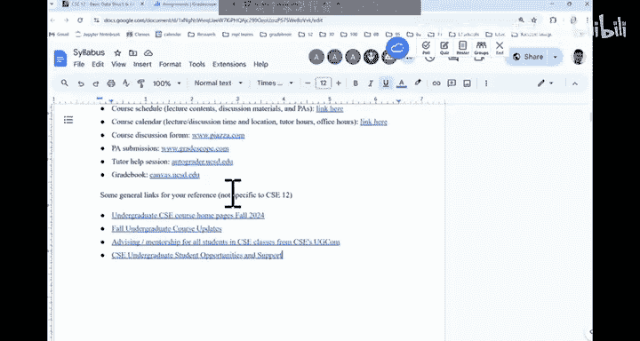
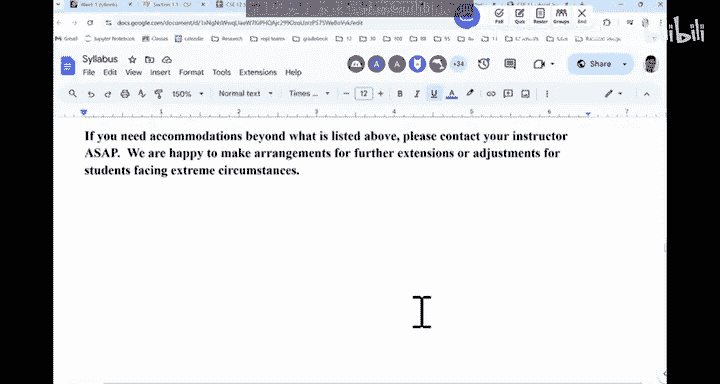

# UCSD《基础数据结构和面向对象设计（Java）｜CSE 12 - Basic Data Struct & OO Design Fall 2024》中英 - P1：CSE 12 - Basic Data Struct & OO Design - LE -A00- - Lecture 1.zh_en - GPT中英字幕课程资源 - BV1zJQHYcE8g

All right， so。Good morning。Is it too long？Can people in the back hear me okay or no， it's okay？

Thank you。 So Good morning。 Good morning。 This is C I C 12。 C C 12。 We do have a handout for today。

 Okay， so if you just come in， I will just。😊，Pass something in the back。

 and then you you pass this way and then just circle around。 there。

 There should be enough handouts for everyone in here。You got did off you got the hand out。

Some of you didn't， okay。So。Pass it around， please。If you didn't have one。Here we go。

 just grab some and then passse， thank you。Aly。So。Let's get started here。I'm sorry for for the delay。

 my other class finishes at 8，50 at。So it all， so。Walk over with a few questions from students。

 So we are a little delayed late。 is， it's possible that I may be a couple minutes late in the future。

 so。And I'm glad you all found this room。It took me。A good walk in this building to find here。

 I've never taught in here。 This is my first time。Teaching at Mananderwell Basement。

And I'll be here 10 years。 So it' the。Is the first time I see it。So good job locating this room。Now。

So this is C S C12。Normally what I do is I use notes。

 which is like a document that will annotate during class。

 Okay every week I would print out a hard copy。 And for example， this note that we have today。

 it is it covers today as well as week 1。 So we call this week 0。 this week 0。

 and the next week is week 1。 So all the materials we're gonna cover in this note。

 and it is also available on canvas。 So you can go there if you prefer annotated electronically。

 either is fine。So the plan for today is we'll get started with the basics。

 the logistic and what the expectations are for this class。

 okay and we'll introduce ourselves a little bit。So。Let me introduce myself。 My name is Paul Chao。

 Okay， so my。This is my 10th year at UCD。 I came here in 2014。 So it's been a while。

 and I started to teach CSD 12。I think right before the pandemic。 So I've been covering C C 12 for。

Almost every quarter。 I lose track of how many versions of CS5 I've taught。

 but this is like one of the primary classes that I cover in the department。

 I also teach other lower division classes， like88，11，30，195，29。

 So all those classes I cover periodically， but data structure class is the primary class that I I teach in here。

 So for this quarter， we have two sections of CC 12。 This section is at 9。

 The other section is at 10。 Okay， so。You are free to go to either section。

 we sometimes say you are now supposed to go to the other section because the room is not big enough。

 but it looks like we have some space in here。 So if you if you say just for a day that I can't come to the nine o'clock can I go to 10 o'clock you can so there's no penalty for that and my office is in CIC building。

 which is called EBU 3B。That's the CIC building。 There is an the EBO stands for engineering building。

 So engineering building， and CIC building was the third building was that was built。

So the first building was the ECE building that they built up。

 and then the second building was the mechanicalchan engineering building。

The bioengineering building is CIC8 and is EBU 3A and the CC building is EBU 3B。

 so those are the two buildings that built together some like very engineering like names right so but that's the CC building is 2102 I'm on the second floor if you see a lot of pictures outside the wall that's my office so。

For， for this quarter， what I plan to do is I plan to hold my office hours in the conference room is on Tuesdays from。

 I think it's in the syllabus on canvas。 but my office hours is Tuesdays10 to 12 in in C I C。

In the conference room，32，17。Okay， so， and this information is available on the， the syllabus。

 Google Doc， too， so。The idea is if you have any questions about anything of CSE 12 and sometimes students just want to chat okay。

 just go there and have a discussion about what computer sciences or research opportunities。

 What should I do to get an internship。 People sometimes just show up and。And just have a chat。

 That's also fine。 Okay， so those are the the office hours every week。😊，嗯。You can go to my website。

 What I usually do is in addition to teaching law division classes。 I do some C S education research。

 and my interest is in K to 12 education。 Like how do we teach younger kids。

 I think that's a very important area， because computing is becoming so important。

 So how do we teach younger kids It's a totally different animal when you teach younger kids。

For example， they don't know how to type。RightHow do you teach them that they don't know their password to the computer。

 So there are many logistical things that we do not see when we teach college kids。

 but for younger kids to taught students， there are many obstacles that in general。

 people have to consider that's my research interest。

 So if you are interested in that feel free to go to the office hours and have a chat。嗯。

The a few important websites that I want to discuss。 So the the plan is， we'll talk about the。The。

 the syllabus， the logistics， and then we'll introduce each other a little bit。 In fact， why， why。

 why don't we do that right now？ So I introduce myself， Can you turn around。

 just talk to your neighbor a little bit， introduceuce yourself which year you are， what a major is。

 Why you're taking C C 12。 Just talk to each other。 Get to know someone in the class， It's important。

 It's important。Let's get started。All right。Yeah。Okay， so。Let's。That。All right， so for。For today。

 right for today， is this important you know someone in the class because you can remind each other。

 hey， the P is due tomorrow， right， did you do it， Well， you probably should remind them earlier。

 is due tomorrow。 there is a midter。 Do you want to collaborate and prepare for the midterm work like let's。

 let's create some sort of collaborative questions。 I， I will create some questions for you。

 You create some question for me， we'll test each other。 if we really understand it。

 those are very important things。 So get to know someone in the class， right。Now。

For the logistics of this class， number one， canvas website。

 whether you are waitlisted or whether you are enrolled， you are part of the canvas site。

 If you are just enrolled today， what's gonna happen， is's gonna be tomorrow， You。

 you're gonna be enrolled automatically onto canvas。 as an instructor， I， I don't know。

 Something must have happened。 Some instructor must have done something。

That all the privilege of an instructor can do on canvas is it doesn't exist anymore。 In other words。

 I can't enroll anyone onto canvas manually as a student， I cannot say。

 can I enroll this student into the class， He or she was very good， Can I enroll him or her say no。

 you don't have any say on any enrollment decisions。

 So that's the case not for me for every instructor。 So if you say I'm wait list for this class。

 I don't know。 I there wait list for this class。Anyone on the wait list。Then there is no wait list。

 Then there is no wait list。 Allright， that's the wait。With these people didn't show up。

 But the idea is if there's no way this， that's perfect。

So you will be enrolled automatically into all the websites that we use。Within 2 hours。

 within 2 hours of your enrollment into CSC 12。 So canvasva site is the website we use。

 you can use it as a grid book。 you can see all your agrees in there。

 and this is where I will post all the course materials。 So this is canvasva site gridcope。

 I suspect most of you have used gridcope at certain points。

 is a repository that you can upload your assignment code to and it will be autograded in there。

 Okay everyone who are on canvas should have been enrolled on gridcope automatically Piazza is our discussion forum。

 and autograder auto gridr doD do E。 this website is the website that you can seek help from the tutors。

 and later this quarter what I plan to do is I will ask some of tutors to host individual problem sections。

 like is totally optional。 like they will have a worksheet。

And they will just talk about the solutions to the exercises in the worksheet。

 and we will allow folks to sign up if you want to be part of those problem solving sections。

 but that's for later in the quarter。Our textbook is Zybooks。 so Zbook is our textbook。

 and you should do the reading over there okay。The course syllabus is in here。

 The course schedule in there。 so you can definitely go there。 This is the syllabus。

It has pretty much the same information， like these websites。There are some specific links for。

C I C class policy。 Okay， so they are not just for C S C 12。 So， for example。

 what classes will be offered this quarter how enrollment would happen。

Like， this is an update they may have。 if they're adding any section or if they reduce a section。

 if you need help， talk to advising and also。Undergradate support for CC undergras。

 So those other resources that you can use， there is one thing that is， I do want to bring up。

 I think most of you should know it。 The CC department does not allow makeup work for late enrollment。

I don't think is， is， it's going to be applicable to folks in here。 But if you enroll in the class。

 not just for CS 12 for any CE classes in the future。 right if you say I just enrolled in this class。

At the end of week 2。Can make up to work in week 1 and week 2。 The answer is no， you can't。

 So if you wait list any C IC class， make sure you do the work。As if you are already enrolled。

That's kind of the policy from the department。So since we don't have a wait list per se in here。

 So it doesn't matter。嗯。Any questions。And during the class， please feel free to ask questions。

 In fact， I like these chairs better than the fixed chairs。 So at least you can move around。

 you can form any group right as you want to。 So that's good。 And during the class。

 if you have any question， I really appreciate that you ask， because if you ask。

 at least 10 other people would have the same question。😊。

So you are doing everyone in favor by asking questions。 There are no silly questions。 Okay。

 so all questions are welcome。 Allright， so as， as we talk about the logistics today。

 make sure that if any part confuse you， just， just ask， okay。嗯。

So the prerog for CSE 12 is CSE 11 or A。How many of you have taken A B？Some of us took A B， right。

 So A B is pretty much the same as 11 now。 right， So one was teaching A B before。

 A B used to be like more extensive than 11 because people learn Java in 8 A， and then they take A B。

 So they have two quarters of learning Java。 But now 8 A is about Python。

 So A B is pretty much being taught as 11。 So theres no difference between A B and 11 anymore。

 The basic ideas， you know how to write code in Java。 You understand object areient programming。

That's the most important thing。 We may have transfer students who are taking this class to say。

 I didn't take job。 I took C plus plus。That's also fine。

 You just have to adjust to the syntax of Java， quickly。

And if you' are good at C plus plus adjusting the Java shouldn't be too bad。 Okay。

 So that's the expectation。Important information。 Okay， important information。Let me bring my。嗯。

Laer pointer。 Now in here， first thing， all the homework are due on the midnight of the due date。

 Okay， so if you。那行， where is my。La a pointer。the last mandate they one。嗯。Nonetheless， okay。

 so in here， what we have is make sure you turn in the assignment before the11 59 deadline on the due date。

Our， our Ps are due by Thursday night， Thursday night。 So 1159 on Thursday night。

 even if you are late just for one minute， that's late。 Okay， so I've seen people say。

 I try to submit at 1158。And the network failed。And then。Im my submission was like 12 or1。

 Can you give me a break。 Can me a me break。 My answer will be， don't do it， right， don't do it。

 Do not put your work on the line at that late of the submission time。

 So try to finish as early as possible。 Okay， you can submit as many times as you want to on graycope。

 And in the beginning， you will see all the feedback。For for later in the quarter。

 you're gonna have to write more tests by yourself and verify your code。 But in the beginning。

 we will test your code very thoroughly and we will give you feedback right away。

 So you know whether your code is failing or whether your code is getting 100% or not。

 So youll get those feedback right away。 Do not wait until the last minute to summit。

 We have 300 students in C C 12 this quarter。 And there are many students they jump through odd hoops to do their work on time。

 you won't believe how many obstacles that a student may have encountered。

 Like I've seen a lot of very touching stories about how student work。

Work so hard to get the work done。 So we cannot give breaks to folks who are just saying I'm trying to submit late on the due date。

 Don't sum late on the due date。 summit。 I I say 11 is probably the latest you should do。 Okay。

 give yourself some wiggle room。 But if there's any。Emergency， something happened。

 Please contact me as early as possible。 Okay， for example。

 you say a lot of my friends are getting sick。 I'm in the dorm。 I'm cough。 I'm' in fever。

 Email me right away。 sayy， Paul， can I have a maybe a day of extension on the assignment。

 I will be happy to do that， You probably don't have to provide any documentation。

 If you email me early。 But if you email me Thursday night，1130， Paul， I'm sick。

I need some documentation to justify。 Okay， it just is， that's what it is。

 So communication is very important。 think my computer went to sleep a little bit in there。

。We， we do trust our students， but please communications。 Communations is very important， okay。

We do have reading assignments for on a weekly basis。

 The reading assignment is still on Friday night。 The reading is done on Zy bookss。

 So I'll show you how to do the reading assignment on Zy bookss。 But the idea is。

 for the weekly reading in that week。 You have the whole week to finish it。 like， for example。

 for week one， for week one。The week ones reading is due by Friday of week1。

F the week when you have the whole five days to finish the reading for that week。Okay。

 if you are late for the reading， there is a 10% per day penalty after the deadline。So ultimately。

 T books would。Do the penalty for you。 So that's what it is。 When you upload your code。

 please make sure that you check。That you have uploaded the right code， right， So how do I know that。

 How do I know Ive uploaded the right code， Obviously， I didn't want to upload the wrong code。

 The best way to verify you have uploaded the right code is look at the response from gray scope。

 Sometimes you upload empty file in there。 they just I drag it。 And I just left。 That's wrong。

 That's wrong。 Okay， so you should upload your code on gray scopepe。

 Wait for the response from the auto grader。That's what you should do。

 And that's the best way to verify if you have uploaded the right code， okay。

When you upload the code， the latest submission is the one that counts。

You can submit as many times as you want to。Feel free to walk over there。 It's fine。

When you upload your code， you can upload as many times as you want to。 Each of them will be graded。

 Each of them will be graded。So the latest one will be the one that will be the the grade for your。

For for your PA， for that PA。If by any chance， like your early submission， you say， Paul。

 my early submission， this thing got 89。 and my latest submission， for some reason， I。

 I was trying to comment my code， but mess up。 so it getting a0， which shouldn't happen。

 if I look at the response。 But if that's a situation， we can switch to an early submission。

 we can do that without any penalty。But in general， we cannot accommodate people there。

 This is the only submission I have。 and it doesn't come。 unfortunately。

 that means it's a0 for that assignment。 Okay， so that's for homework submission。

If you have questions about the P or about the class content， the best way to ask is on Piazza。

Normally the staff should be able to answer piazza questions within an hour also that's in general。

 the case。 also you have twotor hours available。 So Ill show you how to go through the two hours and also my office hours available。

 T A have their office hours available。 We expect to have more than 40 hours a week。

For twotor hours and T A and office hours。 So hopefully that's enough。Now。

 I I'm also a firm believer of second chance for lower divisions。 In other words， if I say I。

 I made a mistake， there should be some means for you to make it up right。

 for upper divisions maybe not because you should have been a mature computer science student and you should know how to check for those silly mistakes。

 but at this stage， you may make silly mistakes， right， So if you make silly mistakes。

 the are second chances in general available。Sorry。

I think this thing keeps sleeping， if I。总司法决定There we go。Cl。So for second chances。

The the way that we have second transfer， the assignment goes like this。

If you turn in the assignment， you say， I got 80% for this assignment， right。But I， I think I。

 I know where my code was now working。 So I want to improve it。

 You have a whole week after the P is still to resummit to resummit to the al。 So if P A。

 for example， if P 2 is still tomorrow。And then its okay， once P， P2 is due tomorrow。

 you look at your grade。 and then from tomorrow until。Next Saturday。

 then what's gonna happen you have this window to resummit P 2。

And whatever you got on the resubmission would only help you。In other words。

 if you got 80% in the original submission， resubmission got 100%。

 the average of them will be your overall P2 grade。 Okay， so you can improve it。

 So if you say I I didn't work well on P 2， I got 0， but my resubmission I got 100%。

 then on average50% is a P 2 grade。There's a question。そこ定。エンタスす。Maybe available。Alright。

 so for the hidden test cases， for the resubmission， right， Are we gonna be able to see it。 Yes。

 I think we'll release it。 So you， you get a sense of like what am I failing， right。

 that that's important So what make it available。 The other thing is the resubmission won't hurt you。

 If your original submission is 80%， your resubmission is 50%， then your grade still gonna be 80%。

In the beginning， Okay， that's for your assignment。 for your assignment， this is the second chance。

For the quizzes that we do in this class。And where's the quiz。Let's see。So for this class。

 we have our quizzes during discussion sessions。 Our discussions are Tuesdays in the evening。

 Its in London Auditorium。 Okay， so this week， we don't have discussion week once discussion is to help folks set up the coding environment。

 We're gonna set up V S code with Java and also J unit。

 that's where you're gonna write your unit test。 so these are the things。

And will do in discussion in week 1， starting from week 2， you're gonna see quizzes。

 So the way the quizzes work for this class is。If this is a discussion。

 the T A would come in and we have two Ts， K C and Brandon。They， they were undergraduates here。

 now they are masters students。 So they they have tutored and T8 for C S C 12 for years。

 So they come in， Theyll bring a quiz and then we hand out to the quiz。

 You have about 25 minutes to finish the quiz。 Then they would collect the quiz。

 and they will talk about the answer of the quiz right away。In other words。

 there are five persons in there， and you do the quiz， and then they will explain it right away。

 We found this to be very useful because immediate feedback to what you just practice is very useful。

 So that's what we do in the quizzes。 okay， when you come to the quiz。

 you should come to the section that you are registered in。

 If you register for the 5 o'clock section， then you go to the 5 quiz。 And similarly。

 if you register for 6。 you go to the 6 PM discussion。 okay。😊，Now。

 the second chance for quizzes is the following。 We do quiz 1 in week in week 2。

 And there is a second chance redo quiz 1 redo。 In other words， I didn't get full credit for quiz1。

 I'll do it again in quiz in the next week's discussion。 So this redo is optional。

 If you already got 10%。 I don't want to do it。 you can skip that discussion。

 But if you want to improve your grade。 I you just I'm just go there and practice。 That's fine。

 You go there and you do the quiz。 The coverage of this redo quiz is gonna be exactly the same as that quiz。

😊，So it won't have new material。 It's basically a similar quiz， similar questions。

 but maybe change it slightly。 Okay， so that's your second chance。

The higher of these two will be a quiz score。 The higher of those is not the average is the higher of those two。

 Okay， so the re won't hurt you。 We do this for every quiz， quiz 1， quiz 2 and quiz 3。

We have a midterm in week 5。 So the midterm will be in person in here。Okay， in the meantimeter。

 we will have coding questions and multiple choice questions， okay so。嗯。The midterm。

 we we do it like a regular midterm。 The second chance for the midterm would happen in the final exam。

 So our final exam is some， sometime in week 11， Saturday of week 10， Saturday， week 10， right。

 So this is the time， when you get the the final exam paper， you gonna realize。

There are two parts in that final exam paper， Part 1， part 2。

 Part 1 has the exact same coverage as the meter。So it has the same number points as the meterm。

We'll look at what you get from the final exam part one and your midter， which are higher。

 will be your midter score。That's your second chance to improve your medium term grade， yeah。

The exams are theyre all on paper in person in here。And other preference。Alright。

 so the part one of the final can be used to replace midter。

 but that part  one is also required for the final。 So you can't say， oh， I got 100% on midter。

 Can they just give part one of the final。 You shouldn't。

 because that's part of your final exam grade。 unless you want to lose it， which I don't recommend。

 So you should do both part one， part 2。That's the second chance for the meter。For the PAs。

 have we have the resubmission right， for the Zi books reading。

 you have 10% penalty per day after that。So there， there is like some second chance built in for almost every assessment。

 The only thing we don't have is the final exam。 There is no second chance for the final exam。

It's just because the turnaround time in general is very tight。

 We don't have any building in making them for that。嗯。

Any questions about like the general way that you gonna be evaluated in here。All right， now。We。

 we kind of have all these materials listed in here。 Okay， let me。

Let me talk about what you will learn in this class。 what you will learn in this class， right。

So this class is the next class after CS S 11。 And what we focus on is a little bit more about efficiency。

 Okay， so when you， when you take C S 11 or A B or when youre in A P classes in high school。

 that here is a problem。 solve it。People in general， say， is the answer right or wrong。

 the answer right。 If answer is right， then you get it right。 If answer is wrong， then it's wrong。

 right， as easy as that。 But if you think about computing， if we think about autonomous vehicles。

 right， some of us may drive a Tesla。 as you can see。

 Tesla is constantly detecting things around you。 If you see a bicycle。

 there is a person riding on the bike。Right， you want to avoid that person。

 but there is a speed factor。 you have to consider， right。

 if it my autonomous vehicle can detect a bicycle in 0 do 0，5 seconds。 That's perfect。

 Or you say my autonomous vehicle can detect a biker in about two minutes。😊，That's not good。Right。

 so when you write codes in here， there are certain constraints。

 Not only can you recognize that bicycle， you should also say。With what time constraint。

And C S C 12 is the starting point for you to start to think in that way。 Okay。

 so this is more about the efficiency of how you handle data。

 right that' hence it's called the data structure。So in this class。

 we're going to learn quite a few data structures and they are used under different scenarios。

And you should be able to pick the right data structure for the right application。

 So the data structures that we're gonna learn in the beginning， we're gonna talk about Java。

 So a little bit more about Java。 right This is more like what we do in week 1。

So in in the first week， we'll talk about the foundation of Java， more like a review。 warm up。

 So everyone is。Up and ready to run。 Then we'll get started with。Data structures， for example。

 like we're going to talk about arrays。We gonna talk about lists。

 We're to talk about stack and queuees。 We're going to talk about hash tables。

 Were to talk about stack and queuees。 We'll talk about trees。

 We talk about binary search trees and sector。 So those are all the concepts will cover。

 And the assignment of this class。 It's gonna be for you to implement your own version of those data structures。

Okay， so you're gonna write those codes。 And， in fact， I was talking to a lot of students about。

For C C 12， should we bring in more applications of those data structures。

Instead of asking our student to implement it。 and I ask them after they've taken the class。

 not before， not during。And those students is， I mean， they vary a lot。

 There are beginners like this C S 12 is the first time I attached data structures。

 There are also students who are world finalists of comparative coding。SoAs of them， like。

 how do you feel about the assignments， And believe it or not。

 there is a big range of coding skill levels in this classroom。But。The， the story end up being。

 let's implement the data structure ourselves， because I can guarantee you。

 this is the only time you're gonna do it for the rest of your computing career。

SoYou are never gonna say， let me implement my own queue。 Let me implement my own stack。

 Let me implement my own tree。 This is the only time you do it。 And I。

 I don't think I should deprive you of that opportunity to do it in here。 So based on the feedback。

 We are using this approach。 So you're gonna pretty much implement。 we， we learn about。

 you implement your own array。 We learn about queue， you implement your own queue。

 So that's what the P is about。 And the feedback has been very good。 Okay。

 so but if you have different ideas， please do let me know。So those are the things。

 another important concept that we learn。 number one is runtime analysis。

 So basically how fast certain operations are and also will learn about sorting。

 Soting is just something we add on near the end of the quarter。

 It doesn't have too much to do with data structures， but it's something you should know。

 nonetheless。嗯。A few things。 Zi books， right， This is our ebook。 When you try to do the assignment。

 you should go to Cans， right， You should go to。 let me。Vi as a student。

There's one one thing I do want to bring up。 Number one， please do not use canvas to email us。For。

 for some reason， I have no idea why。 but whatever you email us， we never get it。

 We never get it in our email。 So， and people rarely check the messages on canvas。

 If you need to talk to us， email us。 should email to me or use Pazza。 Okay。

 do not use canvas to email the staff in C C2， We don't get it。 We don't get it， okay。嗯。For。

 for reading， right， for reading。 If I'm ready to do the reading， what you do is you click on。

At least in in week 1 and also for future reading， you。

 you look at this is what will cover in week 1。 and then you click on that button。

It's just because my preview as a student， it doesn't work。 Let me get out from there。

So you will be redirected to Zibooks， and this is where you sign up。

 You shouldn't sign up directly on Zibooks。Right， said what you've already signed up on Z bookss。

 I didn't do this。 Then all you need to do is to email support at Z books dot com。

 and they will link you there。 Okay， so this is the best way。 And for future readings。

 this is what you should do。 because once you say， I finish the reading， I'm doing the exercise。

Incorrect。That's good。 So no， this is correct。 And I I finish everything。 once you click on there。

 there should be some sort of summit button somewhere in here on your interface。

 I don't see it in here。 but there should be some sort of sumit button。 Once the submitm。

 your grade would automatically port back to canvas。 so you can see your grade right away in there。

 Okay， If you say， I'll just go to Z books and do the reading Ti book doesn't port directly to canvas。

😊，So when you do reading， go from canvas link to Thabooks。 I'm sorry for this runaround。 but that's。

 that's the way Tibooks L T I works。 Okay， yeah。That's great。I think it's gonna show。

 It's gonna show you whether your choice is right or wrong。 right， So not only it shows for me。

 but it should show for YouTube。And the like the， the reading is mostly based on efforts。

So if you tried it， you should be。And the other questions。All right。So that's reading。Next thing。

Of course， staff， you know me， there are two Ts， right， They have put their hours on auto grader。

Let me go there。So for C C 12， this is kind of what we have。

 So once of us should have been enrolled in this site。 if you， if you are not there。

 us on Piazza will add you。 Okay， this is where you can seek help。 Theres no two are today。

 but I think coming Thursday。We should have coming Wednesday。 We have two hours。And by default。

 our tutors would specify in person and also like， they are gonna be in the C I C basement。

You can go there and ask for help from them。嗯。So with this。That's what we have in here。

Brenan and Casey， they would put in their office hours in here， too。Any questions？This P 2，30。

 will see， if， if that room is occupied， then the tutors will be outside maybe in other rooms。

 Just when you submit the ticket just say where you are and they will find it。So find。

The course components， lectures， right， so when you have when you come to class。

 make sure you get a clicker， this is the clicker that you have a use clicker is totally fine。

 you have to register your clicker at icler dot com you find CSE12 and do it Okay if you say I have a friend。

She has a clicker。 Can I share the same clicker soon as your friend is not in C S C 12 this quarter。

 you can share the same clicker。It's going to be fine， right。Reading assignments， we talk about it。

 exam， quiz， P A。Discussion， we talk about it。Greeting policy， greeting policy。Okay。So number one。

 reading assignments， we drop one week。Of reading assignment。

 So if you forgot to do a reading assignment for one week。

 then that one will be dropped automatically for you。 And reading is 10% they all grade。 Okay。

 participation，5%， and we'll start to count participation in week 3。So first weeks。

 there's no participation score。 And after the first two weeks， from week 3 to week 10。

 we also drop three participation。 In other words， we drop 3 weeks of participation for everyone in here。

 so make sure you try to come to the class on time。 Okay quizzes all three quizzes together，10%。

 Meterm 10% P is 40%。 And then the final is 25%。That's the great breakdown。Are the lectures recorded。

 Yes， I think they are recorded on this website。Podcast。Dot uSD dot E， D U。I think。So。CSE 12。It's。

 it's not there yet。 It will， it will show up。 It will show up in there。Cs 11 is there us。

That's where you're going to see all the video recordings。Any other questions？

So the class is podcasted。 I do see that recording over there。 So it should work。All right。

 a few more things。Number one， so the two hard cut offs that everyone must pass， must pass。 right。

 Number one is your overall P score should be 55% and above。And also。

 your final exam score should be over should be 55% and above。 Those are two hard cutoffs。

So make sure you， you pass that。 Okay， for the assignments and quizzes。

 if we release the quiz and you have three days to say， I， I think this problem is ambiguous。

 I think this problem is wrong。 The rubik is wrong。 You report that to us within three days， please。

 And then we well go ahead and fix it， okay。Because most of the programming assignments are auto graded。

And we have so many people looking at that grading script。 It is gonna be very rare for you to see。

 okay， this this problem is created wrong for the programming exam。 It's gonna be very rare。

 But if it happens， report it to us。 Well take care of it。 for the last assignment and the last exam。

 the final exam， There is just one day of re period。 In other words。

 normally I release the the mid term。 sorry， the final exam。On day 1， and I'll give you 24 hours。

 say within these 24 hours， please look at your finding exam and report anything that you want to re。

And after one day， everything is set in stone for the final exam。That's one thing。

I think I've talked about all the other part。Right accommodationcomations。

 if you need accommodations， please let me know as early as possible okay。

Now， academic integrity， This is important。 This is important， right， What is allowed。

 What is not allowed。You are allowed to use Is。 Youre allowed to use like， for example。

 if you use V S code， theres autocomp， right， So if you write a for loop。

 sometimestime will highlight this thing， say do you want to import this class or that class for the basic tools you can。

 but you are not allowed to use co pilot or G like codes that you can generate。 So in other words。

 you shouldn't use anything that would generate code for you。 Okay， and you say why。

Because you that people in the industry may use it。 And I， in fact。

 talk to people in the industry whenever I got the chance， because a lot of my tutors。

 they go to Internet， They go to Internet at different companies and they invite my group to go there and talk to them。

Always awesome。 Do you guys use。Co pilot as you write your， your， your code。

 Almost the answer is we rarely use it unless it's a very specific situation because they don't trust it。

Don't trust it。 It's just whatever co pilot would generate may not be number one。

 They may not be correct。 Number two， they may may not be efficient。So those are the two things。

 That's why software engineers don't naturally trust that。 So as a beginner。

 you shouldn't rely on those code generator code generators to finish your assignment， okay。嗯。

So another thing about academic integrity is we are not supposed to collaborate on the assignment。

 When we have assignment， everything is done individually。 Okay， everything is done individually。

 You work on the assignment yourself。 You develop your own tester by yourself。Okay。

 you do not share your tester。Because learning how to test your code is the learning outcome of this class。

We are not gonna be paranoid to say， oh my God。 I'm gonna catch everyone whose code look similar。 No。

 because I understand going through the academic integrity report process is gonna be a very painful process for our students。

Right， you're reported， you don't get the grade at the end of the quarter。

 and dancing thing may take three months to finish。 You can't enroll in the next class。

That's a very serious thing。 right， I do not want anyone to go through that process unless we are nearly 100% sure。

 that's something has happened。 The way that we detect academic integrity violation is we have one T A leading three tutors。

 Their job is， is to run scripts to compare similarity。Okay， and they will also run Co pilot。

 chatGBT to generate code and look at the similarity。And。All four of them have to agree。

 These students， their cause are beyond reasonable doubt。

 And then I go in and I look at what they find out。

 and I pick out the things that I disagree with them。

 So five people have to agree on a case before we reported。Okay， so if in the end。

 you are being reported， that means all five of us agree that this is a strong case。 Okay。

 the penalty for lower division academic integrity violation is you get 0 for that assessment。

We rarely see people cheating in the final in the midter。

 in the quiz because it's in person on paper。 But for people who cheated on the assignments。

 you may fail the class because of the 55% cut off。

 I've seen people who cheated 7 out of 8 assignments。Unfortunately， that's the case。

 So the student is supposed to get a plus。And the student fail the class。 So please。

 if you value your friendship with your， with someone， don't help them with the assignment。 Okay。

 I can guarantee you you two are not gonna be friends after the case is reported。

If you value that friendship， don't do it。 Don't do it， okay。There are many ways you can get help。

 there are many ways you can get help。It's not worth it。嗯。Before you all go，m sorry。

 we are a little bit rushed today。 I do want to bring up two things。 and then you are good to go。

 okay。嗯。Ill talk about diversity next week， but I'll talk about this thing。

 If you have any student disability， right， you need accommodations。

If you have the paperwork done already perfect。 If you say there there is a long backlog in the O SD office。

 just email me。 I trust you。 Okay， I've never seen a O SD student abuse that。

 So if you say I need extra time on the assignment。 This is whatever get from the O SD。

 just email me and we can accommodate you from day one。 You， I don't have to wait for that paper。

 Okay。And that's it。We will see you on Monday again。 Okay， All right， Thank you。

2 class last in winter。Okay， now I was wondering how would you look for like。You took it in winter。嗯。

Let's say the way that is going to work is。Number one， I may not。

