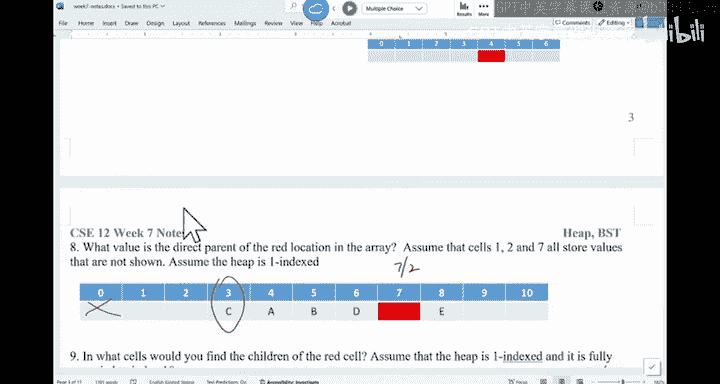

# UCSD《基础数据结构和面向对象设计（Java）｜CSE 12 - Basic Data Struct & OO Design Fall 2024》中英 - P20：CSE 12 - Basic Data Struct & OO Design - LE -A00- - Lecture 21.zh_en - GPT中英字幕课程资源 - BV1zJQHYcE8g

Pice is recorded。Good morning。 This is the end of week 7， right。嗯。Like， like what we said。

 we talk about heaps， right。 And after today， we， we should be able to finish he today。

 And then the coming P A is about he。嗯。And then we'll talk about trees。 Okay。

 we're gonna go all in on trees。Because it， it's one of those things that you have to master。

 it will appear throughout your computing career。 no matter whether you are C S major， C。

 S major data science， biomatics， E， whatever your major is。

 Youre gonna see treess everywhere inside your programs inside your algorithms。

 So it's something that we have to be very， very， very comfortable with， okay。That's。

 that's kind of the plan。 Maybe we can even guess our retreat today that we see。All it goes。

The idea of a hip is we have a complete binary tree。

 and then the tree has the most extreme data on the route。

 It can be the smallest data can be the largest data depending on whether you look at mean hip or max hip。

We said because you can use an array to represent the， the complete binary tree。

 and you can just manipulate the array instead of having to rely on a tree structure。

1 if you ask the question， like， can I just use a node with the bunch references， you can。 You can。

 There's no problem with that。 The issue is， if you use that approach。

 your code will be more complicated。 That's about it。

It's not as probably as efficient as manipulating a rate。

 It's just because you may be a constant factor slower。Then when they be your rate。

Last time we talk about removal， which is D Q。 right。 So we said when you try to remove the。

Something from the particle。 you want to get rid of the root。 In other words。

 which is the first element in here。And the way we're gonna do it is we're gonna put the largest。

 sorry， No largest。 the the right most data， which is the right most leaf into the first spot and then trickle down。

 then let it go down to the right spot。 And we can do this because the second。

 if you look at me here。 The second smallest data is one of the two children of the root。

That's kind of how we can say you can always find the second smallest replace with this new data you put in。

 and you keep going down in here。This is the runtime of， like， this is the algorithm of trickle down。

Are there any questions。All right。No。Can I ask you to think about。

 Because if you think about trickle down， right。Yberatory。And you， you have。

 because this is a complete tree， so。Is， it's like a triangle like this。

 And I want to put this thing up on the top， right I， Ill say。This guy would go to the very top。

And then you let it fall down。To the right spot。The worst case is you' gonna fall all the way to the lowest level again。

 It's possible。Although very rarely， but it's possible。

 So the worst case is gonna be the height of this tree。At the height of this street。Is。

 is there any question about this， Like the worst case runtime of D Q is the height of this complete binary。

The question I have is， what's the height of this complete binary tree If you have N data industry。

 Okay， so can I ask you all to try to do a vote。A is。嗯。Is constant。Logan。N is the size of the。

 the he。I think I ask the I T S to replace the quicker base station。 Hopefully。

 it won't give us trouble anymore。You all have trouble connecting to it。 Are you connecting。

are you able to connect。And I don't I get any。Both in yet。嗯。我是。I。I think it's a network。

The network is probably very slow， in yeah。Can you all vote again， Try to vote again， sorry。

The ED U room， maybe be very slow。So you all can see the， you can， You can see you voted。

 but just not showing up。Im sure to see if I can use my hotpot。A lot of times。

Protect it is problematic。03F。Eteromic mobile hotspot。Sorry。To my mobilehapot。Forget about for now。

 forgot about for now。Let me try again。Can Ill try one last time if it doesn't work， Fort about it。

Can we all connect to the base。 Okay， now it's here。 I think it's the network is。うんううう。All right。

 sorry about that。Alright， so the answer in here， a lot of us said C。Loin。Why is a login。

 Can someone tell us， why， Why is the height of the three login。有。So from the root。

 you double this the size。 So the number of nodes you have is 1，2，4，8 and go on until the last level。

 so。Why， why does make me login，Where does it make me log and hide。Is there any justification。

That's the right of pre， right， So the demo nose doubles at every layer。

 But why does that give me a log and height。Was there someone。A small pool。Alright。

 so if you think about this complete tree， right， there， there are several ways you can justify this。

 How about we go through this route， using 1，2，4，8。If you think about it， one plus2。

So this is twoth power 0，2th power 1，2th power 2，2 power 3。

And the sum of all the nodes in this tree equals what。Equ goes to。嗯。Right。

 so if add up the nose of every layer， it equals n。And this is what kind of sequence is this。

 assuming the lowest layer has is full， assuming that that's kind of have more nodes in here。 So。

 in fact， if we think about you have five layers。 So this is one layer。2 layer。3 layer。呼勒尔。

And then theres one more layer in here， assuming this part is also full。Normally it's not full。So。

Pro 2 about 4， in fact， it's going to be。Biger than equal to n。Do you agree。So this is the。

 what kind of sequence to this， This is。Geometric sequence， so。

The summation equals 1-2 times 2 power 0，1-2 the power of。X。

 like whatever the number of terms you have， which is the number of layers is bigger equal to n。

And you do the math。Basically， you're going to find out this x is less than equal to log by to n of something。

Because you have a negative in there。Have have a negative sign over there。 So we got flip the sign。

And that's how you figure out， right， This x is how many terms you have。

 which equals how many layers you have。Does this make sense。U。

So you are looking at the height of this complete tree。Is always log。 So soon as your algorithm。

 the runtime is proportional to the height of the tree。 You' are looking at log efficiency。All right。

Are we good。Now， how do we insert something into a tree。So， I have this。Heep。And。

 when most of you had this array。I want to insert these three data into the array。

Try to do it on this array alone。 Do not rely on the tree， right。

 So how do I insert something into a heap。How do I insert something into a heap。

If we think about the he have two requirements， right， Why is the structure requirement。

 the other is the order requirement。You do not want to mess up the structure requirement because it。

 it's a little bit hard to maintain order you can always swap。To maintain the order。

 So how do I insert， Please try to insert three data points。Into this heap。 This is the mean heap。系。

I think all the handouts are gone。Can you try to insert， and then。Once you're done。

 you look at your neighbors Keep， you should be exactly the same。 It should be exactly the same。

Insert 16 first， and then insert 8。 Then insert 3。All right。How about we。We do this together in here。

So when you try to insert something， the ideas you will insert it as a leaf as a right mouse leaf。

At the lowest layer。 So you're gonna insert， for example， if I want to insert 16。

 that 16 should be inserted。As a left child of 14。And in the context of this array。

 you gonna insert at 16。 You， you do size plus， plus。16 is now at location 10。Right， let me。

 let me draw it down below。We insert in here， location 10。Now。

 I need to check for the violation of ordering。Basically， once you insert something， you may have to。

 you may have created a local conflict in here。 Right， So this node， compared with this parent。

 we may be in trouble。So I insert 16。 Who is the parent of 16。W is parent 16。 if you look at it。

DY by two。That one， so 101 by two， we've got location 5。 And this node is the parent of 16。

The parent is smarter than this node。 I'm good。不的。There's no need for me to maintain anything。

 There was no conflict。Right。That's 16。 And then we insert 8。It is at location 11。嗯。

I need to look at his parent， Who is a parent of 8。Still 8。哦。11 or 14。14， right， divided by 2。

 So 111 divided by 2 is 5。 So that's 14。 compareare this with this parent。 No big。 No。

 there is a conflict。 So 8 will be here。14 will be here。Am I done。No， right。

 you got to kind of keep pushing it up from 8。 look at as parent is this one。5 double 2 is 2。 So 6，8。

 that's good。 So we just do one swap。We have 5，6，10，7，8，11，21，27，18，1614。O。That's what we have。

The last thing is to insert 3。 as you can see， this one is gonna be bad because it's a very small value for a mean he。

We'll insert3。Who is the parent of three， We need to have the index。Otherwise。Hard for us to see，1，2。

4。So E five of three， the parent of three is。11。So， violation。The3 will be here，11 will be。

over there。Now， the parent of three is。10。So， that's not good。3 here。T here。The parent of。3 is5。Swap。

And we at the root， so。我 일단。You just swap with your parent if you， you are smarter than the parent。

And you can definitely use a recursion， right。Are there any questions。

So of us should end up with the same heap like this after we insert。都对的。O。So， the bubble up。

Runtime is if you are sitting at the index， if this value as the index shouldn't move anymore。

 you return。You like， how do I know if this value shouldn't move like you。

 you may how many this is like a base case， How many basic cases are there。A base case。So you， you。

 you， you basically stop recursion。How many base cases are there。What like。

 when do I determine you don't move anymore。My easy thing is， if you。

 there is no violation between this node and his parent。Any other situation。

 so you don't move anymore。If you added the root， right， So that's answer。

 So there are two situations。 If you are at to the root already， don't do it anymore。

 If you there is no violation between this node and this parent， don't do it anymore。

 Other than that， you swap with this parent。And then you recursse on his parent。Are we good。

So this is the， the problem for。Buubbble up。 So this is insert。So。There are a couple things I。

 I do want to talk about。 right， We know remove with big O logan。There's no problem with that。

 How about the insert。Remove means you， you， you put something on the top。 you let it drop。Insert is。

 you insert something at the bottom。 You try to bubble it up。What's the runtime。

 Is it gonna the worst case， Is it gonna be the same as login。有的。Alright， so it's also login。

I do want to talk about build the heap， because in this coming P A， you will build the he。So for。

 I'm might give you an array。 I say， here's an array。系。M C， do I have an example。 No， I don't。嗯。

I give you this array。 I say build the heap out of this。What would you do。

 Can you have a discussion with your neighbor， What would you do to make this， this array heap。

 right？ This is the array。 I just want to make a heap out of it。 You can create a auxiliary array to。

Okay， this is what I have。Like， how would you create a he out of this array。What would you do。

 You can use auxiliary array or you can just use this array by itself。Either is fine。What do you do。

Normally， you may say I I've served empty。Keep I keep insert certaining data in there。

 or is it already have a bunch of data just。Make a heap out of this data。What would you do in here。

 Can you have a discussion， please。What's your idea And what's the runtime of your idea。

Have a discussion。 Think about it。What would you do to build an array。Into a heap。

Don't draw the tree。 Okay， just use manipulate the array。嗯。All right。What， what are the proposals。

 folks， what， what can I do。To say。Make this thing a heap。 Me heap。对。Keeps swiping。

The first element with the last element。Oh， you just manipulate this array like that。The children。

So just keep verifying if a node is bigger than children。 if， if， if they are， you swap。啊。

Where do you start？You start from here。They start from here。啊，有。Okay。

 so you keep checking if it's smallerer than if there's a violation， right， Check a violation。

 if there is a vi swap。That's one way。 But I don't think you are starting at the right spot。 That's。

 that's a good idea。 but I don't think it's。At the right， you started at the right spot。What。

 what else。How we do， yeah。I can insert n times， right， So I will insert 7 first。It's good。

 And now with the inserter too， it's like I do an insertion。 I， Id call bubble up。He said， okay。

2 and 7 needs to be swapped。And then I insert one， one。 Look at its parent。No good。So it's 1，7。2。

 and I insert 16。16 compared with parent， good。And then insert of three。3 compares parent。

At the location  too， no good。And I insert 5，5， compared with this parent is 2。 That's good。

 I insert 20。20， compare with this parent 3。 That's good。I insert of four。4。

 compare with this parent is 4， so。4，16。And then at this spot， I still need to come with this parent。

 That's good。 So that's the he。I should end up if we just keep inserting。Calling third n times。

What's the runtime of this one， Suive insertion。What's a runtime。 Can I ask you to think about it。

Bgo n。Bgo unlock log n。And square。What would you say， What's a runtime。For successful insertion。

 I have this array， I call。Bubble up， N times。The worst case， T bound。What's your。

Estimate of the runtime。All right， so。A lot of us are seeing this choice。Be a logan。So it's like you。

 you， you try to build up this he。 The first layer takes zero operations。just by itself。

 How about the second layer。我是的。run time。is此 like。You shouldnt take one swap。

So that's like two swaps。How about the third layer。Eacher of them would take。2 swaps， potentially。

Right， so this is like four times 2。And how about the case layer。How many operations am I expecting。

For the case layer， if you think about it。This one is2 to 0。 This is two to  one times 1。

This is two to the power of2。Times 2。Right， so two hops。

 How about this one iss2 the power K times word。Times K， K layers， right。That's how it goes。

 So this is2 about 0 times 0。 You add them up， You add them up。

The worst case is approximately un login。So if you do， just do the math in here， because， you know。

 K is less than equal to loggan。K is less than equal to log And， and you can just replace that term。

 And you will see the it's basically so this thing。K sorry，2 to2 k times k。

This thing is less than equal to。This is case less than equal to log N。

 And this thing is about linear。This thing is about being。So it's analog log， roughly speaking。

That's how you can estimate。This is successive insertion。But people don't do this。 Normally。

 people don't do this kind of manipulation。 Number one。 first， before we talk about another approach。

 are there any questions about the runtime of successive insertion。Is unlock log。 Okay。

 People don't do this。 Number one is you need this new array。To help you。

Number two is the run time is n loggan， but， in fact， you can get to this runtime。

 You can get to a linear time。When you try to do the the other approach。So。Let me。

let me talk about another approach I put it in the back。 We're running out of spacing here。嗯。

The way to build the heap is called Hie P。If you already have an array， is say make this。Aray heap。

You do not。Have to do successful insertion because successful insertion worst case is analog loggan。

 If you do Hpify， the worst case runtime is gonna be linear time。Okay。They， name me。 try to。

What was the。The example I got。I can't remember all this data，7，2，1。13，3，5。爱懂没？IJust make it up。我头。

So if this is the data that you have， location 1，2，3，4，5，6，7，8，9。

 the way that you're gonna make this thing a he is you can imagine this thing is already a complete binary。

 if you lay out these nodes， you see 72，1。163。5，8。24， if you just lay it out like this。

 It's already a complete tree。 Our job is to do the following。

 Our job is to go through a bottom up approach。 make sure every small tree is a mean hipap。

In other words， you try to make this thing a mean heap。 We try to make this thing a mean heap。

 You'll try to make this whole thing a mean he， and they will make the whole thing a mean heap。

That's how you do it。 A lot of people say， I will go from the last node and okay。

 I want to make this single node A mean heap。 I mean， a node by itself is already a mean heap。

 So technically， for all the leaf node， you can skip them。 They do not have to be manipulated。

The total number of parents are in here， right， size the by two。 You have all these parents。

The first thing we want to make sure is。This thing is。This thing is mean keep。So you look at 16。

W is children， The children is。呃8th and night。There is a violation。 So what we do is swap 16 there。

For is now over here。 So technically， the way it's gonna to happen is。4 is here，16 is there。

We' try to make this thing a heap。 So the， the， the tree rooted at this spot is a mean heap。

That's what we want to do，Now， how about this part。This node 1。I need to look at this part。

Is this a mean heap？You look at。 these two children is。6 and 7。And the orders are good。

 So there's no need for me to do any swapping。Are there any questions。Now。

 the node rooted as 3 at node 2。If you， if you verify this。 So each two children is 4 and 3。

There is no violation。 I'm good。There's no violation。 I'm good。

And then the last one is this whole tree rooted at 7。The two children of7 is  one and 2。

 So these two things， I need to do a swap。1 is here， some is here。 So in other words。

 youll do a swap。You would keep is， it's like a trickle down。 right。 So 7。

 the two children is 5 and 8。 Once you reach the leaf level， you can stop。 But right now。

 you still have to verify5 and 8， there is a violation。So you're gonna swap。This five here。

I have7 there。That's it。This is the me heap we are looking for。So you go from the lowest parent。

 make sure。Is a mean heap is a mean heap。 And you keep pushing to the left。

Until you finish the entire structure。Are there any questions。

The run time of this Hp P process is big O N。 Okay， is' not big O n loggan。

 And this is the primary reason we are doing it in this way。 It saves this log n factor。

Logan factor is no big deal， but in practice， you are still looking at maybe four times。

 five times faster。It because depending on how big an is。嗯。Ps， for this part。有。Why is linear？

 So the idea is， like， why is this logan， If we think about。A node in here。 This is apparent， right。

 So the maximum number of operations I have to do。As to the lowest level is like one， right。

 So in here。And then。You have all these notes。That you would see at the same level。

 they are basically doing the same number of operations。 And then you move up， They would go down。

 right， So if you say there is a violation， then from the top。

 you have to trickle down the benefit of this one。Is in general。

 you do not have to go from the top all the way down to the leaf level。

 You would stop because things underneath is already fixed。The exact proof， let me。Try to see。The。

 the number of operations you have to。Mipulate the worst case scenario。Is。How many。

 because as you go down in here in general， the things underneath are done。 You have n over two。

 N over two parents in general， right， for those N over two parents。

 the height of those parent is from one。 and then after you have the。

 the layer is gonna increase two and 3。 I think the math is。The height of each parent。

So the summation of the worst cause is the height of those parent。Times the number of parents。

Which is on War2。So different parents have different heights。Where H I。So。

The height of the parent times the number of parents at a certain layer。The number of parents。

So this is the height of a parent times the number of parents at that layer。

 I goes from 0 to N over 2。If you， if you do the math， I remember this thing is。被告嗯。

How many parents do we have at a certain layer， if I think the height。I remember。

 So the height is this， the number of。Parents you have at a certain height is if I remember it correctly。

 its N D I by two to powerful of H。I remember。This thing。So H is the height of the parent。

 N do I by 2 to12 H is how many parents are at that level you do the sum。

 And this is simply n times the sum of H you I by 2 the power of H。This single approach。To a consent。

As you go， that's why it's linear。It's not an exact proof， but if you look it up。

 you should be following this idea。Any questions。So overall， the idea is in the P， right in the P A。

 please make sure you heify the array in one of the constructs， you say you are given the collection。

 you have to heify the the collection into a he， you should do this way because through successive insertion through Hpify。

 you may end up with two different hipaps。In other words。

 there are different configurations of hes with the same data。So if you don't use the H P5 process。

 although your hip is legitimate， but it will be wrong based on the autograder。Make sure you do this。

Are we good。All right。So that's he I array。 Okay so make sure you understand that。

And to build the he， you say the cost is。Linear， okay， it's not n log。 It's linear。All right。

 we are done with priority queuees。Other questions？All right。No。We're gonna look at trees。 Okay。

 like I said， trees are extremely， extremely important data structures。

 So once you come out from C S C 12， I would expect all of you to be an expert in trees。 You know。

 so you know everything about how to manipulate the tree。 You can't say。

 I have no idea how to manipulate trees after you learned C S C 12。 That's not good。Okay。So let。

 let's look at again， some review of the definition。We know what a tree is。

 A tree is a connected structure with no circles， a binary tree。

 each and node can almost two children。Complete binarynu tree is like a heap structure。Fu binary。

 each node would only have either zero children or two children。And this is a regular tree。Normally。

 you have like some sort of root structure。You have left child， right child。

 You may have these leaves， and the data in the nose are not necessarily ordered， per se。Okay。

 so you all should， you should also know like the height of the tree is how many hops from the root to the deep piece leaf。

 in here， you have three。Right， so the height is 3。Any questions。And what we'll do is， for example。

 the things we'll learn is I， I give you some data build the tree out of it。

Build the binary out of it。Or as here is a tree。 please print out all the data in this tree。

 find the maximum industry。 Find the minimum industry。

Find all the data that is between 3 and 5 in the tree。

 So those are the manipulations you have to know how to do。When you have a tree， unfortunately。

 if it is not complete tree。It is a little bit tricky for you to represent this tree， using an array。

You can， You can compress a tree into an array， but it's fairly complicated。

 So normally what we do is we'll have a node， and then we'll have left child， a right child。

 In other words， we're gonna use the linked structure in here。What you， if I this class keynote。

 what should be the type of left and right， Can you do a quick vote in here。

I think this is something similar like a link list。 If you know how to do a link list。

 you should know how to declare a type。If you look at it， most of us said C， T node， right。

 So just like。For a link list， you have node previous node next in here， you have a left child。

 You have a right child。 That's about it。Okay。Questions about keyn in here。Now。

 what should I not put into the keynote class of this class。What I shouldn't put in here。 So you're。

 you're sitting in a note。 What is not needed。What is not needed or what can't be achieved。

than you俾好听。There are many things you can ask about the tree， right， give you a note。 You say。

 how many descendants does it have。Was the largest descendant。

Was the top K descendant of a node in a tree。All of them are part of the。嚟。

Basic manipulations of a tree。Right， we have。We have a disagreement in in here。 In fact。

 can you have a quick chat。I'm Elizabeth surprised。 There are two votes that are very similar。

 Can you， can you talk to the neighbor what is not a a good thing。

 or at least based on the current setup， What's not something that is achievable。In here。You。

 have a chat with a neighbor。 what is that。Choice。Can I get my live child if I'm sitting a note。

Check my left child。You can。 Can I check my right out， You can。 Can I change my value。

A lot of you are saying because a lot of us saying C。

And if you look at it and some of a lot of us in D， like the value in here is like I。

 I'm sitting at a node。 I， I don't want this value to be 99。 Can I change it into 45。Why， why not？

 Can someone tell me why you have a concern。That we shouldn't probably change the value of a node。

Like if you think about linked list， you can change the value of a node if you want to。

 And here' is the same。 So you can get this value。 You can set this value。

 You can do anything you want to manipulate。嗯。Proublic get root as of now， it can't be achieved。

If I'm sitting here， how do I get to the route for， if I'm sitting at 99， how do I get to the route。

With the current setup。I come。Right， so if you want to get to the root， you must know your parent。

 So you should have a T note。Parent。That would allow you to go up。Without the parent pointer。

 you cannot go up in the tree。Any questions。So one thing that you can also calculate on a tree。Is。

 for example， the depth。Of a note。The depth of node is， how far away is it from the root。

 The depth of the root is 0。 The depth of these2 are 1。 The depth of these things are 2。

 The depth of this is 3。Okay， so you must be able to do something like this， too。嗯。

99% of the time when you deal with trees， you are using recursion。 You are using recursion。

 So hopefully after we deal with trees， your understanding of recursion will be way better。

Than before， O。I think we will stop here once we come back on。

 please bring the same note back for next week。 I'm gonna talk about what's the right way to think about。

Writing a piece code for a trick。 Okay， so we are done now。 and see you all on Monday。

