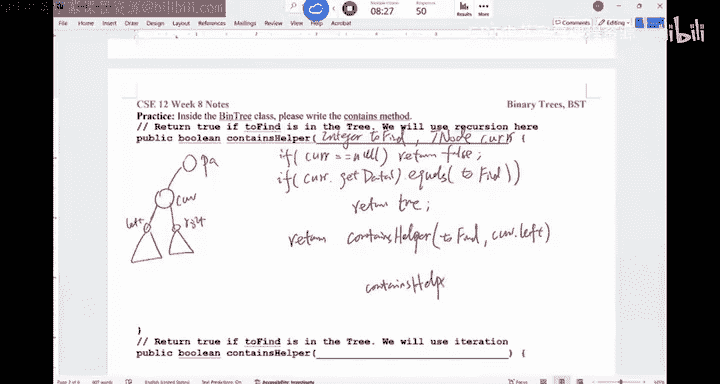
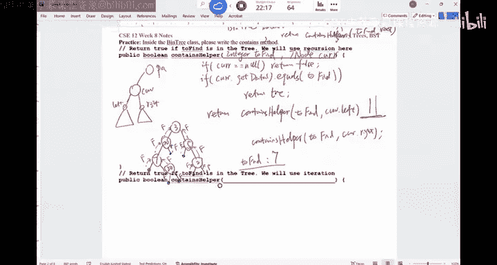
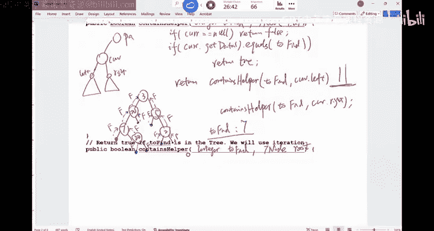
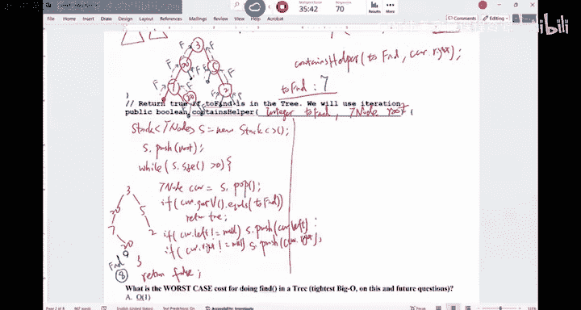
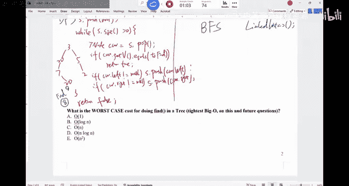
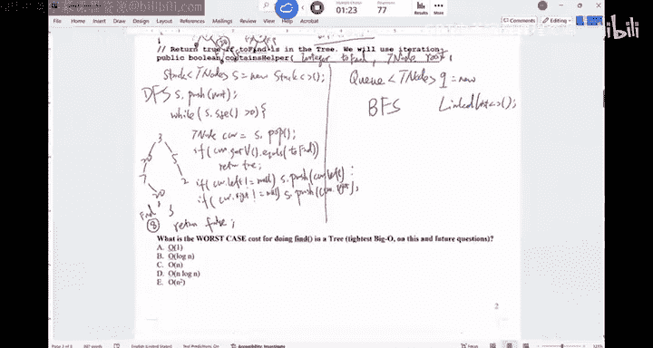
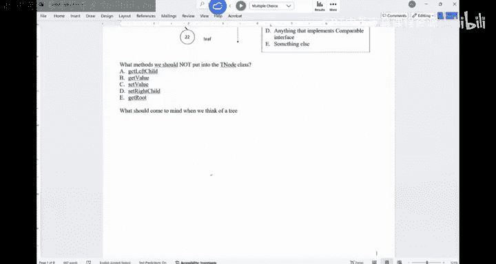

# UCSD《基础数据结构和面向对象设计（Java）｜CSE 12 - Basic Data Struct & OO Design Fall 2024》中英 - P21：CSE 12 - Basic Data Struct & OO Design - LE -A00- - Lecture 22.zh_en - GPT中英字幕课程资源 - BV1zJQHYcE8g

All right。Good morning。 Let's， let's get started here。嗯。Exe me。 So this is the beginning of week 8。

 right。 So we are wrapping up the class。 But one of the most important concepts is trees。

 And that's what， what we're gonna do。So if you look at trees， binary trees， complete trees。

 food trees， those are kind of all concepts we have learned before。 And the last time we also say。

 okay， given a tree， you are looking at the structure of life child， right child。

 and then keep it going。So we say a tree node may have a left reference， may have a right reference。

 may have a value， and potentially it may also have a parent。Right， so say it's a Tn。I a Tn。Parent。

Potentially， right， because if you need to manipulate the tree by going up， you do need a parent。嗯。

We say inside。 So if you think about the tree class。

 you may have an internal class called node has a bunch of methods， gather set。

 You may also do different things。 But a lot of times， you probably do not need to， for example。

 figure out how tall this， this node is and sector。 So in general。

 you are looking at a tree structure with the internal class called node。

And what we will do in C S C 12 is number one。 we're gonna learn the generic binary trees。

 In other words， all the operations you can do on a binary tree。

 And then we will narrow down our focus on a specific kind of binary tree called binary search tree。

 Okay， I do not want folks to think about whenever you think about binary trees iss always a binary search tree。

 It's not necessarily the case。 okay。So that's what we will do today。 The first thing。

I want to talk about in here whenever you have to deal with trees。

 not necessarily just a binary tree， not a binary search tree， but any tree structure。

 When you have to deal with binary， whenever have to deal with tree structures。

 you have to number one， think about recursion。 You have to think about recursion。

 There is no other way for you to effectively solve a tree problem without using recursion。

 you can avoid recursion。 if you like， for example， create a queue， create stack。

 create some sort of structure to help you maintain those things are visited。

 but using recursion would make your life so much easier。 Okay。

 so it's very important that while 10% Sure about that。 The number one， recursion。系啊。

And we're gonna do a lot of the algorithms that you may have seen before。 like D， F， S， B， F， S。

 Now we may try to do， especially D， F， S in a recursive way。that's what well do。Now。

 when you write a code about a tree， when you write a code about a tree。

 when you think about a solution involving a tree。Normally。

 there is a structure that should appear in your head。 And I found this is lacking。

 as I've taught 12 quite a few times and realize our students。

 they do not think in the right direction。 And that is very confusing for our students。

 So I want to kind of spend some time all here。Remember if you have a tree structure like this。

This is youre always writing code or thinking about a specific node in the tree and whatever code you write。

 because it's recursive， the same piece of code will be applied on every node in the。

It's not say this code only runs for the route。 or this code only runs for the leaf。 It runs。

 The exact same code would run for every node industry。Okay， that's。

 that's one thing you should know。 Now， you are writing a piece of code for this current node。

This conote may have apparent。Can the can the tree have multiple parents。

 Can the tree node have multiple parents。No， right， because if you lift a root。

 then a note can have at most one parent。Is it possible note。 I have no parent。Like。

 what kind of node have no parent。The root， right， only one node。

 which is the root doesn't have a parent。 All the other node have。Exactly one parent。

And then this current node may have multiple children， right， for a binary tree。

 you may have two children， but for a generic tree， it have multiple children。

 These are the children of this node。And the children may be the root of another subject。

 So these are the children。Of this current note。Does it make sense？So， when you are writing。

When you're designing a solution for this current node， you always have access to your children。

 Basically， you look at the， the references that you have If you have a binary tree， you have a left。

 you have a right。 If you a tree you have a left middle and the right。

 If you I I don't fix the number of children， a node may have。

 Then you have a a red list of references。 depending on how many children you have。

AndSo whatever they are， you have access to the children of this current node。

 You may also have access to the parent。And when you try to do some calculations in general。

 you are looking at。Number one， this current node may rely on its parent for some information。

 or this current node may rely on its children for some information。And in general。

 this carinal would summarize those information do some math and then go back to his parent or recurse down to his children。

That's how you should view this kind of tree structure。Okay。Are there any questions for this？I mean。

That's the example I have in here。No。I want to。Practice a little bit。 So this is the structure。

 If you look at the next page of the handout。We want to write a binary。

So inside the binary class of this method called contains。I want to look for something。

 I want to look for something in this tree structure。What should this method take。

This method is gonna return true if we found it， Otherwise it will return false， okay。For this  one。

 I want you to practice using。

Recursion for this 1， I want you to try to use iteration。 I want to give you some time。

Can you design this contains method。What would you do。

 What are the parameters you need for this method to be recursive。系。

And then we're gonna apply this idea。To a example of a tree。I'll give you some time work on this。

You can vote when you are done。With this practice。Ill just keep the clicker on。worry about it。

How would you do this recursively。Think about this。 You are writing the code for this current。

Writing this code for the current。You're looking for something in the tree。

 Let's assume just an integer， right， Who cares。 just an integer。

 looking for this integer in the tree。嗯。How would you。If you need a new handout。

 to have some new handouts。In the front。Just come grab it。How would you write this code recursively。

Normally， when you call a method like this， you would call it from the root。

 You would call it from the root。I call this contains helper。

But her。

If you are done。You can。You， neighbors code。 are they the same。 But I， what。

 what should I provide in here for this contains method。

 I call this contains helppper because normally the tree would have a contains。

 And then in that contains， it calls contains helpper。Normally， does what it will do。

I'm looking for this thing。Intry， to find。And this is a recursive matter。

Your code shouldn't be more than five lines long， I would say。Okay。Shouldn't be too bad。Alright。

 how about we get started in here we get started in here。 So you have。

 you have a two find as the integer two find。Is， is this the only thing I need for the recursor。

When I have this method。 This method is going be applied for every node in the tree。In general。

 you must also indicate which node you are sitting at。Right， so this helper method。

 I would say probably also have a T node。Current。He knows current。

So this hopper would give the key of what they are looking for。 And then this current node。

So you are looking at this thing。Currentren。And this is a binary， assuming it's a binary。Right。

 so this is the parent。How， how should I make the decision， I'm sitting at this current node。

What should I do first。If you are sitting on this note。嗯。哦，对对。有。I would check if as a parent。

 how does that help me。要。Okay， so if it's the root node。

 I will recursse on what if it's not in the root node。Okay， so if it's a root。

 I may potentially go left and right。Right， if it's not the root， I may also potentially go a right。

So knowing the route may be useful but not necessary in this case。

 sometimes we do need to know the root information in this example， not necessary。 like。

 we can check if parent is now is a root。Right， so any other proposals。

 so we can try to find the route， but doesn't seem like it may be necessary。 It doesn't hurt。

 but it may not be necessary。Any the other。Proposals。Like if you are sitting on a tree， you say I。

 I have this thing I want to look for。 I'm not sitting on this note。 What would you do first。

You want to check if this thing is in this node。 That's what I would do。 right。

 So is I'm sitting at this current node。 is the data of this current node the same as what Ive to find。

 If they are the same， I'm done。 I don't have to recurse down。 I don't have to recurse up。 I'。

 I'm done。 right， So the first thing you want to check is。If。嗯。I'm seeing that current。Dot。

 I don't know。 Get data。Dot equals。 or we can use double equal if it's integer。Maybe。

 maybe use equals to find。I would return true。AndSo found this thing。There， there is a potential。

You see， but you can be avoided nonetheless。 So if this thing is what I'm looking for， I found it。

What else do I need to do if， if it's different。I'm sitting here。

It's different from what I'm looking for。 What would， what would you do。Do I go up or do I go down。

I should go down， right， because I'm here because my parents also execute this thing。

A parent also checked if their data is the same as this to find and。They didn't return to。

 In other words， that's why I'm here。 In other words。

 the current is a result of the parent recursing down and the。

 the current now would recur down because the the current can't find the match。

 So how do I recurse some。I need to go my left， go my right and check that。 right。

 We're gonna track these two subrees。Potenentity。Right。This is my left。This is my right。

How do I check。You can check well， if my left is already a no reference。

 what does that mean if this is now。You current dollar left is now。 What does that mean。It means。

You would you is， it doesn't have a left sub。 It doesn't have a left sub。You can do that。

 but the code will be a little bit longer if you do this。 But one thing that just it be lazy if。

Current。Is the same as now。 I would just add one edge case。 If this thing is now a return force。

 there's no way。Can be true。 So now I don't have to track for now。Before I recurse。

 if currently goes to now I will return false， then I check if the data is the same as to find。

Then I'll just recurse to the left， of return。Contains hopper。

I call this contains helpper in your print out。 this called contains。I would say， too fine。

Current dot left。And then， contains。Hopper。

To find。Current dot， right。What operator should I use。To link。是。Or right。

The left side or the right side， so。I just use or in here。

So whatever the recursive result of the left side or the recursive result of the right side。

That's how I would write This contains Hper method。In the binary tree class。Normally。

 you would have this contains。Right， inside contains。 you just have a two fine。And in。

 in this contains。You just是 going呢。Return。Contains hopper。With to find。And root。

That's what you will do。So you would just in the regular class where the outside of the tree can call。

 So in this two fine， you just pass this too fine to contains helper by passing in the root。

 Youll start at the root of the tree。Sorry， want to change this to， to be contains hopper， so。

Is clear。Does this make sense？So you are checking for now， and then。You are gonna。Check the data。

 Then you recursse on the left。 recursse on the right， okay。What I want you to do are there first。

 Are there any questions about this code。If there's no question。

 I want you to apply this code on this tree。 of a tree。Alright， so this is， a simple tree like this。

I'm calling Ka Helpper to look for， I don't know， to look for 8。To find is 8。嗯。

Can you have a discussion with your neighbor in what order am I gonna visit these node if I run this code。

I start from the root。Can you have a discussion in what order am I gonna visit this notes if I run this code。

This is， if you can figure that out， you probably understand the recursion。 If you I have no idea。

 then you don't fully understand the recursion。In what order are we gonna visit these node if I'm looking for 8 in there running this code。

Have a discussion， folks。What would you say， The answer is。You what other。Talk to neighbor。 is it。

 I it gonna be 3，25，7，22。How， how are you gonna find 8 if you run this code。Are all done analyzing。

What's the first node that we're going to visit？What the first snow that were gonna to visit。3。

 right this node。 you have a current is pointing over here。Currently is not now。

 current data is different from to find。 Then I would recurse on the left or right。

So the next node that I'll visit is what。The left side，20， visit this thing。This note。And then I。

 I would， I would run this same code on 20。IR the same code on 20， so。Current is now false。

Currentt get data equals to fine。 Not good。 Then I would。Recurse。Again。

To the left and right of this 20。 So which node do I go to now， Do I go to 5， or do I go to 7。

I'll go to 7。In other words， you're gonna complete the whole left sub before you even get to chance we visit the right sub。

 because that's how we wrote our recursion。 So we'll go to 7。7 is。Now now， the data is different。

Then what do I do， I will recurse。To the left side of 7。When I recursed to the left side of 7。

Which is this no reference。Right， the left is of 7。Is now， but I'm sitting here anyways。Basically。

 this current at this moment is now。 it， it is now。 So this part would give you a force。

And so it will give you a false back。Now， because of this or operation。

 I'm gonna recurse to the right side of 7。 I see a 20。20 is different from my two find。

 Its now now Ill recurse to the left side of 20。Which is the， the， the nowing here。

You will return false。And then you recurs to the right side。

20 false false or false 20 would give a false back to 7。And7 would all these two falses together。

 It will return falses back to 20。Now， what， what would 20 do。What would 20 do。

Does 20 directly go back to 3。Check the right side of the 20， which is also now。

 But you're gonna sit there。You' gonna say there。 So this is the current Now。 is's now。

 so it's gonna return false。And now，20 has both sides。And then it's going return false back to 3。

So now 3 has recursed to the left side。 The left side now returns a false because of sha circuitating。

 Remember， short circuitating。 If the left side of or is false， you have to look at the right side。

That's when we're gonna go to the right side of3。 We're gonna visit 5。We're going to visit5。5。

Neither of these two base case is good。 So recurs to the left side of five。

You go there and it's gonna return false immediately。And then you go to the right side of5。

 You're gonna to be sitting at2。2 would go to its left， false。Right false。

And two would return false back to 5。And then5 would return false， All false would return false。Now。

 three false or false would return a false。 And that's when you go back to。

The collar of the contains helper。That's how the process work。 So just by looking at this code。

 I do want to show you that every node is executing the exact same piece of code。

And you have to think in this way。 K note has a parent may have children。

You recursse down to your children， and then you report your result back to your parent in general。

 That's how it goes。Does this make sense。Now， what if I want to say to find is 7。Can you think about。

 Can you talk to your neighbor， What knows will be visited now。

What are the notes that will be visited now， if I say2 find is 7。Looking for7。What would you do。

What notes will be visited。Obviously， we know something' is there， right， so。

What note will be visited。In here。Can someone tell us what to knows who will be visited。We were。Yeah。

3，20 and 7， exactly， right。 So we not gonna visit 5，2。 We now gonna visit 20。 once you see a 7。

You immediately return true。 Do I visit the right child of 20。No， why don't I。Can someone tell me。

 why don't I visit the right child of 20， yeah。RightBecause of the sharp circuit。

 if this part is true， I， I don't have to worry about the right side。 So basically， and I will。

 I will skip the right side to finally return true back to 3。 because the left side。

 Why recurse to the left， I got the true for 3。 I don't even recursse on the right side。就是 be true。

Does this make sense。Yeah。Okay， so when I get to the bottom of the tree， like Vi number this 20。

 right， I， I return。So when you， when you run this code for 20， you have to think about。

 I'm writing this code at this node 20 is now now the is different from what I'm looking for。 Now。

 recurs on the left side。 Remember， there' is this return statement。

 So I will recurse on the left side。 The left side is now my， my sit here， it will return false。

And now we will recursse on the right side。A return force。 at this time，20 would return。

False or false， which is false。Right， so it's gonna return 20 runs this code。

 You have to think about who triggered the function call for 20， Who triggered it。

Who triggered the cause to say that 20。Call from 7， right， So7 I go to my right。

 And that's how you go to 20。 And that's when20 would recur back to 7。 Similarlyly for this one。

 If you're sitting here， who triggered this call to be said that this now， it is 20。Right。

 so once it done is gonna go back 20 and then 20 also trigger this one。 once this Pakistan。

It will go back to 20 and 20 would go back to 7。7 would go back to whoever triggers it。

 So goes all the way back。Good question。 Any other questions。嗯。Now， this is the recursive approach。

Can I ask you to write a iterative approach。In helpper， I'm looking for something。

 How would you do it。Iterative， In other words， you are not allowed to call contains helper in here。

You' are not allowed to call contains helppper in the。How would you do it。Right。Eer。Approach。フりで。

Even if you are writing an iterative approach， you can still think about in this way。

So you are not using recursion to say recursed down。You literally have to。

Rightrite out for every note in the tree。 That's what I will do。How do you do that。

You want to search through every node in the tree。And youll realize that。Recursion is so much easier。

Then writing a looping structure to do it。But you should know how to do it， nonetheless。

If you're done， look at your neighbor's code。 It should be similar。Should be similar。And。

It depends on what data structure you use to keep track of the node。ya。

How would you write a code for， for a tree。And this is a very important skill。 Okay。

 this is a very important skill。 It's almost guaranteed you may be interviewed on this exact topic when you are looking for internship。

It doesn't matter whether you're looking at hardware， software。

Or like tech jobs in a different industry。You have to deal with trees。Alright， so how do I do it。

 How do I keep track of where I'm sitting at。I have two find。I just have an integer to find。And then。

 I have a Tnote。In here， I may just use the route。 I， I don't。 I， I， I'm since I'm now recursing。

 I'll just start add to the root。What do I do now。What data did you all use？You use this stack。

You can use a stack。Can I also use a queue。Can I use a readlist Any data structure。 So basically。

 the idea is you're gonna say I'm gonna using a rate probably is not the best option。

 But the idea is you， you're sitting at the node。 you。

 you're gonna basically insert the neighbors of this node。

 You're gonna insert the neighbors of this node into that data structure in the next round。

 You're gonna grab the neighbor。That's how it's going to work。Right。

 so the idea of iteration in here is let's create I'll write it in two ways。 First way is the stack。

 The second way is the Q。 And so we'll create the stack。

What should be the type of the stack。有。Tnote， right， so。Put the notes in there。S equals to new。

 Remember for。嗯。No， I think in Java， you had the stack class。 right It doesn't have a Q class。

So we have the stack in here。And then， we will push。So， I start push。Root。In there。 So well push the。

Root， and then what should be the condition。What should be the condition。啊。

Or should be the condition that will， for our loop。Wow， yeah。Well， S isn't empty， well。S do size。

The speakerea than0。Or S start empty， whatever it is。 right， So sometimes the size is bigger than 0。

 What do we do。We will remove this。From this current old， from the。Stack， so Tnote。Current equals to。

I thought， pop。嗯。This would。Pop the， the data into current。And then what do I do。Sorry I， I。

Get this note out。What should be the condition。What should I check now。啊。Check check is value。

 if it's the same as two find。Right。If。Current dot get value。Dot equals to find。Will return true。

I found it。If I found this thing， I'll return true。 and then what。

If I didn't return to it means my value is different。What do I do。

You would insert your two children into the structure and go back to the beginning of the loop。

 right in here， you can avoid inserting nodes if。Current dot left。Doesn't equal to now。

You do S out push。Current dot left。If。Current dot right。大人一口 to挠。有 do push。Current dot， right。

And then you are done with the while loop。In the end， you will return false。

 If you are out of the world loop， you never found that thing。 You are done。So this is， if you use a。

 a stack to do it。Does this make sense。And the primary reason why we， we use a stack is。

 it's easier to just take Spgo one time to pop and push。 That's the primary reason。

Okay。Are there any questions for this。Yeah。So the question is， like， in general。

 do we want to do now check before we push。 or in here， we just check if currently is now continue。

 Either way it's fine， except if you have a big tree， right， you have a big tree。For T F， S。

 this is basically T， F， S。 It doesn't really matter that much。 but for P F， S。

 sometimes there are a lot of nodes in there， in their data structure。So this is， in general。

 a slightly better practice。 but runtime mice is the same。嗯。Does this make sense， folks。

Can I ask you to run。This。Algorithm over here on this trip 3。20。7。20。five。2。

 can I ask you to run this code and my to find is 8。I'm looking for8。What can you。

Can you tell me in what order am I gonna visit these notes。In what order。

 am I gonna to visit this node。 Have a discussion with your neighbor。

 If I run this iterative approach， how would it work。How would this work in here？If I say， find 8。

In what order am I gonna visit these nodes。Folks have a discussion。Talkking the neighbor。

 in what order do you think we're gonna traverse this tree。To look for 8。To look for it。

This is the tree I'm looking for eight。All right。People are not talking。

 Maybe it's early in the morning on a Monday。Now， were gonna visit three first。

And then we're gonna push 20 and 5 in， right。 And then what comes out next。5 would come out first。

Do agree 5， because you push 20， then you push 5，5 would pop out first。So it's different from that。

 it's just because the order that we pushed。 So 5 would come out first。

 Then you're gonna push in the right child5， which is now now。

 So then two will be pushed and then be popped。 In other words。

 you're gonna traverse the right side first。And then 20 would come out。

20 is different from what you' are looking for。 You're gonna push in 7。

And 7 is different from what we're looking for。 Were gonna push in 20。And that's when20 would。

Come out。 And then 7 would come out。 Then 20 would come out。That's how it works。So。So3。

 you're gonna push in 20 and 5，5 come out first。 then you push in 2，2 would come out。

 and then 20 would come out。 You pushing in 7，7 would come out。20 would get in。

 And then 20 would pop out。 And that's when you are done with the whole thing。

Are there any questions。要。So if we do benchmark， others words code it up and run it in general。

 this will be a little bit faster than recursion because recursion has the overhead of function code in general。

 Okay， but it also depends on how efficient your stack or Q is。In general。

 avoiding recursion would speed up。 but it， is， it's gonna be a small difference， not too big。嗯。

What's gonna happen if I。If I can find my statusus in here。 Okay。

 what if I replace the stack with a queue。

Everything else is the same。What's going happen。If now I have a Q， and I have the D Q N Q in here。

 In what order am I gonna visit all these notes if I'm looking for 8。Can you all figure that out。

If I have a queue in here， yeah。Level by level， right， So you're gonna push in 3。3 is。

3 will be decoed first。 It's different from what I'm looking for。 I push in 20 and 5。

And then because it's a queue， first in， first out，20 would come out first。

20 is different from what I'm looking for。 Im pushing in 7。

 And the next thing that I will come out is 5。 So you're gonna do it level by level。

That is basically the idea of B， F， S in here。This is DFS。So you are looking at B， F。

 S on a tree or B， F， S on a tree in here。How about the one above this recursion。Is that T F， S or P。

 F， S。Recursive approach up all there。 Is that T， F， S or P， F， S。That's T F， S。

 right that first serve， you're gonna go down in one branch and then back up。 That's how T F S works。

Okay。嗯。What is the worst case， Let's do a quick vote， then。We call the day today。Ba。

 this is contains is a fine method。 right。 So what is the worst case for doing find in this tree。

If Im trying to look for something。Worst case。And you all probably can figure out to the worst ca in here。

And then we have a whole worksheet for Wednesday。We're gonna write a bunch of methods。

Reublic can do better than those two matters。Other things。Moing for this one。Okay， this。

 the most popular choice is C。 The worst case is what。It doesn't exist。 It doesn't exist。

 visit every node。 So it's。Biggo N， do all three approaches have the same。

 Do they all have the same efficiency。

Iymptically。They are， right， So this one is big N。 This one big O N。 This one's big。Are we good。

Another thing I want to ask you all before we， we finish it up really quick。

When we do T， F， S， P， F， S on the maze， we have this visited array， visited status of each node。

 How come we don't have visited in here。We never mark a note that's visited。How come。

Can someone figure this out。Why don't we need a visited status for each of the node。

 The artifact uss will do D， F， S or B， F， S。Right， so in trees， there， if you have two nodes。

 there is only one way to go from here to there。 There is no multiple routes。In a maze is different。

 There are multiple ways to go to a destination。 That's when。

 that's when you need to have the visited for tree between any two node。 there's only one path。

 There's no duplicate path。 That's why we don't need the visited array in here， okay。嗯。We done today。

 We done today。 Okay， I will see you all on。Friday， oh sorry， Wednesday， Wednesday。

