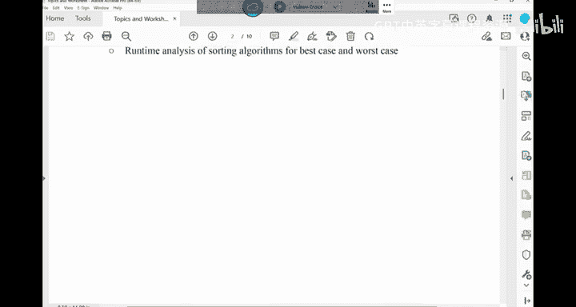
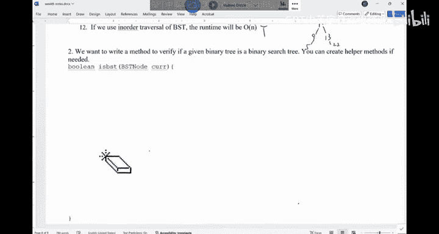
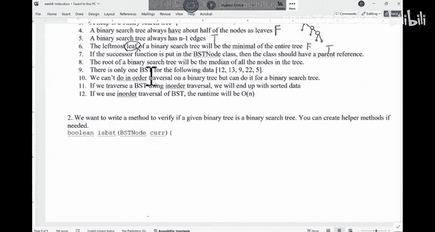

# UCSD《基础数据结构和面向对象设计（Java）｜CSE 12 - Basic Data Struct & OO Design Fall 2024》中英 - P27：CSE 12 - Basic Data Struct & OO Design - LE -A00- - Lecture 28.zh_en - GPT中英字幕课程资源 - BV1zJQHYcE8g

。Alright， I think we should start in here。Good morningor。

So we are done with all the materials for CSE 12， right， and our final is this Saturday， the。7th。

 so we have three days away， four days away from the final， okay。I'm still finalizing the final exam。

 So by tonight， I should be able to finalize it。 And the way I design the final is。

I go through the notes。 and on canvas， you have a lot of the past finals， like winter 23。

 like all those finals。 the multiple choice questions from。

This final will be similar like those with with respect to the concepts。

 The only thing that it will be different is we have more coding questions。

More coding questions this round。 Okay， and the coding questions that I will use would come from either the P。

With a very minor change， if at all， or。From the exercises we did in class。

So that's where I'm gonna draw the coding questions。 So if you understand the P A。

 you understand what we did in class， you should be fine。Okay。

 so I wouldn't worry too much about those coding questionss。

 And you have a reference of like past finals that would give you a sense of what multiple choice questionss we may have。

嗯。The plan for today is we'll finish the these exercises about trees。

And then we'll look at the final review。 I will look at the final review。 on Friday。

 we will still have our class， but it's mostly for Q A。 So if folks have questions。

 last minute questions， Ill be happy to answer them。😊，嗯。嗯。There are any questions before we。

Start here。All right， then。Last time we finished some of these exercises。

 I think we stop at it number 5， but I may be wrong， okay， so。We are looking。

 This one is' about trees， heaps and this sector。 right， So if you look at it。

 a binary tree always have n -1 edges。It's a binary surgery。

 So binary search tree always have n -1 edge。 Is that true or false if you think about it。

And we have a quick vote on this one。我。Let' me see。And the class。Start this one。Alright。

So should work in here。Can we vote for number 5。 number 5。 here。

 This is the worksheet we had on week 8。 We， we didn't have time to do it。 Now we， we're catching up。

 So it's number 5， good or bad。All right。So I think we're good。 right， This one is true。

 A lot of us are voting for true in here。So B， SC always have N-1 address。

 How about the complete tree， Can they say a complete tree always have a-1 edge。Yes or no。

 if I have a complete tree。That complete tree would also have n minus。That's also true。

 Can they say a binary tree， Any binary tree would have N edges。It's also true。

 Any tree would have n -1 edges。 It doesn't matter what kind of tree you are dealing with theterary tree or any kind of string trees。

 They would have n -1 edges if they have a node。So this is always true。And B SC is just a special。

Binary tree，Next one， the leftmost leaf of a binary surgery would be the minimum of the entire tree。

Let's， let's vote for this one。 The leftmost leave of a binary search tree。Would be the。

 the smallest data。In the tree。Is that true or false？I think we're in trouble in here。

This one is tricky。This one's tricky。The leftmost leaf。Will be the smallest， the my。

 the left most leaf。Will be the smallest of the entire B， ST。

A majority of us voted for the wrong answer。Can you talk to your neighbor a little bit， please。

A majority of us voted for A。 That's wrong。It's not。It's not。A true be false， right。A true B false。

All rightJust be very， very careful in here。The answer is。This one is wrong。 right。

 So it doesn't guarantee to be the smallest data in the tree in the B。

 SD is not guaranteed to be a leaf。Is the leftmost node。 For example， if you think about it。

 you have this data。20。1030。15。17， something like this。 What's the smallest data。It's 10。

 It's not the leaf。It's not live。Right， so its the leftmost node of the B， ST。If you。

 if you get them order， the one on the left most part of the B SD is the smallest。

 And this thing is false。 Just be careful。 Okay， there is no guarantee that the。嗯。

The minimum will be a leaf。Number 7， I changed this problem a little bit because I think it was not。

Very well structured。 So what you have on your nose may be slightly different from this one。

The question is this， if the succession function is put into the B SC node class。

Then the class should have a parent reference。 It can't just have a left。 can't just have a right。

 It should also allow you to access the parent。Is that true or false。Number 7。So。

You put the successor function in the B SD。 No the class， not in the B SD class。Alright。

 I think about doing well on this one。The answer is true。 right， The answer is true。

 because if we are looking for the successor， I think there was a little bit confusion based on the office hourss。

 It's like。When do I need to use the successor， right。

 We talk about successor when we were trying to say you try to delete a node with two children。

 You replace this node。 You swap this node with this successor， then delete the successor。

That's when we talk about successor。 But successor are used， not only。To to for deletion。

 you can also say， okay， I'm looking for a value that is bigger than equal to this thing。

Our in hit this value and then call the successor function of this node。

 And you're gonna find out everything that is bigger than equal to it。That's all you need to do。

 right？ So successor， there are several situations you have to do watch out for successor。

 If has a right sub tree， then you know it's easier。 But if this node doesn't have a right sub tree。

 you got to go up。 And in order for you to go up， you must know the parent。Right。

 so that's why this part is true questions。Okay。How about the next one。

 The root of a P ST will be the media of the noses in the tree。The root of a B， ST。

Has to be the media of all the data industry。The votes are always weird。

Sometimes it just doesn't work。 Let me turn on my hotpot。The protect it is。Lot of times。 not good。

For this one， we are gonna just skip it came in good。嗯。So，39 of us voted。嗯。Now，50。If look at it。

 most of us are saying this is false。Right。So if it's a nice， balanced tree， Yeah。

 it's gonna be a medium。 but if it's a skilled tree， you can't guarantee it's gonna be a medium okay。

Next thing。I have this data。There is only one legitimate B， S T that would contain these data。

Is that true false。There is only one legitimate B ST with respect to the configuration that would give you all this data。

I'm now saying you're gonna successfully insert this data。 I'm saying。

You can build any five node B S Ts， but only one of them。Willll be able to hold these data。

Maybe the question is still a little bit confusing。

 But are there multiple B S Ts that would hold these data。

 That's basically order way to think about it。Right。So there is only one way。To do this。

Regardingd it。Right， false。Depending on your insertion order， if you insert it in this way。

 then there is only you can end up with the same B SD， right， so you're gonna say1213。9，22，5。

But if you shuffle this array and you insert again， you may end up with a different B SD。Okay。

 so the basic configurations。They contain the same data may not be unique。right。Next one。

We can't do in order traal on a binary tree， but we can do it on a binary search tree。

 In other words， does is in order traveral only good for binary search。

 Can I do a in order traveral of any binary tree。Right， so that's what the question ask you。

Is this true or false， You can't do your order on a binary sheet， but you can only do it for B， S T。

We disagree with each other。Quite a bit on this one。嗯。Okay， so if you look at the vote。

We have roughly speaking of T。s okay。 can Well， we can definitely do in order traersal on a B S T。

 right， We'll give you the sorted data。 what's the point of doing it in order traal on a regular binary tree。

 you can basically compress the data into an array， roughly speaking。 That's what you say。 Oh。

 I have a tree。 Give me all the data in the tree in our array。 You just do order tra of the tree。

 And then you have the the data from the tree。 So it it doesn't give you the sorted data。

 but you can do it right， So this one is false， You can do it， You can do preor。

 You can do post order on any binary tree。Doesn't matter。 It just for， for the binary surge。

 if you're do any other traveral， you up with this nice sorted array。 that's about it。Are we good。

Alright， last two。If we do a in order traveral on a B ST， when I we started， I think we。

 we know this one I already said it。 that's true。How about the last one。

 We doing order traverse of B SD。 We end up with a run time of big O N。Is that true or false。

In order the traverse over B， SD。 The runtime is big O N。林宁。Alright， we are good。 So it's true。

 right， You're gonna visit each node。A few times， I like no more than three times。 you go down。

 come back， go to the right， come back。 So like four times， at most。And then the edges。

 the number of edges is also linear to n。 So it speak O n。所以是。linearar operation。

Are there any questions about like。Binary surgeries， binary， heaps。In the sector。Alrighty。

 then I'll give you some time to work on this exercise。 This is。

This used to be a meta interview question。 Okay， Matt used to ask folks about this one。

And see if you can get it。 given a binary tree。 And this problem is very different from your printout in the print out you are asked to calculate the height of a tree where they did it。

 so。There is no need to do that。What we want to do is we want to verify if a given B S T is a binary search tree。

Like， for example， given the tree like this。Something like this。Okay。

 assuming there are no duplicates， you're given the。The pointer， that points to the root。

 And the question is， you need to verify if the values in this tree。A。Did they follow the。

 the rules for binary surgery。 Okay， so this is the， the function。

 Feel free to write a hopper method if you need a recursion。 Can you do it。Can I do it。

I to verify if a binary tree is a binary search tree。

If you want to use a recursion， you can write。A hop。 That is recursive。Think about the definition。嗯。

Give me a vote once you are done， or you give up。Think about the the， the definition。

 Okay If I donet take a look at your neighbor's code。

How do you verify a binary tree is a binary search tree。This is a good interview question， yeah。是。

It's not too hard， but it does test if you understand a certain concept or not。Alright， so。

I have a proposal， and let's see。If this would。Cant be similar like what some of you may have done。

Right。The idea is this。 I have a note。 I want to verify if it's。Bigger than the left。

Smaller than the right。I do this for every node。 Will this work。I a note。

 I verified the left child is always less equal to me。

 The right child is always bigger than equal to me。Will this work？No， why not。

Can someone give me a counter example。Something like this。Let's say。Will this work？If you。

 if you think about it。This node is bigger than the left， smallerer than the right。

 This node is bigger than the left， smaller than the right。But this is not a BST。This is not a B SD。

 So you cannot just verify a node with this。Direct children。

 You have to make sure that every node on the left subre is。Last time I go do it。

 everything on the right after speak I go to it。Does this make sense。

 So you've got to be very careful in here。how do I do it。The easiest way is， say， if current is now。

You return。If it's a no tree， it's a B S T， I say yes。Right， otherwise， I have the return。

Is B S T helpper。I would the pass in this， this is gonna be the root， right。

And then you would pass like negative infinity and positive infinity。

I'm gonna more focus on the the pursuit of coding here。 So net infin。

 positive infinity is like the smallest value you can tolerate it and the largest value you can tolerate it。

 In other words， the first note。It can be anything。 It can be anything， so。So then you。

 you would have this buildinging。Is BST helper。You would take a B SD note。You have a low。

 You have a high。that's what we have。Are we good。So basically。

 the the thing you want to verify is is this， the value at the current between low and high。

 initially low and high that negativefin positivefin So the root can be any value。

 There is no constraint。So， if。Current dot value。Its less than equal to low。Or。Current dot value。

Speaker down equal to high。What would I do？It was the auto bound。I should return what。Return false。

 right。 So it's this value is。Eternal force。嗯。Probably， I can do another if。If current equals now。

Or return true。So that's another edge case to say， because I'm gonna keep recursing down。

 and I'm assuming now subrees they are B， S Ts。So if currently is now， you return true。

 and then you check if it's out the bound， that's a false。And then you're gonna to recur on。

Either side。How do I recurse。How should I recur on the。left side。有。Current dot left。Lu。😔，Okay。

 so we already know if I'm at this stage， I'm gonna be less than high。

So it's going be just gonna be current dot value。Right， so in other words。

 everything on my left side should be between low and my value。That's roughly speaking。 what we have。

And how about the right side。Is BSD Hopper。Current dot right。So the right side should be what。

Bigger than or equal to my value， bigger than my value， less than high， right。So， it's。

Current dot value。Hi。What should， operators should I use to connect them。And， right， so。

And that's about it。That's about it。 So you're gonna recursse on the left。

 You're gonna recurse on the right。 You're gonna use your value as the boundary。

For the left and for the right， yeah。Okay， so you're gonna do an order traveral of there。

 It will also work。It will also work。So。You're doing order traveral of the B ST and you check if the next element is bigger than the previous one。

 If this is true for everything， then。Its a B， S T。Oh， also work。 also work okay。But this is like。

 a pretty。Nice way to use a recursion to verify if a B， S T is。If a binary is a BST or not。

Are there any questions for this problem。The runtime of。

 in order to reverse and verify is pretty much the same in the worst case as this recursion。嗯。

I think that's everything we didn't cover for。Week 8。Okay。

Are there any questions before we start the final exam review in here。Right， Im呢。

Go to the final exam review。 I think on camera， you see this review sheet。 It has a list of topics。

Right， and also have some like questions that I grab from past finals or from the notes。

 Use these as practice。 Use these as practice。

For the finals we have on camera， we don't have the solution。

 Please collaborate like on Cam on on Piazza。 Feel free to create a Google Doc and say， okay。

 let's all come up with a solution to these ones。Let， let's go over the topics really quick， okay。

So what did we cover this entire quarter， We started with some basic Java stuff。Right。

 what is interface inheritance， a quick review on that。 And then we talk about generics。

 And you can see all the codes we wrote in this class were related to generics。嗯。

We used to talk about wild cars。 We are not doing that。

So this is Java generics。 And then we started with the data structures。 once we finish Java。

 the data structures we talk about number array， array and arrays at this stage。

 we know they are the same thing。 Theyre exactly the same thing。We talk about linked lists。

 We talk about the iterators of linked lists。Right。We hashing， we talk about hashing， right， how to。

 what's the basic idea of hash and then how to handle collisions。And then we implemented a tag。

 and we fit it into a stack and a queue。 That's what we have in here。 right。

 So second queue that are really easy data structures。 But they are pretty useful。

 We also talk about B， F， S， D，F S in this part。And then we talk about heaps， which is a part cube。

 And the last part is the trees。 So these are all the data structures that we have learned in C C 12。

 for each of the data structures， the most important thing you should know is。Number one。

 when do I want to use them， Like， what's the strength and weakness of each of these data structures？

 And number two is you should be able to analyze algorithms or operations on these data structures with respect to its run time。

Those are the most important thing， especially the first one。 You learn a bunch of data structures。

 When do I need to use them， When do I need to use them， right。So we talk about trees， P S Ts， right。

 And then we also discuss runtime and sorting algorithm。 These sorting algorithms is， is good。

 You know， merge sort quick sort。And then a bunch of other like looping sorting algorithms and then counting sort。

 You know worry about Redix sort。 It won't appear in the final。嗯。

So these are the things that we have here。Are there any questions about these topics in general。

Alright， let's， let's create a big， a big table of these。

Theta structures， right。So。Let's do this。When you think about these data structures。We have。

 First one is array。And then you have a link list。And you have the hash table。Stack。Q。😔，And then， he。

binary trees。呃BST。And what in general， we are looking at is some sort of dictionary operations。

You have insert。You have remove。You have find。Okay， for each of them。

 let's look at the best case and the worst case。Put this finding here。

Can you try to fill in this table。8月of。What's the best case for each of them。Worst case。

If you say this operation is not supported， Don't worry about it。 and skip it。

Can you try to do it yourself， right？ Obviously， I'm not looking for you to memorize it。

 It's useless。 You memorize it today。 You forget tomorrow。 What's the point。Right。

 but what I want to do。For you to really understand that。 you can in your head， think。

 Think it through really quick and figure out the answer。 That's the most important。s go。김의 워 완치였다。

I'll keep the vote on。 Don't worry about it。冇天文事得。Assuming the size of those data is n。

 are the n things in there for hash shape。 you consume the size of the table is M。

Don't refer to the note。 Just think about your head。 Okay， what's the best case。

 What's the worst case， especially the worst case， right， That's what we care the most about。

Other than hashing， Hashing is a little bit strange。嗯。We care more about the average case。모停 만수였다。

I'm done。 You can look at also your neighbor's code， and see。What they got。Right， so how about we。

Go through this list together。 And probably that's everything we can do today。 And on Friday。

 feel free to bring any question that 15 minutes is just for Q As。So， let's look at for array。

 What's the best case。Insert something。What's the best location to insert into an the end， right。

 You want to insert it。 And then you never want to insert in the beginning。

 So the best case is big one worst case is you insert anywhere in the middle or in the beginning of the shift。

嗯，How about link list。What's the best spot。In the front or in the end， right。

 So depending on is a doubleub link list or not。How about the worst case。You to insert in the middle。

RightSo if want to insert it in the middle， but in trouble。But in general， for link list， the。

 the issue is to go to the right spot to insert for a raise is。

You can insert at any location really quick， but you got to shift the rest。 right。

 So that's the issue。 So when you try to insert into a linked list。

 try to insert it in the beginning。 That's the best way for a raise。 Try to insert in the end。

 That's the best way， right。Of a hash table。 When you try to insert something into a hash table。

 What's the best case。No collision right， There's no collision。 We， we get to the right spot。 Big1。

How about the worst case。You have to， you hit the collision and all the data clustered together。

 Whether you are looking at the linear probing or cyber training， you have to go through every data。

 right， so。Wors case for average case。And this is what we really care about for hashableable。

 because it' is very rare for you to say， I hit the worst case scenario。Extremely， extremely rare。

So the average case is one plus alpha， right， Al is a load factor。

About stack inserting into the stack。What's the cost。You have a stack。 you push。B go1 big go1。

 There is no issue。And in the worst case， there's， there's no worst case， It's all the same。

How about Q。Big one， right。How about heap， inserts something into a heap。What's their cost？

You want to insert the data into the he。A particle。 What's the cost， You go login。哎，被告 log根。Well。

 the， the best case is be1， worst case is be go loggan。If you insert it。

 you never have to populate it up。 It just the right spot。 you're done。Right。

But worst case is go all the up to the top of the tree。How about binary tree。

 insert something into a binary tree。Normally， when you try to insert into a heap or binary or binary search。

 you follow the idea。 like when you try to insert something into a binary tree。

 you want to insert at the leaf level。 So it's， it's really quick。And so it doesn't really matter。

 You just put it into the rest into as a leaf。Right。That's all you need to do。

The only thing that you have to worry about for binary trees is you hit the leaf level。

Assuming you're already at the， the leaf level。 then that's good。嗯。For B S T。

 if you need to insert something。嗯。Sorry， I think for binary， we， where we also have to think about。

This part。Ble N， sorry， it should should still be bele N。Right now， for binary。

 I think I'm assuming we have to go from the route all the way， hitting the leaf level。

That's when we're gonna try to insert。So it's about big O N。 And then for B， S T。Still be right。

 The best case is， is a little bit up for debate。 The best case would be you have a balance tree。

Be告 log远。嗯。That's kind of what we have in here。RightSo if the tree is balanced， it be loggan。

If it's not F， sorry for binary， we should also do login here。now we， we should be good。

Any questions。Because for binary， the best case is you have to go from the root。

 all the way hittingating the leaf level。 And this is login。 assuming you are going from the root。

The insert part is pretty straightforward。Yeah。Right， why do we insert at the leaf level。

 then where are gonna insert it， The first leaf you， the first available spot that you see。

 I that what I trying to say。Yeah。I would say。Yeah， that's also possible， right， so。

The best case is you have a node， and then it has one。One spot available。 It just insert in there。

So the best case is more like big one。Yeah。Su。It should be something like this。 Big one。

This is the best case where it just， there is available spot。 and then you insert right there。

 the lucky day。RightGood point。 Good point。 I was thinking you always have to go down to the lowest level and insert。

This is better than the scenario I was imagining。So for binaryaries， right。

 it looks like the binaryaries we are we are looking at the， the best case is bigger 1。

 I think it we're looking at something like this。This， this， there is a subre in here。

 and we're gonna just insert over here。That's kind of the best case。The worst case。

You are looking at something like this。And if you keep going to the left。

 you may have to reach somewhere in here before you can insert。Right。

 so if you recurse just down until you hit to the lowest level， that's kind of the worst case， yeah。

If you go through it， level by level。And then you end up at a spot where。For the pione tree。

 you say you want to insert over there， roughly speaking， right。That's also possible。嗯。

At the earliest spot， as the polish spot， right。Is there guarantee to be loggan。On average。

The worst case scenario。I think it's， you can guarantee it， right， so。

You gonna either hit it early or if this part is full， you're gonna look at the next level。

 So it's guaranteed。嗯。So it depends on how you want to insert。 Thank you for correcting me。

B go log n in here， right， So you just go through it level by level。

 The worst case you gonna hit is summer。In the middle of the tree。So for binary trees， the。

 the insertion is a little bit strange， depending on where you want to insert it。Yeah。

You don't know whatre binary。What what we are trying to， to say， let me see。Even if， like， let's say。

 the height of the trees can be loggged。 do I have to go through every node in here anyways。

I think we still have to。Right， so。Big O log n， which is the height plus big O N。

 which should be big O N in here。the worst case， even if you go through it level by level。嗯行。

You say I want to go through it the level by level。 This kind of tree is guaranteed to be balanced。

 and then we can end up at the first spot that is available In the worst case scenario looking at something like this。

 I think you still have to go through the entire note。 So still gonna be big。

That's a very good discussion we have。 So for binary tree， the best case is gonna be O1。

 the worst case is gonna be big O loggan， which is this plus big O n。

 which is gonna be big O N anyways in the end。Right。Very good。 I'll be making any mistakes in here。

 anyone。Those can see， yeah。呃。The answer。呃当明。B go one now for B， S T， right。

 the best case scenario for you to insert something in the B， S T。

Is， is it the situation anything like this where。You have a sub， and then you insert right over here。

That's the big one situation。Yeah， you're right。Thank you。I always have to think it through。

The worst case is people one， okay。I think the best cases is， as you can see。

 all the best cases are equal one， isnt。So lucky day。 But these ones are more important， right。

So for P S T， for binaryaries， the insertion will be linear。 and then for a linked list。

And all these things， they are。被告 one。Now， for the other ones， remove is almost identical。

 Removeve is identical。 So it's it's the same。Okay。So exactly the same as。The insert。

Not everything is。Supports fine， not everything supports fine。Let's， let's look at the。

 the worst case。When do I have the worst case for me to find something in a way。Was the worst case。

Big O N。 This is big O 1。 It looks like it's also the same as insert。Link list， best case。Hash table。

For stack， does this does， that stack support find。Let me find something in the stack。No。

So it doesn't even support find。You only know the top。For Q， doesn't support find。For heap。

 does heap support find， find something in the heap。Did you implement find for the he。You didn't。

 right。 You didn't。 You can't find something in the heap。🎼You have only。

 the only thing you know is the root That's about for people。How about buying a tree。

Find something in the binary tree。Wors case is linear。 Best case is。

 The root is what you are looking for。For B ST。Best case。 How about the worst case for B SD。

Whats the worst case for BD。Yeah。Linear time right， It's just that weird。Skilled B， ST。

 That's what we have。Alright， so I like this discussion here。 Let me just。Clarify for the B S T。

 The worst case is you， you can try to go through it level by level to find the first available spot。

 You're still gonna be big O N or big O N in here binary， binary surgery。

 Well look at the same thing。Again， please do not try to memorize this table。 It's pointless。

 Try to deuce the thing through it in your head。嗯。Other than this， we are done today。

 We are done today。 Okay， I' will see you on Friday。 I see you on Friday。嗯。I， I would take。

 would take。

