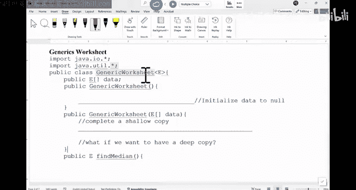

# UCSD《基础数据结构和面向对象设计（Java）｜CSE 12 - Basic Data Struct & OO Design Fall 2024》中英 - P2：CSE 12 - Basic Data Struct & OO Design - LE -A00- - Lecture 2.zh_en - GPT中英字幕课程资源 - BV1zJQHYcE8g

嗯。All right， so I think we should get started， Okay， sorry for being one minute behind。

Just running over here no。So normally， there will be like a couple minutes delay。 I sorry for that。

 You just saw this hall coming here with a lot of student asking questions。 There is a small delay。

 I'll try to be here as early as I can。嗯。Now， the， the plan for today is we want to look at Java generics。

 Okay Java generics。 but there are a few things I want to talk about before we talk about generics is the syllabus。

 There are a few things I want to bring up in here。嗯。Last time we have looked at nearly everything。

Other than important policies。So， let's go there。Well， first。

 are there any questions before we start？All right。嗯。So we talk about academic integrity policy。

A few things。 I do want to talk about every item in here。 First thing is diversity and inclusion。

 okay。I， I know I'm not expert in this area at all。 right， I I don't know。Too much about it。

 But all I know is everyone should feel comfortable learning in this class。

 I don't care about any religion， any political views， anything。 It doesn't really matter。

 Everyone should feel comfortable learning。 Okay， We should be professional to each other。We。

 we should have freedom of speech， academic freedom。

 but not to the point to make other students feel uncomfortable。 I think that's。

 that's the whole point， right， So all the views are supported。

If I say anything that make you uncomfortable， please let me know and I will change。

 if any of the the teaching staff did anything or say anything that make you uncomfortable。

 let me know。 we will adjust。 okay， and also the expectation is our students should be professional to each other。

 You know， sometimes people are frustrated and they may say things and I mean it's understandable。

 but。Just try to be as professional as we can towards each other。 right， at the end of the day。

 this class is mostly about learning， right， So you should feel comfortable asking questions。

 You should feel comfortable， kind of say， I think this policy is a little bit unfair because ABC。

 So all those opinions are welcomed。 right， So as for whether we decide to adjust the policy or not。

 that's a different story。 But everyone should be free to express your opinion。 Okay。

 that's the whole point。 that's my understanding of diversity and inclusion。Maybe it's very shallow。

 but that's how I understand it， okay。We do have the， like the Office of harassment and Disc Prevent。

 O， P， H D。 so if， if you feel any need to do that， theres this website， okay。

I think I talk about O SD students already got a couple emails from our O SD folks。 Thank you。

 we'll take care of it。If there's any basic needs for food or support。

 UCD have this site called the hub。 It has many resources for folks。

I think I talk about late a policy。 Just be careful。

 I think one student told me there is a wait list。 So if there is a wait list。

 make sure you do all the work that you are supposed to do before you are enrolled。

 I do see a lot of wait list the folks getting into the class。 because I just feel like。

We should have enough room for that。 Okay， if you say I'm not enroll on canvas。

 I'm not on Gco or Piazza。 Email me and will add you manually in there okay。

Make sure you have all the resources and the expectation is all the way to list folks do all the work。

Okay。嗯。Incomplete。It happens once in a while。 But if for any reason you need to request the incomplete。

 the policy of UCSD is this is not just for the C IC department In the entire comps is number one。

 you must have a reason a lot of times if it' most of time it's medical reason， right。

 sometimes people are get very getting very sick， so。People may request incomplete。

 The other thing is like some， some sort of emergency。 Just keep in mind。

 if you say I need an incomplete。By the date you pass you request。 There is a form。

 you have to submit it on that date， you submit the form。

 Your grade for this class must be a passing grade。 You cannot say， I'm failing the class now。

 I'm gonna request incomplete。 it will be denied by the university。 Just keep that in mind。 okay。

 but if it's due to legitimate reason I know student unfortunately， she got cancer。

 and she was doing all those crazy medical treatments and her grades was failing。

 But I think the university was。Doing something like retroactive incomplete。 So take care of her。

 And that's everything that we， we would support。 But unless it's those best situations。

 just make sure you have a passing grade and you have a legitimate reason to request incomplete okay。

Student conduct policy。 that's the official policy。 I don't want to read it， but again。

 be respectful to other people。To other people's opinions， to other people's freedom， right。

 So that's it。There is no outside tutoring allowed， right， So no copit。

 no JP D those are consider to be outside tutoring。Clas materials and intellectual property。

 I don't care how you use my notes。 So if you want to sell them online， feel free。

 which I don't know if any of buy is publicly available online。 But， I mean， you。

 what you want to do is you want to。Make sure that your codes are not published publicly because sometimes people publish their code by accident。

 Like， I'm just kind of saving a repository of all the code I've written and believe it or not。

 just within a few minutes。 Other people may grab your code and submit it as their own。

 It happened at least three times already。 Like a student submit。They published their code on GitHub。

 assuming it's private but it's public。And he took it down within a couple hours。

 And then three other students grabbed his coat and submitted it。

 It's unbelievable how that could even happen， but。You haven't。

 So please make sure that when you save your code on Github。

 which is a agreed tool of you should use it， But just be careful。 Just be careful。 Don't publish。

 don't make it public。 Okay， don't make it public。 if you want to say。

 I want to share these code with my future employer。 Like sometimes they may ask you。

 what kind of part have you done。 You can definitely make your Github repository private and add your interviewer as a collaborator of that repository。

 you don't have to make it public， okay。There is a new law。

 just we just got an email like a couple weeks ago from the university saying that we should let you all know about it。

 to be frank， I am not sure what this law requires you to do。

 But based on a five minute reading of the summary， it looks like if we are getting financial aid。

 make sure you are in good academic standing to continue with financial aid。 that's what it is。 Okay。

 But if you want to know more。 go to this website and read about it。I think that's。

All the leftover stuff from our syllabus。 Are there any questions。For this。All right。

I do have this quiz。 while this is not a quiz。 is's not going to come towards your grid。

 but there is a it's called syllabus treasure hunt。 So there are some questions about this syllabus。

 You can use your phone to scan or you can use a laptop It's a Google form。

 Can you try to answer those questions and see if you if you get them。

And so I'll give you a couple minutes。 Feel free to talk to your neighbor and say。

 is this answer supposed to be A or C or whatever it is。It should be a Google form that would。

Let me know if it doesn't work。 It should work。I'll give you a couple minutes to try to do it。

You can also find the link on camera。Don't have。放。Feel free to look at your neighbor's answers。

 This is not a closed book closed note test。Feel free to discuss。

I see who can get most of them right。One minute to go。There are still some leftover handouts。

 If you need more， I think there are like five or six copies。If you need home out。嗯嗯嗯。Alright。

 so let's， let's work on this one together。 Which part of the C I C 12 your grades。Reading。

 do we have reading？Part of a grade yeah。PAs attendance。 Do you have attendance degrees， Yes， right。

 quizzes， midter。Final piazza questions。 No， right， yeah， We would appreciate your answer questions。

 but that's not gonna to be part of your grade。 For the second chance points。

 reading has a penalty of 10% late work。Okay。EachPA has a redo for 100% points makeup。50%， right。

 So you the re would give you 50% of the lowest points you may get up to up to 50%。

 so this two is incorrect。 It's because of this percentage。

 Meterm can be replaced by part of the final。Yes， right。 quizzes have reduced。Yes。

F example can be replaced by the overall Ps。No。Classify these can be replaced by a portion of the final。

Right。These are not questions。How about this one， How does the quiz makeup work？

Not every quiz has Jamaica。Every quiz has one。The makeup quiz score will always have the original score。

No， only if it's higher， right the higher would make up。 So this is the right answer。

How about this man， Do we explain quiz answers right away， Yeah， right so。

We have tried this a few quarters， and students in general like it， so。

That's what we'll continue to do。 Where do we have the quiz。In discussion sessions， right。Dsing here。

Starting from next week。What's the appropriate course of action if you have a question about something in the class？

You can email me directly。 just there might be a delay。

You pose a question on Piazza without checking to see if it are be answered。

 I' would say this one is the best way to go to Piazza because we have so many students。

 I think this quarter we have about 320 students in CSE 12。So with 300 people。

 so a lot of questions may have been asked before。 just do a quick search。 if you can't find it。

 ask again。 And if you need， if you have any like personal like extensions or you want to schedule a point with me on something。

 you email me directly， okay， sometimes if there' is a delay。

 say you email me like for week and you didn't get back， I didn't get back to you。

 there are two reasons。 number one， is。I I just didn't see your email or it got buried or number two。

 you sent the wrong address that has happened because once for once。

 a student was very mad at me saying I send you multiple emails。

 How come you never reply at this time， I never get that email。

 a student send email to a wrong email address。 So just， just be careful。

 So if you say I send Paul email within a week。 I haven't got it do a follow up or make a Pi post to say I send email to Paul and my Ts tutors。

 They would tell me， Paul， did you get this email from the student。 So do a follow up okay。And also。

 don't post on canvas。 Don't use canvas email。 We don't get it， O。How about this one。 Tru or false。

 It is a violation of the policy。 If you discuss the quiz question with anyone before the instructors announce it's O to do so。

Right， so this is。True， so please refrain from talking to your friends about the quiz。

 And sometimes your friends may ask you， hey， how did the quiz go， What was it like， Just tell them。

 and you are not lying。It's the same as the notes。That's all they need to know， right。

 And that's all you need to know， too。 If you prepare well。

 based on the questions we did in the notes and in the P A， you should be fine。 You should be fine。

 okay。嗯。Number  two。You' are working on your programming assignments and you can't remember how to use the scanner。

 right， So you Googled and you find a few lines on scanner。 And then you just copy those codes in。

 Is this allowed。No， which part is not allowed。Copy， right， So you， you can definitely go。

 How do I use scanner。 You look at Java do。 That's totally fine。

 But please do not copy paste any code。 Okay， so you can say， okay， this is how you use it。

 Then you rewrite it yourself。 Okay， that's important。 So is this allowed， no。Next one。

 you're working on your P， and you cant remember how to use ja。Link this class as part of the P， A。

 you Googled， and I can tell you there are codes available online。 So some， someone implemented。

 you look at their code， you didn't copy their code。 You just close it and then work on your own。

 Is this a lot。This is't like a gray area。 I， I didn't copy their code。

 Just look at their implementation。 The answer is no， right。

 Please do not look at other people's code。 And the reason is simple。

 If you say have no idea how to do that and you look at someone's P A and your idea will be guided towards in the same direction at that P。

 there's， there's no doubt about it and your code may be very similar like that code。So please don't。

 if youre Google and all of a sudden you stumble upon the code， just close it。 Don't， don't read it。

 Don't read it，嗯。So we we like like I said， we do search online too whenever we see someone posting their code。

 we tell them to remove it。 And in general student would do so。

 but sometimes students have graduated， We cant find them。

 And those things are gonna stay there forever。 We contact it up to say， can you remove this thing。

 So， but we do search everyone's code against the code。 We can find online。 So don't do it。

 don't do it。 Okay， So this is not a lot。 So if you stumble upon someone's homework implementation。

 just close it。 Don't even read it。That's what I would suggest。

We do see another situation before where students I didn't look at other ways code。

 but I look at their tester。I look at their tester。

 like student make up some data to test their data structure。 And I just copy their tester。

 That's not allowed either because it's very hard for you to say。

 I independently come up with this testing sequence of Paul Rick Mia。And then Christine。

 a list of faculty names in the exact same order as a code that we had before。 So it's。

 it's very hard for people to come up with independent tests like that that would indicate some sort of cheating going on。

 So please make sure don't look at other people's code。 Don't copy each other's tester。

I think that's about it for the syllabus。 Any general preference about the syllabus。All right。冇吧。So。

 let's look at。第一。Our use。A word document。So what will be looking at today is the。Generics。

 geo generics， okay。So generics is a feature in Java that is also available in C plus plus。

 So what it does is sometimes。How many of us have learned generics from C S C 11 on A B。

Not too many of us。 Not too many。 Some of us did。 So generics is a。It is a way to say， okay。

 Java is a language that cares about the type of data。

 You may have certain type of data like integer or double or or whatever class you create。

 But the issue is， once you specify a type。That method， that class only deals with that type。Right。

 which can be very annoying because when you create a data structure。

 you say I create a data structure that you can hold integers。That's fine。 You can do that。

 And theres what what if I need to store double。You have to create another data structure for double。

 What if I want to store a bunch of students in there。

 you create a data structure for students and go on。There is unlimited kind of data people may use。

 So how do we remedy this situation， That's when we start generic class， right。

 So if you look at a generic， it is basically a class that doesn't confine itself to a specific type。

 you create a fake type。 Okay， so if you look at this class is's called my generic list。

And this T specifies， okay， So in this class， I'm gonna use T as if it's a real type。So in here。

 I created a thing here。 What， what is this。T square bracket， none。You said what。

It's a ray reference。 right， It's a ray reference of type T。 what is T。

 I don't know When people start to use this class， when they instantiate an object。

 that's when T would be substituted into a real type。That's the idea of generic。

Right just like if you， if you make a bus， right， if you make like in real world， make a bus。

 you say this bus can transport students， can transport seniors， can transport policemen， right。

 Any kind of people that you can do。 So those chairs， there are generic chairs。

 anyone can sit it on them。 anyone can say it down them。 And here is the same thing。 So this list。

 it can store all kinds of data。 depending on what this tea is。So in here。

 you just use T as if is a real type。 This is a constructor。 And we say， okay。

 this nus by default is Now， if you give me a size， I would create a new。Aray object。 And in here。

 there are certain restrictions of how you can use this generic type。 For example。

 you cannot create a generic object。Of T array。 In other words。

 you cannot say new T square bracket size。You， you are not allowed to use generic type array objects。

 So in general， what people do is they create an object array and type ca it into a T。嗯。

If want to know how long is the list， you just return the length of the array。

 If you need to update a certain data， as you can see， this T is used as a reference type。

 So whatever this data is， I can assign it to a certain index in the array。Questions so far about。

What is generic。Idea is。Yeah。Right， right。 So it's very similar like templates in C plus plus。

Any audio preference？Alright， now other examples， like you may have a two string method of the class。

 So we just create empty string for every data in this array。 And you can see this type T is like。

Use as the type this is for each loop， if。This type， if this reference is an instance of object。

 that's what we do。 So you can do all kinds of manipulations in here。And then in the end。

 you just return the string。 So this is the generic class with a T。And now what you do is you say。

 I'm ready to use this type。You can say in my May， I will create my G list。This is a reference。

 right， I created myy list reference。And then I would supply this type integer。

 You should have seen a red like this， right， So in here。

 you are just creating your own generic type and say， please roughly speaking okay。

Is basically that T type is replaced as integer。That's what it is。 So this generic list type。

 all the Ts in there are replaced by integer。 So you just create a generic object。

 You can print it out。 You can do all the updates and sector。Any questions。For generic class。

去哪 class。Yeah。Update。So in here， this update function would take two parameters。

 One is the location you want to update in that array。 The other is the new data。

 you want to update in there。 So you are saying nus index equals to this data。 Basically。

 you are letting this array element to point to the same data that this data is  pointing to。

And the audiocur。So that's generic type。 And in this class， almost all the。Homework。

Is about generics。 So it's just because we are writing data structures。 right。

 So if generic ever con you， just think about a。 You have learned about a。

 You say I can have aius of integers， a strings in structure。 So aius is a generic class。嗯。

Let's do a quick vote in here。 Just give me one second。嗯。If you see a interface like this。Okay。

If you look at it， this is a public interface collection。 E extends iterable E。

What does the E represent？In the code above。嗯。嗯。嗯。I think I don't have my connector in here。But。

Let's just think about it。 What would you vote for， Okay， We may not be able to vote at this moment。

They have forgotten on it's here。What would you say， AB and C。Feel free to talk to each other okay。

What would you say the answer is for this one。What does this E stand for？

Which one looks like the right answer。Is a that this collection can only be used with objects with beauty and data types。

No， it's not。 It can be any data type， right， It can be any type that you can implement。

 I think it's。B， right， there's。That an object reference that implements collection can be initiated to work with any object type。

 So in here。It should be。O。Coderful。You， it should be。B， the answer is B in there。Right。

 so it means any generic type， any object reference type can be can be used to replace these Es in there。

Okay， so you can create an interface in here。 That is a generic interface。

 This generic interface extends eaterable。What does the X in here mean for interface。From Jese 11。

你民是吧。Right， so which one is apparent， Is this apparent or is this apparent？Eerable is apparent。

 right。 Iterable is a parent interface of collection interface， right。Any questions for this？Yeah。系我。

你白。The parent so if you think about Java， right， Java。

 you can have a class that is parent of another class is， is basically the idea in here。

 So when you have a class， right， maybe it's a good review that we have， when you have a class。

This class can't have a parent。Of another class， right， so。The one on the top is the parent。

 The one on the bottom is the child。Can a class inher from interfaces。Kneth。You should be able to。

 right， How many interfaces can be the parent of a class。Many， right。 So you may have interface 1。

To and go on。They， they can all be the parent of this class。Right。

 so what's the difference between inherance from a class。

And the iron from interface is for class inheritance， a lot of times you inherit。

Concrete stuff for interface is mostly youher the the standards or the。

 the public functions that you may get。 I think later in the in the notes。

 we have a quick review on this。Any the audio preference？All right。No。How about this。

I have a class called generics，And then this is what I did。So I have a bunch of functions。

 I just omitted to the body of these functions。嗯。Would this work？Of this man with this code compile。

嗯。MC5。Can you all even vote in as now， it looks like I need to set it up in a way。

 But let's just think about this。What would you say， Yes or no。 Just talk to your neighbor's。

So there's no role taking today， so we more about it。What would you say。

 Is this a yes or is this a no， Talk to your neighbor and then。Offer a justification。Why yes， why no。

对。It's supposed to be AC， but I don't think it's working as of now， I can't connect with it。

Don't worry about it for now， we'll start next week， I will start next week， I didn't set it up yet。

 yeah don't worry about。Will this work？How many of you think is going to work？No one。

Everyone think is going to work。 It's not going to work， It's not going to work。

 Why can someone explain to us why， why this own work？

Sometimes you get to the right answer for the wrong reason， yeah。

Though we have to substitute that to you with it。Right， does。

 doesnt mean that we have to substitute this T as an integer。 Why do you think it must be integer。

Because this said add more。Alright， so if there' is an a thing， right， So if I call add。

 it looks like it should be an integer， right， because I'm adding a whole number in there。

 So the idea in here is this one won't work。 And you are right， iss because of this T。This thing。

Right， when you try to instantiate an object out of a generic class， you must supply a concrete type。

 You cannot stick with this generic type anymore。Okay， so just be careful， instantiation。Time。

Must have concrete type。Just be careful。 Okay， so if you don't have concrete type。

 you are not gonna to pass the compiler。Our friends about this？All right。

So a few notes in here about generics。So there are certain restrictions on what you can do。

 what you can't do on generics。嗯。And here's a list of three things that you can't do。

 Here are the three things you can't do。 It may seem arbitrary， right。

 Why can't I do these things Its mostly because of the following。 Just keep in mind。

 when you have a Java code， right， We have a Java code， There are two steps for Java code。

 You can first compile your code。Right， from C， S 11 A B， we know that you， you。

 you first compile your program and then you can run your program。Execution or you run your code。

 These two steps are distinct。 In other words， the compilation phase happens first。

 and then you run it second。 right， So when you compile your code， there is this compiler。

 We know it's Java C。Right。That's the command that you use to compile your program。

 And this compiler。Pretty much is in charge of generics。So if you think about it， the compiler。

 which is this Java C code， is gonna look at your program with all the generics in there and try to make sense a it。

By the time you run your code， all the generics， in fact， are already gone by the can be removed。

 replaced by the compiler。 Okay， so that's that's the first thing you you should be aware of。

The why why， do we want the compile to be in charge of the generics in early version of Java。

 like Java 5 to Java 7。 right now， we have Java 17。 and the the。

 the Java version we support is Java 11， right， whatever it is， those versions in early versions。

 It didn't care。 So the run time can handle generics。Runtime can handle generics。

 So the compile doesn't do a lot of job removing generics and say， okay， runtime。

 you can do the replacement during runtime。 And do you know what happened。

It it's just like people would make mistakes， right， It's just like when you buy a car， we。

 we don't have to test the braking system。 You drive it。 And then if something bad happened。

 we'll figure it out。 That's what what it was like， right。

 So you probably do not want to drive their car where the brake system was now thoroughly checked out。

 And in early days of generics， people make mistakes in their code。

 And when their code executes the code just crash。It's very bad。 It's very bad。 Okay， so after that。

 people decide to say， okay， we need to make the code more secure。 By first， looking at the code。

 make sure all the generics are taken care of before you can even run your code。

 That's why the compile was in charge of generics。Computeruter is just a piece of code。

 a piece of software that look at your code。 It doesn't run your code。Okay。

 so compared to hair code do all the replacement， generate the byte code。

So the compiler doesn't do a lot of things。 One of the things that the compiler doesn't do is it don't create。

Objects。So when when the compiler look at your code。

 it doesn't run your code and objects only are created when your code runs。So because of that。

 the compile cannot deal with things that deals with objects in general。

So when you create a new T object， the computer have no idea what T will be。So it doesn't do it。

 It doesn't allow you to do this。 When you create a new array of type T。

 the competitor doesn't know how big this this T type is。 So it doesn't create it for you。

When you do some references instance of T， because competitor does not， this is a runtime check。

 In of is a runtime check。 So the compile doesn't allow you to use T at， as the type during runtime。

 So these are the three things that the compile do not deal with is because often have to do with objects。

Okay， so no generic array， no generic object。And then no instance of check on a generic type。

Is there conflict between。This one。you are not allowed to create a generic。A rate。

Compared with what I just did in。Here。Can you talk to your neighbor， Are they the same thing or no。

You just say you cannot create a generic array。 And what am I doing in here。What's the difference？

Is this a typo like I shouldn't even do this。就。What's the difference between these two？

Are they the same？They are not the same， They are not the same。 This is to create a generic array。

What does this one do。Create a generic array reference。Reference different from the object。

 Reference is just a 4 by variable that holds the address of an object， not the object itself。 right。

 So those， those who are different。 You can definitely create references of any type。

Related to generics。 But you just cannot create a new T array。 For example， another thing is like。

 it' a T reference。V S new T。 Those are two different things。This is to create a reference。

 This is to create the object。系。Are we good？SoDo not confuse on that，Now， coming back。Sometimes。

 you do see。When you create a generic type， right， when you create a generic class。

 like my generics and my type is E， but you want to kind of put some sort of constraint on what this type E can be。

This type E can be， if you just say type E can be any generic type， any class type， right。

 can be in teacherger can be string can be student。 But in here， you can say， okay。

 I want this E to be confined a little bit。 I say E must be a child of comparable。Meaning。

 whatever E type you supply， that class must have implemented the comparable interface。

In other words， you say， is this generic class， My generics cannot just support any generic type。

 It must be a specific generic type that are children of comparable。Does that make sense？

It's just like I say， I have a rosterer system that can potentially support all students。

 but I don't want that to be。 I only want you to be supporting UCSD students。Right， so you can say。

 okay， the generic type I'm looking at must be a sub of this specific parent class or parent interface。

And this happens because a lot of time you need to compare these generics and comparable is the interface that would give you that capability。

In general， generics are useful for data structures。

 so all the types that you're going to create in CSE 12 have something to do with generics。

 and they are not hard， they are not hard。It's mostly because you just use E as if is a real type。

And that's it。Okay。A couple words in here。 I don't think we have the time to do the worksheet。

 but let me just use the last few minutes to talk about type erassure。 Okay。

 so this is something that you do not have to know， but is' good to know， okay。

 type eraser is a term that is used to handle generics in Java。

We say about at the compile would take care of all the generics。 What does it do， right。

 taken care of， What does it do， The compile would check if generic type is used properly。

 What do you mean use properly。 Like if you use a generic type。Did you use any。

 Did you create any objects out of them， Did you create objects of a arrays out of them， And， right。

 Those are big no no。 or did you kind of use them in a special way that is not allowed。 right。

 So that's what the compiler would check once everything checks out。

The compiler does something crazy， which is to say I would replace of them with this specific。

Type called object。You know that in Java， there' is this class called object。

 that is the parent of all the classes in Java by default。All the clauses you heard from object。

Right， so all the generic types would be replaced into object。So， for example， you say my list。

 I have a string reference in here。 So my， my list is about strings in here。

 My list is about in teachersger at the compile time。哦。String。And integer。

Will be replaced into object。Okay， so there's no more generic type。At runtime。All generic reference。

Object for reference。I should use uppercase O in here。Just be careful in here it's because。

For these references， they are no longer you are not dealing with string references。

 You are not dealing with integer references。 All the generic references that you have in your code will be replaced into object references。

So that's what the compiler does。 In other words， it's like it going erase all those types。

 Just replace all of them as object。That's what he does。O。Questions。Yeah。啊，这个。

The objects reference type of acid。No， they are not type casting。

 The camera doesn't typecast for you。 But if you use those types。

 you have to type casting it works properly。Okay。One question I do want to ask you all。

 We have three minutes。If the competitor just erase all these T types。Into object。

 Why don't I just use object over the place in here。

Why do I have to go through this painful process of creating a generic。

 and then the compiler would erase of them into object。 Why don't I start to use object directly。

What's the benefit。Yeah。So here， if you think about it， object。I mean。

 anything can be referenced by object reference because it's so up in the in inherent hierarchy。

 Like you I have a string object， I can use a reference of object to reference to it。In other words。

 it's very powerful reference。 Why don't we just use object reference all the time。

 Why do I have to use T。Yeah。Back， in fact， a lot of like code They just use object references。

 And it's a bad thing。 So people don't do it anymore。 Why， Why is it， Why is it bad。

You end up with like sense。You may have mixed types。 In other words。

 if you have an array of object references， you may put integers in there。

 you may put strings in there， and you have to be very careful about how you use those object references。

 There are a lot of type class you have to do。 So people are doing all kind of crazy things。

 if you have object reference because it's so powerful。

 So that's why people say it's safer to use generics。 At least the types are enforced。Okay。

 so that's why we would prefer to use generics instead of using objects。Or were our program。

We do not have time to do a demo， but。Maybe next week， we can， I sorry， now， maybe next lecture。

 we can do it。 We have a worksheet in here。 Okay， if you have time， work on it a little bit。

 We'll work on this together on Wednesday on Wednesday， okay。All right， we are done today。 Thank you。

Yeah。So is it okay if I talk to my team？some。We have two of these guys。

