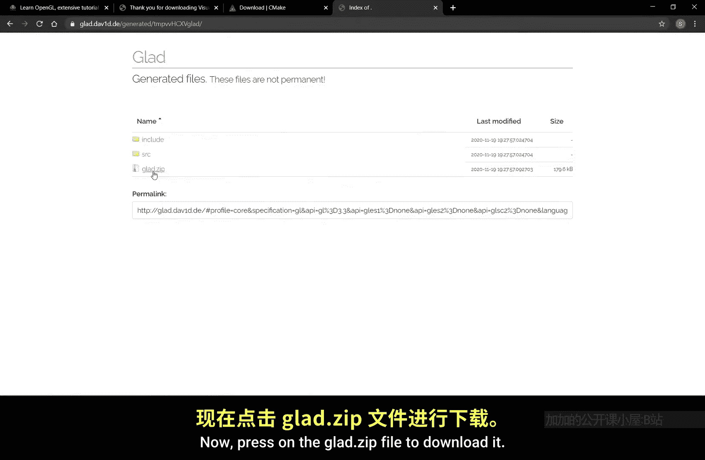
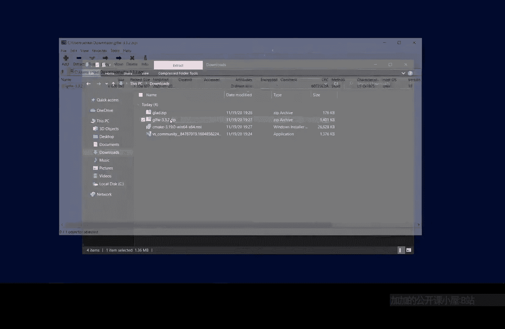
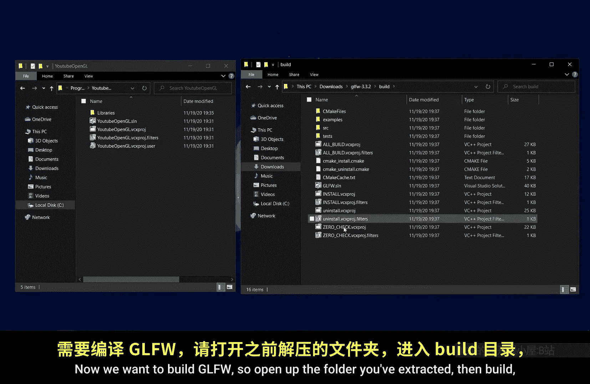
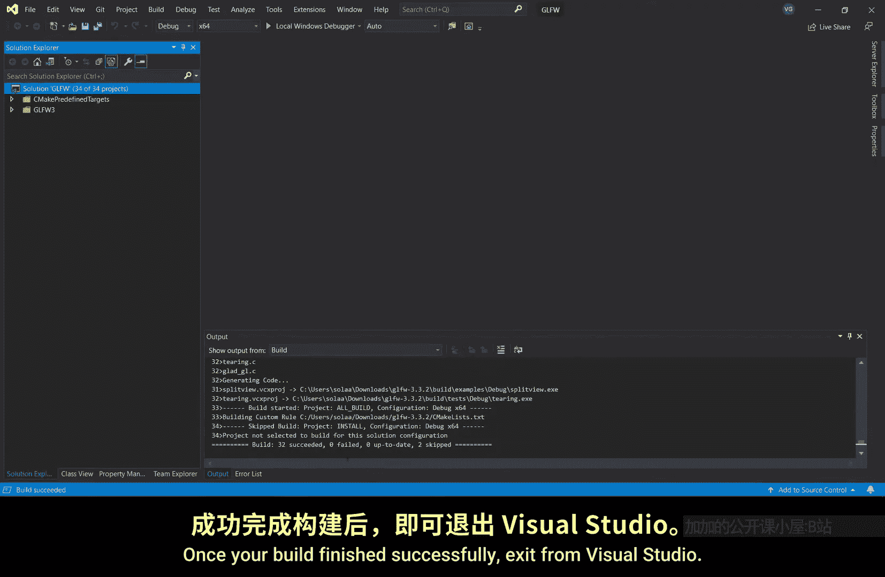
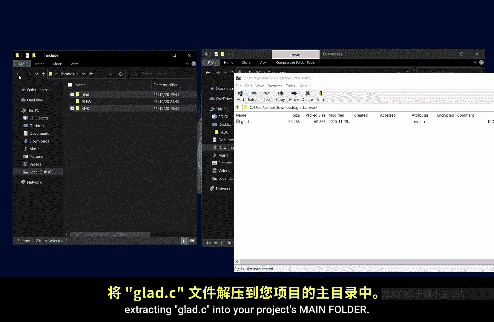

# Victor Gordan【中英⚡OpenGL教程｜OpenGL Tutorial】 p01 P1 Install -BV1kkvTz8Egh_p1-

This tutorial follows learnoppengL。com， and all the credit goes to Joey deries。

The first thing you'll want to do is to check you have the latest drivers for your graphics card and the latest version of Visual Studio。

Next， make sure you download a 64 bit Windows installer for a Cmic and go ahead with the installation。

Now， download the source package for GL W。Lastly， you need to download GlaD。

 make sure you select C/ C++ version 3。3 core， ignore everything else and press the generate button。

Now press on the G that zip to download it。

Once you've finished installing CMake and Visual Studio。

 open up Visual Studio and click on createreate new project， select empty project for C++。

 click next， type in a name for your project， make sure the checkbox is checked and remember in what folder you've placed your project。

Open up the folder of your project and create a new folder naming it libraries。

Now we'll create another two folders in libraries， naming themL and include。

This is where we'll later import all our libraries into。

Now we need to extract the GLFW zip file in open up CMake in CMake。

 select the folder we've just extracted as the source folder。

Then create a new folder namedBuild in the source folder and select it as the build folder。

Now click on configurefi and after making sure you have the same settings as me， click finishinish。

Now， again， make sure you have the same configuration as me and click on configure again。

 click on generate and once everything is done， exit from CMake。

Now we want to build GLFW， so open up the folder you've extracted， then build。

 then open up GLFW that SLN in Viual Studio。

Right click here and select build Solution。If this gives you any errors。

 it probably means that you've messed around with the build and we will thus have to regenerate GLFW using CMake and follow this step again。

Once your build finished successfully， exit from Viual Studio。

Now it's only time to import our libraries in， so open up the GLFW extracted folder and go into build source。

 then debug， and I'll cut and paste the GLF3。lib into your Lib folder that's inside your library's folder。

Back to the extracted JLFW folder， going to include。

Cutting and pasting JLFW into the includelude folder of your project。

Assuming you follow the steps correctly， you can now delete the extracted GFW folder and open up Gla that zip。

Open up include and extract the two folders into your projects include folder。

Now go a folder back and open up source， extracting Gla that C into your project's main folder。

Will now configure。