# Victor Gordan【中英⚡OpenGL教程｜OpenGL Tutorial】 p02 P2 Window -BV1kkvTz8Egh_p2-

In the previous tutorial， I showed you how to set up OpenGL in Viual Studio。

 so now we're going to pick up where we left off and create a window。

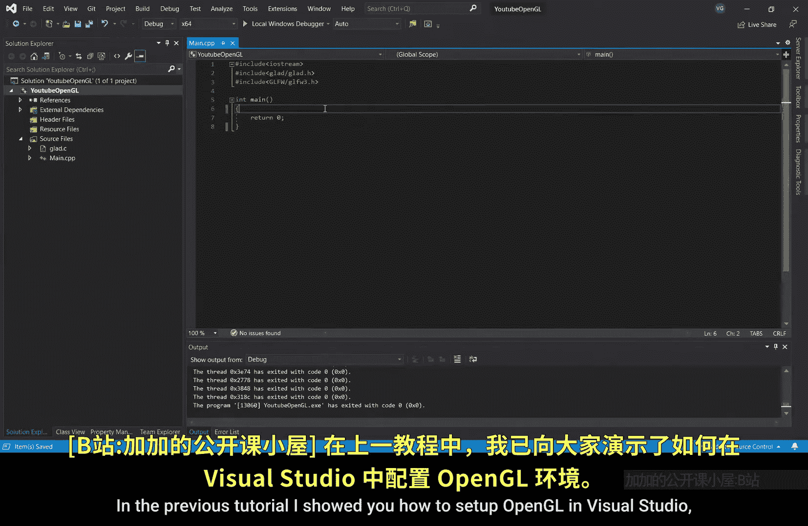

We're going to use GFW to do that， so the first thing we need to do is initialize it so we can properly use its functions。

And since we've initialized it， we should also terminate it before the function ends。

 so I'll add this at the end of the function。

Now JLFW doesn't really know what version of OpenGL we're using。

 so we need to tell it that we can do that by giving it so called hints with a special function that takes a type of hint and a value。

For example， here， I'm giving it a hint that we are going to specify the major version of openGL that we are using。

 and then I give it the version itself， which is3 since we are using OpenGL 3。3。

Now I' just going to do the same for the minor version， which is the exact same one。

The last hint we have to give it is about which open GL profile we want to use。

 So I'll type GL F W underscore Open GL underscore profile。

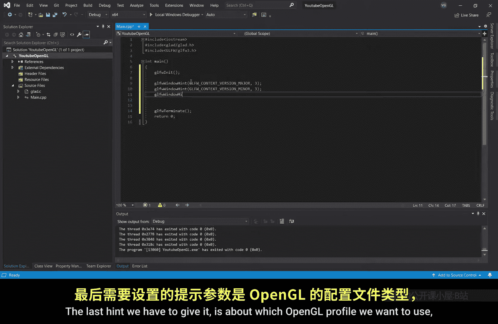

Now an open gel profile is sort of like a package of functions， as far as I know。

 there are only two packages。

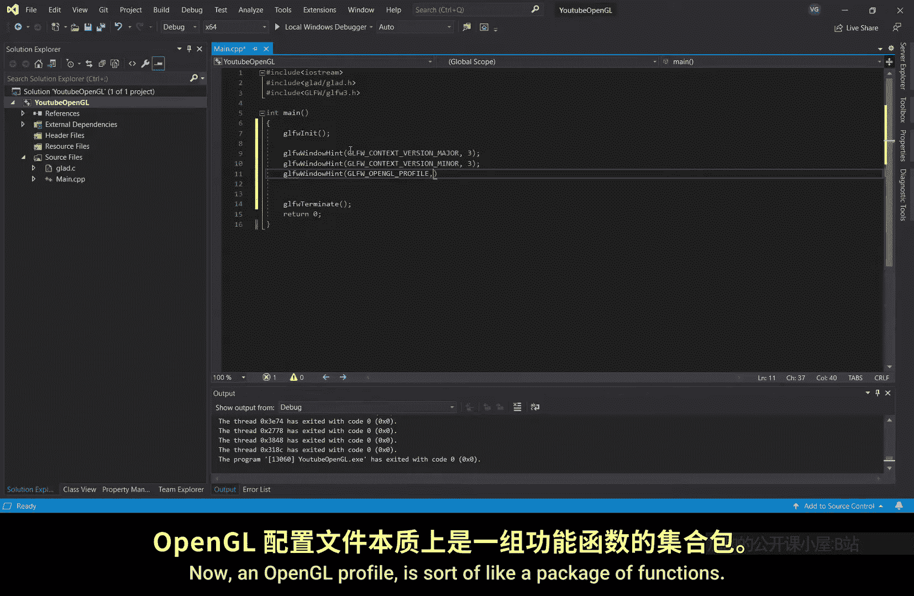

Core， which contains all the modern functions and compatibility。

 which contains both the modern and outdated functions。 We only care about the modern ones。

 so I'm going to use the core profile。

No， for doing the itself。This is the data type of a window object in GFW。

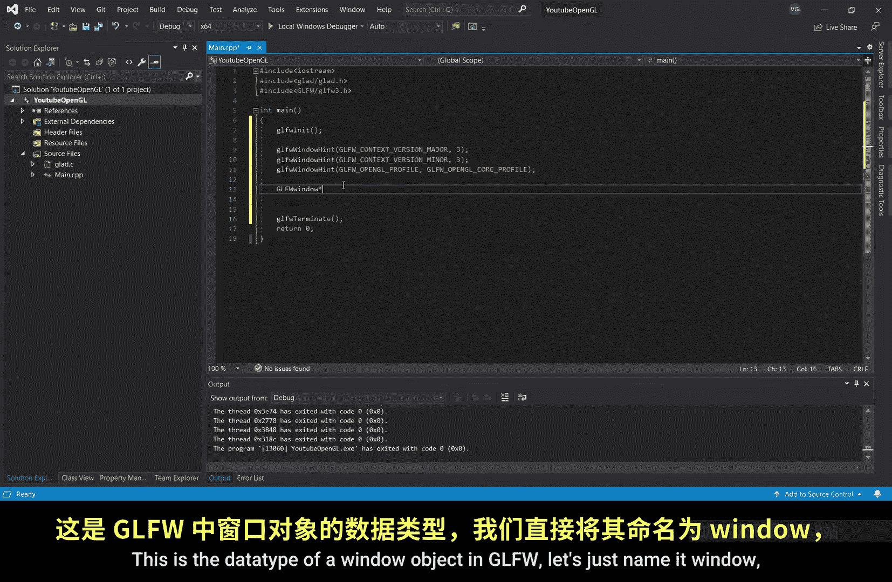

Let's just name in the window。And use the create a window function。

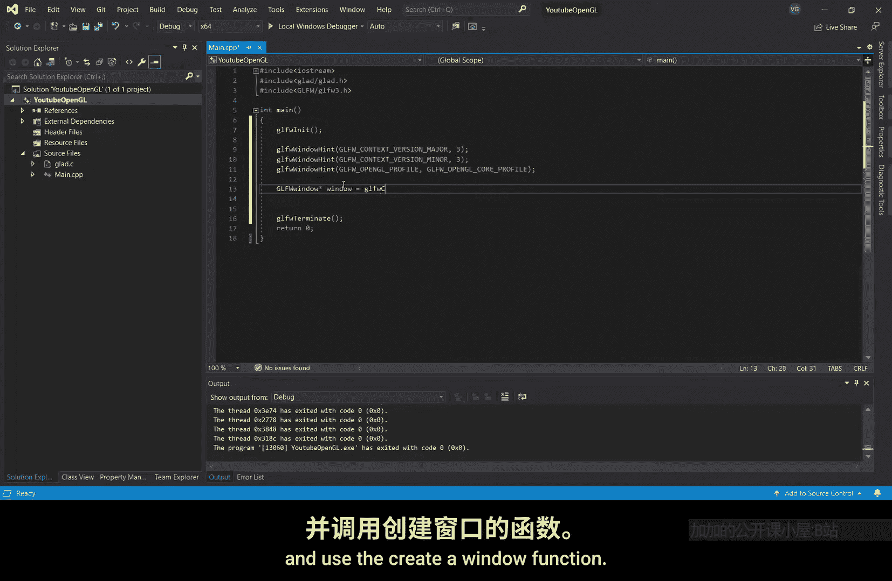

This will take five inputs， the width of the window， the height of the window。

 the name of the window。

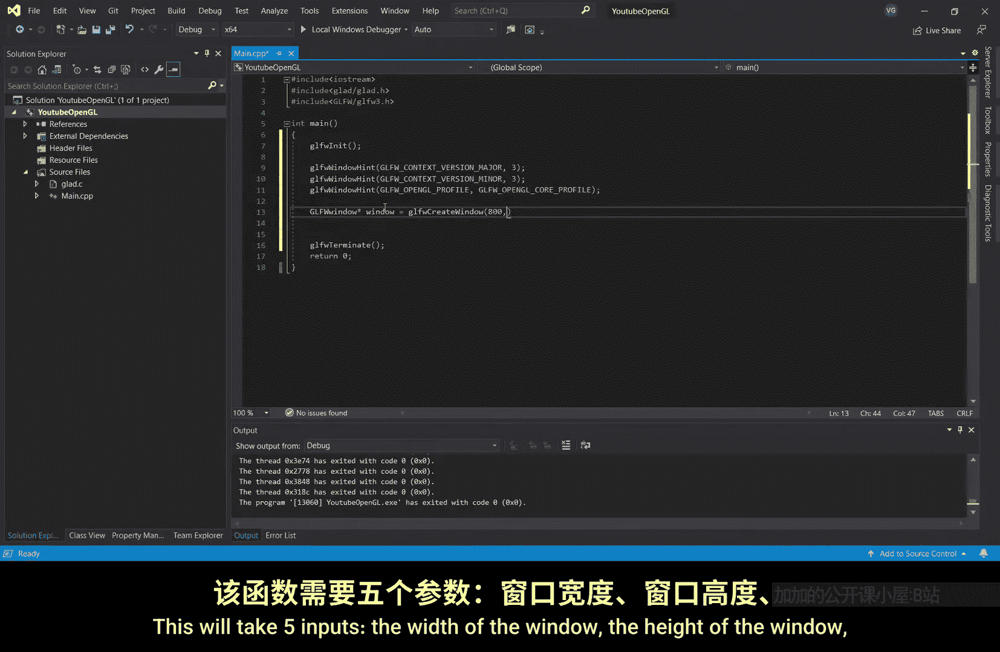

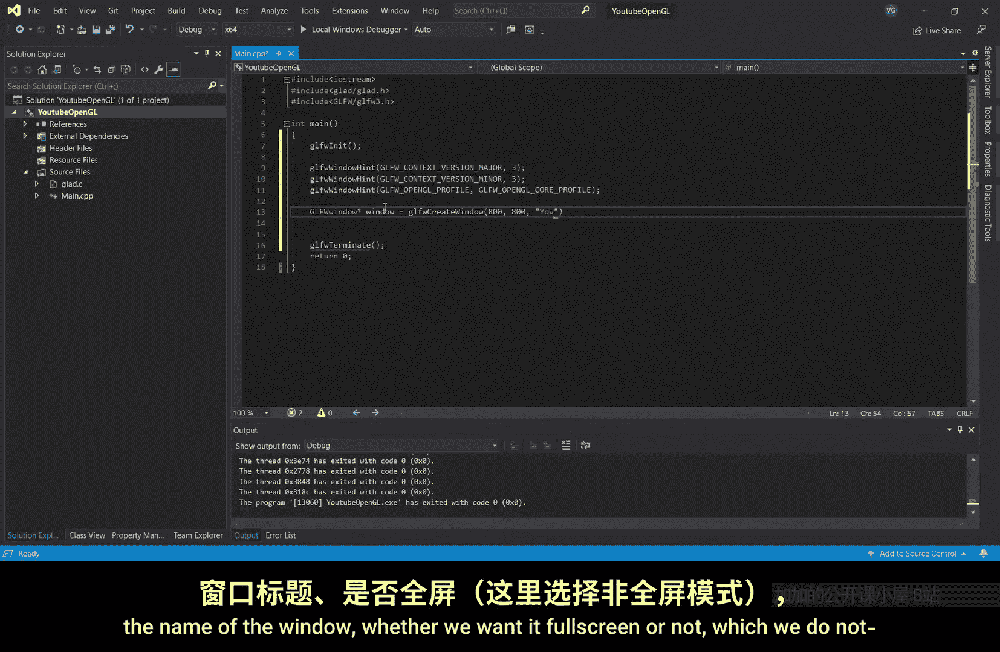

Whether we want it full screen or not， which we do not。

And the last thing is not important。

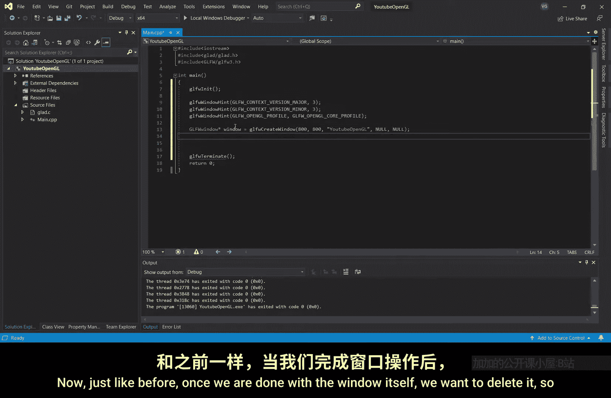

And just be on the safe side， I'll add a bit of error checking in the case in which the window fails to create。

So grid， we now have a window object。Problem is GHW isn't the brightest heat around the block。

 so I don' have to tell him that since we've created the window， we would also like to use it。🤢。

Who would have thought。This tells GFW to make the window part of the current context。

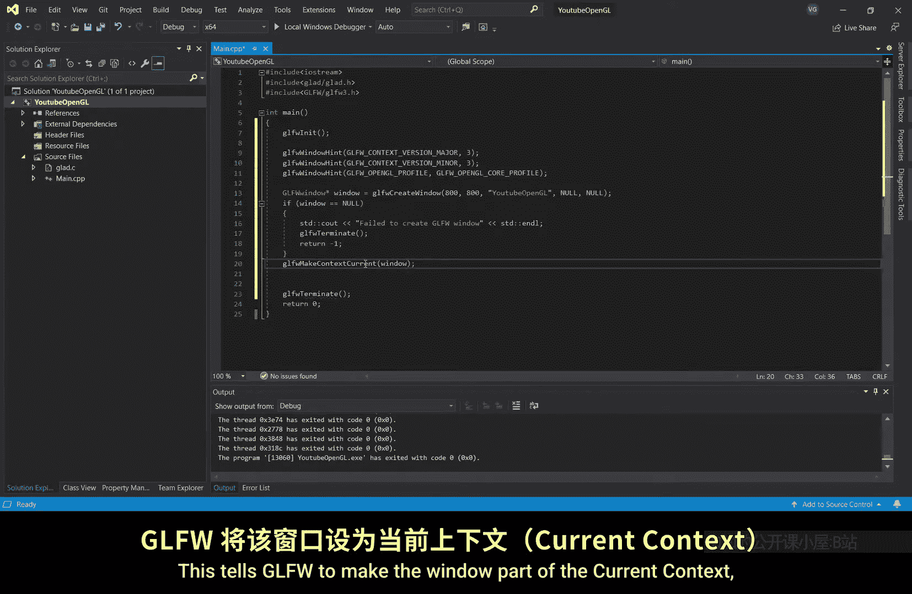

A context being a sort of object that holds the whole of open gel。 It's a bit abstract。

 as context can hold in do many things， but we'll just go with this for now。

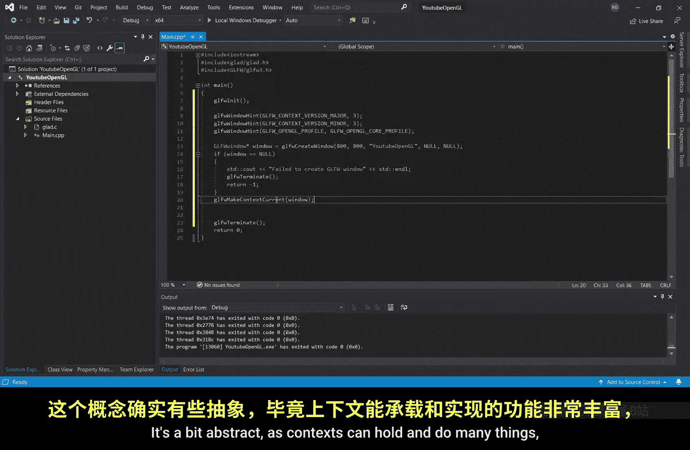

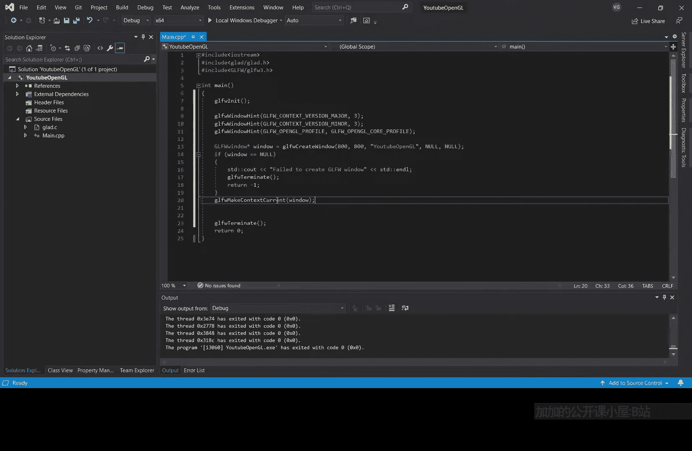

Now just like before， once we are done with the window itself， we want to delete it。

 so let's do that at the end of the main function。

If you run the program now， you'll maybe be able to spot a window。

 pop up and instantly disappear into oblivion。

That happens because once the main function finishes scrap。

