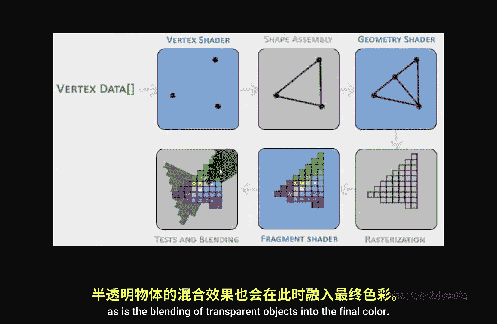
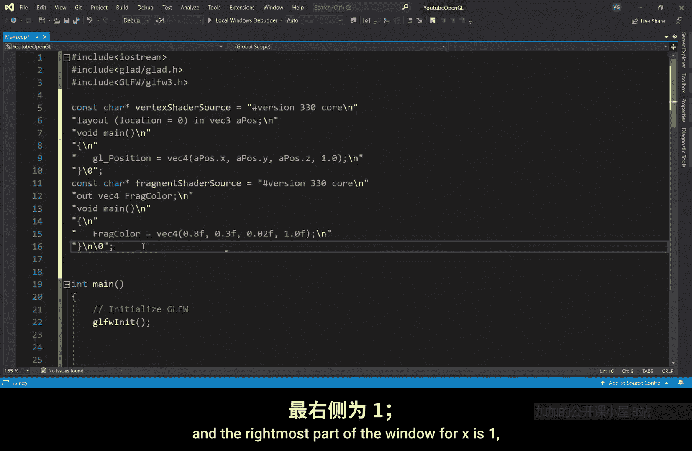

# Victor Gordan【中英⚡OpenGL教程｜OpenGL Tutorial】 p03 P3 Triangle -BV1kkvTz8Egh_p3-

In the last tutorial， I show you how to make a window， so now let's add the triangle to the mix。

But first I'll have to introduce you to something called the graphics pipeline。

 the graphics pipeline is essentially just a series of functions which take some data at the beginning and then at the very end of the graphics pipeline it outputs a frame。

Now the input is called the vertex data， this is just an array of well， vertices。

Though theyre not mathematical vertices， since each vertex， besides having a position。

 also contains other data such as color or texture coordinates。

The first phase of the graphics pipeline is called the vertex shader。

 the vertex shader takes the positions of all the vertices and transforms them， or if you want to。

 it can keep them the exact same way， your choice。Once all the transformations are done。

 the shape asem takes all the positions and connects them according to a primitive。

 But what's a primitive， I hear you asking。 Well， a primitive is just a shape。

 such as a triangle or maybe a point or a line。 Each primitive interprets the data differently for a triangle。

 It would take three points and then draw a triangle between them。

 whereasas a line would take two points at a time and draw lines between them。😊。

Up next we have the geometry shaker which can add vertices and then create new primitives out of already existing primitives。

 but this one is a bit more complex so we won't be seeing it for a long while。

Next comes the rairization phase where all the perfect mathematical shapes get transformed into actual pixels。

 so what before was a perfect mathematical triangle now becomes just a bunch of pixels which are just kind of a bunch of squares。

But these pixels don't really have any colour to them。 So here comes the fragment shader。

 which is one of the most important shaders。 So the fragment shader adds colors to the pixels。

 These depend on many， many things such as the lighting or the textures or shadows。At this point。

 you might have multiple colors for just one pixel because of multiple objects overlapping。

 So that's fixed in the last phase。 as is the blending of transparent objects into the final color。

 Now， for the actual coding。 So sadly， open gel doesn't provide us with defaults for the vertex and fragment shaders。

 So we'll have to write our own。 But since this tutorial doesn't focus on the shaders themselves。

 but rather the overarching process of using the shaders， I'll simply copy paste the shaders scene。

 don't worry， though， I'll be looking at those in a future tutorial。😊。

So first let's specify the coordinates of our vertices for now we're going to work in 2D so we're going to ignore the Z axis。

As for the x and y axis， well their origin is located in the middle of the window with x pointing to the right and y pointing up Now the coordinate system is normalized。

 which means that the leftmost part of the window for x is negative1 and the rightmost part of the window for x is positive one Well for y the lowermost part of。

