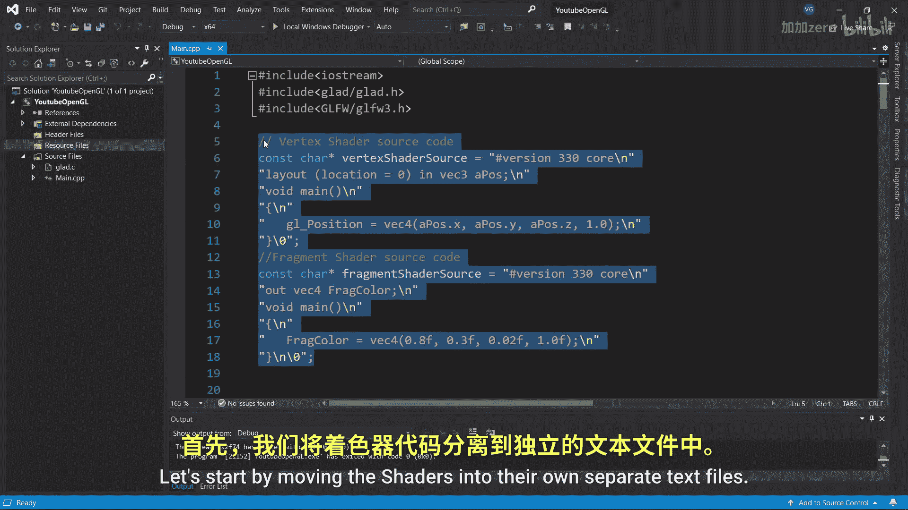
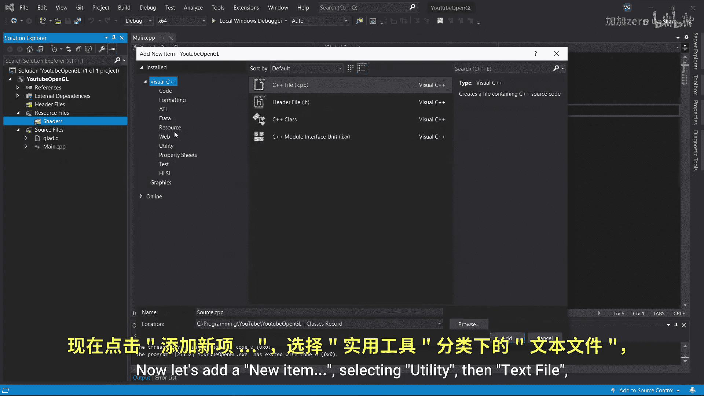
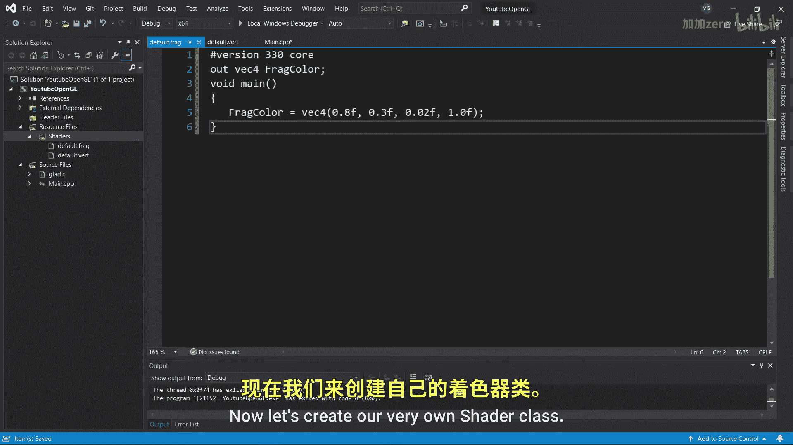
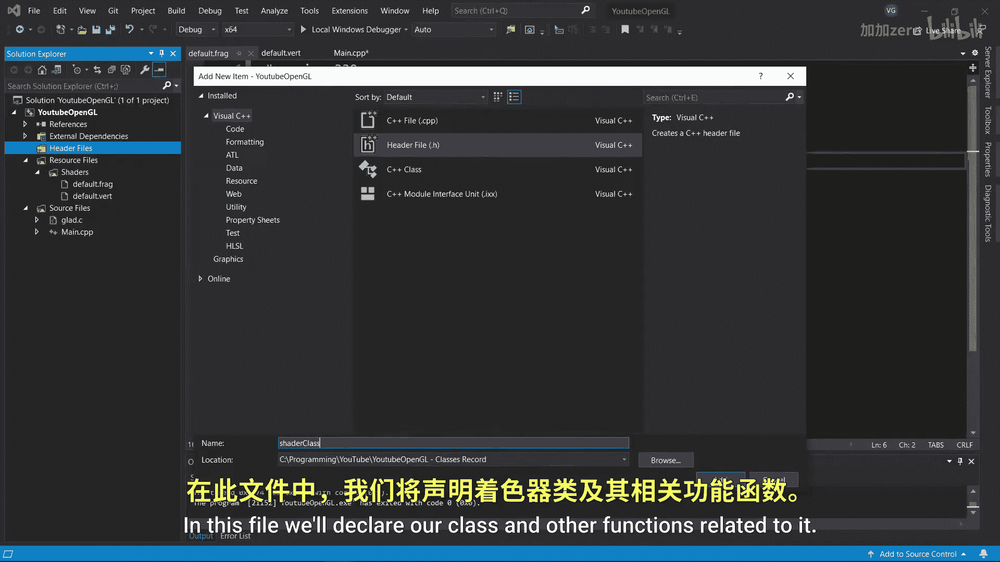
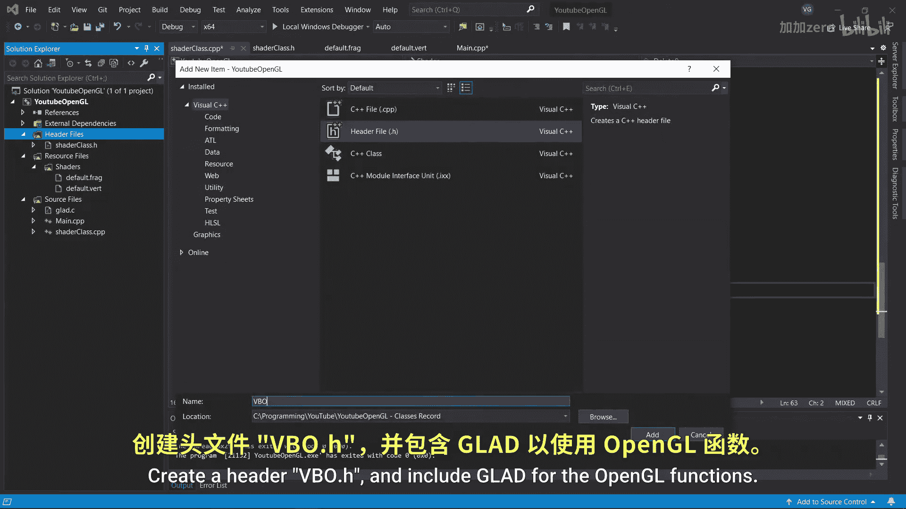

# Victor Gordan【中英⚡OpenGL教程｜OpenGL Tutorial】 p05 P5 Organizing -BV1kkvTz8Egh_p5-

In the last tutorial I showed you how to make an index buffer Now let's organize things a bit since as you can see。

 we have a lot of stuff going on in here。Let's start by moving the shaders into their own separate text files。

Open up the solution Explorer and create a folder called Shars in the Resource files folder。

Now let's add a new item selecting utility， then text file and naming it default dot ver。

Open it up and copy paste the vertex shader source code into it。

Make sure to get rid of the one variable you have and all the quotes and slash ends。

Now do the exact same thing for the fragment shader。

 only name it default dot fragment instead of default dot vert。

Now let's create our very own shader class。

Go to header files， add new item， header file， and name it shaded class dot H in this file well declare our class and other functions related to it。

First， let's write hash F N D E F shader class H。Hash define shader class H hash and if。

This lets C++ know not to open up the file twice since start with great variable clashes。Now。

 we will need to declare a function that will read the shader text files。

I will not go through the details of it， though， since the function itself is irrelevant to open GL。

 just know it outputs the contents of a text file as string。Now， let's declare the shadeder class。

 which will simply be an openG shadeder program that's nicely wrapped up。

Give it a public IDAK reference， declare a constructor that will take in the shader source codes and two functions activate and delete。

Once youre done with that， go to source files and create a CPP file named shaderclass。cppP。

 I'll start by including shaderclass。h and then copy pasting in the file reader function。

 linking the description to all the source code。

Now， let's write a shader constructor。 First， let's get the strings from the text files into two variables and then convert and store them into character arrays。

Now we just need to copy paste all the shader related code from the main function。

 modifying it slightly by replacing Shar program with ID and changing vertex shader source to vertex source and fragment shader source to fragment source。

Don't forget to also write the activate and delete functions by again。

 copy pasting from the main function。

Great， we've made the Shiier class。 Next， let's make a vertex buffer class。

Create a header VpoO。 H and include Gla for the open gel functions。

Now create a VBO class giving it a public ID variable and the constructor that takes some vertices in their sizeizing bytes。

 the size of the vertices is in the GL size IPPTR data type since that's what OpenGL uses for sizes in bytes。

Now just add some declarations for the bind， unbind and deletete functions。

で？