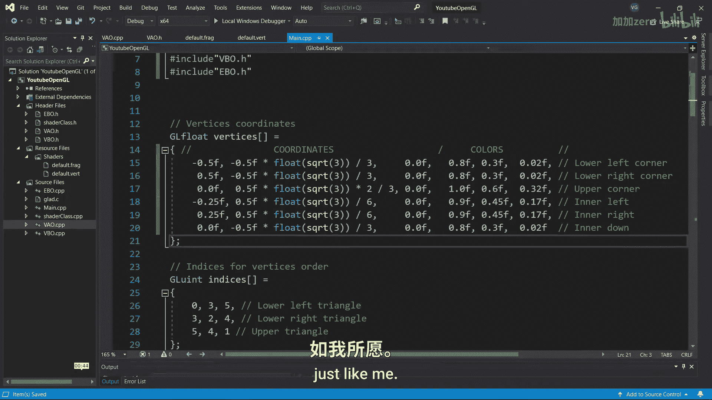
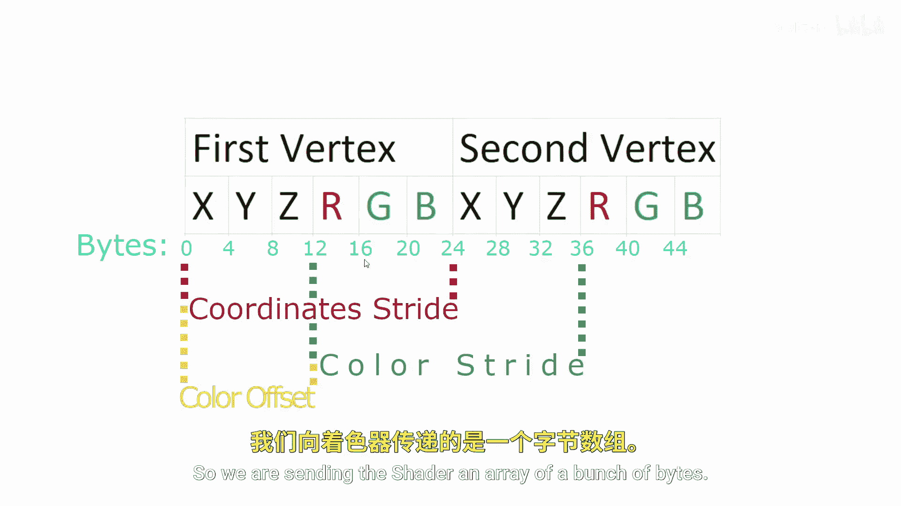

# Victor Gordan【中英⚡OpenGL教程｜OpenGL Tutorial】 p06 P6 Shaders -BV1kkvTz8Egh_p6-

In the previous tutorial， we made some custom classes for our shader program， VAO， VBO and EBO。

 Now let's finally learn more about shaders。 You can think of shaders as functions that run on the GPU。

 Since they are similar to functions， they can take inputs and also have outputs。

So let's take a look at our default vertex shader by looking at this， you might think it's C code。

 but it's actually OpenGL's shading language AkaA GLSL， which has a similar syntax to see。

The first line contains the version of GLSL we are using since we have OpenGL 3。3。

 we need to use GSL 330， the second line takes an input apo using the layout with location 0 layouts help openGL read the vertex data it receives in this case we say that on the zero layout there is a vector data type for positions。

Now， for the main function， we simply assign GL position a V 4 with all our positions。

 plus an arbitrary one for the fourth dimension， which we can ignore for now。

 Open gel recognizes the keyword GL position and knows in each to use it as the position for the vertex。

 you can think of this shader as outputting gel position。

 even though it doesn't specifically do that。 On the other hand。

 the fragment shader specifically says on the second line that it outputs a V4 color。

Now for the main function， we simply gave it a color in ourGBA format to use for all the vertices。

But instead of having one color for all the points， let's give each vertex its own color。

 So I'll start by writing RGB values after each position in the vertices array。

 Then I'll add a second layout with location  one that takes a vector named a color。😊。

But since the fragment shader is the shader that takes care of colors。

 we need to output the colors from the vertex shader to the fragment shader。To do that。

 I'll output a vector named color。 and in the main function。

 make it equal to the a color imported from the vertices array。 Now， in the fragment shader。

 I'll input the exact same vector named color。It's very important to give inputs and outputs the same name。

 since otherwise Opengel wouldn't know to make the link between them in the first place。

 And the final step for this shader is to make f color equal to color。

 since that's what we are outputting。Now we should configure the vertex attribute pointers。

 but first we need to modify a function from the VAO class。

Let's change link V to link ariib and add four variables， nu components， type， strip and offset。

Now do the same in the VAO that CPP file and adding the new variables as inputs to the G vertex attribute pointer just like me。

So we are sending the shader an array of a bunch of bytes in order for openG to know how to interpret all of them。

