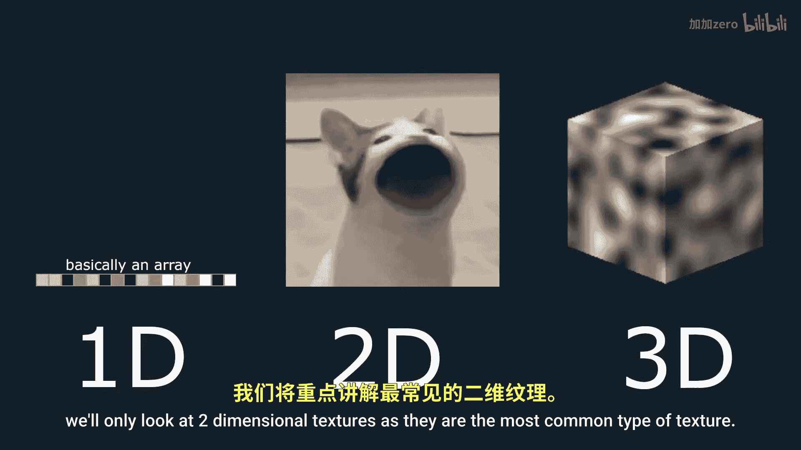
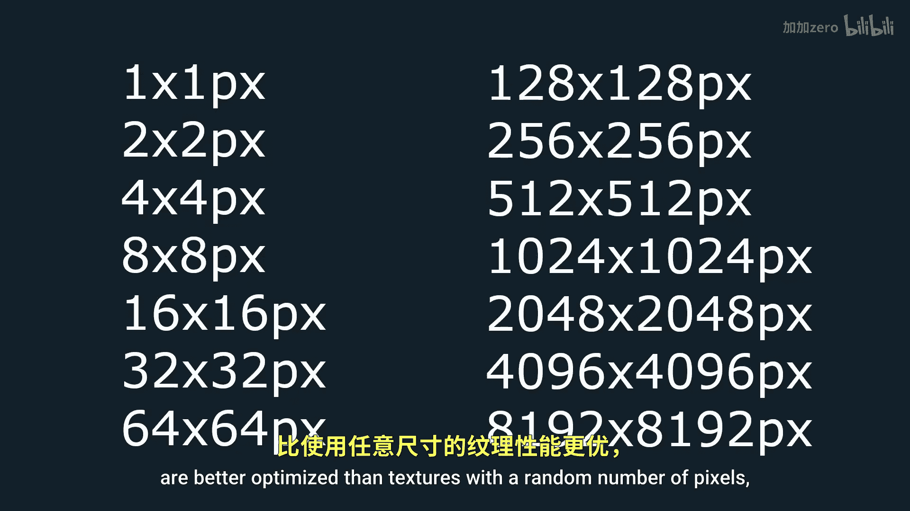
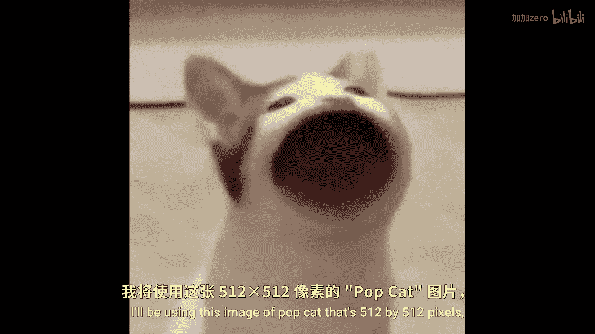
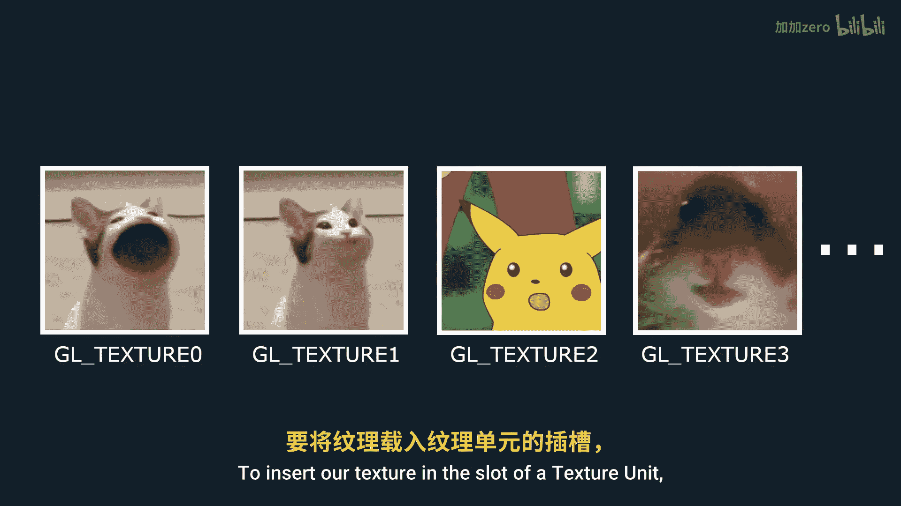

# Victor Gordan【中英⚡OpenGL教程｜OpenGL Tutorial】 p07 P7 Textures -BV1kkvTz8Egh_p7-

In the last tutorial， I showed you the basics of shaders。 So now let's take a look at textures。

 Ttures can be one dimensional， two dimensional or three dimensionsional， But in this tutorial。

 we'll only look at the two dimensionsal textures as theyre the most common type of texture。

 So the first thing we'll want to do is to import an image into our program so that we can make it into a text and displayed in order to do that。

 we're going to use this popular open source library called Sb to install it。

 go to your project folder then libraries and then include Now create a folder named SB and inside of it。

 create a text file named Sb underscore image that text Now go to the link I left in the description。

 press control a to select everything and then copy paste it into the text file we've just created make sure to save it and then rename it to SB underscore image that H。

 Now create a CPP file named SB CP in your project source files and write。

Following into it。 so that we'll only use the things we need from this library。 Now， right。

 click the CPP file and click on compile。 Make sure to only do these ones。That's it。

 Now if you want to use the library， simply include the header file into the file you want to use it in。

 I'll do that in the main dot CPP file。Now， before we get to the texture。

 let's make sure we have the coordinates for a square so that we can better see our texture when displayed。

 Don't forget to also change our indices and the geora elements function。

 Run your program to make sure you do indeed get a square。 If everything is all right。

 then let's import our imaging。 Keep in mind that square textures in powers of two such as 1024 by 1024 pixels or 2048 by 2048 pixels are better optimized than textures with the random number of pixels。

 So do try to make them fit this format。 using this image of pop yet that's 512 by 512 pixels which I'll put into a textures folder in resource files。

 Don't forget to also put the image in your project's main folder。 First。

 we have to create three integer variables to sort the width and height of the image in pixels and the number of。

The channels， it has。Then we'll store the image itself in an unsigned character array named white using the function SDbiI underscore load and giving it the location and name of the image。

 the pointers of the variables we created in0。 That's it for importing it in easy right Now let's create the texture object itself。

 just like any open gel object will first create a reference variable of type GL U I and T and name it texture。

Now， just use gel gen textures to generate the texture object。

 giving it the number of textures you want one in our case。

 and the pointer to the reference variable。 Since we've created it。

 we also want to delete it at the end of the main function。

 We now need to assign the texture to a texture unit。

 You can think of texture units as slots for textures that come together as a bundle。

 These generally hold about 16 textures and allow the fragmentator to work with all 16 textures at the same time。

 to insert our texture in the slot of a texture unit。 We simply need to activate the texture unit。

 We want using gel。

