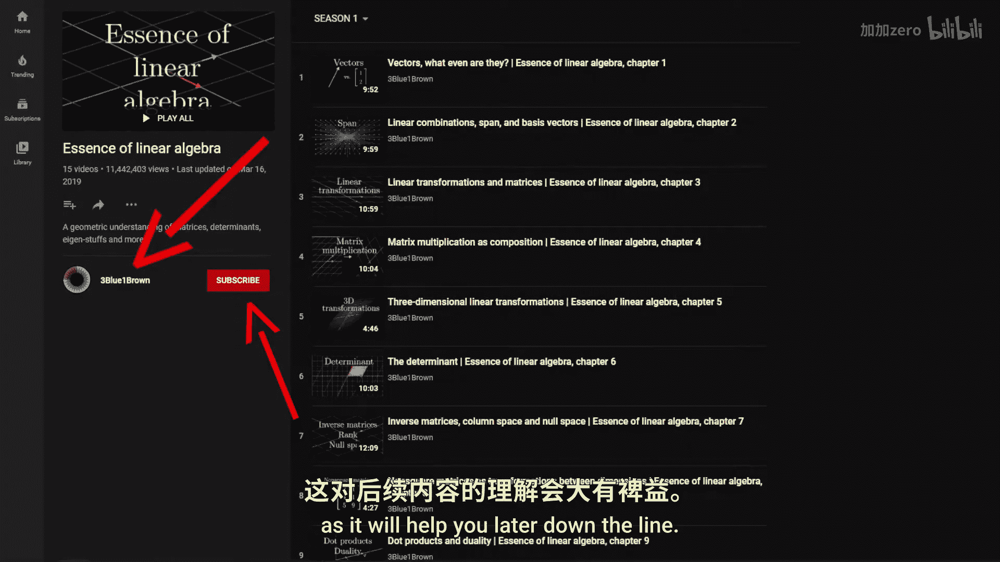
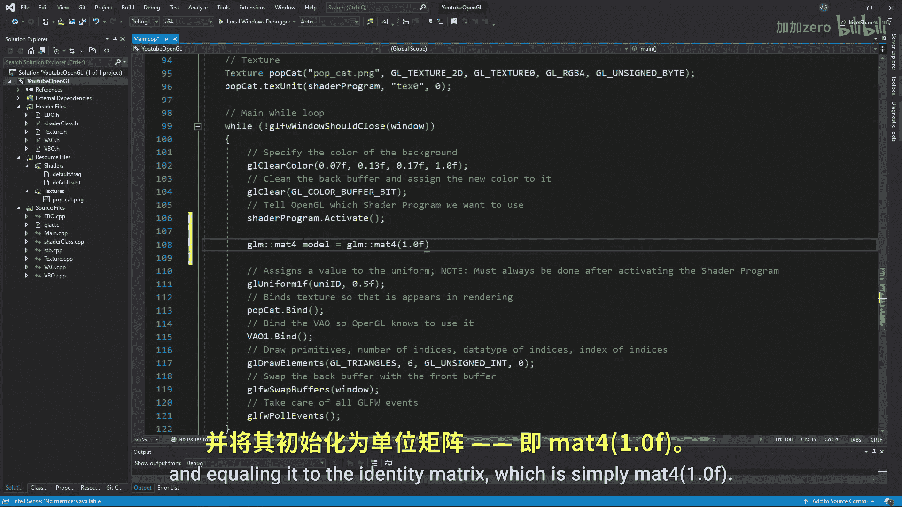

# Victor Gordan【中英⚡OpenGL教程｜OpenGL Tutorial】 p08 P8 Going 3D -BV1kkvTz8Egh_p8-

In the last tutorial， I showed you how to add textures to your scene。 Now。

 it finally leave the boring to the plane and ascend to three dimensions。

 But first a little correction for my past videos in the VaO and texture class。

 I forgot to make the VBO and shader inputs references。 So just add an and sign like so。

 Now for the main part， as I have mentioned before。

 Opengi restricts our coordinates to normalized coordinates。

 So in order to bypass this and enrich our coordinates with a wider range for three dimensions。

 we can contract and expand the different coordinates using matrices。

If you don't know much about matrices， then you should still be able to somewhat follow along。

 but I highly recommend you watch3 blue1 bronze linear algebra playlist first as it will help you later down the line In any case we'll be using this nice little library called GLM for our matrices So go to this website that's down in the description and click on download。

 go to your library folder then include now open up the zip file。

 go into GLM and now extract the folder named GLM into your include folder Once that's done go to your project and include the following parts of the library That's it we can now use matrices easy。

Alright， theory time。 So in order to get a nice 3D image in perspective。

 we need to apply different matrices to different coordinates。

 Let's take a look at these types of coordinates。 First， we have the local coordinates。

 These are the coordinates whose origin is the same as an objects origin。

These are usually located at the center of an object， but that's not always the case。

Then we have the world coordinates， whose origin is at the center of the world。

 These coordinates usually contain the location of other objects。 Next， we have the view coordinates。

 which have the same origin as a camera or viewpoint。

 noticeice that these do not yet account for perspective。

 perspectivetive is added in the next set of coordinates， which are the clip coordinates。

 These are essentially the same as the view coordinates， except they clip Aka delete。

 Any vertices outside the normalized range and can also account for perspective。

 and the final coordinates are the screen coordinates where everything is flattened out so that it can be viewed on your screen。

 Now， in order to move from a coordinate system to the next。 we make is of matrices。😊。

There are three main matrices we made use of， the model matrix。

 which takes local coordinates to world coordinates。The view matrix。

 which takes world coordinates to view coordinates and the projection matrix。

 which takes view coordinates to clip coordinates the final transformation from C coordinates to space coordinates is done automatically all these matrices we are applying R 4D but we won't have to actually write them ourselves since GLM can take care of that So let's create the model matrix we start by creating a variable called model of type math 4 and equaling it to the identity matrix which is simply mat 41。

0 This is called initialization and it must be done since otherwise。

