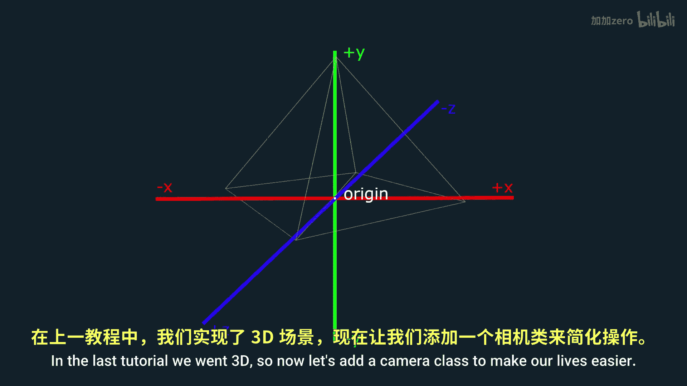
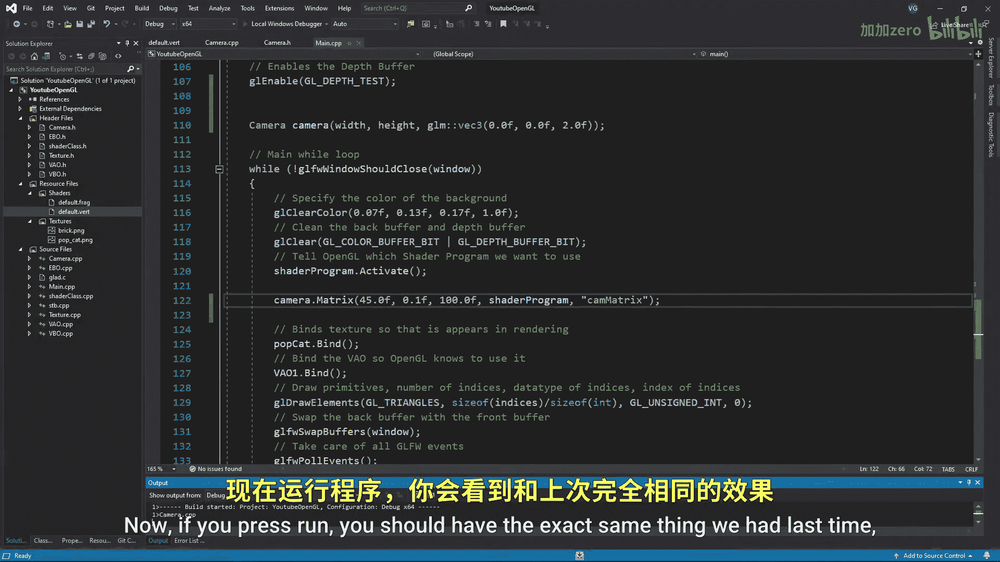
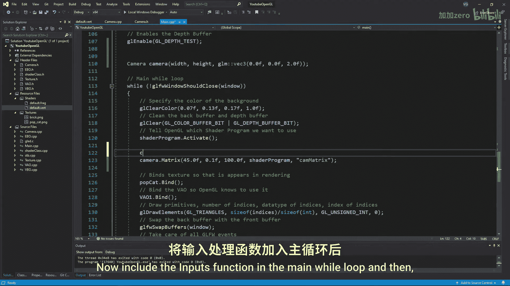

# Victor Gordan【中英⚡OpenGL教程｜OpenGL Tutorial】 p09 P9 Camera -BV1kkvTz8Egh_p9-

In the last tutorial， we went 3D。 So now let's add a camera class to make our lives easier。 First。

 start by creating a header file named camera dot H， preventing C plus plus from opening it twice。

 and including all of the following for the camera class will put everything in the public section。

 starting with the victory for the position of the camera。

 a victory for the orientation ak direction of the camera and another victory for the up direction。

 Now， we'll also want a place to store our width and height。

 The last two variables will be the speed of the camera and the sensitivity of the camera when looking around。

😊。

I'll also make a very simple constructor， a matrix function which will create and send the view and projection matrices to the shader and a function to handle all the inputs Now create a new CPP file named camera that CP and include the camera header for the constructor will' just assign values to the width height and position for the matrix function we first want to initialize our matrices and then will' make use of the look at function the look at function takes the position from which you want to look at something the target you want to look at and the up vector In our case this would be the camera position。

 the camera position plus our orientation and the up vector。

The orientation vector is always a fl one， and we'll be using it as the vector we want to look at。

 so do say。For the second matrix， we'll just do what we did in the last tutorial。

Then we'll simply export our matrix to the vertex shader。Good。

 now let's go to the main function and include the camera header。 Let's delete the old stuff。

 including the scale uniform we had left over from a few tutorials ago and create a camera object named camera。

 giving it the width and height variables in the position002。😊，Now in the while loop。

 delete the old stuff again and use the matrix function naming the uniform cam matrix。

The last thing we need to do before getting back to what we had last tutorial is to go to the vertex shader and replace all the previous uniforms with a cam matrix uniform Now if you press run you should have the exact same thing we had last time except for the spinning pyramid and the fact that everything is now much cleaner in the main function。

Now let's just add some inputs to the camera， I came up with these on my own。

 so they might not be the best， but they were just fine。

I'll start off with the WasD controls for which we'll simply need to add or subtract from our position the speed times the orientation or the right vector。

 which we get by doing a cross product between the up vector and orientation vector make sure to use ifs and not else ifs since we want to be able to modify multiple of these at the same time in order to go diagonally Now I'll just add space for going up and control for going down and make it so that when I hold shift my speed increases and when I release it my speed goes back to normal Now include the inputs function in the main while loop and then if you boot up the program you'll see that you can move about though you can't really look around so let's add some mouse controls。

