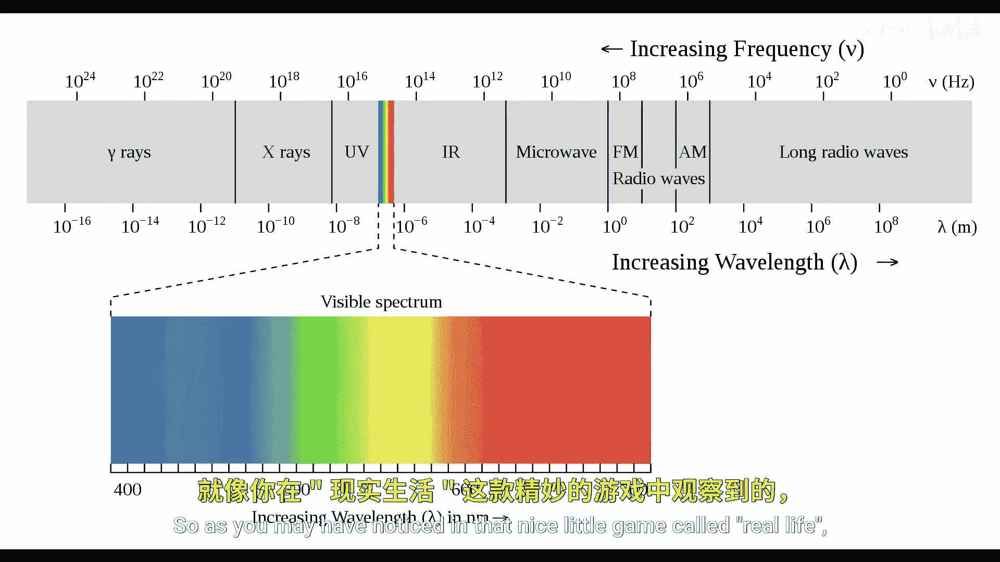
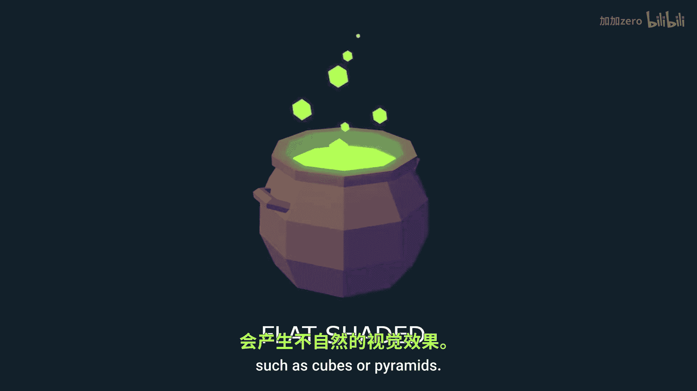

# Victor Gordan【中英⚡OpenGL教程｜OpenGL Tutorial】 p10 P10 Lighting -BV1kkvTz8Egh_p10-

In the last tutorial， I showed you how to make a camera。 so now we'll add some lighting to our scene。

 First， we'll slightly modify the camera class so that we can efficiently use the ca matrix on multiple object and make sure the new camera functions work properly in the main function。

 Next， will add a cube that will serve as our light source。 which my previous tutorials。

 if you don't know how to do this， especially my coordinates video if you don't know what the light pose vector and light model matrix are for。

 Then if you start out the program， you should see your main object and a small cube thus's completely white。

😊。

So as you may have noticed in that nice little game called Real life， light can have multiple colors。

 usually it's white and because of that it shows the true colors of objects so to say but if a light source is let's say red。

 then all objects will appear reddish we can simulate this by multiplying the color of an object with the color of our light。

 both of which are in RGB， for example， if our light has the RGB values of 100。

 then when it's multiplied with the color of the object， the green and blue parts will become0。

 while the red part will stay the same since it's multiplied by one。

This simulates what happens in real life as only the red color is reflected back to us。

 even though the object is actually orange so let's make a V4 called light color and make it completely white then we'll want to export it to both the light fragment chatr and the fragment shader of our object in the light one we'll simply use it as the color of the object while in the object chatar will multiply it by whatever you currently have in your f color we are now able to simulate the color of the light hitting the object so next we'll want to simulate the intensity of that light you've probably noticed that the higher the angle between a surface and the source of light is the less intense color is on that surface this is baseding on a sphere where you can clearly see the gradient of the intensity along the curve of the sphere。

In order to get this angle and calculate the intensity we'll need a position of the light which we already have and the way to know the slope of the surface the traditional way of doing this is to represent the slope of the surface by a normal vector so so far we've had coordinates colors and texture coordinates inside the vertex Now we'll also want to add normals normals are a unit vectors ak vectors of length1 that help us calculate how light should act on a certain object This can be either perpendicular to the surface of one triangle called face normals or arranged in a different way such as being perpendicular to the plane created by all the adjacent vertices for example called vertex normals If you go for the first option you will get what's called flat shading where all your triangles are clearly visible If you go for the second option things look a lot smoother and nicer。

whichhich one you choose depends on your mesh and on your artistic style since we have a pyramid。

 we'll go with a flat shading since the smooth shading looks weird on very angular geometric shapes such as cubes or pyramids Now since the normals will be different on each side of the pyramid we。

