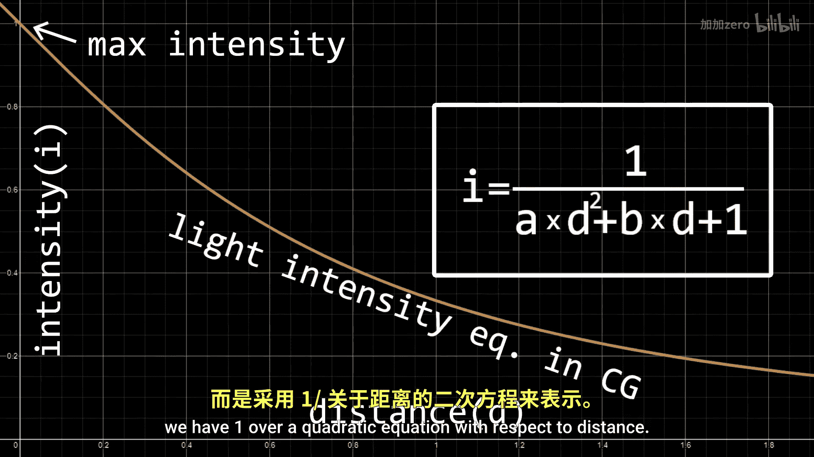
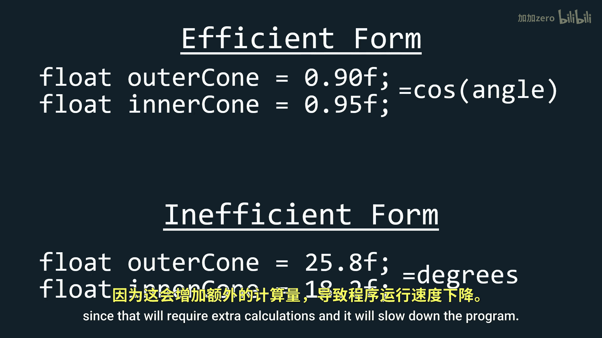

# Victor Gordan【中英⚡OpenGL教程｜OpenGL Tutorial】 p12 P12 Types of Light -BV1kkvTz8Egh_p12-

In the last tutorial， we improved the spec lighting。 Now。

 let's take a look at different types of light。 There are three main types of light。

 Point directional and spotlight。 Point lights illum the environment in all directions。

 but the intensity of their light withers as it gets further away。

 This is the type of light with you still now， except we didn't incorporate the loss of intensity。

 So let's quickly do that。 First， let's create a vector function named point light and copy paste into it all the things from the main function and make frac color equal the output of this function。

 So the intensity of light has an inverse square relationship to distance in real life。

 but in computer graphics we use a somewhat more complicated equation to better control the properties of the light。

 instead of having one over distance squared。 we have one over a quadratic equation with respect to distance。

 This quadratic equation has two constants A the quadratic term。😊。

B the linear term， we can modify this to change how fast the intensity dies out and how far the light reaches。

 There is no general perfect number for these constants。

 you just have to play with them and see what works for your scene。

 Just note that usually the numbers are smaller than one if you want your light to reach somewhat far so to implement this we first need a distance to the light The distance is simply the length of the vector that comes from subtracting current position from light position Since we already use this in our diffused lighting I'll create a variable named light vector so that we don't have to calculate it twice Now we can get a distance by simply using the length function Lastly we just write out the equation weight the variables and apply to the specular and diffused lighting Here are some examples of the results I got using different constants The second type of light is the directional light This is usually considered to be so distant from your scene that the light raise。

It emits are essentially parallel to one another just like the rays of the sun。

 This has no dimming and is actually the easiest of the three to implement。

 We just need to copy paste part of the code from the point light and instead of calculating the light direction based on some positions we simply give it a constant light direction as a normalized vector3 Just note that it should pointing the opposite direction you want to effect due to the way I wrote the code here So if you want the light to come from above it should point up not down and if you press run you'll see everything is lit up as it should be the last type of light is the spotlight the spotlight only lights aonic area just like a flashlight or a disk clamp for this will copy paste the point light code again and begin by adding two floats which will represent the codes and values of two angles The first angle is the angle between the inner cone and the direction of the light and the second angle is the angle between the outer。

e in the direction of the light we make use of these two cones in order to have a nice gradient between darkness and light areas。

 since if we only made the use of one cone we will just have a direct cutoff from light to darkness a the cosine value directly in order to save computational power do not write the inner and outer cones in terms of angles since that will require extra calculations and it will slow down the program Now we need。

